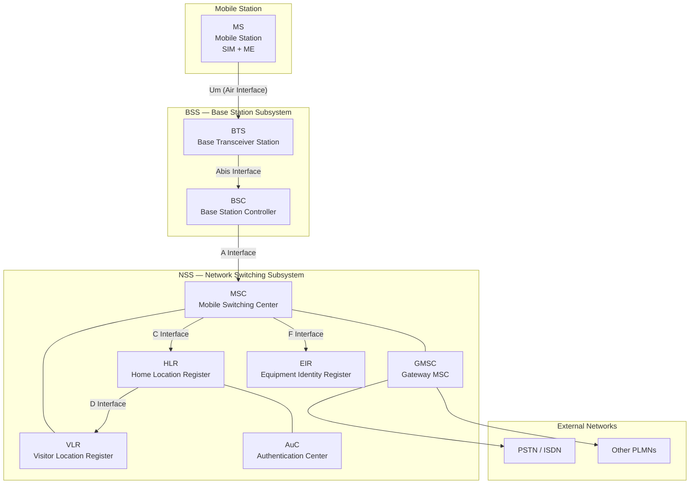
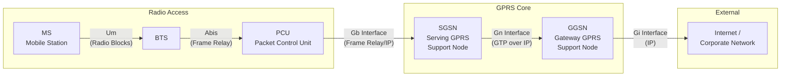
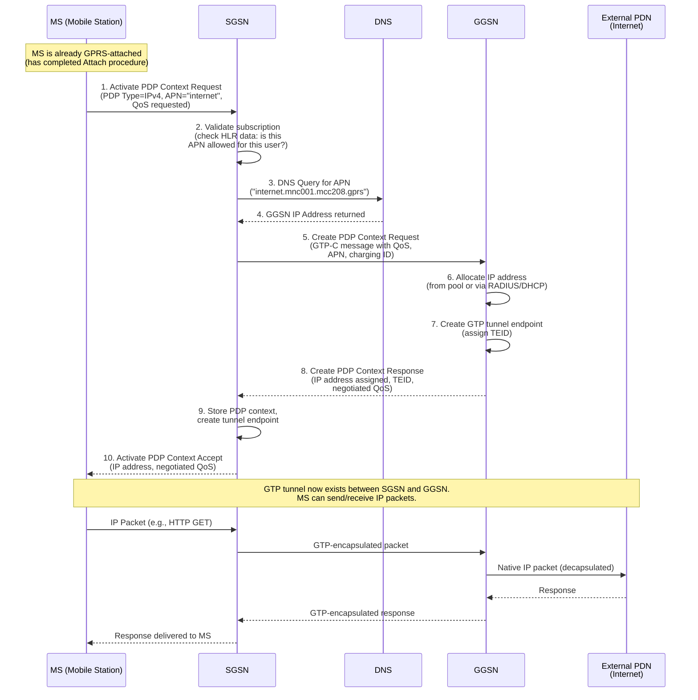

# Module 1: GSM, GPRS, and EDGE

## Advanced Communication Networks — Wireless Laboratory

---

## Learning Objectives

By the end of this module, you will be able to:
- Explain the complete GSM architecture and the role of each network element
- Describe how GSM handles mobility, location management, and authentication
- Articulate **why** GPRS was introduced and what limitations of GSM it addressed
- Explain the GPRS packet-switched overlay architecture
- Describe PDP context activation and GPRS mobility management
- Explain how EDGE improved data rates through modulation changes
- Trace the evolution path from GSM through EDGE to 3G

---

## 1. GSM Architecture

### 1.1 WHY GSM?

Before GSM (Global System for Mobile Communications), Europe had multiple incompatible analog cellular systems (NMT, TACS, C-Netz). A subscriber in France could not roam to Germany. GSM was created to solve three fundamental problems:

1. **Interoperability** — One standard across all of Europe (and eventually the world)
2. **Security** — Analog systems had no encryption; anyone with a scanner could listen
3. **Capacity** — Digital modulation serves more users per MHz of spectrum

### 1.2 GSM Network Architecture Diagram



### 1.3 Understanding the Architecture Layers

The GSM architecture is organized into three logical subsystems, each solving a distinct problem:

| Subsystem | Problem It Solves | Elements |
|-----------|-------------------|----------|
| **BSS** (Base Station Subsystem) | Radio access — how does the phone talk to the network? | BTS, BSC |
| **NSS** (Network Switching Subsystem) | Call routing — how do calls get connected? | MSC, GMSC, HLR, VLR, AuC, EIR |
| **OSS** (Operation Support Subsystem) | Management — how do operators monitor and configure the network? | OMC, NMC |

---

## 2. GSM Network Elements — Detailed Explanation

### 2.1 Mobile Station (MS)

**What it is:** The subscriber's device, consisting of two parts:
- **ME (Mobile Equipment):** The physical handset hardware, identified by its IMEI
- **SIM (Subscriber Identity Module):** A smart card carrying the subscriber's identity (IMSI), authentication key (Ki), and algorithms

**Why it's split into ME + SIM:** This separation means you can swap your SIM into any phone and keep your number, or an operator can block a stolen phone (by IMEI) without affecting the subscriber's account.

### 2.2 Base Transceiver Station (BTS)

**What it is:** The radio equipment (antennas, transceivers, amplifiers) at a cell site.

**Why it exists:** Someone has to convert between the wired network and radio waves. The BTS handles:
- Transmission and reception of radio signals
- Channel coding and encryption at the air interface
- Frequency hopping (if configured)
- Timing advance measurements (to compensate for propagation delay)

**Key insight:** The BTS is intentionally "dumb" — it has minimal intelligence. This is a deliberate design choice so that expensive radio sites don't need software upgrades for new features.

### 2.3 Base Station Controller (BSC)

**What it is:** The intelligence behind multiple BTSs. One BSC typically controls dozens to hundreds of BTSs.

**Why it exists:** The BSC solves the **resource management** problem:
- **Handover decisions:** When should a call be moved from one BTS to another? The BSC collects measurements from the MS and neighboring BTSs to decide.
- **Radio resource allocation:** Which frequency and timeslot should be assigned to a new call?
- **Power control:** Instructs the MS and BTS to adjust power (saves battery, reduces interference)
- **Transcoding:** Converts between the compressed speech codec on the air interface (13 kbps) and standard 64 kbps PCM used in the core network

### 2.4 Mobile Switching Center (MSC)

**What it is:** A telephone exchange specifically designed for mobile subscribers.

**Why it exists:** The MSC solves the **call routing for mobile users** problem. Unlike a fixed-line exchange, the MSC must handle:
- **Call setup and teardown** for users who may be moving
- **Handover between BSCs** (inter-BSC handover)
- **Interface to external networks** (PSTN, ISDN, other mobile networks)
- **Supplementary services** (call forwarding, call waiting, conference calls)
- **Coordination with VLR** for subscriber validation

### 2.5 Gateway MSC (GMSC)

**What it is:** A specialized MSC that acts as the entry point for calls coming FROM external networks.

**Why it exists:** When someone on a landline calls a mobile subscriber, the call arrives at the GMSC. The GMSC's job is to **find the subscriber** — it queries the HLR to determine which MSC/VLR area the subscriber is currently in, then routes the call there. Without the GMSC, external networks would need to know the internal structure of the mobile network.

### 2.6 Home Location Register (HLR)

**What it is:** The central database containing ALL permanent subscriber information.

**Why it exists:** The HLR solves the **"where is this subscriber?"** problem. It stores:
- Subscriber identity (IMSI, MSISDN)
- Subscription information (which services are allowed)
- **Current location** (which VLR/MSC area the subscriber is registered in)
- Call forwarding settings
- Supplementary service data

**Key insight:** There is logically ONE HLR per network (though physically it may be distributed). It is the single source of truth about every subscriber.

### 2.7 Visitor Location Register (VLR)

**What it is:** A temporary database associated with each MSC, holding information about subscribers currently in that MSC's area.

**Why it exists:** The VLR solves the **performance** problem. Without it, every single call setup would require a query to the HLR (which could be far away). Instead:
1. When a subscriber enters an MSC area, the VLR fetches their profile from the HLR
2. Subsequent operations use the local VLR copy
3. This reduces signaling load on the HLR and reduces call setup latency

The VLR also stores temporary data: the TMSI (temporary identity), location area, and authentication triplets.

### 2.8 Authentication Center (AuC)

**What it is:** A protected database storing the secret authentication keys (Ki) for every subscriber.

**Why it exists:** The AuC solves the **"how do we prove this subscriber is genuine?"** problem. It:
- Stores each subscriber's Ki (which never leaves the AuC or SIM)
- Generates authentication triplets (RAND, SRES, Kc) on request
- Protects against cloning and unauthorized access

**Why it's separate from the HLR:** Security isolation. The Ki values are extremely sensitive. By placing them in a physically secured, separate element, a compromise of the HLR doesn't expose authentication keys.

### 2.9 Equipment Identity Register (EIR)

**What it is:** A database of mobile equipment identities (IMEIs) classified into three lists:
- **White list:** Approved equipment
- **Grey list:** Equipment under observation (perhaps reported lost but not confirmed)
- **Black list:** Stolen or non-type-approved equipment — service denied

**Why it exists:** The EIR solves the **stolen phone** problem. Even if a thief puts a new SIM in a stolen phone, the network can identify and block the hardware by its IMEI.


---

## 3. GSM Interfaces

### WHY standardized interfaces matter

GSM's genius was defining **open interfaces** between elements. This means a BTS from Ericsson can connect to a BSC from Nokia. Without standardized interfaces, operators would be locked to a single vendor for everything.

### 3.1 Interface Summary

| Interface | Between | Protocol Stack | Purpose |
|-----------|---------|---------------|---------|
| **Um** | MS ↔ BTS | LAPDm / RR / MM / CC | Air interface — the radio link |
| **Abis** | BTS ↔ BSC | LAPD over PCM (E1/T1) | Carries traffic + signaling from radio sites to controller |
| **A** | BSC ↔ MSC | MTP / SCCP / BSSAP | Connects radio subsystem to switching subsystem |
| **B** | MSC ↔ VLR | MAP | MSC queries local VLR for subscriber data |
| **C** | GMSC ↔ HLR | MAP | GMSC asks HLR where to route incoming calls |
| **D** | VLR ↔ HLR | MAP | Location updates, subscriber data transfer |
| **E** | MSC ↔ MSC | MAP / ISUP | Inter-MSC handover |
| **F** | MSC ↔ EIR | MAP | IMEI checking |
| **G** | VLR ↔ VLR | MAP | Subscriber info transfer during inter-VLR moves |
| **H** | HLR ↔ AuC | Proprietary | Authentication vector requests |

### 3.2 The Um Interface (Air Interface) — In Depth

The Um interface is the most complex because it must deal with the hostile radio environment:

- **Multiple access:** TDMA with 8 timeslots per 200 kHz carrier (FDMA/TDMA hybrid)
- **Modulation:** GMSK (Gaussian Minimum Shift Keying) — chosen for constant envelope (efficient power amplifiers) and spectral efficiency
- **Frame structure:** Hyperframe → Superframe → Multiframe → Frame → Timeslot → Burst
- **Logical channels:**
  - **TCH (Traffic Channel):** Carries user speech/data
  - **BCCH (Broadcast Control Channel):** System info broadcast to all phones
  - **RACH (Random Access Channel):** MS requests access (slotted ALOHA)
  - **PCH (Paging Channel):** Network pages MS for incoming call
  - **SDCCH (Standalone Dedicated Control Channel):** Signaling (SMS, location update)
  - **SACCH/FACCH:** Associated control for measurements and handover commands

### 3.3 The Abis Interface

**Why it exists:** BTS sites are remote (mountain tops, rooftops). The Abis interface lets them connect back to the BSC over standard 2 Mbps E1 lines (or microwave links). It carries:
- 16 kbps traffic channels (compressed speech)
- Signaling messages (LAPD protocol, similar to ISDN)
- Operation & Maintenance messages

### 3.4 The A Interface

**Why it exists:** This is where the radio world meets the telephony world. The A interface carries:
- 64 kbps PCM speech (after transcoding from 13 kbps)
- BSSAP signaling (BSS Application Part) over SS7

---

## 4. GSM Mobility & Location Management

### 4.1 WHY Location Management Is Needed

The fundamental challenge of mobile networks: **how do you deliver a call to someone whose location is unknown?**

Naive solution: Page every cell in the network. Problem: This doesn't scale — millions of subscribers would require constant paging on every cell.

GSM's solution: **Location Areas (LA)**

### 4.2 Location Area Concept

- The network is divided into **Location Areas**, each containing multiple cells (BTSs)
- Each LA has a unique **LAI** (Location Area Identity) = MCC + MNC + LAC
- The network only knows a subscriber's location to the **LA granularity**
- When a call arrives, the subscriber is paged in ALL cells of their current LA

**Trade-off:** 
- Smaller LAs → less paging load, but more location updates (signaling)
- Larger LAs → fewer location updates, but more paging traffic
- Operators tune LA sizes based on traffic patterns

### 4.3 Location Update Procedure

A mobile performs a **location update** when:
1. **Normal location update:** MS detects it has entered a new LA (different LAI on BCCH)
2. **Periodic location update:** Timer expires — proves the MS is still reachable
3. **IMSI attach:** MS is powered on and registers with the network

**Location Update Flow:**
1. MS sends LOCATION UPDATING REQUEST to new MSC/VLR
2. New VLR contacts HLR: "Subscriber X is now here"
3. HLR sends subscriber profile to new VLR
4. HLR tells OLD VLR to delete the subscriber record
5. New VLR confirms to MS: LOCATION UPDATING ACCEPT
6. MS stores new TMSI (if reassigned)

### 4.4 TMSI — Temporary Mobile Subscriber Identity

**Why:** Broadcasting the IMSI over the air interface would let eavesdroppers track subscribers. The TMSI:
- Is assigned by the VLR and has only local significance
- Is changed frequently (at each location update or call)
- Means the permanent identity (IMSI) rarely travels over the air

---

## 5. GSM Authentication & Security

### 5.1 WHY Authentication Is Critical

Without authentication:
- Cloned SIMs could make calls billed to someone else
- Unauthorized users could access the network
- Eavesdroppers could intercept calls

### 5.2 The Authentication Triplet Mechanism

GSM uses a **challenge-response** protocol based on shared secret cryptography.

**The players:**
- **Ki:** A 128-bit secret key, stored ONLY on the SIM and in the AuC. It **never** travels over any interface.
- **RAND:** A 128-bit random number generated by the AuC (the challenge)
- **SRES:** A 32-bit Signed Response (the expected answer)
- **Kc:** A 64-bit cipher key for encrypting the air interface

**How it works:**

```
AuC side:                          SIM side:
─────────                          ─────────
Ki (stored)                        Ki (stored)
RAND (generated randomly)          RAND (received from network)
    │                                  │
    ▼                                  ▼
┌─────────┐                       ┌─────────┐
│   A3    │──→ SRES (expected)    │   A3    │──→ SRES (computed)
│Algorithm│                       │Algorithm│
└─────────┘                       └─────────┘
    │                                  │
    ▼                                  ▼
┌─────────┐                       ┌─────────┐
│   A8    │──→ Kc (cipher key)    │   A8    │──→ Kc (cipher key)
│Algorithm│                       │Algorithm│
└─────────┘                       └─────────┘
```

**Step-by-step:**
1. AuC generates RAND, computes SRES = A3(Ki, RAND) and Kc = A8(Ki, RAND)
2. The triplet (RAND, SRES, Kc) is sent to the VLR (pre-computed, stored for later use)
3. When authentication is needed, VLR sends RAND to the MS
4. SIM computes SRES = A3(Ki, RAND) using its stored Ki
5. MS sends SRES back to the network
6. VLR compares received SRES with stored SRES — if they match, subscriber is authentic
7. Both sides now have Kc — used with algorithm A5 to encrypt the air interface

**Why triplets are pre-computed:** The AuC may be geographically distant. Pre-computing multiple triplets and caching them at the VLR means authentication can happen locally without real-time AuC access.

### 5.3 Encryption (A5 Algorithm)

After authentication, both the MS and BTS share Kc. The A5 algorithm generates a keystream that XORs with the traffic. This provides:
- **Confidentiality** on the air interface (Um only — not end-to-end)
- Protection against casual eavesdropping

**Known weakness:** A5/1 has been broken. Modern networks use A5/3 (KASUMI-based) or have moved to 3G/4G with stronger security.


---

## 6. WHY GPRS Was Needed

### 6.1 The GSM Data Problem

GSM was designed for **voice**. Data was an afterthought:

| GSM Data Service | Speed | Problem |
|-----------------|-------|---------|
| CSD (Circuit-Switched Data) | 9.6 kbps | Occupies a full timeslot for entire session |
| HSCSD (High-Speed CSD) | Up to 57.6 kbps | Occupies MULTIPLE timeslots — extremely expensive |

**The fundamental issue: Circuit switching is wrong for data.**

Why? Consider web browsing:
- You request a page (1 second of activity)
- You read it (30 seconds of inactivity)  
- You click a link (1 second of activity)
- You read again (30 seconds of inactivity)

With circuit switching, you're **paying for and consuming a timeslot during those 30 seconds of reading**. The channel is allocated but idle 95% of the time.

### 6.2 What GPRS Provides

**GPRS (General Packet Radio Service)** introduces **packet switching** to GSM:

- Resources are allocated **only when data is actually being sent**
- Multiple users **share** timeslots statistically
- Billing can be **per-megabyte** instead of per-minute
- "Always-on" connectivity — no dial-up delay
- Theoretical speeds: 8 timeslots × 21.4 kbps = **171.2 kbps** (theoretical max)
- Practical speeds: 30–80 kbps

### 6.3 GPRS Design Philosophy

GPRS was designed as an **overlay** on existing GSM infrastructure. Operators didn't need to replace their entire network — they added new packet-switching nodes alongside the existing circuit-switched core. This was critical for business adoption.

---

## 7. GPRS Architecture

### 7.1 New Network Elements

GPRS introduces three key new elements:

#### SGSN — Serving GPRS Support Node

**What it is:** The packet-switched equivalent of the MSC/VLR combination.

**Why it exists:** Someone needs to handle packet-switched sessions the way the MSC handles voice calls. The SGSN:
- Tracks the location of GPRS-attached mobiles (at Routing Area granularity)
- Performs authentication and ciphering for packet sessions
- Handles mobility management for packet data
- Routes packets between the MS and the GGSN
- Collects charging information

#### GGSN — Gateway GPRS Support Node

**What it is:** The packet-switched equivalent of the GMSC — the gateway to external data networks.

**Why it exists:** The mobile network must connect to the Internet (and corporate intranets). The GGSN:
- Acts as the **IP router** between the GPRS network and external packet data networks (PDNs)
- Assigns IP addresses to mobile devices (or relays from DHCP/RADIUS)
- Performs **encapsulation/de-encapsulation** of user data using GTP (GPRS Tunneling Protocol)
- Enforces policy and charging rules
- From the external network's perspective, the GGSN looks like a normal IP router

#### PCU — Packet Control Unit

**What it is:** An addition to the BSC that handles packet-switched radio resource management.

**Why it exists:** The original BSC only understood circuit-switched resource allocation. The PCU adds:
- Packet scheduling on shared radio channels (PDCH — Packet Data Channels)
- Segmentation and reassembly of LLC frames into radio blocks
- Dynamic allocation of timeslots between voice (TCH) and data (PDCH)
- Uplink state flag management and acknowledgment

### 7.2 GPRS Packet Data Path



### 7.3 GPRS Protocol Stack

The GPRS protocol stack introduces new layers:

| Layer | Protocol | Purpose |
|-------|----------|---------|
| Application | HTTP, SMTP, etc. | User application |
| Transport | TCP / UDP | End-to-end reliability |
| Network | IP | Addressing and routing |
| Tunneling | GTP (GPRS Tunneling Protocol) | Encapsulates IP packets between SGSN and GGSN |
| Link | LLC (Logical Link Control) | Reliable link between MS and SGSN |
| Link | SNDCP (SubNetwork Dependent Convergence Protocol) | Header compression, segmentation |
| Radio | RLC/MAC | Radio block transmission, ARQ |
| Physical | GMSK modulation on PDCH | Bits on the air |

### 7.4 GPRS Interfaces

| Interface | Between | Transport | Purpose |
|-----------|---------|-----------|---------|
| **Gb** | PCU/BSS ↔ SGSN | Frame Relay or IP | Packet data from radio to core |
| **Gn** | SGSN ↔ GGSN (same PLMN) | GTP/UDP/IP | User data tunneling within network |
| **Gp** | SGSN ↔ GGSN (different PLMN) | GTP + security | Roaming data |
| **Gi** | GGSN ↔ External PDN | IP | Connection to Internet |
| **Gr** | SGSN ↔ HLR | MAP | Subscriber data for GPRS |
| **Gs** | SGSN ↔ MSC/VLR | BSSAP+ | Coordination of CS and PS |

---

## 8. PDP Context

### 8.1 WHAT Is a PDP Context?

A **PDP Context (Packet Data Protocol Context)** is the "session" that must exist before a mobile can send or receive packet data. Think of it as the GPRS equivalent of "dialing in" — but without wasting resources when idle.

A PDP context defines:
- **PDP Type:** Usually IPv4 or IPv6
- **PDP Address:** The IP address assigned to the MS
- **Access Point Name (APN):** Which external network to connect to (e.g., "internet", "corporate.vpn")
- **QoS Profile:** Requested quality of service (priority, throughput, delay class)
- **GGSN Address:** Which GGSN serves this context

### 8.2 WHY PDP Context Exists

Without some form of session establishment:
- The GGSN wouldn't know where to send downlink packets for a given IP address
- The network couldn't enforce QoS or charging policies
- There would be no tunnel established between SGSN and GGSN

### 8.3 PDP Context Activation Procedure



### 8.4 PDP Context States

| State | Meaning | Resources Used |
|-------|---------|---------------|
| **INACTIVE** | No PDP context — cannot send data | None |
| **ACTIVE** | Full context exists, data can flow | SGSN/GGSN tunnel, IP address allocated |
| **STANDBY** (optional) | Context exists but radio resources released | Tunnel maintained, no radio allocation |


---

## 9. GPRS Mobility Management

### 9.1 WHY GPRS Needs Its Own Mobility Management

GSM already has location management (Location Areas, location updates). Why does GPRS need a separate system?

**Because packet-switched and circuit-switched traffic have different needs:**
- For a **voice call**, the network needs to find you immediately (paging must be fast)
- For **packet data**, there's more tolerance for delay — but the network needs to know which SGSN to route your downlink packets to

GPRS introduces the **Routing Area (RA)** — a subdivision of the Location Area.

### 9.2 Routing Area vs. Location Area

```
┌─────────────────────────────────────────┐
│           Location Area (LA)             │
│                                          │
│  ┌──────────────┐  ┌──────────────┐    │
│  │  Routing     │  │  Routing     │    │
│  │  Area 1      │  │  Area 2      │    │
│  │  (RA1)       │  │  (RA2)       │    │
│  │ ┌───┐ ┌───┐ │  │ ┌───┐ ┌───┐ │    │
│  │ │BTS│ │BTS│ │  │ │BTS│ │BTS│ │    │
│  │ └───┘ └───┘ │  │ └───┘ └───┘ │    │
│  └──────────────┘  └──────────────┘    │
│                                          │
└─────────────────────────────────────────┘
```

- A **Routing Area** is always a subset of (or equal to) a Location Area
- RA is identified by **RAI** = LAI + RAC (Routing Area Code)
- Finer granularity than LA → more precise location for packet routing

### 9.3 GPRS Mobility Management States

| State | What the network knows | When |
|-------|----------------------|------|
| **IDLE** | Nothing — MS is not GPRS-attached | Power off or GPRS detached |
| **STANDBY** | Current Routing Area | Attached but no active data transfer |
| **READY** | Current Cell (exact) | Actively sending/receiving data |

**State transitions:**
- IDLE → STANDBY: GPRS Attach
- STANDBY → READY: Data transfer begins (or signaling)
- READY → STANDBY: READY timer expires (no data for ~44 seconds)
- STANDBY → IDLE: GPRS Detach

### 9.4 Routing Area Update (RAU)

Similar to GSM's location update, but for the packet domain:

**When triggered:**
1. MS moves to a new Routing Area (different RAI on BCCH)
2. Periodic RAU timer expires
3. Combined RA/LA update (if CS and PS are coordinated)

**Types:**
- **Intra-SGSN RAU:** New RA served by same SGSN — local procedure, no GTP tunnel modification needed
- **Inter-SGSN RAU:** New RA served by different SGSN — requires:
  1. New SGSN contacts old SGSN to get PDP contexts
  2. New SGSN informs GGSN to update tunnel endpoints
  3. New SGSN updates HLR with new location
  4. Old SGSN releases resources

### 9.5 GPRS Attach Procedure

Before any PDP context can be activated, the MS must **attach** to the GPRS network:

1. MS sends **Attach Request** (with IMSI or P-TMSI)
2. SGSN authenticates the subscriber (same Ki-based mechanism as GSM)
3. SGSN updates HLR with subscriber's new SGSN location
4. SGSN assigns a **P-TMSI** (Packet-TMSI — equivalent of TMSI for packet domain)
5. SGSN sends **Attach Accept** to MS

After attach, the MS is "registered" for packet service but has no active data session yet — that requires PDP context activation.

---

## 10. EDGE — Enhanced Data Rates for GSM Evolution

### 10.1 WHY EDGE Was Needed

GPRS improved efficiency (packet switching) but was still limited by **GSM's modulation scheme**:
- GSM/GPRS uses **GMSK** (Gaussian Minimum Shift Keying)
- GMSK encodes **1 bit per symbol**
- Maximum raw data rate per timeslot: ~21.4 kbps (after coding)
- Maximum practical throughput: ~40-60 kbps with 4 timeslots

For emerging applications (email attachments, early mobile web), this wasn't enough. But operators couldn't yet afford to deploy entirely new 3G networks.

**EDGE's value proposition:** Significantly more speed using the **same spectrum, same cell sites, same network** — just upgraded software and transceivers.

### 10.2 WHAT EDGE Changes

#### Modulation: GMSK → 8PSK

| Parameter | GPRS (GMSK) | EDGE (8PSK) |
|-----------|-------------|-------------|
| Modulation | GMSK | 8PSK (8-Phase Shift Keying) |
| Bits per symbol | 1 | 3 |
| Raw bit rate per timeslot | 22.8 kbps | 69.2 kbps (3× faster) |
| Symbol rate | 270.833 ksps | 270.833 ksps (unchanged!) |
| Carrier bandwidth | 200 kHz | 200 kHz (unchanged!) |
| Peak data rate (8 TS) | 171.2 kbps | 473.6 kbps |
| Practical peak | ~80 kbps | ~200-236 kbps |

**Key insight:** EDGE achieves 3× the raw bit rate because 8PSK encodes 3 bits in every symbol instead of 1. The symbol rate and carrier bandwidth don't change — it's purely a modulation efficiency gain.

#### Trade-off: Why Not Always Use 8PSK?

8PSK has **less distance between constellation points** than GMSK. This means:
- More susceptible to noise and interference
- Higher bit error rate at cell edges
- Not as robust in poor radio conditions

**EDGE's solution: Link Adaptation**
- The system measures channel quality in real-time
- Near the BTS (good signal): Use 8PSK with light coding (MCS-9: 59.2 kbps/slot)
- Far from BTS (weak signal): Fall back to GMSK with heavy coding (MCS-1: 8.8 kbps/slot)
- 9 different Modulation and Coding Schemes (MCS-1 through MCS-9)

### 10.3 EDGE Coding Schemes

| MCS | Modulation | Code Rate | Data Rate per Slot | When Used |
|-----|-----------|-----------|-------------------|-----------|
| MCS-1 | GMSK | ~0.53 | 8.8 kbps | Very poor channel |
| MCS-2 | GMSK | ~0.66 | 11.2 kbps | Poor channel |
| MCS-3 | GMSK | ~0.80 | 14.8 kbps | Below average |
| MCS-4 | GMSK | ~1.0 | 17.6 kbps | Average (no redundancy) |
| MCS-5 | 8PSK | ~0.37 | 22.4 kbps | Average channel |
| MCS-6 | 8PSK | ~0.49 | 29.6 kbps | Good channel |
| MCS-7 | 8PSK | ~0.76 | 44.8 kbps | Very good channel |
| MCS-8 | 8PSK | ~0.92 | 54.4 kbps | Excellent channel |
| MCS-9 | 8PSK | ~1.0 | 59.2 kbps | Best conditions |

### 10.4 EGPRS: EDGE Applied to Packet Data

When EDGE modulation is applied to GPRS, the result is called **EGPRS (Enhanced GPRS)**:
- Same GPRS architecture (SGSN, GGSN, PDP contexts)
- Same protocol stack
- Only the physical layer and RLC layer are enhanced
- Adds **Incremental Redundancy (IR):** If a block fails, retransmit with different puncturing; receiver combines attempts for better decoding probability

### 10.5 Network Changes Required for EDGE

| Change | Description | Cost |
|--------|-------------|------|
| New transceivers | BTS needs 8PSK-capable transmitters (linear amplifiers) | Moderate |
| Software upgrade | BSC, SGSN need new coding scheme support | Low |
| No new spectrum | Uses existing GSM frequencies | Zero |
| No new sites | Uses existing cell sites | Zero |
| No new core nodes | Same SGSN/GGSN infrastructure | Zero |

This made EDGE extremely attractive as a "2.5G+" stepping stone.

---

## 11. Evolution Path: GSM → GPRS → EDGE → 3G

### 11.1 The Evolution Timeline

```
1991          1997-2000       2003-2005        2004+
  │               │               │              │
  ▼               ▼               ▼              ▼
┌─────┐     ┌──────────┐    ┌──────────┐   ┌──────────┐
│ GSM │────▶│   GPRS   │───▶│   EDGE   │──▶│  UMTS/   │
│ 2G  │     │  2.5G    │    │ 2.75G    │   │ WCDMA 3G │
└─────┘     └──────────┘    └──────────┘   └──────────┘
  │               │               │              │
  │               │               │              │
Circuit-SW    + Packet-SW     + Better         New air
voice only    overlay          modulation      interface
9.6 kbps      ~40-80 kbps    ~200-236 kbps   ~2 Mbps+
data                                          (HSPA: 14+ Mbps)
```

### 11.2 What Each Step Added

| Generation | Key Innovation | Problem Solved | What Stayed the Same |
|-----------|---------------|----------------|---------------------|
| **GSM** | Digital cellular, roaming | Incompatible analog systems | — |
| **GPRS** | Packet switching overlay | Data was too expensive (circuit-switched) | GSM radio, BSS, spectrum |
| **EDGE** | 8PSK modulation + link adaptation | GPRS was too slow for emerging apps | GPRS architecture, spectrum, sites |
| **UMTS (3G)** | New air interface (WCDMA), 5 MHz carriers | EDGE still couldn't support video/rich media | Core network concepts (SGSN → modernized) |

### 11.3 WHY This Evolution Path Matters

The GSM → GPRS → EDGE progression demonstrates a key principle in telecom engineering:

> **Maximize return from existing infrastructure before deploying new generations.**

Each step was designed to:
1. **Reuse** existing investments (spectrum, sites, core network)
2. **Add** capability incrementally
3. **Allow** operators to upgrade gradually (not "big bang")

This philosophy continues today: 4G → 4G-Advanced → 5G NSA → 5G SA.

---

## Summary Table

| Topic | GSM | GPRS | EDGE |
|-------|-----|------|------|
| **Switching** | Circuit | Packet | Packet |
| **Modulation** | GMSK | GMSK | GMSK + 8PSK |
| **Peak Data Rate** | 9.6 kbps (14.4 CSD) | 171.2 kbps (theoretical) | 473.6 kbps (theoretical) |
| **Practical Data** | 9.6 kbps | 30–80 kbps | 120–236 kbps |
| **Billing** | Per minute | Per MB | Per MB |
| **Always-on?** | No (dial-up) | Yes | Yes |
| **New Infrastructure** | Complete network | + SGSN, GGSN, PCU | + 8PSK transceivers |
| **New Spectrum?** | Yes (900/1800 MHz) | No | No |

---

## Review Questions

1. Explain why the BSS is designed with "dumb" BTSs and an intelligent BSC. What are the advantages of this split?
2. Why does the VLR exist? What would happen if every operation required a query to the HLR?
3. In the GSM authentication process, why does the Ki never leave the SIM or AuC? What would be the consequence if it did?
4. Explain why circuit switching is fundamentally inefficient for bursty data traffic like web browsing.
5. What is the role of GTP tunneling between SGSN and GGSN? Why can't packets just be routed normally?
6. Why does EDGE fall back to GMSK in poor radio conditions instead of always using 8PSK?
7. If EDGE can achieve ~236 kbps, why was 3G (UMTS) still needed?

---

## References

- 3GPP TS 03.02: Network Architecture (GSM)
- 3GPP TS 23.060: GPRS Service Description (Stage 2)
- 3GPP TS 43.064: GERAN Overall Description (EDGE)
- 3GPP TS 45.001: Physical Layer on the Radio Path
- Halonen, Romero, Melero: "GSM, GPRS and EDGE Performance" (Wiley, 2003)
- Eberspächer, Vögel, Bettstetter: "GSM – Architecture, Protocols and Services" (Wiley, 2009)
