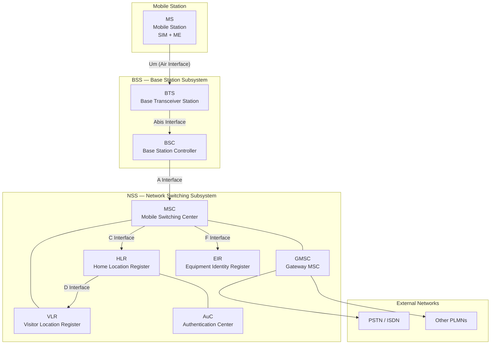
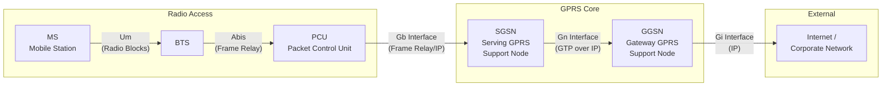
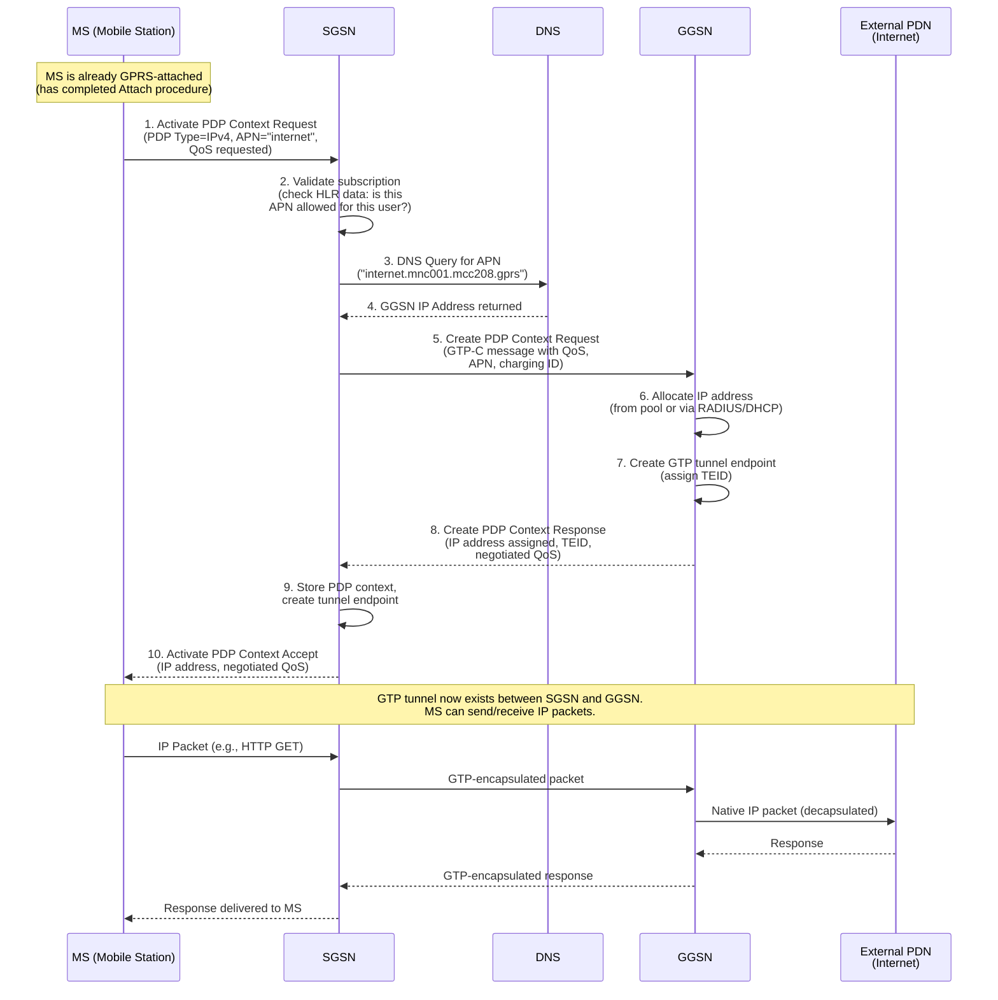

# ماژول 1: GSM، GPRS و EDGE

## شبکه‌های ارتباطی پیشرفته — آزمایشگاه بی‌سیم

---

## اهداف یادگیری

در پایان این ماژول، شما قادر خواهید بود:
- معماری کامل GSM و نقش هر عنصر شبکه را توضیح دهید
- توصیف کنید که GSM چگونه تحرک، مدیریت مکان و احراز هویت را مدیریت می‌کند
- بیان کنید **چرا** GPRS معرفی شد و چه محدودیت‌هایی از GSM را برطرف کرد
- معماری لایه‌ای سوئیچینگ بسته‌ای GPRS را توضیح دهید
- فعال‌سازی زمینه PDP و مدیریت تحرک GPRS را توصیف کنید
- توضیح دهید که EDGE چگونه نرخ داده را از طریق تغییرات مدولاسیون بهبود داد
- مسیر تحول از GSM تا EDGE و سپس 3G را دنبال کنید

---

## 1. معماری GSM

### 1.1 چرا GSM؟

پیش از GSM (Global System for Mobile Communications - سیستم جهانی ارتباطات موبایل)، اروپا چندین سیستم سلولی آنالوگ ناسازگار داشت (NMT، TACS، C-Netz). یک مشترک در فرانسه نمی‌توانست به آلمان رومینگ کند. GSM برای حل سه مشکل بنیادی ایجاد شد:

1. **قابلیت هم‌کاری** — یک استاندارد واحد در سراسر اروپا (و در نهایت جهان)
2. **امنیت** — سیستم‌های آنالوگ هیچ رمزنگاری نداشتند؛ هر کسی با یک اسکنر می‌توانست شنود کند
3. **ظرفیت** — مدولاسیون دیجیتال به کاربران بیشتری در هر MHz از طیف خدمات می‌دهد

### 1.2 نمودار معماری شبکه GSM



### 1.3 درک لایه‌های معماری

معماری GSM در سه زیرسیستم منطقی سازماندهی شده است که هر یک مشکلی متمایز را حل می‌کند:

| زیرسیستم | مشکلی که حل می‌کند | عناصر |
|-----------|-------------------|----------|
| **BSS** (زیرسیستم ایستگاه پایه) | دسترسی رادیویی — چگونه گوشی با شبکه صحبت می‌کند؟ | BTS، BSC |
| **NSS** (زیرسیستم سوئیچینگ شبکه) | مسیریابی تماس — چگونه تماس‌ها متصل می‌شوند؟ | MSC، GMSC، HLR، VLR، AuC، EIR |
| **OSS** (زیرسیستم پشتیبانی عملیات) | مدیریت — چگونه اپراتورها شبکه را پایش و پیکربندی می‌کنند؟ | OMC، NMC |

---

## 2. عناصر شبکه GSM — توضیح تفصیلی

### 2.1 ایستگاه موبایل (MS)

**چیست:** دستگاه مشترک، که از دو بخش تشکیل شده است:
- **ME (تجهیزات موبایل):** سخت‌افزار فیزیکی گوشی، که با IMEI خود شناسایی می‌شود
- **SIM (ماژول هویت مشترک):** یک کارت هوشمند که هویت مشترک (IMSI)، کلید احراز هویت (Ki) و الگوریتم‌ها را حمل می‌کند

**چرا به ME + SIM تفکیک شده است:** این تفکیک به این معناست که می‌توانید SIM خود را در هر گوشی قرار دهید و شماره‌تان را حفظ کنید، یا اپراتور می‌تواند یک گوشی دزدیده‌شده را (با IMEI) مسدود کند بدون آنکه به حساب مشترک آسیبی برسد.

### 2.2 ایستگاه فرستنده-گیرنده پایه (BTS)

**چیست:** تجهیزات رادیویی (آنتن‌ها، فرستنده-گیرنده‌ها، تقویت‌کننده‌ها) در یک سایت سلول.

**چرا وجود دارد:** کسی باید بین شبکه سیمی و امواج رادیویی تبدیل انجام دهد. BTS موارد زیر را انجام می‌دهد:
- ارسال و دریافت سیگنال‌های رادیویی
- کدگذاری کانال و رمزنگاری در واسط رادیویی
- جهش فرکانسی (در صورت پیکربندی)
- اندازه‌گیری پیشروی زمانی (برای جبران تأخیر انتشار)

**نکته کلیدی:** BTS عمداً «کم‌هوش» است — هوش حداقلی دارد. این یک انتخاب طراحی آگاهانه است تا سایت‌های رادیویی گران‌قیمت برای ویژگی‌های جدید نیازی به ارتقای نرم‌افزار نداشته باشند.

### 2.3 کنترلر ایستگاه پایه (BSC)

**چیست:** هوش پشت چندین BTS. یک BSC معمولاً ده‌ها تا صدها BTS را کنترل می‌کند.

**چرا وجود دارد:** BSC مسئله **مدیریت منابع** را حل می‌کند:
- **تصمیمات تحویل (handover):** چه زمانی باید یک تماس از یک BTS به BTS دیگر منتقل شود؟ BSC اندازه‌گیری‌ها را از MS و BTS‌های همسایه جمع‌آوری می‌کند تا تصمیم بگیرد.
- **تخصیص منابع رادیویی:** کدام فرکانس و شکاف زمانی باید به یک تماس جدید تخصیص یابد؟
- **کنترل توان:** به MS و BTS دستور می‌دهد که توان را تنظیم کنند (باتری را ذخیره می‌کند، تداخل را کاهش می‌دهد)
- **تبدیل کد (Transcoding):** بین کدک گفتار فشرده در واسط رادیویی (13 kbps) و PCM استاندارد 64 kbps مورد استفاده در شبکه هسته تبدیل انجام می‌دهد

### 2.4 مرکز سوئیچینگ موبایل (MSC)

**چیست:** یک مرکز تلفن که به‌طور خاص برای مشترکین موبایل طراحی شده است.

**چرا وجود دارد:** MSC مسئله **مسیریابی تماس برای کاربران موبایل** را حل می‌کند. برخلاف مرکز تلفن خط ثابت، MSC باید موارد زیر را مدیریت کند:
- **برقراری و آزادسازی تماس** برای کاربرانی که ممکن است در حرکت باشند
- **تحویل بین BSCها** (تحویل بین-BSC)
- **واسط با شبکه‌های خارجی** (PSTN، ISDN، سایر شبکه‌های موبایل)
- **خدمات تکمیلی** (انتقال تماس، انتظار تماس، تماس کنفرانسی)
- **هماهنگی با VLR** برای اعتبارسنجی مشترک

### 2.5 MSC دروازه‌ای (GMSC)

**چیست:** یک MSC تخصصی که به‌عنوان نقطه ورود برای تماس‌های آمده از شبکه‌های خارجی عمل می‌کند.

**چرا وجود دارد:** وقتی کسی از یک تلفن ثابت به یک مشترک موبایل زنگ می‌زند، تماس به GMSC می‌رسد. وظیفه GMSC **یافتن مشترک** است — از HLR پرس‌وجو می‌کند تا تعیین کند مشترک در حال حاضر در کدام ناحیه MSC/VLR قرار دارد، سپس تماس را به آنجا مسیریابی می‌کند. بدون GMSC، شبکه‌های خارجی باید ساختار داخلی شبکه موبایل را می‌دانستند.

### 2.6 ثبت‌کننده مکان خانگی (HLR)

**چیست:** پایگاه داده مرکزی که شامل تمام اطلاعات دائمی مشترک است.

**چرا وجود دارد:** HLR مسئله **«این مشترک کجاست؟»** را حل می‌کند. موارد زیر را ذخیره می‌کند:
- هویت مشترک (IMSI، MSISDN)
- اطلاعات اشتراک (کدام خدمات مجاز هستند)
- **مکان فعلی** (مشترک در کدام ناحیه VLR/MSC ثبت‌نام شده است)
- تنظیمات انتقال تماس
- داده‌های خدمات تکمیلی

**نکته کلیدی:** به‌صورت منطقی یک HLR در هر شبکه وجود دارد (هرچند از نظر فیزیکی ممکن است توزیع‌شده باشد). این تنها منبع حقیقت درباره هر مشترک است.

### 2.7 ثبت‌کننده مکان بازدیدکننده (VLR)

**چیست:** یک پایگاه داده موقت مرتبط با هر MSC، که اطلاعات مشترکین حاضر در ناحیه آن MSC را نگه می‌دارد.

**چرا وجود دارد:** VLR مسئله **کارایی** را حل می‌کند. بدون آن، هر برقراری تماس نیازمند پرس‌وجو از HLR بود (که ممکن است دور باشد). در عوض:
1. وقتی مشترکی وارد ناحیه یک MSC می‌شود، VLR پروفایل او را از HLR می‌گیرد
2. عملیات بعدی از نسخه محلی VLR استفاده می‌کنند
3. این کار بار سیگنالینگ روی HLR را کاهش می‌دهد و تأخیر برقراری تماس را کم می‌کند

VLR همچنین داده‌های موقت را ذخیره می‌کند: TMSI (هویت موقت)، ناحیه مکانی و سه‌گانه‌های احراز هویت.

### 2.8 مرکز احراز هویت (AuC)

**چیست:** یک پایگاه داده محافظت‌شده که کلیدهای احراز هویت مخفی (Ki) را برای هر مشترک ذخیره می‌کند.

**چرا وجود دارد:** AuC مسئله **«چگونه ثابت کنیم این مشترک اصیل است؟»** را حل می‌کند. این مرکز:
- Ki هر مشترک را ذخیره می‌کند (که هرگز از AuC یا SIM خارج نمی‌شود)
- سه‌گانه‌های احراز هویت (RAND، SRES، Kc) را در صورت درخواست تولید می‌کند
- در برابر کلون‌سازی و دسترسی غیرمجاز محافظت می‌کند

**چرا از HLR جدا است:** جداسازی امنیتی. مقادیر Ki بسیار حساس هستند. با قرار دادن آن‌ها در یک عنصر فیزیکی امن و جداگانه، در صورت نفوذ به HLR، کلیدهای احراز هویت افشا نمی‌شوند.

### 2.9 ثبت‌کننده هویت تجهیزات (EIR)

**چیست:** یک پایگاه داده از هویت‌های تجهیزات موبایل (IMEIها) که در سه فهرست طبقه‌بندی می‌شوند:
- **فهرست سفید:** تجهیزات تأییدشده
- **فهرست خاکستری:** تجهیزات تحت نظارت (شاید مفقود گزارش شده اما تأیید نشده)
- **فهرست سیاه:** تجهیزات دزدیده‌شده یا غیرتأییدشده — خدمات مسدود می‌شود

**چرا وجود دارد:** EIR مسئله **گوشی دزدیده‌شده** را حل می‌کند. حتی اگر سارق یک SIM جدید در گوشی دزدیده‌شده قرار دهد، شبکه می‌تواند سخت‌افزار را با IMEI آن شناسایی و مسدود کند.


---

## 3. واسط‌های GSM

### چرا واسط‌های استانداردشده اهمیت دارند

نبوغ GSM در تعریف **واسط‌های باز** بین عناصر بود. این بدان معناست که یک BTS از اریکسون می‌تواند به یک BSC از نوکیا متصل شود. بدون واسط‌های استانداردشده، اپراتورها برای همه چیز به یک سازنده واحد وابسته می‌شدند.

### 3.1 خلاصه واسط‌ها

| واسط | بین | پشته پروتکل | هدف |
|-----------|---------|---------------|---------|
| **Um** | MS ↔ BTS | LAPDm / RR / MM / CC | واسط رادیویی — لینک رادیویی |
| **Abis** | BTS ↔ BSC | LAPD over PCM (E1/T1) | حمل ترافیک + سیگنالینگ از سایت‌های رادیویی به کنترلر |
| **A** | BSC ↔ MSC | MTP / SCCP / BSSAP | اتصال زیرسیستم رادیویی به زیرسیستم سوئیچینگ |
| **B** | MSC ↔ VLR | MAP | MSC از VLR محلی برای داده‌های مشترک پرس‌وجو می‌کند |
| **C** | GMSC ↔ HLR | MAP | GMSC از HLR می‌پرسد تماس‌های ورودی را کجا مسیریابی کند |
| **D** | VLR ↔ HLR | MAP | به‌روزرسانی مکان، انتقال داده‌های مشترک |
| **E** | MSC ↔ MSC | MAP / ISUP | تحویل بین-MSC |
| **F** | MSC ↔ EIR | MAP | بررسی IMEI |
| **G** | VLR ↔ VLR | MAP | انتقال اطلاعات مشترک در جابه‌جایی بین-VLR |
| **H** | HLR ↔ AuC | Proprietary | درخواست‌های بردار احراز هویت |

### 3.2 واسط Um (واسط رادیویی) — به‌صورت عمیق

واسط Um پیچیده‌ترین است زیرا باید با محیط رادیویی خصمانه سر و کار داشته باشد:

- **دسترسی چندگانه:** TDMA با 8 شکاف زمانی در هر حامل 200 kHz (ترکیبی FDMA/TDMA)
- **مدولاسیون:** GMSK (Gaussian Minimum Shift Keying) — به دلیل پوش ثابت (تقویت‌کننده‌های توان کارآمد) و کارایی طیفی انتخاب شده است
- **ساختار فریم:** ابرفریم ← ابرفریم بزرگ ← چندفریم ← فریم ← شکاف زمانی ← انفجار
- **کانال‌های منطقی:**
  - **TCH (کانال ترافیک):** حمل گفتار/داده کاربر
  - **BCCH (کانال کنترل پخش):** پخش اطلاعات سیستم به همه گوشی‌ها
  - **RACH (کانال دسترسی تصادفی):** MS درخواست دسترسی می‌کند (ALOHA شکاف‌دار)
  - **PCH (کانال صفحه‌بندی):** شبکه برای تماس ورودی MS را صفحه‌بندی می‌کند
  - **SDCCH (کانال کنترل اختصاصی مستقل):** سیگنالینگ (SMS، به‌روزرسانی مکان)
  - **SACCH/FACCH:** کنترل مرتبط برای اندازه‌گیری‌ها و فرمان‌های تحویل

### 3.3 واسط Abis

**چرا وجود دارد:** سایت‌های BTS دورافتاده هستند (قله کوه‌ها، پشت‌بام‌ها). واسط Abis به آن‌ها امکان می‌دهد از طریق خطوط استاندارد E1 با 2 Mbps (یا لینک‌های مایکروویو) به BSC متصل شوند. این واسط موارد زیر را حمل می‌کند:
- کانال‌های ترافیک 16 kbps (گفتار فشرده)
- پیام‌های سیگنالینگ (پروتکل LAPD، مشابه ISDN)
- پیام‌های عملیات و نگهداری

### 3.4 واسط A

**چرا وجود دارد:** اینجا جایی است که دنیای رادیو با دنیای تلفن ملاقات می‌کند. واسط A موارد زیر را حمل می‌کند:
- گفتار PCM 64 kbps (پس از تبدیل کد از 13 kbps)
- سیگنالینگ BSSAP (BSS Application Part) روی SS7

---

## 4. تحرک و مدیریت مکان GSM

### 4.1 چرا مدیریت مکان لازم است

چالش بنیادی شبکه‌های موبایل: **چگونه تماسی را به کسی برسانید که مکانش نامعلوم است؟**

راه‌حل ساده‌لوحانه: صفحه‌بندی هر سلول در شبکه. مشکل: این مقیاس‌پذیر نیست — میلیون‌ها مشترک نیازمند صفحه‌بندی مداوم در هر سلول خواهند بود.

راه‌حل GSM: **نواحی مکانی (LA)**

### 4.2 مفهوم ناحیه مکانی

- شبکه به **نواحی مکانی** تقسیم می‌شود که هر یک شامل چندین سلول (BTS) است
- هر LA دارای یک **LAI** (هویت ناحیه مکانی) منحصربه‌فرد است = MCC + MNC + LAC
- شبکه مکان مشترک را فقط با **دقت LA** می‌داند
- وقتی تماسی می‌رسد، مشترک در تمام سلول‌های LA فعلی خود صفحه‌بندی می‌شود

**مبادله:**
- LAهای کوچک‌تر ← بار صفحه‌بندی کمتر، اما به‌روزرسانی‌های مکان بیشتر (سیگنالینگ)
- LAهای بزرگ‌تر ← به‌روزرسانی‌های مکان کمتر، اما ترافیک صفحه‌بندی بیشتر
- اپراتورها اندازه LAها را بر اساس الگوهای ترافیک تنظیم می‌کنند

### 4.3 رویه به‌روزرسانی مکان

یک موبایل زمانی **به‌روزرسانی مکان** انجام می‌دهد که:
1. **به‌روزرسانی مکان عادی:** MS تشخیص می‌دهد که وارد LA جدیدی شده است (LAI متفاوت روی BCCH)
2. **به‌روزرسانی مکان دوره‌ای:** تایمر منقضی می‌شود — اثبات می‌کند که MS هنوز قابل دسترسی است
3. **اتصال IMSI:** MS روشن می‌شود و با شبکه ثبت‌نام می‌کند

**جریان به‌روزرسانی مکان:**
1. MS پیام LOCATION UPDATING REQUEST را به MSC/VLR جدید می‌فرستد
2. VLR جدید با HLR تماس می‌گیرد: «مشترک X اکنون اینجاست»
3. HLR پروفایل مشترک را به VLR جدید می‌فرستد
4. HLR به VLR قدیمی می‌گوید که رکورد مشترک را حذف کند
5. VLR جدید به MS تأیید می‌کند: LOCATION UPDATING ACCEPT
6. MS TMSI جدید را ذخیره می‌کند (در صورت تخصیص مجدد)

### 4.4 TMSI — هویت موقت مشترک موبایل

**چرا:** پخش IMSI روی واسط رادیویی به شنودکنندگان امکان ردیابی مشترکین را می‌داد. TMSI:
- توسط VLR تخصیص می‌یابد و فقط اهمیت محلی دارد
- مکرراً تغییر می‌کند (در هر به‌روزرسانی مکان یا تماس)
- بدین معناست که هویت دائمی (IMSI) به‌ندرت روی هوا منتقل می‌شود

---

## 5. احراز هویت و امنیت GSM

### 5.1 چرا احراز هویت حیاتی است

بدون احراز هویت:
- SIMهای کلون‌شده می‌توانستند تماس‌هایی برقرار کنند که به حساب دیگری صورتحساب شود
- کاربران غیرمجاز می‌توانستند به شبکه دسترسی یابند
- شنودکنندگان می‌توانستند تماس‌ها را رهگیری کنند

### 5.2 سازوکار سه‌گانه احراز هویت

GSM از یک پروتکل **چالش-پاسخ** مبتنی بر رمزنگاری کلید مشترک استفاده می‌کند.

**بازیگران:**
- **Ki:** یک کلید مخفی 128 بیتی، که فقط روی SIM و در AuC ذخیره می‌شود. این کلید **هرگز** از هیچ واسطی عبور نمی‌کند.
- **RAND:** یک عدد تصادفی 128 بیتی که توسط AuC تولید می‌شود (چالش)
- **SRES:** یک پاسخ امضاشده 32 بیتی (پاسخ مورد انتظار)
- **Kc:** یک کلید رمز 64 بیتی برای رمزنگاری واسط رادیویی

**چگونه کار می‌کند:**

```
AuC side:                          SIM side:
─────────                          ─────────
Ki (stored)                        Ki (stored)
RAND (generated randomly)          RAND (received from network)
    │                                  │
    ▼                                  ▼
┌─────────┐                       ┌─────────┐
│   A3    │──→ SRES (expected)    │   A3    │──→ SRES (computed)
│Algorithm│                       │Algorithm│
└─────────┘                       └─────────┘
    │                                  │
    ▼                                  ▼
┌─────────┐                       ┌─────────┐
│   A8    │──→ Kc (cipher key)    │   A8    │──→ Kc (cipher key)
│Algorithm│                       │Algorithm│
└─────────┘                       └─────────┘
```

**گام‌به‌گام:**
1. AuC مقدار RAND را تولید می‌کند، SRES = A3(Ki, RAND) و Kc = A8(Ki, RAND) را محاسبه می‌کند
2. سه‌گانه (RAND، SRES، Kc) به VLR فرستاده می‌شود (پیش‌محاسبه‌شده، برای استفاده بعدی ذخیره می‌شود)
3. وقتی احراز هویت لازم است، VLR مقدار RAND را به MS می‌فرستد
4. SIM با استفاده از Ki ذخیره‌شده خود SRES = A3(Ki, RAND) را محاسبه می‌کند
5. MS مقدار SRES را به شبکه بازمی‌گرداند
6. VLR مقدار SRES دریافتی را با SRES ذخیره‌شده مقایسه می‌کند — اگر مطابقت داشته باشند، مشترک اصیل است
7. اکنون هر دو طرف Kc را دارند — که با الگوریتم A5 برای رمزنگاری واسط رادیویی استفاده می‌شود

**چرا سه‌گانه‌ها پیش‌محاسبه می‌شوند:** AuC ممکن است از نظر جغرافیایی دور باشد. پیش‌محاسبه چندین سه‌گانه و ذخیره آن‌ها در VLR به این معناست که احراز هویت می‌تواند به‌صورت محلی و بدون دسترسی بلادرنگ به AuC انجام شود.

### 5.3 رمزنگاری (الگوریتم A5)

پس از احراز هویت، هم MS و هم BTS دارای Kc مشترک هستند. الگوریتم A5 یک جریان کلید تولید می‌کند که با ترافیک عمل XOR انجام می‌دهد. این موارد را فراهم می‌کند:
- **محرمانگی** در واسط رادیویی (فقط Um — نه سرتاسری)
- محافظت در برابر شنود اتفاقی

**ضعف شناخته‌شده:** A5/1 شکسته شده است. شبکه‌های مدرن از A5/3 (مبتنی بر KASUMI) استفاده می‌کنند یا به 3G/4G با امنیت قوی‌تر منتقل شده‌اند.


---

## 6. چرا GPRS لازم بود

### 6.1 مسئله داده GSM

GSM برای **صدا** طراحی شده بود. داده یک فکر بعدی بود:

| سرویس داده GSM | سرعت | مشکل |
|-----------------|-------|---------|
| CSD (داده سوئیچینگ مداری) | 9.6 kbps | یک شکاف زمانی کامل را برای کل نشست اشغال می‌کند |
| HSCSD (CSD پرسرعت) | تا 57.6 kbps | چندین شکاف زمانی را اشغال می‌کند — بسیار گران |

**مسئله بنیادی: سوئیچینگ مداری برای داده اشتباه است.**

چرا؟ وب‌گردی را در نظر بگیرید:
- شما یک صفحه درخواست می‌کنید (1 ثانیه فعالیت)
- آن را می‌خوانید (30 ثانیه عدم فعالیت)
- روی یک لینک کلیک می‌کنید (1 ثانیه فعالیت)
- دوباره می‌خوانید (30 ثانیه عدم فعالیت)

با سوئیچینگ مداری، شما **در آن 30 ثانیه خواندن، هزینه یک شکاف زمانی را می‌پردازید و آن را مصرف می‌کنید**. کانال تخصیص یافته اما 95% مواقع بیکار است.

### 6.2 GPRS چه فراهم می‌کند

**GPRS (General Packet Radio Service - سرویس رادیویی بسته‌ای عمومی)** **سوئیچینگ بسته‌ای** را به GSM معرفی می‌کند:

- منابع **فقط زمانی که داده واقعاً ارسال می‌شود** تخصیص می‌یابند
- چندین کاربر به‌صورت آماری شکاف‌های زمانی را **به اشتراک می‌گذارند**
- صورتحساب می‌تواند **بر مبنای مگابایت** باشد به‌جای دقیقه
- اتصال «همیشه فعال» — بدون تأخیر شماره‌گیری
- سرعت‌های نظری: 8 شکاف زمانی × 21.4 kbps = **171.2 kbps** (حداکثر نظری)
- سرعت‌های عملی: 30–80 kbps

### 6.3 فلسفه طراحی GPRS

GPRS به‌عنوان یک **لایه** روی زیرساخت موجود GSM طراحی شد. اپراتورها نیازی نداشتند کل شبکه خود را جایگزین کنند — آن‌ها گره‌های سوئیچینگ بسته جدید را در کنار هسته سوئیچینگ مداری موجود اضافه کردند. این امر برای پذیرش تجاری حیاتی بود.

---

## 7. معماری GPRS

### 7.1 عناصر شبکه جدید

GPRS سه عنصر کلیدی جدید معرفی می‌کند:

#### SGSN — گره پشتیبانی خدمات GPRS

**چیست:** معادل سوئیچینگ بسته‌ای ترکیب MSC/VLR.

**چرا وجود دارد:** کسی باید نشست‌های سوئیچینگ بسته‌ای را همان‌طور که MSC تماس‌های صوتی را مدیریت می‌کند، مدیریت کند. SGSN:
- مکان موبایل‌های متصل به GPRS را ردیابی می‌کند (با دقت ناحیه مسیریابی)
- احراز هویت و رمزگذاری برای نشست‌های بسته‌ای انجام می‌دهد
- مدیریت تحرک برای داده بسته‌ای را انجام می‌دهد
- بسته‌ها را بین MS و GGSN مسیریابی می‌کند
- اطلاعات صورت‌حساب را جمع‌آوری می‌کند

#### GGSN — گره پشتیبانی GPRS دروازه‌ای

**چیست:** معادل سوئیچینگ بسته‌ای GMSC — دروازه به شبکه‌های داده خارجی.

**چرا وجود دارد:** شبکه موبایل باید به اینترنت (و شبکه‌های داخلی سازمانی) متصل شود. GGSN:
- به‌عنوان **مسیریاب IP** بین شبکه GPRS و شبکه‌های داده بسته‌ای خارجی (PDNها) عمل می‌کند
- آدرس‌های IP را به دستگاه‌های موبایل تخصیص می‌دهد (یا از DHCP/RADIUS بازپخش می‌کند)
- **کپسوله‌سازی/واکپسوله‌سازی** داده کاربر را با استفاده از GTP (GPRS Tunneling Protocol) انجام می‌دهد
- سیاست‌ها و قواعد صورت‌حساب را اعمال می‌کند
- از دید شبکه خارجی، GGSN مانند یک مسیریاب IP عادی به نظر می‌رسد

#### PCU — واحد کنترل بسته

**چیست:** یک افزودنی به BSC که مدیریت منابع رادیویی سوئیچینگ بسته‌ای را انجام می‌دهد.

**چرا وجود دارد:** BSC اصلی فقط تخصیص منابع سوئیچینگ مداری را می‌فهمید. PCU موارد زیر را اضافه می‌کند:
- زمان‌بندی بسته روی کانال‌های رادیویی مشترک (PDCH — کانال‌های داده بسته‌ای)
- قطعه‌بندی و بازمونتاژ فریم‌های LLC به بلوک‌های رادیویی
- تخصیص پویا شکاف‌های زمانی بین صدا (TCH) و داده (PDCH)
- مدیریت پرچم وضعیت پیوند بالاسو و تأیید دریافت

### 7.2 مسیر داده بسته‌ای GPRS



### 7.3 پشته پروتکل GPRS

پشته پروتکل GPRS لایه‌های جدیدی معرفی می‌کند:

| لایه | پروتکل | هدف |
|-------|----------|---------|
| کاربرد | HTTP، SMTP و غیره | کاربرد کاربر |
| انتقال | TCP / UDP | قابلیت اطمینان سرتاسری |
| شبکه | IP | آدرس‌دهی و مسیریابی |
| تونل‌سازی | GTP (GPRS Tunneling Protocol) | کپسوله‌سازی بسته‌های IP بین SGSN و GGSN |
| پیوند | LLC (Logical Link Control) | لینک قابل اعتماد بین MS و SGSN |
| پیوند | SNDCP (SubNetwork Dependent Convergence Protocol) | فشرده‌سازی سرآیند، قطعه‌بندی |
| رادیو | RLC/MAC | انتقال بلوک رادیویی، ARQ |
| فیزیکی | مدولاسیون GMSK روی PDCH | بیت‌ها روی هوا |

### 7.4 واسط‌های GPRS

| واسط | بین | انتقال | هدف |
|-----------|---------|-----------|---------|
| **Gb** | PCU/BSS ↔ SGSN | Frame Relay یا IP | داده بسته‌ای از رادیو به هسته |
| **Gn** | SGSN ↔ GGSN (همان PLMN) | GTP/UDP/IP | تونل‌سازی داده کاربر درون شبکه |
| **Gp** | SGSN ↔ GGSN (PLMN متفاوت) | GTP + security | داده رومینگ |
| **Gi** | GGSN ↔ PDN خارجی | IP | اتصال به اینترنت |
| **Gr** | SGSN ↔ HLR | MAP | داده مشترک برای GPRS |
| **Gs** | SGSN ↔ MSC/VLR | BSSAP+ | هماهنگی CS و PS |

---

## 8. زمینه PDP

### 8.1 زمینه PDP چیست؟

یک **زمینه PDP (Packet Data Protocol Context)** همان «نشست» است که باید پیش از آنکه یک موبایل بتواند داده بسته‌ای بفرستد یا دریافت کند وجود داشته باشد. آن را معادل GPRS برای «شماره‌گیری» در نظر بگیرید — اما بدون هدر دادن منابع در حالت بیکار.

یک زمینه PDP موارد زیر را تعریف می‌کند:
- **نوع PDP:** معمولاً IPv4 یا IPv6
- **آدرس PDP:** آدرس IP تخصیص‌یافته به MS
- **نام نقطه دسترسی (APN):** به کدام شبکه خارجی متصل شود (مثلاً «internet»، «corporate.vpn»)
- **پروفایل QoS:** کیفیت خدمات درخواستی (اولویت، توان عملیاتی، کلاس تأخیر)
- **آدرس GGSN:** کدام GGSN به این زمینه خدمات می‌دهد

### 8.2 چرا زمینه PDP وجود دارد

بدون شکلی از برقراری نشست:
- GGSN نمی‌دانست بسته‌های پیوند پایین‌سو را برای یک آدرس IP مشخص کجا بفرستد
- شبکه نمی‌توانست سیاست‌های QoS یا صورت‌حساب را اعمال کند
- هیچ تونلی بین SGSN و GGSN برقرار نمی‌شد

### 8.3 رویه فعال‌سازی زمینه PDP



### 8.4 حالت‌های زمینه PDP

| حالت | معنا | منابع مصرف‌شده |
|-------|---------|---------------|
| **INACTIVE** | زمینه PDP وجود ندارد — نمی‌توان داده فرستاد | هیچ |
| **ACTIVE** | زمینه کامل وجود دارد، داده می‌تواند جریان یابد | تونل SGSN/GGSN، آدرس IP تخصیص‌یافته |
| **STANDBY** (اختیاری) | زمینه وجود دارد اما منابع رادیویی آزاد شده‌اند | تونل حفظ می‌شود، تخصیص رادیویی وجود ندارد |


---

## 9. مدیریت تحرک GPRS

### 9.1 چرا GPRS به مدیریت تحرک خود نیاز دارد

GSM از قبل مدیریت مکان دارد (نواحی مکانی، به‌روزرسانی‌های مکان). چرا GPRS به یک سیستم جداگانه نیاز دارد؟

**زیرا ترافیک سوئیچینگ بسته‌ای و سوئیچینگ مداری نیازهای متفاوتی دارند:**
- برای یک **تماس صوتی**، شبکه باید فوراً شما را پیدا کند (صفحه‌بندی باید سریع باشد)
- برای **داده بسته‌ای**، تحمل بیشتری برای تأخیر وجود دارد — اما شبکه باید بداند بسته‌های پیوند پایین‌سوی شما را به کدام SGSN مسیریابی کند

GPRS **ناحیه مسیریابی (RA)** را معرفی می‌کند — زیربخشی از ناحیه مکانی.

### 9.2 ناحیه مسیریابی در برابر ناحیه مکانی

```
┌─────────────────────────────────────────┐
│           Location Area (LA)             │
│                                          │
│  ┌──────────────┐  ┌──────────────┐    │
│  │  Routing     │  │  Routing     │    │
│  │  Area 1      │  │  Area 2      │    │
│  │  (RA1)       │  │  (RA2)       │    │
│  │ ┌───┐ ┌───┐ │  │ ┌───┐ ┌───┐ │    │
│  │ │BTS│ │BTS│ │  │ │BTS│ │BTS│ │    │
│  │ └───┘ └───┘ │  │ └───┘ └───┘ │    │
│  └──────────────┘  └──────────────┘    │
│                                          │
└─────────────────────────────────────────┘
```

- یک **ناحیه مسیریابی** همیشه زیرمجموعه‌ای از یک ناحیه مکانی است (یا برابر با آن)
- RA با **RAI** شناسایی می‌شود = LAI + RAC (کد ناحیه مسیریابی)
- دقت بالاتر از LA ← مکان دقیق‌تر برای مسیریابی بسته

### 9.3 حالت‌های مدیریت تحرک GPRS

| حالت | آنچه شبکه می‌داند | چه زمانی |
|-------|----------------------|------|
| **IDLE** | هیچ — MS به GPRS متصل نیست | خاموش یا جدا شده از GPRS |
| **STANDBY** | ناحیه مسیریابی فعلی | متصل اما بدون انتقال داده فعال |
| **READY** | سلول فعلی (دقیق) | در حال ارسال/دریافت فعال داده |

**گذارهای حالت:**
- IDLE ← STANDBY: اتصال GPRS
- STANDBY ← READY: انتقال داده آغاز می‌شود (یا سیگنالینگ)
- READY ← STANDBY: تایمر READY منقضی می‌شود (بدون داده برای حدود 44 ثانیه)
- STANDBY ← IDLE: جداسازی GPRS

### 9.4 به‌روزرسانی ناحیه مسیریابی (RAU)

مشابه به‌روزرسانی مکان در GSM، اما برای دامنه بسته‌ای:

**زمانی که فعال می‌شود:**
1. MS به ناحیه مسیریابی جدیدی می‌رود (RAI متفاوت روی BCCH)
2. تایمر RAU دوره‌ای منقضی می‌شود
3. به‌روزرسانی ترکیبی RA/LA (اگر CS و PS هماهنگ باشند)

**انواع:**
- **RAU درون-SGSN:** ناحیه مسیریابی جدید که توسط همان SGSN خدمات می‌گیرد — رویه محلی، بدون نیاز به تغییر تونل GTP
- **RAU بین-SGSN:** ناحیه مسیریابی جدید که توسط SGSN متفاوت خدمات می‌گیرد — نیازمند:
  1. SGSN جدید با SGSN قدیمی تماس می‌گیرد تا زمینه‌های PDP را بگیرد
  2. SGSN جدید به GGSN اطلاع می‌دهد که نقاط انتهایی تونل را به‌روزرسانی کند
  3. SGSN جدید HLR را با مکان جدید به‌روزرسانی می‌کند
  4. SGSN قدیمی منابع را آزاد می‌کند

### 9.5 رویه اتصال GPRS

پیش از آنکه هر زمینه PDP فعال شود، MS باید به شبکه GPRS **متصل** شود:

1. MS پیام **Attach Request** را می‌فرستد (با IMSI یا P-TMSI)
2. SGSN مشترک را احراز هویت می‌کند (همان سازوکار مبتنی بر Ki در GSM)
3. SGSN مقدار HLR را با مکان SGSN جدید مشترک به‌روزرسانی می‌کند
4. SGSN یک **P-TMSI** تخصیص می‌دهد (Packet-TMSI — معادل TMSI برای دامنه بسته‌ای)
5. SGSN پیام **Attach Accept** را به MS می‌فرستد

پس از اتصال، MS برای سرویس بسته‌ای «ثبت‌نام‌شده» است اما هنوز نشست داده فعالی ندارد — این امر نیازمند فعال‌سازی زمینه PDP است.

---

## 10. EDGE — نرخ داده بهبودیافته برای تحول GSM

### 10.1 چرا EDGE لازم بود

GPRS کارایی را بهبود داد (سوئیچینگ بسته‌ای) اما همچنان توسط **طرح مدولاسیون GSM** محدود بود:
- GSM/GPRS از **GMSK** (Gaussian Minimum Shift Keying) استفاده می‌کند
- GMSK **1 بیت در هر نماد** را کدگذاری می‌کند
- حداکثر نرخ داده خام در هر شکاف زمانی: حدود 21.4 kbps (پس از کدگذاری)
- حداکثر توان عملیاتی عملی: حدود 40-60 kbps با 4 شکاف زمانی

برای کاربردهای نوظهور (پیوست‌های ایمیل، وب موبایل اولیه)، این کافی نبود. اما اپراتورها هنوز توان استقرار شبکه‌های 3G کاملاً جدید را نداشتند.

**ارزش پیشنهادی EDGE:** سرعت به‌مراتب بیشتر با استفاده از **همان طیف، همان سایت‌های سلول، همان شبکه** — فقط نرم‌افزار و فرستنده-گیرنده‌های ارتقایافته.

### 10.2 EDGE چه چیزی را تغییر می‌دهد

#### مدولاسیون: GMSK ← 8PSK

| پارامتر | GPRS (GMSK) | EDGE (8PSK) |
|-----------|-------------|-------------|
| مدولاسیون | GMSK | 8PSK (8-Phase Shift Keying) |
| بیت در هر نماد | 1 | 3 |
| نرخ بیت خام در هر شکاف زمانی | 22.8 kbps | 69.2 kbps (3 برابر سریع‌تر) |
| نرخ نماد | 270.833 ksps | 270.833 ksps (بدون تغییر!) |
| پهنای باند حامل | 200 kHz | 200 kHz (بدون تغییر!) |
| حداکثر نرخ داده (8 شکاف زمانی) | 171.2 kbps | 473.6 kbps |
| حداکثر عملی | حدود 80 kbps | حدود 200-236 kbps |

**نکته کلیدی:** EDGE به نرخ بیت خام 3 برابری دست می‌یابد زیرا 8PSK در هر نماد 3 بیت را کدگذاری می‌کند به‌جای 1 بیت. نرخ نماد و پهنای باند حامل تغییر نمی‌کنند — این صرفاً یک بهره کارایی مدولاسیون است.

#### مبادله: چرا همیشه از 8PSK استفاده نمی‌شود؟

8PSK **فاصله کمتری بین نقاط صور فلکی** نسبت به GMSK دارد. این بدان معناست:
- حساسیت بیشتر به نویز و تداخل
- نرخ خطای بیت بالاتر در لبه‌های سلول
- استحکام کمتر در شرایط رادیویی ضعیف

**راه‌حل EDGE: تطبیق پیوند**
- سیستم کیفیت کانال را به‌صورت بلادرنگ اندازه‌گیری می‌کند
- نزدیک BTS (سیگنال خوب): استفاده از 8PSK با کدگذاری سبک (MCS-9: 59.2 kbps در هر شکاف)
- دور از BTS (سیگنال ضعیف): بازگشت به GMSK با کدگذاری سنگین (MCS-1: 8.8 kbps در هر شکاف)
- 9 طرح مدولاسیون و کدگذاری مختلف (MCS-1 تا MCS-9)

### 10.3 طرح‌های کدگذاری EDGE

| MCS | مدولاسیون | نرخ کد | نرخ داده در هر شکاف | چه زمانی استفاده می‌شود |
|-----|-----------|-----------|-------------------|-----------|
| MCS-1 | GMSK | ~0.53 | 8.8 kbps | کانال بسیار ضعیف |
| MCS-2 | GMSK | ~0.66 | 11.2 kbps | کانال ضعیف |
| MCS-3 | GMSK | ~0.80 | 14.8 kbps | زیر میانگین |
| MCS-4 | GMSK | ~1.0 | 17.6 kbps | میانگین (بدون افزونگی) |
| MCS-5 | 8PSK | ~0.37 | 22.4 kbps | کانال میانگین |
| MCS-6 | 8PSK | ~0.49 | 29.6 kbps | کانال خوب |
| MCS-7 | 8PSK | ~0.76 | 44.8 kbps | کانال بسیار خوب |
| MCS-8 | 8PSK | ~0.92 | 54.4 kbps | کانال عالی |
| MCS-9 | 8PSK | ~1.0 | 59.2 kbps | بهترین شرایط |

### 10.4 EGPRS: EDGE به‌کاررفته برای داده بسته‌ای

وقتی مدولاسیون EDGE روی GPRS اعمال می‌شود، نتیجه **EGPRS (Enhanced GPRS)** نامیده می‌شود:
- همان معماری GPRS (SGSN، GGSN، زمینه‌های PDP)
- همان پشته پروتکل
- فقط لایه فیزیکی و لایه RLC بهبود یافته‌اند
- **افزونگی افزایشی (IR)** را اضافه می‌کند: اگر یک بلوک شکست بخورد، با سوراخ‌کاری متفاوت دوباره ارسال می‌شود؛ گیرنده تلاش‌ها را ترکیب می‌کند تا احتمال رمزگشایی بهتری به دست آید

### 10.5 تغییرات شبکه مورد نیاز برای EDGE

| تغییر | توضیح | هزینه |
|--------|-------------|------|
| فرستنده-گیرنده‌های جدید | BTS به فرستنده‌های توانمند 8PSK (تقویت‌کننده‌های خطی) نیاز دارد | متوسط |
| ارتقای نرم‌افزار | BSC و SGSN به پشتیبانی طرح کدگذاری جدید نیاز دارند | کم |
| بدون طیف جدید | از فرکانس‌های موجود GSM استفاده می‌کند | صفر |
| بدون سایت جدید | از سایت‌های سلول موجود استفاده می‌کند | صفر |
| بدون گره هسته جدید | همان زیرساخت SGSN/GGSN | صفر |

این امر EDGE را به‌عنوان یک پله «2.5G+» بسیار جذاب می‌کرد.

---

## 11. مسیر تحول: GSM ← GPRS ← EDGE ← 3G

### 11.1 خط زمانی تحول

```
1991          1997-2000       2003-2005        2004+
  │               │               │              │
  ▼               ▼               ▼              ▼
┌─────┐     ┌──────────┐    ┌──────────┐   ┌──────────┐
│ GSM │────▶│   GPRS   │───▶│   EDGE   │──▶│  UMTS/   │
│ 2G  │     │  2.5G    │    │ 2.75G    │   │ WCDMA 3G │
└─────┘     └──────────┘    └──────────┘   └──────────┘
  │               │               │              │
  │               │               │              │
Circuit-SW    + Packet-SW     + Better         New air
voice only    overlay          modulation      interface
9.6 kbps      ~40-80 kbps    ~200-236 kbps   ~2 Mbps+
data                                          (HSPA: 14+ Mbps)
```

### 11.2 هر گام چه چیزی افزود

| نسل | نوآوری کلیدی | مسئله حل‌شده | چه چیزی ثابت ماند |
|-----------|---------------|----------------|---------------------|
| **GSM** | سلولی دیجیتال، رومینگ | سیستم‌های آنالوگ ناسازگار | — |
| **GPRS** | لایه سوئیچینگ بسته‌ای | داده بیش از حد گران بود (سوئیچینگ مداری) | رادیو GSM، BSS، طیف |
| **EDGE** | مدولاسیون 8PSK + تطبیق پیوند | GPRS برای کاربردهای نوظهور بیش از حد کند بود | معماری GPRS، طیف، سایت‌ها |
| **UMTS (3G)** | واسط رادیویی جدید (WCDMA)، حامل‌های 5 MHz | EDGE هنوز نمی‌توانست ویدیو/رسانه غنی را پشتیبانی کند | مفاهیم شبکه هسته (SGSN ← مدرن‌شده) |

### 11.3 چرا این مسیر تحول اهمیت دارد

پیشرفت GSM ← GPRS ← EDGE یک اصل کلیدی در مهندسی مخابرات را نشان می‌دهد:

> **بازده را از زیرساخت موجود به حداکثر برسانید پیش از استقرار نسل‌های جدید.**

هر گام برای موارد زیر طراحی شد:
1. **استفاده مجدد** از سرمایه‌گذاری‌های موجود (طیف، سایت‌ها، شبکه هسته)
2. **افزودن** قابلیت به‌صورت افزایشی
3. **اجازه** دادن به اپراتورها برای ارتقای تدریجی (نه «انفجار بزرگ»)

این فلسفه امروز نیز ادامه دارد: 4G ← 4G-Advanced ← 5G NSA ← 5G SA.

---

## جدول خلاصه

| موضوع | GSM | GPRS | EDGE |
|-------|-----|------|------|
| **سوئیچینگ** | مداری | بسته‌ای | بسته‌ای |
| **مدولاسیون** | GMSK | GMSK | GMSK + 8PSK |
| **حداکثر نرخ داده** | 9.6 kbps (14.4 CSD) | 171.2 kbps (نظری) | 473.6 kbps (نظری) |
| **داده عملی** | 9.6 kbps | 30–80 kbps | 120–236 kbps |
| **صورت‌حساب** | بر مبنای دقیقه | بر مبنای مگابایت | بر مبنای مگابایت |
| **همیشه فعال؟** | خیر (شماره‌گیری) | بله | بله |
| **زیرساخت جدید** | شبکه کامل | + SGSN، GGSN، PCU | + فرستنده-گیرنده‌های 8PSK |
| **طیف جدید؟** | بله (900/1800 MHz) | خیر | خیر |

---

## پرسش‌های مرور

1. توضیح دهید چرا BSS با BTSهای «کم‌هوش» و یک BSC هوشمند طراحی شده است. مزایای این تفکیک چیست؟
2. چرا VLR وجود دارد؟ اگر هر عملیات نیازمند پرس‌وجو از HLR بود چه اتفاقی می‌افتاد؟
3. در فرآیند احراز هویت GSM، چرا Ki هرگز از SIM یا AuC خارج نمی‌شود؟ در صورت خروج چه پیامدی داشت؟
4. توضیح دهید چرا سوئیچینگ مداری برای ترافیک داده انفجاری مانند وب‌گردی به‌طور بنیادی ناکارآمد است.
5. نقش تونل‌سازی GTP بین SGSN و GGSN چیست؟ چرا بسته‌ها نمی‌توانند به‌سادگی به‌طور عادی مسیریابی شوند؟
6. چرا EDGE در شرایط رادیویی ضعیف به GMSK بازمی‌گردد به‌جای اینکه همیشه از 8PSK استفاده کند؟
7. اگر EDGE می‌تواند به حدود 236 kbps دست یابد، چرا همچنان 3G (UMTS) لازم بود؟

---

## مراجع

- 3GPP TS 03.02: Network Architecture (GSM)
- 3GPP TS 23.060: GPRS Service Description (Stage 2)
- 3GPP TS 43.064: GERAN Overall Description (EDGE)
- 3GPP TS 45.001: Physical Layer on the Radio Path
- Halonen, Romero, Melero: "GSM, GPRS and EDGE Performance" (Wiley, 2003)
- Eberspächer, Vögel, Bettstetter: "GSM – Architecture, Protocols and Services" (Wiley, 2009)
