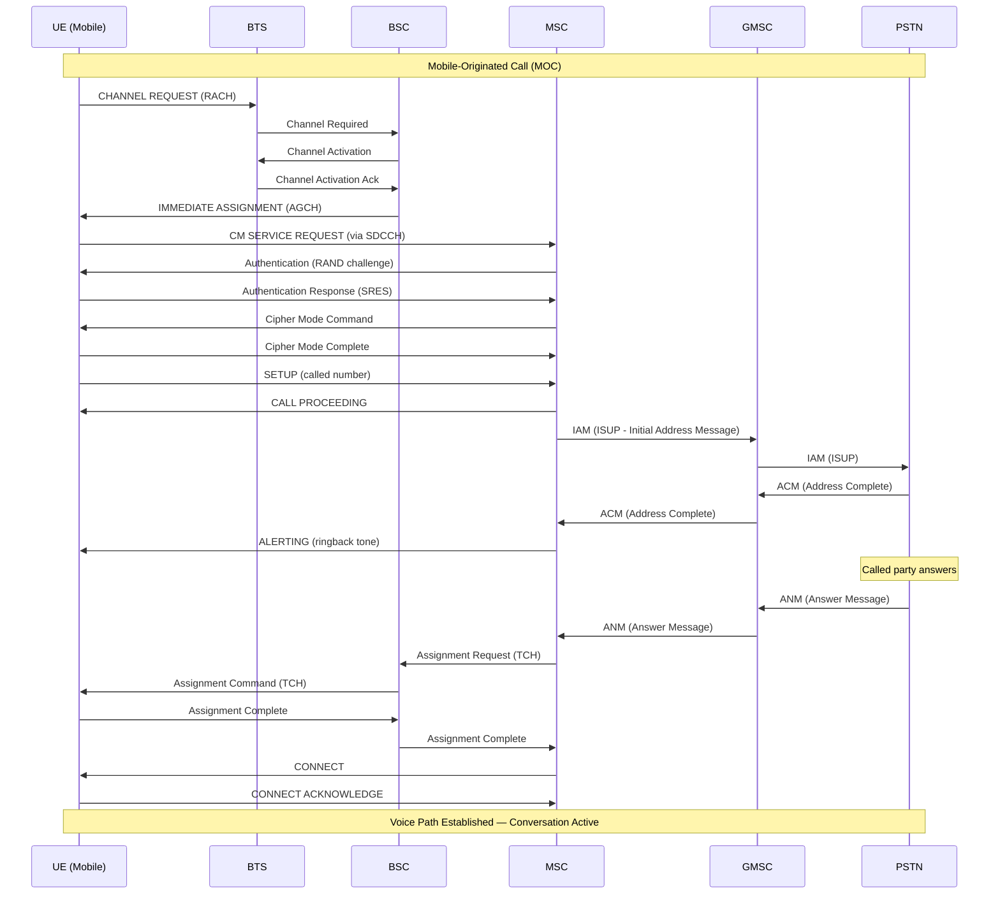
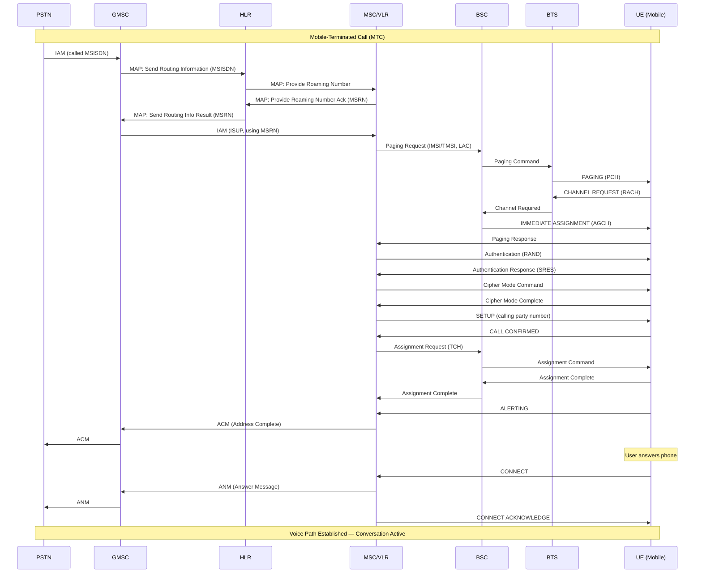
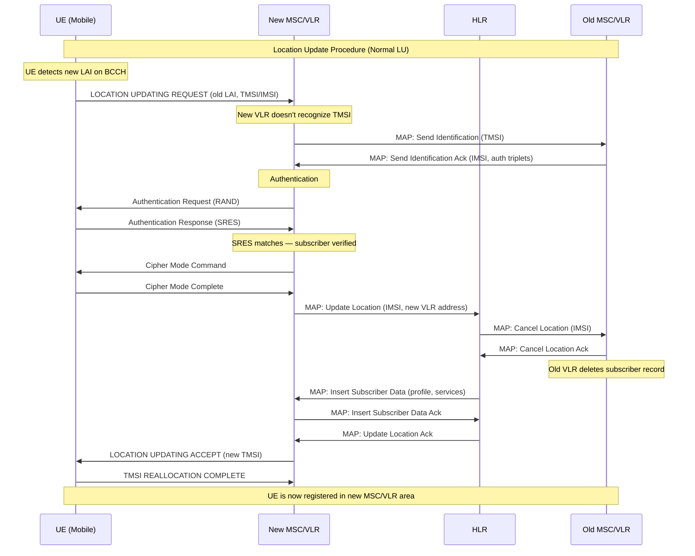
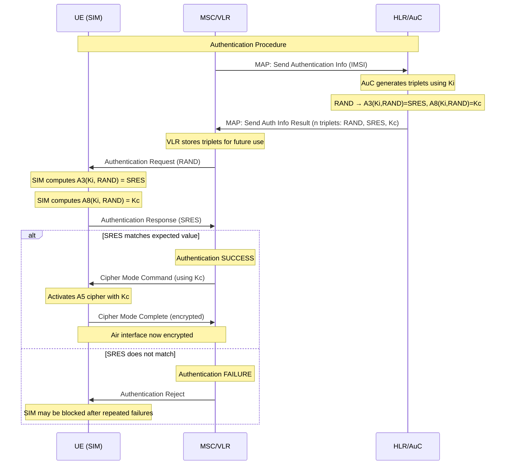

# Module 2: 2G Circuit Switching

## Table of Contents
1. [Circuit Switching Fundamentals](#1-circuit-switching-fundamentals)
2. [SS7 Signaling Concepts](#2-ss7-signaling-concepts)
3. [Call Setup Process](#3-call-setup-process)
4. [Call Routing](#4-call-routing)
5. [Location Update Procedure](#5-location-update-procedure)
6. [Authentication Procedure](#6-authentication-procedure)
7. [Roaming](#7-roaming)
8. [Call Release](#8-call-release)
9. [Why Circuit Switching? And Why It Became a Limitation](#9-why-circuit-switching)

---

## 1. Circuit Switching Fundamentals

### Concept: Dedicated Path

In circuit switching, a **dedicated communication path** is established between two endpoints for the entire duration of the call. This path is reserved exclusively — no other user can use those resources until the call is released.

### How It Works in GSM

| Step | Action |
|------|--------|
| 1 | Caller initiates a call |
| 2 | Network allocates a dedicated timeslot on the air interface (TDMA) |
| 3 | A fixed path is reserved through BTS → BSC → MSC → trunk to destination |
| 4 | Resources remain allocated for the entire call duration |
| 5 | Upon hangup, all resources are released |

### Resource Reservation

- **Air Interface**: A dedicated TDMA timeslot (one of 8 per carrier frequency) is assigned
- **Abis Interface** (BTS↔BSC): A 16 kbps or 64 kbps channel on E1/T1 links
- **A Interface** (BSC↔MSC): A 64 kbps timeslot on E1/T1 links
- **Trunk** (MSC↔PSTN/other MSC): A 64 kbps circuit on PCM links

### Key Characteristics

- **Connection-oriented**: Path established before data flows
- **Guaranteed bandwidth**: Fixed 64 kbps per direction once connected
- **Constant delay**: Predictable latency (~150ms end-to-end target)
- **Inefficient for bursty data**: Resources wasted during silence periods

---

## 2. SS7 Signaling Concepts

### What is SS7?

**Signaling System 7 (SS7)** is the out-of-band signaling protocol stack used by telecom networks to:
- Set up and tear down calls
- Manage subscriber databases
- Enable roaming and handovers
- Provide supplementary services (call forwarding, SMS, etc.)

SS7 signaling is **separate** from the voice path — this is called **Common Channel Signaling (CCS)**.

### SS7 Protocol Stack (Simplified)

```
┌─────────────────────────────────────────┐
│  Application Layer                       │
│  ┌───────┐  ┌───────┐  ┌───────┐       │
│  │ ISUP  │  │  MAP  │  │  CAP  │       │
│  └───┬───┘  └───┬───┘  └───┬───┘       │
│      │          │          │            │
│  ┌───┴──────────┴──────────┴───┐        │
│  │           TCAP               │        │
│  └──────────────┬──────────────┘        │
│  ┌──────────────┴──────────────┐        │
│  │           SCCP               │        │
│  └──────────────┬──────────────┘        │
│  ┌──────────────┴──────────────┐        │
│  │           MTP (1,2,3)        │        │
│  └─────────────────────────────┘        │
└─────────────────────────────────────────┘
```

### Key Protocols

#### ISUP (ISDN User Part)
- **Purpose**: Call setup, management, and release between exchanges (MSCs)
- **Messages**: IAM (Initial Address Message), ACM (Address Complete), ANM (Answer), REL (Release), RLC (Release Complete)
- **Used for**: Establishing the voice circuit between switches

#### MAP (Mobile Application Part)
- **Purpose**: Communication between GSM network elements (MSC, HLR, VLR, AuC)
- **Operations**: Location updates, authentication data retrieval, subscriber info queries, SMS routing
- **Used for**: Mobility management, roaming, subscriber data exchange

#### TCAP (Transaction Capabilities Application Part)
- **Purpose**: Provides a framework for MAP and other applications to exchange structured data
- **Model**: Request-response transactions (invoke, result, error)
- **Used for**: Carrying MAP operations over the SS7 network

### Signaling Points

| Element | Role |
|---------|------|
| **SSP** (Service Switching Point) | MSC/GMSC — originates/terminates signaling |
| **STP** (Signal Transfer Point) | Routes signaling messages between SSPs |
| **SCP** (Service Control Point) | Database nodes (HLR, AuC) |

---

## 3. Call Setup Process

### 3.1 Mobile-Originated Call (MOC)

A Mobile-Originated Call is initiated by the mobile subscriber.

#### Sequence of Events

1. **UE dials number** → sends CHANNEL REQUEST on RACH
2. **BTS** forwards to BSC
3. **BSC** assigns a dedicated channel (SDCCH) → IMMEDIATE ASSIGNMENT
4. **UE** sends CM SERVICE REQUEST (service type = MOC) to MSC via BSC
5. **MSC** authenticates the subscriber (see Section 6)
6. **MSC** activates ciphering
7. **UE** sends SETUP message with called party number
8. **MSC** sends CALL PROCEEDING to UE
9. **MSC** analyzes digits, determines routing
10. **MSC** sends IAM (ISUP) toward GMSC/PSTN
11. **GMSC/PSTN** returns ACM (Address Complete) → ringback
12. **MSC** sends ALERTING to UE
13. **Called party answers** → ANM (Answer Message) returned
14. **MSC** sends CONNECT to UE
15. **BSC** assigns a TCH (Traffic Channel) for voice
16. **Voice path established** — conversation begins

#### MOC Sequence Diagram



### 3.2 Mobile-Terminated Call (MTC)

A Mobile-Terminated Call is a call arriving for a mobile subscriber.

#### Sequence of Events

1. **PSTN/calling party** sends IAM to GMSC with called MSISDN
2. **GMSC** queries HLR: "Where is this subscriber?" (MAP: Send Routing Info)
3. **HLR** returns MSRN (Mobile Station Roaming Number) pointing to serving MSC
4. **GMSC** routes call to serving MSC using MSRN (IAM)
5. **MSC** queries VLR for subscriber state and location area
6. **MSC** pages the UE in the Location Area
7. **UE** responds to paging on RACH
8. **BSC** assigns SDCCH → authentication & ciphering
9. **MSC** sends SETUP to UE
10. **UE** sends CALL CONFIRMED
11. **UE** alerts user (ringtone)
12. **User answers** → UE sends CONNECT
13. **MSC** sends ANM back toward GMSC/PSTN
14. **Traffic channel assigned** — voice path active

#### MTC Sequence Diagram



---

## 4. Call Routing

### How MSC/GMSC Route Calls Using HLR

The HLR is the **master database** of all subscribers. It knows which MSC/VLR currently serves each subscriber.

### Routing a Mobile-Terminated Call

```
Step 1: PSTN delivers call to GMSC (based on MSISDN number plan)
Step 2: GMSC sends MAP "Send Routing Information" to HLR
Step 3: HLR identifies the serving MSC/VLR for that subscriber
Step 4: HLR asks serving VLR to allocate an MSRN (temporary routing number)
Step 5: VLR returns MSRN to HLR
Step 6: HLR returns MSRN to GMSC
Step 7: GMSC uses MSRN to route the ISUP IAM to the correct MSC
```

### MSRN (Mobile Station Roaming Number)

- Temporary number in E.164 format
- Looks like a regular phone number in the serving network's numbering plan
- Allows GMSC to route the call using standard ISUP without knowing GSM internals
- Allocated per call, released after routing

### Routing a Mobile-Originated Call

For MOC, routing is simpler:
1. MSC receives the dialed digits from the UE
2. MSC performs digit analysis (number plan, prefixes, supplementary services)
3. MSC routes the call via ISUP toward the appropriate trunk/GMSC/PSTN gateway
4. If calling another mobile on same network → MSC may query HLR for MSRN

---

## 5. Location Update Procedure

### Why Location Updates Are Needed

The network must know **where a subscriber is** to deliver calls and messages. Without location tracking:
- The network would have to page every cell in the entire country
- This would overwhelm the paging channel capacity
- Call setup time would be unacceptable

Location updates allow the network to **narrow paging to a specific Location Area** (group of cells).

### Types of Location Updates

| Type | Trigger |
|------|---------|
| **IMSI Attach** | Phone powers on — informs network subscriber is reachable |
| **Normal LU** | UE moves to a new Location Area (detects new LAI on BCCH) |
| **Periodic LU** | Timer-based update to confirm UE is still reachable |
| **IMSI Detach** | Phone powers off gracefully — informs network |

### Location Update Sequence Diagram



### IMSI Attach

When a phone powers on:
1. UE reads BCCH to get LAI and network information
2. UE sends LOCATION UPDATING REQUEST with attach flag
3. Same procedure as normal LU follows
4. VLR marks subscriber as "attached" (reachable)

### Periodic Location Update

- Network broadcasts a timer value (T3212) on BCCH
- UE must send a LU before the timer expires, even if it hasn't moved
- If the timer expires without an LU, VLR marks subscriber as "implicitly detached"
- Purpose: detect phones that powered off without IMSI Detach (battery died, etc.)

---

## 6. Authentication Procedure

### Purpose

Authentication ensures that the subscriber is who they claim to be, preventing:
- Unauthorized network access
- Cloned SIM fraud
- Eavesdropping (when combined with ciphering)

### The Authentication Triplet

The AuC (Authentication Center, co-located with HLR) generates **authentication triplets**:

| Element | Size | Purpose |
|---------|------|---------|
| **RAND** | 128 bits | Random challenge sent to UE |
| **SRES** | 32 bits | Expected response (computed from RAND + Ki) |
| **Kc** | 64 bits | Cipher key for encrypting the air interface |

### How Triplets Are Generated

```
Ki (128-bit secret key, stored in SIM and AuC)
    │
    ├── A3 algorithm (RAND + Ki) → SRES (32 bits)
    │
    └── A8 algorithm (RAND + Ki) → Kc (64 bits)
```

- **Ki** never leaves the SIM card or the AuC
- The same computation happens independently on both sides
- If SRES from UE matches SRES from triplet → subscriber is authenticated

### Authentication Sequence Diagram



### Key Points

- VLR stores **multiple triplets** (typically 5) to avoid querying HLR for every transaction
- Authentication is performed at: call setup, location update, SMS, supplementary service activation
- GSM authentication is **one-way** — network authenticates the UE, but UE does not authenticate the network (vulnerability fixed in 3G/UMTS)

---

## 7. Roaming

### Concepts

| Term | Definition |
|------|------------|
| **HPLMN** | Home PLMN — the network where the subscriber has their subscription |
| **VPLMN** | Visited PLMN — a foreign network the subscriber is using while roaming |
| **Roaming Agreement** | Commercial + technical agreement between two operators |
| **GRX/IPX** | Interconnect network for signaling between PLMNs |

### How Roaming Works

1. **UE powers on in foreign country** → selects VPLMN (based on SIM's preferred PLMN list)
2. **UE performs Location Update** to VPLMN's MSC/VLR
3. **VPLMN's VLR** contacts **HPLMN's HLR** via SS7/MAP (through international signaling links)
4. **HLR** authenticates subscriber (sends triplets to VPLMN)
5. **HLR** sends subscriber profile to VPLMN's VLR
6. **HLR** records the VPLMN's VLR address as the subscriber's current location
7. **Subscriber can now make/receive calls** through VPLMN

### Signaling Path for Roaming

```
UE → VPLMN(BTS→BSC→MSC/VLR) ←──SS7/MAP──→ HPLMN(HLR/AuC)
                                    │
                          (via STP/International SS7 links)
```

### Incoming Call to a Roaming Subscriber

1. Call arrives at HPLMN's GMSC
2. GMSC queries HLR → learns subscriber is in VPLMN
3. HLR requests MSRN from VPLMN's VLR
4. VPLMN's VLR returns MSRN
5. HLR gives MSRN to GMSC
6. GMSC routes call to VPLMN's MSC using MSRN (via international trunks)
7. VPLMN's MSC pages and connects the subscriber

### Outgoing Call from Roaming Subscriber

1. UE initiates call in VPLMN
2. VPLMN's MSC handles the call locally
3. Call is routed from VPLMN to destination (may transit through HPLMN or go direct)
4. CAMEL/CAP protocol may be used for prepaid control from HPLMN

---

## 8. Call Release

### Normal Call Release (Mobile-Initiated)

1. **UE** sends DISCONNECT to MSC
2. **MSC** sends REL (Release) via ISUP toward the far end
3. **Far end** responds with RLC (Release Complete)
4. **MSC** sends RELEASE to UE
5. **UE** sends RELEASE COMPLETE
6. **BSC** deallocates the TCH (traffic channel)
7. **All resources freed**: timeslots, trunks, circuit references

### Network-Initiated Release

Can be triggered by:
- Far-end hangup
- Radio link failure (UE out of coverage)
- BSC/MSC timer expiry
- Administrative disconnect

### ISUP Release Messages

```
Calling side                          Called side
    │                                      │
    │◄──── REL (Release) ─────────────────│  (or either direction)
    │───── RLC (Release Complete) ────────►│
    │                                      │
    Circuit freed                    Circuit freed
```

---

## 9. Why Circuit Switching?

### Why Circuit Switching Was Used for Voice

#### Voice Requirements
- **Constant bit rate**: 13 kbps (full rate) or 6.5 kbps (half rate) — continuous stream
- **Low and predictable delay**: < 150ms one-way for acceptable conversation quality
- **No jitter tolerance**: Human ear is very sensitive to variable delay
- **Symmetric traffic**: Both parties speak roughly equally

#### Why Circuit Switching Fits Voice

| Requirement | How CS Addresses It |
|-------------|-------------------|
| Low delay | Dedicated path = no queuing delay |
| No jitter | Fixed timeslot allocation = constant delay |
| Guaranteed bandwidth | Reserved resources = no congestion drops |
| Simple processing | Once path is set up, switching is trivial |
| Real-time | No store-and-forward delays |

#### Historical Context (1980s-90s)
- Processing power was expensive — simple switching was preferred
- Memory was expensive — no buffering/packetization
- Existing PSTN was circuit-switched — natural integration
- Voice was the **only** service expected from mobile phones

### Why Circuit Switching Became a Limitation

#### The Problem with Data

| Issue | Explanation |
|-------|-------------|
| **Resource waste** | A 64 kbps circuit is held even during silence (50-60% of a voice call) |
| **No statistical multiplexing** | Cannot share resources among multiple users dynamically |
| **Fixed bandwidth** | Cannot burst above 64 kbps even when network is idle |
| **Call setup delay** | 3-7 seconds to establish a circuit — unacceptable for web browsing |
| **Per-minute charging** | Inefficient for checking email (30 seconds of data, charged 1 minute) |
| **Scalability** | Each data session consumes a full voice circuit |

#### Data Traffic Characteristics vs. Voice

```
Voice:        ████████████████████████████  (continuous, symmetric)
Web Browsing: ██░░░░░░██░░░░░░░░██░░░░░░░  (bursty, asymmetric)
Email:        █░░░░░░░░░░░░░░░░░░░░░░░░░░  (very short burst)
```

Circuit switching **cannot efficiently handle bursty traffic** because resources are reserved but unused most of the time.

#### The Evolution Path

```
2G CS (voice only) 
  → 2.5G GPRS (packet data overlay, CS voice remains)
    → 3G UMTS (CS voice + PS data on same carrier)
      → 4G LTE (all-IP, packet-switched voice via VoLTE)
        → 5G NR (fully packet-switched, network slicing)
```

### Summary

Circuit switching was the **right choice** for voice in the 1990s — it provided the quality guarantees that voice communication demands with the technology available at that time. However, as mobile usage shifted from voice-only to data-centric services, the inefficiency of holding dedicated circuits for bursty, asymmetric data traffic made packet switching the inevitable successor.

---

## Key Terms Summary

| Term | Definition |
|------|------------|
| **MOC** | Mobile-Originated Call |
| **MTC** | Mobile-Terminated Call |
| **MSRN** | Mobile Station Roaming Number — temporary number for call routing |
| **IAM** | Initial Address Message — ISUP message to initiate a call |
| **ACM** | Address Complete Message — called party is being alerted |
| **ANM** | Answer Message — called party has answered |
| **REL/RLC** | Release / Release Complete — call teardown |
| **LAI** | Location Area Identity — identifies a group of cells |
| **TMSI** | Temporary Mobile Subscriber Identity — privacy protection |
| **Ki** | Secret key shared between SIM and AuC |
| **SRES** | Signed Response — authentication proof |
| **Kc** | Cipher key derived during authentication |
| **VPLMN** | Visited PLMN — foreign network during roaming |
| **HPLMN** | Home PLMN — subscriber's home network |

---

*Next Module: [Module 3 — GPRS and Packet Switching](03_gprs_packet_switching.md)*
