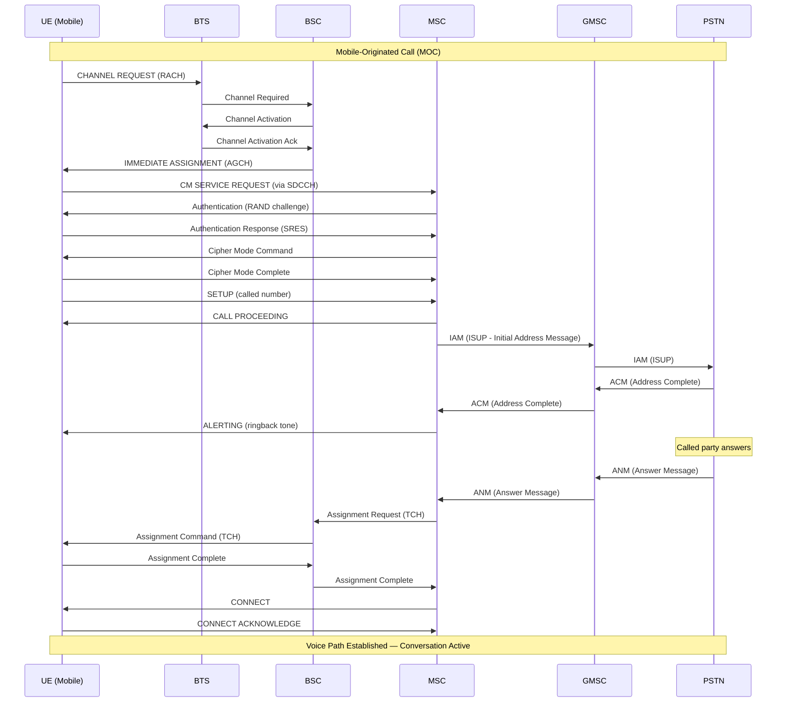
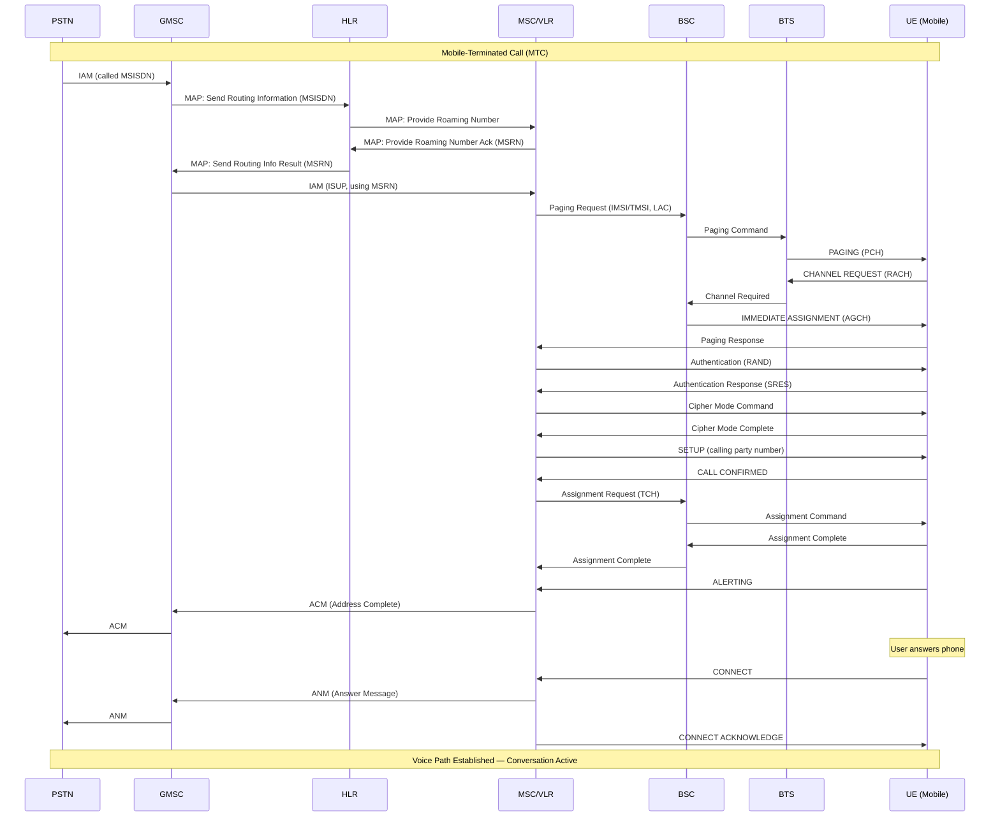
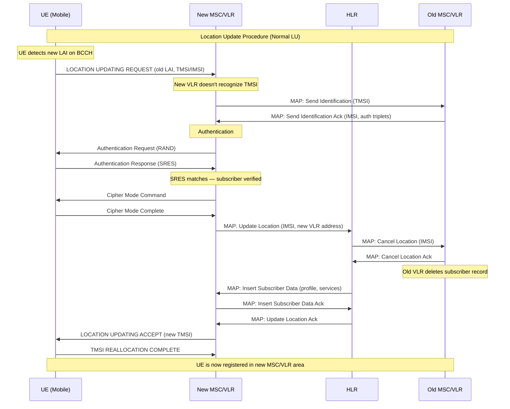
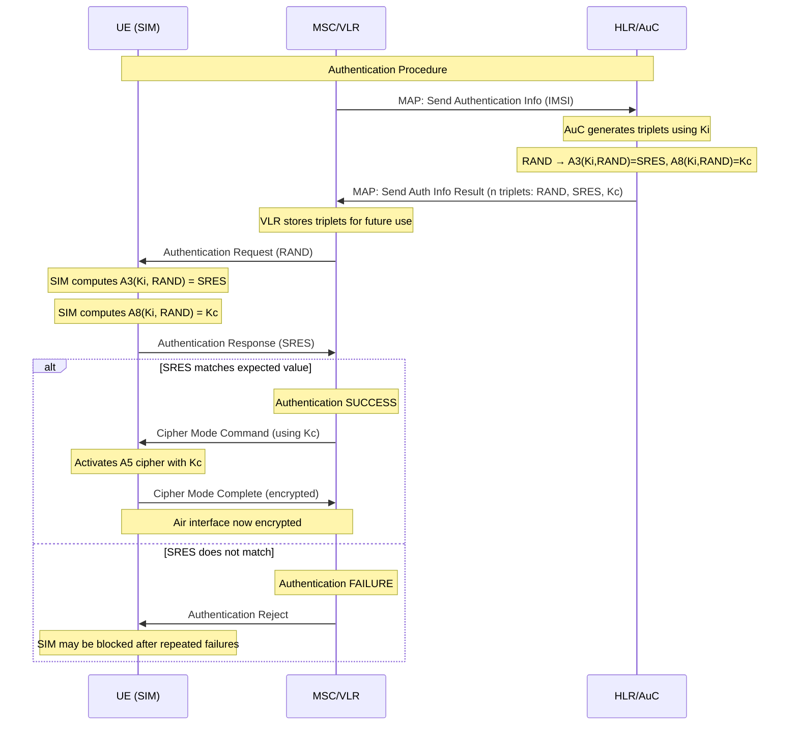

# ماژول 2: سوئیچینگ مداری 2G

## فهرست مطالب
1. [مبانی سوئیچینگ مداری](#1-مبانی-سوئیچینگ-مداری)
2. [مفاهیم سیگنالینگ SS7](#2-مفاهیم-سیگنالینگ-ss7)
3. [فرآیند برقراری تماس](#3-فرآیند-برقراری-تماس)
4. [مسیریابی تماس](#4-مسیریابی-تماس)
5. [رویه به‌روزرسانی مکان](#5-رویه-به‌روزرسانی-مکان)
6. [رویه احراز هویت](#6-رویه-احراز-هویت)
7. [رومینگ](#7-رومینگ)
8. [آزادسازی تماس](#8-آزادسازی-تماس)
9. [چرا سوئیچینگ مداری؟ و چرا به یک محدودیت تبدیل شد](#9-چرا-سوئیچینگ-مداری)

---

## 1. مبانی سوئیچینگ مداری

### مفهوم: مسیر اختصاصی

در سوئیچینگ مداری، یک **مسیر ارتباطی اختصاصی** بین دو نقطه انتهایی برای کل مدت تماس برقرار می‌شود. این مسیر به‌صورت انحصاری رزرو می‌شود — هیچ کاربر دیگری نمی‌تواند تا زمان آزادسازی تماس از آن منابع استفاده کند.

### چگونه در GSM کار می‌کند

| گام | اقدام |
|------|--------|
| 1 | تماس‌گیرنده تماسی را آغاز می‌کند |
| 2 | شبکه یک شکاف زمانی اختصاصی روی واسط رادیویی تخصیص می‌دهد (TDMA) |
| 3 | یک مسیر ثابت از طریق BTS ← BSC ← MSC ← ترانک تا مقصد رزرو می‌شود |
| 4 | منابع برای کل مدت تماس تخصیص‌یافته باقی می‌مانند |
| 5 | با قطع تماس، تمام منابع آزاد می‌شوند |

### رزرو منابع

- **واسط رادیویی**: یک شکاف زمانی TDMA اختصاصی (یکی از 8 شکاف در هر فرکانس حامل) تخصیص می‌یابد
- **واسط Abis** (BTS↔BSC): یک کانال 16 kbps یا 64 kbps روی لینک‌های E1/T1
- **واسط A** (BSC↔MSC): یک شکاف زمانی 64 kbps روی لینک‌های E1/T1
- **ترانک** (MSC↔PSTN/سایر MSC): یک مدار 64 kbps روی لینک‌های PCM

### ویژگی‌های کلیدی

- **اتصال‌گرا**: مسیر پیش از جریان داده برقرار می‌شود
- **پهنای باند تضمین‌شده**: 64 kbps ثابت در هر جهت پس از اتصال
- **تأخیر ثابت**: تأخیر قابل پیش‌بینی (هدف حدود 150ms سرتاسری)
- **ناکارآمد برای داده انفجاری**: منابع در دوره‌های سکوت هدر می‌روند

---

## 2. مفاهیم سیگنالینگ SS7

### SS7 چیست؟

**سیستم سیگنالینگ 7 (SS7)** پشته پروتکل سیگنالینگ خارج از باند است که توسط شبکه‌های مخابراتی برای موارد زیر استفاده می‌شود:
- برقراری و آزادسازی تماس‌ها
- مدیریت پایگاه‌های داده مشترکین
- فعال‌سازی رومینگ و تحویل‌ها
- ارائه خدمات تکمیلی (انتقال تماس، SMS و غیره)

سیگنالینگ SS7 از مسیر صدا **جدا** است — به این **سیگنالینگ کانال مشترک (CCS)** گفته می‌شود.

### پشته پروتکل SS7 (ساده‌شده)

```
┌─────────────────────────────────────────┐
│  Application Layer                       │
│  ┌───────┐  ┌───────┐  ┌───────┐       │
│  │ ISUP  │  │  MAP  │  │  CAP  │       │
│  └───┬───┘  └───┬───┘  └───┬───┘       │
│      │          │          │            │
│  ┌───┴──────────┴──────────┴───┐        │
│  │           TCAP               │        │
│  └──────────────┬──────────────┘        │
│  ┌──────────────┴──────────────┐        │
│  │           SCCP               │        │
│  └──────────────┬──────────────┘        │
│  ┌──────────────┴──────────────┐        │
│  │           MTP (1,2,3)        │        │
│  └─────────────────────────────┘        │
└─────────────────────────────────────────┘
```

### پروتکل‌های کلیدی

#### ISUP (بخش کاربر ISDN)
- **هدف**: برقراری، مدیریت و آزادسازی تماس بین مراکز تلفن (MSCها)
- **پیام‌ها**: IAM (پیام آدرس اولیه)، ACM (آدرس کامل)، ANM (پاسخ)، REL (آزادسازی)، RLC (آزادسازی کامل)
- **مورد استفاده برای**: برقراری مدار صوتی بین سوئیچ‌ها

#### MAP (بخش کاربرد موبایل)
- **هدف**: ارتباط بین عناصر شبکه GSM (MSC، HLR، VLR، AuC)
- **عملیات**: به‌روزرسانی مکان، بازیابی داده احراز هویت، پرس‌وجوهای اطلاعات مشترک، مسیریابی SMS
- **مورد استفاده برای**: مدیریت تحرک، رومینگ، تبادل داده مشترک

#### TCAP (بخش کاربرد قابلیت‌های تراکنش)
- **هدف**: فراهم‌کردن چارچوبی برای MAP و سایر کاربردها جهت تبادل داده ساخت‌یافته
- **مدل**: تراکنش‌های درخواست-پاسخ (invoke، result، error)
- **مورد استفاده برای**: حمل عملیات MAP روی شبکه SS7

### نقاط سیگنالینگ

| عنصر | نقش |
|---------|------|
| **SSP** (نقطه سوئیچینگ خدمات) | MSC/GMSC — سیگنالینگ را ایجاد/پایان می‌دهد |
| **STP** (نقطه انتقال سیگنال) | پیام‌های سیگنالینگ را بین SSPها مسیریابی می‌کند |
| **SCP** (نقطه کنترل خدمات) | گره‌های پایگاه داده (HLR، AuC) |

---

## 3. فرآیند برقراری تماس

### 3.1 تماس با مبدأ موبایل (MOC)

تماس با مبدأ موبایل توسط مشترک موبایل آغاز می‌شود.

#### توالی رویدادها

1. **UE شماره را می‌گیرد** ← پیام CHANNEL REQUEST را روی RACH می‌فرستد
2. **BTS** آن را به BSC ارسال می‌کند
3. **BSC** یک کانال اختصاصی (SDCCH) تخصیص می‌دهد ← IMMEDIATE ASSIGNMENT
4. **UE** پیام CM SERVICE REQUEST را (نوع خدمت = MOC) از طریق BSC به MSC می‌فرستد
5. **MSC** مشترک را احراز هویت می‌کند (به بخش 6 مراجعه کنید)
6. **MSC** رمزگذاری را فعال می‌کند
7. **UE** پیام SETUP را با شماره طرف مقابل می‌فرستد
8. **MSC** پیام CALL PROCEEDING را به UE می‌فرستد
9. **MSC** ارقام را تحلیل می‌کند، مسیریابی را تعیین می‌کند
10. **MSC** پیام IAM (ISUP) را به‌سمت GMSC/PSTN می‌فرستد
11. **GMSC/PSTN** پیام ACM (آدرس کامل) را بازمی‌گرداند ← زنگ برگشتی
12. **MSC** پیام ALERTING را به UE می‌فرستد
13. **طرف مقابل پاسخ می‌دهد** ← ANM (پیام پاسخ) بازگردانده می‌شود
14. **MSC** پیام CONNECT را به UE می‌فرستد
15. **BSC** یک TCH (کانال ترافیک) برای صدا تخصیص می‌دهد
16. **مسیر صدا برقرار می‌شود** — گفتگو آغاز می‌شود

#### نمودار توالی MOC



### 3.2 تماس با مقصد موبایل (MTC)

تماس با مقصد موبایل تماسی است که برای یک مشترک موبایل می‌رسد.

#### توالی رویدادها

1. **PSTN/طرف تماس‌گیرنده** پیام IAM را با MSISDN مقصد به GMSC می‌فرستد
2. **GMSC** از HLR پرس‌وجو می‌کند: «این مشترک کجاست؟» (MAP: Send Routing Info)
3. **HLR** مقدار MSRN (شماره رومینگ ایستگاه موبایل) را که به MSC خدمات‌دهنده اشاره دارد بازمی‌گرداند
4. **GMSC** تماس را با استفاده از MSRN (IAM) به MSC خدمات‌دهنده مسیریابی می‌کند
5. **MSC** از VLR وضعیت مشترک و ناحیه مکانی را پرس‌وجو می‌کند
6. **MSC** UE را در ناحیه مکانی صفحه‌بندی می‌کند
7. **UE** به صفحه‌بندی روی RACH پاسخ می‌دهد
8. **BSC** کانال SDCCH را تخصیص می‌دهد ← احراز هویت و رمزگذاری
9. **MSC** پیام SETUP را به UE می‌فرستد
10. **UE** پیام CALL CONFIRMED را می‌فرستد
11. **UE** به کاربر هشدار می‌دهد (آهنگ زنگ)
12. **کاربر پاسخ می‌دهد** ← UE پیام CONNECT را می‌فرستد
13. **MSC** پیام ANM را به‌سمت GMSC/PSTN بازمی‌گرداند
14. **کانال ترافیک تخصیص می‌یابد** — مسیر صدا فعال است

#### نمودار توالی MTC



---

## 4. مسیریابی تماس

### چگونه MSC/GMSC تماس‌ها را با استفاده از HLR مسیریابی می‌کند

HLR **پایگاه داده اصلی** تمام مشترکین است. می‌داند که در حال حاضر کدام MSC/VLR به هر مشترک خدمات می‌دهد.

### مسیریابی یک تماس با مقصد موبایل

```
Step 1: PSTN delivers call to GMSC (based on MSISDN number plan)
Step 2: GMSC sends MAP "Send Routing Information" to HLR
Step 3: HLR identifies the serving MSC/VLR for that subscriber
Step 4: HLR asks serving VLR to allocate an MSRN (temporary routing number)
Step 5: VLR returns MSRN to HLR
Step 6: HLR returns MSRN to GMSC
Step 7: GMSC uses MSRN to route the ISUP IAM to the correct MSC
```

### MSRN (شماره رومینگ ایستگاه موبایل)

- شماره موقت در قالب E.164
- مانند یک شماره تلفن عادی در طرح شماره‌گذاری شبکه خدمات‌دهنده به نظر می‌رسد
- به GMSC امکان می‌دهد تماس را با استفاده از ISUP استاندارد و بدون اطلاع از جزئیات داخلی GSM مسیریابی کند
- به‌ازای هر تماس تخصیص می‌یابد و پس از مسیریابی آزاد می‌شود

### مسیریابی یک تماس با مبدأ موبایل

برای MOC، مسیریابی ساده‌تر است:
1. MSC ارقام گرفته‌شده را از UE دریافت می‌کند
2. MSC تحلیل ارقام را انجام می‌دهد (طرح شماره‌گذاری، پیشوندها، خدمات تکمیلی)
3. MSC تماس را از طریق ISUP به‌سمت ترانک/دروازه GMSC/PSTN مناسب مسیریابی می‌کند
4. اگر تماس به موبایل دیگری در همان شبکه باشد ← MSC ممکن است از HLR برای MSRN پرس‌وجو کند

---

## 5. رویه به‌روزرسانی مکان

### چرا به‌روزرسانی‌های مکان لازم هستند

شبکه باید بداند **مشترک کجاست** تا تماس‌ها و پیام‌ها را تحویل دهد. بدون ردیابی مکان:
- شبکه باید هر سلول در کل کشور را صفحه‌بندی کند
- این کار ظرفیت کانال صفحه‌بندی را اشباع می‌کرد
- زمان برقراری تماس غیرقابل قبول می‌شد

به‌روزرسانی‌های مکان به شبکه امکان می‌دهند **صفحه‌بندی را به یک ناحیه مکانی مشخص** (گروهی از سلول‌ها) محدود کند.

### انواع به‌روزرسانی‌های مکان

| نوع | محرک |
|------|---------|
| **IMSI Attach** | گوشی روشن می‌شود — به شبکه اطلاع می‌دهد که مشترک قابل دسترسی است |
| **LU عادی** | UE به ناحیه مکانی جدیدی می‌رود (LAI جدید روی BCCH را تشخیص می‌دهد) |
| **LU دوره‌ای** | به‌روزرسانی مبتنی بر تایمر برای تأیید اینکه UE هنوز قابل دسترسی است |
| **IMSI Detach** | گوشی به‌صورت صحیح خاموش می‌شود — به شبکه اطلاع می‌دهد |

### نمودار توالی به‌روزرسانی مکان



### IMSI Attach

وقتی گوشی روشن می‌شود:
1. UE کانال BCCH را می‌خواند تا LAI و اطلاعات شبکه را به دست آورد
2. UE پیام LOCATION UPDATING REQUEST را با پرچم attach می‌فرستد
3. همان رویه LU عادی دنبال می‌شود
4. VLR مشترک را به‌عنوان «متصل» (قابل دسترسی) علامت‌گذاری می‌کند

### به‌روزرسانی مکان دوره‌ای

- شبکه یک مقدار تایمر (T3212) را روی BCCH پخش می‌کند
- UE باید پیش از انقضای تایمر یک LU بفرستد، حتی اگر جابه‌جا نشده باشد
- اگر تایمر بدون LU منقضی شود، VLR مشترک را «به‌صورت ضمنی جدا شده» علامت‌گذاری می‌کند
- هدف: تشخیص گوشی‌هایی که بدون IMSI Detach خاموش شده‌اند (باتری تمام شده و غیره)

---

## 6. رویه احراز هویت

### هدف

احراز هویت تضمین می‌کند که مشترک همان کسی است که ادعا می‌کند، و از موارد زیر جلوگیری می‌کند:
- دسترسی غیرمجاز به شبکه
- کلاهبرداری با SIM کلون‌شده
- شنود (در ترکیب با رمزگذاری)

### سه‌گانه احراز هویت

AuC (مرکز احراز هویت، هم‌مکان با HLR) **سه‌گانه‌های احراز هویت** را تولید می‌کند:

| عنصر | اندازه | هدف |
|---------|------|---------|
| **RAND** | 128 بیت | چالش تصادفی فرستاده‌شده به UE |
| **SRES** | 32 بیت | پاسخ مورد انتظار (محاسبه‌شده از RAND + Ki) |
| **Kc** | 64 بیت | کلید رمز برای رمزنگاری واسط رادیویی |

### چگونه سه‌گانه‌ها تولید می‌شوند

```
Ki (128-bit secret key, stored in SIM and AuC)
    │
    ├── A3 algorithm (RAND + Ki) → SRES (32 bits)
    │
    └── A8 algorithm (RAND + Ki) → Kc (64 bits)
```

- **Ki** هرگز از کارت SIM یا AuC خارج نمی‌شود
- همان محاسبه به‌صورت مستقل در هر دو طرف انجام می‌شود
- اگر SRES از UE با SRES از سه‌گانه مطابقت داشته باشد ← مشترک احراز هویت شده است

### نمودار توالی احراز هویت



### نکات کلیدی

- VLR **چندین سه‌گانه** ذخیره می‌کند (معمولاً 5) تا از پرس‌وجو از HLR برای هر تراکنش اجتناب کند
- احراز هویت در موارد زیر انجام می‌شود: برقراری تماس، به‌روزرسانی مکان، SMS، فعال‌سازی خدمات تکمیلی
- احراز هویت GSM **یک‌طرفه** است — شبکه UE را احراز هویت می‌کند، اما UE شبکه را احراز هویت نمی‌کند (آسیب‌پذیری که در 3G/UMTS برطرف شد)

---

## 7. رومینگ

### مفاهیم

| اصطلاح | تعریف |
|------|------------|
| **HPLMN** | PLMN خانگی — شبکه‌ای که مشترک اشتراک خود را در آن دارد |
| **VPLMN** | PLMN بازدیدشده — شبکه خارجی که مشترک در حین رومینگ از آن استفاده می‌کند |
| **توافق رومینگ** | توافق تجاری + فنی بین دو اپراتور |
| **GRX/IPX** | شبکه اتصال‌دهنده برای سیگنالینگ بین PLMNها |

### رومینگ چگونه کار می‌کند

1. **UE در کشور خارجی روشن می‌شود** ← VPLMN را انتخاب می‌کند (بر اساس فهرست PLMN ترجیحی SIM)
2. **UE به‌روزرسانی مکان را انجام می‌دهد** به MSC/VLR مربوط به VPLMN
3. **VLR مربوط به VPLMN** با **HLR مربوط به HPLMN** از طریق SS7/MAP (از طریق لینک‌های سیگنالینگ بین‌المللی) تماس می‌گیرد
4. **HLR** مشترک را احراز هویت می‌کند (سه‌گانه‌ها را به VPLMN می‌فرستد)
5. **HLR** پروفایل مشترک را به VLR مربوط به VPLMN می‌فرستد
6. **HLR** آدرس VLR مربوط به VPLMN را به‌عنوان مکان فعلی مشترک ثبت می‌کند
7. **مشترک اکنون می‌تواند از طریق VPLMN تماس بگیرد/دریافت کند**

### مسیر سیگنالینگ برای رومینگ

```
UE → VPLMN(BTS→BSC→MSC/VLR) ←──SS7/MAP──→ HPLMN(HLR/AuC)
                                    │
                          (via STP/International SS7 links)
```

### تماس ورودی به یک مشترک در حال رومینگ

1. تماس به GMSC مربوط به HPLMN می‌رسد
2. GMSC از HLR پرس‌وجو می‌کند ← می‌فهمد که مشترک در VPLMN است
3. HLR از VLR مربوط به VPLMN درخواست MSRN می‌کند
4. VLR مربوط به VPLMN مقدار MSRN را بازمی‌گرداند
5. HLR مقدار MSRN را به GMSC می‌دهد
6. GMSC تماس را با استفاده از MSRN (از طریق ترانک‌های بین‌المللی) به MSC مربوط به VPLMN مسیریابی می‌کند
7. MSC مربوط به VPLMN مشترک را صفحه‌بندی و متصل می‌کند

### تماس خروجی از یک مشترک در حال رومینگ

1. UE تماسی را در VPLMN آغاز می‌کند
2. MSC مربوط به VPLMN تماس را به‌صورت محلی مدیریت می‌کند
3. تماس از VPLMN به مقصد مسیریابی می‌شود (ممکن است از HPLMN عبور کند یا مستقیم برود)
4. پروتکل CAMEL/CAP ممکن است برای کنترل پیش‌پرداخت از HPLMN استفاده شود

---

## 8. آزادسازی تماس

### آزادسازی عادی تماس (با شروع موبایل)

1. **UE** پیام DISCONNECT را به MSC می‌فرستد
2. **MSC** پیام REL (آزادسازی) را از طریق ISUP به‌سمت انتهای دور می‌فرستد
3. **انتهای دور** با RLC (آزادسازی کامل) پاسخ می‌دهد
4. **MSC** پیام RELEASE را به UE می‌فرستد
5. **UE** پیام RELEASE COMPLETE را می‌فرستد
6. **BSC** کانال TCH (کانال ترافیک) را آزاد می‌کند
7. **تمام منابع آزاد می‌شوند**: شکاف‌های زمانی، ترانک‌ها، ارجاعات مدار

### آزادسازی با شروع شبکه

می‌تواند توسط موارد زیر فعال شود:
- قطع تماس از انتهای دور
- شکست لینک رادیویی (UE خارج از پوشش)
- انقضای تایمر BSC/MSC
- قطع اداری

### پیام‌های آزادسازی ISUP

```
Calling side                          Called side
    │                                      │
    │◄──── REL (Release) ─────────────────│  (or either direction)
    │───── RLC (Release Complete) ────────►│
    │                                      │
    Circuit freed                    Circuit freed
```

---

## 9. چرا سوئیچینگ مداری؟

### چرا سوئیچینگ مداری برای صدا استفاده می‌شد

#### نیازمندی‌های صدا
- **نرخ بیت ثابت**: 13 kbps (نرخ کامل) یا 6.5 kbps (نرخ نصف) — جریان پیوسته
- **تأخیر کم و قابل پیش‌بینی**: کمتر از 150ms یک‌طرفه برای کیفیت گفتگوی قابل قبول
- **عدم تحمل جیتر**: گوش انسان به تأخیر متغیر بسیار حساس است
- **ترافیک متقارن**: هر دو طرف تقریباً به یک اندازه صحبت می‌کنند

#### چرا سوئیچینگ مداری برای صدا مناسب است

| نیازمندی | چگونه CS آن را برآورده می‌کند |
|-------------|-------------------|
| تأخیر کم | مسیر اختصاصی = بدون تأخیر صف |
| بدون جیتر | تخصیص شکاف زمانی ثابت = تأخیر ثابت |
| پهنای باند تضمین‌شده | منابع رزروشده = بدون افت ناشی از ازدحام |
| پردازش ساده | پس از برقراری مسیر، سوئیچینگ بی‌اهمیت است |
| بلادرنگ | بدون تأخیر ذخیره-و-ارسال |

#### زمینه تاریخی (دهه 1980-90)
- توان پردازشی گران بود — سوئیچینگ ساده ترجیح داده می‌شد
- حافظه گران بود — بدون بافرینگ/بسته‌بندی‌سازی
- PSTN موجود سوئیچینگ مداری بود — یکپارچگی طبیعی
- صدا **تنها** خدمت مورد انتظار از تلفن‌های موبایل بود

### چرا سوئیچینگ مداری به یک محدودیت تبدیل شد

#### مشکل با داده

| مسئله | توضیح |
|-------|-------------|
| **هدر رفتن منابع** | یک مدار 64 kbps حتی در سکوت نگه داشته می‌شود (50-60% یک تماس صوتی) |
| **بدون مالتی‌پلکسینگ آماری** | نمی‌توان منابع را به‌صورت پویا بین چندین کاربر به اشتراک گذاشت |
| **پهنای باند ثابت** | حتی وقتی شبکه بیکار است نمی‌توان بالاتر از 64 kbps انفجار داشت |
| **تأخیر برقراری تماس** | 3-7 ثانیه برای برقراری یک مدار — غیرقابل قبول برای وب‌گردی |
| **صورت‌حساب دقیقه‌ای** | ناکارآمد برای بررسی ایمیل (30 ثانیه داده، صورتحساب 1 دقیقه) |
| **مقیاس‌پذیری** | هر نشست داده یک مدار صوتی کامل مصرف می‌کند |

#### ویژگی‌های ترافیک داده در برابر صدا

```
Voice:        ████████████████████████████  (continuous, symmetric)
Web Browsing: ██░░░░░░██░░░░░░░░██░░░░░░░  (bursty, asymmetric)
Email:        █░░░░░░░░░░░░░░░░░░░░░░░░░░  (very short burst)
```

سوئیچینگ مداری **نمی‌تواند به‌طور کارآمد ترافیک انفجاری را مدیریت کند** زیرا منابع رزرو می‌شوند اما بیشتر مواقع بلااستفاده می‌مانند.

#### مسیر تحول

```
2G CS (voice only) 
  → 2.5G GPRS (packet data overlay, CS voice remains)
    → 3G UMTS (CS voice + PS data on same carrier)
      → 4G LTE (all-IP, packet-switched voice via VoLTE)
        → 5G NR (fully packet-switched, network slicing)
```

### خلاصه

سوئیچینگ مداری در دهه 1990 **انتخاب درست** برای صدا بود — این فناوری با توان موجود در آن زمان، تضمین‌های کیفی مورد نیاز ارتباط صوتی را فراهم می‌کرد. اما با تغییر کاربرد موبایل از صرفاً صدا به خدمات داده‌محور، ناکارآمدی نگه‌داشتن مدارهای اختصاصی برای ترافیک داده انفجاری و نامتقارن، سوئیچینگ بسته‌ای را به جانشین اجتناب‌ناپذیر تبدیل کرد.

---

## خلاصه اصطلاحات کلیدی

| اصطلاح | تعریف |
|------|------------|
| **MOC** | تماس با مبدأ موبایل |
| **MTC** | تماس با مقصد موبایل |
| **MSRN** | شماره رومینگ ایستگاه موبایل — شماره موقت برای مسیریابی تماس |
| **IAM** | پیام آدرس اولیه — پیام ISUP برای آغاز یک تماس |
| **ACM** | پیام آدرس کامل — طرف مقابل در حال هشدار است |
| **ANM** | پیام پاسخ — طرف مقابل پاسخ داده است |
| **REL/RLC** | آزادسازی / آزادسازی کامل — آزادسازی تماس |
| **LAI** | هویت ناحیه مکانی — یک گروه از سلول‌ها را شناسایی می‌کند |
| **TMSI** | هویت موقت مشترک موبایل — محافظت از حریم خصوصی |
| **Ki** | کلید مخفی مشترک بین SIM و AuC |
| **SRES** | پاسخ امضاشده — اثبات احراز هویت |
| **Kc** | کلید رمز مشتق‌شده در حین احراز هویت |
| **VPLMN** | PLMN بازدیدشده — شبکه خارجی در حین رومینگ |
| **HPLMN** | PLMN خانگی — شبکه خانگی مشترک |

---

*ماژول بعدی: [ماژول 3 — GPRS و سوئیچینگ بسته‌ای](03_gprs_packet_switching.md)*
