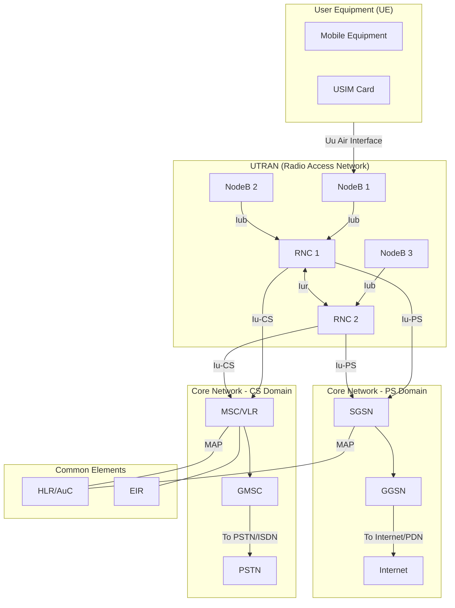

# Module 3: 2G/3G Core Networks

## 3.1 Evolution from 2G to 3G — The Driving Forces

### Why Did We Need 3G?

The transition from 2G (GSM) to 3G (UMTS) was driven by fundamental market and technology demands:

1. **Exploding Data Demand**: SMS and basic WAP browsing were insufficient. Users wanted email, web browsing, and file downloads on mobile devices.
2. **Multimedia Services**: Video calling, streaming audio/video, and rich content required bandwidth far beyond GSM's 9.6 kbps (or even GPRS's theoretical 171 kbps).
3. **Higher Data Rates**: The ITU's IMT-2000 vision targeted:
   - 144 kbps for high mobility (vehicular)
   - 384 kbps for pedestrian
   - 2 Mbps for stationary/indoor
4. **Global Roaming**: A unified worldwide standard (unlike fragmented 2G: GSM vs CDMA vs PDC).
5. **Spectrum Efficiency**: WCDMA's spreading codes allow more users per cell with graceful degradation.

### The Evolution Path

```
GSM (2G) → GPRS (2.5G) → EDGE (2.75G) → UMTS (3G) → HSPA (3.5G) → HSPA+ (3.75G) → LTE (4G)
  9.6 kbps    171 kbps      384 kbps      2 Mbps       14.4 Mbps      42 Mbps        300 Mbps
```

---

## 3.2 UMTS Architecture Overview

UMTS (Universal Mobile Telecommunications System) is built on two major domains:

- **UTRAN** (UMTS Terrestrial Radio Access Network) — the radio/air interface side
- **Core Network (CN)** — the intelligence and connectivity backbone

### Key Design Principles

- Backward compatibility with GSM/GPRS core
- Separation of radio access from core network (allowing independent evolution)
- Split core into Circuit-Switched (CS) and Packet-Switched (PS) domains
- Support for simultaneous voice and data


### UMTS Architecture Diagram



---


## 3.3 UTRAN: NodeB and RNC

### NodeB (Base Station)

The NodeB is the 3G equivalent of the GSM BTS (Base Transceiver Station):

| Aspect | Function |
|--------|----------|
| **Primary Role** | Radio transmission/reception over the Uu air interface |
| **Spreading/Despreading** | Applies WCDMA spreading codes |
| **Power Control** | Inner-loop power control (fast, 1500 Hz) |
| **Soft Handover** | Supports macro-diversity combining |
| **Channel Coding** | Encoding/decoding of transport channels |
| **Interface** | Connected to RNC via Iub interface (ATM or IP-based) |

> **Key Difference from GSM BTS**: NodeB has MORE intelligence — it handles fast power control and soft handover combining locally, reducing latency.

### RNC (Radio Network Controller)

The RNC is the 3G equivalent of the GSM BSC, but with significantly more responsibilities:

| Aspect | Function |
|--------|----------|
| **Radio Resource Management** | Admission control, code allocation, load control |
| **Handover Decision** | Soft/softer/hard handover management |
| **Outer-Loop Power Control** | SIR target adjustment |
| **Ciphering/Integrity** | Security functions for user data and signaling |
| **Protocol Termination** | RRC (Radio Resource Control) protocol endpoint |
| **Macro-Diversity Combining** | Combines signals from multiple NodeBs |
| **Segmentation/Reassembly** | RLC layer processing |

### RNC Roles (One RNC Can Play Multiple Roles)

- **Serving RNC (S-RNC)**: Maintains the RRC connection with UE, performs outer-loop power control
- **Drift RNC (D-RNC)**: Provides radio resources when UE moves but S-RNC doesn't change
- **Controlling RNC (C-RNC)**: Controls the logical resources of its NodeBs

### UTRAN Interfaces

| Interface | Connects | Protocol Stack | Purpose |
|-----------|----------|---------------|---------|
| **Uu** | UE ↔ NodeB | WCDMA air interface | Radio transmission |
| **Iub** | NodeB ↔ RNC | NBAP over ATM/IP | NodeB control and user data |
| **Iur** | RNC ↔ RNC | RNSAP over ATM/IP | Inter-RNC soft handover, relocation |
| **Iu-CS** | RNC ↔ MSC | RANAP over ATM | Circuit-switched traffic |
| **Iu-PS** | RNC ↔ SGSN | RANAP over IP | Packet-switched traffic |

---


## 3.4 3G Core Network: CS Domain + PS Domain

The 3G core network inherits the GSM/GPRS split architecture, maintaining two parallel domains:

### Circuit-Switched (CS) Domain

Handles real-time voice calls and video telephony (same as GSM core, upgraded for 3G).

| Element | Role |
|---------|------|
| **MSC (Mobile Switching Centre)** | Call routing, handover between RNCs, call control signaling |
| **VLR (Visitor Location Register)** | Temporary storage of subscriber data for visitors in the MSC area |
| **GMSC (Gateway MSC)** | Interface to external networks (PSTN, ISDN), handles incoming calls |
| **HLR (Home Location Register)** | Permanent subscriber database (shared with PS domain) |
| **AuC (Authentication Centre)** | Stores authentication keys (Ki), generates security vectors |
| **EIR (Equipment Identity Register)** | IMEI blacklist/whitelist for stolen device blocking |

**CS Domain Call Flow**:
```
UE → NodeB → RNC →(Iu-CS)→ MSC/VLR → GMSC → PSTN
```

### Packet-Switched (PS) Domain

Handles all data services (web, email, streaming) — evolved from GPRS.

| Element | Role |
|---------|------|
| **SGSN (Serving GPRS Support Node)** | Packet routing, mobility management, session management, ciphering |
| **GGSN (Gateway GPRS Support Node)** | Interface to external packet networks (Internet), IP address allocation, billing anchor |

**PS Domain Data Flow**:
```
UE → NodeB → RNC →(Iu-PS)→ SGSN →(Gn)→ GGSN → Internet
```

### Why Two Domains?

The split CS/PS approach was a **pragmatic engineering decision**:

1. **Legacy Compatibility**: Voice infrastructure (SS7, PSTN interconnect) was mature and reliable — no reason to rebuild it
2. **QoS Guarantees**: Circuit-switching provides deterministic delay for voice (guaranteed 20ms frame delivery)
3. **Incremental Deployment**: Operators could add PS domain without disrupting existing voice revenue
4. **Risk Mitigation**: IP networks in 2000 couldn't guarantee voice quality — packet loss and jitter were real problems

---

## 3.5 The Iu Interface

The Iu interface is the critical boundary between UTRAN and the Core Network.

### Iu-CS (Circuit-Switched)

- **Transport**: ATM (AAL2 for user plane, AAL5 for control plane)
- **Control Plane**: RANAP → SCCP → M3UA → SCTP (or MTP3b)
- **User Plane**: Iu UP protocol (framing for AMR voice codec frames)
- **Purpose**: Carries voice calls and video telephony

### Iu-PS (Packet-Switched)

- **Transport**: IP-based (GTP-U for user plane)
- **Control Plane**: RANAP → SCCP → M3UA → SCTP
- **User Plane**: GTP-U (GPRS Tunneling Protocol - User plane)
- **Purpose**: Carries all packet data (web, email, streaming)

### RANAP (Radio Access Network Application Part)

Key procedures over Iu:
- **RAB (Radio Access Bearer) Assignment**: Sets up the end-to-end bearer
- **Relocation**: Moves Serving RNC role to another RNC (hard handover)
- **Paging**: Core network pages UE through UTRAN
- **Security Mode**: Activates ciphering and integrity protection
- **Direct Transfer**: Passes NAS messages transparently (e.g., MM, CC, SM)

---


## 3.6 Release 99 vs Release 5+ (HSPA Evolution)

### Release 99 (R99) — Original UMTS

- **Downlink**: Up to 384 kbps (dedicated channels)
- **Uplink**: Up to 384 kbps
- **Channel Type**: Dedicated Channel (DCH) — one code per user
- **Scheduling**: Done at RNC level (slow, ~100ms TTI)
- **Power Control**: Primary mechanism for link adaptation
- **Limitation**: Inefficient for bursty data (keeps resources allocated even during silence)

### Release 5 — HSDPA (High Speed Downlink Packet Access)

| Feature | Improvement |
|---------|------------|
| **Peak Rate** | 14.4 Mbps (DL) |
| **Shared Channel** | HS-DSCH — time-multiplexed among users |
| **Scheduling** | Moved to NodeB (2ms TTI — fast, channel-aware) |
| **AMC** | Adaptive Modulation & Coding (QPSK → 16QAM → 64QAM) |
| **HARQ** | Hybrid ARQ with soft combining at NodeB |
| **No Power Control** | Transmits at full power, adapts rate instead |

### Release 6 — HSUPA (High Speed Uplink Packet Access)

| Feature | Improvement |
|---------|------------|
| **Peak Rate** | 5.76 Mbps (UL) |
| **Channel** | E-DCH (Enhanced Dedicated Channel) |
| **Scheduling** | NodeB-controlled with 2ms/10ms TTI |
| **HARQ** | Uplink soft combining |
| **Benefit** | Better latency, higher throughput for uploads |

### Release 7/8 — HSPA+

- **64QAM downlink**, **16QAM uplink**
- **MIMO** (2×2) for downlink
- **Dual-carrier** operation (2 × 5 MHz)
- Peak rates: **42 Mbps DL**, **11.5 Mbps UL**
- **Flat architecture option**: Direct NodeB-to-GGSN (bypassing RNC)

### The Shift in Philosophy

```
R99:  RNC controls everything → Centralized, slow adaptation
R5+:  NodeB makes fast decisions → Distributed, rapid adaptation (2ms vs 100ms)
```

This shift foreshadowed LTE's design where the eNodeB handles almost all radio decisions.

---

## 3.7 IMS (IP Multimedia Subsystem) — Introduction

### What is IMS?

IMS is a **framework for delivering IP-based multimedia services** over mobile networks. Introduced in 3GPP Release 5, it represents the vision of converging ALL services (voice, video, messaging, presence) onto IP.

### Why IMS?

| Problem | IMS Solution |
|---------|-------------|
| CS domain can't evolve (legacy SS7) | All-IP signaling using SIP |
| Adding new services requires network upgrades | Application servers plug in modularly |
| Voice and data are separate worlds | Unified session control for all media |
| No service interaction (voice OR data) | Combinational services (voice + video + sharing) |

### Key IMS Components

- **P-CSCF (Proxy-CSCF)**: First contact point, SIP proxy, policy enforcement
- **I-CSCF (Interrogating-CSCF)**: Entry point from other networks, routes to correct S-CSCF
- **S-CSCF (Serving-CSCF)**: Core session control, service trigger logic, SIP registrar
- **HSS (Home Subscriber Server)**: Evolution of HLR, stores user profiles and service triggers
- **Application Servers**: Provide actual services (VoIP, conferencing, messaging)

### IMS Signaling Protocol: SIP

IMS uses **SIP (Session Initiation Protocol)** instead of SS7:
- Text-based, extensible
- Works natively over IP
- Supports any media type (voice, video, gaming, IoT)
- Enables service composition and mashups

### IMS's Role in the 2G→4G Journey

```
2G: Voice = CS (SS7)          Data = None/CSD
3G: Voice = CS (SS7)          Data = PS (GTP)         IMS = Optional overlay
4G: Voice = VoLTE via IMS     Data = PS (GTP)         IMS = Mandatory for voice
5G: Voice = VoNR via IMS      Data = PS (GTP/SBA)     IMS = Still essential
```

---


## 3.8 Major Comparison Table: Mobile Network Generations

| Feature | 2G (GSM) | 2.5G (GPRS) | 3G (UMTS R99) | 3.5G (HSPA) | 4G (LTE) |
|---------|----------|-------------|---------------|-------------|----------|
| **Radio Access** | TDMA/FDMA (200 kHz channels, 8 timeslots) | Same as GSM (shared timeslots) | WCDMA (5 MHz carrier, spreading codes) | WCDMA + shared channels (HS-DSCH/E-DCH) | OFDMA DL / SC-FDMA UL (1.4–20 MHz) |
| **Core Network** | MSC/VLR/HLR (SS7-based) | MSC + SGSN/GGSN added | MSC/VLR (CS) + SGSN/GGSN (PS) | Same as 3G (optional flat arch in HSPA+) | EPC: MME/S-GW/P-GW (all-IP, flat) |
| **Switching Type** | Circuit-switched only | CS (voice) + PS (data) | CS (voice) + PS (data) | CS (voice) + PS (data) | Packet-switched ONLY |
| **Peak Data Rate (DL)** | 9.6 kbps (CSD) / 14.4 kbps (HSCSD) | 171.2 kbps (theoretical) / ~40 kbps (practical) | 384 kbps (pedestrian) / 2 Mbps (indoor) | 14.4 Mbps (HSDPA) / 42 Mbps (HSPA+) | 300 Mbps (Cat 5) / 3 Gbps (Cat 20) |
| **Peak Data Rate (UL)** | 9.6 kbps | 171.2 kbps (theoretical) / ~20 kbps (practical) | 384 kbps | 5.76 Mbps (HSUPA) / 11.5 Mbps (HSPA+) | 75 Mbps (Cat 5) / 1.5 Gbps (Cat 20) |
| **Latency (RTT)** | ~500 ms (data) | ~300–600 ms | ~150–200 ms | ~50–100 ms (HSPA) / ~30 ms (HSPA+) | ~10–30 ms (user plane) / ~50 ms (control) |
| **Mobility Support** | Handover (hard) up to 250 km/h | Same as GSM | Soft handover + hard handover, up to 500 km/h | Same as UMTS | Hard handover only, up to 500 km/h |
| **Signaling Protocol** | SS7 (MAP, ISUP, BSSAP) | SS7 + GTP-C | SS7 (RANAP, MAP) + GTP-C | Same as 3G | Diameter + GTP-C v2 (all IP-based) |
| **Main Innovation** | Digital voice, SMS, roaming, SIM | Always-on data, IP connectivity, shared radio | Wideband data, video calls, multimedia, soft handover | Fast scheduling at NodeB, AMC, HARQ, shared channels | All-IP flat architecture, OFDMA, MIMO, VoLTE |
| **Main Limitation** | No real data capability | Low throughput, high latency, shared with voice timeslots | Dedicated channels waste resources for bursty data | Still CS voice, complex dual-stack | No native voice (needs VoLTE/IMS), complex handover to 2G/3G |

---


## 3.9 The CS/PS Split — And Why LTE Killed It

### The Problem with Dual Domains

Running CS and PS domains in parallel meant:

```
┌─────────────────────────────────────────────────────────┐
│                    OPERATOR NETWORK                       │
│                                                          │
│   ┌──────────────┐         ┌──────────────────────┐     │
│   │  CS Domain   │         │     PS Domain        │     │
│   │  ─────────── │         │  ───────────────     │     │
│   │  MSC/VLR     │         │  SGSN                │     │
│   │  GMSC        │         │  GGSN                │     │
│   │  MGW         │         │                      │     │
│   │  SS7 network │         │  GTP tunnels         │     │
│   │  TDM trunks  │         │  IP routers          │     │
│   └──────────────┘         └──────────────────────┘     │
│         ↕                            ↕                   │
│   Voice/Video calls           Data services              │
│   (64 kbps circuits)          (variable rate IP)         │
└─────────────────────────────────────────────────────────┘
```

### Costs of the Split Architecture

| Problem | Impact |
|---------|--------|
| **Duplicate infrastructure** | Two complete core networks to maintain, upgrade, and staff |
| **Inefficient spectrum use** | CS reserves capacity even during silence (60% of a call is silence) |
| **No service convergence** | Voice and data can't easily interact (e.g., sharing a photo during a call) |
| **SS7 is legacy** | Hard to extend, proprietary equipment, no IP ecosystem benefits |
| **Separate billing** | Voice minutes + data MB = complex charging systems |
| **Scaling limitations** | CS scales with ports/trunks (expensive), PS scales with bandwidth (cheap) |

### Why LTE Unified to Packet-Only (EPC)

LTE's Evolved Packet Core (EPC) made a radical decision: **NO circuit-switching at all**.

#### The Technical Enablers (What Changed by 2008):

1. **IP Networks Matured**: QoS mechanisms (DiffServ, MPLS, dedicated bearers) could now guarantee voice quality
2. **Codec Efficiency**: AMR-WB and EVS codecs work well over IP with minimal bandwidth (~12 kbps)
3. **Low Latency Achieved**: LTE's ~10ms RTT is actually BETTER than CS voice (~50ms codec delay anyway)
4. **VoIP Proven**: Skype, Vonage proved IP voice was commercially viable
5. **IMS Was Ready**: After years of development, IMS could replace SS7 call control with SIP
6. **Economics**: IP equipment costs 1/10th of equivalent TDM/SS7 equipment

#### The EPC Architecture (All Packet):

| Element | Replaces | Function |
|---------|----------|----------|
| **MME** | MSC (control plane) | Mobility, authentication, bearer management — signaling only |
| **S-GW** | SGSN (user plane) | Local mobility anchor, data forwarding between eNodeBs |
| **P-GW** | GGSN | External network gateway, IP allocation, policy/charging |
| **HSS** | HLR + AuC | Subscriber data, authentication vectors |
| **PCRF** | — (new) | Policy and Charging Rules — enables QoS per-flow |

#### How Voice Works Without CS (VoLTE):

```
Traditional 3G Voice:
  UE → NodeB → RNC → MSC → GMSC → PSTN  (dedicated 64kbps circuit)

LTE Voice (VoLTE):
  UE → eNodeB → S-GW → P-GW → IMS (P-CSCF → S-CSCF → AS) → MGCF → PSTN
  (IP packets with QCI=1 dedicated bearer, ~40kbps AMR-WB)
```

#### Benefits of Unified Packet Architecture:

1. **Single infrastructure** to maintain → 50%+ OPEX reduction
2. **Statistical multiplexing** → no wasted capacity during silence
3. **Service convergence** → voice + video + data on same bearer simultaneously
4. **Rapid service innovation** → new services via Application Servers, not network upgrades
5. **HD Voice** → AMR-WB (wideband) sounds dramatically better than GSM's narrowband codec
6. **Network simplification** → fewer interfaces, fewer protocol stacks, fewer points of failure

### The Trade-off

| Aspect | CS (2G/3G) | PS-only (LTE) |
|--------|-----------|----------------|
| Voice reliability | Extremely high (30+ years proven) | Depends on coverage and VoLTE implementation |
| Call setup time | ~3–5 seconds | ~1–2 seconds (SIP is faster) |
| Emergency calls | Always works (CS fallback) | Requires VoLTE or CSFB to 2G/3G |
| Complexity | Simple for voice, complex overall | Simple overall, complex for voice QoS |
| Coverage gaps | Voice still works at cell edge | Voice drops if LTE coverage drops (needs CSFB) |

> **CSFB (Circuit-Switched Fallback)**: Early LTE networks fell back to 3G/2G for voice calls. This was a transitional solution until VoLTE coverage was ubiquitous.

---

## 3.10 Summary: Key Takeaways

1. **3G (UMTS)** introduced WCDMA radio with dedicated channels and maintained the 2G CS/PS split core
2. **UTRAN** separates radio functions: NodeB (physical layer) and RNC (radio resource management)
3. **The Iu interface** cleanly separates radio access from core — enabling independent evolution
4. **HSPA (R5/R6)** moved intelligence to NodeB (fast scheduling, HARQ, AMC) — a preview of LTE's philosophy
5. **IMS** provides the all-IP service layer that eventually replaces SS7 for voice
6. **LTE unified everything to packets** because IP matured enough to guarantee voice QoS, and the economics of maintaining dual infrastructure became unjustifiable
7. **The evolution was gradual**: each generation solved real limitations of the previous one

---

## Review Questions

1. Explain why UMTS maintained separate CS and PS domains instead of going all-packet from the start.
2. What is the difference between a Serving RNC and a Drift RNC?
3. How does HSDPA's NodeB-based scheduling improve over R99's RNC-based scheduling?
4. Draw the protocol stack for the Iu-PS interface.
5. Why was IMS necessary for LTE to eliminate the CS domain?
6. Compare the role of SGSN in 3G with S-GW in LTE — what changed and why?

---

*Module 3 — Advanced Communication Networks — 2G/3G Core Networks*
*Next: Module 4 — LTE/EPC Architecture*
