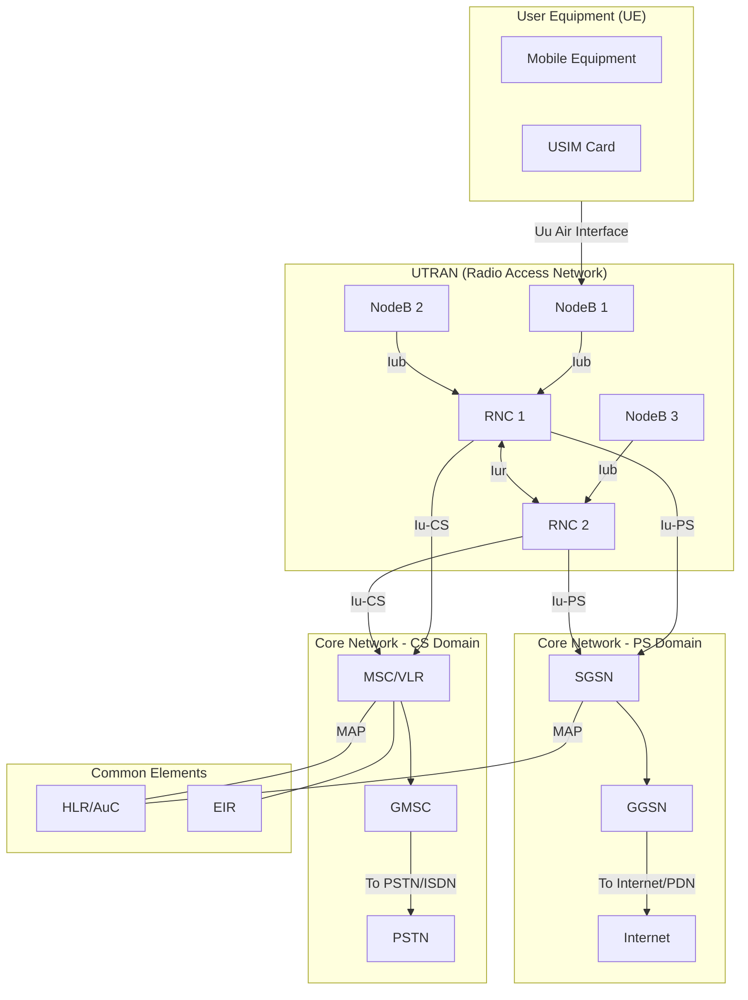

# ماژول 3: شبکه‌های هسته 2G/3G

## 3.1 تحول از 2G به 3G — نیروهای محرک

### چرا به 3G نیاز داشتیم؟

گذار از 2G (GSM) به 3G (UMTS) توسط تقاضاهای بنیادی بازار و فناوری هدایت شد:

1. **تقاضای انفجاری داده**: SMS و وب‌گردی ابتدایی WAP کافی نبود. کاربران ایمیل، وب‌گردی و دانلود فایل را روی دستگاه‌های موبایل می‌خواستند.
2. **خدمات چندرسانه‌ای**: تماس ویدیویی، پخش جریانی صدا/ویدیو و محتوای غنی نیازمند پهنای باندی بسیار فراتر از 9.6 kbps GSM (یا حتی 171 kbps نظری GPRS) بود.
3. **نرخ داده بالاتر**: چشم‌انداز IMT-2000 اتحادیه مخابرات بین‌المللی (ITU) هدف‌گذاری کرده بود:
   - 144 kbps برای تحرک بالا (خودرویی)
   - 384 kbps برای حالت پیاده
   - 2 Mbps برای حالت ساکن/داخل ساختمان
4. **رومینگ جهانی**: یک استاندارد یکپارچه جهانی (برخلاف 2G تکه‌تکه: GSM در برابر CDMA در برابر PDC).
5. **کارایی طیفی**: کدهای گسترش WCDMA به کاربران بیشتری در هر سلول با تخریب تدریجی امکان می‌دهند.

### مسیر تحول

```
GSM (2G) → GPRS (2.5G) → EDGE (2.75G) → UMTS (3G) → HSPA (3.5G) → HSPA+ (3.75G) → LTE (4G)
  9.6 kbps    171 kbps      384 kbps      2 Mbps       14.4 Mbps      42 Mbps        300 Mbps
```

---

## 3.2 مرور معماری UMTS

UMTS (Universal Mobile Telecommunications System - سیستم جهانی ارتباطات مخابراتی موبایل) بر دو دامنه اصلی بنا شده است:

- **UTRAN** (شبکه دسترسی رادیویی زمینی UMTS) — سمت واسط رادیویی/هوایی
- **شبکه هسته (CN)** — ستون فقرات هوش و اتصال

### اصول طراحی کلیدی

- سازگاری رو به عقب با هسته GSM/GPRS
- جداسازی دسترسی رادیویی از شبکه هسته (امکان تحول مستقل)
- تقسیم هسته به دامنه سوئیچینگ مداری (CS) و سوئیچینگ بسته‌ای (PS)
- پشتیبانی از صدا و داده همزمان


### نمودار معماری UMTS



---


## 3.3 UTRAN: NodeB و RNC

### NodeB (ایستگاه پایه)

NodeB معادل 3G برای BTS (ایستگاه فرستنده-گیرنده پایه) در GSM است:

| جنبه | عملکرد |
|--------|----------|
| **نقش اصلی** | ارسال/دریافت رادیویی روی واسط رادیویی Uu |
| **گسترش/واگسترش** | اعمال کدهای گسترش WCDMA |
| **کنترل توان** | کنترل توان حلقه داخلی (سریع، 1500 Hz) |
| **تحویل نرم** | پشتیبانی از ترکیب تنوع بزرگ |
| **کدگذاری کانال** | کدگذاری/رمزگشایی کانال‌های انتقال |
| **واسط** | متصل به RNC از طریق واسط Iub (مبتنی بر ATM یا IP) |

> **تفاوت کلیدی با BTS در GSM**: NodeB هوش **بیشتری** دارد — کنترل توان سریع و ترکیب تحویل نرم را به‌صورت محلی مدیریت می‌کند و تأخیر را کاهش می‌دهد.

### RNC (کنترلر شبکه رادیویی)

RNC معادل 3G برای BSC در GSM است، اما با مسئولیت‌های به‌مراتب بیشتر:

| جنبه | عملکرد |
|--------|----------|
| **مدیریت منابع رادیویی** | کنترل پذیرش، تخصیص کد، کنترل بار |
| **تصمیم تحویل** | مدیریت تحویل نرم/نرم‌تر/سخت |
| **کنترل توان حلقه بیرونی** | تنظیم هدف SIR |
| **رمزگذاری/یکپارچگی** | توابع امنیتی برای داده کاربر و سیگنالینگ |
| **پایان‌دهی پروتکل** | نقطه انتهایی پروتکل RRC (کنترل منابع رادیویی) |
| **ترکیب تنوع بزرگ** | ترکیب سیگنال‌ها از چندین NodeB |
| **قطعه‌بندی/بازمونتاژ** | پردازش لایه RLC |

### نقش‌های RNC (یک RNC می‌تواند چندین نقش ایفا کند)

- **RNC خدمات‌دهنده (S-RNC)**: اتصال RRC با UE را حفظ می‌کند، کنترل توان حلقه بیرونی را انجام می‌دهد
- **RNC رانشی (D-RNC)**: وقتی UE جابه‌جا می‌شود اما S-RNC تغییر نمی‌کند، منابع رادیویی را فراهم می‌کند
- **RNC کنترل‌کننده (C-RNC)**: منابع منطقی NodeBهای خود را کنترل می‌کند

### واسط‌های UTRAN

| واسط | اتصال | پشته پروتکل | هدف |
|-----------|----------|---------------|---------|
| **Uu** | UE ↔ NodeB | واسط رادیویی WCDMA | انتقال رادیویی |
| **Iub** | NodeB ↔ RNC | NBAP over ATM/IP | کنترل NodeB و داده کاربر |
| **Iur** | RNC ↔ RNC | RNSAP over ATM/IP | تحویل نرم بین-RNC، جابه‌جایی |
| **Iu-CS** | RNC ↔ MSC | RANAP over ATM | ترافیک سوئیچینگ مداری |
| **Iu-PS** | RNC ↔ SGSN | RANAP over IP | ترافیک سوئیچینگ بسته‌ای |

---


## 3.4 شبکه هسته 3G: دامنه CS + دامنه PS

شبکه هسته 3G معماری تقسیم‌شده GSM/GPRS را به ارث می‌برد و دو دامنه موازی را حفظ می‌کند:

### دامنه سوئیچینگ مداری (CS)

تماس‌های صوتی بلادرنگ و تله‌فونی ویدیویی را مدیریت می‌کند (همانند هسته GSM، ارتقایافته برای 3G).

| عنصر | نقش |
|---------|------|
| **MSC (مرکز سوئیچینگ موبایل)** | مسیریابی تماس، تحویل بین RNCها، سیگنالینگ کنترل تماس |
| **VLR (ثبت‌کننده مکان بازدیدکننده)** | ذخیره‌سازی موقت داده مشترکین بازدیدکننده در ناحیه MSC |
| **GMSC (MSC دروازه‌ای)** | واسط با شبکه‌های خارجی (PSTN، ISDN)، مدیریت تماس‌های ورودی |
| **HLR (ثبت‌کننده مکان خانگی)** | پایگاه داده دائمی مشترکین (مشترک با دامنه PS) |
| **AuC (مرکز احراز هویت)** | ذخیره کلیدهای احراز هویت (Ki)، تولید بردارهای امنیتی |
| **EIR (ثبت‌کننده هویت تجهیزات)** | فهرست سیاه/سفید IMEI برای مسدودکردن دستگاه دزدیده‌شده |

**جریان تماس دامنه CS**:
```
UE → NodeB → RNC →(Iu-CS)→ MSC/VLR → GMSC → PSTN
```

### دامنه سوئیچینگ بسته‌ای (PS)

تمام خدمات داده (وب، ایمیل، پخش جریانی) را مدیریت می‌کند — تکامل‌یافته از GPRS.

| عنصر | نقش |
|---------|------|
| **SGSN (گره پشتیبانی خدمات GPRS)** | مسیریابی بسته، مدیریت تحرک، مدیریت نشست، رمزگذاری |
| **GGSN (گره پشتیبانی GPRS دروازه‌ای)** | واسط با شبکه‌های بسته‌ای خارجی (اینترنت)، تخصیص آدرس IP، لنگر صورت‌حساب |

**جریان داده دامنه PS**:
```
UE → NodeB → RNC →(Iu-PS)→ SGSN →(Gn)→ GGSN → Internet
```

### چرا دو دامنه؟

رویکرد تقسیم CS/PS یک **تصمیم مهندسی عمل‌گرایانه** بود:

1. **سازگاری با میراث**: زیرساخت صدا (SS7، اتصال PSTN) بالغ و قابل اعتماد بود — دلیلی برای بازسازی آن وجود نداشت
2. **تضمین‌های QoS**: سوئیچینگ مداری تأخیر قطعی برای صدا فراهم می‌کند (تحویل تضمین‌شده فریم 20ms)
3. **استقرار افزایشی**: اپراتورها می‌توانستند دامنه PS را بدون مختل‌کردن درآمد صوتی موجود اضافه کنند
4. **کاهش ریسک**: شبکه‌های IP در سال 2000 نمی‌توانستند کیفیت صدا را تضمین کنند — افت بسته و جیتر مشکلات واقعی بودند

---

## 3.5 واسط Iu

واسط Iu مرز حیاتی بین UTRAN و شبکه هسته است.

### Iu-CS (سوئیچینگ مداری)

- **انتقال**: ATM (AAL2 برای صفحه کاربر، AAL5 برای صفحه کنترل)
- **صفحه کنترل**: RANAP ← SCCP ← M3UA ← SCTP (یا MTP3b)
- **صفحه کاربر**: پروتکل Iu UP (قاب‌بندی برای فریم‌های کدک صوتی AMR)
- **هدف**: حمل تماس‌های صوتی و تله‌فونی ویدیویی

### Iu-PS (سوئیچینگ بسته‌ای)

- **انتقال**: مبتنی بر IP (GTP-U برای صفحه کاربر)
- **صفحه کنترل**: RANAP ← SCCP ← M3UA ← SCTP
- **صفحه کاربر**: GTP-U (پروتکل تونل‌سازی GPRS - صفحه کاربر)
- **هدف**: حمل تمام داده بسته‌ای (وب، ایمیل، پخش جریانی)

### RANAP (بخش کاربرد شبکه دسترسی رادیویی)

رویه‌های کلیدی روی Iu:
- **تخصیص RAB (حامل دسترسی رادیویی)**: حامل سرتاسری را برقرار می‌کند
- **جابه‌جایی**: نقش RNC خدمات‌دهنده را به RNC دیگری منتقل می‌کند (تحویل سخت)
- **صفحه‌بندی**: شبکه هسته UE را از طریق UTRAN صفحه‌بندی می‌کند
- **حالت امنیتی**: رمزگذاری و حفاظت یکپارچگی را فعال می‌کند
- **انتقال مستقیم**: پیام‌های NAS را به‌صورت شفاف عبور می‌دهد (مثلاً MM، CC، SM)

---


## 3.6 نسخه 99 در برابر نسخه 5+ (تحول HSPA)

### نسخه 99 (R99) — UMTS اصلی

- **پیوند پایین‌سو**: تا 384 kbps (کانال‌های اختصاصی)
- **پیوند بالاسو**: تا 384 kbps
- **نوع کانال**: کانال اختصاصی (DCH) — یک کد در هر کاربر
- **زمان‌بندی**: در سطح RNC انجام می‌شود (کند، TTI حدود 100ms)
- **کنترل توان**: سازوکار اصلی برای تطبیق پیوند
- **محدودیت**: ناکارآمد برای داده انفجاری (منابع را حتی در سکوت تخصیص‌یافته نگه می‌دارد)

### نسخه 5 — HSDPA (دسترسی بسته‌ای پیوند پایین‌سوی پرسرعت)

| ویژگی | بهبود |
|---------|------------|
| **نرخ اوج** | 14.4 Mbps (DL) |
| **کانال مشترک** | HS-DSCH — چندگانه‌شده زمانی بین کاربران |
| **زمان‌بندی** | منتقل‌شده به NodeB (TTI 2ms — سریع، آگاه به کانال) |
| **AMC** | مدولاسیون و کدگذاری تطبیقی (QPSK ← 16QAM ← 64QAM) |
| **HARQ** | ARQ ترکیبی با ترکیب نرم در NodeB |
| **بدون کنترل توان** | با توان کامل ارسال می‌کند، در عوض نرخ را تطبیق می‌دهد |

### نسخه 6 — HSUPA (دسترسی بسته‌ای پیوند بالاسوی پرسرعت)

| ویژگی | بهبود |
|---------|------------|
| **نرخ اوج** | 5.76 Mbps (UL) |
| **کانال** | E-DCH (کانال اختصاصی بهبودیافته) |
| **زمان‌بندی** | کنترل‌شده توسط NodeB با TTI 2ms/10ms |
| **HARQ** | ترکیب نرم پیوند بالاسو |
| **مزیت** | تأخیر بهتر، توان عملیاتی بالاتر برای بارگذاری |

### نسخه 7/8 — HSPA+

- **64QAM پیوند پایین‌سو**، **16QAM پیوند بالاسو**
- **MIMO** (2×2) برای پیوند پایین‌سو
- عملیات **دو-حامله** (2 × 5 MHz)
- نرخ‌های اوج: **42 Mbps DL**، **11.5 Mbps UL**
- **گزینه معماری مسطح**: NodeB مستقیم به GGSN (با دور زدن RNC)

### تغییر در فلسفه

```
R99:  RNC controls everything → Centralized, slow adaptation
R5+:  NodeB makes fast decisions → Distributed, rapid adaptation (2ms vs 100ms)
```

این تغییر پیش‌درآمدی بر طراحی LTE بود که در آن eNodeB تقریباً تمام تصمیمات رادیویی را مدیریت می‌کند.

---

## 3.7 IMS (زیرسیستم چندرسانه‌ای IP) — مقدمه

### IMS چیست؟

IMS یک **چارچوب برای ارائه خدمات چندرسانه‌ای مبتنی بر IP** روی شبکه‌های موبایل است. در نسخه 5 گروه 3GPP معرفی شد و چشم‌انداز همگرایی ALL خدمات (صدا، ویدیو، پیام‌رسانی، حضور) روی IP را نمایندگی می‌کند.

### چرا IMS؟

| مسئله | راه‌حل IMS |
|---------|-------------|
| دامنه CS نمی‌تواند تحول یابد (SS7 میراثی) | سیگنالینگ تمام-IP با استفاده از SIP |
| افزودن خدمات جدید نیازمند ارتقای شبکه است | سرورهای کاربردی به‌صورت ماژولار متصل می‌شوند |
| صدا و داده دنیای جداگانه‌ای هستند | کنترل نشست یکپارچه برای تمام رسانه‌ها |
| بدون تعامل خدمات (صدا یا داده) | خدمات ترکیبی (صدا + ویدیو + اشتراک‌گذاری) |

### اجزای کلیدی IMS

- **P-CSCF (CSCF پروکسی)**: اولین نقطه تماس، پروکسی SIP، اجرای سیاست
- **I-CSCF (CSCF بازپرس)**: نقطه ورود از شبکه‌های دیگر، مسیریابی به S-CSCF صحیح
- **S-CSCF (CSCF خدمات‌دهنده)**: کنترل نشست اصلی، منطق محرک خدمات، ثبت‌کننده SIP
- **HSS (سرور مشترک خانگی)**: تحول HLR، ذخیره پروفایل کاربر و محرک‌های خدمات
- **سرورهای کاربردی**: ارائه خدمات واقعی (VoIP، کنفرانس، پیام‌رسانی)

### پروتکل سیگنالینگ IMS: SIP

IMS به‌جای SS7 از **SIP (پروتکل آغاز نشست)** استفاده می‌کند:
- متنی، قابل توسعه
- به‌صورت بومی روی IP کار می‌کند
- از هر نوع رسانه‌ای پشتیبانی می‌کند (صدا، ویدیو، بازی، IoT)
- ترکیب خدمات و مَش‌آپ‌ها را ممکن می‌سازد

### نقش IMS در سفر 2G←4G

```
2G: Voice = CS (SS7)          Data = None/CSD
3G: Voice = CS (SS7)          Data = PS (GTP)         IMS = Optional overlay
4G: Voice = VoLTE via IMS     Data = PS (GTP)         IMS = Mandatory for voice
5G: Voice = VoNR via IMS      Data = PS (GTP/SBA)     IMS = Still essential
```

---


## 3.8 جدول مقایسه اصلی: نسل‌های شبکه موبایل

| ویژگی | 2G (GSM) | 2.5G (GPRS) | 3G (UMTS R99) | 3.5G (HSPA) | 4G (LTE) |
|---------|----------|-------------|---------------|-------------|----------|
| **دسترسی رادیویی** | TDMA/FDMA (کانال‌های 200 kHz، 8 شکاف زمانی) | همان GSM (شکاف‌های زمانی مشترک) | WCDMA (حامل 5 MHz، کدهای گسترش) | WCDMA + کانال‌های مشترک (HS-DSCH/E-DCH) | OFDMA DL / SC-FDMA UL (1.4–20 MHz) |
| **شبکه هسته** | MSC/VLR/HLR (مبتنی بر SS7) | MSC + SGSN/GGSN اضافه‌شده | MSC/VLR (CS) + SGSN/GGSN (PS) | همان 3G (معماری مسطح اختیاری در HSPA+) | EPC: MME/S-GW/P-GW (تمام-IP، مسطح) |
| **نوع سوئیچینگ** | فقط سوئیچینگ مداری | CS (صدا) + PS (داده) | CS (صدا) + PS (داده) | CS (صدا) + PS (داده) | فقط سوئیچینگ بسته‌ای |
| **حداکثر نرخ داده (DL)** | 9.6 kbps (CSD) / 14.4 kbps (HSCSD) | 171.2 kbps (نظری) / حدود 40 kbps (عملی) | 384 kbps (پیاده) / 2 Mbps (داخل ساختمان) | 14.4 Mbps (HSDPA) / 42 Mbps (HSPA+) | 300 Mbps (Cat 5) / 3 Gbps (Cat 20) |
| **حداکثر نرخ داده (UL)** | 9.6 kbps | 171.2 kbps (نظری) / حدود 20 kbps (عملی) | 384 kbps | 5.76 Mbps (HSUPA) / 11.5 Mbps (HSPA+) | 75 Mbps (Cat 5) / 1.5 Gbps (Cat 20) |
| **تأخیر (RTT)** | حدود 500 ms (داده) | حدود 300–600 ms | حدود 150–200 ms | حدود 50–100 ms (HSPA) / حدود 30 ms (HSPA+) | حدود 10–30 ms (صفحه کاربر) / حدود 50 ms (کنترل) |
| **پشتیبانی تحرک** | تحویل (سخت) تا 250 km/h | همان GSM | تحویل نرم + تحویل سخت، تا 500 km/h | همان UMTS | فقط تحویل سخت، تا 500 km/h |
| **پروتکل سیگنالینگ** | SS7 (MAP، ISUP، BSSAP) | SS7 + GTP-C | SS7 (RANAP، MAP) + GTP-C | همان 3G | Diameter + GTP-C v2 (تماماً مبتنی بر IP) |
| **نوآوری اصلی** | صدای دیجیتال، SMS، رومینگ، SIM | داده همیشه فعال، اتصال IP، رادیو مشترک | داده پهن‌باند، تماس ویدیویی، چندرسانه‌ای، تحویل نرم | زمان‌بندی سریع در NodeB، AMC، HARQ، کانال‌های مشترک | معماری مسطح تمام-IP، OFDMA، MIMO، VoLTE |
| **محدودیت اصلی** | بدون قابلیت داده واقعی | توان عملیاتی پایین، تأخیر بالا، مشترک با شکاف‌های زمانی صدا | کانال‌های اختصاصی منابع را برای داده انفجاری هدر می‌دهند | همچنان صدای CS، دو-پشته پیچیده | بدون صدای بومی (نیازمند VoLTE/IMS)، تحویل پیچیده به 2G/3G |

---


## 3.9 تقسیم CS/PS — و چرا LTE آن را از بین برد

### مشکل دو دامنه

اجرای موازی دامنه‌های CS و PS به این معنا بود:

```
┌─────────────────────────────────────────────────────────┐
│                    OPERATOR NETWORK                       │
│                                                          │
│   ┌──────────────┐         ┌──────────────────────┐     │
│   │  CS Domain   │         │     PS Domain        │     │
│   │  ─────────── │         │  ───────────────     │     │
│   │  MSC/VLR     │         │  SGSN                │     │
│   │  GMSC        │         │  GGSN                │     │
│   │  MGW         │         │                      │     │
│   │  SS7 network │         │  GTP tunnels         │     │
│   │  TDM trunks  │         │  IP routers          │     │
│   └──────────────┘         └──────────────────────┘     │
│         ↕                            ↕                   │
│   Voice/Video calls           Data services              │
│   (64 kbps circuits)          (variable rate IP)         │
└─────────────────────────────────────────────────────────┘
```

### هزینه‌های معماری تقسیم‌شده

| مسئله | تأثیر |
|---------|--------|
| **زیرساخت تکراری** | دو شبکه هسته کامل برای نگهداری، ارتقا و تأمین نیرو |
| **استفاده ناکارآمد از طیف** | CS حتی در سکوت ظرفیت رزرو می‌کند (60% یک تماس سکوت است) |
| **بدون همگرایی خدمات** | صدا و داده نمی‌توانند به‌راحتی تعامل کنند (مثلاً اشتراک‌گذاری عکس در حین تماس) |
| **SS7 میراثی است** | سخت برای توسعه، تجهیزات اختصاصی، بدون مزایای اکوسیستم IP |
| **صورت‌حساب جداگانه** | دقیقه صدا + مگابایت داده = سیستم‌های صورت‌حساب پیچیده |
| **محدودیت‌های مقیاس‌پذیری** | CS با پورت/ترانک مقیاس می‌یابد (گران)، PS با پهنای باند مقیاس می‌یابد (ارزان) |

### چرا LTE به فقط-بسته (EPC) یکپارچه شد

هسته بسته تکامل‌یافته (EPC) در LTE تصمیم رادیکالی گرفت: **هیچ سوئیچینگ مداری در کار نیست**.

#### توانمندسازهای فنی (چه چیزی تا سال 2008 تغییر کرد):

1. **شبکه‌های IP بالغ شدند**: سازوکارهای QoS (DiffServ، MPLS، حامل‌های اختصاصی) اکنون می‌توانستند کیفیت صدا را تضمین کنند
2. **کارایی کدک**: کدک‌های AMR-WB و EVS روی IP با حداقل پهنای باند (حدود 12 kbps) خوب کار می‌کنند
3. **تأخیر کم محقق شد**: RTT حدود 10ms در LTE در واقع **بهتر** از صدای CS است (به‌هرحال تأخیر کدک حدود 50ms)
4. **VoIP اثبات شد**: Skype و Vonage ثابت کردند صدای IP از نظر تجاری قابل دوام است
5. **IMS آماده بود**: پس از سال‌ها توسعه، IMS می‌توانست کنترل تماس SS7 را با SIP جایگزین کند
6. **اقتصاد**: تجهیزات IP یک‌دهم تجهیزات معادل TDM/SS7 هزینه دارند

#### معماری EPC (تمام بسته):

| عنصر | جانشین | عملکرد |
|---------|----------|----------|
| **MME** | MSC (صفحه کنترل) | تحرک، احراز هویت، مدیریت حامل — فقط سیگنالینگ |
| **S-GW** | SGSN (صفحه کاربر) | لنگر تحرک محلی، ارسال داده بین eNodeBها |
| **P-GW** | GGSN | دروازه شبکه خارجی، تخصیص IP، سیاست/صورت‌حساب |
| **HSS** | HLR + AuC | داده مشترک، بردارهای احراز هویت |
| **PCRF** | — (جدید) | سیاست و قواعد صورت‌حساب — QoS در هر جریان را ممکن می‌سازد |

#### چگونه صدا بدون CS کار می‌کند (VoLTE):

```
Traditional 3G Voice:
  UE → NodeB → RNC → MSC → GMSC → PSTN  (dedicated 64kbps circuit)

LTE Voice (VoLTE):
  UE → eNodeB → S-GW → P-GW → IMS (P-CSCF → S-CSCF → AS) → MGCF → PSTN
  (IP packets with QCI=1 dedicated bearer, ~40kbps AMR-WB)
```

#### مزایای معماری بسته یکپارچه:

1. **زیرساخت واحد** برای نگهداری ← کاهش بیش از 50% در OPEX
2. **مالتی‌پلکسینگ آماری** ← بدون ظرفیت هدررفته در حین سکوت
3. **همگرایی خدمات** ← صدا + ویدیو + داده همزمان روی همان حامل
4. **نوآوری سریع خدمات** ← خدمات جدید از طریق سرورهای کاربردی، نه ارتقای شبکه
5. **صدای HD** ← AMR-WB (پهن‌باند) به‌طور چشمگیری بهتر از کدک باریک‌باند GSM به گوش می‌رسد
6. **ساده‌سازی شبکه** ← واسط‌های کمتر، پشته‌های پروتکل کمتر، نقاط شکست کمتر

### مبادله

| جنبه | CS (2G/3G) | فقط-PS (LTE) |
|--------|-----------|----------------|
| قابلیت اطمینان صدا | بسیار بالا (بیش از 30 سال اثبات‌شده) | بستگی به پوشش و پیاده‌سازی VoLTE دارد |
| زمان برقراری تماس | حدود 3–5 ثانیه | حدود 1–2 ثانیه (SIP سریع‌تر است) |
| تماس‌های اضطراری | همیشه کار می‌کند (بازگشت CS) | نیازمند VoLTE یا CSFB به 2G/3G |
| پیچیدگی | ساده برای صدا، پیچیده در کل | ساده در کل، پیچیده برای QoS صدا |
| شکاف‌های پوشش | صدا حتی در لبه سلول کار می‌کند | اگر پوشش LTE افت کند صدا قطع می‌شود (نیازمند CSFB) |

> **CSFB (بازگشت به سوئیچینگ مداری)**: شبکه‌های LTE اولیه برای تماس‌های صوتی به 3G/2G بازمی‌گشتند. این یک راه‌حل انتقالی بود تا زمانی که پوشش VoLTE همه‌جاگیر شود.

---

## 3.10 خلاصه: نکات کلیدی

1. **3G (UMTS)** رادیو WCDMA با کانال‌های اختصاصی را معرفی کرد و هسته تقسیم‌شده CS/PS نسل 2G را حفظ کرد
2. **UTRAN** توابع رادیویی را جدا می‌کند: NodeB (لایه فیزیکی) و RNC (مدیریت منابع رادیویی)
3. **واسط Iu** دسترسی رادیویی را به‌طور تمیز از هسته جدا می‌کند — که تحول مستقل را ممکن می‌سازد
4. **HSPA (R5/R6)** هوش را به NodeB منتقل کرد (زمان‌بندی سریع، HARQ، AMC) — پیش‌نمایشی از فلسفه LTE
5. **IMS** لایه خدمات تمام-IP را فراهم می‌کند که در نهایت SS7 را برای صدا جایگزین می‌کند
6. **LTE همه چیز را به بسته یکپارچه کرد** زیرا IP به‌اندازه کافی بالغ شده بود تا QoS صدا را تضمین کند، و اقتصاد نگهداری زیرساخت دوگانه غیرقابل توجیه شد
7. **تحول تدریجی بود**: هر نسل محدودیت‌های واقعی نسل قبلی را برطرف کرد

---

## پرسش‌های مرور

1. توضیح دهید چرا UMTS دامنه‌های جداگانه CS و PS را حفظ کرد به‌جای اینکه از ابتدا تمام-بسته باشد.
2. تفاوت بین RNC خدمات‌دهنده و RNC رانشی چیست؟
3. زمان‌بندی مبتنی بر NodeB در HSDPA چگونه نسبت به زمان‌بندی مبتنی بر RNC در R99 بهبود می‌یابد؟
4. پشته پروتکل واسط Iu-PS را رسم کنید.
5. چرا IMS برای اینکه LTE دامنه CS را حذف کند ضروری بود؟
6. نقش SGSN در 3G را با S-GW در LTE مقایسه کنید — چه چیزی تغییر کرد و چرا؟

---

*ماژول 3 — شبکه‌های ارتباطی پیشرفته — شبکه‌های هسته 2G/3G*
*بعدی: ماژول 4 — معماری LTE/EPC*
