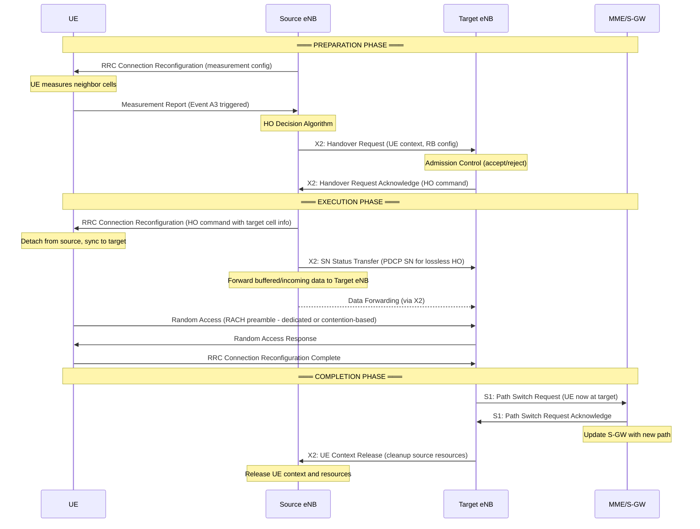
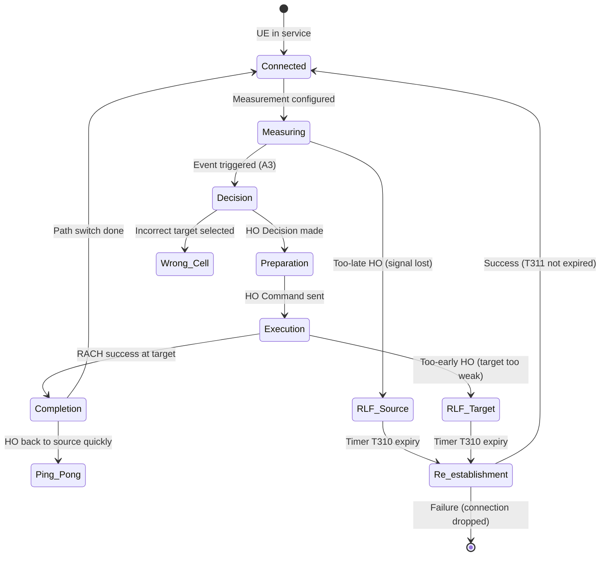
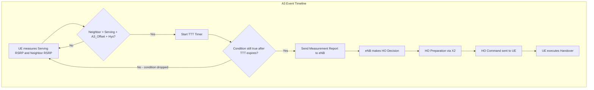
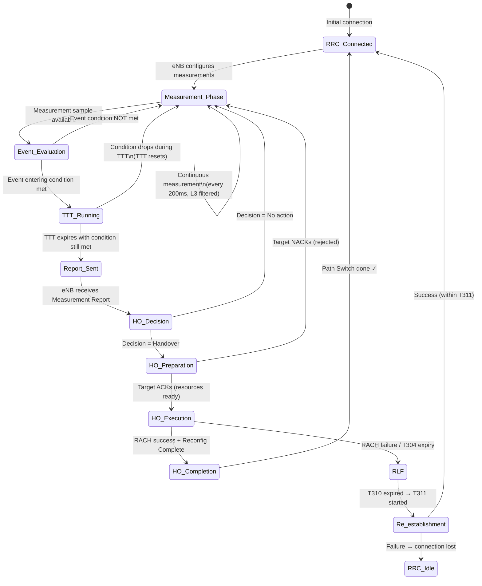

# Module 4: Mobility and Handover

## Learning Objectives

By the end of this module, you will be able to:
- Explain WHY mobility management is essential in cellular networks
- Distinguish between Location Areas, Routing Areas, and Tracking Areas
- Describe cell reselection mechanisms in idle mode
- Classify and compare handover types across generations
- Analyze the handover decision process using measurement events
- Trace the LTE X2 handover procedure step by step
- Identify handover failures and their mitigation strategies
- Compare mobility evolution from 2G through 5G

---

## 1. Why Mobility Management Is Needed

### WHY
Users are mobile — they walk, drive, and travel while expecting uninterrupted voice calls, video streams, and data sessions. Without mobility management, a user crossing a cell boundary would experience immediate service disconnection.

### WHAT
Mobility management is the set of network procedures that:
- **Track** the user's location (so the network can reach them for incoming calls/data)
- **Maintain** service continuity when the user moves between cells (handover)
- **Optimize** radio resource usage by connecting users to the best-serving cell

### HOW
The network achieves this through two complementary mechanisms:

| State | Mechanism | Purpose |
|-------|-----------|---------|
| **Idle mode** | Cell reselection + location/tracking updates | Network knows user's approximate location |
| **Connected mode** | Handover | Seamless transfer of active connection |

### The Fundamental Trade-off

```
More frequent location updates → Better paging accuracy → More signaling overhead
Less frequent location updates → Less signaling → Longer paging delay
```

The network must balance:
- **Signaling load** (updates consume radio resources)
- **Paging load** (larger areas = more cells to page)
- **Service latency** (time to reach the user for incoming services)

---

## 2. Location Management: LA vs RA vs TA

### WHY
The network needs to know WHERE a user is (approximately) to deliver incoming calls or data. Different generations use different grouping strategies to balance signaling vs. paging efficiency.

### WHAT

| Generation | Area Concept | Used For | Typical Size |
|-----------|-------------|----------|--------------|
| 2G (GSM) | **Location Area (LA)** | Circuit-switched services | 20–100 cells |
| 2.5G (GPRS) | **Routing Area (RA)** | Packet-switched services | Subset of LA, 10–50 cells |
| 4G (LTE) | **Tracking Area (TA)** | All services (all-IP) | 30–80 cells |
| 5G (NR) | **Tracking Area** + RNA | All services + RAN-level | Configurable per UE |

### HOW — Location Area (2G)

```
┌─────────────────────────────────┐
│         Location Area (LA)       │
│  ┌─────┐ ┌─────┐ ┌─────┐       │
│  │Cell1│ │Cell2│ │Cell3│  ...   │
│  └─────┘ └─────┘ └─────┘       │
└─────────────────────────────────┘
```

- UE performs **Location Area Update (LAU)** when crossing LA boundary
- Network pages ALL cells in the LA for incoming call
- Managed by MSC/VLR

### HOW — Routing Area (GPRS)

- RA is a **subset** of an LA (one LA contains multiple RAs)
- UE performs **Routing Area Update (RAU)** for packet services
- Managed by SGSN
- Allows finer-grained location for data users

### HOW — Tracking Area (LTE/5G)

- **Tracking Area List (TAL)**: UE is assigned a LIST of TAs — no update needed when moving within the list
- Reduces signaling for high-mobility users (larger TAL)
- Low-mobility users get smaller TAL to reduce paging area

```
UE TAL = {TA1, TA2, TA3, TA4}

Moving TA1→TA2→TA3→TA4: NO update needed
Moving TA4→TA5 (outside TAL): Tracking Area Update triggered
```

### 5G Enhancement: RAN-based Notification Area (RNA)

- In **RRC_INACTIVE** state (new in 5G), the gNB manages a smaller RNA
- Reduces core network signaling
- Two-level mobility: RNA (RAN-managed) + TA (core-managed)

---

## 3. Cell Reselection (Idle Mode Mobility)

### WHY
Even when not in an active call/session, the UE must camp on the best cell to:
- Receive paging messages efficiently
- Ensure good signal quality when a connection is needed
- Avoid unnecessary location updates

### WHAT
Cell reselection is the **UE-autonomous** process of selecting a new cell to camp on while in idle mode. The network provides parameters via System Information Broadcasts (SIBs), but the UE makes the decision independently.

### HOW — Cell Reselection Criteria

#### Ranking Criterion (S-criterion)

A cell is suitable for camping if it meets the S-criterion:

```
Srxlev = Qrxlevmeas - (Qrxlevmin + Qrxlevminoffset) - Pcompensation > 0
Squal  = Qqualmeas  - (Qqualmin  + Qqualminoffset) > 0
```

Where:
- `Qrxlevmeas`: Measured RSRP (dBm)
- `Qrxlevmin`: Minimum required RSRP (-124 to -44 dBm, typical: -124 dBm)
- `Qqualmeas`: Measured RSRQ (dB)
- `Qqualmin`: Minimum required RSRQ (-20 to -3 dB, typical: -20 dB)

#### Cell Ranking (R-criterion)

For intra-frequency reselection, cells are ranked:

```
Rs = Qmeas,s + QHyst                    (serving cell)
Rn = Qmeas,n - Qoffset                  (neighbor cell)

Reselect to neighbor if: Rn > Rs for duration Treselection
```

#### Priority-Based Reselection (Inter-frequency/Inter-RAT)

| Priority | Action |
|----------|--------|
| Higher priority layer | Reselect if neighbor meets ThreshX,High |
| Equal priority layer | Use ranking (R-criterion) |
| Lower priority layer | Reselect only if serving < ThreshServing,Low AND neighbor > ThreshX,Low |

### HOW — Hysteresis and Timers

**Hysteresis (QHyst)** prevents ping-pong reselection:
- Typical values: 2–6 dB
- Adds "stickiness" to the serving cell

**Treselection timer** (typically 1–4 seconds):
- Neighbor must remain better for this duration before reselection occurs
- Prevents reselection due to momentary fading

```
Signal                Treselection
Strength    ┌───────────────────┐
   ▲        │                   │
   │     ···│·····Neighbor······│····→ Reselect!
   │   ··   │                   │
   │ ··  ┌──┼─QHyst─┐          │
   │·    │  │       │          │
   │─────┼──┼───────┼──────────┼──→ Serving Cell
   │     │  │       │          │
   └─────┴──┴───────┴──────────┴──→ Time
         t1  t2                t3
         
   t2-t1: Neighbor exceeds Serving + QHyst
   t3-t2: Must sustain for Treselection → reselect at t3
```

### Typical Cell Reselection Parameters

| Parameter | Typical Value | Purpose |
|-----------|--------------|---------|
| QHyst | 4 dB | Serving cell hysteresis |
| Treselection | 2 s | Stability timer |
| Qrxlevmin | -124 dBm | Minimum RSRP for cell selection |
| Qqualmin | -20 dB | Minimum RSRQ for cell selection |
| ThreshServing,Low | 4 (= 4 dB) | Threshold to leave serving (to lower priority) |
| ThreshX,High | 8 (= 8 dB) | Threshold to enter higher priority layer |


---

## 4. Handover Types

### WHY
Different mobility scenarios require different handover strategies. A user walking between co-channel cells needs a different mechanism than a user on a high-speed train crossing between LTE and 3G coverage areas.

### WHAT — Classification Overview

```
                        Handover Types
                             │
          ┌──────────────────┼──────────────────┐
          │                  │                  │
    By Frequency        By Technology       By Method
          │                  │                  │
    ┌─────┴─────┐      ┌────┴────┐       ┌────┴────┐
    │           │      │         │       │         │
 Intra-freq  Inter-freq  Intra-RAT  Inter-RAT  Hard    Soft
```

---

### 4.1 Intra-Frequency Handover

#### WHY
Most common handover — occurs when user moves between cells operating on the **same carrier frequency**. This is the typical scenario in dense urban deployments.

#### WHAT
- Source and target cells use the same frequency (e.g., both on 1800 MHz Band 3)
- UE can measure neighbors WITHOUT measurement gaps
- Fastest and simplest handover type

#### HOW
- UE continuously measures RSRP/RSRQ of serving and intra-frequency neighbors
- No interruption to measurements needed (same frequency = can measure while receiving)
- Triggered by Event A3: Neighbor becomes offset better than serving

**Typical scenario**: Walking between adjacent cells in a shopping mall (all cells on same frequency)

---

### 4.2 Inter-Frequency Handover

#### WHY
Networks deploy multiple frequency layers for capacity (e.g., macro on 800 MHz for coverage, small cells on 2600 MHz for capacity). Users must move between these layers.

#### WHAT
- Source and target cells operate on **different carrier frequencies**
- UE needs **measurement gaps** to tune its receiver to other frequencies
- Slightly longer interruption than intra-frequency

#### HOW
- Network configures measurement gaps (6 ms every 40 or 80 ms)
- UE measures inter-frequency neighbors during gaps
- Triggered by Event A4 (neighbor on other frequency becomes better than threshold) or A5 (serving degrades AND neighbor is good)

**Typical scenario**: User moves from indoor small cell (2600 MHz) to outdoor macro (800 MHz)

---

### 4.3 Inter-RAT Handover

#### WHY
Not all areas have LTE/5G coverage. When LTE signal degrades, the UE may need to fall back to 3G (UMTS) or even 2G (GSM) to maintain service. Also used for CS Fallback (voice calls).

#### WHAT
- Handover between different radio access technologies
- Examples: LTE → UMTS, LTE → GSM, NR → LTE
- Most complex type — different protocols, different core networks

#### HOW
- UE measures inter-RAT neighbors during measurement gaps
- Triggered by Event B1 (inter-RAT neighbor above threshold) or B2 (serving below threshold AND inter-RAT above threshold)
- Requires inter-RAT coordination between eNB and RNC/BSC

**Typical scenario**: 
- VoLTE not available → CS Fallback to 3G for voice call
- User drives into rural area with only 3G coverage

---

### 4.4 Hard Handover (Break-Before-Make)

#### WHY
When simultaneous connection to two cells is not possible (different frequencies, different technologies, or system design choice), the old connection must be released before the new one is established.

#### WHAT
- Connection to source cell is **released** before connecting to target
- Brief interruption in service (typically 20–50 ms in LTE)
- Used in: GSM, LTE, 5G NR

#### HOW
```
Timeline:
──[Connected to Source]──|GAP|──[Connected to Target]──→
                         ↑
                   Interruption
                   (20-50 ms LTE)
                   (100-200 ms GSM)
```

- **Advantage**: Simpler, no need for combining/splitting
- **Disadvantage**: Brief interruption (acceptable for data, noticeable for voice in 2G)

---

### 4.5 Soft Handover (Make-Before-Break) — 3G UMTS Specific

#### WHY
CDMA-based 3G systems can receive the same signal from multiple cells simultaneously (same frequency, code division). This enables seamless handover with NO interruption.

#### WHAT
- UE is connected to **multiple cells simultaneously** (Active Set)
- Signals from multiple cells are **combined** for diversity gain
- Unique to CDMA/WCDMA (3G) — NOT used in LTE or 5G

#### HOW — Active Set Management

```
Active Set Events (3GPP UMTS):
- Event 1A: Add cell to Active Set (neighbor strong enough)
- Event 1B: Remove cell from Active Set (cell too weak)
- Event 1C: Replace cell in Active Set (better candidate found)
```

```
         Source Cell         Target Cell
Signal      │                    │
   ▲        │  Soft Handover     │
   │    ────┤  Region            ├────
   │   /    │◄──────────────────►│    \
   │  /     │   UE connected     │     \
   │ /      │   to BOTH cells    │      \
   │/       │                    │       \
   └────────┼────────────────────┼────────→ Distance
             Cell A              Cell B
             boundary
```

- **Active Set**: Set of cells currently serving the UE (max 3–6 cells)
- **Soft handover**: Between cells of same Node B or different Node Bs, same frequency
- **Softer handover**: Between sectors of the SAME Node B (MRC combining at Node B)

**Advantages**:
- No interruption
- Macro-diversity gain (2–3 dB)
- Reduced ping-pong

**Disadvantages**:
- Uses resources in multiple cells simultaneously
- Increased backhaul and processing requirements
- Adds complexity to power control


---

## 5. Handover Decision Process

### WHY
The network must decide WHEN to handover, to WHICH cell, and ensure the decision is robust against fading and noise. A poorly timed handover causes drops; a well-tuned one is imperceptible to the user.

### WHAT
The handover decision in LTE is based on:
1. **UE Measurement Reports** — periodic or event-triggered
2. **Measurement Events** — conditions that trigger the report
3. **Hysteresis and Time-to-Trigger** — filtering to avoid false triggers
4. **Network decision** — eNB evaluates report and decides

---

### 5.1 Measurement Reports (RSRP and RSRQ)

#### WHAT

| Metric | Full Name | Range | Purpose |
|--------|-----------|-------|---------|
| **RSRP** | Reference Signal Received Power | -140 to -44 dBm | Signal strength (coverage) |
| **RSRQ** | Reference Signal Received Quality | -20 to -3 dB | Signal quality (accounts for interference + noise) |
| **SINR** | Signal-to-Interference-plus-Noise Ratio | -23 to 40 dB | Overall link quality |

#### HOW

```
RSRP = Power of one Resource Element carrying Reference Signal

RSRQ = N × RSRP / RSSI
     where N = number of RBs, RSSI = total received wideband power

Interpretation:
- RSRP = "how strong is MY cell's signal?"
- RSRQ = "how good is MY cell's signal relative to everything else I hear?"
```

**When to use which**:
- RSRP-based handover: Good for coverage-limited scenarios (rural)
- RSRQ-based handover: Good for interference-limited scenarios (dense urban)

---

### 5.2 LTE Measurement Events (A1–A6)

#### WHAT

| Event | Condition | Use Case |
|-------|-----------|----------|
| **A1** | Serving > Threshold | Stop inter-freq measurements (serving is good enough) |
| **A2** | Serving < Threshold | Start inter-freq/inter-RAT measurements |
| **A3** | Neighbor > Serving + Offset | **Primary intra-freq handover trigger** |
| **A4** | Neighbor > Threshold | Inter-frequency handover |
| **A5** | Serving < Thresh1 AND Neighbor > Thresh2 | Inter-freq/inter-RAT handover |
| **A6** | Neighbor > SCell + Offset | Secondary cell (CA) change |

#### Event B (Inter-RAT):

| Event | Condition | Use Case |
|-------|-----------|----------|
| **B1** | Inter-RAT neighbor > Threshold | Redirect to other RAT |
| **B2** | Serving < Thresh1 AND Inter-RAT > Thresh2 | Fallback (e.g., LTE→3G) |

#### HOW — Event A3 in Detail (Most Important)

Event A3 entering condition:
```
Mn + Ofn + Ocn - Hys > Ms + Ofs + Ocs + Off

Where:
  Mn  = Measurement of neighbor cell (RSRP or RSRQ)
  Ms  = Measurement of serving cell
  Ofn = Frequency-specific offset for neighbor
  Ofs = Frequency-specific offset for serving
  Ocn = Cell-specific offset for neighbor
  Ocs = Cell-specific offset for serving
  Hys = Hysteresis (positive value)
  Off = A3 offset (the main tunable parameter)
```

Simplified (same frequency, no cell-specific offsets):
```
Neighbor_RSRP - Hysteresis > Serving_RSRP + A3_Offset
```

---

### 5.3 Hysteresis and Time-to-Trigger

#### WHY
Radio signals fluctuate due to fading. Without filtering, the network would trigger handovers on every temporary fade, causing excessive signaling and ping-pong.

#### WHAT
Two mechanisms prevent false triggering:

| Parameter | Function | Typical Value |
|-----------|----------|---------------|
| **Hysteresis (Hys)** | Signal must exceed threshold by this margin | 1–3 dB |
| **Time-to-Trigger (TTT)** | Condition must be sustained for this duration | 40–640 ms |

#### HOW — Visualization

```
RSRP
(dBm)
  ▲
  │
  │         ╭─╮  ╭──╮
  │    ╭───╮│ │╭─╯  ╰──── Neighbor Cell (measured)
  │───╮│   ╰╯ ││         
  │   ╰╯      ╰╯         
  │────────────────────── Serving + A3_Offset + Hys  ← Entry threshold
  │
  │────────────────────── Serving + A3_Offset        ← A3 offset level
  │
  │══════════════════════ Serving Cell (measured)
  │
  ├────┬────┬────┬────┬────┬────┬────→ Time
       t1   t2   t3   t4   
       │         │    │              │
       │         │    └──TTT starts──┤→ A3 event reported!
       │         │                   │
       │         └─Not sustained (resets TTT)
       │
       └─ Neighbor crosses threshold but drops back (filtered by Hys)
```

**Combined effect**: 
- Hysteresis provides amplitude filtering (dB domain)
- TTT provides time filtering (time domain)
- Together they provide robust handover triggering

#### Engineering Trade-off

```
┌─────────────────────────────────────────────────────────┐
│  Low Hys + Short TTT          High Hys + Long TTT       │
│  ─────────────────          ───────────────────────      │
│  • Fast handover             • Slow handover             │
│  • Risk of ping-pong         • Risk of too-late HO      │
│  • Good for slow users       • Good for fast users       │
│  • More signaling            • Less signaling            │
│                                                          │
│  Typical urban:              Typical highway:            │
│  Hys=2dB, TTT=160ms         Hys=3dB, TTT=80ms          │
└─────────────────────────────────────────────────────────┘
```

---

### 5.4 Handover Margin

#### WHAT
The **total handover margin** is the combined effect of A3 offset, hysteresis, and TTT that determines how much better a neighbor must be before handover occurs.

```
Effective HO Margin ≈ A3_Offset + Hysteresis + (UE_speed × TTT)
                                                 └──────────────┘
                                                 Signal change during TTT
```

#### Example Calculation

```
Given:
  A3 Offset = 3 dB
  Hysteresis = 2 dB  
  TTT = 320 ms
  UE speed = 50 km/h → path loss changes ~0.5 dB during TTT

Effective margin = 3 + 2 + 0.5 = 5.5 dB

Meaning: Neighbor must be 5.5 dB better than serving 
         before handover is triggered
```


---

## 6. Handover Procedure — LTE X2 Handover

### WHY
The X2-based handover is the **preferred** handover mechanism in LTE because it enables direct eNB-to-eNB communication without routing through the core network (MME), reducing latency and signaling load.

### WHAT
- Flat architecture: eNBs communicate directly via X2 interface
- UE-assisted, network-controlled: UE measures, eNB decides
- Preparation phase ensures target has resources BEFORE handover command
- Total interruption time: **20–50 ms** (imperceptible for most applications)

### HOW — X2 Handover Sequence



### Phase-by-Phase Breakdown

#### Phase 1: Preparation (~50–200 ms)

| Step | Message | Purpose |
|------|---------|---------|
| 1 | Measurement Report | UE informs source about neighbor quality |
| 2 | HO Decision | Source eNB runs algorithm based on report |
| 3 | Handover Request (X2) | Source asks target to prepare resources |
| 4 | Admission Control | Target checks if it can accept the UE |
| 5 | HO Request Ack (X2) | Target confirms, provides HO command |

#### Phase 2: Execution (~20–50 ms interruption)

| Step | Message | Purpose |
|------|---------|---------|
| 6 | RRC Reconfiguration | Source commands UE to handover |
| 7 | SN Status Transfer | Ensures no data loss (PDCP SN alignment) |
| 8 | Data Forwarding | Buffered data forwarded to target |
| 9 | Random Access | UE synchronizes to target cell |
| 10 | Reconfig Complete | UE confirms successful handover |

#### Phase 3: Completion (~20–100 ms)

| Step | Message | Purpose |
|------|---------|---------|
| 11 | Path Switch Request | Informs MME/S-GW of new location |
| 12 | Path Switch Ack | Core confirms path update |
| 13 | UE Context Release | Source releases resources |

### Key Timing Values

| Parameter | Typical Value |
|-----------|--------------|
| Total preparation time | 50–200 ms |
| **User-plane interruption** | **20–50 ms** |
| Path switch completion | 20–100 ms |
| Total end-to-end | 100–350 ms |
| RACH preamble | Dedicated (no contention) or contention-based |

### S1-based Handover (Fallback)

When X2 interface is NOT available (no direct connection between eNBs):
- All messages route through MME
- Longer preparation time (~100–500 ms)
- Used for inter-eNB handover without X2, or inter-MME handover
- Same UE experience but higher network latency


---

## 7. Handover Failures

### WHY
Handover failures directly impact user experience — dropped calls, interrupted video, lost data. Understanding failure modes is essential for network optimization.

### WHAT
Four primary failure modes exist, each with distinct causes and solutions:

---

### 7.1 Too-Late Handover

#### WHY it happens
The UE moves too fast or the handover margin is too large, so the serving cell signal drops below usable level BEFORE the handover completes.

#### WHAT happens
```
Signal
  ▲
  │\                          
  │ \   Serving              ╱ Target
  │  \                     ╱
  │   \                  ╱
  │    \   ┌───────────╱──── Handover triggered (too late!)
  │     \  │         ╱
  │──────\─┼───────╱──────── Radio Link Failure threshold (Qout)
  │       \│     ╱
  │        ╳   ╱  ← RLF occurs here! Connection dropped!
  │        │\╱
  └────────┴──────────────→ Time
           RLF
```

#### Indicators
- Radio Link Failure (RLF) in source cell BEFORE HO command received
- High RLF counter on source cell
- RLF report shows strong neighbor at time of failure

#### Mitigation
- **Decrease** A3 offset (trigger HO earlier)
- **Decrease** TTT (react faster)
- **Decrease** hysteresis
- Add early measurement reporting (A2 event with lower threshold)

---

### 7.2 Too-Early Handover

#### WHY it happens
Handover triggers too quickly (parameters too aggressive). UE is handed to a cell that is not yet strong enough to sustain the connection.

#### WHAT happens
```
Signal
  ▲
  │                           ╱ Target
  │ ────── Serving          ╱
  │         \             ╱
  │  HO here─\─────────╱──── Handover triggered (too early!)
  │            \      ╱
  │             \   ╱
  │──────────────\╱────────── Required signal level
  │              ╳ ← RLF at target (too weak!)
  │            ╱  \
  └──────────╱─────\──────→ Time
           UE arrives at target
           too early
```

#### Indicators
- RLF occurs at TARGET cell shortly after handover completion
- UE attempts re-establishment back at source cell
- Short time between HO completion and RLF

#### Mitigation
- **Increase** A3 offset (require bigger difference)
- **Increase** TTT (wait longer)
- **Increase** hysteresis
- Verify neighbor cell coverage footprint

---

### 7.3 Ping-Pong Effect

#### WHY it happens
Two cells have similar signal strength in an overlap area. With aggressive handover parameters, the UE bounces repeatedly between them.

#### WHAT happens
```
Signal
  ▲
  │
  │  ╭──╮     ╭──╮     ╭──╮     Cell A
  │──╯  ╰──╮──╯  ╰──╮──╯  ╰──── 
  │         ╰──╮     ╰──╮        Cell B
  │            ╰──╮     ╰──╮
  │               ╰────────╰──── 
  │
  │  HO    HO    HO    HO    HO
  │  A→B   B→A   A→B   B→A   A→B   ← Excessive handovers!
  └──────────────────────────────→ Time

  User is essentially stationary in overlap zone!
```

#### Impact
- Excessive signaling load
- Interrupted user data (each HO = 20-50 ms break)
- Wasted radio resources for HO preparation
- Poor QoE for the user

#### Indicators
- Same UE performing multiple handovers between same cell pair within short time
- High handover rate with low mobility
- A→B followed by B→A within seconds

#### Mitigation

| Strategy | How it helps |
|----------|-------------|
| **Increase hysteresis** | Larger margin needed to trigger → fewer triggers |
| **Increase TTT** | Must sustain longer → transient fluctuations filtered |
| **Cell-Individual Offset (CIO)** | Bias one cell to be preferred in overlap |
| **Increase A3 offset** | Neighbor must be significantly better |
| **Antenna tilt optimization** | Reduce overlap zone size |

**Rule of thumb**: If >30% of handovers between a cell pair are ping-pong (HO back within 5s), increase TTT or hysteresis for that pair.

---

### 7.4 Handover to Wrong Cell

#### WHY it happens
The best target cell is not the one selected. This can occur due to:
- Missing neighbor relation (target not in neighbor list)
- Measurement report doesn't include the actual best cell
- Propagation anomaly (signal from far cell momentarily strong)

#### WHAT happens
- UE is handed to Cell X, but Cell Y would have been the correct target
- UE quickly experiences poor signal at Cell X
- May trigger another handover (to Cell Y) or RLF

#### Mitigation
- **Automatic Neighbor Relation (ANR)**: Automatically discover and add neighbors
- **Comprehensive neighbor lists**: Ensure all potential targets are configured
- **Cell-specific offsets**: Deprioritize cells known to cause issues
- **Layer-3 filtering**: Average measurements to reduce anomalies

---

### 7.5 Handover Failure State Diagram




---

## 8. Evolution of Handover: 2G → 3G → LTE → 5G

### WHY
Each generation improved handover mechanisms to support higher speeds, lower latency, and more complex network architectures. Understanding evolution reveals the design rationale.

---

### 8.1 GSM (2G): Hard Handover, BSC-Controlled

#### Architecture
```
MS ──radio──► BTS ──Abis──► BSC ──A──► MSC
                              ↑
                         HO Decision here
```

#### Characteristics

| Aspect | 2G GSM |
|--------|--------|
| Handover type | **Hard only** (break-before-make) |
| Decision maker | **BSC** (Base Station Controller) |
| Measurements | MS measures up to 6 neighbors (BCCH carriers) |
| Measurement rate | Every SACCH period (480 ms) |
| Interruption | 100–200 ms |
| Criteria | RXLEV (signal strength), RXQUAL (BER-based quality) |
| Power control | Combined with handover decision |

#### How it worked
1. MS continuously measures serving + 6 strongest neighbors (from BA list)
2. MS reports measurements every 480 ms via SACCH
3. BSC applies averaging (HREQAVE, HREQT parameters)
4. BSC decides based on multiple criteria:
   - Power budget (PBGT) → coverage-based
   - RXQUAL → quality-based (interference)
   - RXLEV → level-based (signal too weak/strong)
   - Distance → timing advance too large
   - Traffic → congestion relief

#### Limitations
- Hard handover: audible click on voice calls
- BSC-controlled: all intelligence in network, slow adaptation
- Limited measurements: only 6 neighbors, slow reporting
- No soft handover: no diversity gain at cell edge

---

### 8.2 UMTS (3G): Soft Handover, RNC-Controlled

#### Architecture
```
UE ──radio──► Node B ──Iub──► RNC ──Iu──► CN
                                ↑
                           HO Decision here
                           + Macro-diversity combining
```

#### Characteristics

| Aspect | 3G UMTS |
|--------|---------|
| Handover type | **Soft + Softer + Hard** |
| Decision maker | **RNC** (Radio Network Controller) |
| Measurements | CPICH Ec/No, RSCP |
| Active Set | Up to 3–6 cells simultaneously |
| Interruption | **0 ms** (soft HO), 20–50 ms (hard HO) |
| Criteria | Events 1A–1C (active set), 2A–2F (inter-freq/RAT) |

#### Soft Handover Mechanism
```
                    ┌──── Node B 1 ────┐
                    │                  │
UE ────radio────────┤                  ├──── RNC ──── CN
                    │                  │       ↑
                    └──── Node B 2 ────┘    Combining
                                          (Selection or MRC)
```

- **Active Set Management**:
  - Event 1A: Pilot > Best_Pilot - Reporting_Range + Hysteresis → ADD cell
  - Event 1B: Pilot < Best_Pilot - Reporting_Range - Hysteresis → REMOVE cell
  - Event 1C: New pilot > Worst_in_ActiveSet + Hysteresis → REPLACE cell

- **Macro-diversity gain**: 2–3 dB at cell edge
- **20–40%** of connections in soft handover in typical network

#### Key Innovation
Soft handover enabled seamless mobility but at the cost of:
- Multiple Channelization Codes consumed (one per active set member)
- Increased Iub backhaul bandwidth
- Complex power control (must satisfy all links)

---

### 8.3 LTE (4G): Hard Handover, UE-Assisted Network-Controlled, X2-Based

#### Architecture
```
UE ──radio──► eNB ══X2══► eNB
               │              │
               └──S1──► MME/S-GW
                         
Flat architecture: NO BSC/RNC
eNB makes HO decision!
```

#### Characteristics

| Aspect | 4G LTE |
|--------|--------|
| Handover type | **Hard only** (break-before-make) |
| Decision maker | **Source eNB** (distributed decision) |
| Measurements | RSRP, RSRQ (events A1–A6, B1–B2) |
| Interruption | **20–50 ms** |
| Interface | **X2** (direct eNB-to-eNB) |
| Key feature | UE-assisted, network-controlled |

#### Why LTE Dropped Soft Handover
1. **OFDMA** (not CDMA): Different cells use different subcarriers → cannot combine same signal from multiple cells
2. **Flat architecture**: No central RNC to perform combining
3. **Hard HO is fast enough**: 20–50 ms interruption is acceptable for data
4. **Simplicity**: Significantly simpler than managing Active Sets
5. **Efficiency**: No wasted resources for multiple simultaneous links

#### Key Innovations in LTE
- **X2 interface**: Direct eNB-eNB → fast preparation, data forwarding
- **Event-based reporting**: Only report when conditions met (less signaling)
- **Layer-3 filtering**: Configurable averaging to smooth measurements
- **Automatic Neighbor Relations (ANR)**: Self-configuring neighbor lists
- **Mobility Robustness Optimization (MRO)**: Self-healing handover parameters

---

### 8.4 5G NR: Conditional Handover, DAPS, Dual Connectivity

#### Architecture
```
UE ──radio──► gNB ══Xn══► gNB
               │              │
               └──NG──► AMF/UPF
                    
Also: Dual Connectivity
UE ──radio──► Master Node (MN)
   └─radio──► Secondary Node (SN)     ← simultaneous!
```

#### Characteristics

| Aspect | 5G NR |
|--------|-------|
| Handover type | Hard, **Conditional**, DAPS |
| Decision maker | Source gNB (+ CPC for conditional) |
| Measurements | SS-RSRP, SS-RSRQ, SS-SINR, CSI-RS based |
| Interruption | 0 ms (DAPS), ~0 ms (DC), 20 ms (hard) |
| Key features | CHO, DAPS, Dual Connectivity, MR-DC |

#### Conditional Handover (CHO) — 5G Innovation

**WHY**: In legacy LTE, the eNB must wait for measurement report, make decision, prepare target, then send command. If radio conditions degrade quickly (high speed, mmWave), this is too slow.

**WHAT**: Network **pre-prepares** multiple target cells and gives the UE conditions to trigger the handover **autonomously**.

```
Traditional HO:          Conditional HO:
                         
Report → Decision →      Network prepares targets in advance
Prepare → Command →      UE autonomously executes when condition met
Execute                  
                         
UE waits for network     UE decides WHEN to execute
~100-200ms delay         Near-zero decision delay
```

**HOW**:
1. Network configures CHO: "If Event A3 for Cell X OR Cell Y, execute HO to that cell"
2. Target cells are pre-prepared (resources reserved)
3. UE monitors conditions
4. When condition met → UE immediately executes (no round-trip to network)
5. **Benefit**: Eliminates handover preparation delay → fewer failures at high speed

#### Dual Active Protocol Stack (DAPS) — 0 ms Interruption

**WHY**: Even 20 ms interruption matters for URLLC (Ultra-Reliable Low-Latency Communication).

**WHAT**: UE maintains connection to BOTH source and target simultaneously during handover — similar concept to 3G soft handover but implemented differently.

```
Timeline:
──[Source + Target active simultaneously]──[Release Source]──
   ↑                                          ↑
   HO command received                        HO complete
   
   Zero interruption! Data flows through both paths
```

**HOW**:
- UE has two active protocol stacks (hence the name)
- Data is sent/received through both paths during transition
- Once target confirms successful connection, source is released
- **Trade-off**: Increased UE complexity and power consumption

#### Dual Connectivity (MR-DC) — Multi-RAT

**WHAT**: UE simultaneously connected to two different nodes:
- **EN-DC** (E-UTRA-NR Dual Connectivity): LTE master + NR secondary
- **NR-DC**: NR master + NR secondary
- **NE-DC**: NR master + LTE secondary

```
        ┌──── Master Node (MN) ────── Core Network
UE ─────┤
        └──── Secondary Node (SN) ───┘
        
Both links active simultaneously → seamless mobility
SN change ≠ handover (no interruption to MN)
```

---

### 8.5 Generation Comparison Summary

| Feature | 2G GSM | 3G UMTS | 4G LTE | 5G NR |
|---------|--------|---------|--------|-------|
| HO Type | Hard | Soft + Hard | Hard | Hard + CHO + DAPS |
| Controller | BSC | RNC | eNB | gNB |
| Interruption | 100-200 ms | 0 ms (soft) | 20-50 ms | 0 ms (DAPS/DC) |
| Measurement | RXLEV, RXQUAL | CPICH RSCP, Ec/No | RSRP, RSRQ | SS-RSRP, CSI-RS |
| Intelligence | Network-only | Network-only | UE-assisted | UE-autonomous (CHO) |
| Architecture | Hierarchical | Hierarchical | Flat | Flat + DC |
| Self-optimization | Manual | Manual | SON (MRO) | AI/ML-based |


---

## 9. Engineering Examples with Typical Parameter Values

### 9.1 Example: Urban Macro Network — LTE Handover Optimization

#### Scenario
- Dense urban area, 500m inter-site distance
- Users: mix of pedestrians (3 km/h) and vehicles (50 km/h)
- Problem: 5% handover failure rate, excessive ping-pong

#### Initial Parameters (before optimization)

| Parameter | Value | Issue |
|-----------|-------|-------|
| A3 Offset | 2 dB | Too aggressive → too-early HO |
| Hysteresis | 1 dB | Not enough filtering |
| TTT | 100 ms | Too short → ping-pong |
| Layer-3 filter (k) | 1 | Not enough averaging |

#### Optimized Parameters

| Parameter | New Value | Rationale |
|-----------|-----------|-----------|
| A3 Offset | 3 dB | More margin before triggering |
| Hysteresis | 2 dB | Better fading resistance |
| TTT | 256 ms | Eliminates most ping-pong for pedestrians |
| Layer-3 filter (k) | 4 | Smooths fast fading (~200 ms averaging) |
| CIO (cell pair with ping-pong) | +3 dB | Biases HO for known problem pair |

#### Result
- Handover failure rate: 5% → 1.5%
- Ping-pong rate: 12% → 3%
- Trade-off: Mean HO delay increased by ~150 ms (acceptable)

---

### 9.2 Example: High-Speed Rail — 350 km/h

#### Challenge
At 350 km/h, the UE crosses a cell (1 km coverage) in ~10 seconds. Standard parameters are too slow.

#### Parameter Tuning

| Parameter | Standard | High-Speed |
|-----------|----------|------------|
| A3 Offset | 3 dB | 2 dB |
| Hysteresis | 2 dB | 1 dB |
| TTT | 256 ms | 40 ms |
| Layer-3 filter (k) | 4 | 1 |
| A2 threshold | -120 dBm | -110 dBm |

#### Additional Measures
- Dedicated RF planning along rail corridor
- Directional antennas pointing along track
- Cell overlap zone: 200–300 m minimum
- Consider **Conditional Handover (5G)** for this scenario

#### Speed Sensitivity Calculation
```
At 350 km/h = 97 m/s
Path loss change rate ≈ 0.3 dB per 10 ms (at 2 GHz, Hata model)

With TTT = 256 ms: Signal changes by ~7.5 dB during TTT!
→ This is unacceptable — must reduce TTT

With TTT = 40 ms: Signal changes by ~1.2 dB during TTT
→ Acceptable margin
```

---

### 9.3 Example: Inter-RAT Handover — LTE to 3G CSFB

#### Scenario
VoLTE not deployed; voice calls require CS Fallback to 3G.

#### Configuration

| Parameter | Value | Purpose |
|-----------|-------|---------|
| B2 Threshold1 (serving LTE) | -110 dBm RSRP | Trigger when LTE weak |
| B2 Threshold2 (UMTS target) | -95 dBm RSCP | Only if 3G is adequate |
| TTT (B2) | 640 ms | Avoid unnecessary fallback |
| A2 Threshold (start measuring 3G) | -105 dBm RSRP | Begin inter-RAT measurements |
| IRAT measurement gap | 6 ms / 40 ms | Gap pattern for measuring UMTS |

#### Procedure
1. UE on LTE, RSRP drops below -105 dBm → A2 event → start measuring UMTS
2. LTE RSRP drops below -110 dBm AND UMTS RSCP > -95 dBm for 640 ms → B2 event
3. eNB triggers inter-RAT handover to UMTS
4. UE performs hard handover to 3G, establishes CS domain connection
5. Voice call proceeds on 3G circuit-switched
6. After call ends: UE returns to LTE (fast return / redirection)

---

### 9.4 Example: Measurement Event Configuration (Complete)

#### Full A3 Event Configuration for Intra-Frequency HO

```
RRC Connection Reconfiguration (measurement config):
{
  measObjectEUTRA: {
    carrierFreq: 1850 (EARFCN for Band 3, 1800 MHz)
    allowedMeasBandwidth: 50 RBs
    neighCellConfig: 01 (partial measurement)
    offsetFreq: 0 dB
  }
  
  reportConfigEUTRA: {
    triggerType: event
    eventId: A3
    a3-Offset: 3 dB (= 6 in IE, 0.5 dB steps)
    hysteresis: 2 dB (= 4 in IE, 0.5 dB steps)
    timeToTrigger: 256 ms
    triggerQuantity: RSRP
    reportQuantity: both (RSRP + RSRQ)
    maxReportCells: 4
    reportInterval: 480 ms
    reportAmount: infinity
  }
  
  measIdToAddList: {
    measId: 1
    measObjectId: 1
    reportConfigId: 1
  }
  
  quantityConfig: {
    filterCoefficientRSRP: 4 (k=4, ~200ms averaging)
    filterCoefficientRSRQ: 4
  }
}
```

#### Layer-3 Filtering Formula

```
F_n = (1 - a) × F_(n-1) + a × M_n

Where:
  a = (1/2)^(k/4)
  k = filterCoefficient (0, 1, 2, 3, 4, 5, 6, 7, 8, ...)
  
  k=0: a=1.0 → No filtering (use raw measurement)
  k=4: a=0.5 → 50% new + 50% old → ~200 ms memory
  k=8: a=0.25 → 25% new + 75% old → ~400 ms memory
```

---

### 9.5 Typical Handover KPIs (Operator Benchmarks)

| KPI | Target | Good | Poor |
|-----|--------|------|------|
| Handover Success Rate | >98% | >99% | <95% |
| Ping-pong Rate | <5% | <2% | >10% |
| RLF Rate (HO-related) | <1% | <0.5% | >3% |
| Mean Interruption Time | <50 ms | <30 ms | >100 ms |
| Too-early HO ratio | <1% | <0.5% | >3% |
| Too-late HO ratio | <2% | <1% | >5% |
| Unnecessary HO (ping-pong + wrong cell) | <5% | <3% | >10% |

---

## 10. Summary Diagrams

### Measurement Event A3 Triggering — With Hysteresis and TTT



### Handover States — Complete Flow



### LTE Handover Parameters — Decision Tree

```
                    Handover Parameter Optimization
                              │
              ┌───────────────┼───────────────┐
              │               │               │
         Too-Late HO     Ping-Pong       Too-Early HO
              │               │               │
    ┌─────────┴──────┐  ┌────┴────┐  ┌──────┴─────────┐
    │ Decrease:      │  │Increase:│  │ Increase:       │
    │ • A3 Offset    │  │• Hys    │  │ • A3 Offset     │
    │ • Hysteresis   │  │• TTT    │  │ • Hysteresis    │
    │ • TTT          │  │• CIO    │  │ • TTT           │
    │ Increase:      │  │• L3 k   │  │ Check:          │
    │ • L3 filter k  │  │         │  │ • Coverage gap  │
    │ (smoothing)    │  │         │  │ • Antenna tilt  │
    └────────────────┘  └─────────┘  └────────────────-┘
```

---

## Key Formulas Summary

| Formula | Expression | Use |
|---------|-----------|-----|
| A3 Entry | Mn - Hys > Ms + A3_Off | Intra-freq HO trigger |
| A3 Leave | Mn + Hys < Ms + A3_Off | Cancel pending report |
| Cell Ranking (Rs) | Qmeas,s + QHyst | Serving cell reselection rank |
| Cell Ranking (Rn) | Qmeas,n - Qoffset | Neighbor reselection rank |
| S-criterion | Srxlev = Qrxlevmeas - Qrxlevmin > 0 | Cell suitability |
| L3 Filter | Fn = (1-a)·Fn-1 + a·Mn | Measurement smoothing |
| RSRQ | N × RSRP / RSSI | Signal quality metric |
| HO Margin | A3_Off + Hys + speed×TTT | Effective trigger margin |

---

## Review Questions

1. **Explain** why LTE uses hard handover instead of soft handover like 3G.
2. **Calculate** the effective handover margin for: A3 offset = 4 dB, Hys = 2 dB, TTT = 320 ms, UE speed = 120 km/h.
3. **Draw** the timeline of a too-late handover and identify which parameter to adjust.
4. **Compare** Tracking Areas (LTE) with Location Areas (2G). What is the advantage of Tracking Area Lists?
5. **Design** handover parameters for a highway scenario (130 km/h). Justify each choice.
6. **Explain** how Conditional Handover in 5G solves the high-mobility problem that LTE struggles with.
7. **Analyze** a scenario where ping-pong rate is 15% between two cells. List three mitigation strategies in order of preference.
8. **Describe** the X2 handover procedure and identify where data loss could occur without SN Status Transfer.

---

*Module 4 complete. Next: Module 5 — Radio Resource Management and Scheduling*
