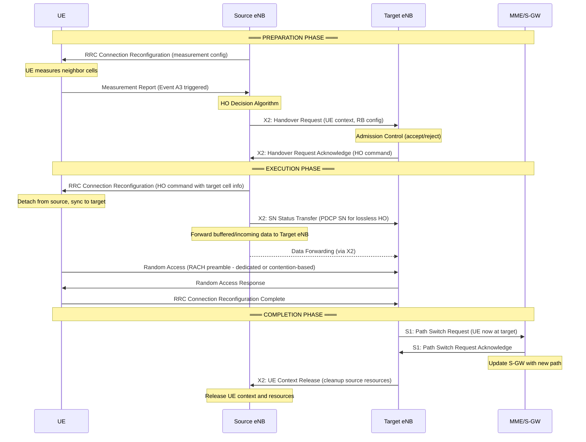
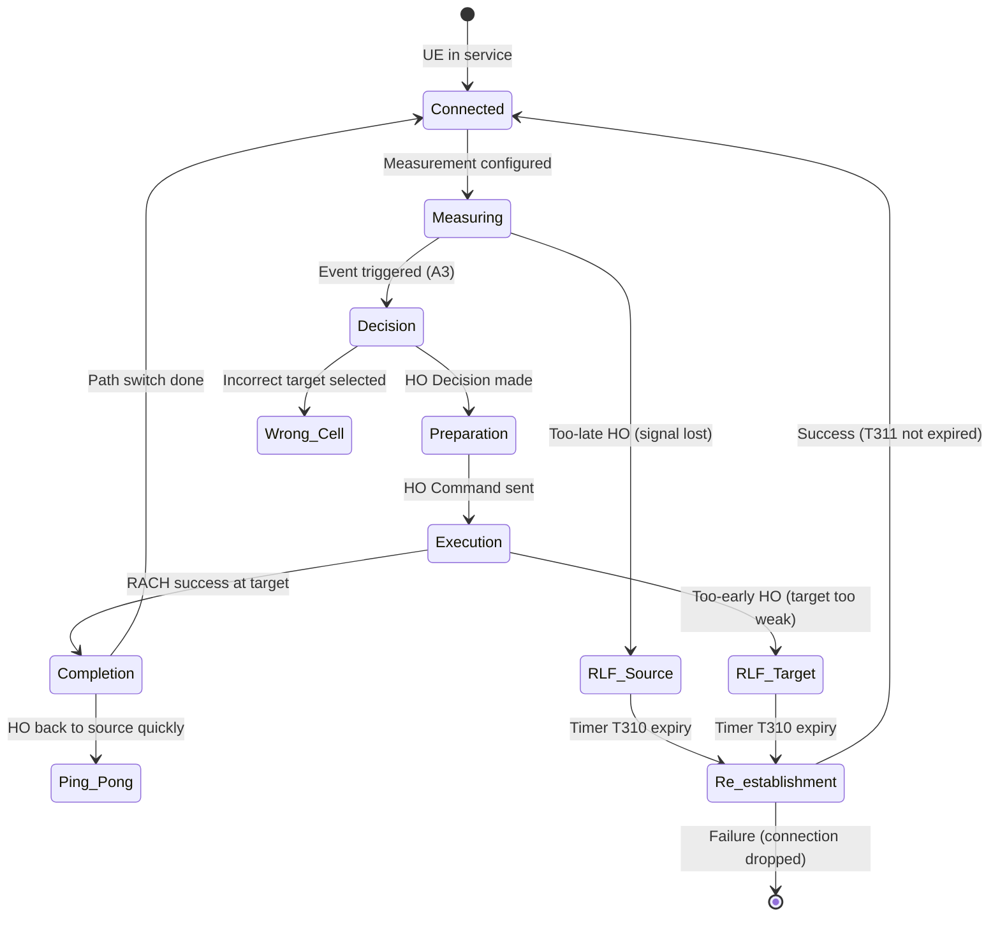
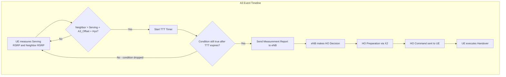

# ماژول 4: تحرک و تحویل

## اهداف یادگیری

در پایان این ماژول، شما قادر خواهید بود:
- توضیح دهید چرا مدیریت تحرک در شبکه‌های سلولی ضروری است
- بین نواحی مکانی، نواحی مسیریابی و نواحی ردیابی تمایز قائل شوید
- سازوکارهای انتخاب مجدد سلول در حالت بیکار را توصیف کنید
- انواع تحویل را در نسل‌های مختلف طبقه‌بندی و مقایسه کنید
- فرآیند تصمیم تحویل را با استفاده از رویدادهای اندازه‌گیری تحلیل کنید
- رویه تحویل X2 در LTE را گام‌به‌گام دنبال کنید
- شکست‌های تحویل و راهبردهای کاهش آن‌ها را شناسایی کنید
- تحول تحرک را از 2G تا 5G مقایسه کنید

---

## 1. چرا مدیریت تحرک لازم است

### چرا
کاربران متحرک هستند — راه می‌روند، رانندگی می‌کنند و سفر می‌کنند در حالی که انتظار تماس‌های صوتی، پخش جریانی ویدیو و نشست‌های داده بدون وقفه دارند. بدون مدیریت تحرک، کاربری که از مرز یک سلول عبور می‌کند، قطعی فوری سرویس را تجربه می‌کند.

### چه چیزی
مدیریت تحرک مجموعه‌ای از رویه‌های شبکه است که:
- مکان کاربر را **ردیابی** می‌کند (تا شبکه برای تماس‌ها/داده‌های ورودی به او دسترسی یابد)
- تداوم سرویس را هنگام جابه‌جایی کاربر بین سلول‌ها **حفظ** می‌کند (تحویل)
- با اتصال کاربران به بهترین سلول خدمات‌دهنده، استفاده از منابع رادیویی را **بهینه** می‌کند

### چگونه
شبکه این کار را از طریق دو سازوکار مکمل انجام می‌دهد:

| حالت | سازوکار | هدف |
|-------|-----------|---------|
| **حالت بیکار** | انتخاب مجدد سلول + به‌روزرسانی‌های مکان/ردیابی | شبکه مکان تقریبی کاربر را می‌داند |
| **حالت متصل** | تحویل | انتقال بی‌وقفه اتصال فعال |

### مبادله بنیادی

```
More frequent location updates → Better paging accuracy → More signaling overhead
Less frequent location updates → Less signaling → Longer paging delay
```

شبکه باید توازن برقرار کند بین:
- **بار سیگنالینگ** (به‌روزرسانی‌ها منابع رادیویی مصرف می‌کنند)
- **بار صفحه‌بندی** (نواحی بزرگ‌تر = سلول‌های بیشتر برای صفحه‌بندی)
- **تأخیر سرویس** (زمان دسترسی به کاربر برای خدمات ورودی)

---

## 2. مدیریت مکان: LA در برابر RA در برابر TA

### چرا
شبکه باید بداند کاربر (تقریباً) کجاست تا تماس‌ها یا داده‌های ورودی را تحویل دهد. نسل‌های مختلف راهبردهای گروه‌بندی متفاوتی برای توازن بین سیگنالینگ و کارایی صفحه‌بندی استفاده می‌کنند.

### چه چیزی

| نسل | مفهوم ناحیه | مورد استفاده برای | اندازه معمول |
|-----------|-------------|----------|--------------|
| 2G (GSM) | **ناحیه مکانی (LA)** | خدمات سوئیچینگ مداری | 20–100 سلول |
| 2.5G (GPRS) | **ناحیه مسیریابی (RA)** | خدمات سوئیچینگ بسته‌ای | زیرمجموعه LA، 10–50 سلول |
| 4G (LTE) | **ناحیه ردیابی (TA)** | تمام خدمات (تمام-IP) | 30–80 سلول |
| 5G (NR) | **ناحیه ردیابی** + RNA | تمام خدمات + سطح RAN | قابل پیکربندی در هر UE |

### چگونه — ناحیه مکانی (2G)

```
┌─────────────────────────────────┐
│         Location Area (LA)       │
│  ┌─────┐ ┌─────┐ ┌─────┐       │
│  │Cell1│ │Cell2│ │Cell3│  ...   │
│  └─────┘ └─────┘ └─────┘       │
└─────────────────────────────────┘
```

- UE هنگام عبور از مرز LA **به‌روزرسانی ناحیه مکانی (LAU)** را انجام می‌دهد
- شبکه برای تماس ورودی، تمام سلول‌های LA را صفحه‌بندی می‌کند
- توسط MSC/VLR مدیریت می‌شود

### چگونه — ناحیه مسیریابی (GPRS)

- RA یک **زیرمجموعه** از یک LA است (یک LA شامل چندین RA است)
- UE برای خدمات بسته‌ای **به‌روزرسانی ناحیه مسیریابی (RAU)** را انجام می‌دهد
- توسط SGSN مدیریت می‌شود
- امکان مکان دقیق‌تر برای کاربران داده را فراهم می‌کند

### چگونه — ناحیه ردیابی (LTE/5G)

- **فهرست ناحیه ردیابی (TAL)**: به UE یک فهرست از TAها تخصیص می‌یابد — هنگام جابه‌جایی درون فهرست نیازی به به‌روزرسانی نیست
- سیگنالینگ را برای کاربران پرتحرک کاهش می‌دهد (TAL بزرگ‌تر)
- کاربران کم‌تحرک TAL کوچک‌تری می‌گیرند تا ناحیه صفحه‌بندی کاهش یابد

```
UE TAL = {TA1, TA2, TA3, TA4}

Moving TA1→TA2→TA3→TA4: NO update needed
Moving TA4→TA5 (outside TAL): Tracking Area Update triggered
```

### بهبود 5G: ناحیه اعلان مبتنی بر RAN (RNA)

- در حالت **RRC_INACTIVE** (جدید در 5G)، gNB یک RNA کوچک‌تر را مدیریت می‌کند
- سیگنالینگ شبکه هسته را کاهش می‌دهد
- تحرک دو-سطحی: RNA (مدیریت‌شده توسط RAN) + TA (مدیریت‌شده توسط هسته)

---

## 3. انتخاب مجدد سلول (تحرک حالت بیکار)

### چرا
حتی وقتی در تماس/نشست فعال نیست، UE باید روی بهترین سلول اردو بزند تا:
- پیام‌های صفحه‌بندی را به‌طور کارآمد دریافت کند
- هنگام نیاز به اتصال، کیفیت سیگنال خوبی داشته باشد
- از به‌روزرسانی‌های غیرضروری مکان اجتناب کند

### چه چیزی
انتخاب مجدد سلول، فرآیند **خودمختار UE** برای انتخاب سلول جدید جهت اردو زدن در حالت بیکار است. شبکه پارامترها را از طریق پخش اطلاعات سیستم (SIBها) فراهم می‌کند، اما UE تصمیم را به‌صورت مستقل می‌گیرد.

### چگونه — معیارهای انتخاب مجدد سلول

#### معیار رتبه‌بندی (معیار S)

یک سلول برای اردو زدن مناسب است اگر معیار S را برآورده کند:

```
Srxlev = Qrxlevmeas - (Qrxlevmin + Qrxlevminoffset) - Pcompensation > 0
Squal  = Qqualmeas  - (Qqualmin  + Qqualminoffset) > 0
```

که در آن:
- `Qrxlevmeas`: RSRP اندازه‌گیری‌شده (dBm)
- `Qrxlevmin`: RSRP حداقل مورد نیاز (-124 تا -44 dBm، معمول: -124 dBm)
- `Qqualmeas`: RSRQ اندازه‌گیری‌شده (dB)
- `Qqualmin`: RSRQ حداقل مورد نیاز (-20 تا -3 dB، معمول: -20 dB)

#### رتبه‌بندی سلول (معیار R)

برای انتخاب مجدد درون-فرکانسی، سلول‌ها رتبه‌بندی می‌شوند:

```
Rs = Qmeas,s + QHyst                    (serving cell)
Rn = Qmeas,n - Qoffset                  (neighbor cell)

Reselect to neighbor if: Rn > Rs for duration Treselection
```

#### انتخاب مجدد مبتنی بر اولویت (بین-فرکانسی/بین-RAT)

| اولویت | اقدام |
|----------|--------|
| لایه با اولویت بالاتر | در صورت برآورده‌شدن ThreshX,High توسط همسایه، انتخاب مجدد کن |
| لایه با اولویت برابر | از رتبه‌بندی (معیار R) استفاده کن |
| لایه با اولویت پایین‌تر | فقط اگر serving < ThreshServing,Low و همسایه > ThreshX,Low باشد، انتخاب مجدد کن |

### چگونه — هیسترزیس و تایمرها

**هیسترزیس (QHyst)** از انتخاب مجدد پینگ-پونگ جلوگیری می‌کند:
- مقادیر معمول: 2–6 dB
- به سلول خدمات‌دهنده «چسبندگی» اضافه می‌کند

**تایمر Treselection** (معمولاً 1–4 ثانیه):
- همسایه باید برای این مدت بهتر بماند تا انتخاب مجدد رخ دهد
- از انتخاب مجدد ناشی از محو شدن لحظه‌ای جلوگیری می‌کند

```
Signal                Treselection
Strength    ┌───────────────────┐
   ▲        │                   │
   │     ···│·····Neighbor······│····→ Reselect!
   │   ··   │                   │
   │ ··  ┌──┼─QHyst─┐          │
   │·    │  │       │          │
   │─────┼──┼───────┼──────────┼──→ Serving Cell
   │     │  │       │          │
   └─────┴──┴───────┴──────────┴──→ Time
         t1  t2                t3
         
   t2-t1: Neighbor exceeds Serving + QHyst
   t3-t2: Must sustain for Treselection → reselect at t3
```

### پارامترهای معمول انتخاب مجدد سلول

| پارامتر | مقدار معمول | هدف |
|-----------|--------------|---------|
| QHyst | 4 dB | هیسترزیس سلول خدمات‌دهنده |
| Treselection | 2 s | تایمر پایداری |
| Qrxlevmin | -124 dBm | حداقل RSRP برای انتخاب سلول |
| Qqualmin | -20 dB | حداقل RSRQ برای انتخاب سلول |
| ThreshServing,Low | 4 (= 4 dB) | آستانه ترک سلول خدمات‌دهنده (به اولویت پایین‌تر) |
| ThreshX,High | 8 (= 8 dB) | آستانه ورود به لایه با اولویت بالاتر |


---

## 4. انواع تحویل

### چرا
سناریوهای تحرک مختلف نیازمند راهبردهای تحویل متفاوتی هستند. کاربری که بین سلول‌های هم‌کانال راه می‌رود، به سازوکار متفاوتی نسبت به کاربری در قطار پرسرعت که بین نواحی پوشش LTE و 3G عبور می‌کند نیاز دارد.

### چه چیزی — مرور طبقه‌بندی

```
                        Handover Types
                             │
          ┌──────────────────┼──────────────────┐
          │                  │                  │
    By Frequency        By Technology       By Method
          │                  │                  │
    ┌─────┴─────┐      ┌────┴────┐       ┌────┴────┐
    │           │      │         │       │         │
 Intra-freq  Inter-freq  Intra-RAT  Inter-RAT  Hard    Soft
```

---

### 4.1 تحویل درون-فرکانسی

#### چرا
رایج‌ترین تحویل — زمانی رخ می‌دهد که کاربر بین سلول‌های فعال روی **همان فرکانس حامل** جابه‌جا می‌شود. این سناریوی معمول در استقرارهای شهری متراکم است.

#### چه چیزی
- سلول مبدأ و مقصد از همان فرکانس استفاده می‌کنند (مثلاً هر دو روی 1800 MHz باند 3)
- UE می‌تواند همسایه‌ها را **بدون شکاف‌های اندازه‌گیری** اندازه بگیرد
- سریع‌ترین و ساده‌ترین نوع تحویل

#### چگونه
- UE به‌طور پیوسته RSRP/RSRQ سلول خدمات‌دهنده و همسایه‌های درون-فرکانسی را اندازه می‌گیرد
- نیازی به وقفه در اندازه‌گیری نیست (فرکانس یکسان = می‌توان در حین دریافت اندازه گرفت)
- توسط رویداد A3 فعال می‌شود: همسایه با آفست بهتر از خدمات‌دهنده می‌شود

**سناریوی معمول**: راه رفتن بین سلول‌های مجاور در یک مرکز خرید (تمام سلول‌ها روی فرکانس یکسان)

---

### 4.2 تحویل بین-فرکانسی

#### چرا
شبکه‌ها چندین لایه فرکانسی برای ظرفیت مستقر می‌کنند (مثلاً ماکرو روی 800 MHz برای پوشش، سلول‌های کوچک روی 2600 MHz برای ظرفیت). کاربران باید بین این لایه‌ها جابه‌جا شوند.

#### چه چیزی
- سلول مبدأ و مقصد روی **فرکانس‌های حامل متفاوت** کار می‌کنند
- UE برای تنظیم گیرنده خود روی فرکانس‌های دیگر نیازمند **شکاف‌های اندازه‌گیری** است
- وقفه کمی طولانی‌تر از درون-فرکانسی

#### چگونه
- شبکه شکاف‌های اندازه‌گیری را پیکربندی می‌کند (6 ms در هر 40 یا 80 ms)
- UE در حین شکاف‌ها همسایه‌های بین-فرکانسی را اندازه می‌گیرد
- توسط رویداد A4 (همسایه روی فرکانس دیگر بهتر از آستانه می‌شود) یا A5 (خدمات‌دهنده افت می‌کند و همسایه خوب است) فعال می‌شود

**سناریوی معمول**: کاربر از سلول کوچک داخلی (2600 MHz) به ماکرو بیرونی (800 MHz) می‌رود

---

### 4.3 تحویل بین-RAT

#### چرا
همه نواحی پوشش LTE/5G را ندارند. وقتی سیگنال LTE افت می‌کند، UE ممکن است برای حفظ سرویس نیاز به بازگشت به 3G (UMTS) یا حتی 2G (GSM) داشته باشد. همچنین برای بازگشت CS (تماس‌های صوتی) استفاده می‌شود.

#### چه چیزی
- تحویل بین فناوری‌های دسترسی رادیویی مختلف
- مثال‌ها: LTE ← UMTS، LTE ← GSM، NR ← LTE
- پیچیده‌ترین نوع — پروتکل‌های مختلف، شبکه‌های هسته مختلف

#### چگونه
- UE در حین شکاف‌های اندازه‌گیری همسایه‌های بین-RAT را اندازه می‌گیرد
- توسط رویداد B1 (همسایه بین-RAT بالای آستانه) یا B2 (خدمات‌دهنده زیر آستانه و بین-RAT بالای آستانه) فعال می‌شود
- نیازمند هماهنگی بین-RAT بین eNB و RNC/BSC است

**سناریوی معمول**:
- VoLTE در دسترس نیست ← بازگشت CS به 3G برای تماس صوتی
- کاربر به ناحیه روستایی با پوشش فقط 3G رانندگی می‌کند

---

### 4.4 تحویل سخت (قطع-پیش-از-وصل)

#### چرا
وقتی اتصال همزمان به دو سلول ممکن نیست (فرکانس‌های مختلف، فناوری‌های مختلف، یا انتخاب طراحی سیستم)، اتصال قدیمی باید پیش از برقراری اتصال جدید آزاد شود.

#### چه چیزی
- اتصال به سلول مبدأ **آزاد می‌شود** پیش از اتصال به مقصد
- وقفه کوتاه در سرویس (معمولاً 20–50 ms در LTE)
- مورد استفاده در: GSM، LTE، 5G NR

#### چگونه
```
Timeline:
──[Connected to Source]──|GAP|──[Connected to Target]──→
                         ↑
                   Interruption
                   (20-50 ms LTE)
                   (100-200 ms GSM)
```

- **مزیت**: ساده‌تر، بدون نیاز به ترکیب/تقسیم
- **عیب**: وقفه کوتاه (قابل قبول برای داده، قابل توجه برای صدا در 2G)

---

### 4.5 تحویل نرم (وصل-پیش-از-قطع) — مختص 3G UMTS

#### چرا
سیستم‌های 3G مبتنی بر CDMA می‌توانند همان سیگنال را از چندین سلول به‌طور همزمان دریافت کنند (فرکانس یکسان، تقسیم کد). این امکان تحویل بی‌وقفه بدون هیچ وقفه‌ای را فراهم می‌کند.

#### چه چیزی
- UE به **چندین سلول به‌طور همزمان** متصل است (مجموعه فعال)
- سیگنال‌ها از چندین سلول برای بهره تنوع **ترکیب** می‌شوند
- منحصر به CDMA/WCDMA (3G) — در LTE یا 5G استفاده **نمی‌شود**

#### چگونه — مدیریت مجموعه فعال

```
Active Set Events (3GPP UMTS):
- Event 1A: Add cell to Active Set (neighbor strong enough)
- Event 1B: Remove cell from Active Set (cell too weak)
- Event 1C: Replace cell in Active Set (better candidate found)
```

```
         Source Cell         Target Cell
Signal      │                    │
   ▲        │  Soft Handover     │
   │    ────┤  Region            ├────
   │   /    │◄──────────────────►│    \
   │  /     │   UE connected     │     \
   │ /      │   to BOTH cells    │      \
   │/       │                    │       \
   └────────┼────────────────────┼────────→ Distance
             Cell A              Cell B
             boundary
```

- **مجموعه فعال**: مجموعه سلول‌هایی که در حال حاضر به UE خدمات می‌دهند (حداکثر 3–6 سلول)
- **تحویل نرم**: بین سلول‌های یک Node B یا Node Bهای مختلف، فرکانس یکسان
- **تحویل نرم‌تر**: بین سکتورهای **همان** Node B (ترکیب MRC در Node B)

**مزایا**:
- بدون وقفه
- بهره تنوع بزرگ (2–3 dB)
- کاهش پینگ-پونگ

**معایب**:
- استفاده از منابع در چندین سلول به‌طور همزمان
- افزایش نیازمندی‌های بک‌هال و پردازش
- افزودن پیچیدگی به کنترل توان


---

## 5. فرآیند تصمیم تحویل

### چرا
شبکه باید تصمیم بگیرد چه زمانی تحویل دهد، به کدام سلول، و تضمین کند که تصمیم در برابر محو شدن و نویز مقاوم است. تحویلی که زمان‌بندی ضعیفی داشته باشد باعث قطع می‌شود؛ تحویل خوب-تنظیم‌شده برای کاربر نامحسوس است.

### چه چیزی
تصمیم تحویل در LTE بر اساس موارد زیر است:
1. **گزارش‌های اندازه‌گیری UE** — دوره‌ای یا محرک-رویداد
2. **رویدادهای اندازه‌گیری** — شرایطی که گزارش را فعال می‌کنند
3. **هیسترزیس و زمان-تا-فعال‌سازی** — فیلترکردن برای اجتناب از محرک‌های کاذب
4. **تصمیم شبکه** — eNB گزارش را ارزیابی و تصمیم می‌گیرد

---

### 5.1 گزارش‌های اندازه‌گیری (RSRP و RSRQ)

#### چه چیزی

| متریک | نام کامل | محدوده | هدف |
|--------|-----------|-------|---------|
| **RSRP** | توان دریافتی سیگنال مرجع | -140 تا -44 dBm | قدرت سیگنال (پوشش) |
| **RSRQ** | کیفیت دریافتی سیگنال مرجع | -20 تا -3 dB | کیفیت سیگنال (تداخل + نویز را در نظر می‌گیرد) |
| **SINR** | نسبت سیگنال به تداخل به‌علاوه نویز | -23 تا 40 dB | کیفیت کلی پیوند |

#### چگونه

```
RSRP = Power of one Resource Element carrying Reference Signal

RSRQ = N × RSRP / RSSI
     where N = number of RBs, RSSI = total received wideband power

Interpretation:
- RSRP = "how strong is MY cell's signal?"
- RSRQ = "how good is MY cell's signal relative to everything else I hear?"
```

**چه زمانی از کدام استفاده شود**:
- تحویل مبتنی بر RSRP: خوب برای سناریوهای محدود-پوشش (روستایی)
- تحویل مبتنی بر RSRQ: خوب برای سناریوهای محدود-تداخل (شهری متراکم)

---

### 5.2 رویدادهای اندازه‌گیری LTE (A1–A6)

#### چه چیزی

| رویداد | شرط | مورد استفاده |
|-------|-----------|----------|
| **A1** | خدمات‌دهنده > آستانه | توقف اندازه‌گیری‌های بین-فرکانسی (خدمات‌دهنده به‌اندازه کافی خوب است) |
| **A2** | خدمات‌دهنده < آستانه | شروع اندازه‌گیری‌های بین-فرکانسی/بین-RAT |
| **A3** | همسایه > خدمات‌دهنده + آفست | **محرک اصلی تحویل درون-فرکانسی** |
| **A4** | همسایه > آستانه | تحویل بین-فرکانسی |
| **A5** | خدمات‌دهنده < Thresh1 و همسایه > Thresh2 | تحویل بین-فرکانسی/بین-RAT |
| **A6** | همسایه > SCell + آفست | تغییر سلول ثانویه (CA) |

#### رویداد B (بین-RAT):

| رویداد | شرط | مورد استفاده |
|-------|-----------|----------|
| **B1** | همسایه بین-RAT > آستانه | تغییر مسیر به RAT دیگر |
| **B2** | خدمات‌دهنده < Thresh1 و بین-RAT > Thresh2 | بازگشت (مثلاً LTE←3G) |

#### چگونه — رویداد A3 به‌تفصیل (مهم‌ترین)

شرط ورود رویداد A3:
```
Mn + Ofn + Ocn - Hys > Ms + Ofs + Ocs + Off

Where:
  Mn  = Measurement of neighbor cell (RSRP or RSRQ)
  Ms  = Measurement of serving cell
  Ofn = Frequency-specific offset for neighbor
  Ofs = Frequency-specific offset for serving
  Ocn = Cell-specific offset for neighbor
  Ocs = Cell-specific offset for serving
  Hys = Hysteresis (positive value)
  Off = A3 offset (the main tunable parameter)
```

ساده‌شده (فرکانس یکسان، بدون آفست‌های مختص سلول):
```
Neighbor_RSRP - Hysteresis > Serving_RSRP + A3_Offset
```

---

### 5.3 هیسترزیس و زمان-تا-فعال‌سازی

#### چرا
سیگنال‌های رادیویی به دلیل محو شدن نوسان می‌کنند. بدون فیلترکردن، شبکه در هر محو شدن موقت تحویل را فعال می‌کند و باعث سیگنالینگ بیش‌ازحد و پینگ-پونگ می‌شود.

#### چه چیزی
دو سازوکار از فعال‌سازی کاذب جلوگیری می‌کنند:

| پارامتر | عملکرد | مقدار معمول |
|-----------|----------|---------------|
| **هیسترزیس (Hys)** | سیگنال باید با این حاشیه از آستانه فراتر رود | 1–3 dB |
| **زمان-تا-فعال‌سازی (TTT)** | شرط باید برای این مدت پایدار بماند | 40–640 ms |

#### چگونه — تجسم

```
RSRP
(dBm)
  ▲
  │
  │         ╭─╮  ╭──╮
  │    ╭───╮│ │╭─╯  ╰──── Neighbor Cell (measured)
  │───╮│   ╰╯ ││         
  │   ╰╯      ╰╯         
  │────────────────────── Serving + A3_Offset + Hys  ← Entry threshold
  │
  │────────────────────── Serving + A3_Offset        ← A3 offset level
  │
  │══════════════════════ Serving Cell (measured)
  │
  ├────┬────┬────┬────┬────┬────┬────→ Time
       t1   t2   t3   t4   
       │         │    │              │
       │         │    └──TTT starts──┤→ A3 event reported!
       │         │                   │
       │         └─Not sustained (resets TTT)
       │
       └─ Neighbor crosses threshold but drops back (filtered by Hys)
```

**اثر ترکیبی**:
- هیسترزیس فیلترکردن دامنه را فراهم می‌کند (دامنه dB)
- TTT فیلترکردن زمان را فراهم می‌کند (دامنه زمان)
- با هم فعال‌سازی مقاوم تحویل را فراهم می‌کنند

#### مبادله مهندسی

```
┌─────────────────────────────────────────────────────────┐
│  Low Hys + Short TTT          High Hys + Long TTT       │
│  ─────────────────          ───────────────────────      │
│  • Fast handover             • Slow handover             │
│  • Risk of ping-pong         • Risk of too-late HO      │
│  • Good for slow users       • Good for fast users       │
│  • More signaling            • Less signaling            │
│                                                          │
│  Typical urban:              Typical highway:            │
│  Hys=2dB, TTT=160ms         Hys=3dB, TTT=80ms          │
└─────────────────────────────────────────────────────────┘
```

---

### 5.4 حاشیه تحویل

#### چه چیزی
**حاشیه کل تحویل** اثر ترکیبی آفست A3، هیسترزیس و TTT است که تعیین می‌کند همسایه باید چقدر بهتر باشد تا تحویل رخ دهد.

```
Effective HO Margin ≈ A3_Offset + Hysteresis + (UE_speed × TTT)
                                                 └──────────────┘
                                                 Signal change during TTT
```

#### مثال محاسبه

```
Given:
  A3 Offset = 3 dB
  Hysteresis = 2 dB  
  TTT = 320 ms
  UE speed = 50 km/h → path loss changes ~0.5 dB during TTT

Effective margin = 3 + 2 + 0.5 = 5.5 dB

Meaning: Neighbor must be 5.5 dB better than serving 
         before handover is triggered
```


---

## 6. رویه تحویل — تحویل X2 در LTE

### چرا
تحویل مبتنی بر X2 سازوکار تحویل **ترجیحی** در LTE است زیرا ارتباط مستقیم eNB-به-eNB را بدون مسیریابی از طریق شبکه هسته (MME) ممکن می‌سازد و تأخیر و بار سیگنالینگ را کاهش می‌دهد.

### چه چیزی
- معماری مسطح: eNBها به‌طور مستقیم از طریق واسط X2 ارتباط برقرار می‌کنند
- کمک‌شده توسط UE، کنترل‌شده توسط شبکه: UE اندازه می‌گیرد، eNB تصمیم می‌گیرد
- فاز آماده‌سازی تضمین می‌کند که مقصد **پیش از** فرمان تحویل منابع داشته باشد
- زمان کل وقفه: **20–50 ms** (برای اکثر کاربردها نامحسوس)

### چگونه — توالی تحویل X2



### تفکیک فاز-به-فاز

#### فاز 1: آماده‌سازی (حدود 50–200 ms)

| گام | پیام | هدف |
|------|---------|---------|
| 1 | گزارش اندازه‌گیری | UE مبدأ را از کیفیت همسایه مطلع می‌کند |
| 2 | تصمیم تحویل | eNB مبدأ الگوریتم را بر اساس گزارش اجرا می‌کند |
| 3 | درخواست تحویل (X2) | مبدأ از مقصد می‌خواهد منابع را آماده کند |
| 4 | کنترل پذیرش | مقصد بررسی می‌کند که آیا می‌تواند UE را بپذیرد |
| 5 | تأیید درخواست تحویل (X2) | مقصد تأیید می‌کند، فرمان تحویل را فراهم می‌کند |

#### فاز 2: اجرا (وقفه حدود 20–50 ms)

| گام | پیام | هدف |
|------|---------|---------|
| 6 | پیکربندی مجدد RRC | مبدأ به UE فرمان تحویل می‌دهد |
| 7 | انتقال وضعیت SN | تضمین عدم از دست رفتن داده (هم‌ترازی PDCP SN) |
| 8 | ارسال داده | داده بافر‌شده به مقصد ارسال می‌شود |
| 9 | دسترسی تصادفی | UE با سلول مقصد همگام می‌شود |
| 10 | تکمیل پیکربندی مجدد | UE تحویل موفق را تأیید می‌کند |

#### فاز 3: تکمیل (حدود 20–100 ms)

| گام | پیام | هدف |
|------|---------|---------|
| 11 | درخواست تغییر مسیر | MME/S-GW را از مکان جدید مطلع می‌کند |
| 12 | تأیید تغییر مسیر | هسته به‌روزرسانی مسیر را تأیید می‌کند |
| 13 | آزادسازی زمینه UE | مبدأ منابع را آزاد می‌کند |

### مقادیر زمان‌بندی کلیدی

| پارامتر | مقدار معمول |
|-----------|--------------|
| زمان کل آماده‌سازی | 50–200 ms |
| **وقفه صفحه کاربر** | **20–50 ms** |
| تکمیل تغییر مسیر | 20–100 ms |
| کل سرتاسری | 100–350 ms |
| پیشوند RACH | اختصاصی (بدون رقابت) یا مبتنی بر رقابت |

### تحویل مبتنی بر S1 (بازگشت)

وقتی واسط X2 در دسترس **نیست** (بدون اتصال مستقیم بین eNBها):
- تمام پیام‌ها از MME مسیریابی می‌شوند
- زمان آماده‌سازی طولانی‌تر (حدود 100–500 ms)
- برای تحویل بین-eNB بدون X2، یا تحویل بین-MME استفاده می‌شود
- تجربه UE یکسان اما تأخیر شبکه بالاتر


---

## 7. شکست‌های تحویل

### چرا
شکست‌های تحویل مستقیماً بر تجربه کاربر تأثیر می‌گذارند — قطع تماس، وقفه ویدیو، از دست رفتن داده. درک حالت‌های شکست برای بهینه‌سازی شبکه ضروری است.

### چه چیزی
چهار حالت اصلی شکست وجود دارد که هر یک علل و راه‌حل‌های متمایزی دارند:

---

### 7.1 تحویل دیر-هنگام

#### چرا رخ می‌دهد
UE خیلی سریع حرکت می‌کند یا حاشیه تحویل خیلی بزرگ است، بنابراین سیگنال سلول خدمات‌دهنده **پیش از** تکمیل تحویل به زیر سطح قابل استفاده می‌افتد.

#### چه اتفاقی می‌افتد
```
Signal
  ▲
  │\                          
  │ \   Serving              ╱ Target
  │  \                     ╱
  │   \                  ╱
  │    \   ┌───────────╱──── Handover triggered (too late!)
  │     \  │         ╱
  │──────\─┼───────╱──────── Radio Link Failure threshold (Qout)
  │       \│     ╱
  │        ╳   ╱  ← RLF occurs here! Connection dropped!
  │        │\╱
  └────────┴──────────────→ Time
           RLF
```

#### نشانگرها
- شکست لینک رادیویی (RLF) در سلول مبدأ **پیش از** دریافت فرمان تحویل
- شمارنده RLF بالا در سلول مبدأ
- گزارش RLF همسایه قوی را در زمان شکست نشان می‌دهد

#### کاهش
- **کاهش** آفست A3 (فعال‌سازی تحویل زودتر)
- **کاهش** TTT (واکنش سریع‌تر)
- **کاهش** هیسترزیس
- افزودن گزارش‌دهی اندازه‌گیری زودهنگام (رویداد A2 با آستانه پایین‌تر)

---

### 7.2 تحویل زود-هنگام

#### چرا رخ می‌دهد
تحویل خیلی سریع فعال می‌شود (پارامترها بیش از حد تهاجمی). UE به سلولی تحویل داده می‌شود که هنوز به‌اندازه کافی قوی نیست تا اتصال را حفظ کند.

#### چه اتفاقی می‌افتد
```
Signal
  ▲
  │                           ╱ Target
  │ ────── Serving          ╱
  │         \             ╱
  │  HO here─\─────────╱──── Handover triggered (too early!)
  │            \      ╱
  │             \   ╱
  │──────────────\╱────────── Required signal level
  │              ╳ ← RLF at target (too weak!)
  │            ╱  \
  └──────────╱─────\──────→ Time
           UE arrives at target
           too early
```

#### نشانگرها
- RLF در سلول مقصد مدت کوتاهی پس از تکمیل تحویل رخ می‌دهد
- UE تلاش می‌کند به سلول مبدأ بازگردد و دوباره برقرار کند
- زمان کوتاه بین تکمیل تحویل و RLF

#### کاهش
- **افزایش** آفست A3 (نیاز به تفاوت بزرگ‌تر)
- **افزایش** TTT (انتظار طولانی‌تر)
- **افزایش** هیسترزیس
- تأیید ردپای پوشش سلول همسایه

---

### 7.3 اثر پینگ-پونگ

#### چرا رخ می‌دهد
دو سلول قدرت سیگنال مشابهی در ناحیه همپوشانی دارند. با پارامترهای تحویل تهاجمی، UE به‌طور مکرر بین آن‌ها نوسان می‌کند.

#### چه اتفاقی می‌افتد
```
Signal
  ▲
  │
  │  ╭──╮     ╭──╮     ╭──╮     Cell A
  │──╯  ╰──╮──╯  ╰──╮──╯  ╰──── 
  │         ╰──╮     ╰──╮        Cell B
  │            ╰──╮     ╰──╮
  │               ╰────────╰──── 
  │
  │  HO    HO    HO    HO    HO
  │  A→B   B→A   A→B   B→A   A→B   ← Excessive handovers!
  └──────────────────────────────→ Time

  User is essentially stationary in overlap zone!
```

#### تأثیر
- بار سیگنالینگ بیش‌ازحد
- داده کاربر قطع می‌شود (هر تحویل = 20-50 ms وقفه)
- منابع رادیویی برای آماده‌سازی تحویل هدر می‌رود
- کیفیت تجربه (QoE) ضعیف برای کاربر

#### نشانگرها
- همان UE تحویل‌های متعدد بین همان جفت سلول را در زمان کوتاه انجام می‌دهد
- نرخ تحویل بالا با تحرک پایین
- A←B به‌دنبال آن B←A در عرض چند ثانیه

#### کاهش

| راهبرد | چگونه کمک می‌کند |
|----------|-------------|
| **افزایش هیسترزیس** | حاشیه بزرگ‌تری برای فعال‌سازی لازم است ← محرک‌های کمتر |
| **افزایش TTT** | باید طولانی‌تر پایدار بماند ← نوسانات گذرا فیلتر می‌شوند |
| **آفست مختص سلول (CIO)** | یک سلول را در همپوشانی ترجیح می‌دهد |
| **افزایش آفست A3** | همسایه باید به‌طور قابل توجهی بهتر باشد |
| **بهینه‌سازی شیب آنتن** | اندازه ناحیه همپوشانی را کاهش می‌دهد |

**قاعده سرانگشتی**: اگر بیش از 30% تحویل‌ها بین یک جفت سلول پینگ-پونگ باشند (بازگشت در عرض 5 ثانیه)، TTT یا هیسترزیس آن جفت را افزایش دهید.

---

### 7.4 تحویل به سلول اشتباه

#### چرا رخ می‌دهد
بهترین سلول مقصد، سلولی نیست که انتخاب شده است. این می‌تواند به دلایل زیر رخ دهد:
- رابطه همسایگی گمشده (مقصد در فهرست همسایه نیست)
- گزارش اندازه‌گیری بهترین سلول واقعی را شامل نمی‌شود
- ناهنجاری انتشار (سیگنال از سلول دور به‌طور لحظه‌ای قوی است)

#### چه اتفاقی می‌افتد
- UE به سلول X تحویل داده می‌شود، اما سلول Y مقصد صحیح بود
- UE به‌سرعت سیگنال ضعیفی در سلول X تجربه می‌کند
- ممکن است تحویل دیگری (به سلول Y) یا RLF را فعال کند

#### کاهش
- **رابطه همسایگی خودکار (ANR)**: کشف و افزودن خودکار همسایه‌ها
- **فهرست‌های جامع همسایه**: اطمینان از پیکربندی تمام مقاصد بالقوه
- **آفست‌های مختص سلول**: کاهش اولویت سلول‌هایی که می‌دانیم مشکل ایجاد می‌کنند
- **فیلترکردن لایه-3**: میانگین‌گیری اندازه‌گیری‌ها برای کاهش ناهنجاری‌ها

---

### 7.5 نمودار حالت شکست تحویل




---

## 8. تحول تحویل: 2G ← 3G ← LTE ← 5G

### چرا
هر نسل سازوکارهای تحویل را برای پشتیبانی از سرعت‌های بالاتر، تأخیر کمتر و معماری‌های شبکه پیچیده‌تر بهبود داد. درک تحول، منطق طراحی را آشکار می‌کند.

---

### 8.1 GSM (2G): تحویل سخت، کنترل‌شده توسط BSC

#### معماری
```
MS ──radio──► BTS ──Abis──► BSC ──A──► MSC
                              ↑
                         HO Decision here
```

#### ویژگی‌ها

| جنبه | 2G GSM |
|--------|--------|
| نوع تحویل | **فقط سخت** (قطع-پیش-از-وصل) |
| تصمیم‌گیرنده | **BSC** (کنترلر ایستگاه پایه) |
| اندازه‌گیری‌ها | MS تا 6 همسایه (حامل‌های BCCH) را اندازه می‌گیرد |
| نرخ اندازه‌گیری | هر دوره SACCH (480 ms) |
| وقفه | 100–200 ms |
| معیارها | RXLEV (قدرت سیگنال)، RXQUAL (کیفیت مبتنی بر BER) |
| کنترل توان | ترکیب‌شده با تصمیم تحویل |

#### چگونه کار می‌کرد
1. MS به‌طور پیوسته سلول خدمات‌دهنده + 6 همسایه قوی‌تر را اندازه می‌گیرد (از فهرست BA)
2. MS هر 480 ms از طریق SACCH اندازه‌گیری‌ها را گزارش می‌دهد
3. BSC میانگین‌گیری را اعمال می‌کند (پارامترهای HREQAVE، HREQT)
4. BSC بر اساس معیارهای متعدد تصمیم می‌گیرد:
   - بودجه توان (PBGT) ← مبتنی بر پوشش
   - RXQUAL ← مبتنی بر کیفیت (تداخل)
   - RXLEV ← مبتنی بر سطح (سیگنال خیلی ضعیف/قوی)
   - فاصله ← پیشروی زمانی خیلی بزرگ
   - ترافیک ← کاهش ازدحام

#### محدودیت‌ها
- تحویل سخت: کلیک قابل شنیدن در تماس‌های صوتی
- کنترل‌شده توسط BSC: تمام هوش در شبکه، تطبیق کند
- اندازه‌گیری‌های محدود: فقط 6 همسایه، گزارش‌دهی کند
- بدون تحویل نرم: بدون بهره تنوع در لبه سلول

---

### 8.2 UMTS (3G): تحویل نرم، کنترل‌شده توسط RNC

#### معماری
```
UE ──radio──► Node B ──Iub──► RNC ──Iu──► CN
                                ↑
                           HO Decision here
                           + Macro-diversity combining
```

#### ویژگی‌ها

| جنبه | 3G UMTS |
|--------|---------|
| نوع تحویل | **نرم + نرم‌تر + سخت** |
| تصمیم‌گیرنده | **RNC** (کنترلر شبکه رادیویی) |
| اندازه‌گیری‌ها | CPICH Ec/No، RSCP |
| مجموعه فعال | تا 3–6 سلول به‌طور همزمان |
| وقفه | **0 ms** (تحویل نرم)، 20–50 ms (تحویل سخت) |
| معیارها | رویدادهای 1A–1C (مجموعه فعال)، 2A–2F (بین-فرکانسی/RAT) |

#### سازوکار تحویل نرم
```
                    ┌──── Node B 1 ────┐
                    │                  │
UE ────radio────────┤                  ├──── RNC ──── CN
                    │                  │       ↑
                    └──── Node B 2 ────┘    Combining
                                          (Selection or MRC)
```

- **مدیریت مجموعه فعال**:
  - رویداد 1A: Pilot > Best_Pilot - Reporting_Range + Hysteresis ← افزودن سلول
  - رویداد 1B: Pilot < Best_Pilot - Reporting_Range - Hysteresis ← حذف سلول
  - رویداد 1C: New pilot > Worst_in_ActiveSet + Hysteresis ← جایگزینی سلول

- **بهره تنوع بزرگ**: 2–3 dB در لبه سلول
- **20–40%** اتصالات در تحویل نرم در شبکه معمول

#### نوآوری کلیدی
تحویل نرم تحرک بی‌وقفه را ممکن ساخت اما به قیمت:
- مصرف چندین کد کانال‌سازی (یکی برای هر عضو مجموعه فعال)
- افزایش پهنای باند بک‌هال Iub
- کنترل توان پیچیده (باید تمام پیوندها را برآورده کند)

---

### 8.3 LTE (4G): تحویل سخت، کمک‌شده توسط UE و کنترل‌شده توسط شبکه، مبتنی بر X2

#### معماری
```
UE ──radio──► eNB ══X2══► eNB
               │              │
               └──S1──► MME/S-GW
                         
Flat architecture: NO BSC/RNC
eNB makes HO decision!
```

#### ویژگی‌ها

| جنبه | 4G LTE |
|--------|--------|
| نوع تحویل | **فقط سخت** (قطع-پیش-از-وصل) |
| تصمیم‌گیرنده | **eNB مبدأ** (تصمیم توزیع‌شده) |
| اندازه‌گیری‌ها | RSRP، RSRQ (رویدادهای A1–A6، B1–B2) |
| وقفه | **20–50 ms** |
| واسط | **X2** (eNB-به-eNB مستقیم) |
| ویژگی کلیدی | کمک‌شده توسط UE، کنترل‌شده توسط شبکه |

#### چرا LTE تحویل نرم را حذف کرد
1. **OFDMA** (نه CDMA): سلول‌های مختلف از زیرحامل‌های مختلف استفاده می‌کنند ← نمی‌توان همان سیگنال را از چندین سلول ترکیب کرد
2. **معماری مسطح**: بدون RNC مرکزی برای انجام ترکیب
3. **تحویل سخت به‌اندازه کافی سریع است**: وقفه 20–50 ms برای داده قابل قبول است
4. **سادگی**: به‌طور قابل توجهی ساده‌تر از مدیریت مجموعه‌های فعال
5. **کارایی**: بدون منابع هدررفته برای چندین پیوند همزمان

#### نوآوری‌های کلیدی در LTE
- **واسط X2**: eNB-eNB مستقیم ← آماده‌سازی سریع، ارسال داده
- **گزارش‌دهی مبتنی بر رویداد**: فقط هنگام برآورده‌شدن شرایط گزارش بده (سیگنالینگ کمتر)
- **فیلترکردن لایه-3**: میانگین‌گیری قابل پیکربندی برای هموارسازی اندازه‌گیری‌ها
- **روابط همسایگی خودکار (ANR)**: فهرست‌های همسایه خود-پیکربندی
- **بهینه‌سازی استحکام تحرک (MRO)**: پارامترهای تحویل خود-ترمیم

---

### 8.4 5G NR: تحویل شرطی، DAPS، اتصال دوگانه

#### معماری
```
UE ──radio──► gNB ══Xn══► gNB
               │              │
               └──NG──► AMF/UPF
                    
Also: Dual Connectivity
UE ──radio──► Master Node (MN)
   └─radio──► Secondary Node (SN)     ← simultaneous!
```

#### ویژگی‌ها

| جنبه | 5G NR |
|--------|-------|
| نوع تحویل | سخت، **شرطی**، DAPS |
| تصمیم‌گیرنده | gNB مبدأ (+ CPC برای شرطی) |
| اندازه‌گیری‌ها | SS-RSRP، SS-RSRQ، SS-SINR، مبتنی بر CSI-RS |
| وقفه | 0 ms (DAPS)، حدود 0 ms (DC)، 20 ms (سخت) |
| ویژگی‌های کلیدی | CHO، DAPS، اتصال دوگانه، MR-DC |

#### تحویل شرطی (CHO) — نوآوری 5G

**چرا**: در LTE قدیمی، eNB باید منتظر گزارش اندازه‌گیری بماند، تصمیم بگیرد، مقصد را آماده کند، سپس فرمان بفرستد. اگر شرایط رادیویی به‌سرعت افت کند (سرعت بالا، mmWave)، این خیلی کند است.

**چه چیزی**: شبکه **چندین سلول مقصد را پیش-آماده** می‌کند و به UE شرایطی می‌دهد تا تحویل را **به‌صورت خودمختار** فعال کند.

```
Traditional HO:          Conditional HO:
                         
Report → Decision →      Network prepares targets in advance
Prepare → Command →      UE autonomously executes when condition met
Execute                  
                         
UE waits for network     UE decides WHEN to execute
~100-200ms delay         Near-zero decision delay
```

**چگونه**:
1. شبکه CHO را پیکربندی می‌کند: «اگر رویداد A3 برای سلول X یا سلول Y، تحویل به آن سلول را اجرا کن»
2. سلول‌های مقصد پیش-آماده می‌شوند (منابع رزرو می‌شوند)
3. UE شرایط را پایش می‌کند
4. وقتی شرط برآورده شد ← UE بلافاصله اجرا می‌کند (بدون رفت-و-برگشت به شبکه)
5. **مزیت**: تأخیر آماده‌سازی تحویل را حذف می‌کند ← شکست‌های کمتر در سرعت بالا

#### پشته پروتکل فعال دوگانه (DAPS) — وقفه 0 ms

**چرا**: حتی وقفه 20 ms برای URLLC (ارتباط فوق‌قابل اعتماد کم-تأخیر) مهم است.

**چه چیزی**: UE در حین تحویل اتصال به **هر دو** مبدأ و مقصد را به‌طور همزمان حفظ می‌کند — مفهومی مشابه تحویل نرم 3G اما با پیاده‌سازی متفاوت.

```
Timeline:
──[Source + Target active simultaneously]──[Release Source]──
   ↑                                          ↑
   HO command received                        HO complete
   
   Zero interruption! Data flows through both paths
```

**چگونه**:
- UE دو پشته پروتکل فعال دارد (از این رو نام آن)
- داده در حین انتقال از طریق هر دو مسیر ارسال/دریافت می‌شود
- پس از تأیید اتصال موفق توسط مقصد، مبدأ آزاد می‌شود
- **مبادله**: افزایش پیچیدگی و مصرف توان UE

#### اتصال دوگانه (MR-DC) — چند-RAT

**چه چیزی**: UE به‌طور همزمان به دو گره مختلف متصل است:
- **EN-DC** (اتصال دوگانه E-UTRA-NR): LTE اصلی + NR ثانویه
- **NR-DC**: NR اصلی + NR ثانویه
- **NE-DC**: NR اصلی + LTE ثانویه

```
        ┌──── Master Node (MN) ────── Core Network
UE ─────┤
        └──── Secondary Node (SN) ───┘
        
Both links active simultaneously → seamless mobility
SN change ≠ handover (no interruption to MN)
```

---

### 8.5 خلاصه مقایسه نسل‌ها

| ویژگی | 2G GSM | 3G UMTS | 4G LTE | 5G NR |
|---------|--------|---------|--------|-------|
| نوع تحویل | سخت | نرم + سخت | سخت | سخت + CHO + DAPS |
| کنترلر | BSC | RNC | eNB | gNB |
| وقفه | 100-200 ms | 0 ms (نرم) | 20-50 ms | 0 ms (DAPS/DC) |
| اندازه‌گیری | RXLEV، RXQUAL | CPICH RSCP، Ec/No | RSRP، RSRQ | SS-RSRP، CSI-RS |
| هوش | فقط شبکه | فقط شبکه | کمک‌شده توسط UE | خودمختار UE (CHO) |
| معماری | سلسله‌مراتبی | سلسله‌مراتبی | مسطح | مسطح + DC |
| خود-بهینه‌سازی | دستی | دستی | SON (MRO) | مبتنی بر AI/ML |


---

## 9. مثال‌های مهندسی با مقادیر معمول پارامترها

### 9.1 مثال: شبکه ماکرو شهری — بهینه‌سازی تحویل LTE

#### سناریو
- ناحیه شهری متراکم، فاصله بین-سایت 500m
- کاربران: ترکیبی از عابران پیاده (3 km/h) و خودروها (50 km/h)
- مشکل: نرخ شکست تحویل 5%، پینگ-پونگ بیش‌ازحد

#### پارامترهای اولیه (پیش از بهینه‌سازی)

| پارامتر | مقدار | مسئله |
|-----------|-------|-------|
| آفست A3 | 2 dB | خیلی تهاجمی ← تحویل زود-هنگام |
| هیسترزیس | 1 dB | فیلترکردن ناکافی |
| TTT | 100 ms | خیلی کوتاه ← پینگ-پونگ |
| فیلتر لایه-3 (k) | 1 | میانگین‌گیری ناکافی |

#### پارامترهای بهینه‌شده

| پارامتر | مقدار جدید | منطق |
|-----------|-----------|-----------|
| آفست A3 | 3 dB | حاشیه بیشتر پیش از فعال‌سازی |
| هیسترزیس | 2 dB | مقاومت بهتر در برابر محو شدن |
| TTT | 256 ms | بیشتر پینگ-پونگ را برای عابران پیاده حذف می‌کند |
| فیلتر لایه-3 (k) | 4 | محو شدن سریع را هموار می‌کند (میانگین‌گیری حدود 200 ms) |
| CIO (جفت سلول با پینگ-پونگ) | +3 dB | تحویل را برای جفت مشکل‌دار مشخص سوگیری می‌کند |

#### نتیجه
- نرخ شکست تحویل: 5% ← 1.5%
- نرخ پینگ-پونگ: 12% ← 3%
- مبادله: تأخیر متوسط تحویل حدود 150 ms افزایش یافت (قابل قبول)

---

### 9.2 مثال: ریل پرسرعت — 350 km/h

#### چالش
در 350 km/h، UE یک سلول (پوشش 1 km) را در حدود 10 ثانیه می‌پیماید. پارامترهای استاندارد خیلی کند هستند.

#### تنظیم پارامترها

| پارامتر | استاندارد | پرسرعت |
|-----------|----------|------------|
| آفست A3 | 3 dB | 2 dB |
| هیسترزیس | 2 dB | 1 dB |
| TTT | 256 ms | 40 ms |
| فیلتر لایه-3 (k) | 4 | 1 |
| آستانه A2 | -120 dBm | -110 dBm |

#### اقدامات اضافی
- برنامه‌ریزی RF اختصاصی در طول کریدور ریلی
- آنتن‌های جهت‌دار در امتداد ریل
- ناحیه همپوشانی سلول: حداقل 200–300 m
- در نظر گرفتن **تحویل شرطی (5G)** برای این سناریو

#### محاسبه حساسیت سرعت
```
At 350 km/h = 97 m/s
Path loss change rate ≈ 0.3 dB per 10 ms (at 2 GHz, Hata model)

With TTT = 256 ms: Signal changes by ~7.5 dB during TTT!
→ This is unacceptable — must reduce TTT

With TTT = 40 ms: Signal changes by ~1.2 dB during TTT
→ Acceptable margin
```

---

### 9.3 مثال: تحویل بین-RAT — CSFB از LTE به 3G

#### سناریو
VoLTE مستقر نشده است؛ تماس‌های صوتی نیازمند بازگشت CS به 3G هستند.

#### پیکربندی

| پارامتر | مقدار | هدف |
|-----------|-------|---------|
| آستانه 1 B2 (LTE خدمات‌دهنده) | -110 dBm RSRP | هنگام ضعیف‌شدن LTE فعال کن |
| آستانه 2 B2 (مقصد UMTS) | -95 dBm RSCP | فقط اگر 3G کافی باشد |
| TTT (B2) | 640 ms | از بازگشت غیرضروری اجتناب کن |
| آستانه A2 (شروع اندازه‌گیری 3G) | -105 dBm RSRP | اندازه‌گیری‌های بین-RAT را آغاز کن |
| شکاف اندازه‌گیری IRAT | 6 ms / 40 ms | الگوی شکاف برای اندازه‌گیری UMTS |

#### رویه
1. UE روی LTE، RSRP به زیر -105 dBm می‌افتد ← رویداد A2 ← شروع اندازه‌گیری UMTS
2. RSRP در LTE به زیر -110 dBm می‌افتد و RSCP در UMTS برای 640 ms بیش از -95 dBm است ← رویداد B2
3. eNB تحویل بین-RAT به UMTS را فعال می‌کند
4. UE تحویل سخت به 3G انجام می‌دهد، اتصال دامنه CS را برقرار می‌کند
5. تماس صوتی روی 3G سوئیچینگ مداری ادامه می‌یابد
6. پس از پایان تماس: UE به LTE بازمی‌گردد (بازگشت سریع / تغییر مسیر)

---

### 9.4 مثال: پیکربندی رویداد اندازه‌گیری (کامل)

#### پیکربندی کامل رویداد A3 برای تحویل درون-فرکانسی

```
RRC Connection Reconfiguration (measurement config):
{
  measObjectEUTRA: {
    carrierFreq: 1850 (EARFCN for Band 3, 1800 MHz)
    allowedMeasBandwidth: 50 RBs
    neighCellConfig: 01 (partial measurement)
    offsetFreq: 0 dB
  }
  
  reportConfigEUTRA: {
    triggerType: event
    eventId: A3
    a3-Offset: 3 dB (= 6 in IE, 0.5 dB steps)
    hysteresis: 2 dB (= 4 in IE, 0.5 dB steps)
    timeToTrigger: 256 ms
    triggerQuantity: RSRP
    reportQuantity: both (RSRP + RSRQ)
    maxReportCells: 4
    reportInterval: 480 ms
    reportAmount: infinity
  }
  
  measIdToAddList: {
    measId: 1
    measObjectId: 1
    reportConfigId: 1
  }
  
  quantityConfig: {
    filterCoefficientRSRP: 4 (k=4, ~200ms averaging)
    filterCoefficientRSRQ: 4
  }
}
```

#### فرمول فیلترکردن لایه-3

```
F_n = (1 - a) × F_(n-1) + a × M_n

Where:
  a = (1/2)^(k/4)
  k = filterCoefficient (0, 1, 2, 3, 4, 5, 6, 7, 8, ...)
  
  k=0: a=1.0 → No filtering (use raw measurement)
  k=4: a=0.5 → 50% new + 50% old → ~200 ms memory
  k=8: a=0.25 → 25% new + 75% old → ~400 ms memory
```

---

### 9.5 KPIهای معمول تحویل (نقاط مرجع اپراتور)

| KPI | هدف | خوب | ضعیف |
|-----|--------|------|------|
| نرخ موفقیت تحویل | >98% | >99% | <95% |
| نرخ پینگ-پونگ | <5% | <2% | >10% |
| نرخ RLF (مرتبط با تحویل) | <1% | <0.5% | >3% |
| زمان متوسط وقفه | <50 ms | <30 ms | >100 ms |
| نسبت تحویل زود-هنگام | <1% | <0.5% | >3% |
| نسبت تحویل دیر-هنگام | <2% | <1% | >5% |
| تحویل غیرضروری (پینگ-پونگ + سلول اشتباه) | <5% | <3% | >10% |

---

## 10. نمودارهای خلاصه

### فعال‌سازی رویداد اندازه‌گیری A3 — با هیسترزیس و TTT



### حالت‌های تحویل — جریان کامل

```mermaid
stateDiagram-v2
    [*] --> RRC_Connected: Initial connection
    
    RRC_Connected --> Measurement_Phase: eNB configures measurements
    
    Measurement_Phase --> Measurement_Phase: Continuous measurement\n(every 200ms, L3 filtered)
    
    Measurement_Phase --> Event_Evaluation: Measurement sample available
    
    Event_Evaluation --> Measurement_Phase: Event condition NOT met
    Event_Evaluation --> TTT_Running: Event entering condition met
    
    TTT_Running --> Measurement_Phase: Condition drops during TTT\n(TTT resets)
    TTT_Running --> Report_Sent: TTT expires with condition still met
    
    Report_Sent --> HO_Decision: eNB receives Measurement Report
    
    HO_Decision --> HO_Preparation: Decision = Handover
    HO_Decision --> Measurement_Phase: Decision = No action
    
    HO_Preparation --> HO_Execution: Target ACKs (resources ready)
    HO_Preparation --> Measurement_Phase: Target NACKs (rejected)
    
    HO_Execution --> HO_Completion: RACH success + Reconfig Complete
    HO_Execution --> RLF: RACH failure / T304 expiry
    
    HO_Completion --> RRC_Connected: Path Switch done ✓
    
    RLF --> Re_establishment: T310 expired → T311 started
    Re_establishment --> RRC_Connected: Success (within T311)
    Re_establishment --> RRC_Idle: Failure → connection lost
```



### پارامترهای تحویل LTE — درخت تصمیم

```
                    Handover Parameter Optimization
                              │
              ┌───────────────┼───────────────┐
              │               │               │
         Too-Late HO     Ping-Pong       Too-Early HO
              │               │               │
    ┌─────────┴──────┐  ┌────┴────┐  ┌──────┴─────────┐
    │ Decrease:      │  │Increase:│  │ Increase:       │
    │ • A3 Offset    │  │• Hys    │  │ • A3 Offset     │
    │ • Hysteresis   │  │• TTT    │  │ • Hysteresis    │
    │ • TTT          │  │• CIO    │  │ • TTT           │
    │ Increase:      │  │• L3 k   │  │ Check:          │
    │ • L3 filter k  │  │         │  │ • Coverage gap  │
    │ (smoothing)    │  │         │  │ • Antenna tilt  │
    └────────────────┘  └─────────┘  └────────────────-┘
```

---

## خلاصه فرمول‌های کلیدی

| فرمول | بیان | کاربرد |
|---------|-----------|-----|
| ورود A3 | Mn - Hys > Ms + A3_Off | محرک تحویل درون-فرکانسی |
| خروج A3 | Mn + Hys < Ms + A3_Off | لغو گزارش در انتظار |
| رتبه‌بندی سلول (Rs) | Qmeas,s + QHyst | رتبه انتخاب مجدد سلول خدمات‌دهنده |
| رتبه‌بندی سلول (Rn) | Qmeas,n - Qoffset | رتبه انتخاب مجدد همسایه |
| معیار S | Srxlev = Qrxlevmeas - Qrxlevmin > 0 | مناسب‌بودن سلول |
| فیلتر L3 | Fn = (1-a)·Fn-1 + a·Mn | هموارسازی اندازه‌گیری |
| RSRQ | N × RSRP / RSSI | متریک کیفیت سیگنال |
| حاشیه تحویل | A3_Off + Hys + speed×TTT | حاشیه فعال‌سازی مؤثر |

---

## پرسش‌های مرور

1. **توضیح دهید** چرا LTE از تحویل سخت به‌جای تحویل نرم مانند 3G استفاده می‌کند.
2. **محاسبه کنید** حاشیه تحویل مؤثر را برای: آفست A3 = 4 dB، Hys = 2 dB، TTT = 320 ms، سرعت UE = 120 km/h.
3. **خط زمانی** یک تحویل دیر-هنگام را رسم کنید و شناسایی کنید کدام پارامتر باید تنظیم شود.
4. **مقایسه کنید** نواحی ردیابی (LTE) را با نواحی مکانی (2G). مزیت فهرست‌های ناحیه ردیابی چیست؟
5. **طراحی کنید** پارامترهای تحویل را برای سناریوی بزرگراه (130 km/h). هر انتخاب را توجیه کنید.
6. **توضیح دهید** چگونه تحویل شرطی در 5G مشکل تحرک بالا را که LTE با آن دست‌وپنجه نرم می‌کند حل می‌کند.
7. **تحلیل کنید** سناریویی که نرخ پینگ-پونگ بین دو سلول 15% است. سه راهبرد کاهش را به ترتیب ترجیح فهرست کنید.
8. **توصیف کنید** رویه تحویل X2 را و شناسایی کنید که بدون انتقال وضعیت SN کجا از دست رفتن داده می‌تواند رخ دهد.

---

*ماژول 4 کامل شد. بعدی: ماژول 5 — مدیریت منابع رادیویی و زمان‌بندی*
