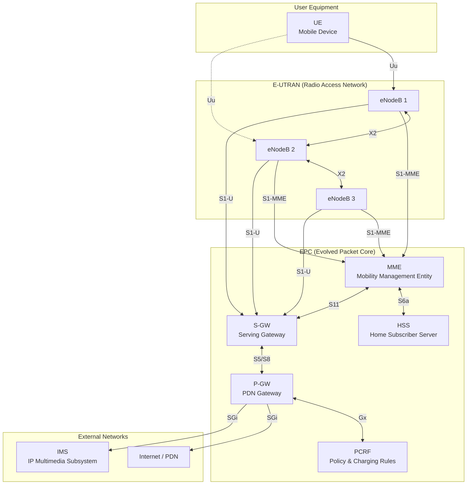
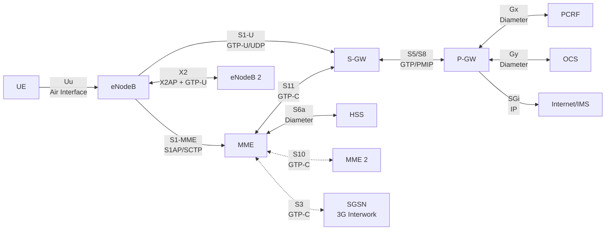
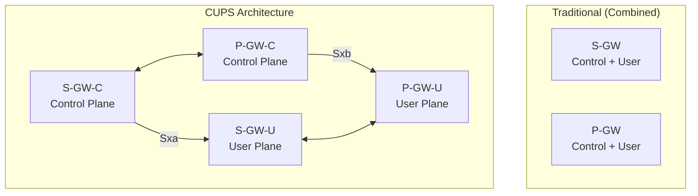
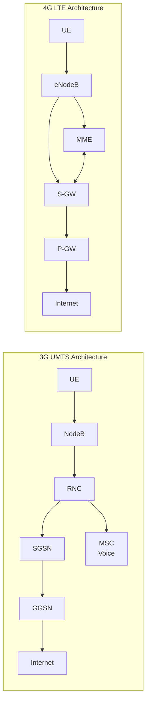
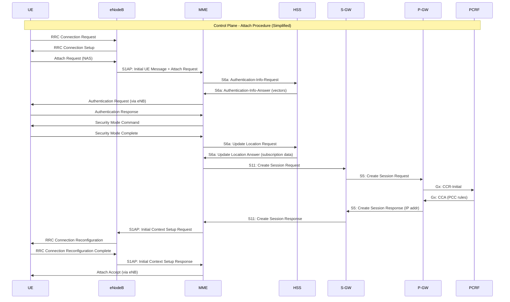
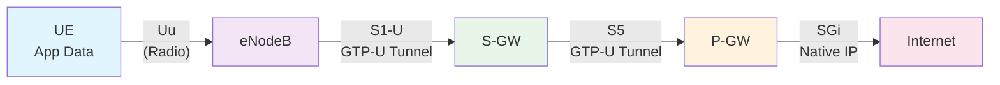

# Module 5: 4G LTE Architecture

## 5.1 Why LTE Was Developed

### Limitations of 3G (UMTS/HSPA)

The 3rd Generation Partnership Project (3GPP) initiated the Long Term Evolution (LTE) project in 2004 to address fundamental limitations in 3G networks:

**Architectural Complexity:**
- 3G UTRAN required a hierarchical structure: UE → NodeB → RNC → CN
- The Radio Network Controller (RNC) was a single point of failure and bottleneck
- Complex protocol stacks between NodeB and RNC (Iub interface) added processing overhead
- Soft handover required coordination between multiple NodeBs via the RNC

**Latency Issues:**
- 3G round-trip times (RTT): 50–100 ms typical, 150+ ms under load
- The RNC added processing hops in both control and user planes
- Circuit-switched voice added further complexity and delay
- Real-time applications (gaming, video calls) suffered noticeably

**Spectrum Efficiency:**
- WCDMA/HSPA approaching theoretical limits
- Demand for mobile data growing exponentially (smartphones era beginning)
- Need for flexible bandwidth: 1.4 MHz to 20 MHz channel widths

**All-IP Target:**
- 3G still maintained circuit-switched domain for voice (MSC, MGW)
- Dual-stack (CS + PS) increased OPEX and complexity
- Industry consensus: everything must converge to IP

**Performance Targets for LTE (3GPP Release 8):**
| Parameter | Target |
|-----------|--------|
| Peak DL rate | 100 Mbps (20 MHz) |
| Peak UL rate | 50 Mbps (20 MHz) |
| User plane latency | < 5 ms |
| Control plane latency | < 100 ms (idle→active) |
| Spectrum efficiency | 3–4x improvement over HSPA |
| Mobility | Up to 350 km/h |

---

## 5.2 LTE Design Principles

LTE was designed from scratch with these guiding principles:

### Flat Architecture
- **Eliminate the RNC** — distribute its functions to the eNodeB and core network
- Fewer network nodes = fewer hops = lower latency
- Each eNodeB connects directly to the core network (EPC)

### All-Packet (No Circuit Switching)
- **Pure packet-switched network** — no circuit-switched domain
- Voice handled via VoLTE (Voice over LTE) using IMS
- Single protocol stack simplifies operations

### No Soft Handover
- 3G soft handover required simultaneous connections to multiple NodeBs
- LTE uses **hard handover** only — simpler, more spectrum-efficient
- Handover is fast enough (~20–50 ms interruption) to be imperceptible

### Simplified Protocol Stack
- Fewer layers, cleaner separation of concerns
- User plane: PDCP → RLC → MAC → PHY
- Control plane: NAS (between UE and MME) + RRC (between UE and eNB)

### Shared Channel Access
- No dedicated channels — all resources shared dynamically
- Scheduler in eNodeB makes 1 ms TTI decisions
- Enables statistical multiplexing gains

### Self-Organizing Network (SON) Features
- Automatic neighbor relations (ANR)
- Self-configuration of new eNodeBs
- Self-optimization and self-healing capabilities

---

## 5.3 LTE Architecture Overview

LTE architecture consists of two main domains:

1. **E-UTRAN** (Evolved UTRAN) — the radio access network
2. **EPC** (Evolved Packet Core) — the core network



### E-UTRAN: The Radio Access Network

**Key insight: E-UTRAN consists of eNodeBs only — there is NO RNC!**

- The eNodeB handles ALL radio-related functions previously split between NodeB and RNC
- eNodeBs connect directly to the EPC via the S1 interface
- eNodeBs connect to each other via the X2 interface for handover and load balancing
- This is the "flat architecture" — one node type in the RAN

### EPC: The Evolved Packet Core

The EPC is a pure packet core with separated control and user planes:

| Element | Primary Role |
|---------|-------------|
| **MME** | Control plane — signaling, mobility, security |
| **S-GW** | User plane anchor within E-UTRAN |
| **P-GW** | User plane anchor to external networks |
| **HSS** | Subscriber database and authentication |
| **PCRF** | Policy and charging rules |


---

## 5.4 Network Elements — Detailed

### 5.4.1 UE (User Equipment)

**Purpose:** The mobile device that communicates over the LTE air interface.

**Components:**
- **ME (Mobile Equipment):** The physical device (phone, tablet, modem)
- **USIM (Universal Subscriber Identity Module):** Stores subscriber identity (IMSI), security keys (K), and authentication algorithms

**UE Categories (3GPP Release 8–12):**

| Category | Max DL (Mbps) | Max UL (Mbps) | DL MIMO | Notes |
|----------|--------------|--------------|---------|-------|
| Cat 1 | 10 | 5 | None | IoT, basic |
| Cat 2 | 51 | 25 | 2×2 | Entry smartphones |
| Cat 3 | 100 | 50 | 2×2 | Mainstream |
| Cat 4 | 150 | 50 | 2×2 | High-end |
| Cat 5 | 300 | 75 | 4×4 | Flagship |
| Cat 6 | 300 | 50 | 2×2 | Carrier Aggregation |
| Cat 9 | 450 | 50 | 2×2 | 3CC CA |
| Cat 12 | 600 | 100 | 4×4 | Advanced |
| Cat 16 | 980 | 150 | 4×4 | LTE-Advanced Pro |

**Key UE Capabilities:**
- Carrier Aggregation (CA): combine multiple component carriers
- MIMO support (2×2 or 4×4 antenna configurations)
- VoLTE support (IMS registration, SIP signaling)
- Dual connectivity (connect to two eNodeBs simultaneously — Release 12+)

---

### 5.4.2 eNodeB (Evolved NodeB)

**Purpose:** The single RAN node that handles ALL radio access functions — replaces both NodeB AND RNC from 3G.

**Problem it solves:** Eliminates the RNC bottleneck, reduces latency by one hop, enables faster scheduling decisions.

**Functions absorbed from 3G RNC:**
- Radio Resource Management (RRM) — scheduling, admission control
- Radio Bearer Control — setup, maintenance, release of bearers
- Connection Mobility Control — handover decisions
- Dynamic Resource Allocation (Scheduler) — 1 ms TTI granularity
- Inter-cell Interference Coordination (ICIC)
- Header compression (ROHC via PDCP)
- Encryption and integrity protection (PDCP layer)
- Segmentation and reassembly (RLC layer)

**Functions unique to eNodeB:**
- S1 interface termination (to MME and S-GW)
- X2 interface termination (to neighboring eNodeBs)
- Paging message distribution
- Broadcast information (SIBs)
- Measurement configuration and reporting

**Scheduler — The Brain of eNodeB:**
- Makes resource allocation decisions every 1 ms (TTI)
- Assigns Resource Blocks (RBs) to UEs based on:
  - Channel quality (CQI reports from UEs)
  - QoS requirements (GBR vs non-GBR bearers)
  - Fairness algorithms (Proportional Fair, Round Robin, Max Throughput)
  - Buffer status and priority

---

### 5.4.3 MME (Mobility Management Entity)

**Purpose:** The control plane anchor of the EPC — handles all signaling and control functions, touches NO user data.

**Problem it solves:** Separates control from user plane, enabling independent scaling. Centralizes mobility and security management.

**Key Functions:**

| Function | Description |
|----------|-------------|
| NAS Signaling | Manages Non-Access Stratum protocols (EMM, ESM) between UE and MME |
| Authentication | Generates authentication vectors with HSS (EPS-AKA) |
| Security | NAS encryption/integrity; derives keys for AS security |
| Mobility Management | Tracks UE location (Tracking Areas), handles TAU |
| Bearer Management | Establishes, modifies, releases EPS bearers |
| Paging | Initiates paging when downlink data arrives for idle UE |
| S-GW Selection | Selects appropriate Serving Gateway for UE |
| P-GW Selection | Selects PDN Gateway (during initial attach or new PDN connection) |
| Handover Control | Inter-eNB and inter-MME handover signaling |
| Idle Mode | Manages UE state transitions (connected ↔ idle) |

**NAS Procedures:**
- **Attach:** UE registers with the network (identity, authentication, bearer setup)
- **Detach:** UE deregisters (voluntary or network-initiated)
- **TAU (Tracking Area Update):** UE reports new location when crossing TA boundary
- **Service Request:** Idle UE requests to become active (for data transfer)

---

### 5.4.4 S-GW (Serving Gateway)

**Purpose:** The user plane anchor within the E-UTRAN — all user data passes through S-GW.

**Problem it solves:** Provides a stable user plane anchor point during intra-LTE mobility (handover between eNodeBs). Only one tunnel switch needed at S-GW during handover instead of rerouting through external networks.

**Key Functions:**
- **Local mobility anchor:** During inter-eNB handover, only the S1-U tunnel is switched at S-GW
- **Packet routing and forwarding:** Routes packets between eNB and P-GW
- **Data buffering during handover:** Buffers DL packets while handover completes
- **Downlink data notification:** Triggers paging via MME when DL data arrives for idle UE
- **Lawful intercept:** Interface for legal interception of user traffic
- **Charging data collection:** Usage data for offline charging (CDRs)
- **Transport level marking:** DSCP marking for QoS in transport network
- **Idle mode buffering:** Buffers first DL packet and notifies MME for paging

**Deployment Note:** In many networks, S-GW and P-GW are combined into a single node (SAE-GW) for simplicity.

---

### 5.4.5 P-GW (PDN Gateway)

**Purpose:** The point of connection to external packet data networks (Internet, IMS, enterprise VPNs). Allocates IP addresses and enforces policy.

**Problem it solves:** Provides a single, stable IP anchor point for the UE regardless of mobility. The UE keeps the same IP address even when moving between S-GWs.

**Key Functions:**
- **IP address allocation:** Assigns IPv4 and/or IPv6 addresses to UEs (via DHCPv4, SLAAC, or static)
- **Policy enforcement:** Applies QoS rules received from PCRF (via Gx interface)
- **Charging:** Online charging (Gy to OCS) and offline charging (Gz to OFCS)
- **Packet filtering:** Deep packet inspection, TFT (Traffic Flow Template) enforcement
- **Per-SDF (Service Data Flow) treatment:** Apply different QoS/charging per traffic flow
- **Inter-operator mobility anchor:** When roaming, P-GW remains in home network (home-routed) or visited network (local breakout)
- **NAT (if needed):** Network Address Translation for IPv4
- **GTP/PMIP anchor:** Terminates S5/S8 tunnel from S-GW

**APN (Access Point Name):**
- Each PDN connection is identified by an APN
- P-GW selection based on APN (e.g., "internet", "ims", "enterprise.vpn")
- Multiple simultaneous PDN connections possible (e.g., Internet + IMS for VoLTE)

---

### 5.4.6 HSS (Home Subscriber Server)

**Purpose:** The central database containing all subscriber information and security credentials. Evolution of 3G HLR/AuC.

**Problem it solves:** Centralizes subscriber management, provides authentication vectors, and stores subscription data (allowed APNs, QoS profiles, roaming permissions).

**Key Functions:**
- **Subscriber data storage:**
  - IMSI (permanent identity)
  - MSISDN (phone number)
  - Subscribed APNs and associated QoS profiles
  - Roaming restrictions
  - Subscribed Tracking Areas
- **Authentication vector generation:**
  - Stores permanent key K (shared with USIM)
  - Generates authentication vectors (RAND, AUTN, XRES, KASME) using EPS-AKA
  - Provides vectors to MME for UE authentication
- **Location management:**
  - Stores current serving MME for each subscriber
  - Used for terminating calls/sessions (where to page the UE)
- **Authorization:**
  - Determines which services a subscriber can access
  - Enforces subscription limits (max bitrate, allowed APNs)

**Interfaces:**
- S6a to MME (Diameter protocol)
- Cx/Dx to IMS (for VoLTE subscriber data)
- Sh to Application Servers

---

### 5.4.7 PCRF (Policy and Charging Rules Function)

**Purpose:** The policy brain of the network — makes real-time decisions about QoS and charging rules applied to each data flow.

**Problem it solves:** Enables dynamic, per-flow QoS (e.g., guarantee bandwidth for a VoLTE call while best-effort for web browsing). Enables flexible charging models (zero-rating, tiered plans, sponsored data).

**Key Functions:**
- **Policy decision:** Determines QoS parameters (QCI, ARP, MBR, GBR) for each service data flow
- **Charging rules:** Specifies how each flow is charged (rating group, metering method)
- **PCC (Policy and Charging Control) rules:** Combined policy + charging instructions sent to P-GW
- **Dynamic policy updates:** Can modify rules in real-time (e.g., when user starts a video call)
- **Subscription-based policy:** Considers user's subscription tier
- **Network-condition-based policy:** Can throttle based on congestion

**Example PCC Rule:**
```
Rule: "VoLTE_Voice"
  - Service Data Flow: SIP/RTP traffic to IMS
  - QCI: 1 (Conversational Voice)
  - GBR: 40 kbps UL / 40 kbps DL
  - ARP: Priority 1, pre-emption capable
  - Charging: Included in voice plan (no data deduction)
```

**Interfaces:**
- Gx to P-GW (installs/modifies PCC rules)
- Rx from IMS/AF (receives session info, triggers policy)
- Sp to SPR (Subscription Profile Repository)


---

## 5.5 LTE Interfaces — Reference Points

### Interface Map



---

### 5.5.1 S1-MME Interface

| Property | Value |
|----------|-------|
| **Endpoints** | eNodeB ↔ MME |
| **Plane** | Control Plane |
| **Protocol Stack** | S1AP / SCTP / IP |
| **Purpose** | All control signaling between RAN and core |

**What flows over S1-MME:**
- Initial UE messages (Attach, TAU, Service Request)
- UE context setup/release
- Handover preparation and execution (inter-eNB via MME)
- Paging requests from MME to eNB
- Bearer setup/modification/release commands
- NAS message transport (MME↔UE via eNB as relay)
- Reset and error indication procedures

**Why SCTP (not TCP):**
- Multi-homing: survives link failures without session drop
- Multi-streaming: avoids head-of-line blocking
- Message-oriented (not byte-stream): natural fit for signaling
- Built-in heartbeat for connection monitoring

---

### 5.5.2 S1-U Interface

| Property | Value |
|----------|-------|
| **Endpoints** | eNodeB ↔ S-GW |
| **Plane** | User Plane |
| **Protocol Stack** | GTP-U / UDP / IP |
| **Purpose** | Carries user IP packets in GTP tunnels |

**What flows over S1-U:**
- All user data (encapsulated in GTP-U tunnels)
- One GTP tunnel per EPS bearer per UE
- End marker packets during handover (signals last packet from old path)

**GTP-U Tunnel Identification:**
- Each tunnel identified by TEID (Tunnel Endpoint Identifier) + IP address
- TEIDs allocated independently at each end
- Enables multiplexing many UE bearers over single transport connection

**Why GTP-U (not plain IP):**
- Tunneling allows mobility transparency (IP address doesn't change)
- Per-bearer QoS enforcement
- Simple encapsulation: GTP-U header (8+ bytes) + inner IP packet

---

### 5.5.3 X2 Interface

| Property | Value |
|----------|-------|
| **Endpoints** | eNodeB ↔ eNodeB |
| **Plane** | Control + User Plane |
| **Protocol Stack** | X2AP/SCTP (control) + GTP-U/UDP (user) |
| **Purpose** | Direct inter-eNB handover and load management |

**Control Plane (X2AP) Functions:**
- Handover preparation (request, acknowledge, cancel)
- SN (Sequence Number) status transfer
- Load indication (exchange load information between eNBs)
- Resource status reporting
- Inter-cell interference coordination (ICIC) information exchange

**User Plane (GTP-U) Functions:**
- Forward DL data from source eNB to target eNB during handover
- Prevents data loss during handover gap
- Temporary tunnel — torn down after handover completes

**X2 Handover Advantage:**
- Direct eNB-to-eNB signaling — no need to involve MME for preparation
- Only MME notified after handover completes (path switch)
- Faster than S1-based handover (used when X2 is available)

---

### 5.5.4 S5/S8 Interface

| Property | Value |
|----------|-------|
| **Endpoints** | S-GW ↔ P-GW |
| **Plane** | User + Control Plane |
| **Protocol Stack** | GTP-C + GTP-U (or PMIP alternative) |
| **Purpose** | Connects serving gateway to PDN gateway |

**S5 vs S8:**
- **S5:** When S-GW and P-GW are in the **same** PLMN (non-roaming or home-routed)
- **S8:** When S-GW and P-GW are in **different** PLMNs (roaming scenario)
- Technically identical protocol, different name indicates inter-PLMN boundary

**Functions:**
- Tunnel management (create, update, delete sessions)
- Per-bearer GTP tunnels for user plane
- Triggered by MME (via S11) during attach or bearer modification
- GTP-C handles session/bearer management signaling
- GTP-U carries encapsulated user data

**Protocol Options:**
- **GTP-based S5/S8:** Full GTP-C signaling + GTP-U tunnels (most common)
- **PMIP-based S5/S8:** Proxy Mobile IPv6 signaling (rare in practice)

---

### 5.5.5 S6a Interface

| Property | Value |
|----------|-------|
| **Endpoints** | MME ↔ HSS |
| **Plane** | Control Plane |
| **Protocol Stack** | Diameter / SCTP (or TCP) / IP |
| **Purpose** | Subscriber authentication and data retrieval |

**Diameter Commands on S6a:**

| Command | Direction | Purpose |
|---------|-----------|---------|
| Authentication-Information-Request (AIR) | MME→HSS | Request auth vectors |
| Authentication-Information-Answer (AIA) | HSS→MME | Return auth vectors (RAND, AUTN, XRES, KASME) |
| Update-Location-Request (ULR) | MME→HSS | Register MME as serving node |
| Update-Location-Answer (ULA) | HSS→MME | Return subscription data |
| Cancel-Location-Request (CLR) | HSS→MME | Deregister UE from old MME |
| Insert-Subscriber-Data-Request (IDR) | HSS→MME | Push updated subscription data |
| Delete-Subscriber-Data-Request (DSR) | HSS→MME | Remove subscription data |
| Purge-UE-Request (PUR) | MME→HSS | Inform HSS that UE is unreachable |

**Why Diameter (not SS7/MAP):**
- IP-native (aligns with all-IP architecture)
- Extensible via AVPs (Attribute-Value Pairs)
- Better security (TLS/IPsec support)
- Larger message sizes (supports complex subscription data)

---

### 5.5.6 S11 Interface

| Property | Value |
|----------|-------|
| **Endpoints** | MME ↔ S-GW |
| **Plane** | Control Plane |
| **Protocol Stack** | GTP-C v2 / UDP / IP |
| **Purpose** | EPS bearer/session management between MME and S-GW |

**Key Messages:**
- **Create Session Request/Response:** During attach — establishes default bearer
- **Modify Bearer Request/Response:** During handover — updates S1-U tunnel info
- **Delete Session Request/Response:** During detach — tears down bearers
- **Create Bearer Request/Response:** MME-initiated dedicated bearer setup
- **Release Access Bearers:** When UE goes idle (release S1-U but keep S5/S8)
- **Downlink Data Notification:** S-GW tells MME that data arrived for idle UE → triggers paging

**Why GTP-C v2:**
- Already proven in GPRS/3G (GTP-C v1)
- Efficient binary encoding
- Built-in TEID-based message routing
- Supports piggybacking (multiple IEs in one message)

---

### 5.5.7 SGi Interface

| Property | Value |
|----------|-------|
| **Endpoints** | P-GW ↔ External Networks (Internet, IMS, Enterprise) |
| **Plane** | User Plane |
| **Protocol Stack** | IP (standard Internet protocols) |
| **Purpose** | Connects LTE network to the outside world |

**Characteristics:**
- Equivalent to the Gi interface in 2G/3G GPRS
- Standard IP interface — no GTP or mobile-specific protocols
- P-GW performs NAT here (if needed) or routes native IPv6
- This is where the UE's IP address is "visible" to the internet
- Firewall, DPI, and value-added services typically deployed here

**Connected Networks:**
- Public Internet
- IMS core (for VoLTE, VoWiFi)
- Enterprise VPNs (via APN-based routing)
- Content Delivery Networks (CDNs)
- Walled garden services

---

### 5.5.8 Gx Interface

| Property | Value |
|----------|-------|
| **Endpoints** | PCRF ↔ P-GW |
| **Plane** | Control Plane |
| **Protocol Stack** | Diameter / SCTP or TCP / IP |
| **Purpose** | Install, modify, remove PCC (Policy and Charging Control) rules |

**How it works:**
1. P-GW contacts PCRF when a new IP-CAN session is established (UE attaches)
2. PCRF evaluates subscription data + network policy + application input
3. PCRF sends PCC rules to P-GW specifying per-flow QoS and charging
4. PCRF can push updated rules at any time (e.g., when VoLTE call starts)

**Diameter Commands:**
- **CC-Request/Answer (CCR/CCA):** P-GW reports events, PCRF responds with rules
- **Re-Auth-Request/Answer (RAR/RAA):** PCRF pushes new rules to P-GW

**PCC Rule Contents:**
- Service Data Flow (SDF) filter (5-tuple: src/dst IP, ports, protocol)
- QoS parameters (QCI, ARP, MBR, GBR)
- Charging key (rating group)
- Metering method (volume, time, event)
- Gate status (open/close a flow)

---

### 5.5.9 Gy Interface

| Property | Value |
|----------|-------|
| **Endpoints** | P-GW ↔ OCS (Online Charging System) |
| **Plane** | Control Plane (charging signaling) |
| **Protocol Stack** | Diameter / SCTP or TCP / IP |
| **Purpose** | Real-time credit control for prepaid/online charging |

**How it works:**
1. When a prepaid user starts a data session, P-GW requests quota from OCS
2. OCS grants units (bytes, seconds, or events)
3. P-GW meters usage against granted quota
4. When quota runs low, P-GW requests more (or session is terminated)
5. Enables real-time balance deduction and spend limits

**Diameter Commands:**
- **Credit-Control-Request (CCR):** P-GW requests/reports usage
  - INITIAL: Session start, request first quota
  - UPDATE: Quota running low, request more
  - TERMINATION: Session end, report final usage
- **Credit-Control-Answer (CCA):** OCS grants quota or denies

**Use Cases:**
- Prepaid data plans with real-time balance
- Fair usage policies (throttle after threshold)
- Sponsored data (third party pays)
- Zero-rating specific applications


---

## 5.6 IMS Overview (IP Multimedia Subsystem)

### Why VoLTE Needs IMS

LTE is a **pure packet network** — there is no circuit-switched domain for voice. Without IMS:
- Voice calls would fall back to 2G/3G (CSFB — Circuit-Switched Fallback)
- CSFB adds 2–4 seconds call setup delay and drops LTE data temporarily
- No way to provide rich communication services (video calls, messaging)

**IMS provides the session control layer that makes VoLTE possible.**

### IMS Basic Architecture

```
UE → P-CSCF → I-CSCF → S-CSCF → Application Servers
                                  ↕
                                 HSS
```

**Key IMS Elements:**
| Element | Role |
|---------|------|
| **P-CSCF** (Proxy-CSCF) | First contact point; SIP proxy in visited network; provides security (IPsec) |
| **I-CSCF** (Interrogating-CSCF) | Entry point in home network; queries HSS for S-CSCF assignment |
| **S-CSCF** (Serving-CSCF) | Core SIP registrar and session controller; applies service logic |
| **Application Servers** | VoLTE TAS (Telephony AS), conference, messaging services |
| **MGCF/MGW** | Media Gateway — interworks with PSTN for legacy calls |

### VoLTE Call Flow (Simplified)

1. UE registers with IMS via SIP REGISTER (through P-CSCF → S-CSCF)
2. UE initiates call via SIP INVITE
3. IMS signals PCRF (via Rx interface) to request dedicated bearer
4. PCRF instructs P-GW (via Gx) to create GBR bearer (QCI=1 for voice)
5. MME/eNB establish dedicated bearer with guaranteed bitrate
6. RTP media flows over the dedicated bearer
7. Result: HD voice with guaranteed QoS, ~100 ms end-to-end

### IMS Integration with LTE

- P-CSCF discovered by UE during PDN connection to IMS APN
- UE maintains two PDN connections: Internet APN + IMS APN
- Rx interface: IMS → PCRF (triggers dedicated bearer for voice/video)
- VoLTE requires: UE support + IMS core + PCRF + dedicated bearers

---

## 5.7 Control Plane vs User Plane Separation (CUPS)

### The Concept

CUPS (3GPP Release 14, TS 23.214) separates the control and user plane functions of S-GW and P-GW into independent entities that can be scaled and deployed independently.



### Why CUPS Matters

| Aspect | Without CUPS | With CUPS |
|--------|-------------|-----------|
| Scaling | Scale entire gateway (wasteful) | Scale UP and CP independently |
| Deployment | GW in central DC only | UP at edge, CP centralized |
| Latency | All traffic through central GW | UP at edge = lower latency |
| Cost | Expensive combined HW | Cheaper, commodity UP hardware |
| Evolution | Monolithic | Direct path to 5G UPF architecture |

### CUPS Interface: Sx (PFCP)

- **Protocol:** PFCP (Packet Forwarding Control Protocol)
- **Sxa:** SGW-C ↔ SGW-U
- **Sxb:** PGW-C ↔ PGW-U
- **Sxc:** TDF-C ↔ TDF-U
- CP installs forwarding rules (PDRs, FARs, QERs, URRs) into UP
- UP executes packet forwarding based on installed rules

### CUPS as Bridge to 5G

CUPS is the architectural precursor to 5G's fully separated architecture:
- SGW-C + PGW-C → 5G SMF (Session Management Function)
- SGW-U + PGW-U → 5G UPF (User Plane Function)
- PFCP protocol reused in 5G (N4 interface = Sx evolution)

---

## 5.8 Key Differences from 3G

| Aspect | 3G UMTS/HSPA | 4G LTE |
|--------|-------------|--------|
| **RAN Architecture** | Hierarchical: NodeB → RNC | Flat: eNodeB only |
| **RAN Controller** | RNC (centralized) | None — functions in eNodeB |
| **Core Network** | CS domain + PS domain | EPC (PS only, all-IP) |
| **Voice** | Circuit-switched (MSC) | VoLTE via IMS (packet) |
| **Handover** | Soft handover (macro diversity) | Hard handover only |
| **Air Interface** | WCDMA / HSPA | OFDMA (DL) / SC-FDMA (UL) |
| **Channel Type** | Dedicated + shared | All shared (no dedicated channels) |
| **Scheduling** | 2 ms TTI (HSPA) | 1 ms TTI |
| **Bearer Concept** | RAB + PDP Context | EPS Bearer (unified) |
| **Max Bandwidth** | 5 MHz fixed | 1.4–20 MHz flexible |
| **Peak Rate** | 42 Mbps (HSPA+) | 300+ Mbps (Cat 5+) |
| **Latency (RTT)** | 50–100 ms | 10–20 ms |
| **Duplexing** | FDD only (most) | FDD + TDD |
| **Mobility Anchor** | SGSN (control+user) | MME (control) + S-GW (user) — separated |
| **Subscriber DB** | HLR (SS7/MAP) | HSS (Diameter) |
| **Policy Control** | Limited (PCRF later addition) | Native PCRF (PCC from day one) |

### Architecture Comparison Diagram



### Key Architectural Wins

1. **Elimination of RNC:**
   - Removed single point of failure
   - Reduced latency by one hop
   - Enabled distributed scheduling (faster response)
   - Simplified RAN planning and scaling

2. **All-IP / No Circuit Switching:**
   - Single protocol stack to manage
   - Reduced OPEX (no MSC, MGW, VLR infrastructure)
   - Statistical multiplexing for voice (VoLTE more efficient)
   - Unified charging and policy for all services

3. **EPS Bearer Model:**
   - Unified bearer from UE to P-GW (end-to-end QoS)
   - Replaces fragmented 3G model (RAB + PDP Context + separate QoS at each interface)
   - Default bearer always on (always connected experience)
   - Dedicated bearers for specific QoS needs (VoLTE, video)

4. **Separation of Control and User Planes:**
   - MME handles only signaling (scales with number of UEs)
   - S-GW handles only data (scales with traffic volume)
   - Independent evolution and scaling

---

## 5.9 Control Plane vs User Plane Paths

### Control Plane Path



### User Plane Path



**User Plane Protocol Stack:**
```
|  Application Data  |
|--------------------|
|        IP          |  ← UE's IP packet
|--------------------|
|       PDCP         |  ← Encryption, header compression (Uu)
|--------------------|
|        RLC         |  ← Segmentation, ARQ (Uu)
|--------------------|
|        MAC         |  ← Scheduling, HARQ (Uu)
|--------------------|
|        PHY         |  ← OFDMA/SC-FDMA (Uu)
|--------------------|
       [Air Interface]
|--------------------|
|    GTP-U Header    |  ← Tunnel encapsulation (S1-U, S5)
|--------------------|
|      UDP/IP        |  ← Transport network
|--------------------|
|      L2/L1         |  ← Physical transport (fiber, microwave)
|--------------------|
```

---

## 5.10 Interface Summary Table

| Interface | Endpoints | Plane | Protocol | Purpose |
|-----------|-----------|-------|----------|---------|
| **Uu** | UE ↔ eNodeB | Control + User | LTE-Uu (OFDMA/SC-FDMA) | Air interface — radio communication |
| **S1-MME** | eNodeB ↔ MME | Control | S1AP / SCTP | RAN-Core control signaling (NAS relay, handover, bearer mgmt) |
| **S1-U** | eNodeB ↔ S-GW | User | GTP-U / UDP / IP | User data tunneling between RAN and core |
| **X2** | eNodeB ↔ eNodeB | Control + User | X2AP/SCTP + GTP-U/UDP | Inter-eNB handover signaling and data forwarding |
| **S5/S8** | S-GW ↔ P-GW | Control + User | GTP-C + GTP-U (or PMIP) | Session/bearer management and user data between gateways |
| **S6a** | MME ↔ HSS | Control | Diameter / SCTP | Authentication vectors and subscriber data retrieval |
| **S11** | MME ↔ S-GW | Control | GTP-C v2 / UDP | Bearer/session lifecycle management |
| **SGi** | P-GW ↔ Internet/IMS | User | IP (native) | External PDN connectivity — UE traffic exits here |
| **Gx** | PCRF ↔ P-GW | Control | Diameter | Policy and charging rule installation/modification |
| **Gy** | P-GW ↔ OCS | Control | Diameter | Online/real-time credit control (prepaid charging) |
| **Rx** | IMS/AF ↔ PCRF | Control | Diameter | Application-triggered QoS/policy requests |
| **S10** | MME ↔ MME | Control | GTP-C v2 | Inter-MME handover (UE context transfer) |
| **S3** | MME ↔ SGSN | Control | GTP-C v2 | 3G/4G inter-RAT mobility |
| **SBc** | MME ↔ CBC | Control | SBc-AP / SCTP | Cell broadcast (emergency alerts, CMAS/ETWS) |

---

## 5.11 Key Takeaways

1. **LTE = Flat RAN + All-IP Core** — simplicity drives performance
2. **eNodeB is the only RAN node** — absorbed all RNC functions
3. **EPC separates control (MME) from user plane (S-GW/P-GW)** — independent scaling
4. **Every interface has a clear, single purpose** — modular, replaceable
5. **GTP tunnels provide mobility transparency** — IP address never changes regardless of movement
6. **PCRF enables dynamic QoS** — different treatment per application flow
7. **IMS replaces circuit-switched voice** — VoLTE = SIP + dedicated bearer
8. **CUPS is the bridge to 5G** — same separation philosophy, evolved into 5G SBA

---

## References

- 3GPP TS 23.401: "GPRS Enhancements for E-UTRAN Access" (EPC architecture)
- 3GPP TS 36.300: "E-UTRA and E-UTRAN; Overall Description" (RAN architecture)
- 3GPP TS 23.214: "Architecture Enhancements for CUPS"
- 3GPP TS 29.274: "GTPv2-C" (S11, S5/S8 control)
- 3GPP TS 29.281: "GTP-U" (S1-U, S5/S8 user)
- 3GPP TS 36.413: "S1AP" (S1-MME interface)
- 3GPP TS 36.423: "X2AP" (X2 interface)
- 3GPP TS 29.272: "S6a/S6d" (MME-HSS Diameter interface)
- 3GPP TS 29.212: "Gx" (PCRF-PCEF Diameter interface)

---

*Module 5 Complete — Next: Module 6: 5G NR Architecture*
