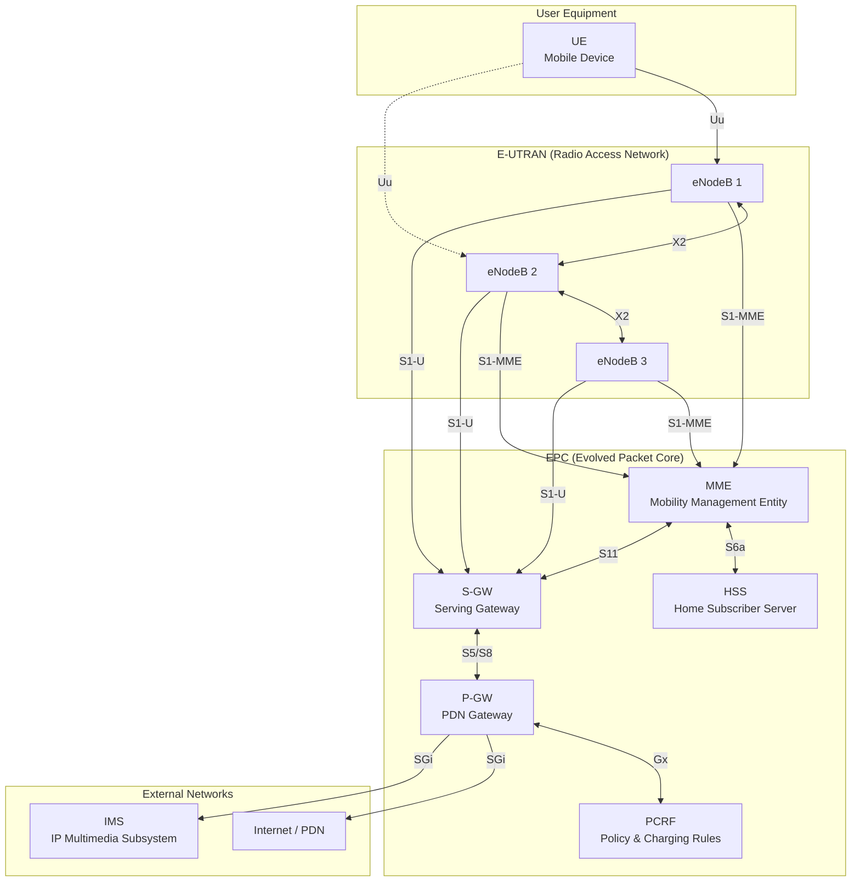
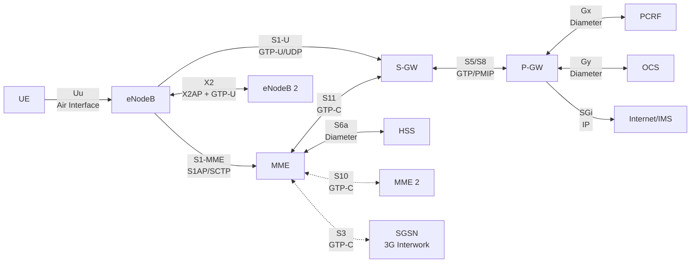
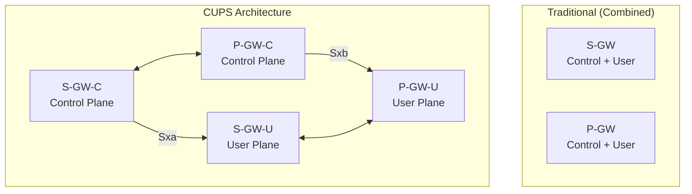
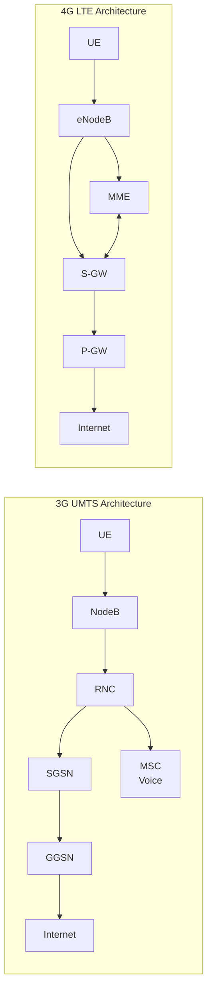
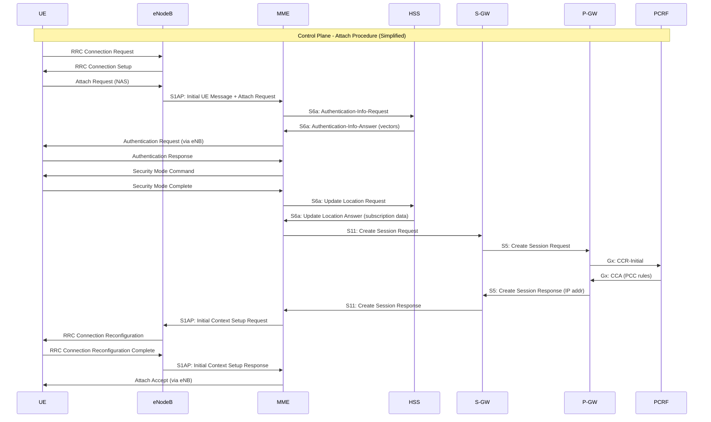
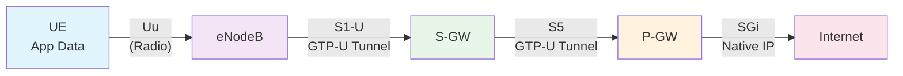

# ماژول 5: معماری 4G LTE

## 5.1 چرا LTE توسعه یافت

### محدودیت‌های 3G (UMTS/HSPA)

پروژه مشارکت نسل سوم (3GPP) پروژه تکامل بلندمدت (LTE) را در سال 2004 برای رفع محدودیت‌های بنیادی شبکه‌های 3G آغاز کرد:

**پیچیدگی معماری:**
- UTRAN در 3G نیازمند ساختار سلسله‌مراتبی بود: UE ← NodeB ← RNC ← CN
- کنترلر شبکه رادیویی (RNC) یک نقطه شکست واحد و گلوگاه بود
- پشته‌های پروتکل پیچیده بین NodeB و RNC (واسط Iub) سربار پردازشی اضافه می‌کرد
- تحویل نرم نیازمند هماهنگی بین چندین NodeB از طریق RNC بود

**مشکلات تأخیر:**
- زمان رفت-و-برگشت (RTT) در 3G: معمولاً 50–100 ms، تحت بار 150+ ms
- RNC در هر دو صفحه کنترل و کاربر گام‌های پردازشی اضافه می‌کرد
- صدای سوئیچینگ مداری پیچیدگی و تأخیر بیشتری اضافه می‌کرد
- کاربردهای بلادرنگ (بازی، تماس ویدیویی) به‌طور محسوس آسیب می‌دیدند

**کارایی طیفی:**
- WCDMA/HSPA به محدودیت‌های نظری نزدیک می‌شد
- تقاضا برای داده موبایل به‌صورت نمایی رشد می‌کرد (آغاز عصر گوشی‌های هوشمند)
- نیاز به پهنای باند انعطاف‌پذیر: عرض کانال 1.4 MHz تا 20 MHz

**هدف تمام-IP:**
- 3G همچنان دامنه سوئیچینگ مداری را برای صدا (MSC، MGW) حفظ می‌کرد
- پشته دوگانه (CS + PS) OPEX و پیچیدگی را افزایش می‌داد
- اجماع صنعت: همه چیز باید به IP همگرا شود

**اهداف عملکردی برای LTE (نسخه 8 گروه 3GPP):**
| پارامتر | هدف |
|-----------|--------|
| حداکثر نرخ DL | 100 Mbps (20 MHz) |
| حداکثر نرخ UL | 50 Mbps (20 MHz) |
| تأخیر صفحه کاربر | کمتر از 5 ms |
| تأخیر صفحه کنترل | کمتر از 100 ms (بیکار←فعال) |
| کارایی طیفی | بهبود 3–4 برابر نسبت به HSPA |
| تحرک | تا 350 km/h |

---

## 5.2 اصول طراحی LTE

LTE از ابتدا با این اصول راهنما طراحی شد:

### معماری مسطح
- **حذف RNC** — توزیع عملکردهای آن به eNodeB و شبکه هسته
- گره‌های شبکه کمتر = گام‌های کمتر = تأخیر کمتر
- هر eNodeB به‌طور مستقیم به شبکه هسته (EPC) متصل می‌شود

### تمام-بسته (بدون سوئیچینگ مداری)
- **شبکه کاملاً سوئیچینگ بسته‌ای** — بدون دامنه سوئیچینگ مداری
- صدا از طریق VoLTE (صدای LTE) با استفاده از IMS مدیریت می‌شود
- پشته پروتکل واحد عملیات را ساده می‌کند

### بدون تحویل نرم
- تحویل نرم در 3G نیازمند اتصالات همزمان به چندین NodeB بود
- LTE فقط از **تحویل سخت** استفاده می‌کند — ساده‌تر، کارآمدتر از نظر طیف
- تحویل به‌اندازه کافی سریع است (وقفه حدود 20–50 ms) که نامحسوس باشد

### پشته پروتکل ساده‌شده
- لایه‌های کمتر، جداسازی تمیزتر دغدغه‌ها
- صفحه کاربر: PDCP ← RLC ← MAC ← PHY
- صفحه کنترل: NAS (بین UE و MME) + RRC (بین UE و eNB)

### دسترسی کانال مشترک
- بدون کانال‌های اختصاصی — تمام منابع به‌صورت پویا به اشتراک گذاشته می‌شوند
- زمان‌بند در eNodeB تصمیمات TTI 1 ms می‌گیرد
- بهره‌های مالتی‌پلکسینگ آماری را ممکن می‌سازد

### ویژگی‌های شبکه خود-سازمان‌ده (SON)
- روابط همسایگی خودکار (ANR)
- خود-پیکربندی eNodeBهای جدید
- قابلیت‌های خود-بهینه‌سازی و خود-ترمیم

---

## 5.3 مرور معماری LTE

معماری LTE از دو دامنه اصلی تشکیل شده است:

1. **E-UTRAN** (UTRAN تکامل‌یافته) — شبکه دسترسی رادیویی
2. **EPC** (هسته بسته تکامل‌یافته) — شبکه هسته



### E-UTRAN: شبکه دسترسی رادیویی

**نکته کلیدی: E-UTRAN فقط از eNodeBها تشکیل شده است — هیچ RNC وجود ندارد!**

- eNodeB تمام عملکردهای مرتبط با رادیو را که قبلاً بین NodeB و RNC تقسیم شده بود مدیریت می‌کند
- eNodeBها به‌طور مستقیم از طریق واسط S1 به EPC متصل می‌شوند
- eNodeBها برای تحویل و توازن بار از طریق واسط X2 به یکدیگر متصل می‌شوند
- این همان «معماری مسطح» است — یک نوع گره در RAN

### EPC: هسته بسته تکامل‌یافته

EPC یک هسته بسته خالص با صفحات کنترل و کاربر جداگانه است:

| عنصر | نقش اصلی |
|---------|-------------|
| **MME** | صفحه کنترل — سیگنالینگ، تحرک، امنیت |
| **S-GW** | لنگر صفحه کاربر درون E-UTRAN |
| **P-GW** | لنگر صفحه کاربر به شبکه‌های خارجی |
| **HSS** | پایگاه داده مشترک و احراز هویت |
| **PCRF** | سیاست و قواعد صورت‌حساب |


---

## 5.4 عناصر شبکه — تفصیلی

### 5.4.1 UE (تجهیزات کاربر)

**هدف:** دستگاه موبایلی که از طریق واسط رادیویی LTE ارتباط برقرار می‌کند.

**اجزا:**
- **ME (تجهیزات موبایل):** دستگاه فیزیکی (گوشی، تبلت، مودم)
- **USIM (ماژول هویت مشترک جهانی):** هویت مشترک (IMSI)، کلیدهای امنیتی (K) و الگوریتم‌های احراز هویت را ذخیره می‌کند

**دسته‌های UE (نسخه 8–12 گروه 3GPP):**

| دسته | حداکثر DL (Mbps) | حداکثر UL (Mbps) | MIMO DL | یادداشت |
|----------|--------------|--------------|---------|-------|
| Cat 1 | 10 | 5 | ندارد | IoT، پایه |
| Cat 2 | 51 | 25 | 2×2 | گوشی‌های هوشمند ورودی |
| Cat 3 | 100 | 50 | 2×2 | جریان اصلی |
| Cat 4 | 150 | 50 | 2×2 | رده بالا |
| Cat 5 | 300 | 75 | 4×4 | پرچم‌دار |
| Cat 6 | 300 | 50 | 2×2 | تجمیع حامل |
| Cat 9 | 450 | 50 | 2×2 | 3CC CA |
| Cat 12 | 600 | 100 | 4×4 | پیشرفته |
| Cat 16 | 980 | 150 | 4×4 | LTE-Advanced Pro |

**قابلیت‌های کلیدی UE:**
- تجمیع حامل (CA): ترکیب چندین حامل مؤلفه
- پشتیبانی MIMO (پیکربندی‌های آنتن 2×2 یا 4×4)
- پشتیبانی VoLTE (ثبت‌نام IMS، سیگنالینگ SIP)
- اتصال دوگانه (اتصال همزمان به دو eNodeB — نسخه 12+)

---

### 5.4.2 eNodeB (NodeB تکامل‌یافته)

**هدف:** گره واحد RAN که تمام توابع دسترسی رادیویی را مدیریت می‌کند — جایگزین هر دو NodeB و RNC از 3G.

**مشکلی که حل می‌کند:** گلوگاه RNC را حذف می‌کند، تأخیر را با یک گام کاهش می‌دهد، تصمیمات زمان‌بندی سریع‌تر را ممکن می‌سازد.

**توابع جذب‌شده از RNC در 3G:**
- مدیریت منابع رادیویی (RRM) — زمان‌بندی، کنترل پذیرش
- کنترل حامل رادیویی — برقراری، نگهداری، آزادسازی حامل‌ها
- کنترل تحرک اتصال — تصمیمات تحویل
- تخصیص پویا منابع (زمان‌بند) — دانه‌بندی TTI 1 ms
- هماهنگی تداخل بین-سلولی (ICIC)
- فشرده‌سازی سرآیند (ROHC از طریق PDCP)
- رمزنگاری و حفاظت یکپارچگی (لایه PDCP)
- قطعه‌بندی و بازمونتاژ (لایه RLC)

**توابع منحصر به eNodeB:**
- پایان‌دهی واسط S1 (به MME و S-GW)
- پایان‌دهی واسط X2 (به eNodeBهای همسایه)
- توزیع پیام صفحه‌بندی
- اطلاعات پخش (SIBها)
- پیکربندی و گزارش‌دهی اندازه‌گیری

**زمان‌بند — مغز eNodeB:**
- هر 1 ms (TTI) تصمیمات تخصیص منابع می‌گیرد
- بلوک‌های منبع (RB) را به UEها بر اساس موارد زیر تخصیص می‌دهد:
  - کیفیت کانال (گزارش‌های CQI از UEها)
  - نیازمندی‌های QoS (حامل‌های GBR در برابر غیر-GBR)
  - الگوریتم‌های انصاف (Proportional Fair، Round Robin، Max Throughput)
  - وضعیت بافر و اولویت

---

### 5.4.3 MME (موجودیت مدیریت تحرک)

**هدف:** لنگر صفحه کنترل در EPC — تمام عملکردهای سیگنالینگ و کنترل را مدیریت می‌کند و به هیچ داده کاربری دست نمی‌زند.

**مشکلی که حل می‌کند:** کنترل را از صفحه کاربر جدا می‌کند و مقیاس‌پذیری مستقل را ممکن می‌سازد. مدیریت تحرک و امنیت را متمرکز می‌کند.

**توابع کلیدی:**

| عملکرد | توضیح |
|----------|-------------|
| سیگنالینگ NAS | پروتکل‌های لایه غیر-دسترسی (EMM، ESM) بین UE و MME را مدیریت می‌کند |
| احراز هویت | بردارهای احراز هویت را با HSS تولید می‌کند (EPS-AKA) |
| امنیت | رمزنگاری/یکپارچگی NAS؛ کلیدها را برای امنیت AS مشتق می‌کند |
| مدیریت تحرک | مکان UE را ردیابی می‌کند (نواحی ردیابی)، TAU را مدیریت می‌کند |
| مدیریت حامل | حامل‌های EPS را برقرار، اصلاح و آزاد می‌کند |
| صفحه‌بندی | هنگام رسیدن داده پیوند پایین‌سو برای UE بیکار، صفحه‌بندی را آغاز می‌کند |
| انتخاب S-GW | دروازه خدمات‌دهنده مناسب را برای UE انتخاب می‌کند |
| انتخاب P-GW | دروازه PDN را انتخاب می‌کند (در حین اتصال اولیه یا اتصال PDN جدید) |
| کنترل تحویل | سیگنالینگ تحویل بین-eNB و بین-MME |
| حالت بیکار | گذارهای حالت UE را مدیریت می‌کند (متصل ↔ بیکار) |

**رویه‌های NAS:**
- **Attach:** UE با شبکه ثبت‌نام می‌کند (هویت، احراز هویت، برقراری حامل)
- **Detach:** UE لغو ثبت‌نام می‌کند (اختیاری یا با شروع شبکه)
- **TAU (به‌روزرسانی ناحیه ردیابی):** UE هنگام عبور از مرز TA مکان جدید را گزارش می‌دهد
- **Service Request:** UE بیکار درخواست فعال‌شدن می‌کند (برای انتقال داده)

---

### 5.4.4 S-GW (دروازه خدمات‌دهنده)

**هدف:** لنگر صفحه کاربر درون E-UTRAN — تمام داده کاربر از S-GW عبور می‌کند.

**مشکلی که حل می‌کند:** یک نقطه لنگر صفحه کاربر پایدار در حین تحرک درون-LTE (تحویل بین eNodeBها) فراهم می‌کند. در حین تحویل فقط یک تغییر تونل در S-GW لازم است به‌جای مسیریابی مجدد از طریق شبکه‌های خارجی.

**توابع کلیدی:**
- **لنگر تحرک محلی:** در حین تحویل بین-eNB، فقط تونل S1-U در S-GW تغییر می‌کند
- **مسیریابی و ارسال بسته:** بسته‌ها را بین eNB و P-GW مسیریابی می‌کند
- **بافرینگ داده در حین تحویل:** بسته‌های DL را تا تکمیل تحویل بافر می‌کند
- **اعلان داده پیوند پایین‌سو:** هنگام رسیدن داده DL برای UE بیکار، صفحه‌بندی را از طریق MME فعال می‌کند
- **رهگیری قانونی:** واسط برای رهگیری قانونی ترافیک کاربر
- **جمع‌آوری داده صورت‌حساب:** داده مصرف برای صورت‌حساب آفلاین (CDRها)
- **علامت‌گذاری سطح انتقال:** علامت‌گذاری DSCP برای QoS در شبکه انتقال
- **بافرینگ حالت بیکار:** اولین بسته DL را بافر می‌کند و MME را برای صفحه‌بندی مطلع می‌کند

**یادداشت استقرار:** در بسیاری از شبکه‌ها، S-GW و P-GW برای سادگی در یک گره واحد (SAE-GW) ترکیب می‌شوند.

---

### 5.4.5 P-GW (دروازه PDN)

**هدف:** نقطه اتصال به شبکه‌های داده بسته‌ای خارجی (اینترنت، IMS، VPNهای سازمانی). آدرس‌های IP را تخصیص می‌دهد و سیاست را اجرا می‌کند.

**مشکلی که حل می‌کند:** یک نقطه لنگر IP واحد و پایدار برای UE بدون توجه به تحرک فراهم می‌کند. UE حتی هنگام جابه‌جایی بین S-GWها همان آدرس IP را حفظ می‌کند.

**توابع کلیدی:**
- **تخصیص آدرس IP:** آدرس‌های IPv4 و/یا IPv6 را به UEها تخصیص می‌دهد (از طریق DHCPv4، SLAAC یا ایستا)
- **اجرای سیاست:** قواعد QoS دریافتی از PCRF را اعمال می‌کند (از طریق واسط Gx)
- **صورت‌حساب:** صورت‌حساب آنلاین (Gy به OCS) و آفلاین (Gz به OFCS)
- **فیلترکردن بسته:** بازرسی عمیق بسته، اجرای TFT (قالب جریان ترافیک)
- **رفتار در هر SDF (جریان داده خدمات):** اعمال QoS/صورت‌حساب متفاوت در هر جریان ترافیک
- **لنگر تحرک بین-اپراتوری:** در حین رومینگ، P-GW در شبکه خانگی (مسیریابی خانگی) یا شبکه بازدیدشده (خروجی محلی) باقی می‌ماند
- **NAT (در صورت نیاز):** ترجمه آدرس شبکه برای IPv4
- **لنگر GTP/PMIP:** تونل S5/S8 از S-GW را پایان می‌دهد

**APN (نام نقطه دسترسی):**
- هر اتصال PDN با یک APN شناسایی می‌شود
- انتخاب P-GW بر اساس APN (مثلاً «internet»، «ims»، «enterprise.vpn»)
- چندین اتصال PDN همزمان ممکن است (مثلاً اینترنت + IMS برای VoLTE)

---

### 5.4.6 HSS (سرور مشترک خانگی)

**هدف:** پایگاه داده مرکزی شامل تمام اطلاعات مشترک و اعتبارنامه‌های امنیتی. تحول HLR/AuC در 3G.

**مشکلی که حل می‌کند:** مدیریت مشترک را متمرکز می‌کند، بردارهای احراز هویت را فراهم می‌کند و داده اشتراک را ذخیره می‌کند (APNهای مجاز، پروفایل‌های QoS، مجوزهای رومینگ).

**توابع کلیدی:**
- **ذخیره داده مشترک:**
  - IMSI (هویت دائمی)
  - MSISDN (شماره تلفن)
  - APNهای مشترک‌شده و پروفایل‌های QoS مرتبط
  - محدودیت‌های رومینگ
  - نواحی ردیابی مشترک‌شده
- **تولید بردار احراز هویت:**
  - کلید دائمی K را ذخیره می‌کند (مشترک با USIM)
  - بردارهای احراز هویت (RAND، AUTN، XRES، KASME) را با EPS-AKA تولید می‌کند
  - بردارها را به MME برای احراز هویت UE فراهم می‌کند
- **مدیریت مکان:**
  - MME خدمات‌دهنده فعلی را برای هر مشترک ذخیره می‌کند
  - برای تماس‌ها/نشست‌های پایانه‌ای استفاده می‌شود (کجا UE را صفحه‌بندی کنیم)
- **مجوزدهی:**
  - تعیین می‌کند مشترک به کدام خدمات می‌تواند دسترسی یابد
  - محدودیت‌های اشتراک را اجرا می‌کند (حداکثر نرخ بیت، APNهای مجاز)

**واسط‌ها:**
- S6a به MME (پروتکل Diameter)
- Cx/Dx به IMS (برای داده مشترک VoLTE)
- Sh به سرورهای کاربردی

---

### 5.4.7 PCRF (تابع قواعد سیاست و صورت‌حساب)

**هدف:** مغز سیاست شبکه — تصمیمات بلادرنگ درباره QoS و قواعد صورت‌حساب اعمال‌شده بر هر جریان داده می‌گیرد.

**مشکلی که حل می‌کند:** QoS پویا در هر جریان را ممکن می‌سازد (مثلاً تضمین پهنای باند برای تماس VoLTE در حالی که وب‌گردی بهترین تلاش است). مدل‌های صورت‌حساب انعطاف‌پذیر را ممکن می‌سازد (تعرفه صفر، طرح‌های لایه‌ای، داده حمایت‌شده).

**توابع کلیدی:**
- **تصمیم سیاست:** پارامترهای QoS (QCI، ARP، MBR، GBR) را برای هر جریان داده خدمات تعیین می‌کند
- **قواعد صورت‌حساب:** نحوه صورت‌حساب هر جریان را مشخص می‌کند (گروه نرخ‌گذاری، روش اندازه‌گیری)
- **قواعد PCC (کنترل سیاست و صورت‌حساب):** دستورالعمل‌های سیاست + صورت‌حساب ترکیب‌شده که به P-GW ارسال می‌شود
- **به‌روزرسانی پویا سیاست:** می‌تواند قواعد را به‌صورت بلادرنگ اصلاح کند (مثلاً وقتی کاربر تماس ویدیویی را شروع می‌کند)
- **سیاست مبتنی بر اشتراک:** لایه اشتراک کاربر را در نظر می‌گیرد
- **سیاست مبتنی بر شرایط شبکه:** می‌تواند بر اساس ازدحام محدودسازی کند

**مثال قاعده PCC:**
```
Rule: "VoLTE_Voice"
  - Service Data Flow: SIP/RTP traffic to IMS
  - QCI: 1 (Conversational Voice)
  - GBR: 40 kbps UL / 40 kbps DL
  - ARP: Priority 1, pre-emption capable
  - Charging: Included in voice plan (no data deduction)
```

**واسط‌ها:**
- Gx به P-GW (قواعد PCC را نصب/اصلاح می‌کند)
- Rx از IMS/AF (اطلاعات نشست را دریافت می‌کند، سیاست را فعال می‌کند)
- Sp به SPR (مخزن پروفایل اشتراک)


---

## 5.5 واسط‌های LTE — نقاط مرجع

### نقشه واسط‌ها



---

### 5.5.1 واسط S1-MME

| ویژگی | مقدار |
|----------|-------|
| **نقاط انتهایی** | eNodeB ↔ MME |
| **صفحه** | صفحه کنترل |
| **پشته پروتکل** | S1AP / SCTP / IP |
| **هدف** | تمام سیگنالینگ کنترل بین RAN و هسته |

**چه چیزی از S1-MME عبور می‌کند:**
- پیام‌های اولیه UE (Attach، TAU، Service Request)
- برقراری/آزادسازی زمینه UE
- آماده‌سازی و اجرای تحویل (بین-eNB از طریق MME)
- درخواست‌های صفحه‌بندی از MME به eNB
- فرمان‌های برقراری/اصلاح/آزادسازی حامل
- انتقال پیام NAS (MME↔UE از طریق eNB به‌عنوان رله)
- رویه‌های بازنشانی و نشانه خطا

**چرا SCTP (نه TCP):**
- چند-میزبانی: در برابر شکست لینک بدون قطع نشست مقاوم است
- چند-جریانی: از مسدودسازی سر-خط جلوگیری می‌کند
- پیام-گرا (نه جریان بایتی): تناسب طبیعی برای سیگنالینگ
- ضربان داخلی برای پایش اتصال

---

### 5.5.2 واسط S1-U

| ویژگی | مقدار |
|----------|-------|
| **نقاط انتهایی** | eNodeB ↔ S-GW |
| **صفحه** | صفحه کاربر |
| **پشته پروتکل** | GTP-U / UDP / IP |
| **هدف** | حمل بسته‌های IP کاربر در تونل‌های GTP |

**چه چیزی از S1-U عبور می‌کند:**
- تمام داده کاربر (کپسوله‌شده در تونل‌های GTP-U)
- یک تونل GTP به‌ازای هر حامل EPS برای هر UE
- بسته‌های نشانگر پایان در حین تحویل (آخرین بسته از مسیر قدیمی را علامت می‌دهد)

**شناسایی تونل GTP-U:**
- هر تونل با TEID (شناسه نقطه انتهایی تونل) + آدرس IP شناسایی می‌شود
- TEIDها در هر انتها به‌صورت مستقل تخصیص می‌یابند
- چندگانه‌سازی بسیاری از حامل‌های UE روی یک اتصال انتقال واحد را ممکن می‌سازد

**چرا GTP-U (نه IP ساده):**
- تونل‌سازی شفافیت تحرک را ممکن می‌سازد (آدرس IP تغییر نمی‌کند)
- اجرای QoS در هر حامل
- کپسوله‌سازی ساده: سرآیند GTP-U (8+ بایت) + بسته IP داخلی

---

### 5.5.3 واسط X2

| ویژگی | مقدار |
|----------|-------|
| **نقاط انتهایی** | eNodeB ↔ eNodeB |
| **صفحه** | کنترل + صفحه کاربر |
| **پشته پروتکل** | X2AP/SCTP (کنترل) + GTP-U/UDP (کاربر) |
| **هدف** | تحویل مستقیم بین-eNB و مدیریت بار |

**توابع صفحه کنترل (X2AP):**
- آماده‌سازی تحویل (درخواست، تأیید، لغو)
- انتقال وضعیت SN (شماره ترتیب)
- نشانه بار (تبادل اطلاعات بار بین eNBها)
- گزارش‌دهی وضعیت منابع
- تبادل اطلاعات هماهنگی تداخل بین-سلولی (ICIC)

**توابع صفحه کاربر (GTP-U):**
- ارسال داده DL از eNB مبدأ به eNB مقصد در حین تحویل
- از دست رفتن داده در شکاف تحویل را جلوگیری می‌کند
- تونل موقت — پس از تکمیل تحویل تخریب می‌شود

**مزیت تحویل X2:**
- سیگنالینگ مستقیم eNB-به-eNB — بدون نیاز به دخالت MME برای آماده‌سازی
- MME فقط پس از تکمیل تحویل مطلع می‌شود (تغییر مسیر)
- سریع‌تر از تحویل مبتنی بر S1 (هنگام در دسترس بودن X2 استفاده می‌شود)

---

### 5.5.4 واسط S5/S8

| ویژگی | مقدار |
|----------|-------|
| **نقاط انتهایی** | S-GW ↔ P-GW |
| **صفحه** | صفحه کاربر + کنترل |
| **پشته پروتکل** | GTP-C + GTP-U (یا جایگزین PMIP) |
| **هدف** | اتصال دروازه خدمات‌دهنده به دروازه PDN |

**S5 در برابر S8:**
- **S5:** وقتی S-GW و P-GW در **همان** PLMN هستند (غیر-رومینگ یا مسیریابی خانگی)
- **S8:** وقتی S-GW و P-GW در PLMNهای **متفاوت** هستند (سناریوی رومینگ)
- از نظر فنی پروتکل یکسان، نام متفاوت نشان‌دهنده مرز بین-PLMN است

**توابع:**
- مدیریت تونل (ایجاد، به‌روزرسانی، حذف نشست‌ها)
- تونل‌های GTP در هر حامل برای صفحه کاربر
- توسط MME (از طریق S11) در حین اتصال یا اصلاح حامل فعال می‌شود
- GTP-C سیگنالینگ مدیریت نشست/حامل را مدیریت می‌کند
- GTP-U داده کاربر کپسوله‌شده را حمل می‌کند

**گزینه‌های پروتکل:**
- **S5/S8 مبتنی بر GTP:** سیگنالینگ کامل GTP-C + تونل‌های GTP-U (رایج‌ترین)
- **S5/S8 مبتنی بر PMIP:** سیگنالینگ Proxy Mobile IPv6 (نادر در عمل)

---

### 5.5.5 واسط S6a

| ویژگی | مقدار |
|----------|-------|
| **نقاط انتهایی** | MME ↔ HSS |
| **صفحه** | صفحه کنترل |
| **پشته پروتکل** | Diameter / SCTP (یا TCP) / IP |
| **هدف** | احراز هویت مشترک و بازیابی داده |

**فرمان‌های Diameter روی S6a:**

| فرمان | جهت | هدف |
|---------|-----------|---------|
| Authentication-Information-Request (AIR) | MME←HSS | درخواست بردارهای احراز هویت |
| Authentication-Information-Answer (AIA) | HSS←MME | بازگرداندن بردارهای احراز هویت (RAND، AUTN، XRES، KASME) |
| Update-Location-Request (ULR) | MME←HSS | ثبت MME به‌عنوان گره خدمات‌دهنده |
| Update-Location-Answer (ULA) | HSS←MME | بازگرداندن داده اشتراک |
| Cancel-Location-Request (CLR) | HSS←MME | لغو ثبت UE از MME قدیمی |
| Insert-Subscriber-Data-Request (IDR) | HSS←MME | ارسال داده اشتراک به‌روزشده |
| Delete-Subscriber-Data-Request (DSR) | HSS←MME | حذف داده اشتراک |
| Purge-UE-Request (PUR) | MME←HSS | اطلاع به HSS که UE قابل دسترسی نیست |

**چرا Diameter (نه SS7/MAP):**
- بومی-IP (هم‌راستا با معماری تمام-IP)
- قابل توسعه از طریق AVPها (جفت‌های صفت-مقدار)
- امنیت بهتر (پشتیبانی TLS/IPsec)
- اندازه پیام بزرگ‌تر (پشتیبانی از داده اشتراک پیچیده)

---

### 5.5.6 واسط S11

| ویژگی | مقدار |
|----------|-------|
| **نقاط انتهایی** | MME ↔ S-GW |
| **صفحه** | صفحه کنترل |
| **پشته پروتکل** | GTP-C v2 / UDP / IP |
| **هدف** | مدیریت حامل/نشست EPS بین MME و S-GW |

**پیام‌های کلیدی:**
- **Create Session Request/Response:** در حین اتصال — حامل پیش‌فرض را برقرار می‌کند
- **Modify Bearer Request/Response:** در حین تحویل — اطلاعات تونل S1-U را به‌روزرسانی می‌کند
- **Delete Session Request/Response:** در حین جداسازی — حامل‌ها را تخریب می‌کند
- **Create Bearer Request/Response:** برقراری حامل اختصاصی با شروع MME
- **Release Access Bearers:** وقتی UE بیکار می‌شود (آزادسازی S1-U اما حفظ S5/S8)
- **Downlink Data Notification:** S-GW به MME می‌گوید داده برای UE بیکار رسیده است ← صفحه‌بندی را فعال می‌کند

**چرا GTP-C v2:**
- قبلاً در GPRS/3G اثبات شده است (GTP-C v1)
- کدگذاری دودویی کارآمد
- مسیریابی پیام داخلی مبتنی بر TEID
- پشتیبانی از حمل همزمان (چندین IE در یک پیام)

---

### 5.5.7 واسط SGi

| ویژگی | مقدار |
|----------|-------|
| **نقاط انتهایی** | P-GW ↔ شبکه‌های خارجی (اینترنت، IMS، سازمانی) |
| **صفحه** | صفحه کاربر |
| **پشته پروتکل** | IP (پروتکل‌های استاندارد اینترنت) |
| **هدف** | اتصال شبکه LTE به دنیای بیرون |

**ویژگی‌ها:**
- معادل واسط Gi در GPRS نسل 2G/3G
- واسط IP استاندارد — بدون GTP یا پروتکل‌های مختص موبایل
- P-GW در اینجا NAT را انجام می‌دهد (در صورت نیاز) یا IPv6 بومی را مسیریابی می‌کند
- اینجا جایی است که آدرس IP کاربر برای اینترنت «قابل مشاهده» است
- فایروال، DPI و خدمات ارزش‌افزوده معمولاً در اینجا مستقر می‌شوند

**شبکه‌های متصل:**
- اینترنت عمومی
- هسته IMS (برای VoLTE، VoWiFi)
- VPNهای سازمانی (از طریق مسیریابی مبتنی بر APN)
- شبکه‌های تحویل محتوا (CDNها)
- خدمات باغ دیواری

---

### 5.5.8 واسط Gx

| ویژگی | مقدار |
|----------|-------|
| **نقاط انتهایی** | PCRF ↔ P-GW |
| **صفحه** | صفحه کنترل |
| **پشته پروتکل** | Diameter / SCTP یا TCP / IP |
| **هدف** | نصب، اصلاح، حذف قواعد PCC (کنترل سیاست و صورت‌حساب) |

**چگونه کار می‌کند:**
1. P-GW هنگام برقراری نشست جدید IP-CAN (اتصال UE) با PCRF تماس می‌گیرد
2. PCRF داده اشتراک + سیاست شبکه + ورودی کاربرد را ارزیابی می‌کند
3. PCRF قواعد PCC را به P-GW می‌فرستد که QoS و صورت‌حساب هر جریان را مشخص می‌کند
4. PCRF می‌تواند در هر زمان قواعد به‌روزشده را ارسال کند (مثلاً وقتی تماس VoLTE شروع می‌شود)

**فرمان‌های Diameter:**
- **CC-Request/Answer (CCR/CCA):** P-GW رویدادها را گزارش می‌دهد، PCRF با قواعد پاسخ می‌دهد
- **Re-Auth-Request/Answer (RAR/RAA):** PCRF قواعد جدید را به P-GW ارسال می‌کند

**محتوای قاعده PCC:**
- فیلتر جریان داده خدمات (SDF) (5-گانه: IP مبدأ/مقصد، پورت‌ها، پروتکل)
- پارامترهای QoS (QCI، ARP، MBR، GBR)
- کلید صورت‌حساب (گروه نرخ‌گذاری)
- روش اندازه‌گیری (حجم، زمان، رویداد)
- وضعیت دروازه (باز/بسته کردن یک جریان)

---

### 5.5.9 واسط Gy

| ویژگی | مقدار |
|----------|-------|
| **نقاط انتهایی** | P-GW ↔ OCS (سیستم صورت‌حساب آنلاین) |
| **صفحه** | صفحه کنترل (سیگنالینگ صورت‌حساب) |
| **پشته پروتکل** | Diameter / SCTP یا TCP / IP |
| **هدف** | کنترل اعتبار بلادرنگ برای صورت‌حساب پیش‌پرداخت/آنلاین |

**چگونه کار می‌کند:**
1. وقتی کاربر پیش‌پرداخت نشست داده‌ای را شروع می‌کند، P-GW از OCS سهمیه درخواست می‌کند
2. OCS واحدهایی (بایت، ثانیه یا رویداد) اعطا می‌کند
3. P-GW مصرف را نسبت به سهمیه اعطاشده اندازه می‌گیرد
4. وقتی سهمیه کم می‌شود، P-GW درخواست بیشتر می‌کند (یا نشست خاتمه می‌یابد)
5. کسر موجودی بلادرنگ و محدودیت‌های هزینه را ممکن می‌سازد

**فرمان‌های Diameter:**
- **Credit-Control-Request (CCR):** P-GW درخواست/گزارش مصرف می‌کند
  - INITIAL: شروع نشست، درخواست اولین سهمیه
  - UPDATE: سهمیه رو به اتمام، درخواست بیشتر
  - TERMINATION: پایان نشست، گزارش مصرف نهایی
- **Credit-Control-Answer (CCA):** OCS سهمیه اعطا یا رد می‌کند

**موارد استفاده:**
- طرح‌های داده پیش‌پرداخت با موجودی بلادرنگ
- سیاست‌های استفاده منصفانه (محدودسازی پس از آستانه)
- داده حمایت‌شده (شخص سوم پرداخت می‌کند)
- تعرفه صفر برای کاربردهای مشخص


---

## 5.6 مرور IMS (زیرسیستم چندرسانه‌ای IP)

### چرا VoLTE به IMS نیاز دارد

LTE یک **شبکه کاملاً بسته‌ای** است — هیچ دامنه سوئیچینگ مداری برای صدا وجود ندارد. بدون IMS:
- تماس‌های صوتی به 2G/3G بازمی‌گشتند (CSFB — بازگشت به سوئیچینگ مداری)
- CSFB تأخیر برقراری تماس 2–4 ثانیه اضافه می‌کند و داده LTE را موقتاً قطع می‌کند
- هیچ راهی برای ارائه خدمات ارتباطی غنی (تماس ویدیویی، پیام‌رسانی) وجود ندارد

**IMS لایه کنترل نشست را فراهم می‌کند که VoLTE را ممکن می‌سازد.**

### معماری پایه IMS

```
UE → P-CSCF → I-CSCF → S-CSCF → Application Servers
                                  ↕
                                 HSS
```

**عناصر کلیدی IMS:**
| عنصر | نقش |
|---------|------|
| **P-CSCF** (CSCF پروکسی) | اولین نقطه تماس؛ پروکسی SIP در شبکه بازدیدشده؛ امنیت (IPsec) فراهم می‌کند |
| **I-CSCF** (CSCF بازپرس) | نقطه ورود در شبکه خانگی؛ از HSS برای تخصیص S-CSCF پرس‌وجو می‌کند |
| **S-CSCF** (CSCF خدمات‌دهنده) | ثبت‌کننده و کنترلر نشست مرکزی SIP؛ منطق خدمات را اعمال می‌کند |
| **سرورهای کاربردی** | TAS VoLTE (AS تله‌فونی)، کنفرانس، خدمات پیام‌رسانی |
| **MGCF/MGW** | دروازه رسانه — برای تماس‌های قدیمی با PSTN هم‌کنش‌گری می‌کند |

### جریان تماس VoLTE (ساده‌شده)

1. UE با IMS از طریق SIP REGISTER ثبت‌نام می‌کند (از P-CSCF ← S-CSCF)
2. UE تماس را از طریق SIP INVITE آغاز می‌کند
3. IMS به PCRF (از طریق واسط Rx) سیگنال می‌دهد تا حامل اختصاصی درخواست کند
4. PCRF به P-GW (از طریق Gx) دستور می‌دهد حامل GBR ایجاد کند (QCI=1 برای صدا)
5. MME/eNB حامل اختصاصی با نرخ بیت تضمین‌شده برقرار می‌کنند
6. رسانه RTP روی حامل اختصاصی جریان می‌یابد
7. نتیجه: صدای HD با QoS تضمین‌شده، حدود 100 ms سرتاسری

### یکپارچگی IMS با LTE

- P-CSCF توسط UE در حین اتصال PDN به APN مربوط به IMS کشف می‌شود
- UE دو اتصال PDN حفظ می‌کند: APN اینترنت + APN IMS
- واسط Rx: IMS ← PCRF (حامل اختصاصی را برای صدا/ویدیو فعال می‌کند)
- VoLTE نیازمند: پشتیبانی UE + هسته IMS + PCRF + حامل‌های اختصاصی

---

## 5.7 جداسازی صفحه کنترل از صفحه کاربر (CUPS)

### مفهوم

CUPS (نسخه 14 گروه 3GPP، TS 23.214) توابع صفحه کنترل و کاربر S-GW و P-GW را به موجودیت‌های مستقلی جدا می‌کند که می‌توانند به‌صورت مستقل مقیاس‌پذیر و مستقر شوند.



### چرا CUPS مهم است

| جنبه | بدون CUPS | با CUPS |
|--------|-------------|-----------|
| مقیاس‌پذیری | مقیاس‌دهی کل دروازه (پرهزینه) | مقیاس‌دهی مستقل UP و CP |
| استقرار | GW فقط در DC مرکزی | UP در لبه، CP متمرکز |
| تأخیر | تمام ترافیک از GW مرکزی | UP در لبه = تأخیر کمتر |
| هزینه | سخت‌افزار ترکیبی گران | سخت‌افزار UP ارزان و عمومی |
| تحول | یکپارچه | مسیر مستقیم به معماری UPF در 5G |

### واسط CUPS: Sx (PFCP)

- **پروتکل:** PFCP (پروتکل کنترل ارسال بسته)
- **Sxa:** SGW-C ↔ SGW-U
- **Sxb:** PGW-C ↔ PGW-U
- **Sxc:** TDF-C ↔ TDF-U
- CP قواعد ارسال (PDRها، FARها، QERها، URRها) را در UP نصب می‌کند
- UP ارسال بسته را بر اساس قواعد نصب‌شده اجرا می‌کند

### CUPS به‌عنوان پل به 5G

CUPS پیش‌درآمد معماری کاملاً جداسازی‌شده 5G است:
- SGW-C + PGW-C ← SMF در 5G (تابع مدیریت نشست)
- SGW-U + PGW-U ← UPF در 5G (تابع صفحه کاربر)
- پروتکل PFCP در 5G بازاستفاده می‌شود (واسط N4 = تحول Sx)

---

## 5.8 تفاوت‌های کلیدی با 3G

| جنبه | 3G UMTS/HSPA | 4G LTE |
|--------|-------------|--------|
| **معماری RAN** | سلسله‌مراتبی: NodeB ← RNC | مسطح: فقط eNodeB |
| **کنترلر RAN** | RNC (متمرکز) | هیچ — توابع در eNodeB |
| **شبکه هسته** | دامنه CS + دامنه PS | EPC (فقط PS، تمام-IP) |
| **صدا** | سوئیچینگ مداری (MSC) | VoLTE از طریق IMS (بسته‌ای) |
| **تحویل** | تحویل نرم (تنوع بزرگ) | فقط تحویل سخت |
| **واسط رادیویی** | WCDMA / HSPA | OFDMA (DL) / SC-FDMA (UL) |
| **نوع کانال** | اختصاصی + مشترک | تماماً مشترک (بدون کانال اختصاصی) |
| **زمان‌بندی** | TTI 2 ms (HSPA) | TTI 1 ms |
| **مفهوم حامل** | RAB + زمینه PDP | حامل EPS (یکپارچه) |
| **حداکثر پهنای باند** | 5 MHz ثابت | 1.4–20 MHz انعطاف‌پذیر |
| **نرخ اوج** | 42 Mbps (HSPA+) | 300+ Mbps (Cat 5+) |
| **تأخیر (RTT)** | 50–100 ms | 10–20 ms |
| **دوپلکسینگ** | فقط FDD (اکثر) | FDD + TDD |
| **لنگر تحرک** | SGSN (کنترل+کاربر) | MME (کنترل) + S-GW (کاربر) — جداگانه |
| **پایگاه داده مشترک** | HLR (SS7/MAP) | HSS (Diameter) |
| **کنترل سیاست** | محدود (PCRF بعداً اضافه شد) | PCRF بومی (PCC از روز اول) |

### نمودار مقایسه معماری



### بردهای کلیدی معماری

1. **حذف RNC:**
   - حذف نقطه شکست واحد
   - کاهش تأخیر با یک گام
   - زمان‌بندی توزیع‌شده را ممکن ساخت (واکنش سریع‌تر)
   - برنامه‌ریزی و مقیاس‌دهی RAN را ساده کرد

2. **تمام-IP / بدون سوئیچینگ مداری:**
   - پشته پروتکل واحد برای مدیریت
   - کاهش OPEX (بدون زیرساخت MSC، MGW، VLR)
   - مالتی‌پلکسینگ آماری برای صدا (VoLTE کارآمدتر)
   - صورت‌حساب و سیاست یکپارچه برای تمام خدمات

3. **مدل حامل EPS:**
   - حامل یکپارچه از UE تا P-GW (QoS سرتاسری)
   - جایگزین مدل تکه‌تکه 3G (RAB + زمینه PDP + QoS جداگانه در هر واسط)
   - حامل پیش‌فرض همیشه فعال (تجربه همیشه متصل)
   - حامل‌های اختصاصی برای نیازهای QoS مشخص (VoLTE، ویدیو)

4. **جداسازی صفحات کنترل و کاربر:**
   - MME فقط سیگنالینگ را مدیریت می‌کند (با تعداد UEها مقیاس می‌یابد)
   - S-GW فقط داده را مدیریت می‌کند (با حجم ترافیک مقیاس می‌یابد)
   - تحول و مقیاس‌پذیری مستقل

---

## 5.9 مسیرهای صفحه کنترل در برابر صفحه کاربر

### مسیر صفحه کنترل



### مسیر صفحه کاربر



**پشته پروتکل صفحه کاربر:**
```
|  Application Data  |
|--------------------|
|        IP          |  ← UE's IP packet
|--------------------|
|       PDCP         |  ← Encryption, header compression (Uu)
|--------------------|
|        RLC         |  ← Segmentation, ARQ (Uu)
|--------------------|
|        MAC         |  ← Scheduling, HARQ (Uu)
|--------------------|
|        PHY         |  ← OFDMA/SC-FDMA (Uu)
|--------------------|
       [Air Interface]
|--------------------|
|    GTP-U Header    |  ← Tunnel encapsulation (S1-U, S5)
|--------------------|
|      UDP/IP        |  ← Transport network
|--------------------|
|      L2/L1         |  ← Physical transport (fiber, microwave)
|--------------------|
```

---

## 5.10 جدول خلاصه واسط‌ها

| واسط | نقاط انتهایی | صفحه | پروتکل | هدف |
|-----------|-----------|-------|----------|---------|
| **Uu** | UE ↔ eNodeB | کنترل + کاربر | LTE-Uu (OFDMA/SC-FDMA) | واسط رادیویی — ارتباط رادیویی |
| **S1-MME** | eNodeB ↔ MME | کنترل | S1AP / SCTP | سیگنالینگ کنترل RAN-هسته (رله NAS، تحویل، مدیریت حامل) |
| **S1-U** | eNodeB ↔ S-GW | کاربر | GTP-U / UDP / IP | تونل‌سازی داده کاربر بین RAN و هسته |
| **X2** | eNodeB ↔ eNodeB | کنترل + کاربر | X2AP/SCTP + GTP-U/UDP | سیگنالینگ تحویل بین-eNB و ارسال داده |
| **S5/S8** | S-GW ↔ P-GW | کنترل + کاربر | GTP-C + GTP-U (یا PMIP) | مدیریت نشست/حامل و داده کاربر بین دروازه‌ها |
| **S6a** | MME ↔ HSS | کنترل | Diameter / SCTP | بردارهای احراز هویت و بازیابی داده مشترک |
| **S11** | MME ↔ S-GW | کنترل | GTP-C v2 / UDP | مدیریت چرخه عمر حامل/نشست |
| **SGi** | P-GW ↔ اینترنت/IMS | کاربر | IP (بومی) | اتصال PDN خارجی — ترافیک UE از اینجا خارج می‌شود |
| **Gx** | PCRF ↔ P-GW | کنترل | Diameter | نصب/اصلاح قاعده سیاست و صورت‌حساب |
| **Gy** | P-GW ↔ OCS | کنترل | Diameter | کنترل اعتبار آنلاین/بلادرنگ (صورت‌حساب پیش‌پرداخت) |
| **Rx** | IMS/AF ↔ PCRF | کنترل | Diameter | درخواست‌های QoS/سیاست با محرک کاربرد |
| **S10** | MME ↔ MME | کنترل | GTP-C v2 | تحویل بین-MME (انتقال زمینه UE) |
| **S3** | MME ↔ SGSN | کنترل | GTP-C v2 | تحرک بین-RAT نسل 3G/4G |
| **SBc** | MME ↔ CBC | کنترل | SBc-AP / SCTP | پخش سلولی (هشدارهای اضطراری، CMAS/ETWS) |

---

## 5.11 نکات کلیدی

1. **LTE = RAN مسطح + هسته تمام-IP** — سادگی عملکرد را هدایت می‌کند
2. **eNodeB تنها گره RAN است** — تمام توابع RNC را جذب کرده است
3. **EPC کنترل (MME) را از صفحه کاربر (S-GW/P-GW) جدا می‌کند** — مقیاس‌پذیری مستقل
4. **هر واسط هدفی روشن و واحد دارد** — ماژولار، قابل جایگزینی
5. **تونل‌های GTP شفافیت تحرک را فراهم می‌کنند** — آدرس IP بدون توجه به جابه‌جایی هرگز تغییر نمی‌کند
6. **PCRF QoS پویا را ممکن می‌سازد** — رفتار متفاوت در هر جریان کاربرد
7. **IMS جایگزین صدای سوئیچینگ مداری می‌شود** — VoLTE = SIP + حامل اختصاصی
8. **CUPS پل به 5G است** — همان فلسفه جداسازی، تکامل‌یافته به SBA در 5G

---

## مراجع

- 3GPP TS 23.401: "GPRS Enhancements for E-UTRAN Access" (EPC architecture)
- 3GPP TS 36.300: "E-UTRA and E-UTRAN; Overall Description" (RAN architecture)
- 3GPP TS 23.214: "Architecture Enhancements for CUPS"
- 3GPP TS 29.274: "GTPv2-C" (S11, S5/S8 control)
- 3GPP TS 29.281: "GTP-U" (S1-U, S5/S8 user)
- 3GPP TS 36.413: "S1AP" (S1-MME interface)
- 3GPP TS 36.423: "X2AP" (X2 interface)
- 3GPP TS 29.272: "S6a/S6d" (MME-HSS Diameter interface)
- 3GPP TS 29.212: "Gx" (PCRF-PCEF Diameter interface)

---

*ماژول 5 کامل شد — بعدی: ماژول 6: معماری 5G NR*
