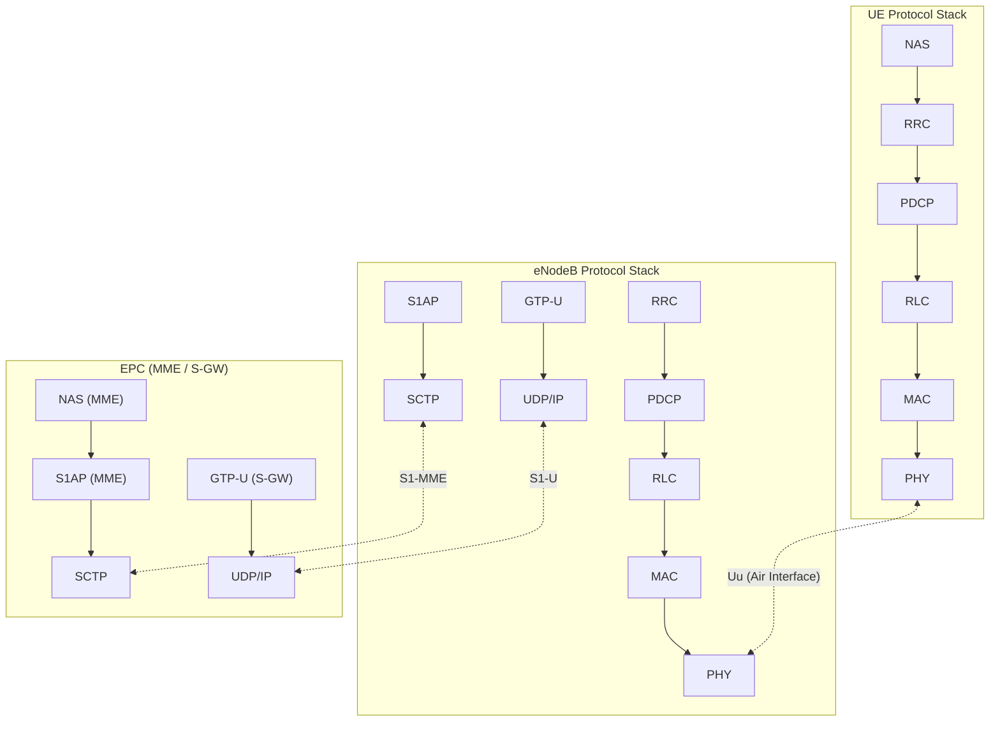
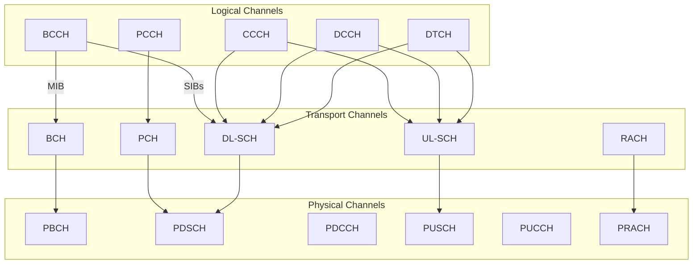
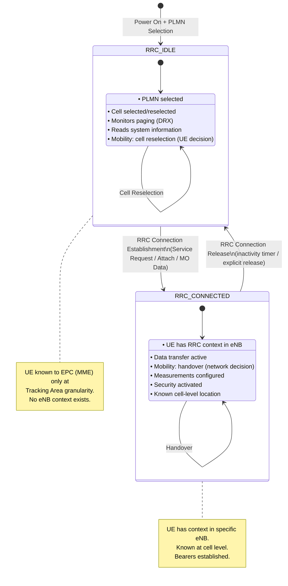
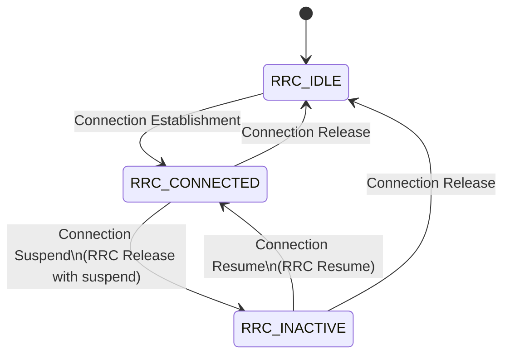

# Module 6: E-UTRAN — LTE Radio Access Network

## 6.1 E-UTRAN Architecture

### Why No RNC? The Flat Architecture Decision

In UMTS (3G), the Radio Network Controller (RNC) sat between the NodeBs and the Core Network, centralizing radio resource management, handover decisions, and protocol termination. LTE **eliminated the RNC entirely**, creating a flat, single-node radio access network.

**Reasons for removing the RNC:**

| Concern | 3G (with RNC) | LTE (flat, no RNC) |
|---------|---------------|---------------------|
| Latency | Extra hop through RNC adds ~5–10 ms | Direct eNB↔EPC path, sub-5 ms user-plane latency |
| Single point of failure | RNC failure affects all connected NodeBs | Each eNB is independent |
| Scalability | RNC capacity limits number of NodeBs | No bottleneck; eNBs scale independently |
| Complexity | Three-node RAN (NodeB→RNC→CN) | Two-node RAN (eNB→EPC) |
| Cost | Expensive, proprietary RNC hardware | Distributed intelligence reduces CAPEX |
| Handover speed | RNC-mediated = slower | Direct eNB-to-eNB via X2 = faster |

**Key architectural principle:** All radio-related intelligence is pushed into the **eNodeB (eNB)**, which communicates directly with the Evolved Packet Core (EPC) via the S1 interface and with neighboring eNBs via the X2 interface.

```
┌─────────┐    S1-MME    ┌───────┐
│  eNB 1  │─────────────→│  MME  │
│         │    S1-U      ├───────┤
│         │─────────────→│ S-GW  │
└────┬────┘              └───────┘
     │ X2
┌────┴────┐    S1-MME    ┌───────┐
│  eNB 2  │─────────────→│  MME  │
│         │    S1-U      ├───────┤
│         │─────────────→│ S-GW  │
└─────────┘              └───────┘
```

---

## 6.2 eNodeB Functions

The eNodeB is the **sole node** in E-UTRAN. It performs all functions previously split between NodeB and RNC:

### Radio Resource Management (RRM)
- **Radio Bearer Control:** Establishment, maintenance, and release of radio bearers
- **Radio Admission Control (RAC):** Accept/reject new radio bearer requests based on interference and load
- **Connection Mobility Control:** Handover decisions based on UE measurements
- **Dynamic Resource Allocation (Scheduling):** Assigns resource blocks to UEs every TTI (1 ms)

### Scheduling
- Operates every **1 ms TTI** (Transmission Time Interval)
- Frequency-domain and time-domain scheduling
- Algorithms: Round Robin, Proportional Fair, Max Throughput
- Uses **CQI** (Channel Quality Indicator) reports from UEs
- Controls both DL and UL resource allocation

### HARQ (Hybrid Automatic Repeat Request)
- Stop-and-wait HARQ with **8 parallel processes**
- Synchronous in UL, asynchronous in DL
- Soft combining: Chase Combining or Incremental Redundancy
- Round-trip time: 8 ms (4 ms each way)

### Channel Encoding
- **Turbo coding** (rate 1/3) for data channels
- **Convolutional coding** for control channels
- Rate matching and HARQ buffer management
- CRC attachment for error detection

### Other Functions
- IP header compression (ROHC)
- Ciphering and integrity protection
- Paging message distribution
- Broadcast information (SIBs, MIBs)
- Measurement configuration and reporting

---

## 6.3 LTE Protocol Stack

### Protocol Stack Diagram



### Control Plane Stack
```
UE                          eNodeB                      MME
┌─────┐                    ┌─────┐                    ┌─────┐
│ NAS │◄──────────────────────────────────────────────►│ NAS │
├─────┤                    ├─────┤                    ├─────┤
│ RRC │◄──────────────────►│ RRC │                    │S1AP │
├─────┤                    ├─────┤                    ├─────┤
│PDCP │◄──────────────────►│PDCP │         S1AP      │SCTP │
├─────┤                    ├─────┤◄──────────────────►├─────┤
│ RLC │◄──────────────────►│ RLC │                    │ IP  │
├─────┤                    ├─────┤                    ├─────┤
│ MAC │◄──────────────────►│ MAC │                    │ L2  │
├─────┤                    ├─────┤                    ├─────┤
│ PHY │◄══════════════════►│ PHY │                    │ L1  │
└─────┘     Uu (air)       └─────┘     S1-MME        └─────┘
```

### User Plane Stack
```
UE                          eNodeB                      S-GW
┌─────┐                    ┌─────┐                    ┌─────┐
│ App │                    │     │                    │     │
├─────┤                    │     │                    │     │
│ IP  │◄──────────────────────────────────────────────►│ IP  │
├─────┤                    ├─────┤                    ├─────┤
│PDCP │◄──────────────────►│PDCP │       GTP-U       │GTP-U│
├─────┤                    ├─────┤◄──────────────────►├─────┤
│ RLC │◄──────────────────►│ RLC │                    │UDP  │
├─────┤                    ├─────┤                    ├─────┤
│ MAC │◄──────────────────►│ MAC │                    │ IP  │
├─────┤                    ├─────┤                    ├─────┤
│ PHY │◄══════════════════►│ PHY │                    │ L2  │
└─────┘     Uu (air)       └─────┘     S1-U          └─────┘
```

---


## 6.4 Protocol Layers in Detail

### 6.4.1 Physical Layer (PHY)

#### Downlink: OFDMA (Orthogonal Frequency Division Multiple Access)

- Divides bandwidth into many narrow **subcarriers** (15 kHz spacing)
- Each subcarrier is orthogonal → no inter-carrier interference
- Robust against multipath fading (cyclic prefix absorbs delay spread)
- Enables flexible frequency-domain scheduling

**Resource Grid:**
- **Resource Element (RE):** 1 subcarrier × 1 OFDM symbol = smallest allocatable unit
- **Resource Block (RB):** 12 subcarriers × 7 OFDM symbols (1 slot = 0.5 ms) = **84 REs**
- **Resource Block Pair:** 2 RBs = 1 subframe (1 ms TTI)

| Bandwidth | Number of RBs | Subcarriers |
|-----------|---------------|-------------|
| 1.4 MHz   | 6             | 72          |
| 3 MHz     | 15            | 180         |
| 5 MHz     | 25            | 300         |
| 10 MHz    | 50            | 600         |
| 15 MHz    | 75            | 900         |
| 20 MHz    | 100           | 1200        |

**Frame Structure (FDD):**
- 1 radio frame = 10 ms = 10 subframes
- 1 subframe = 1 ms = 2 slots
- 1 slot = 0.5 ms = 7 OFDM symbols (normal CP)

#### Uplink: SC-FDMA (Single Carrier FDMA)

- Also called DFT-spread OFDM (DFT-s-OFDM)
- Lower **PAPR** (Peak-to-Average Power Ratio) than OFDMA → better for battery-powered UEs
- Single-carrier property achieved by DFT precoding before IFFT
- Same resource grid structure as DL (12 subcarriers per RB)
- **Constraint:** UL allocation must be contiguous in frequency

#### Key PHY Procedures
- Cell search (PSS/SSS synchronization)
- Channel estimation (reference signals: CRS, DM-RS, SRS)
- MIMO: up to 4×4 in DL, 1×2 or 2×2 in UL (Rel-8/10)
- Link adaptation via CQI/PMI/RI feedback
- Power control (open-loop and closed-loop)

---

### 6.4.2 MAC Layer (Medium Access Control)

The MAC layer sits between RLC and PHY, responsible for **real-time scheduling** and data multiplexing.

#### Key Functions

1. **Scheduling (DL and UL)**
   - Operates every 1 ms TTI
   - Assigns RBs based on CQI, buffer status, QoS priority, fairness
   - DL: eNB decides; UL: eNB grants resources to UEs

2. **Multiplexing/Demultiplexing**
   - Multiplexes data from multiple logical channels into one transport block
   - Uses Logical Channel Prioritization (LCP) in UL

3. **HARQ Entity**
   - 8 parallel stop-and-wait processes
   - DL: Asynchronous adaptive HARQ
   - UL: Synchronous HARQ (fixed timing)
   - Generates ACK/NACK; soft combining at receiver

4. **Random Access Procedure**
   - Contention-based (4-step) or contention-free (2-step)
   - Used for initial access, handover, UL synchronization recovery

5. **BSR (Buffer Status Report)**
   - UE informs eNB about pending UL data
   - Triggers UL scheduling grants

6. **PHR (Power Headroom Report)**
   - UE reports remaining power margin
   - Helps eNB with UL scheduling decisions

#### Channel Mapping at MAC
```
Logical Channels    →    Transport Channels    →    Physical Channels
(WHAT to transfer)       (HOW to transfer)          (WHERE to transfer)
```

---

### 6.4.3 RLC Layer (Radio Link Control)

RLC provides segmentation, reassembly, and (optionally) ARQ.

#### Three Modes

| Mode | Full Name | ARQ | Segmentation | Use Case |
|------|-----------|-----|--------------|----------|
| **TM** | Transparent Mode | No | No | BCCH, PCCH, CCCH (small, fixed-size messages) |
| **UM** | Unacknowledged Mode | No | Yes | VoIP, real-time video (delay-sensitive) |
| **AM** | Acknowledged Mode | Yes | Yes | TCP traffic, signaling (reliability needed) |

#### Key Functions

- **Segmentation and Reassembly:** Splits PDCP PDUs into RLC-sized segments fitting transport block size
- **Concatenation:** Packs multiple small SDUs into one PDU
- **ARQ (AM only):** Retransmits lost RLC PDUs based on STATUS reports
  - Polling mechanism: RLC sender requests STATUS from receiver
  - Operates independently from HARQ (RLC ARQ catches what HARQ misses)
- **Reordering (UM/AM):** Delivers SDUs in order to upper layers
- **Duplicate Detection (AM):** Discards duplicate PDUs

#### RLC vs. HARQ
- HARQ: Fast (8 ms RTT), limited retransmissions (typically 4)
- RLC ARQ: Slower, but catches residual errors after HARQ exhaustion
- Combined: achieves target BLER of 10⁻⁶ for AM bearers

---


### 6.4.4 PDCP Layer (Packet Data Convergence Protocol)

PDCP sits above RLC, providing security and efficiency functions.

#### Key Functions

1. **Header Compression (User Plane only)**
   - Uses **ROHC** (Robust Header Compression, RFC 3095/4995)
   - Compresses IP/UDP/RTP headers from ~40–60 bytes → 1–4 bytes
   - Critical for VoIP: 40-byte header on 32-byte payload → ~56% overhead without ROHC
   - Multiple ROHC profiles for different protocol stacks

2. **Ciphering (User Plane + Control Plane)**
   - Encrypts all user data and signaling
   - Algorithms: EEA0 (null), 128-EEA1 (SNOW 3G), 128-EEA2 (AES-CTR), 128-EEA3 (ZUC)
   - Uses COUNT (sequence number + HFN) + BEARER + DIRECTION as input

3. **Integrity Protection (Control Plane only)**
   - Protects RRC signaling from tampering
   - Algorithms: EIA1 (SNOW 3G), EIA2 (AES-CMAC), EIA3 (ZUC)
   - Generates 32-bit MAC-I appended to each RRC message
   - **Not applied to user plane in LTE** (added in 5G NR for user plane)

4. **Sequence Numbering and Reordering**
   - Assigns PDCP SN to each SDU
   - Reorders out-of-sequence PDUs (important during handover)
   - Detects duplicates

5. **Handover Support**
   - In-sequence delivery and duplicate elimination during handover
   - Status reporting: tells source eNB which PDUs were successfully delivered
   - Enables lossless handover for AM bearers

#### PDCP PDU Format
```
┌──────────────┬────────────────────────────┬──────────┐
│ D/C │ SN     │        Data (encrypted)    │  MAC-I   │
│(1b) │(12/18b)│                            │ (CP only)│
└──────────────┴────────────────────────────┴──────────┘
```

---

### 6.4.5 RRC Layer (Radio Resource Control)

RRC is the **control plane protocol** between UE and eNodeB, managing the radio connection.

#### Key Functions

1. **Connection Management**
   - RRC Connection Setup / Reconfiguration / Release
   - Security activation (ciphering + integrity)
   - SRB (Signaling Radio Bearer) establishment

2. **Measurement Configuration and Reporting**
   - Configures UE to measure serving and neighbor cells
   - Events: A1–A6 (intra/inter-frequency), B1–B2 (inter-RAT)
   - Reporting: periodic or event-triggered
   - Quantities: RSRP, RSRQ, SINR

3. **Handover Control**
   - eNB makes handover decision based on measurement reports
   - Sends `RRCConnectionReconfiguration` with mobility control info
   - UE performs handover, sends `RRCConnectionReconfigurationComplete`

4. **System Information Broadcasting**
   - **MIB:** Transmitted on PBCH every 40 ms (bandwidth, SFN, PHICH config)
   - **SIB1:** Cell access info, scheduling of other SIBs (80 ms period)
   - **SIB2:** Common channel config (RACH, paging, UL power control)
   - **SIB3–SIB8:** Cell reselection, inter-frequency/inter-RAT info
   - **SIB9–SIB19:** Additional info (home eNB, MBMS, etc.)

5. **Paging**
   - Notifies UEs in IDLE of incoming calls/data
   - DRX-based: UE wakes at specific paging occasions

6. **NAS Message Transfer**
   - Transparently carries NAS messages between UE and MME

#### Signaling Radio Bearers (SRBs)

| SRB | Purpose | RLC Mode |
|-----|---------|----------|
| SRB0 | RRC messages on CCCH (before security) | TM |
| SRB1 | RRC messages + piggybacked NAS (after setup) | AM |
| SRB2 | NAS messages (lower priority than SRB1) | AM |

---


## 6.5 LTE Channel Structure

### Channel Types Overview

LTE defines three categories of channels, each at a different layer of abstraction:

| Category | Layer | Defined By | Question Answered |
|----------|-------|-----------|-------------------|
| Logical Channels | MAC (upper) | **What** type of data | What is being transferred? |
| Transport Channels | MAC (lower) | **How** data is transferred | How is it characterized? |
| Physical Channels | PHY | **Where** in the resource grid | Where are the bits placed? |

### Logical Channels

#### Control Channels
| Channel | Name | Direction | Purpose |
|---------|------|-----------|---------|
| **BCCH** | Broadcast Control Channel | DL | System information (MIB, SIBs) |
| **PCCH** | Paging Control Channel | DL | Paging messages for IDLE UEs |
| **CCCH** | Common Control Channel | DL/UL | Messages before RRC connection (Msg3/Msg4) |
| **DCCH** | Dedicated Control Channel | DL/UL | Dedicated signaling (RRC after connection) |
| **MCCH** | Multicast Control Channel | DL | MBMS control information |

#### Traffic Channels
| Channel | Name | Direction | Purpose |
|---------|------|-----------|---------|
| **DTCH** | Dedicated Traffic Channel | DL/UL | User data (IP packets) |
| **MTCH** | Multicast Traffic Channel | DL | MBMS user data |

### Transport Channels

| Channel | Name | Direction | Purpose |
|---------|------|-----------|---------|
| **BCH** | Broadcast Channel | DL | Carries MIB; fixed format, 40 ms period |
| **PCH** | Paging Channel | DL | Carries paging; supports DRX |
| **DL-SCH** | Downlink Shared Channel | DL | Main DL data; supports HARQ, dynamic scheduling |
| **UL-SCH** | Uplink Shared Channel | UL | Main UL data; supports HARQ, dynamic scheduling |
| **RACH** | Random Access Channel | UL | Random access preambles |
| **MCH** | Multicast Channel | DL | MBMS data; fixed scheduling |

### Physical Channels

#### Downlink Physical Channels
| Channel | Name | Purpose |
|---------|------|---------|
| **PDSCH** | Physical DL Shared Channel | User data + system info (SIBs, paging) |
| **PDCCH** | Physical DL Control Channel | DCI (scheduling grants, power control) |
| **PBCH** | Physical Broadcast Channel | MIB transmission |
| **PMCH** | Physical Multicast Channel | MBMS data |
| **PCFICH** | Physical CFI Channel | Indicates # of OFDM symbols for PDCCH |
| **PHICH** | Physical HARQ Indicator Channel | UL HARQ ACK/NACK |

#### Uplink Physical Channels
| Channel | Name | Purpose |
|---------|------|---------|
| **PUSCH** | Physical UL Shared Channel | UL user data + control info |
| **PUCCH** | Physical UL Control Channel | CQI, HARQ ACK/NACK, SR |
| **PRACH** | Physical Random Access Channel | Random access preambles |

### Channel Mapping



### Complete Channel Mapping Table

| Logical Channel | Transport Channel | Physical Channel | Direction |
|-----------------|-------------------|------------------|-----------|
| BCCH (MIB) | BCH | PBCH | DL |
| BCCH (SIBs) | DL-SCH | PDSCH | DL |
| PCCH | PCH | PDSCH | DL |
| CCCH | DL-SCH | PDSCH | DL |
| CCCH | UL-SCH | PUSCH | UL |
| DCCH | DL-SCH | PDSCH | DL |
| DCCH | UL-SCH | PUSCH | UL |
| DTCH | DL-SCH | PDSCH | DL |
| DTCH | UL-SCH | PUSCH | UL |
| — (HARQ feedback) | — | PHICH | DL |
| — (DCI/grants) | — | PDCCH | DL |
| — (CFI) | — | PCFICH | DL |
| — (CQI/SR/ACK) | — | PUCCH | UL |
| — (RA preamble) | RACH | PRACH | UL |

---


## 6.6 S1 Interface

The S1 interface connects the eNodeB to the EPC. It is split into:
- **S1-MME (S1-C):** Control plane → eNB ↔ MME
- **S1-U:** User plane → eNB ↔ S-GW

### S1-MME Protocol Stack

```
┌─────────┐
│  S1AP   │  ← Application protocol (S1 procedures)
├─────────┤
│  SCTP   │  ← Reliable transport (multi-stream, multi-homing)
├─────────┤
│   IP    │  ← Network layer
├─────────┤
│  L2/L1  │  ← Data link / Physical
└─────────┘
```

**Why SCTP (not TCP)?**
- Multi-streaming: avoids head-of-line blocking
- Multi-homing: failover between IP addresses
- Message-oriented (preserves boundaries)

### S1AP Procedures

#### UE-Associated Procedures (per-UE context)

| Procedure | Direction | Purpose |
|-----------|-----------|---------|
| Initial UE Message | eNB → MME | Carries first NAS message (Attach, Service Request) |
| Downlink NAS Transport | MME → eNB | Delivers NAS message to UE |
| Uplink NAS Transport | eNB → MME | Forwards NAS message from UE |
| Initial Context Setup | MME → eNB | Establishes security context + default bearer |
| UE Context Release | MME ↔ eNB | Releases UE context (Request/Command/Complete) |
| Handover Preparation | Source eNB → MME | S1-based handover when X2 unavailable |
| Handover Resource Allocation | MME → Target eNB | Allocates resources at target |
| Path Switch Request | Target eNB → MME | Updates S-GW path after X2 handover |
| E-RAB Setup/Modify/Release | MME → eNB | Bearer management |

#### Non-UE-Associated Procedures (global)

| Procedure | Purpose |
|-----------|---------|
| S1 Setup | eNB registers with MME (TAC, PLMN, capacity) |
| Reset | Error recovery (partial or full) |
| Paging | MME sends paging to eNBs in tracking area |
| eNB/MME Configuration Update | Capacity/configuration changes |
| Overload Start/Stop | MME signals congestion |
| Error Indication | Report protocol errors |

### S1-U Protocol Stack

```
┌─────────┐
│  GTP-U  │  ← GTP tunneling (TEID identifies bearer)
├─────────┤
│   UDP   │  ← Port 2152
├─────────┤
│   IP    │
├─────────┤
│  L2/L1  │
└─────────┘
```

- Each E-RAB has a **GTP tunnel** identified by TEID (Tunnel Endpoint ID)
- One-to-one mapping: EPS bearer ↔ S1 GTP tunnel ↔ radio bearer

---

## 6.7 X2 Interface

The X2 interface connects **neighboring eNodeBs** directly for:
- Fast handover (no MME involvement for intra-LTE mobility)
- Inter-cell load management
- Inter-cell interference coordination (ICIC)

### X2 Protocol Stack

```
Control Plane (X2-C):          User Plane (X2-U):
┌─────────┐                    ┌─────────┐
│  X2AP   │                    │  GTP-U  │
├─────────┤                    ├─────────┤
│  SCTP   │                    │   UDP   │
├─────────┤                    ├─────────┤
│   IP    │                    │   IP    │
├─────────┤                    ├─────────┤
│  L2/L1  │                    │  L2/L1  │
└─────────┘                    └─────────┘
```

### X2AP Procedures

#### Mobility Management (Handover)

**X2 Handover Sequence:**
1. **Source eNB** sends `Handover Request` → Target eNB (includes UE context, bearer info)
2. **Target eNB** performs admission control → sends `Handover Request Acknowledge`
3. **Source eNB** sends `RRCConnectionReconfiguration` to UE (with target cell info)
4. **UE** synchronizes to target cell, sends `RRCConnectionReconfigurationComplete`
5. **Target eNB** sends `Path Switch Request` to MME (updates core network path)
6. **Source eNB** receives `UE Context Release` → releases resources

**During handover:** Data forwarded source→target via X2-U GTP tunnel (avoids data loss).

#### Load Management

| Procedure | Purpose |
|-----------|---------|
| Resource Status Reporting | Request/report load information (PRB usage, composite load) |
| Load Indication | Inform neighbor about UL interference (HII, OI) |
| Mobility Change Request | Negotiate handover parameters (CIO adjustment) |

#### Inter-Cell Interference Coordination (ICIC)

- **Load Information message** carries:
  - **HII (High Interference Indication):** UL RBs where cell plans to schedule cell-edge UEs
  - **OI (Overload Indicator):** UL RBs experiencing high interference
  - **RNTP (Relative Narrowband TX Power):** DL RBs where cell will exceed power threshold

### X2 Setup and Configuration

- X2 link established via **X2 Setup procedure** (or via MME using S1 ENB Configuration Transfer)
- Automatic Neighbor Relation (ANR): eNB discovers neighbors and establishes X2
- Multiple eNBs can connect forming a mesh topology

---

## 6.8 RRC States and Transitions

### RRC State Machine



### RRC_IDLE State

| Characteristic | Description |
|---------------|-------------|
| Context | No eNB context; registered with MME only |
| Location | Known at **Tracking Area** level |
| Mobility | **Cell reselection** (UE-controlled, based on SIBs) |
| Data | No data transfer possible |
| Paging | UE monitors paging channel with DRX cycle |
| System Info | UE acquires MIB and relevant SIBs |
| Power | Low power consumption (long DRX sleep) |

### RRC_CONNECTED State

| Characteristic | Description |
|---------------|-------------|
| Context | Full UE context in serving eNB |
| Location | Known at **cell** level |
| Mobility | **Handover** (network-controlled, measurement-based) |
| Data | Active data transfer (DL + UL) |
| Measurements | Configured by eNB (events A1–A6, B1–B2) |
| DRX | Connected-mode DRX possible (shorter cycles) |
| Security | AS ciphering + integrity active |

### State Transitions

#### IDLE → CONNECTED (Connection Establishment)
1. UE sends **RRC Connection Request** (on CCCH via SRB0)
2. eNB responds with **RRC Connection Setup** (configures SRB1)
3. UE sends **RRC Connection Setup Complete** (carries initial NAS message)
4. eNB forwards NAS to MME via S1AP `Initial UE Message`
5. MME initiates **Initial Context Setup** (security + bearer establishment)

#### CONNECTED → IDLE (Connection Release)
- MME triggers via S1AP `UE Context Release Command`
- eNB sends **RRC Connection Release** to UE
- UE deletes AS context, returns to idle
- Triggers: inactivity timer, explicit NAS detach, radio link failure recovery failure

### 5G Extension: RRC_INACTIVE State

In 5G NR (and late LTE Rel-15+), a third state is introduced:



| State | UE Context | Location Granularity | Mobility | CN Connection |
|-------|-----------|---------------------|----------|---------------|
| IDLE | None in RAN | Tracking Area | Cell reselection | None |
| INACTIVE | Stored in gNB (suspended) | RAN Notification Area | Cell reselection + RAN paging | Maintained with CN |
| CONNECTED | Active in gNB | Cell level | Handover | Active |

**Benefits of INACTIVE state:**
- Faster resumption than IDLE→CONNECTED (skip NAS procedures)
- Power saving (no connected-mode signaling)
- Reduced signaling load on core network
- AS context preserved → faster resume with single RRC Resume message
- Ideal for IoT devices with intermittent small data transmissions

---

## Summary

| Component | Key Takeaway |
|-----------|-------------|
| Architecture | Flat (no RNC); eNB handles all RAN functions |
| eNodeB | Scheduling, RRM, HARQ, handover decisions, encoding |
| PHY | OFDMA (DL) / SC-FDMA (UL); resource blocks as basic unit |
| MAC | 1 ms scheduling, HARQ, multiplexing, random access |
| RLC | TM/UM/AM; segmentation + ARQ for reliability |
| PDCP | ROHC compression, ciphering, integrity (CP), reordering |
| RRC | Connection/mobility management, measurement, system info |
| Channels | Logical→Transport→Physical mapping; shared channels dominate |
| S1 | eNB↔EPC; S1AP (SCTP) for control, GTP-U for user plane |
| X2 | eNB↔eNB; fast handover, load mgmt, interference coordination |
| RRC States | IDLE (low power) ↔ CONNECTED (active); INACTIVE in 5G |

---

*Module 6 — E-UTRAN (LTE Radio Access Network) — Advanced Communication Networks*
