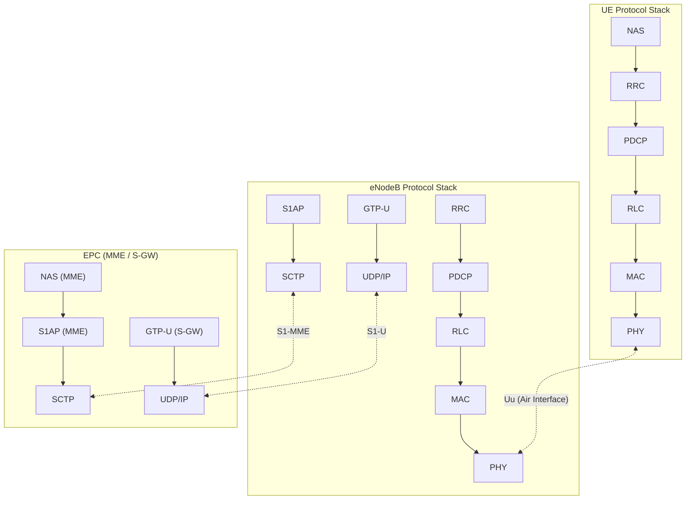
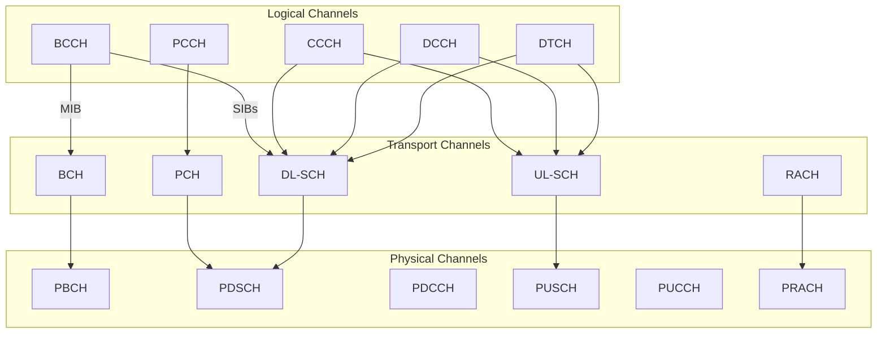
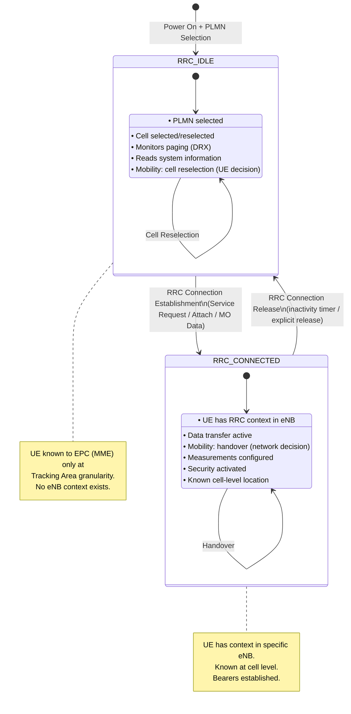
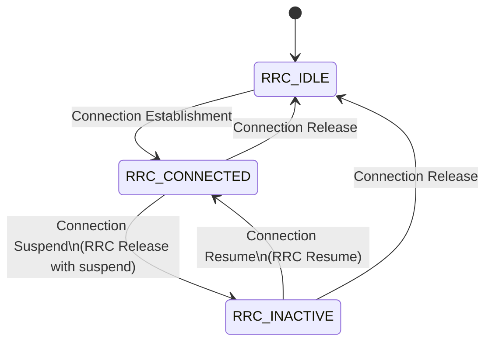

# ماژول 6: E-UTRAN — شبکه دسترسی رادیویی LTE

## 6.1 معماری E-UTRAN

### چرا بدون RNC؟ تصمیم معماری مسطح

در UMTS (3G)، کنترلر شبکه رادیویی (RNC) بین NodeBها و شبکه هسته قرار می‌گرفت و مدیریت منابع رادیویی، تصمیمات تحویل و پایان‌دهی پروتکل را متمرکز می‌کرد. LTE **RNC را کاملاً حذف کرد** و یک شبکه دسترسی رادیویی مسطح و تک-گره‌ای ایجاد کرد.

**دلایل حذف RNC:**

| دغدغه | 3G (با RNC) | LTE (مسطح، بدون RNC) |
|---------|---------------|---------------------|
| تأخیر | گام اضافه از RNC حدود 5–10 ms اضافه می‌کند | مسیر مستقیم eNB↔EPC، تأخیر صفحه کاربر زیر 5 ms |
| نقطه شکست واحد | شکست RNC بر تمام NodeBهای متصل تأثیر می‌گذارد | هر eNB مستقل است |
| مقیاس‌پذیری | ظرفیت RNC تعداد NodeBها را محدود می‌کند | بدون گلوگاه؛ eNBها مستقل مقیاس می‌یابند |
| پیچیدگی | RAN سه-گره‌ای (NodeB←RNC←CN) | RAN دو-گره‌ای (eNB←EPC) |
| هزینه | سخت‌افزار RNC گران و اختصاصی | هوش توزیع‌شده CAPEX را کاهش می‌دهد |
| سرعت تحویل | با واسطه RNC = کندتر | مستقیم eNB-به-eNB از طریق X2 = سریع‌تر |

**اصل معماری کلیدی:** تمام هوش مرتبط با رادیو به **eNodeB (eNB)** منتقل می‌شود، که به‌طور مستقیم با هسته بسته تکامل‌یافته (EPC) از طریق واسط S1 و با eNBهای همسایه از طریق واسط X2 ارتباط برقرار می‌کند.

```
┌─────────┐    S1-MME    ┌───────┐
│  eNB 1  │─────────────→│  MME  │
│         │    S1-U      ├───────┤
│         │─────────────→│ S-GW  │
└────┬────┘              └───────┘
     │ X2
┌────┴────┐    S1-MME    ┌───────┐
│  eNB 2  │─────────────→│  MME  │
│         │    S1-U      ├───────┤
│         │─────────────→│ S-GW  │
└─────────┘              └───────┘
```

---

## 6.2 توابع eNodeB

eNodeB **تنها گره** در E-UTRAN است. تمام توابعی را که قبلاً بین NodeB و RNC تقسیم شده بود انجام می‌دهد:

### مدیریت منابع رادیویی (RRM)
- **کنترل حامل رادیویی:** برقراری، نگهداری و آزادسازی حامل‌های رادیویی
- **کنترل پذیرش رادیویی (RAC):** پذیرش/رد درخواست‌های حامل رادیویی جدید بر اساس تداخل و بار
- **کنترل تحرک اتصال:** تصمیمات تحویل بر اساس اندازه‌گیری‌های UE
- **تخصیص پویا منابع (زمان‌بندی):** بلوک‌های منبع را به UEها در هر TTI (1 ms) تخصیص می‌دهد

### زمان‌بندی
- در هر **TTI 1 ms** (فاصله زمانی انتقال) عمل می‌کند
- زمان‌بندی در دامنه فرکانس و دامنه زمان
- الگوریتم‌ها: Round Robin، Proportional Fair، Max Throughput
- از گزارش‌های **CQI** (نشانگر کیفیت کانال) از UEها استفاده می‌کند
- تخصیص منابع DL و UL را کنترل می‌کند

### HARQ (درخواست تکرار خودکار ترکیبی)
- HARQ توقف-و-انتظار با **8 فرآیند موازی**
- همگام در UL، ناهمگام در DL
- ترکیب نرم: Chase Combining یا افزونگی افزایشی
- زمان رفت-و-برگشت: 8 ms (4 ms در هر جهت)

### کدگذاری کانال
- **کدگذاری توربو** (نرخ 1/3) برای کانال‌های داده
- **کدگذاری کانولوشنی** برای کانال‌های کنترل
- تطبیق نرخ و مدیریت بافر HARQ
- الصاق CRC برای تشخیص خطا

### سایر توابع
- فشرده‌سازی سرآیند IP (ROHC)
- رمزگذاری و حفاظت یکپارچگی
- توزیع پیام صفحه‌بندی
- اطلاعات پخش (SIBها، MIBها)
- پیکربندی و گزارش‌دهی اندازه‌گیری

---

## 6.3 پشته پروتکل LTE

### نمودار پشته پروتکل



### پشته صفحه کنترل
```
UE                          eNodeB                      MME
┌─────┐                    ┌─────┐                    ┌─────┐
│ NAS │◄──────────────────────────────────────────────►│ NAS │
├─────┤                    ├─────┤                    ├─────┤
│ RRC │◄──────────────────►│ RRC │                    │S1AP │
├─────┤                    ├─────┤                    ├─────┤
│PDCP │◄──────────────────►│PDCP │         S1AP      │SCTP │
├─────┤                    ├─────┤◄──────────────────►├─────┤
│ RLC │◄──────────────────►│ RLC │                    │ IP  │
├─────┤                    ├─────┤                    ├─────┤
│ MAC │◄──────────────────►│ MAC │                    │ L2  │
├─────┤                    ├─────┤                    ├─────┤
│ PHY │◄══════════════════►│ PHY │                    │ L1  │
└─────┘     Uu (air)       └─────┘     S1-MME        └─────┘
```

### پشته صفحه کاربر
```
UE                          eNodeB                      S-GW
┌─────┐                    ┌─────┐                    ┌─────┐
│ App │                    │     │                    │     │
├─────┤                    │     │                    │     │
│ IP  │◄──────────────────────────────────────────────►│ IP  │
├─────┤                    ├─────┤                    ├─────┤
│PDCP │◄──────────────────►│PDCP │       GTP-U       │GTP-U│
├─────┤                    ├─────┤◄──────────────────►├─────┤
│ RLC │◄──────────────────►│ RLC │                    │UDP  │
├─────┤                    ├─────┤                    ├─────┤
│ MAC │◄──────────────────►│ MAC │                    │ IP  │
├─────┤                    ├─────┤                    ├─────┤
│ PHY │◄══════════════════►│ PHY │                    │ L2  │
└─────┘     Uu (air)       └─────┘     S1-U          └─────┘
```

---


## 6.4 لایه‌های پروتکل به‌تفصیل

### 6.4.1 لایه فیزیکی (PHY)

#### پیوند پایین‌سو: OFDMA (دسترسی چندگانه تقسیم فرکانس متعامد)

- پهنای باند را به بسیاری **زیرحامل** باریک تقسیم می‌کند (فاصله 15 kHz)
- هر زیرحامل متعامد است ← بدون تداخل بین-حامل
- مقاوم در برابر محو شدن چندمسیری (پیشوند چرخه‌ای گسترش تأخیر را جذب می‌کند)
- زمان‌بندی انعطاف‌پذیر در دامنه فرکانس را ممکن می‌سازد

**شبکه منابع:**
- **عنصر منبع (RE):** 1 زیرحامل × 1 نماد OFDM = کوچک‌ترین واحد قابل تخصیص
- **بلوک منبع (RB):** 12 زیرحامل × 7 نماد OFDM (1 شکاف = 0.5 ms) = **84 RE**
- **جفت بلوک منبع:** 2 RB = 1 زیرفریم (TTI 1 ms)

| پهنای باند | تعداد RB | زیرحامل‌ها |
|-----------|---------------|-------------|
| 1.4 MHz   | 6             | 72          |
| 3 MHz     | 15            | 180         |
| 5 MHz     | 25            | 300         |
| 10 MHz    | 50            | 600         |
| 15 MHz    | 75            | 900         |
| 20 MHz    | 100           | 1200        |

**ساختار فریم (FDD):**
- 1 فریم رادیویی = 10 ms = 10 زیرفریم
- 1 زیرفریم = 1 ms = 2 شکاف
- 1 شکاف = 0.5 ms = 7 نماد OFDM (CP معمولی)

#### پیوند بالاسو: SC-FDMA (FDMA تک-حامله)

- همچنین OFDM با گسترش DFT نامیده می‌شود (DFT-s-OFDM)
- **PAPR** پایین‌تر (نسبت توان اوج به میانگین) نسبت به OFDMA ← بهتر برای UEهای باتری‌دار
- خاصیت تک-حامله با پیش‌کدگذاری DFT پیش از IFFT به دست می‌آید
- همان ساختار شبکه منابع DL (12 زیرحامل در هر RB)
- **محدودیت:** تخصیص UL باید در فرکانس پیوسته باشد

#### رویه‌های کلیدی PHY
- جستجوی سلول (همگام‌سازی PSS/SSS)
- تخمین کانال (سیگنال‌های مرجع: CRS، DM-RS، SRS)
- MIMO: تا 4×4 در DL، 1×2 یا 2×2 در UL (Rel-8/10)
- تطبیق پیوند از طریق بازخورد CQI/PMI/RI
- کنترل توان (حلقه باز و حلقه بسته)

---

### 6.4.2 لایه MAC (کنترل دسترسی رسانه)

لایه MAC بین RLC و PHY قرار دارد و مسئول **زمان‌بندی بلادرنگ** و چندگانه‌سازی داده است.

#### توابع کلیدی

1. **زمان‌بندی (DL و UL)**
   - در هر TTI 1 ms عمل می‌کند
   - RBها را بر اساس CQI، وضعیت بافر، اولویت QoS، انصاف تخصیص می‌دهد
   - DL: eNB تصمیم می‌گیرد؛ UL: eNB منابع را به UEها اعطا می‌کند

2. **چندگانه‌سازی/چندگانه‌گشایی**
   - داده از چندین کانال منطقی را در یک بلوک انتقال چندگانه می‌کند
   - از اولویت‌بندی کانال منطقی (LCP) در UL استفاده می‌کند

3. **موجودیت HARQ**
   - 8 فرآیند توقف-و-انتظار موازی
   - DL: HARQ تطبیقی ناهمگام
   - UL: HARQ همگام (زمان‌بندی ثابت)
   - تولید ACK/NACK؛ ترکیب نرم در گیرنده

4. **رویه دسترسی تصادفی**
   - مبتنی بر رقابت (4-گام) یا بدون رقابت (2-گام)
   - برای دسترسی اولیه، تحویل، بازیابی همگام‌سازی UL استفاده می‌شود

5. **BSR (گزارش وضعیت بافر)**
   - UE به eNB درباره داده UL در انتظار اطلاع می‌دهد
   - اعطاهای زمان‌بندی UL را فعال می‌کند

6. **PHR (گزارش حاشیه توان)**
   - UE حاشیه توان باقیمانده را گزارش می‌دهد
   - به eNB در تصمیمات زمان‌بندی UL کمک می‌کند

#### نگاشت کانال در MAC
```
Logical Channels    →    Transport Channels    →    Physical Channels
(WHAT to transfer)       (HOW to transfer)          (WHERE to transfer)
```

---

### 6.4.3 لایه RLC (کنترل پیوند رادیویی)

RLC قطعه‌بندی، بازمونتاژ و (به‌صورت اختیاری) ARQ را فراهم می‌کند.

#### سه حالت

| حالت | نام کامل | ARQ | قطعه‌بندی | مورد استفاده |
|------|-----------|-----|--------------|----------|
| **TM** | حالت شفاف | ندارد | ندارد | BCCH، PCCH، CCCH (پیام‌های کوچک، اندازه ثابت) |
| **UM** | حالت بدون تأیید | ندارد | دارد | VoIP، ویدیوی بلادرنگ (حساس به تأخیر) |
| **AM** | حالت تأییدشده | دارد | دارد | ترافیک TCP، سیگنالینگ (نیازمند قابلیت اطمینان) |

#### توابع کلیدی

- **قطعه‌بندی و بازمونتاژ:** PDUهای PDCP را به قطعات اندازه RLC متناسب با اندازه بلوک انتقال تقسیم می‌کند
- **الحاق:** چندین SDU کوچک را در یک PDU جمع می‌کند
- **ARQ (فقط AM):** PDUهای RLC گمشده را بر اساس گزارش‌های STATUS دوباره ارسال می‌کند
  - سازوکار نظرسنجی: فرستنده RLC از گیرنده STATUS درخواست می‌کند
  - مستقل از HARQ عمل می‌کند (ARQ در RLC آنچه HARQ از دست می‌دهد را می‌گیرد)
- **بازترتیبی (UM/AM):** SDUها را به‌ترتیب به لایه‌های بالاتر تحویل می‌دهد
- **تشخیص تکراری (AM):** PDUهای تکراری را دور می‌ریزد

#### RLC در برابر HARQ
- HARQ: سریع (RTT 8 ms)، تعداد ارسال مجدد محدود (معمولاً 4)
- ARQ در RLC: کندتر، اما خطاهای باقیمانده پس از اتمام HARQ را می‌گیرد
- ترکیبی: رسیدن به BLER هدف 10⁻⁶ برای حامل‌های AM

---


### 6.4.4 لایه PDCP (پروتکل همگرایی داده بسته)

PDCP بالای RLC قرار دارد و توابع امنیت و کارایی را فراهم می‌کند.

#### توابع کلیدی

1. **فشرده‌سازی سرآیند (فقط صفحه کاربر)**
   - از **ROHC** (فشرده‌سازی مقاوم سرآیند، RFC 3095/4995) استفاده می‌کند
   - سرآیندهای IP/UDP/RTP را از حدود 40–60 بایت ← 1–4 بایت فشرده می‌کند
   - حیاتی برای VoIP: سرآیند 40 بایتی روی بار 32 بایتی ← حدود 56% سربار بدون ROHC
   - پروفایل‌های متعدد ROHC برای پشته‌های پروتکل مختلف

2. **رمزگذاری (صفحه کاربر + صفحه کنترل)**
   - تمام داده کاربر و سیگنالینگ را رمزنگاری می‌کند
   - الگوریتم‌ها: EEA0 (تهی)، 128-EEA1 (SNOW 3G)، 128-EEA2 (AES-CTR)، 128-EEA3 (ZUC)
   - از COUNT (شماره ترتیب + HFN) + BEARER + DIRECTION به‌عنوان ورودی استفاده می‌کند

3. **حفاظت یکپارچگی (فقط صفحه کنترل)**
   - سیگنالینگ RRC را از دستکاری محافظت می‌کند
   - الگوریتم‌ها: EIA1 (SNOW 3G)، EIA2 (AES-CMAC)، EIA3 (ZUC)
   - MAC-I 32 بیتی تولید می‌کند که به هر پیام RRC الصاق می‌شود
   - **در LTE به صفحه کاربر اعمال نمی‌شود** (در 5G NR برای صفحه کاربر اضافه شد)

4. **شماره‌گذاری ترتیب و بازترتیبی**
   - به هر SDU یک PDCP SN تخصیص می‌دهد
   - PDUهای خارج از ترتیب را بازمرتب می‌کند (مهم در حین تحویل)
   - موارد تکراری را تشخیص می‌دهد

5. **پشتیبانی تحویل**
   - تحویل به‌ترتیب و حذف تکراری در حین تحویل
   - گزارش‌دهی وضعیت: به eNB مبدأ می‌گوید کدام PDUها با موفقیت تحویل داده شدند
   - تحویل بدون اتلاف را برای حامل‌های AM ممکن می‌سازد

#### قالب PDU در PDCP
```
┌──────────────┬────────────────────────────┬──────────┐
│ D/C │ SN     │        Data (encrypted)    │  MAC-I   │
│(1b) │(12/18b)│                            │ (CP only)│
└──────────────┴────────────────────────────┴──────────┘
```

---

### 6.4.5 لایه RRC (کنترل منابع رادیویی)

RRC **پروتکل صفحه کنترل** بین UE و eNodeB است که اتصال رادیویی را مدیریت می‌کند.

#### توابع کلیدی

1. **مدیریت اتصال**
   - برقراری / پیکربندی مجدد / آزادسازی اتصال RRC
   - فعال‌سازی امنیت (رمزگذاری + یکپارچگی)
   - برقراری SRB (حامل رادیویی سیگنالینگ)

2. **پیکربندی و گزارش‌دهی اندازه‌گیری**
   - UE را برای اندازه‌گیری سلول خدمات‌دهنده و همسایه پیکربندی می‌کند
   - رویدادها: A1–A6 (درون/بین-فرکانسی)، B1–B2 (بین-RAT)
   - گزارش‌دهی: دوره‌ای یا محرک-رویداد
   - کمیت‌ها: RSRP، RSRQ، SINR

3. **کنترل تحویل**
   - eNB بر اساس گزارش‌های اندازه‌گیری تصمیم تحویل می‌گیرد
   - پیام `RRCConnectionReconfiguration` را با اطلاعات کنترل تحرک می‌فرستد
   - UE تحویل را انجام می‌دهد، پیام `RRCConnectionReconfigurationComplete` را می‌فرستد

4. **پخش اطلاعات سیستم**
   - **MIB:** روی PBCH هر 40 ms ارسال می‌شود (پهنای باند، SFN، پیکربندی PHICH)
   - **SIB1:** اطلاعات دسترسی سلول، زمان‌بندی سایر SIBها (دوره 80 ms)
   - **SIB2:** پیکربندی کانال مشترک (RACH، صفحه‌بندی، کنترل توان UL)
   - **SIB3–SIB8:** انتخاب مجدد سلول، اطلاعات بین-فرکانسی/بین-RAT
   - **SIB9–SIB19:** اطلاعات اضافی (eNB خانگی، MBMS و غیره)

5. **صفحه‌بندی**
   - UEهای در حالت IDLE را از تماس/داده ورودی مطلع می‌کند
   - مبتنی بر DRX: UE در فرصت‌های صفحه‌بندی مشخص بیدار می‌شود

6. **انتقال پیام NAS**
   - پیام‌های NAS را به‌صورت شفاف بین UE و MME حمل می‌کند

#### حامل‌های رادیویی سیگنالینگ (SRB)

| SRB | هدف | حالت RLC |
|-----|---------|----------|
| SRB0 | پیام‌های RRC روی CCCH (پیش از امنیت) | TM |
| SRB1 | پیام‌های RRC + NAS حمل‌شده (پس از برقراری) | AM |
| SRB2 | پیام‌های NAS (اولویت پایین‌تر از SRB1) | AM |

---


## 6.5 ساختار کانال LTE

### مرور انواع کانال

LTE سه دسته کانال تعریف می‌کند که هر یک در لایه انتزاعی متفاوتی قرار دارد:

| دسته | لایه | تعریف‌شده توسط | پرسشی که پاسخ می‌دهد |
|----------|-------|-----------|-------------------|
| کانال‌های منطقی | MAC (بالا) | **چه** نوع داده | چه چیزی منتقل می‌شود؟ |
| کانال‌های انتقال | MAC (پایین) | **چگونه** داده منتقل می‌شود | چگونه مشخص می‌شود؟ |
| کانال‌های فیزیکی | PHY | **کجا** در شبکه منابع | بیت‌ها کجا قرار می‌گیرند؟ |

### کانال‌های منطقی

#### کانال‌های کنترل
| کانال | نام | جهت | هدف |
|---------|------|-----------|---------|
| **BCCH** | کانال کنترل پخش | DL | اطلاعات سیستم (MIB، SIBها) |
| **PCCH** | کانال کنترل صفحه‌بندی | DL | پیام‌های صفحه‌بندی برای UEهای IDLE |
| **CCCH** | کانال کنترل مشترک | DL/UL | پیام‌ها پیش از اتصال RRC (Msg3/Msg4) |
| **DCCH** | کانال کنترل اختصاصی | DL/UL | سیگنالینگ اختصاصی (RRC پس از اتصال) |
| **MCCH** | کانال کنترل چندپخشی | DL | اطلاعات کنترل MBMS |

#### کانال‌های ترافیک
| کانال | نام | جهت | هدف |
|---------|------|-----------|---------|
| **DTCH** | کانال ترافیک اختصاصی | DL/UL | داده کاربر (بسته‌های IP) |
| **MTCH** | کانال ترافیک چندپخشی | DL | داده کاربر MBMS |

### کانال‌های انتقال

| کانال | نام | جهت | هدف |
|---------|------|-----------|---------|
| **BCH** | کانال پخش | DL | MIB را حمل می‌کند؛ قالب ثابت، دوره 40 ms |
| **PCH** | کانال صفحه‌بندی | DL | صفحه‌بندی را حمل می‌کند؛ از DRX پشتیبانی می‌کند |
| **DL-SCH** | کانال مشترک پیوند پایین‌سو | DL | داده اصلی DL؛ از HARQ و زمان‌بندی پویا پشتیبانی می‌کند |
| **UL-SCH** | کانال مشترک پیوند بالاسو | UL | داده اصلی UL؛ از HARQ و زمان‌بندی پویا پشتیبانی می‌کند |
| **RACH** | کانال دسترسی تصادفی | UL | پیشوندهای دسترسی تصادفی |
| **MCH** | کانال چندپخشی | DL | داده MBMS؛ زمان‌بندی ثابت |

### کانال‌های فیزیکی

#### کانال‌های فیزیکی پیوند پایین‌سو
| کانال | نام | هدف |
|---------|------|---------|
| **PDSCH** | کانال مشترک فیزیکی DL | داده کاربر + اطلاعات سیستم (SIBها، صفحه‌بندی) |
| **PDCCH** | کانال کنترل فیزیکی DL | DCI (اعطاهای زمان‌بندی، کنترل توان) |
| **PBCH** | کانال پخش فیزیکی | ارسال MIB |
| **PMCH** | کانال چندپخشی فیزیکی | داده MBMS |
| **PCFICH** | کانال CFI فیزیکی | تعداد نمادهای OFDM برای PDCCH را نشان می‌دهد |
| **PHICH** | کانال نشانگر HARQ فیزیکی | ACK/NACK در HARQ UL |

#### کانال‌های فیزیکی پیوند بالاسو
| کانال | نام | هدف |
|---------|------|---------|
| **PUSCH** | کانال مشترک فیزیکی UL | داده کاربر UL + اطلاعات کنترل |
| **PUCCH** | کانال کنترل فیزیکی UL | CQI، ACK/NACK در HARQ، SR |
| **PRACH** | کانال دسترسی تصادفی فیزیکی | پیشوندهای دسترسی تصادفی |

### نگاشت کانال



### جدول کامل نگاشت کانال

| کانال منطقی | کانال انتقال | کانال فیزیکی | جهت |
|-----------------|-------------------|------------------|-----------|
| BCCH (MIB) | BCH | PBCH | DL |
| BCCH (SIBs) | DL-SCH | PDSCH | DL |
| PCCH | PCH | PDSCH | DL |
| CCCH | DL-SCH | PDSCH | DL |
| CCCH | UL-SCH | PUSCH | UL |
| DCCH | DL-SCH | PDSCH | DL |
| DCCH | UL-SCH | PUSCH | UL |
| DTCH | DL-SCH | PDSCH | DL |
| DTCH | UL-SCH | PUSCH | UL |
| — (بازخورد HARQ) | — | PHICH | DL |
| — (DCI/اعطاها) | — | PDCCH | DL |
| — (CFI) | — | PCFICH | DL |
| — (CQI/SR/ACK) | — | PUCCH | UL |
| — (پیشوند RA) | RACH | PRACH | UL |

---


## 6.6 واسط S1

واسط S1 eNodeB را به EPC متصل می‌کند. به دو بخش تقسیم می‌شود:
- **S1-MME (S1-C):** صفحه کنترل ← eNB ↔ MME
- **S1-U:** صفحه کاربر ← eNB ↔ S-GW

### پشته پروتکل S1-MME

```
┌─────────┐
│  S1AP   │  ← Application protocol (S1 procedures)
├─────────┤
│  SCTP   │  ← Reliable transport (multi-stream, multi-homing)
├─────────┤
│   IP    │  ← Network layer
├─────────┤
│  L2/L1  │  ← Data link / Physical
└─────────┘
```

**چرا SCTP (نه TCP)؟**
- چند-جریانی: از مسدودسازی سر-خط جلوگیری می‌کند
- چند-میزبانی: تغییر مسیر بین آدرس‌های IP
- پیام-گرا (مرزها را حفظ می‌کند)

### رویه‌های S1AP

#### رویه‌های مرتبط با UE (در هر زمینه UE)

| رویه | جهت | هدف |
|-----------|-----------|---------|
| Initial UE Message | eNB ← MME | اولین پیام NAS را حمل می‌کند (Attach، Service Request) |
| Downlink NAS Transport | MME ← eNB | پیام NAS را به UE تحویل می‌دهد |
| Uplink NAS Transport | eNB ← MME | پیام NAS را از UE ارسال می‌کند |
| Initial Context Setup | MME ← eNB | زمینه امنیتی + حامل پیش‌فرض را برقرار می‌کند |
| UE Context Release | MME ↔ eNB | زمینه UE را آزاد می‌کند (درخواست/فرمان/تکمیل) |
| Handover Preparation | eNB مبدأ ← MME | تحویل مبتنی بر S1 وقتی X2 در دسترس نیست |
| Handover Resource Allocation | MME ← eNB مقصد | منابع را در مقصد تخصیص می‌دهد |
| Path Switch Request | eNB مقصد ← MME | مسیر S-GW را پس از تحویل X2 به‌روزرسانی می‌کند |
| E-RAB Setup/Modify/Release | MME ← eNB | مدیریت حامل |

#### رویه‌های غیرمرتبط با UE (سراسری)

| رویه | هدف |
|-----------|---------|
| S1 Setup | eNB با MME ثبت‌نام می‌کند (TAC، PLMN، ظرفیت) |
| Reset | بازیابی خطا (جزئی یا کامل) |
| Paging | MME صفحه‌بندی را به eNBهای ناحیه ردیابی می‌فرستد |
| eNB/MME Configuration Update | تغییرات ظرفیت/پیکربندی |
| Overload Start/Stop | MME ازدحام را علامت می‌دهد |
| Error Indication | گزارش خطاهای پروتکل |

### پشته پروتکل S1-U

```
┌─────────┐
│  GTP-U  │  ← GTP tunneling (TEID identifies bearer)
├─────────┤
│   UDP   │  ← Port 2152
├─────────┤
│   IP    │
├─────────┤
│  L2/L1  │
└─────────┘
```

- هر E-RAB یک **تونل GTP** دارد که با TEID (شناسه نقطه انتهایی تونل) شناسایی می‌شود
- نگاشت یک-به-یک: حامل EPS ↔ تونل GTP در S1 ↔ حامل رادیویی

---

## 6.7 واسط X2

واسط X2 **eNodeBهای همسایه** را به‌طور مستقیم برای موارد زیر به هم متصل می‌کند:
- تحویل سریع (بدون دخالت MME برای تحرک درون-LTE)
- مدیریت بار بین-سلولی
- هماهنگی تداخل بین-سلولی (ICIC)

### پشته پروتکل X2

```
Control Plane (X2-C):          User Plane (X2-U):
┌─────────┐                    ┌─────────┐
│  X2AP   │                    │  GTP-U  │
├─────────┤                    ├─────────┤
│  SCTP   │                    │   UDP   │
├─────────┤                    ├─────────┤
│   IP    │                    │   IP    │
├─────────┤                    ├─────────┤
│  L2/L1  │                    │  L2/L1  │
└─────────┘                    └─────────┘
```

### رویه‌های X2AP

#### مدیریت تحرک (تحویل)

**توالی تحویل X2:**
1. **eNB مبدأ** پیام `Handover Request` را می‌فرستد ← eNB مقصد (شامل زمینه UE، اطلاعات حامل)
2. **eNB مقصد** کنترل پذیرش را انجام می‌دهد ← پیام `Handover Request Acknowledge` را می‌فرستد
3. **eNB مبدأ** پیام `RRCConnectionReconfiguration` را به UE می‌فرستد (با اطلاعات سلول مقصد)
4. **UE** با سلول مقصد همگام می‌شود، پیام `RRCConnectionReconfigurationComplete` را می‌فرستد
5. **eNB مقصد** پیام `Path Switch Request` را به MME می‌فرستد (مسیر شبکه هسته را به‌روزرسانی می‌کند)
6. **eNB مبدأ** پیام `UE Context Release` را دریافت می‌کند ← منابع را آزاد می‌کند

**در حین تحویل:** داده از طریق تونل GTP در X2-U از مبدأ به مقصد ارسال می‌شود (از دست رفتن داده را جلوگیری می‌کند).

#### مدیریت بار

| رویه | هدف |
|-----------|---------|
| Resource Status Reporting | درخواست/گزارش اطلاعات بار (استفاده PRB، بار ترکیبی) |
| Load Indication | اطلاع به همسایه درباره تداخل UL (HII، OI) |
| Mobility Change Request | مذاکره پارامترهای تحویل (تنظیم CIO) |

#### هماهنگی تداخل بین-سلولی (ICIC)

- **پیام Load Information** موارد زیر را حمل می‌کند:
  - **HII (نشانگر تداخل بالا):** RBهای UL که سلول قصد دارد UEهای لبه سلول را در آن‌ها زمان‌بندی کند
  - **OI (نشانگر اضافه‌بار):** RBهای UL که تداخل بالا را تجربه می‌کنند
  - **RNTP (توان ارسال باریک‌باند نسبی):** RBهای DL که سلول از آستانه توان فراتر می‌رود

### راه‌اندازی و پیکربندی X2

- لینک X2 از طریق **رویه X2 Setup** برقرار می‌شود (یا از طریق MME با استفاده از S1 ENB Configuration Transfer)
- رابطه همسایگی خودکار (ANR): eNB همسایه‌ها را کشف می‌کند و X2 را برقرار می‌کند
- چندین eNB می‌توانند متصل شوند و توپولوژی مَش تشکیل دهند

---

## 6.8 حالت‌های RRC و گذارها

### ماشین حالت RRC



### حالت RRC_IDLE

| ویژگی | توضیح |
|---------------|-------------|
| زمینه | زمینه eNB وجود ندارد؛ فقط با MME ثبت‌نام شده است |
| مکان | در سطح **ناحیه ردیابی** شناخته‌شده |
| تحرک | **انتخاب مجدد سلول** (کنترل‌شده توسط UE، بر اساس SIBها) |
| داده | انتقال داده ممکن نیست |
| صفحه‌بندی | UE کانال صفحه‌بندی را با چرخه DRX پایش می‌کند |
| اطلاعات سیستم | UE MIB و SIBهای مرتبط را کسب می‌کند |
| توان | مصرف توان پایین (خواب طولانی DRX) |

### حالت RRC_CONNECTED

| ویژگی | توضیح |
|---------------|-------------|
| زمینه | زمینه کامل UE در eNB خدمات‌دهنده |
| مکان | در سطح **سلول** شناخته‌شده |
| تحرک | **تحویل** (کنترل‌شده توسط شبکه، مبتنی بر اندازه‌گیری) |
| داده | انتقال داده فعال (DL + UL) |
| اندازه‌گیری‌ها | توسط eNB پیکربندی می‌شود (رویدادهای A1–A6، B1–B2) |
| DRX | DRX حالت متصل ممکن است (چرخه‌های کوتاه‌تر) |
| امنیت | رمزگذاری AS + یکپارچگی فعال |

### گذارهای حالت

#### IDLE ← CONNECTED (برقراری اتصال)
1. UE پیام **RRC Connection Request** را می‌فرستد (روی CCCH از طریق SRB0)
2. eNB با پیام **RRC Connection Setup** پاسخ می‌دهد (SRB1 را پیکربندی می‌کند)
3. UE پیام **RRC Connection Setup Complete** را می‌فرستد (پیام NAS اولیه را حمل می‌کند)
4. eNB پیام NAS را از طریق S1AP `Initial UE Message` به MME ارسال می‌کند
5. MME **Initial Context Setup** را آغاز می‌کند (امنیت + برقراری حامل)

#### CONNECTED ← IDLE (آزادسازی اتصال)
- MME از طریق S1AP `UE Context Release Command` فعال می‌کند
- eNB پیام **RRC Connection Release** را به UE می‌فرستد
- UE زمینه AS را حذف می‌کند، به حالت بیکار بازمی‌گردد
- محرک‌ها: تایمر عدم فعالیت، جداسازی صریح NAS، شکست بازیابی شکست لینک رادیویی

### افزونه 5G: حالت RRC_INACTIVE

در 5G NR (و LTE اواخر Rel-15+)، حالت سوم معرفی می‌شود:



| حالت | زمینه UE | دانه‌بندی مکان | تحرک | اتصال CN |
|-------|-----------|---------------------|----------|---------------|
| IDLE | هیچ در RAN | ناحیه ردیابی | انتخاب مجدد سلول | هیچ |
| INACTIVE | ذخیره‌شده در gNB (معلق) | ناحیه اعلان RAN | انتخاب مجدد سلول + صفحه‌بندی RAN | حفظ‌شده با CN |
| CONNECTED | فعال در gNB | سطح سلول | تحویل | فعال |

**مزایای حالت INACTIVE:**
- بازیابی سریع‌تر از IDLE←CONNECTED (عبور از رویه‌های NAS)
- صرفه‌جویی در توان (بدون سیگنالینگ حالت متصل)
- کاهش بار سیگنالینگ بر شبکه هسته
- زمینه AS حفظ می‌شود ← بازیابی سریع‌تر با یک پیام RRC Resume
- ایده‌آل برای دستگاه‌های IoT با انتقال داده کوچک و متناوب

---

## خلاصه

| مؤلفه | نکته کلیدی |
|-----------|-------------|
| معماری | مسطح (بدون RNC)؛ eNB تمام توابع RAN را مدیریت می‌کند |
| eNodeB | زمان‌بندی، RRM، HARQ، تصمیمات تحویل، کدگذاری |
| PHY | OFDMA (DL) / SC-FDMA (UL)؛ بلوک‌های منبع به‌عنوان واحد پایه |
| MAC | زمان‌بندی 1 ms، HARQ، چندگانه‌سازی، دسترسی تصادفی |
| RLC | TM/UM/AM؛ قطعه‌بندی + ARQ برای قابلیت اطمینان |
| PDCP | فشرده‌سازی ROHC، رمزگذاری، یکپارچگی (CP)، بازترتیبی |
| RRC | مدیریت اتصال/تحرک، اندازه‌گیری، اطلاعات سیستم |
| کانال‌ها | نگاشت منطقی←انتقال←فیزیکی؛ کانال‌های مشترک غالب هستند |
| S1 | eNB↔EPC؛ S1AP (SCTP) برای کنترل، GTP-U برای صفحه کاربر |
| X2 | eNB↔eNB؛ تحویل سریع، مدیریت بار، هماهنگی تداخل |
| حالت‌های RRC | IDLE (توان پایین) ↔ CONNECTED (فعال)؛ INACTIVE در 5G |

---

*ماژول 6 — E-UTRAN (شبکه دسترسی رادیویی LTE) — شبکه‌های ارتباطی پیشرفته*
