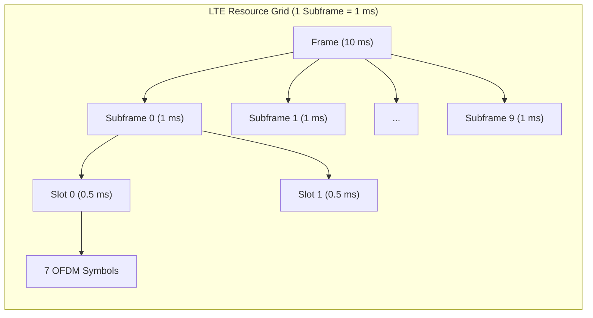
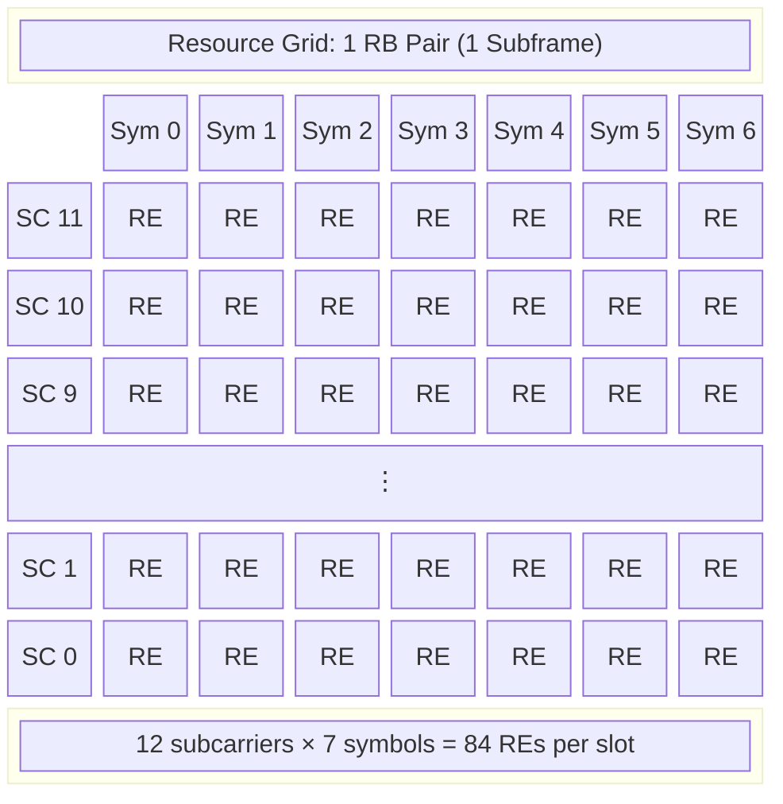
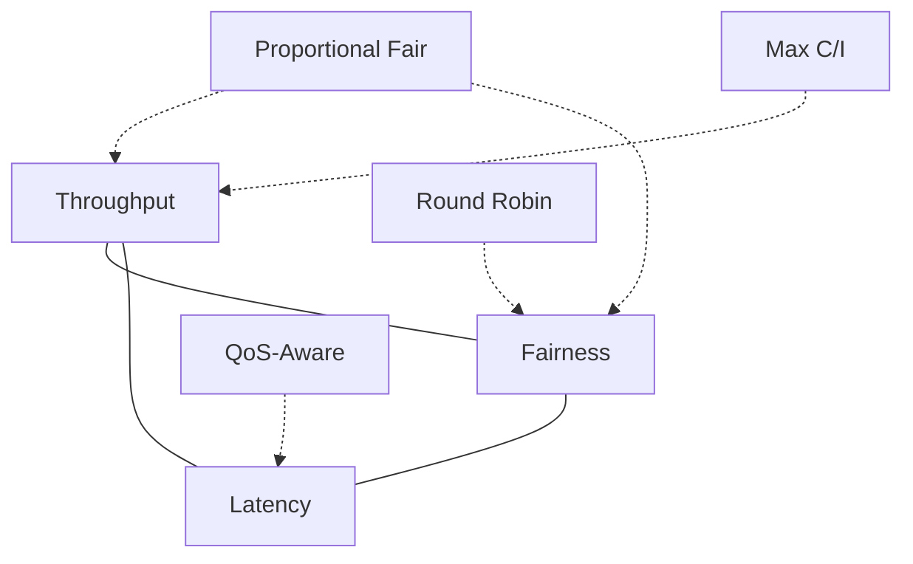

# Module 7: LTE Scheduling

## 1. Why Scheduling Matters

In LTE, the radio channel is a **shared resource**. Multiple users compete for limited time-frequency resources on the same carrier. The scheduler is the central intelligence at the eNodeB that decides:

- **Who** gets to transmit/receive
- **When** (which subframe)
- **Where** (which resource blocks)
- **How** (which modulation and coding scheme)

Without scheduling, users would collide, resources would be wasted, and QoS guarantees would be impossible. The scheduler must balance:

- **Throughput maximization** — use resources efficiently
- **Fairness** — don't starve cell-edge users
- **Latency** — meet delay budgets for real-time services
- **QoS** — honor GBR (Guaranteed Bit Rate) bearers

---

## 2. The LTE Resource Grid

The resource grid is the fundamental 2D structure that organizes all LTE transmissions in time and frequency.

### Time Domain Hierarchy

| Structure | Duration | Composition |
|-----------|----------|-------------|
| Radio Frame | 10 ms | 10 subframes |
| Subframe | 1 ms | 2 slots |
| Slot | 0.5 ms | 7 OFDM symbols (normal CP) |
| OFDM Symbol | ~71.4 µs | 1 symbol period + cyclic prefix |

### Frequency Domain Hierarchy

| Structure | Bandwidth | Composition |
|-----------|-----------|-------------|
| Subcarrier | 15 kHz | Smallest frequency unit |
| Resource Block (RB) | 180 kHz | 12 subcarriers |
| System Bandwidth | 1.4–20 MHz | 6–100 RBs |

### Key Definitions

- **Resource Element (RE):** 1 subcarrier × 1 OFDM symbol — the smallest allocatable unit
- **Resource Block (RB):** 12 subcarriers × 7 symbols = **84 REs** (one slot)
- **Resource Block Pair:** 12 subcarriers × 14 symbols = **168 REs** (one subframe / TTI)

### Resource Grid Visualization





---

## 3. Scheduling Granularity

| Parameter | Value |
|-----------|-------|
| **Time granularity** | 1 subframe = 1 ms (Transmission Time Interval, TTI) |
| **Frequency granularity** | 1 Resource Block = 180 kHz (12 subcarriers) |
| **Minimum allocation** | 1 RB pair per TTI per user |
| **Maximum allocation** | All RBs in a TTI to one user |
| **Scheduling decision rate** | 1000 decisions/second |

The scheduler makes a fresh decision every TTI (1 ms), assigning RBs to UEs based on channel conditions, buffer status, QoS requirements, and fairness metrics.

---

## 4. Downlink Scheduling

### Overview

The eNodeB scheduler controls all downlink resource assignments. It informs UEs of their allocations via **DCI (Downlink Control Information)** messages carried on the **PDCCH (Physical Downlink Control Channel)**.

### DCI Contents

A DCI message tells the UE:
- Which RBs are allocated (resource assignment)
- Which MCS to use for decoding
- HARQ process number and redundancy version
- Power control commands
- MIMO-related parameters (precoding, layers)

### Resource Allocation Types

| Type | Method | Flexibility | Overhead |
|------|--------|-------------|----------|
| **Type 0** | Bitmap of RB Groups (RBGs) | Distributed, non-contiguous | Medium |
| **Type 1** | Subset + shift + bitmap | Distributed within subset | Higher |
| **Type 2** | Start RB + length (RIV) | Contiguous only | Lowest |

**RBG size** depends on system bandwidth:

| System BW (RBs) | RBG Size (RBs) |
|-----------------|----------------|
| 6 | 1 |
| 15 | 2 |
| 25 | 2 |
| 50 | 3 |
| 75 | 4 |
| 100 | 4 |

### MCS Selection

The scheduler selects MCS based on:
1. UE reports **CQI** (Channel Quality Indicator)
2. Scheduler maps CQI → appropriate MCS index
3. Applies outer-loop adjustments based on ACK/NACK history
4. Encodes DCI with selected MCS for the UE to decode PDSCH

---

## 5. Uplink Scheduling

### Key Differences from Downlink

Unlike downlink, uplink scheduling must account for:
- **SC-FDMA constraint:** UEs must be allocated **contiguous** RBs (single-carrier property)
- **UE power limitations:** Distance from eNodeB affects achievable rate
- **Buffer awareness:** eNodeB doesn't directly know UE buffer status

### Scheduling Grant

The eNodeB sends an **uplink grant** via DCI (Format 0/4) on PDCCH, containing:
- RB allocation (contiguous)
- MCS index
- Power control command
- HARQ information

### Buffer Status Reports (BSR)

UEs inform the eNodeB about queued data via BSR:

| BSR Type | Trigger |
|----------|---------|
| **Regular BSR** | New data arrives in a logical channel group with higher priority than currently reported |
| **Periodic BSR** | Timer-based periodic reporting |
| **Padding BSR** | Sent when UL grant has spare capacity |

BSR reports data volume per **Logical Channel Group (LCG)**, allowing priority-aware scheduling.

### Power Headroom Report (PHR)

PHR tells the eNodeB how much **additional transmit power** the UE has available:

$$PH = P_{MAX} - P_{PUSCH}$$

- If PH > 0: UE can support higher MCS or more RBs
- If PH ≤ 0: UE is power-limited, scheduler should reduce allocation

### SC-FDMA Contiguous Allocation

```
Frequency →
┌──┬──┬──┬──┬──┬──┬──┬──┬──┬──┐
│  │UE│UE│UE│  │  │  │  │  │  │  ← Valid (contiguous)
└──┴──┴──┴──┴──┴──┴──┴──┴──┴──┘

┌──┬──┬──┬──┬──┬──┬──┬──┬──┬──┐
│  │UE│  │UE│  │  │UE│  │  │  │  ← INVALID (non-contiguous)
└──┴──┴──┴──┴──┴──┴──┴──┴──┴──┘
```

---

## 6. Channel Quality Indicator (CQI)

### What CQI Represents

CQI is a **4-bit index** (1–15) reported by the UE indicating the highest MCS that can be received with a transport block error rate (BLER) ≤ **10%**.

CQI = 0 means "out of range" (channel too poor for any transmission).

### CQI Table (3GPP TS 36.213, Table 7.2.3-1)

| CQI Index | Modulation | Code Rate × 1024 | Spectral Efficiency (bps/Hz) |
|-----------|------------|-------------------|------------------------------|
| 1 | QPSK | 78 | 0.1523 |
| 2 | QPSK | 120 | 0.2344 |
| 3 | QPSK | 193 | 0.3770 |
| 4 | QPSK | 308 | 0.6016 |
| 5 | QPSK | 449 | 0.8770 |
| 6 | QPSK | 602 | 1.1758 |
| 7 | 16QAM | 378 | 1.4766 |
| 8 | 16QAM | 490 | 1.9141 |
| 9 | 16QAM | 616 | 2.4063 |
| 10 | 64QAM | 466 | 2.7305 |
| 11 | 64QAM | 567 | 3.3223 |
| 12 | 64QAM | 666 | 3.9023 |
| 13 | 64QAM | 772 | 4.5234 |
| 14 | 64QAM | 873 | 5.1152 |
| 15 | 64QAM | 948 | 5.5547 |

### Wideband vs Subband CQI

| Reporting Mode | Description | Use Case |
|---------------|-------------|----------|
| **Wideband CQI** | Single CQI for entire bandwidth | Low overhead, coarse adaptation |
| **Subband CQI** | CQI per group of RBs | Frequency-selective scheduling, higher gain |
| **UE-selected subband** | UE reports best-M subbands | Compromise between overhead and gain |

Subband CQI enables **frequency-selective scheduling**, where the scheduler assigns each UE the RBs where their channel is best.

---

## 7. Link Adaptation

### Adaptive Modulation and Coding (AMC)

AMC dynamically adjusts the modulation order and code rate to match instantaneous channel conditions:

- **Good channel** → Higher-order modulation + higher code rate → More bits/RE
- **Poor channel** → Lower-order modulation + lower code rate → Fewer bits/RE but robust

### Modulation Schemes

| Modulation | Bits per Symbol | Required SNR (approx.) | Usage |
|------------|----------------|------------------------|-------|
| QPSK | 2 | < 10 dB | Cell-edge users |
| 16QAM | 4 | 10–17 dB | Mid-range users |
| 64QAM | 6 | 17–25 dB | Near-cell users |
| 256QAM | 8 | > 25 dB | Cat-11+ (Rel-12), best conditions |

### MCS Index Table (3GPP TS 36.213, Table 7.1.7.1-1)

| MCS Index | Modulation Order | TBS Index | Notes |
|-----------|-----------------|-----------|-------|
| 0 | 2 (QPSK) | 0 | Lowest rate |
| 1 | 2 (QPSK) | 1 | |
| 2 | 2 (QPSK) | 2 | |
| 3 | 2 (QPSK) | 3 | |
| 4 | 2 (QPSK) | 4 | |
| 5 | 2 (QPSK) | 5 | |
| 6 | 2 (QPSK) | 6 | |
| 7 | 2 (QPSK) | 7 | |
| 8 | 2 (QPSK) | 8 | |
| 9 | 2 (QPSK) | 9 | |
| 10 | 4 (16QAM) | 9 | Modulation transition |
| 11 | 4 (16QAM) | 10 | |
| 12 | 4 (16QAM) | 11 | |
| 13 | 4 (16QAM) | 12 | |
| 14 | 4 (16QAM) | 13 | |
| 15 | 4 (16QAM) | 14 | |
| 16 | 4 (16QAM) | 15 | |
| 17 | 6 (64QAM) | 15 | Modulation transition |
| 18 | 6 (64QAM) | 16 | |
| 19 | 6 (64QAM) | 17 | |
| 20 | 6 (64QAM) | 18 | |
| 21 | 6 (64QAM) | 19 | |
| 22 | 6 (64QAM) | 20 | |
| 23 | 6 (64QAM) | 21 | |
| 24 | 6 (64QAM) | 22 | |
| 25 | 6 (64QAM) | 23 | |
| 26 | 6 (64QAM) | 24 | |
| 27 | 6 (64QAM) | 25 | |
| 28 | 6 (64QAM) | 26 | Highest rate |
| 29 | 2 (QPSK) | — | Reserved (retx) |
| 30 | 4 (16QAM) | — | Reserved (retx) |
| 31 | 6 (64QAM) | — | Reserved (retx) |

### Outer Loop Link Adaptation (OLLA)

The inner loop (CQI → MCS) can be inaccurate due to:
- CQI reporting delay
- UE measurement errors
- Interference variability

**OLLA** adjusts the effective CQI with an offset:

$$MCS_{effective} = f(CQI + \Delta_{OLLA})$$

The offset is updated based on HARQ feedback:
- **ACK received:** Δ_OLLA += step_up (e.g., +0.1 dB) → try higher MCS
- **NACK received:** Δ_OLLA -= step_down (e.g., -1.0 dB) → fall back to lower MCS

Target: maintain **10% BLER** at first transmission (ratio step_down/step_up ≈ 9:1).

---

## 8. HARQ (Hybrid Automatic Repeat Request)

### Overview

HARQ combines **FEC (Forward Error Correction)** with **ARQ (retransmission)** for reliable delivery with low latency.

### LTE HARQ Parameters

| Parameter | Downlink | Uplink |
|-----------|----------|--------|
| Type | Asynchronous | Synchronous |
| # Processes | 8 | 8 |
| Timing | Flexible retx subframe | Fixed: retx at n+8 |
| Feedback | ACK/NACK on PUCCH/PUSCH | PHICH (ACK/NACK) |
| RTT | 8 ms | 8 ms |

### Stop-and-Wait with 8 Processes

Each process handles one transport block at a time (stop-and-wait). With **8 parallel processes**, the pipeline stays full:

```
Time (ms):  0   1   2   3   4   5   6   7   8   9   10  11
Process:    P0  P1  P2  P3  P4  P5  P6  P7  P0  P1  P2  P3
                                            ↑
                                         P0 retx (if NACK at t=4)
```

**RTT = 8 ms:** UE receives at time t → decodes → sends ACK/NACK at t+4 → eNB receives → retransmits at t+8.

### Combining Methods

| Method | Description | Advantage |
|--------|-------------|-----------|
| **Chase Combining (CC)** | Retransmit identical bits, soft-combine at receiver | Simple, ~3 dB gain |
| **Incremental Redundancy (IR)** | Retransmit different redundancy version (new parity bits) | Higher coding gain, better performance |

LTE uses **incremental redundancy** by default with 4 redundancy versions (RV 0, 2, 3, 1).

---

## 9. Scheduling Algorithms

### Round Robin (RR)

**Principle:** Allocate equal resources to all users in turn.

$$\text{User}_{selected}(t) = (t \mod N_{users})$$

| Pros | Cons |
|------|------|
| Simple to implement | Ignores channel conditions |
| Perfectly fair in resources | Unfair in throughput (edge users get less) |
| No feedback required | Poor spectral efficiency |
| Low computational cost | No QoS differentiation |

### Proportional Fair (PF)

**Principle:** Maximize the ratio of instantaneous rate to average throughput.

$$\text{User}_{selected} = \arg\max_k \frac{R_k^{inst}(t)}{\bar{R}_k(t)}$$

Where:
- $R_k^{inst}(t)$ = instantaneous achievable rate for user k (from CQI)
- $\bar{R}_k(t)$ = exponential moving average of user k's throughput

Average update:
$$\bar{R}_k(t+1) = (1-\frac{1}{t_c})\bar{R}_k(t) + \frac{1}{t_c} \cdot r_k(t)$$

where $t_c$ is the averaging window (typically 100–1000 TTIs).

| Pros | Cons |
|------|------|
| Exploits multi-user diversity | More complex |
| Good throughput-fairness balance | Requires CQI feedback |
| Schedules users on their peaks | Tuning tc affects behavior |
| Maximizes sum log(throughput) | Not optimal for strict delay |

### Maximum C/I (Max Throughput)

**Principle:** Always schedule the user with the best channel.

$$\text{User}_{selected} = \arg\max_k R_k^{inst}(t)$$

| Pros | Cons |
|------|------|
| Maximizes cell throughput | Starves cell-edge users |
| Best spectral efficiency | Extremely unfair |
| Simple decision | Violates QoS for weak users |

### QoS-Aware Scheduling

**Principle:** Guarantee minimum rates for GBR bearers, prioritize by QCI.

Steps:
1. **Satisfy GBR bearers first** — allocate minimum required RBs
2. **Priority ordering** — rank by QCI priority level
3. **Remaining resources** — distribute via PF among non-GBR bearers
4. **Delay budget check** — boost priority for packets approaching deadline

---

## 10. Engineering Trade-offs

### The Scheduling Trilemma



| Algorithm | Throughput | Fairness | Latency | Complexity |
|-----------|-----------|----------|---------|------------|
| Round Robin | Low | High (resource) | Medium | Very Low |
| Proportional Fair | High | Medium | Medium | Medium |
| Max C/I | Highest | Very Low | Low (for best users) | Low |
| QoS-Aware | Medium-High | Configurable | Guaranteed | High |

### Design Considerations

| Factor | Impact on Scheduling |
|--------|---------------------|
| **User density** | More users → more multi-user diversity → PF gains increase |
| **Traffic type** | VoLTE needs strict latency; FTP tolerates delay |
| **Cell size** | Large cells → big CQI spread → fairness more critical |
| **Frequency band** | Higher bands → more path loss variation → more scheduling gain |
| **MIMO mode** | MU-MIMO allows co-scheduling users on same RBs |

---

## 11. Numerical Example

### System Parameters

- **Bandwidth:** 10 MHz → **50 RBs** available per TTI
- **Users:** 5 UEs with different channel conditions
- **Overhead:** Assume 10 data symbols per subframe (after control/reference signals)

### User CQI and Spectral Efficiency

| User | CQI | Modulation | Spectral Efficiency (bps/Hz) | Bits per RB per TTI |
|------|-----|------------|------------------------------|---------------------|
| UE1 | 4 | QPSK | 0.6016 | 0.6016 × 180kHz × 1ms = 108 |
| UE2 | 7 | 16QAM | 1.4766 | 1.4766 × 180kHz × 1ms = 266 |
| UE3 | 10 | 64QAM | 2.7305 | 2.7305 × 180kHz × 1ms = 491 |
| UE4 | 13 | 64QAM | 4.5234 | 4.5234 × 180kHz × 1ms = 814 |
| UE5 | 15 | 64QAM | 5.5547 | 5.5547 × 180kHz × 1ms = 1000 |

> **Note:** Bits per RB per TTI ≈ Spectral Efficiency × 12 subcarriers × 15 kHz spacing × 1 ms ≈ SE × 180 (simplified; actual TBS lookup gives discrete values).

### Round Robin Allocation

Each user gets equal RBs: **50 RBs ÷ 5 users = 10 RBs/user**

| User | RBs | Throughput per TTI | Throughput (Mbps) |
|------|-----|-------------------|-------------------|
| UE1 | 10 | 10 × 108 = 1,080 bits | 1.08 |
| UE2 | 10 | 10 × 266 = 2,660 bits | 2.66 |
| UE3 | 10 | 10 × 491 = 4,910 bits | 4.91 |
| UE4 | 10 | 10 × 814 = 8,140 bits | 8.14 |
| UE5 | 10 | 10 × 1,000 = 10,000 bits | 10.00 |
| **Total** | **50** | **26,790 bits** | **26.79** |

**Jain's Fairness Index (resource):** 1.0 (perfectly fair in RBs)  
**Jain's Fairness Index (throughput):** ~0.69

### Maximum C/I Allocation

All 50 RBs go to UE5 (best channel):

| User | RBs | Throughput (Mbps) |
|------|-----|-------------------|
| UE1 | 0 | 0 |
| UE2 | 0 | 0 |
| UE3 | 0 | 0 |
| UE4 | 0 | 0 |
| UE5 | 50 | 50.00 |
| **Total** | **50** | **50.00** |

**Cell throughput:** 50 Mbps (maximum possible)  
**Jain's Fairness Index:** 0.20 (worst case for 5 users)

### Proportional Fair Allocation

Assuming all users start with equal average throughput, PF initially behaves like Max C/I. After convergence, it balances by scheduling users on their relative peaks.

**Steady-state approximation** (PF tends toward equal throughput in log domain):

The PF scheduler approximately equalizes $\log(\bar{R}_k)$, leading to a throughput distribution between RR and Max C/I:

| User | Approx. RBs | Throughput (Mbps) | Metric (R_inst/R_avg) |
|------|-------------|-------------------|-----------------------|
| UE1 | 15 | 1.62 | Boosted (low R_avg) |
| UE2 | 12 | 3.19 | Moderate |
| UE3 | 10 | 4.91 | Baseline |
| UE4 | 8 | 6.51 | Slightly reduced |
| UE5 | 5 | 5.00 | Reduced (high R_avg) |
| **Total** | **50** | **21.23** | — |

> **Note:** Exact PF allocation depends on fading dynamics and tc window. In flat-fading (no frequency selectivity), PF gives more resources to weaker users over time. With frequency-selective fading, all users benefit from being scheduled on their best subbands.

### Comparison Summary

| Metric | Round Robin | Max C/I | Proportional Fair |
|--------|------------|---------|-------------------|
| Cell Throughput (Mbps) | 26.79 | 50.00 | ~21–35 |
| UE1 Throughput (Mbps) | 1.08 | 0 | ~1.6 |
| UE5 Throughput (Mbps) | 10.00 | 50.00 | ~5.0 |
| Fairness (Jain's, resource) | 1.0 | 0.20 | ~0.75 |
| Spectral Efficiency | Low | Maximum | High |
| Starvation? | No | Yes (4 users) | No |

---

## Key Takeaways

1. **The resource grid** is a time-frequency matrix — scheduling operates at RB granularity every 1 ms TTI
2. **CQI feedback** is the scheduler's eyes — it drives MCS selection and resource allocation
3. **HARQ** provides reliability with 8 parallel processes and 8 ms RTT
4. **Link adaptation (AMC + OLLA)** continuously matches rate to channel conditions
5. **No single algorithm wins** — the choice depends on deployment scenario, traffic mix, and operator priorities
6. **Proportional Fair** is the de-facto standard in commercial networks as it provides a good throughput-fairness compromise
7. **SC-FDMA** constrains uplink to contiguous allocation, limiting scheduling flexibility compared to downlink OFDMA

---

## References

- 3GPP TS 36.213: Physical layer procedures (CQI/MCS tables)
- 3GPP TS 36.321: MAC protocol (BSR, PHR, HARQ)
- 3GPP TS 36.212: Multiplexing and channel coding (TBS tables)
- Sesia, Toufik, Baker: "LTE – The UMTS Long Term Evolution" (Wiley)
