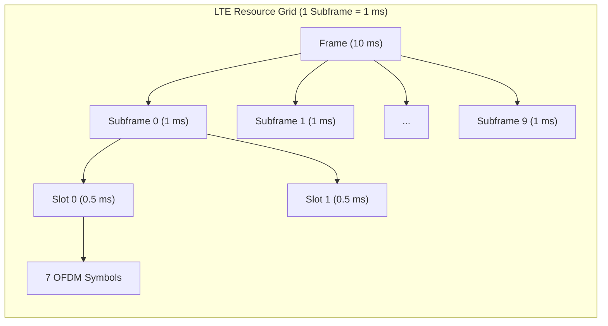
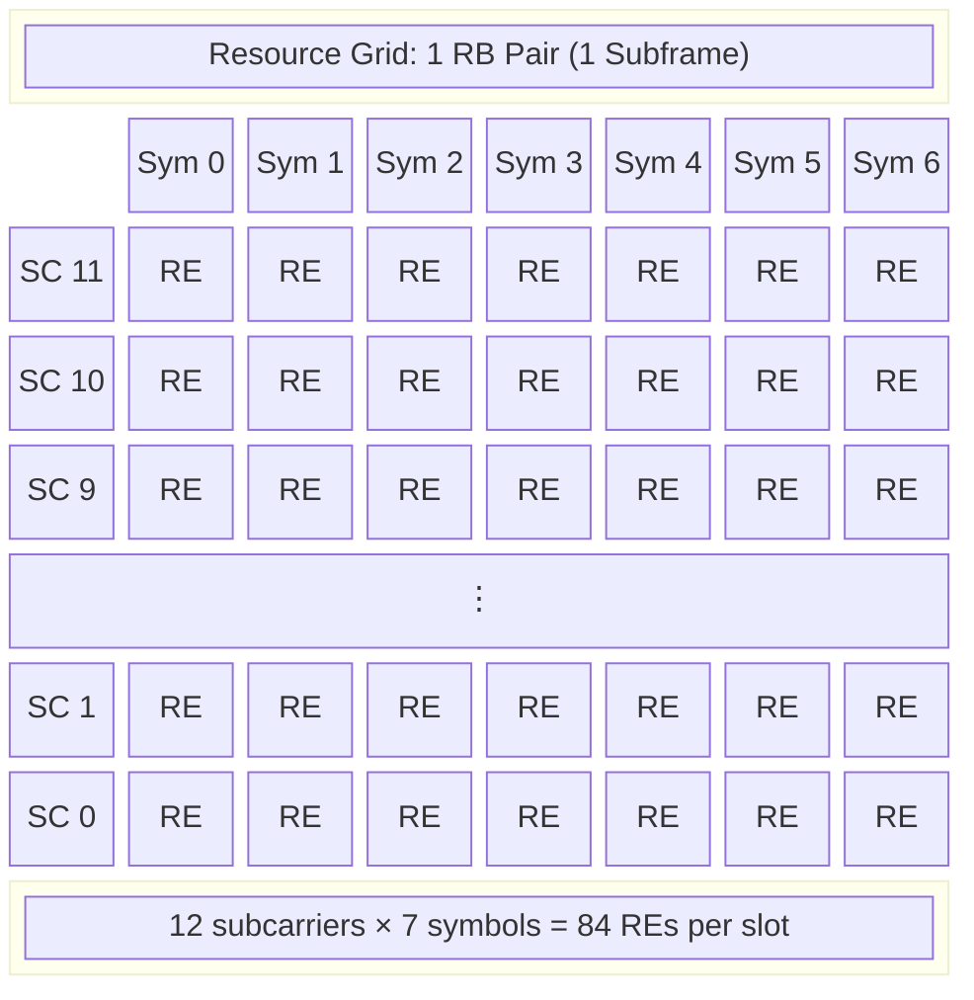
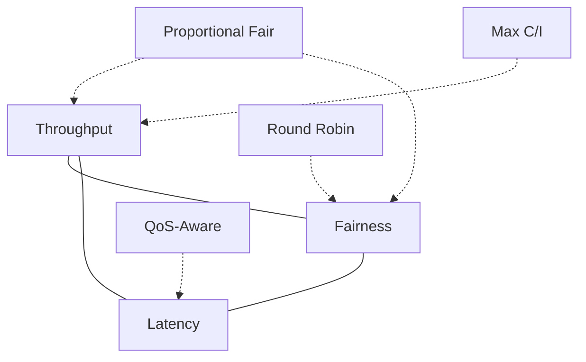

# ماژول 7: زمان‌بندی LTE

## 1. چرا زمان‌بندی اهمیت دارد

در LTE، کانال رادیویی یک **منبع مشترک** است. چندین کاربر برای منابع محدود زمان-فرکانس روی همان حامل رقابت می‌کنند. زمان‌بند، هوش مرکزی در eNodeB است که تصمیم می‌گیرد:

- **چه کسی** اجازه ارسال/دریافت دارد
- **چه زمانی** (کدام زیرفریم)
- **کجا** (کدام بلوک‌های منبع)
- **چگونه** (کدام طرح مدولاسیون و کدگذاری)

بدون زمان‌بندی، کاربران با هم برخورد می‌کردند، منابع هدر می‌رفت و تضمین QoS غیرممکن بود. زمان‌بند باید توازن برقرار کند بین:

- **بیشینه‌سازی توان عملیاتی** — استفاده کارآمد از منابع
- **انصاف** — گرسنه نگذاشتن کاربران لبه سلول
- **تأخیر** — برآورده‌کردن بودجه تأخیر برای خدمات بلادرنگ
- **QoS** — احترام به حامل‌های GBR (نرخ بیت تضمین‌شده)

---

## 2. شبکه منابع LTE

شبکه منابع ساختار دو-بعدی بنیادی است که تمام ارسال‌های LTE را در زمان و فرکانس سازماندهی می‌کند.

### سلسله‌مراتب دامنه زمان

| ساختار | مدت | ترکیب |
|-----------|----------|-------------|
| فریم رادیویی | 10 ms | 10 زیرفریم |
| زیرفریم | 1 ms | 2 شکاف |
| شکاف | 0.5 ms | 7 نماد OFDM (CP معمولی) |
| نماد OFDM | حدود 71.4 µs | 1 دوره نماد + پیشوند چرخه‌ای |

### سلسله‌مراتب دامنه فرکانس

| ساختار | پهنای باند | ترکیب |
|-----------|-----------|-------------|
| زیرحامل | 15 kHz | کوچک‌ترین واحد فرکانسی |
| بلوک منبع (RB) | 180 kHz | 12 زیرحامل |
| پهنای باند سیستم | 1.4–20 MHz | 6–100 RB |

### تعاریف کلیدی

- **عنصر منبع (RE):** 1 زیرحامل × 1 نماد OFDM — کوچک‌ترین واحد قابل تخصیص
- **بلوک منبع (RB):** 12 زیرحامل × 7 نماد = **84 RE** (یک شکاف)
- **جفت بلوک منبع:** 12 زیرحامل × 14 نماد = **168 RE** (یک زیرفریم / TTI)

### تجسم شبکه منابع





---

## 3. دانه‌بندی زمان‌بندی

| پارامتر | مقدار |
|-----------|-------|
| **دانه‌بندی زمان** | 1 زیرفریم = 1 ms (فاصله زمانی انتقال، TTI) |
| **دانه‌بندی فرکانس** | 1 بلوک منبع = 180 kHz (12 زیرحامل) |
| **حداقل تخصیص** | 1 جفت RB در هر TTI برای هر کاربر |
| **حداکثر تخصیص** | تمام RBها در یک TTI به یک کاربر |
| **نرخ تصمیم زمان‌بندی** | 1000 تصمیم در ثانیه |

زمان‌بند در هر TTI (1 ms) تصمیم تازه‌ای می‌گیرد و RBها را به UEها بر اساس شرایط کانال، وضعیت بافر، نیازمندی‌های QoS و متریک‌های انصاف تخصیص می‌دهد.

---

## 4. زمان‌بندی پیوند پایین‌سو

### مرور

زمان‌بند eNodeB تمام تخصیص‌های منابع پیوند پایین‌سو را کنترل می‌کند. UEها را از تخصیص‌های خود از طریق پیام‌های **DCI (اطلاعات کنترل پیوند پایین‌سو)** که روی **PDCCH (کانال کنترل فیزیکی پیوند پایین‌سو)** حمل می‌شوند مطلع می‌کند.

### محتوای DCI

پیام DCI به UE می‌گوید:
- کدام RBها تخصیص یافته‌اند (تخصیص منابع)
- از کدام MCS برای رمزگشایی استفاده کند
- شماره فرآیند HARQ و نسخه افزونگی
- فرمان‌های کنترل توان
- پارامترهای مرتبط با MIMO (پیش‌کدگذاری، لایه‌ها)

### انواع تخصیص منابع

| نوع | روش | انعطاف‌پذیری | سربار |
|------|--------|-------------|----------|
| **نوع 0** | نگاشت بیتی گروه‌های RB (RBGها) | توزیع‌شده، غیرپیوسته | متوسط |
| **نوع 1** | زیرمجموعه + شیفت + نگاشت بیتی | توزیع‌شده درون زیرمجموعه | بالاتر |
| **نوع 2** | RB شروع + طول (RIV) | فقط پیوسته | کمترین |

**اندازه RBG** به پهنای باند سیستم بستگی دارد:

| BW سیستم (RB) | اندازه RBG (RB) |
|-----------------|----------------|
| 6 | 1 |
| 15 | 2 |
| 25 | 2 |
| 50 | 3 |
| 75 | 4 |
| 100 | 4 |

### انتخاب MCS

زمان‌بند MCS را بر اساس موارد زیر انتخاب می‌کند:
1. UE مقدار **CQI** (نشانگر کیفیت کانال) را گزارش می‌دهد
2. زمان‌بند CQI را به شاخص MCS مناسب نگاشت می‌کند
3. تنظیمات حلقه بیرونی را بر اساس تاریخچه ACK/NACK اعمال می‌کند
4. DCI را با MCS انتخاب‌شده کدگذاری می‌کند تا UE بتواند PDSCH را رمزگشایی کند

---

## 5. زمان‌بندی پیوند بالاسو

### تفاوت‌های کلیدی با پیوند پایین‌سو

برخلاف پیوند پایین‌سو، زمان‌بندی پیوند بالاسو باید موارد زیر را در نظر بگیرد:
- **محدودیت SC-FDMA:** UEها باید RBهای **پیوسته** تخصیص یابند (خاصیت تک-حامله)
- **محدودیت‌های توان UE:** فاصله از eNodeB بر نرخ قابل دستیابی تأثیر می‌گذارد
- **آگاهی از بافر:** eNodeB به‌طور مستقیم وضعیت بافر UE را نمی‌داند

### اعطای زمان‌بندی

eNodeB یک **اعطای پیوند بالاسو** از طریق DCI (قالب 0/4) روی PDCCH می‌فرستد که شامل موارد زیر است:
- تخصیص RB (پیوسته)
- شاخص MCS
- فرمان کنترل توان
- اطلاعات HARQ

### گزارش‌های وضعیت بافر (BSR)

UEها از طریق BSR به eNodeB درباره داده در صف اطلاع می‌دهند:

| نوع BSR | محرک |
|----------|---------|
| **BSR عادی** | داده جدید در یک گروه کانال منطقی با اولویت بالاتر از گزارش‌شده فعلی می‌رسد |
| **BSR دوره‌ای** | گزارش‌دهی دوره‌ای مبتنی بر تایمر |
| **BSR حاشیه‌ای** | هنگام وجود ظرفیت اضافی در اعطای UL ارسال می‌شود |

BSR حجم داده را در هر **گروه کانال منطقی (LCG)** گزارش می‌دهد و زمان‌بندی آگاه به اولویت را ممکن می‌سازد.

### گزارش حاشیه توان (PHR)

PHR به eNodeB می‌گوید UE چقدر **توان ارسال اضافی** در دسترس دارد:

$$PH = P_{MAX} - P_{PUSCH}$$

- اگر PH > 0: UE می‌تواند MCS بالاتر یا RBهای بیشتر را پشتیبانی کند
- اگر PH ≤ 0: UE محدود به توان است، زمان‌بند باید تخصیص را کاهش دهد

### تخصیص پیوسته SC-FDMA

```
Frequency →
┌──┬──┬──┬──┬──┬──┬──┬──┬──┬──┐
│  │UE│UE│UE│  │  │  │  │  │  │  ← Valid (contiguous)
└──┴──┴──┴──┴──┴──┴──┴──┴──┴──┘

┌──┬──┬──┬──┬──┬──┬──┬──┬──┬──┐
│  │UE│  │UE│  │  │UE│  │  │  │  ← INVALID (non-contiguous)
└──┴──┴──┴──┴──┴──┴──┴──┴──┴──┘
```

---

## 6. نشانگر کیفیت کانال (CQI)

### CQI چه چیزی را نمایندگی می‌کند

CQI یک **شاخص 4 بیتی** (1–15) است که توسط UE گزارش می‌شود و بالاترین MCS قابل دریافت با نرخ خطای بلوک انتقال (BLER) ≤ **10%** را نشان می‌دهد.

CQI = 0 به معنای «خارج از محدوده» است (کانال برای هر ارسالی بسیار ضعیف است).

### جدول CQI (3GPP TS 36.213، جدول 7.2.3-1)

| شاخص CQI | مدولاسیون | نرخ کد × 1024 | کارایی طیفی (bps/Hz) |
|-----------|------------|-------------------|------------------------------|
| 1 | QPSK | 78 | 0.1523 |
| 2 | QPSK | 120 | 0.2344 |
| 3 | QPSK | 193 | 0.3770 |
| 4 | QPSK | 308 | 0.6016 |
| 5 | QPSK | 449 | 0.8770 |
| 6 | QPSK | 602 | 1.1758 |
| 7 | 16QAM | 378 | 1.4766 |
| 8 | 16QAM | 490 | 1.9141 |
| 9 | 16QAM | 616 | 2.4063 |
| 10 | 64QAM | 466 | 2.7305 |
| 11 | 64QAM | 567 | 3.3223 |
| 12 | 64QAM | 666 | 3.9023 |
| 13 | 64QAM | 772 | 4.5234 |
| 14 | 64QAM | 873 | 5.1152 |
| 15 | 64QAM | 948 | 5.5547 |

### CQI پهن‌باند در برابر زیرباند

| حالت گزارش‌دهی | توضیح | مورد استفاده |
|---------------|-------------|----------|
| **CQI پهن‌باند** | یک CQI برای کل پهنای باند | سربار پایین، تطبیق درشت |
| **CQI زیرباند** | CQI در هر گروه RB | زمان‌بندی انتخاب-فرکانسی، بهره بالاتر |
| **زیرباند انتخاب‌شده توسط UE** | UE بهترین M زیرباند را گزارش می‌دهد | سازش بین سربار و بهره |

CQI زیرباند **زمان‌بندی انتخاب-فرکانسی** را ممکن می‌سازد، که در آن زمان‌بند به هر UE RBهایی را تخصیص می‌دهد که کانال‌شان در آن‌ها بهترین است.

---

## 7. تطبیق پیوند

### مدولاسیون و کدگذاری تطبیقی (AMC)

AMC به‌صورت پویا مرتبه مدولاسیون و نرخ کد را برای تطبیق با شرایط لحظه‌ای کانال تنظیم می‌کند:

- **کانال خوب** ← مدولاسیون مرتبه بالاتر + نرخ کد بالاتر ← بیت بیشتر در هر RE
- **کانال ضعیف** ← مدولاسیون مرتبه پایین‌تر + نرخ کد پایین‌تر ← بیت کمتر در هر RE اما مقاوم

### طرح‌های مدولاسیون

| مدولاسیون | بیت در هر نماد | SNR مورد نیاز (تقریبی) | کاربرد |
|------------|----------------|------------------------|-------|
| QPSK | 2 | < 10 dB | کاربران لبه سلول |
| 16QAM | 4 | 10–17 dB | کاربران میانه |
| 64QAM | 6 | 17–25 dB | کاربران نزدیک سلول |
| 256QAM | 8 | > 25 dB | Cat-11+ (Rel-12)، بهترین شرایط |

### جدول شاخص MCS (3GPP TS 36.213، جدول 7.1.7.1-1)

| شاخص MCS | مرتبه مدولاسیون | شاخص TBS | یادداشت |
|-----------|-----------------|-----------|-------|
| 0 | 2 (QPSK) | 0 | کمترین نرخ |
| 1 | 2 (QPSK) | 1 | |
| 2 | 2 (QPSK) | 2 | |
| 3 | 2 (QPSK) | 3 | |
| 4 | 2 (QPSK) | 4 | |
| 5 | 2 (QPSK) | 5 | |
| 6 | 2 (QPSK) | 6 | |
| 7 | 2 (QPSK) | 7 | |
| 8 | 2 (QPSK) | 8 | |
| 9 | 2 (QPSK) | 9 | |
| 10 | 4 (16QAM) | 9 | گذار مدولاسیون |
| 11 | 4 (16QAM) | 10 | |
| 12 | 4 (16QAM) | 11 | |
| 13 | 4 (16QAM) | 12 | |
| 14 | 4 (16QAM) | 13 | |
| 15 | 4 (16QAM) | 14 | |
| 16 | 4 (16QAM) | 15 | |
| 17 | 6 (64QAM) | 15 | گذار مدولاسیون |
| 18 | 6 (64QAM) | 16 | |
| 19 | 6 (64QAM) | 17 | |
| 20 | 6 (64QAM) | 18 | |
| 21 | 6 (64QAM) | 19 | |
| 22 | 6 (64QAM) | 20 | |
| 23 | 6 (64QAM) | 21 | |
| 24 | 6 (64QAM) | 22 | |
| 25 | 6 (64QAM) | 23 | |
| 26 | 6 (64QAM) | 24 | |
| 27 | 6 (64QAM) | 25 | |
| 28 | 6 (64QAM) | 26 | بالاترین نرخ |
| 29 | 2 (QPSK) | — | رزروشده (بازارسال) |
| 30 | 4 (16QAM) | — | رزروشده (بازارسال) |
| 31 | 6 (64QAM) | — | رزروشده (بازارسال) |

### تطبیق پیوند حلقه بیرونی (OLLA)

حلقه داخلی (CQI ← MCS) ممکن است به دلایل زیر نادقیق باشد:
- تأخیر گزارش‌دهی CQI
- خطاهای اندازه‌گیری UE
- تغییرپذیری تداخل

**OLLA** CQI مؤثر را با یک آفست تنظیم می‌کند:

$$MCS_{effective} = f(CQI + \Delta_{OLLA})$$

آفست بر اساس بازخورد HARQ به‌روزرسانی می‌شود:
- **ACK دریافت شد:** Δ_OLLA += step_up (مثلاً +0.1 dB) ← امتحان MCS بالاتر
- **NACK دریافت شد:** Δ_OLLA -= step_down (مثلاً -1.0 dB) ← بازگشت به MCS پایین‌تر

هدف: حفظ **BLER 10%** در اولین ارسال (نسبت step_down/step_up حدود 9:1).

---

## 8. HARQ (درخواست تکرار خودکار ترکیبی)

### مرور

HARQ **FEC (تصحیح خطای پیشرو)** را با **ARQ (بازارسال)** برای تحویل قابل اعتماد با تأخیر کم ترکیب می‌کند.

### پارامترهای HARQ در LTE

| پارامتر | پیوند پایین‌سو | پیوند بالاسو |
|-----------|----------|--------|
| نوع | ناهمگام | همگام |
| تعداد فرآیندها | 8 | 8 |
| زمان‌بندی | زیرفریم بازارسال انعطاف‌پذیر | ثابت: بازارسال در n+8 |
| بازخورد | ACK/NACK روی PUCCH/PUSCH | PHICH (ACK/NACK) |
| RTT | 8 ms | 8 ms |

### توقف-و-انتظار با 8 فرآیند

هر فرآیند در هر زمان یک بلوک انتقال را مدیریت می‌کند (توقف-و-انتظار). با **8 فرآیند موازی**، خط لوله پر می‌ماند:

```
Time (ms):  0   1   2   3   4   5   6   7   8   9   10  11
Process:    P0  P1  P2  P3  P4  P5  P6  P7  P0  P1  P2  P3
                                            ↑
                                         P0 retx (if NACK at t=4)
```

**RTT = 8 ms:** UE در زمان t دریافت می‌کند ← رمزگشایی ← ارسال ACK/NACK در t+4 ← eNB دریافت می‌کند ← بازارسال در t+8.

### روش‌های ترکیب

| روش | توضیح | مزیت |
|--------|-------------|-----------|
| **ترکیب Chase (CC)** | ارسال مجدد بیت‌های یکسان، ترکیب نرم در گیرنده | ساده، بهره حدود 3 dB |
| **افزونگی افزایشی (IR)** | ارسال مجدد نسخه افزونگی متفاوت (بیت‌های توازن جدید) | بهره کدگذاری بالاتر، عملکرد بهتر |

LTE به‌طور پیش‌فرض از **افزونگی افزایشی** با 4 نسخه افزونگی استفاده می‌کند (RV 0، 2، 3، 1).

---

## 9. الگوریتم‌های زمان‌بندی

### Round Robin (RR)

**اصل:** تخصیص منابع برابر به همه کاربران به‌نوبت.

$$\text{User}_{selected}(t) = (t \mod N_{users})$$

| مزایا | معایب |
|------|------|
| ساده برای پیاده‌سازی | شرایط کانال را نادیده می‌گیرد |
| کاملاً منصفانه در منابع | ناعادلانه در توان عملیاتی (کاربران لبه کمتر می‌گیرند) |
| بدون نیاز به بازخورد | کارایی طیفی ضعیف |
| هزینه محاسباتی پایین | بدون تمایز QoS |

### Proportional Fair (PF)

**اصل:** بیشینه‌سازی نسبت نرخ لحظه‌ای به توان عملیاتی میانگین.

$$\text{User}_{selected} = \arg\max_k \frac{R_k^{inst}(t)}{\bar{R}_k(t)}$$

که در آن:
- $R_k^{inst}(t)$ = نرخ قابل دستیابی لحظه‌ای برای کاربر k (از CQI)
- $\bar{R}_k(t)$ = میانگین متحرک نمایی توان عملیاتی کاربر k

به‌روزرسانی میانگین:
$$\bar{R}_k(t+1) = (1-\frac{1}{t_c})\bar{R}_k(t) + \frac{1}{t_c} \cdot r_k(t)$$

که در آن $t_c$ پنجره میانگین‌گیری است (معمولاً 100–1000 TTI).

| مزایا | معایب |
|------|------|
| بهره‌گیری از تنوع چند-کاربری | پیچیده‌تر |
| توازن خوب توان عملیاتی-انصاف | نیازمند بازخورد CQI |
| زمان‌بندی کاربران در اوج‌هایشان | تنظیم tc بر رفتار تأثیر می‌گذارد |
| بیشینه‌سازی مجموع log(توان عملیاتی) | برای تأخیر سخت بهینه نیست |

### حداکثر C/I (حداکثر توان عملیاتی)

**اصل:** همیشه کاربری با بهترین کانال را زمان‌بندی کن.

$$\text{User}_{selected} = \arg\max_k R_k^{inst}(t)$$

| مزایا | معایب |
|------|------|
| بیشینه‌سازی توان عملیاتی سلول | کاربران لبه سلول را گرسنه می‌گذارد |
| بهترین کارایی طیفی | بسیار ناعادلانه |
| تصمیم ساده | نقض QoS برای کاربران ضعیف |

### زمان‌بندی آگاه به QoS

**اصل:** تضمین نرخ‌های حداقلی برای حامل‌های GBR، اولویت‌بندی بر اساس QCI.

گام‌ها:
1. **ابتدا حامل‌های GBR را برآورده کن** — RBهای حداقل مورد نیاز را تخصیص بده
2. **ترتیب اولویت** — رتبه‌بندی بر اساس سطح اولویت QCI
3. **منابع باقیمانده** — توزیع از طریق PF بین حامل‌های غیر-GBR
4. **بررسی بودجه تأخیر** — افزایش اولویت برای بسته‌های نزدیک به مهلت

---

## 10. مبادلات مهندسی

### سه‌گانه زمان‌بندی



| الگوریتم | توان عملیاتی | انصاف | تأخیر | پیچیدگی |
|-----------|-----------|----------|---------|------------|
| Round Robin | پایین | بالا (منبع) | متوسط | بسیار پایین |
| Proportional Fair | بالا | متوسط | متوسط | متوسط |
| Max C/I | بالاترین | بسیار پایین | پایین (برای بهترین کاربران) | پایین |
| آگاه به QoS | متوسط-بالا | قابل پیکربندی | تضمین‌شده | بالا |

### ملاحظات طراحی

| عامل | تأثیر بر زمان‌بندی |
|--------|---------------------|
| **تراکم کاربر** | کاربران بیشتر ← تنوع چند-کاربری بیشتر ← بهره‌های PF افزایش می‌یابد |
| **نوع ترافیک** | VoLTE نیازمند تأخیر سخت است؛ FTP تأخیر را تحمل می‌کند |
| **اندازه سلول** | سلول‌های بزرگ ← پراکندگی CQI زیاد ← انصاف حیاتی‌تر |
| **باند فرکانسی** | باندهای بالاتر ← تغییرپذیری افت مسیر بیشتر ← بهره زمان‌بندی بیشتر |
| **حالت MIMO** | MU-MIMO زمان‌بندی همزمان کاربران روی RBهای یکسان را ممکن می‌سازد |

---

## 11. مثال عددی

### پارامترهای سیستم

- **پهنای باند:** 10 MHz ← **50 RB** در دسترس در هر TTI
- **کاربران:** 5 UE با شرایط کانال متفاوت
- **سربار:** فرض 10 نماد داده در هر زیرفریم (پس از سیگنال‌های کنترل/مرجع)

### CQI و کارایی طیفی کاربران

| کاربر | CQI | مدولاسیون | کارایی طیفی (bps/Hz) | بیت در هر RB در هر TTI |
|------|-----|------------|------------------------------|---------------------|
| UE1 | 4 | QPSK | 0.6016 | 0.6016 × 180kHz × 1ms = 108 |
| UE2 | 7 | 16QAM | 1.4766 | 1.4766 × 180kHz × 1ms = 266 |
| UE3 | 10 | 64QAM | 2.7305 | 2.7305 × 180kHz × 1ms = 491 |
| UE4 | 13 | 64QAM | 4.5234 | 4.5234 × 180kHz × 1ms = 814 |
| UE5 | 15 | 64QAM | 5.5547 | 5.5547 × 180kHz × 1ms = 1000 |

> **یادداشت:** بیت در هر RB در هر TTI ≈ کارایی طیفی × 12 زیرحامل × فاصله 15 kHz × 1 ms ≈ SE × 180 (ساده‌شده؛ جستجوی واقعی TBS مقادیر گسسته می‌دهد).

### تخصیص Round Robin

هر کاربر RBهای برابر می‌گیرد: **50 RB ÷ 5 کاربر = 10 RB برای هر کاربر**

| کاربر | RB | توان عملیاتی در هر TTI | توان عملیاتی (Mbps) |
|------|-----|-------------------|-------------------|
| UE1 | 10 | 10 × 108 = 1,080 بیت | 1.08 |
| UE2 | 10 | 10 × 266 = 2,660 بیت | 2.66 |
| UE3 | 10 | 10 × 491 = 4,910 بیت | 4.91 |
| UE4 | 10 | 10 × 814 = 8,140 بیت | 8.14 |
| UE5 | 10 | 10 × 1,000 = 10,000 بیت | 10.00 |
| **مجموع** | **50** | **26,790 بیت** | **26.79** |

**شاخص انصاف Jain (منبع):** 1.0 (کاملاً منصفانه در RBها)
**شاخص انصاف Jain (توان عملیاتی):** حدود 0.69

### تخصیص حداکثر C/I

تمام 50 RB به UE5 (بهترین کانال) می‌رسد:

| کاربر | RB | توان عملیاتی (Mbps) |
|------|-----|-------------------|
| UE1 | 0 | 0 |
| UE2 | 0 | 0 |
| UE3 | 0 | 0 |
| UE4 | 0 | 0 |
| UE5 | 50 | 50.00 |
| **مجموع** | **50** | **50.00** |

**توان عملیاتی سلول:** 50 Mbps (حداکثر ممکن)
**شاخص انصاف Jain:** 0.20 (بدترین حالت برای 5 کاربر)

### تخصیص Proportional Fair

با فرض شروع همه کاربران با توان عملیاتی میانگین برابر، PF در ابتدا مانند Max C/I رفتار می‌کند. پس از همگرایی، با زمان‌بندی کاربران در اوج‌های نسبی‌شان توازن برقرار می‌کند.

**تقریب حالت پایدار** (PF به سمت توان عملیاتی برابر در دامنه لگاریتمی گرایش دارد):

زمان‌بند PF تقریباً $\log(\bar{R}_k)$ را برابر می‌کند که به توزیع توان عملیاتی بین RR و Max C/I منجر می‌شود:

| کاربر | RB تقریبی | توان عملیاتی (Mbps) | متریک (R_inst/R_avg) |
|------|-------------|-------------------|-----------------------|
| UE1 | 15 | 1.62 | افزایش‌یافته (R_avg پایین) |
| UE2 | 12 | 3.19 | متوسط |
| UE3 | 10 | 4.91 | پایه |
| UE4 | 8 | 6.51 | کمی کاهش‌یافته |
| UE5 | 5 | 5.00 | کاهش‌یافته (R_avg بالا) |
| **مجموع** | **50** | **21.23** | — |

> **یادداشت:** تخصیص دقیق PF به دینامیک محو شدن و پنجره tc بستگی دارد. در محو شدن مسطح (بدون انتخاب‌پذیری فرکانسی)، PF در طول زمان منابع بیشتری به کاربران ضعیف‌تر می‌دهد. با محو شدن انتخاب-فرکانسی، همه کاربران از زمان‌بندی روی بهترین زیرباندهایشان بهره می‌برند.

### خلاصه مقایسه

| متریک | Round Robin | Max C/I | Proportional Fair |
|--------|------------|---------|-------------------|
| توان عملیاتی سلول (Mbps) | 26.79 | 50.00 | حدود 21–35 |
| توان عملیاتی UE1 (Mbps) | 1.08 | 0 | حدود 1.6 |
| توان عملیاتی UE5 (Mbps) | 10.00 | 50.00 | حدود 5.0 |
| انصاف (Jain، منبع) | 1.0 | 0.20 | حدود 0.75 |
| کارایی طیفی | پایین | حداکثر | بالا |
| گرسنگی؟ | خیر | بله (4 کاربر) | خیر |

---

## نکات کلیدی

1. **شبکه منابع** یک ماتریس زمان-فرکانس است — زمان‌بندی در دانه‌بندی RB در هر TTI 1 ms عمل می‌کند
2. **بازخورد CQI** چشمان زمان‌بند است — انتخاب MCS و تخصیص منابع را هدایت می‌کند
3. **HARQ** قابلیت اطمینان را با 8 فرآیند موازی و RTT 8 ms فراهم می‌کند
4. **تطبیق پیوند (AMC + OLLA)** به‌طور پیوسته نرخ را با شرایط کانال تطبیق می‌دهد
5. **هیچ الگوریتم واحدی برنده نیست** — انتخاب به سناریوی استقرار، ترکیب ترافیک و اولویت‌های اپراتور بستگی دارد
6. **Proportional Fair** استاندارد عملی در شبکه‌های تجاری است زیرا سازش خوبی بین توان عملیاتی و انصاف فراهم می‌کند
7. **SC-FDMA** پیوند بالاسو را به تخصیص پیوسته محدود می‌کند و انعطاف زمان‌بندی را نسبت به OFDMA پیوند پایین‌سو کاهش می‌دهد

---

## مراجع

- 3GPP TS 36.213: Physical layer procedures (CQI/MCS tables)
- 3GPP TS 36.321: MAC protocol (BSR, PHR, HARQ)
- 3GPP TS 36.212: Multiplexing and channel coding (TBS tables)
- Sesia, Toufik, Baker: "LTE – The UMTS Long Term Evolution" (Wiley)
