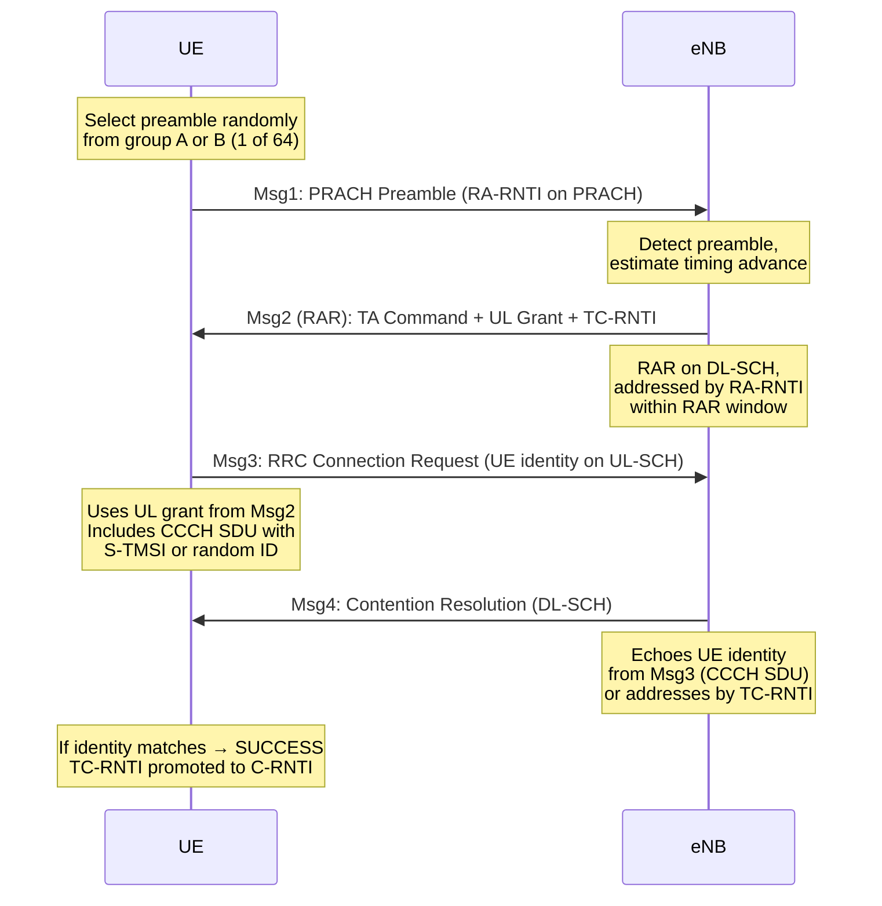
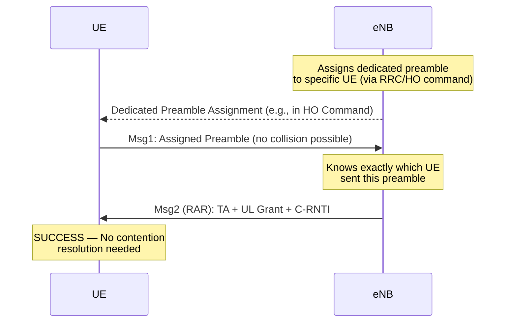
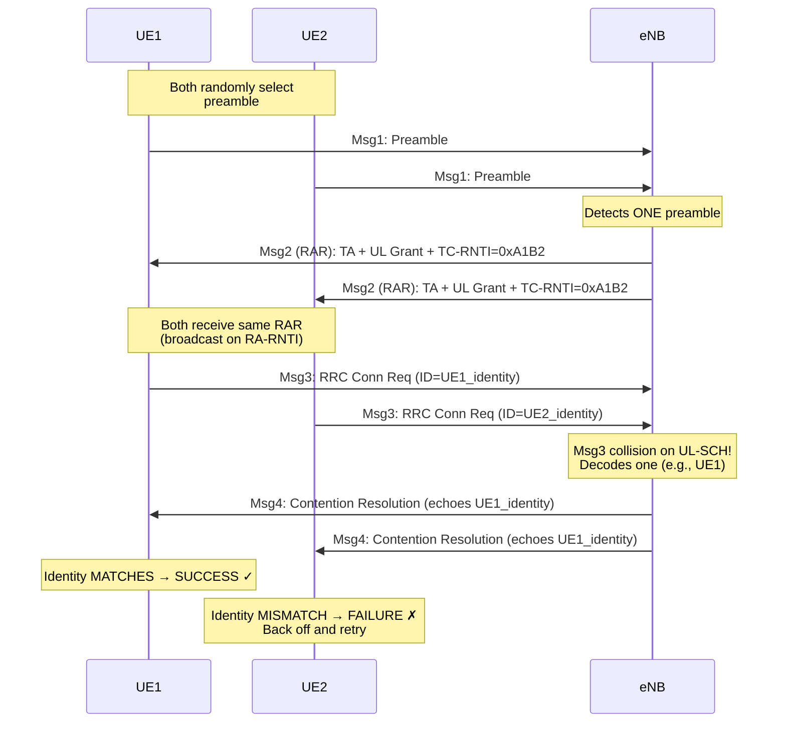

# Module 8: Random Access Channel (RACH)

## 8.1 Why Random Access is Needed

When a UE (User Equipment) powers on or transitions from idle mode, it faces fundamental challenges:

| Challenge | Description |
|-----------|-------------|
| **No uplink timing alignment** | UE doesn't know its propagation delay to the base station |
| **No allocated uplink resources** | UE has no scheduled grants for transmission |
| **No unique identity** | Network hasn't assigned a C-RNTI yet |

### Scenarios Requiring Random Access

1. **Initial Access** — UE powering on, first connection to network
2. **Handover** — Moving to a new cell, need synchronization with target eNodeB (eNB)
3. **DL Data Arrival (Idle Mode)** — UE paged for incoming data, must re-establish UL sync
4. **UL Data Arrival** — UE in connected mode lost UL synchronization
5. **Positioning** — Timing measurements for location services

> **Key Insight:** Random access is the ONLY mechanism for a UE to initiate uplink communication when it has no prior scheduling from the network.

---

## 8.2 PRACH (Physical Random Access Channel)

### Time-Frequency Location in Resource Grid

The PRACH occupies a specific position in the LTE resource grid:

- **Frequency domain:** 6 consecutive PRBs (1.08 MHz bandwidth)
- **Time domain:** Configurable subframes based on PRACH configuration index
- **Location:** Specified by `prach-FreqOffset` (PRB offset from lowest UL PRB)

### PRACH Configuration Index

The configuration index (0–63) determines:
- **Which subframes** carry PRACH opportunities
- **Periodicity** of PRACH occasions (every 1, 2, 5, or 10 ms)
- **Preamble format** used

| Config Index | Preamble Format | Subframe(s) | Density |
|:---:|:---:|:---:|:---:|
| 0 | 0 | 1 | 1 per frame |
| 3 | 0 | 1, 4, 7 | 3 per frame |
| 15 | 0 | 0–9 | 10 per frame |
| 48 | 4 (short) | 1 | 1 per frame |

### Preamble Formats

| Format | Sequence Length (Ts) | CP Length (Ts) | Total Duration | Max Cell Radius |
|:---:|:---:|:---:|:---:|:---:|
| 0 | 24576 (0.8 ms) | 3168 (0.1 ms) | ~1 ms | ~14.5 km |
| 1 | 24576 (0.8 ms) | 21024 (0.68 ms) | ~2 ms | ~77.3 km |
| 2 | 2×24576 (1.6 ms) | 6240 (0.2 ms) | ~2 ms | ~29.5 km |
| 3 | 2×24576 (1.6 ms) | 21024 (0.68 ms) | ~3 ms | ~100.2 km |
| 4 (short) | 4096 (0.13 ms) | 448 (0.015 ms) | ~0.15 ms | ~1.4 km |

> **Design Trade-off:** Longer CP → larger cell radius but fewer PRACH opportunities per frame.

---

## 8.3 Preamble Sequences

### Zadoff-Chu (ZC) Sequences

The PRACH preamble uses Zadoff-Chu sequences defined as:

$$x_u(n) = e^{-j\pi u n(n+1)/N_{ZC}}$$

where:
- $u$ = root sequence index (1 ≤ u ≤ N_ZC − 1)
- $N_{ZC}$ = sequence length (839 for long, 139 for short)

**Why Zadoff-Chu?**

| Property | Benefit |
|----------|---------|
| **Constant amplitude (zero PAPR)** | Maximizes PA efficiency at cell edge |
| **Ideal periodic autocorrelation** | Enables precise timing estimation |
| **Zero cross-correlation between roots** | Different root → zero interference |
| **Flat frequency spectrum** | Robust in frequency-selective channels |

### 64 Preambles Per Cell

Each cell has exactly **64 available preambles**, derived from:

1. **Root Sequence Index** (`rootSequenceIndex`, broadcast in SIB2)
2. **Cyclic Shifts** applied to root sequences

```
Preamble(v) = Cyclic_Shift(x_u, v × N_CS)
```

Where:
- `N_CS` = cyclic shift size (`zeroCorrelationZoneConfig`)
- Number of preambles per root = floor(N_ZC / N_CS)
- Multiple roots used if one root doesn't provide 64 preambles

### Cell Coverage and Cyclic Shift

The cyclic shift `N_CS` determines the **zero-correlation zone**, which must exceed the maximum round-trip delay:

```
N_CS > 2 × d_max / (c × T_s_seq)

Where:
  d_max = maximum cell radius
  c = speed of light (3×10⁸ m/s)
  T_s_seq = sequence sample duration
```

**Example:** For N_CS = 13 (format 0):
- Max distinguishable delay = 13 × (1/1.25MHz) = 10.4 μs
- Max cell radius = 10.4μs × c / 2 ≈ 1.56 km
- Preambles per root = floor(839/13) = 64 → single root sufficient

---


## 8.4 Contention-Based Random Access (4-Step CBRA)

### Procedure Overview



### Step-by-Step Details

#### Step 1 — Msg1: Preamble Transmission

- UE selects a **random preamble** from the available set (contention preambles)
- Transmits on PRACH at configured time-frequency resources
- **RA-RNTI** derived from PRACH occasion: `RA-RNTI = 1 + t_id + 10 × f_id`
  - `t_id` = subframe index (0–9)
  - `f_id` = frequency index (0–5)

#### Step 2 — Msg2: Random Access Response (RAR)

RAR contains (per responding preamble):

| Field | Bits | Purpose |
|-------|:----:|---------|
| Timing Advance | 11 | UL timing correction (0–1282, step = 16×Ts) |
| UL Grant | 20 | Resources for Msg3 |
| TC-RNTI | 16 | Temporary identity |
| Backoff Indicator | 4 | Backoff if overloaded |

- **RAR Window:** 2–10 subframes (configurable by `ra-ResponseWindowSize`)
- If no RAR received → back off and retry

#### Step 3 — Msg3: Scheduled Transmission

- UE transmits on UL-SCH using the grant from Msg2
- Contains **RRC Connection Request** with:
  - UE identity (S-TMSI or random value)
  - Establishment cause
- HARQ enabled (max 5 retransmissions for Msg3)

#### Step 4 — Msg4: Contention Resolution

- eNB echoes the UE identity received in Msg3
- UE checks if the echoed identity matches its own:
  - **Match** → RACH successful, TC-RNTI becomes C-RNTI
  - **No match** → Collision detected, restart from Step 1 with backoff

---

## 8.5 Contention-Free Random Access (CFRA)

### When Used

| Scenario | Reason |
|----------|--------|
| **Handover** | Fast sync needed, can't afford collision delay |
| **DL data arrival (connected)** | eNB knows UE, can pre-assign preamble |
| **Positioning (OTDOA)** | Precise timing required |
| **Beam failure recovery** | Quick recovery needed |

### Procedure



### Key Differences from CBRA

| Aspect | Contention-Based | Contention-Free |
|--------|:---:|:---:|
| Steps | 4 | 2 |
| Preamble selection | Random | Assigned by eNB |
| Collision possible | Yes | No |
| Latency | ~15 ms (success) | ~5 ms |
| Use case | Initial access | Handover, DL data |
| Preamble pool | Shared (e.g., 54) | Dedicated (e.g., 10) |

---


## 8.6 Timing Advance (TA)

### Why Timing Advance is Needed

In OFDMA uplink (SC-FDMA), all UE signals must arrive at the eNB **aligned within the cyclic prefix** to maintain orthogonality:

```
Without TA:
  UE_near:  |----signal----|        ← arrives early
  UE_far:            |----signal----|  ← arrives late (propagation delay)
  
  → Signals overlap into adjacent symbols → ISI/ICI!

With TA:
  UE_near:      |----signal----|     ← transmits later
  UE_far:  |----signal----|          ← transmits earlier
  
  → All signals arrive aligned at eNB receiver
```

### TA Mechanism

**Initial TA (from RAR - Msg2):**
- 11-bit value: 0–1282
- Step size: 16 × Ts = 16 × (1/30.72MHz) ≈ **0.52 μs**
- Represents one-way advance applied to UL transmission

**TA Maintenance (MAC CE - Timing Advance Command):**
- 6-bit value: 0–63
- Applied as: `TA_new = TA_old + (TA_command − 31) × 16 × Ts`
- Sent periodically via MAC Control Element
- If no TA update received within `timeAlignmentTimer` → UL sync lost

### Cell Radius from Timing Advance

The maximum TA corrects for the **round-trip propagation delay**:

```
Round-trip delay = TA_value × 16 × Ts
One-way delay    = TA_value × 16 × Ts / 2
Max distance     = c × one-way delay
```

#### Numerical Example: Maximum Cell Radius

**For initial TA (11-bit, max = 1282):**
```
Max round-trip delay = 1282 × 16 × Ts
                     = 1282 × 16 × (1/30.72×10⁶)
                     = 1282 × 0.5208 μs
                     = 667.7 μs

Max one-way delay    = 667.7 / 2 = 333.8 μs
Max cell radius      = 3×10⁸ × 333.8×10⁻⁶ = 100.1 km
```

**Verification with preamble format:**

| Format | Guard Time (CP) | Max RTD | Max Cell Radius |
|:---:|:---:|:---:|:---:|
| 0 | 99.5 μs (3168×Ts) | 99.5 μs | **14.9 km** |
| 1 | 684.4 μs (21024×Ts) | 684.4 μs | **102.6 km** |
| 2 | 203.1 μs (6240×Ts) | 203.1 μs | **30.5 km** |
| 3 | 684.4 μs (21024×Ts) | 684.4 μs | **102.6 km** |

> **Note:** The actual cell radius is limited by the **smaller** of: TA range OR preamble CP duration.

---


## 8.7 Collisions and Backoff

### Collision Probability

When N UEs simultaneously attempt random access with 64 available preambles:

**Probability that a specific UE collides with at least one other UE:**

$$P_{collision} = 1 - \left(1 - \frac{1}{64}\right)^{N-1}$$

#### Numerical Examples

| N (simultaneous UEs) | P(collision) per UE | Expected colliding UEs |
|:---:|:---:|:---:|
| 2 | 1.56% | 0.03 |
| 5 | 6.10% | 0.31 |
| 10 | 13.0% | 1.30 |
| 20 | 25.5% | 5.10 |
| 30 | 36.8% | 11.0 |
| 50 | 54.0% | 27.0 |
| 64 | 63.2% | 40.4 |

**Example Calculation (N=10):**
```
P(collision) = 1 - (1 - 1/64)^(10-1)
             = 1 - (63/64)^9
             = 1 - (0.98438)^9
             = 1 - 0.8681
             = 0.1319 ≈ 13.2%
```

### Collision Scenario with Resolution



### Backoff Mechanism

When a RACH attempt fails, the UE must wait before retrying:

1. **Backoff Indicator (BI):** Broadcast in RAR subheader
   - Values: 0, 10, 20, 30, 40, 60, 80, 120, 160, 240, 320, 480, 960 ms
   - UE selects random backoff: uniform [0, BI]

2. **Power Ramping:** Each failed attempt increases transmit power
   - Step size: `powerRampingStep` (2 dB typical)
   - `P_PRACH(attempt) = P_initial + (attempt − 1) × powerRampingStep`
   - Maximum: `preambleInitialReceivedTargetPower` + ramping
   - Max attempts: `preambleTransMax` (3, 4, 5, 6, 7, 8, 10, 20, 50, 100, 200)

3. **Preamble re-selection:** New random preamble chosen for each attempt

### RACH Attempt Timeline

```
Attempt 1: |--Msg1--|--wait RAR window--|  (no RAR received)
            |--------backoff [0,BI]--------|
Attempt 2: |--Msg1 (+2dB)--|--wait--|  (RAR received, Msg3 collision)
            |--------backoff [0,BI]--------|
Attempt 3: |--Msg1 (+4dB)--|--Msg2--|--Msg3--|--Msg4--| SUCCESS!
```

---


## 8.8 RACH Overload

### Causes of RACH Overload

| Cause | Description | Scale |
|-------|-------------|-------|
| **M2M/IoT** | Massive simultaneous device activation (e.g., smart meters reporting hourly) | 10,000–30,000 devices |
| **Paging storms** | Major event triggers mass DL data (emergency alert, popular content) | Thousands of UEs |
| **Disaster/emergency** | Everyone calls simultaneously after earthquake/event | Extreme burst |
| **Cell reselection** | Many UEs hand over simultaneously (train, stadium) | Hundreds |
| **Power outage recovery** | All devices reconnect simultaneously | Thousands |

### Overload Symptoms

- High collision rate (>50%)
- Excessive preamble retransmissions → increased interference
- RAR capacity exhausted (limited DL resources for RAR)
- Msg3/Msg4 resource starvation
- Access delays from seconds to minutes

### Solutions

#### Access Class Barring (ACB)

- UEs assigned to Access Classes 0–9 (plus special classes 11–15)
- eNB broadcasts barring factor (0–1) and barring time
- UE draws random number; if > barring factor → barred for barring time
- Spreads access attempts over time

#### Extended Access Barring (EAB)

- For delay-tolerant M2M/IoT devices (AC 0–9)
- eNB broadcasts EAB bitmap (one bit per AC)
- Barred UEs wait for barring to be lifted
- More aggressive than ACB for low-priority traffic

#### Back-off Tuning

- Dynamically increase BI (up to 960 ms) during overload
- Effectively rate-limits RACH attempts
- Trade-off: individual access delay vs. system throughput

#### Additional 3GPP Solutions

| Release | Solution | Mechanism |
|:---:|---------|-----------|
| R10 | ACB | Probabilistic barring |
| R11 | EAB | IoT/M2M specific barring |
| R12 | ACDC | App-level congestion control |
| R13 | Group paging | Reduce paging-triggered RACH |
| R14 | EDT (Early Data Transmission) | Data in Msg3 → fewer full connections |

---

## 8.9 5G NR Random Access

### Key Enhancements over LTE

#### 2-Step RACH (Rel-16): MsgA + MsgB

Combines the 4-step procedure into 2 steps for **ultra-low latency**:

```
4-Step LTE:   Msg1 → Msg2 → Msg3 → Msg4   (~15 ms)
2-Step NR:    MsgA → MsgB                   (~5 ms)

Where:
  MsgA = Preamble (Msg1) + Payload (Msg3)   [sent together on PRACH + PUSCH]
  MsgB = RAR (Msg2) + Contention Resolution (Msg4)   [combined response]
```

**When to use 2-step vs 4-step:**
- 2-step: Small cells, low load, URLLC requirements
- 4-step: Large cells (need TA before UL data), high load scenarios
- Fallback: If MsgB not received → fall back to 4-step

#### Beam-Based RACH (SSB-to-RACH Mapping)

In 5G NR with beamforming, the RACH procedure is **beam-aware**:

```
SSB Index 0 → PRACH Occasion 0 (Beam 0)
SSB Index 1 → PRACH Occasion 1 (Beam 1)
SSB Index 2 → PRACH Occasion 2 (Beam 2)
...
SSB Index N → PRACH Occasion N (Beam N)
```

- UE selects **best SSB beam** (highest RSRP)
- Transmits preamble on **associated RACH occasion**
- gNB knows which beam direction the UE is located → **beam correspondence**
- Enables directional RAR transmission

**Configuration:**
- `ssb-perRACH-OccasionAndCB-PreamblesPerSSB`: maps SSBs to RACH occasions
- Multiple SSBs can share one RACH occasion, or one SSB can span multiple

#### Supplementary Uplink (SUL) RACH

- Lower frequency band (e.g., 700 MHz) for extended coverage
- UE selects SUL PRACH when `rsrp-ThresholdSSB-SUL` condition met
- Separate preamble format and configuration for SUL
- Enables coverage extension without increasing NR UL power

#### NR Preamble Formats

| Format | Sequence Length | Subcarrier Spacing | Use Case |
|:---:|:---:|:---:|:---:|
| 0 | 839 (long) | 1.25 kHz | Large cells (FR1) |
| 1 | 839 (long) | 1.25 kHz | Very large cells |
| 2 | 839 (long) | 1.25 kHz | Extreme coverage |
| 3 | 839 (long) | 5 kHz | Medium cells |
| A1 | 139 (short) | 15/30 kHz | Small cells (FR1) |
| A2 | 139 (short) | 15/30 kHz | Normal cells (FR1) |
| A3 | 139 (short) | 15/30 kHz | Normal cells (FR1) |
| B4 | 139 (short) | 60/120 kHz | FR2 (mmWave) |
| C0 | 139 (short) | 15/30 kHz | Msg3 early TX |
| C2 | 139 (short) | 15/30 kHz | Msg3 early TX |

#### Beam Failure Recovery (BFR)

A special RACH-like procedure in NR:

1. UE detects beam failure (RSRP below threshold for all configured beams)
2. UE selects a **new candidate beam** (from measured SSBs/CSI-RS)
3. UE transmits **dedicated CFRA preamble** on PRACH occasion of new beam
4. gNB responds with BFR response → reconfigure beam pair

---

## 8.10 Summary and Key Equations

### Critical Formulas

| Parameter | Formula |
|-----------|---------|
| Collision probability | $P_c = 1 - (63/64)^{N-1}$ |
| RA-RNTI | $1 + t_{id} + 10 \times f_{id}$ |
| Timing Advance (initial) | $TA = N_{TA} \times 16 \times T_s$ |
| Max cell radius | $d_{max} = c \times N_{TA,max} \times 16 \times T_s / 2$ |
| Power ramping | $P_n = P_{init} + (n-1) \times \Delta_{ramp}$ |
| Preambles per root | $\lfloor N_{ZC} / N_{CS} \rfloor$ |

### Design Trade-offs

```
Coverage ←————————→ Capacity
  (long CP,           (short CP,
   few PRACH,          many PRACH,
   large N_CS)         small N_CS)

Latency ←————————→ Reliability  
  (2-step RACH,       (4-step RACH,
   fewer retries)      power ramping)

Access delay ←————→ Overload protection
  (low backoff)        (high backoff, ACB)
```

---

## Review Questions

1. Why can't the UE simply transmit on PUSCH without performing RACH first?
2. Calculate the collision probability when 25 UEs attempt simultaneous access.
3. What is the maximum cell radius for PRACH format 3? Show your calculation.
4. Explain why contention-free RACH is used during handover instead of contention-based.
5. A cell has `zeroCorrelationZoneConfig` = 11 (N_CS = 15). How many root sequences are needed to generate 64 preambles?
6. Describe the beam failure recovery procedure in 5G NR and its relation to RACH.
7. An IoT network has 10,000 devices that simultaneously attempt RACH. Describe two mechanisms to handle this overload.
8. Compare the latency of 2-step NR RACH vs. 4-step LTE RACH. When would you choose each?

---

## References

- 3GPP TS 36.211 §5.7: Physical Random Access Channel (LTE)
- 3GPP TS 36.213 §6: Random Access Procedure (LTE)
- 3GPP TS 36.321 §5.1: Random Access Procedure (MAC)
- 3GPP TS 38.211 §6.3.3: PRACH (NR)
- 3GPP TS 38.213 §8: Random Access Procedure (NR)
- 3GPP TS 38.321 §5.1: Random Access Procedure (NR MAC)
