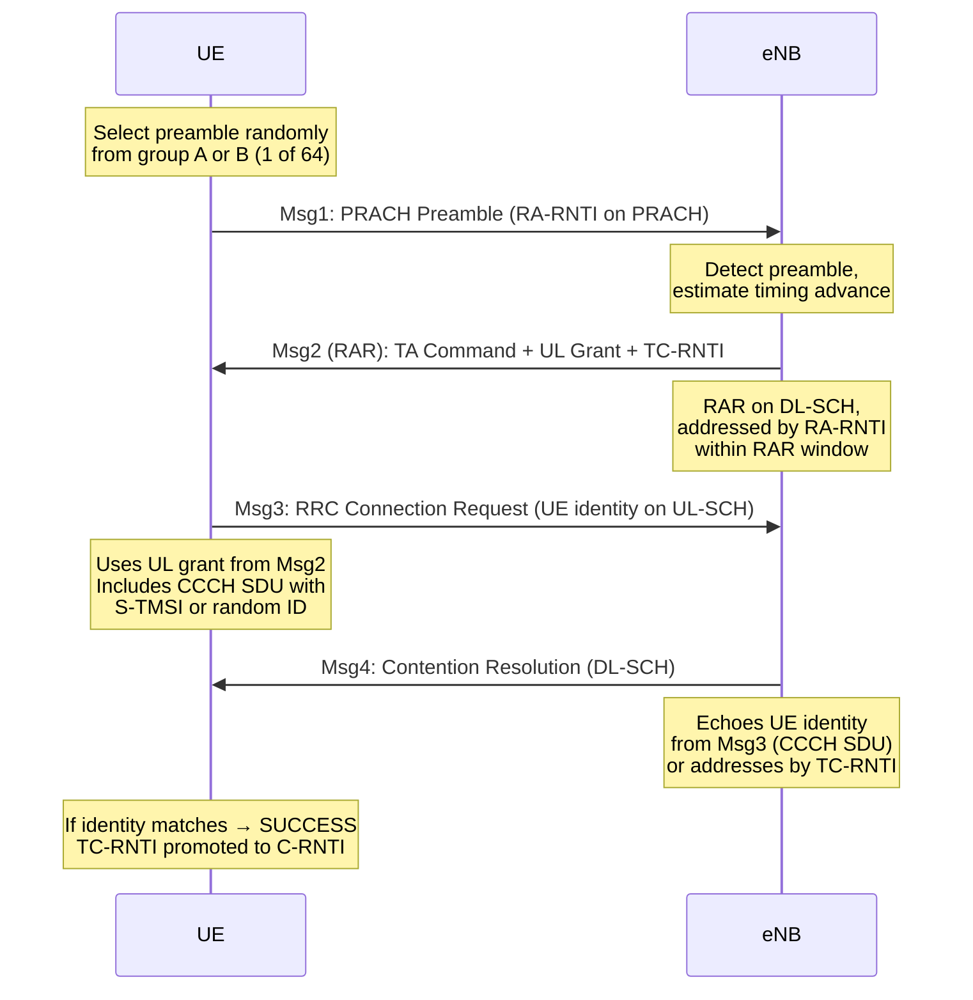
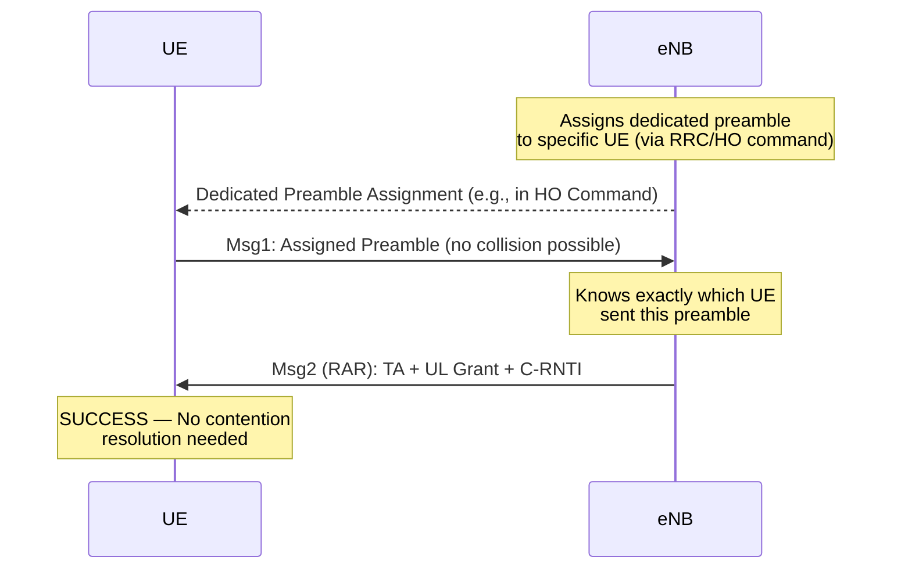
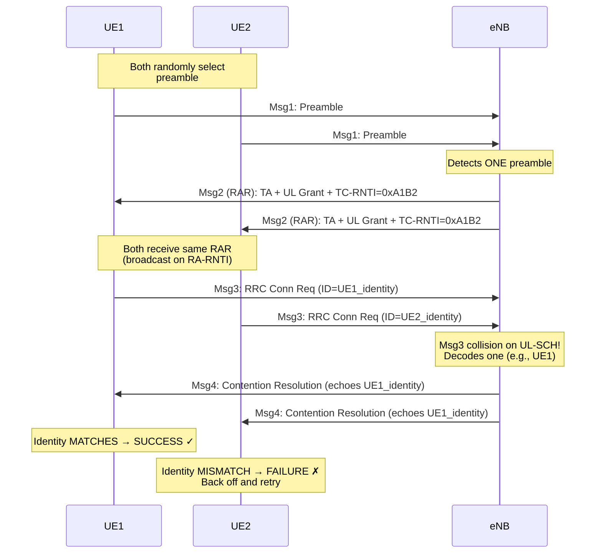

# ماژول 8: کانال دسترسی تصادفی (RACH)

## 8.1 چرا دسترسی تصادفی لازم است

وقتی یک UE (تجهیزات کاربر) روشن می‌شود یا از حالت بیکار خارج می‌شود، با چالش‌های بنیادی روبرو می‌شود:

| چالش | توضیح |
|-----------|-------------|
| **بدون هم‌ترازی زمانی پیوند بالاسو** | UE تأخیر انتشار خود تا ایستگاه پایه را نمی‌داند |
| **بدون منابع پیوند بالاسوی تخصیص‌یافته** | UE هیچ اعطای زمان‌بندی‌شده‌ای برای ارسال ندارد |
| **بدون هویت یکتا** | شبکه هنوز C-RNTI تخصیص نداده است |

### سناریوهای نیازمند دسترسی تصادفی

1. **دسترسی اولیه** — UE روشن می‌شود، اولین اتصال به شبکه
2. **تحویل** — جابه‌جایی به سلول جدید، نیاز به همگام‌سازی با eNodeB (eNB) مقصد
3. **رسیدن داده DL (حالت بیکار)** — UE برای داده ورودی صفحه‌بندی می‌شود، باید همگام‌سازی UL را دوباره برقرار کند
4. **رسیدن داده UL** — UE در حالت متصل همگام‌سازی UL را از دست داده است
5. **مکان‌یابی** — اندازه‌گیری‌های زمان‌بندی برای خدمات مکان

> **نکته کلیدی:** دسترسی تصادفی **تنها** سازوکار برای UE جهت آغاز ارتباط پیوند بالاسو است زمانی که هیچ زمان‌بندی پیشینی از شبکه ندارد.

---

## 8.2 PRACH (کانال دسترسی تصادفی فیزیکی)

### موقعیت زمان-فرکانس در شبکه منابع

PRACH موقعیت مشخصی در شبکه منابع LTE اشغال می‌کند:

- **دامنه فرکانس:** 6 PRB پیوسته (پهنای باند 1.08 MHz)
- **دامنه زمان:** زیرفریم‌های قابل پیکربندی بر اساس شاخص پیکربندی PRACH
- **موقعیت:** مشخص‌شده توسط `prach-FreqOffset` (آفست PRB از پایین‌ترین PRB در UL)

### شاخص پیکربندی PRACH

شاخص پیکربندی (0–63) موارد زیر را تعیین می‌کند:
- **کدام زیرفریم‌ها** فرصت‌های PRACH را حمل می‌کنند
- **دوره‌تناوب** فرصت‌های PRACH (هر 1، 2، 5 یا 10 ms)
- **قالب پیشوند** مورد استفاده

| شاخص پیکربندی | قالب پیشوند | زیرفریم(ها) | چگالی |
|:---:|:---:|:---:|:---:|
| 0 | 0 | 1 | 1 در هر فریم |
| 3 | 0 | 1، 4، 7 | 3 در هر فریم |
| 15 | 0 | 0–9 | 10 در هر فریم |
| 48 | 4 (کوتاه) | 1 | 1 در هر فریم |

### قالب‌های پیشوند

| قالب | طول توالی (Ts) | طول CP (Ts) | مدت کل | حداکثر شعاع سلول |
|:---:|:---:|:---:|:---:|:---:|
| 0 | 24576 (0.8 ms) | 3168 (0.1 ms) | حدود 1 ms | حدود 14.5 km |
| 1 | 24576 (0.8 ms) | 21024 (0.68 ms) | حدود 2 ms | حدود 77.3 km |
| 2 | 2×24576 (1.6 ms) | 6240 (0.2 ms) | حدود 2 ms | حدود 29.5 km |
| 3 | 2×24576 (1.6 ms) | 21024 (0.68 ms) | حدود 3 ms | حدود 100.2 km |
| 4 (کوتاه) | 4096 (0.13 ms) | 448 (0.015 ms) | حدود 0.15 ms | حدود 1.4 km |

> **مبادله طراحی:** CP طولانی‌تر ← شعاع سلول بزرگ‌تر اما فرصت‌های PRACH کمتر در هر فریم.

---

## 8.3 توالی‌های پیشوند

### توالی‌های Zadoff-Chu (ZC)

پیشوند PRACH از توالی‌های Zadoff-Chu استفاده می‌کند که به‌صورت زیر تعریف می‌شوند:

$$x_u(n) = e^{-j\pi u n(n+1)/N_{ZC}}$$

که در آن:
- $u$ = شاخص توالی ریشه (1 ≤ u ≤ N_ZC − 1)
- $N_{ZC}$ = طول توالی (839 برای بلند، 139 برای کوتاه)

**چرا Zadoff-Chu؟**

| ویژگی | مزیت |
|----------|---------|
| **دامنه ثابت (PAPR صفر)** | کارایی PA را در لبه سلول بیشینه می‌کند |
| **خودهمبستگی دوره‌ای ایده‌آل** | تخمین دقیق زمان‌بندی را ممکن می‌سازد |
| **همبستگی متقابل صفر بین ریشه‌ها** | ریشه متفاوت ← تداخل صفر |
| **طیف فرکانسی مسطح** | مقاوم در کانال‌های انتخاب-فرکانسی |

### 64 پیشوند در هر سلول

هر سلول دقیقاً **64 پیشوند در دسترس** دارد که از موارد زیر مشتق می‌شود:

1. **شاخص توالی ریشه** (`rootSequenceIndex`، پخش‌شده در SIB2)
2. **شیفت‌های چرخه‌ای** اعمال‌شده بر توالی‌های ریشه

```
Preamble(v) = Cyclic_Shift(x_u, v × N_CS)
```

که در آن:
- `N_CS` = اندازه شیفت چرخه‌ای (`zeroCorrelationZoneConfig`)
- تعداد پیشوند در هر ریشه = floor(N_ZC / N_CS)
- اگر یک ریشه 64 پیشوند فراهم نکند، چندین ریشه استفاده می‌شود

### پوشش سلول و شیفت چرخه‌ای

شیفت چرخه‌ای `N_CS` **ناحیه همبستگی صفر** را تعیین می‌کند که باید از حداکثر تأخیر رفت-و-برگشت فراتر رود:

```
N_CS > 2 × d_max / (c × T_s_seq)

Where:
  d_max = maximum cell radius
  c = speed of light (3×10⁸ m/s)
  T_s_seq = sequence sample duration
```

**مثال:** برای N_CS = 13 (قالب 0):
- حداکثر تأخیر قابل تشخیص = 13 × (1/1.25MHz) = 10.4 μs
- حداکثر شعاع سلول = 10.4μs × c / 2 ≈ 1.56 km
- پیشوند در هر ریشه = floor(839/13) = 64 ← یک ریشه کافی است

---


## 8.4 دسترسی تصادفی مبتنی بر رقابت (CBRA 4-گام)

### مرور رویه



### جزئیات گام-به-گام

#### گام 1 — Msg1: ارسال پیشوند

- UE یک **پیشوند تصادفی** از مجموعه در دسترس انتخاب می‌کند (پیشوندهای رقابتی)
- روی PRACH در منابع زمان-فرکانس پیکربندی‌شده ارسال می‌کند
- **RA-RNTI** مشتق‌شده از فرصت PRACH: `RA-RNTI = 1 + t_id + 10 × f_id`
  - `t_id` = شاخص زیرفریم (0–9)
  - `f_id` = شاخص فرکانس (0–5)

#### گام 2 — Msg2: پاسخ دسترسی تصادفی (RAR)

RAR شامل موارد زیر است (به‌ازای هر پیشوند پاسخ‌داده‌شده):

| فیلد | بیت | هدف |
|-------|:----:|---------|
| پیشروی زمانی | 11 | تصحیح زمان‌بندی UL (0–1282، گام = 16×Ts) |
| اعطای UL | 20 | منابع برای Msg3 |
| TC-RNTI | 16 | هویت موقت |
| نشانگر عقب‌نشینی | 4 | عقب‌نشینی در صورت اضافه‌بار |

- **پنجره RAR:** 2–10 زیرفریم (قابل پیکربندی با `ra-ResponseWindowSize`)
- اگر RAR دریافت نشد ← عقب‌نشینی و تلاش مجدد

#### گام 3 — Msg3: ارسال زمان‌بندی‌شده

- UE روی UL-SCH با استفاده از اعطای Msg2 ارسال می‌کند
- شامل **RRC Connection Request** با موارد زیر است:
  - هویت UE (S-TMSI یا مقدار تصادفی)
  - علت برقراری
- HARQ فعال است (حداکثر 5 بازارسال برای Msg3)

#### گام 4 — Msg4: حل رقابت

- eNB هویت UE دریافت‌شده در Msg3 را بازمی‌گرداند
- UE بررسی می‌کند که آیا هویت بازگردانده‌شده با هویت خودش مطابقت دارد:
  - **مطابقت** ← RACH موفق، TC-RNTI به C-RNTI تبدیل می‌شود
  - **عدم مطابقت** ← برخورد تشخیص داده شد، از گام 1 با عقب‌نشینی دوباره شروع کن

---

## 8.5 دسترسی تصادفی بدون رقابت (CFRA)

### چه زمانی استفاده می‌شود

| سناریو | دلیل |
|----------|--------|
| **تحویل** | همگام‌سازی سریع لازم است، تأخیر برخورد قابل قبول نیست |
| **رسیدن داده DL (متصل)** | eNB UE را می‌شناسد، می‌تواند پیشوند را پیش‌تخصیص دهد |
| **مکان‌یابی (OTDOA)** | زمان‌بندی دقیق لازم است |
| **بازیابی شکست پرتو** | بازیابی سریع لازم است |

### رویه



### تفاوت‌های کلیدی با CBRA

| جنبه | مبتنی بر رقابت | بدون رقابت |
|--------|:---:|:---:|
| گام‌ها | 4 | 2 |
| انتخاب پیشوند | تصادفی | تخصیص‌یافته توسط eNB |
| برخورد ممکن | بله | خیر |
| تأخیر | حدود 15 ms (موفق) | حدود 5 ms |
| مورد استفاده | دسترسی اولیه | تحویل، داده DL |
| استخر پیشوند | مشترک (مثلاً 54) | اختصاصی (مثلاً 10) |

---


## 8.6 پیشروی زمانی (TA)

### چرا پیشروی زمانی لازم است

در پیوند بالاسوی OFDMA (SC-FDMA)، همه سیگنال‌های UE باید **درون پیشوند چرخه‌ای هم‌تراز** به eNB برسند تا تعامد حفظ شود:

```
Without TA:
  UE_near:  |----signal----|        ← arrives early
  UE_far:            |----signal----|  ← arrives late (propagation delay)
  
  → Signals overlap into adjacent symbols → ISI/ICI!

With TA:
  UE_near:      |----signal----|     ← transmits later
  UE_far:  |----signal----|          ← transmits earlier
  
  → All signals arrive aligned at eNB receiver
```

### سازوکار TA

**TA اولیه (از RAR - Msg2):**
- مقدار 11 بیتی: 0–1282
- اندازه گام: 16 × Ts = 16 × (1/30.72MHz) ≈ **0.52 μs**
- نشان‌دهنده پیشروی یک‌طرفه اعمال‌شده بر ارسال UL است

**نگهداری TA (MAC CE - فرمان پیشروی زمانی):**
- مقدار 6 بیتی: 0–63
- به‌صورت زیر اعمال می‌شود: `TA_new = TA_old + (TA_command − 31) × 16 × Ts`
- به‌صورت دوره‌ای از طریق عنصر کنترل MAC ارسال می‌شود
- اگر به‌روزرسانی TA در `timeAlignmentTimer` دریافت نشود ← همگام‌سازی UL از دست می‌رود

### شعاع سلول از پیشروی زمانی

حداکثر TA **تأخیر انتشار رفت-و-برگشت** را تصحیح می‌کند:

```
Round-trip delay = TA_value × 16 × Ts
One-way delay    = TA_value × 16 × Ts / 2
Max distance     = c × one-way delay
```

#### مثال عددی: حداکثر شعاع سلول

**برای TA اولیه (11 بیتی، حداکثر = 1282):**
```
Max round-trip delay = 1282 × 16 × Ts
                     = 1282 × 16 × (1/30.72×10⁶)
                     = 1282 × 0.5208 μs
                     = 667.7 μs

Max one-way delay    = 667.7 / 2 = 333.8 μs
Max cell radius      = 3×10⁸ × 333.8×10⁻⁶ = 100.1 km
```

**تأیید با قالب پیشوند:**

| قالب | زمان محافظ (CP) | حداکثر RTD | حداکثر شعاع سلول |
|:---:|:---:|:---:|:---:|
| 0 | 99.5 μs (3168×Ts) | 99.5 μs | **14.9 km** |
| 1 | 684.4 μs (21024×Ts) | 684.4 μs | **102.6 km** |
| 2 | 203.1 μs (6240×Ts) | 203.1 μs | **30.5 km** |
| 3 | 684.4 μs (21024×Ts) | 684.4 μs | **102.6 km** |

> **یادداشت:** شعاع واقعی سلول توسط **کوچک‌ترِ** دو مورد زیر محدود می‌شود: محدوده TA یا مدت CP پیشوند.

---


## 8.7 برخوردها و عقب‌نشینی

### احتمال برخورد

وقتی N کاربر UE به‌طور همزمان تلاش دسترسی تصادفی با 64 پیشوند در دسترس انجام می‌دهند:

**احتمال اینکه یک UE مشخص با حداقل یک UE دیگر برخورد کند:**

$$P_{collision} = 1 - \left(1 - \frac{1}{64}\right)^{N-1}$$

#### مثال‌های عددی

| N (UEهای همزمان) | P(برخورد) در هر UE | UEهای برخوردی مورد انتظار |
|:---:|:---:|:---:|
| 2 | 1.56% | 0.03 |
| 5 | 6.10% | 0.31 |
| 10 | 13.0% | 1.30 |
| 20 | 25.5% | 5.10 |
| 30 | 36.8% | 11.0 |
| 50 | 54.0% | 27.0 |
| 64 | 63.2% | 40.4 |

**مثال محاسبه (N=10):**
```
P(collision) = 1 - (1 - 1/64)^(10-1)
             = 1 - (63/64)^9
             = 1 - (0.98438)^9
             = 1 - 0.8681
             = 0.1319 ≈ 13.2%
```

### سناریوی برخورد با حل آن



### سازوکار عقب‌نشینی

وقتی یک تلاش RACH شکست می‌خورد، UE باید پیش از تلاش مجدد منتظر بماند:

1. **نشانگر عقب‌نشینی (BI):** پخش در زیرسرآیند RAR
   - مقادیر: 0، 10، 20، 30، 40، 60، 80، 120، 160، 240، 320، 480، 960 ms
   - UE عقب‌نشینی تصادفی انتخاب می‌کند: یکنواخت [0, BI]

2. **شیب‌دهی توان:** هر تلاش ناموفق توان ارسال را افزایش می‌دهد
   - اندازه گام: `powerRampingStep` (معمولاً 2 dB)
   - `P_PRACH(attempt) = P_initial + (attempt − 1) × powerRampingStep`
   - حداکثر: `preambleInitialReceivedTargetPower` + شیب‌دهی
   - حداکثر تلاش‌ها: `preambleTransMax` (3، 4، 5، 6، 7، 8، 10، 20، 50، 100، 200)

3. **انتخاب مجدد پیشوند:** پیشوند تصادفی جدید برای هر تلاش انتخاب می‌شود

### خط زمانی تلاش RACH

```
Attempt 1: |--Msg1--|--wait RAR window--|  (no RAR received)
            |--------backoff [0,BI]--------|
Attempt 2: |--Msg1 (+2dB)--|--wait--|  (RAR received, Msg3 collision)
            |--------backoff [0,BI]--------|
Attempt 3: |--Msg1 (+4dB)--|--Msg2--|--Msg3--|--Msg4--| SUCCESS!
```

---


## 8.8 اضافه‌بار RACH

### علل اضافه‌بار RACH

| علت | توضیح | مقیاس |
|-------|-------------|-------|
| **M2M/IoT** | فعال‌سازی انبوه همزمان دستگاه‌ها (مثلاً کنتورهای هوشمند با گزارش ساعتی) | 10,000–30,000 دستگاه |
| **طوفان‌های صفحه‌بندی** | رویداد بزرگ، داده DL انبوه را فعال می‌کند (هشدار اضطراری، محتوای محبوب) | هزاران UE |
| **بلایا/اضطرار** | همه پس از زلزله/رویداد به‌طور همزمان تماس می‌گیرند | انفجار شدید |
| **انتخاب مجدد سلول** | بسیاری از UEها به‌طور همزمان تحویل می‌شوند (قطار، استادیوم) | صدها |
| **بازیابی قطع برق** | همه دستگاه‌ها به‌طور همزمان دوباره متصل می‌شوند | هزاران |

### نشانه‌های اضافه‌بار

- نرخ برخورد بالا (بیش از 50%)
- بازارسال‌های بیش‌ازحد پیشوند ← افزایش تداخل
- ظرفیت RAR تمام‌شده (منابع DL محدود برای RAR)
- گرسنگی منابع Msg3/Msg4
- تأخیرهای دسترسی از چند ثانیه تا چند دقیقه

### راه‌حل‌ها

#### ممنوعیت کلاس دسترسی (ACB)

- UEها به کلاس‌های دسترسی 0–9 تخصیص می‌یابند (به‌علاوه کلاس‌های ویژه 11–15)
- eNB عامل ممنوعیت (0–1) و زمان ممنوعیت را پخش می‌کند
- UE عدد تصادفی می‌کشد؛ اگر > عامل ممنوعیت ← برای مدت زمان ممنوعیت ممنوع می‌شود
- تلاش‌های دسترسی را در طول زمان پخش می‌کند

#### ممنوعیت دسترسی گسترده (EAB)

- برای دستگاه‌های M2M/IoT تحمل‌کننده تأخیر (AC 0–9)
- eNB نگاشت بیتی EAB را پخش می‌کند (یک بیت در هر AC)
- UEهای ممنوع‌شده تا رفع ممنوعیت منتظر می‌مانند
- تهاجمی‌تر از ACB برای ترافیک کم‌اولویت

#### تنظیم عقب‌نشینی

- افزایش پویا BI (تا 960 ms) در حین اضافه‌بار
- تلاش‌های RACH را به‌طور مؤثر محدود می‌کند
- مبادله: تأخیر دسترسی فردی در برابر توان عملیاتی سیستم

#### راه‌حل‌های اضافی 3GPP

| نسخه | راه‌حل | سازوکار |
|:---:|---------|-----------|
| R10 | ACB | ممنوعیت احتمالی |
| R11 | EAB | ممنوعیت مختص IoT/M2M |
| R12 | ACDC | کنترل ازدحام در سطح کاربرد |
| R13 | صفحه‌بندی گروهی | کاهش RACH با محرک صفحه‌بندی |
| R14 | EDT (ارسال داده زودهنگام) | داده در Msg3 ← اتصالات کامل کمتر |

---

## 8.9 دسترسی تصادفی 5G NR

### بهبودهای کلیدی نسبت به LTE

#### RACH 2-گام (Rel-16): MsgA + MsgB

رویه 4-گام را برای **تأخیر فوق‌العاده کم** به 2 گام ترکیب می‌کند:

```
4-Step LTE:   Msg1 → Msg2 → Msg3 → Msg4   (~15 ms)
2-Step NR:    MsgA → MsgB                   (~5 ms)

Where:
  MsgA = Preamble (Msg1) + Payload (Msg3)   [sent together on PRACH + PUSCH]
  MsgB = RAR (Msg2) + Contention Resolution (Msg4)   [combined response]
```

**چه زمانی از 2-گام در برابر 4-گام استفاده شود:**
- 2-گام: سلول‌های کوچک، بار کم، نیازمندی‌های URLLC
- 4-گام: سلول‌های بزرگ (نیاز به TA پیش از داده UL)، سناریوهای بار بالا
- بازگشت: اگر MsgB دریافت نشد ← بازگشت به 4-گام

#### RACH مبتنی بر پرتو (نگاشت SSB به RACH)

در 5G NR با شکل‌دهی پرتو، رویه RACH **آگاه به پرتو** است:

```
SSB Index 0 → PRACH Occasion 0 (Beam 0)
SSB Index 1 → PRACH Occasion 1 (Beam 1)
SSB Index 2 → PRACH Occasion 2 (Beam 2)
...
SSB Index N → PRACH Occasion N (Beam N)
```

- UE **بهترین پرتو SSB** را انتخاب می‌کند (بالاترین RSRP)
- پیشوند را روی **فرصت RACH مرتبط** ارسال می‌کند
- gNB می‌داند UE در کدام جهت پرتو قرار دارد ← **تناظر پرتو**
- ارسال RAR جهت‌دار را ممکن می‌سازد

**پیکربندی:**
- `ssb-perRACH-OccasionAndCB-PreamblesPerSSB`: SSBها را به فرصت‌های RACH نگاشت می‌کند
- چندین SSB می‌توانند یک فرصت RACH را به اشتراک بگذارند، یا یک SSB می‌تواند چندین فرصت را در بر گیرد

#### RACH پیوند بالاسوی تکمیلی (SUL)

- باند فرکانسی پایین‌تر (مثلاً 700 MHz) برای پوشش گسترده
- UE زمانی که شرط `rsrp-ThresholdSSB-SUL` برآورده شود، PRACH در SUL را انتخاب می‌کند
- قالب پیشوند و پیکربندی جداگانه برای SUL
- گسترش پوشش بدون افزایش توان UL در NR را ممکن می‌سازد

#### قالب‌های پیشوند NR

| قالب | طول توالی | فاصله زیرحامل | مورد استفاده |
|:---:|:---:|:---:|:---:|
| 0 | 839 (بلند) | 1.25 kHz | سلول‌های بزرگ (FR1) |
| 1 | 839 (بلند) | 1.25 kHz | سلول‌های بسیار بزرگ |
| 2 | 839 (بلند) | 1.25 kHz | پوشش شدید |
| 3 | 839 (بلند) | 5 kHz | سلول‌های متوسط |
| A1 | 139 (کوتاه) | 15/30 kHz | سلول‌های کوچک (FR1) |
| A2 | 139 (کوتاه) | 15/30 kHz | سلول‌های عادی (FR1) |
| A3 | 139 (کوتاه) | 15/30 kHz | سلول‌های عادی (FR1) |
| B4 | 139 (کوتاه) | 60/120 kHz | FR2 (mmWave) |
| C0 | 139 (کوتاه) | 15/30 kHz | ارسال زودهنگام Msg3 |
| C2 | 139 (کوتاه) | 15/30 kHz | ارسال زودهنگام Msg3 |

#### بازیابی شکست پرتو (BFR)

یک رویه ویژه شبه-RACH در NR:

1. UE شکست پرتو را تشخیص می‌دهد (RSRP زیر آستانه برای تمام پرتوهای پیکربندی‌شده)
2. UE یک **پرتو نامزد جدید** انتخاب می‌کند (از SSBها/CSI-RSهای اندازه‌گیری‌شده)
3. UE **پیشوند CFRA اختصاصی** را روی فرصت PRACH پرتو جدید ارسال می‌کند
4. gNB با پاسخ BFR پاسخ می‌دهد ← پیکربندی مجدد جفت پرتو

---

## 8.10 خلاصه و معادلات کلیدی

### فرمول‌های حیاتی

| پارامتر | فرمول |
|-----------|---------|
| احتمال برخورد | $P_c = 1 - (63/64)^{N-1}$ |
| RA-RNTI | $1 + t_{id} + 10 \times f_{id}$ |
| پیشروی زمانی (اولیه) | $TA = N_{TA} \times 16 \times T_s$ |
| حداکثر شعاع سلول | $d_{max} = c \times N_{TA,max} \times 16 \times T_s / 2$ |
| شیب‌دهی توان | $P_n = P_{init} + (n-1) \times \Delta_{ramp}$ |
| پیشوند در هر ریشه | $\lfloor N_{ZC} / N_{CS} \rfloor$ |

### مبادلات طراحی

```
Coverage ←————————→ Capacity
  (long CP,           (short CP,
   few PRACH,          many PRACH,
   large N_CS)         small N_CS)

Latency ←————————→ Reliability  
  (2-step RACH,       (4-step RACH,
   fewer retries)      power ramping)

Access delay ←————→ Overload protection
  (low backoff)        (high backoff, ACB)
```

---

## پرسش‌های مرور

1. چرا UE نمی‌تواند به‌سادگی بدون انجام اولین RACH روی PUSCH ارسال کند؟
2. احتمال برخورد را وقتی 25 UE تلاش دسترسی همزمان می‌کنند محاسبه کنید.
3. حداکثر شعاع سلول برای قالب PRACH 3 چقدر است؟ محاسبه خود را نشان دهید.
4. توضیح دهید چرا در حین تحویل از RACH بدون رقابت به‌جای مبتنی بر رقابت استفاده می‌شود.
5. یک سلول `zeroCorrelationZoneConfig` = 11 (N_CS = 15) دارد. چند توالی ریشه برای تولید 64 پیشوند لازم است؟
6. رویه بازیابی شکست پرتو در 5G NR و رابطه آن با RACH را توصیف کنید.
7. یک شبکه IoT دارای 10,000 دستگاه است که به‌طور همزمان تلاش RACH می‌کنند. دو سازوکار برای مدیریت این اضافه‌بار توصیف کنید.
8. تأخیر RACH 2-گام در NR را با RACH 4-گام در LTE مقایسه کنید. چه زمانی هر یک را انتخاب می‌کنید؟

---

## مراجع

- 3GPP TS 36.211 §5.7: Physical Random Access Channel (LTE)
- 3GPP TS 36.213 §6: Random Access Procedure (LTE)
- 3GPP TS 36.321 §5.1: Random Access Procedure (MAC)
- 3GPP TS 38.211 §6.3.3: PRACH (NR)
- 3GPP TS 38.213 §8: Random Access Procedure (NR)
- 3GPP TS 38.321 §5.1: Random Access Procedure (NR MAC)
