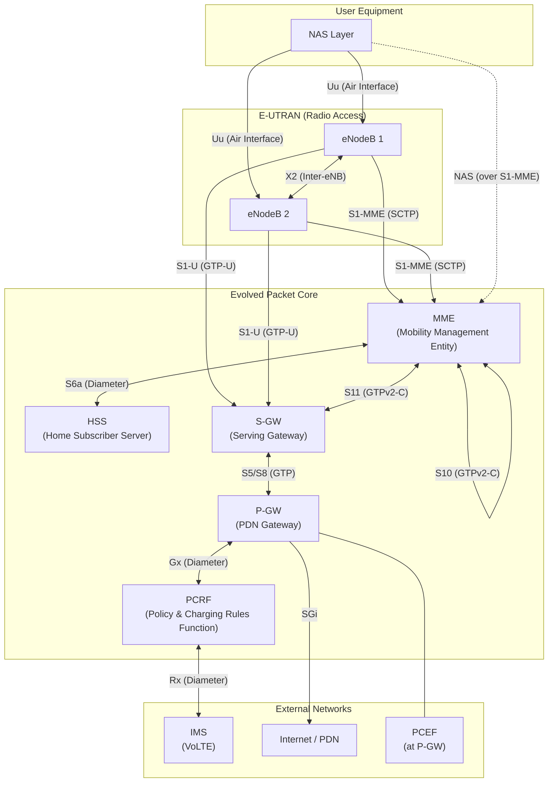
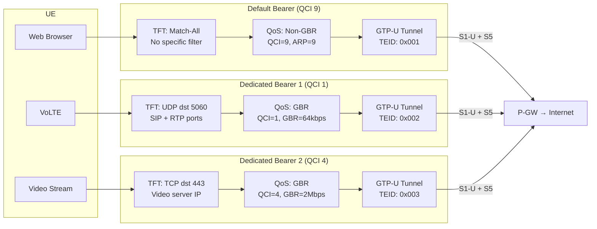
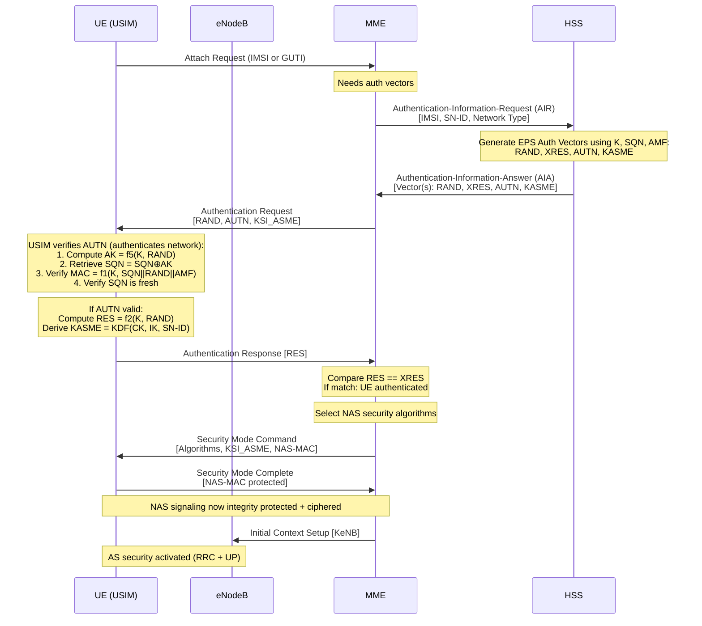

# Module 9: Evolved Packet Core (EPC)

## 9.1 Why EPC Was Designed

The Evolved Packet Core (EPC) was introduced in 3GPP Release 8 as the core network for LTE/4G. Its design was driven by fundamental limitations in legacy core networks (2G/3G circuit-switched + packet-switched domains).

### Design Principles

| Principle | Legacy Problem | EPC Solution |
|-----------|---------------|--------------|
| **All-IP Architecture** | Separate CS and PS domains, TDM transport | Single flat IP-based core for all services (voice via VoLTE/IMS) |
| **Flat Architecture** | Deep hierarchy (RNC, SGSN, GGSN) adding latency | Reduced node count; eNB connects directly to EPC |
| **Control/User Plane Separation** | Combined CP/UP in SGSN/GGSN | MME (CP only), S-GW/P-GW (UP with minimal CP) |
| **Multiple RAT Support** | Separate cores per RAT | Single EPC serves LTE, WCDMA, CDMA2000, Wi-Fi |
| **Simplified Mobility** | Complex handover with many nodes | GTP-based anchoring with fewer hops |
| **Policy & Charging Convergence** | Fragmented policy/charging | Integrated PCC architecture (PCRF/PCEF) |

### Key Benefits

- **Lower latency**: User plane path is shorter (eNB → S-GW → P-GW → Internet)
- **Higher throughput**: No RNC bottleneck; distributed scheduling at eNB
- **Scalability**: Stateless forwarding nodes; CP scales independently
- **Service agility**: Dynamic QoS via dedicated bearers and PCC rules
- **Cost efficiency**: IP transport throughout; commodity hardware

---

## 9.2 EPC Architecture Overview

### Complete Architecture Diagram



### Interface Summary

| Interface | Endpoints | Protocol | Purpose |
|-----------|-----------|----------|---------|
| S1-MME | eNB ↔ MME | S1AP over SCTP | Control plane signaling |
| S1-U | eNB ↔ S-GW | GTP-U over UDP | User plane data |
| X2 | eNB ↔ eNB | X2AP + GTP-U | Handover, load mgmt |
| S11 | MME ↔ S-GW | GTPv2-C | Session/bearer mgmt |
| S5/S8 | S-GW ↔ P-GW | GTP (S5) or PMIP (S8) | User plane + CP |
| S6a | MME ↔ HSS | Diameter | Authentication, subscription |
| S10 | MME ↔ MME | GTPv2-C | MME relocation |
| S3 | MME ↔ SGSN | GTPv2-C | Inter-RAT mobility |
| Gx | PCRF ↔ P-GW | Diameter | Policy & charging rules |
| Gy | P-GW ↔ OCS | Diameter | Online charging |
| Rx | PCRF ↔ AF/IMS | Diameter | Service-level QoS request |
| SGi | P-GW ↔ PDN | IP | External data network |


---

## 9.3 EPC Network Functions

### 9.3.1 MME — Mobility Management Entity

#### Purpose
The MME is the **primary control plane node** in EPC. It handles all signaling between the UE and the core network, managing mobility, security, and session establishment. The MME never touches user plane data.

#### Key Functions

1. **NAS Signaling**: Terminates Non-Access Stratum protocols (EMM and ESM) with the UE
2. **Authentication & Security**: Initiates EPS-AKA, derives keys (KASME → KeNB), selects NAS security algorithms
3. **Mobility Management**: Tracks UE location (TAI), manages ECM states, handles handover signaling
4. **Bearer Management**: Creates/modifies/deletes EPS bearers via S11 signaling to S-GW
5. **Paging**: Pages UEs in ECM-IDLE state when downlink data arrives
6. **MME Selection & Pooling**: Multiple MMEs serve a pool area; load balanced via S1AP weighting
7. **Inter-RAT Mobility**: Handles handover to/from 2G/3G via S3 interface to SGSN
8. **Lawful Intercept**: Provides signaling for LI triggers

#### Interfaces

| Interface | Peer | Protocol | Purpose |
|-----------|------|----------|---------|
| S1-MME | eNB | S1AP/SCTP | RAN control plane |
| S11 | S-GW | GTPv2-C | Bearer/session management |
| S6a | HSS | Diameter | Auth vectors, subscription data |
| S10 | MME | GTPv2-C | MME relocation (handover) |
| S3 | SGSN | GTPv2-C | Inter-RAT mobility |
| S13 | EIR | Diameter | Equipment identity check |
| NAS | UE | EMM/ESM (over S1AP) | Direct UE signaling |

#### Protocols
- **S1AP**: Application protocol for S1 interface (ASN.1 encoded, SCTP transport)
- **GTPv2-C**: GPRS Tunnelling Protocol v2 Control (UDP port 2123)
- **Diameter**: For S6a (authentication), S13 (EIR check)
- **NAS**: EMM (EPS Mobility Management) + ESM (EPS Session Management)

#### Failure Impact
- **Immediate**: All UEs served by the failed MME lose signaling connectivity
- **S1 connections released**: eNBs detect failure via SCTP heartbeat timeout
- **Recovery**: UEs in ECM-CONNECTED move to ECM-IDLE, then re-attach to a different MME in the pool
- **Mitigation**: MME pooling ensures surviving MMEs absorb load; UE context can be retrieved from HSS

---

### 9.3.2 HSS — Home Subscriber Server

#### Purpose
The HSS is the **central subscriber database** for EPC. It is the evolution of the HLR/AuC from 2G/3G, storing all permanent subscriber information, authentication credentials, and service profiles.

#### Key Functions

1. **Subscriber Database**: Stores IMSI, MSISDN, service subscriptions, APN configurations
2. **Authentication Vector Generation**: Generates EPS authentication vectors (RAND, AUTN, XRES, KASME) using the permanent key K and sequence number SQN
3. **Location Management**: Maintains current MME address per subscriber; handles registration/deregistration
4. **Subscription Profiles**: Stores allowed APNs, QoS profiles (subscribed AMBR, default QCI), roaming restrictions
5. **Charging Characteristics**: Per-subscriber charging config
6. **Service Authorization**: Determines which services a UE is permitted

#### Interfaces

| Interface | Peer | Protocol | Purpose |
|-----------|------|----------|---------|
| S6a | MME | Diameter | Auth vectors, location update, subscription data |
| S6d | SGSN | Diameter | 2G/3G equivalent of S6a |
| Cx/Dx | IMS (CSCF) | Diameter | IMS registration, routing |
| Sh | AS | Diameter | Service data for application servers |

#### Protocols
- **Diameter**: All HSS interfaces use Diameter (RFC 6733) with specific applications:
  - S6a: 3GPP Diameter application (vendor-specific AVPs)
  - Authentication-Information-Request/Answer (AIR/AIA)
  - Update-Location-Request/Answer (ULR/ULA)
  - Cancel-Location-Request (CLR) for purging old MME

#### Failure Impact
- **New attaches fail**: No authentication vectors available for new UEs
- **Existing sessions survive**: MME caches auth vectors (typically 5 per UE)
- **Handovers impacted**: If new MME cannot fetch subscriber profile
- **Mitigation**: HSS is typically deployed as a geo-redundant mated pair with database replication


---

### 9.3.3 S-GW — Serving Gateway

#### Purpose
The S-GW is the **user plane anchor** between the radio network and the core. It acts as a local mobility anchor for inter-eNB handovers, ensuring user plane continuity while the UE moves between base stations.

#### Key Functions

1. **User Plane Forwarding**: Routes user data between eNB and P-GW via GTP-U tunnels
2. **Local Mobility Anchor**: During X2 handover, S-GW remains unchanged; only the downlink GTP-U endpoint is switched to the target eNB
3. **Downlink Data Buffering**: When UE is in ECM-IDLE, S-GW buffers incoming packets and triggers MME to page the UE
4. **Per-UE Charging**: Collects charging data (CDRs) per bearer, reports to charging system
5. **Lawful Intercept**: User plane copy point for legal interception
6. **Inter-RAT Anchor**: Anchors user plane during handover between LTE and 2G/3G (with SGSN)
7. **Transport Level Marking**: Applies DSCP marking based on bearer QCI

#### Interfaces

| Interface | Peer | Protocol | Purpose |
|-----------|------|----------|---------|
| S1-U | eNB | GTP-U | User plane from RAN |
| S11 | MME | GTPv2-C | Bearer/tunnel management |
| S5/S8 | P-GW | GTP-U + GTPv2-C | User plane + signaling to P-GW |
| S4 | SGSN | GTP | Inter-RAT user plane (2G/3G) |
| S12 | UTRAN | GTP-U | Direct tunnel (3G) |

#### Protocols
- **GTP-U** (UDP port 2152): Encapsulates user IP packets in GTP headers with TEID
- **GTPv2-C** (UDP port 2123): Create/Modify/Delete Session messages from MME
- **DSCP**: Outer IP header marking for transport QoS

#### Failure Impact
- **Active sessions disrupted**: Ongoing data flows interrupted
- **Path switch required**: MME detects failure, selects a new S-GW, re-establishes GTP tunnels
- **Buffered data lost**: Any DL packets buffered for IDLE UEs are lost
- **Mitigation**: S-GW typically deployed in N+1 redundancy; ICGW (Idle-mode Signaling Reduction) minimizes state

---

### 9.3.4 P-GW — PDN Gateway

#### Purpose
The P-GW is the **point of interconnection** between the EPC and external packet data networks (PDNs). It is the IP anchor point for UE sessions — the UE's IP address remains constant as long as the PDN connection exists, regardless of mobility.

#### Key Functions

1. **IP Address Allocation**:
   - IPv4: DHCPv4 or static assignment from configured pools
   - IPv6: Stateless Address Autoconfiguration (SLAAC) via Router Advertisement; assigns /64 prefix
   - Dual-stack: Both simultaneously
2. **Policy Enforcement (PCEF)**:
   - Applies PCC rules received from PCRF
   - Traffic Flow Templates (TFT): Packet filters mapping IP flows to bearers
   - Service Data Flow (SDF) filters: 5-tuple matching for QoS/charging
3. **Charging**:
   - Offline (Gz interface → CDR generation)
   - Online (Gy interface → real-time credit control with OCS)
4. **SGi Interface**: Connects to external networks (Internet, IMS, enterprise VPN)
5. **NAT/NAPT**: Optional Network Address Translation for IPv4
6. **GTP Anchoring**: Terminates S5/S8 GTP tunnels from S-GW

#### Interfaces

| Interface | Peer | Protocol | Purpose |
|-----------|------|----------|---------|
| S5/S8 | S-GW | GTP | User plane + control plane |
| Gx | PCRF | Diameter | PCC rule download |
| Gy | OCS | Diameter (Ro) | Online charging |
| Gz | OFCS | GTP' (CDRs) | Offline charging |
| SGi | PDN/Internet | IP | External connectivity |
| S2a/S2b | ePDG/TWAG | GTP/PMIP | Wi-Fi offload |

#### Protocols
- **GTP-U/GTPv2-C**: Tunnel and session management toward S-GW
- **Diameter Gx**: Policy and Charging Control (Install/Remove PCC rules)
- **Diameter Gy (Ro)**: Credit-Control-Request/Answer for online charging
- **DHCPv4/ICMPv6**: IP address allocation to UE
- **RADIUS/Diameter**: Possible AAA for enterprise APNs

#### Failure Impact
- **Session loss**: All PDN connections through the failed P-GW are lost (IP addresses released)
- **UE must re-establish**: New PDN connectivity request → new IP address (breaks ongoing TCP sessions)
- **Critical impact for VoLTE**: Active voice calls dropped
- **Mitigation**: P-GW clustering, session replication, ICSR (Inter-Chassis Session Recovery)


---

### 9.3.5 PCRF — Policy and Charging Rules Function

#### Purpose
The PCRF is the **policy decision point** in the PCC architecture. It makes real-time decisions about QoS authorization, gating, and charging rules based on subscriber profile, network conditions, and application requirements.

#### Key Functions

1. **PCC Rule Generation**: Creates Policy and Charging Control rules containing:
   - SDF filters (which traffic)
   - QoS parameters (QCI, GBR, MBR)
   - Charging keys and methods
   - Gate status (open/close)
2. **QoS Authorization**: Validates requested QoS against subscription and network policy
3. **Dynamic Policy**: Real-time policy changes (e.g., when VoLTE call starts → install GBR bearer rule)
4. **Rx Interface Processing**: Receives session information from AF/IMS (media description, bandwidth) and translates to PCC rules
5. **Spending Limits**: Interfaces with OCS for policy decisions based on remaining credit
6. **Subscription-Based Policy**: Applies rules based on subscriber tier (e.g., gold/silver/bronze plans)

#### Interfaces

| Interface | Peer | Protocol | Purpose |
|-----------|------|----------|---------|
| Gx | P-GW (PCEF) | Diameter | Install/remove PCC rules |
| Rx | AF / IMS (P-CSCF) | Diameter | Service-level info (SDP) |
| Sp | SPR | Diameter/proprietary | Subscriber profile retrieval |
| Sy | OCS | Diameter | Spending limit reporting |
| Sd | TDF | Diameter | Traffic Detection Function rules |

#### Protocols
- **Diameter Gx Application**:
  - CC-Request/Answer (CCR/CCA): Initial, Update, Terminate
  - Re-Auth-Request (RAR): Push rule changes to PCEF
- **Diameter Rx Application**:
  - AA-Request/Answer (AAR/AAA): AF session establishment
  - Session-Termination-Request (STR): AF session teardown
  - Abort-Session-Request (ASR): Network-initiated removal

#### Failure Impact
- **Static rules continue**: Previously installed PCC rules at P-GW remain active
- **No dynamic policy**: New service requests (e.g., VoLTE) cannot get dedicated bearer authorization
- **Default QoS only**: New sessions get only default bearer with static policy
- **Mitigation**: PCRF deployed in active/standby pairs; Diameter routing agent (DRA) for failover

---

### 9.3.6 PCEF — Policy and Charging Enforcement Function

#### Purpose
The PCEF is the **policy enforcement point**, co-located with the P-GW. It enforces the PCC rules received from the PCRF by applying packet filtering, QoS enforcement, and charging actions on every user plane packet.

#### Key Functions

1. **SDF Filter Enforcement**: Matches incoming/outgoing IP packets against Service Data Flow filters (5-tuple: src IP, dst IP, src port, dst port, protocol)
2. **Gate Control**: Opens or closes the gate for specific SDFs (blocking/allowing traffic)
3. **QoS Enforcement**: Applies rate limiting per-flow:
   - GBR (Guaranteed Bit Rate): Minimum rate ensured
   - MBR (Maximum Bit Rate): Hard cap per bearer
   - AMBR (Aggregate Maximum Bit Rate): Cap across all non-GBR bearers
4. **Bearer Binding**: Maps SDF filters to appropriate EPS bearers
5. **Charging Enforcement**:
   - Applies charging keys to traffic
   - Volume/time measurement per rating group
   - Online charging: Reports usage, enforces credit limits
   - Offline charging: Generates CDRs
6. **Usage Monitoring**: Reports volume thresholds to PCRF for policy decisions

#### Interfaces
The PCEF is integrated within the P-GW, so its external interface is primarily:

| Interface | Peer | Protocol | Purpose |
|-----------|------|----------|---------|
| Gx | PCRF | Diameter | Receives PCC rules |
| Gy | OCS | Diameter (Ro) | Online charging credit control |
| Gz | OFCS | GTP' | Offline CDR delivery |

#### Protocols
- **Diameter Gx**: Receives Charging-Rule-Install/Remove AVPs containing PCC rules
- **Deep Packet Inspection (DPI)**: Optional; identifies applications for application-aware charging
- **Token Bucket / Leaky Bucket**: Rate enforcement algorithms for GBR/MBR policing

#### Failure Impact
- Since PCEF is co-located with P-GW, PCEF failure = P-GW failure (see Section 9.3.4)
- **Degraded mode**: If only policy engine fails, traffic may pass unpoliced (fail-open) or be blocked (fail-close) depending on implementation
- **Mitigation**: Hardware redundancy within P-GW chassis; hitless software upgrades


---

## 9.4 EPC Bearers

### Bearer Concept

An EPS bearer is an **end-to-end logical channel** between the UE and the P-GW with specific QoS characteristics. Every bearer is defined by three components:

```
Bearer = { TFT + QoS Parameters + GTP Tunnel(s) }
```

- **TFT (Traffic Flow Template)**: Packet filters (5-tuple) that classify which IP packets belong to this bearer
- **QoS Parameters**: QCI, ARP, GBR/MBR (for GBR bearers), AMBR (aggregate)
- **GTP Tunnel**: Identified by TEID (Tunnel Endpoint Identifier) on each hop:
  - S1-U: eNB ↔ S-GW
  - S5/S8: S-GW ↔ P-GW

### Bearer Structure Diagram



### 9.4.1 Default Bearer

- **Created automatically** during PDN connection (Attach or additional PDN connectivity request)
- **Always-on**: Exists for the entire duration of the PDN connection
- **Non-GBR**: No guaranteed bit rate; best-effort with AMBR cap
- **Match-all TFT**: Carries all traffic that doesn't match any dedicated bearer's TFT
- **QoS from subscription**: QCI and AMBR values come from HSS subscription profile
- **One per PDN connection**: Each APN gets exactly one default bearer (EBI = EPS Bearer ID assigned)

### 9.4.2 Dedicated Bearer

- **Created on-demand**: Triggered by service request (PCRF rule) or UE/network request
- **Specific QoS**: Can be GBR (guaranteed) or Non-GBR (prioritized best-effort)
- **Specific TFT**: Packet filters direct matching traffic to this bearer
- **Linked to default bearer**: Shares the same PDN connection (same IP address)
- **Lifecycle**: Created via Bearer Resource Allocation → PCRF decision → P-GW initiates dedicated bearer activation
- **Example triggers**: VoLTE call start (QCI 1), video streaming (QCI 4), gaming (QCI 3)

### 9.4.3 QCI Table (Standardized Values)

| QCI | Resource Type | Priority | Packet Delay Budget | Packet Error Loss Rate | Example Services |
|-----|--------------|----------|--------------------|-----------------------|-----------------|
| 1 | GBR | 2 | 100 ms | 10⁻² | Conversational Voice (VoLTE) |
| 2 | GBR | 4 | 150 ms | 10⁻³ | Conversational Video (live) |
| 3 | GBR | 3 | 50 ms | 10⁻³ | Real-time Gaming |
| 4 | GBR | 5 | 300 ms | 10⁻⁶ | Non-conversational Video (buffered streaming) |
| 5 | Non-GBR | 1 | 100 ms | 10⁻⁶ | IMS Signaling (SIP) |
| 6 | Non-GBR | 6 | 300 ms | 10⁻⁶ | Video (buffered), TCP-based services (web, email) |
| 7 | Non-GBR | 7 | 100 ms | 10⁻³ | Voice, Video (live), Interactive Gaming |
| 8 | Non-GBR | 8 | 300 ms | 10⁻⁶ | Video (buffered), TCP-based (premium) |
| 9 | Non-GBR | 9 | 300 ms | 10⁻⁶ | Video (buffered), TCP-based (default/best-effort) |

**Key QoS Parameters:**
- **QCI (QoS Class Identifier)**: Scalar value (1-9) mapping to standardized packet treatment
- **ARP (Allocation and Retention Priority)**: Priority level (1-15), pre-emption capability/vulnerability
- **GBR**: Guaranteed minimum bit rate (only for QCI 1-4)
- **MBR**: Maximum bit rate (caps GBR bearers)
- **UE-AMBR**: Aggregate MBR across all non-GBR bearers of a UE
- **APN-AMBR**: Aggregate MBR across all non-GBR bearers of one APN


---

## 9.5 Authentication in EPC

### 9.5.1 EPS-AKA (EPS Authentication and Key Agreement)

EPS-AKA provides **mutual authentication** between the UE and the network. Both parties prove knowledge of the permanent key K (stored in USIM and HSS) without transmitting it.

#### EPS-AKA Flow



#### Authentication Failure Cases
- **MAC failure** (UE rejects AUTN): Network is not authentic → UE sends Authentication Failure (cause: MAC failure)
- **SQN out of range**: Synchronization failure → UE sends AUTS for resync
- **XRES mismatch**: UE is not authentic → MME sends Authentication Reject

### 9.5.2 KASME Derivation

The **KASME** (Key for Access Security Management Entity) is the master key for all EPC security:

```
KASME = KDF(CK || IK, SN-ID, SQN ⊕ AK)

Where:
- KDF = HMAC-SHA-256 based Key Derivation Function
- CK = Cipher Key = f3(K, RAND)
- IK = Integrity Key = f4(K, RAND)
- SN-ID = Serving Network Identity (MCC || MNC)
- SQN = Sequence Number
- AK = Anonymity Key = f5(K, RAND)
```

#### Key Hierarchy

```
K (permanent, in USIM/HSS)
└── CK, IK (from f3, f4)
    └── KASME (master session key)
        ├── KeNB (eNodeB key, for AS security)
        │   ├── KRRCint (RRC integrity)
        │   ├── KRRCenc (RRC ciphering)
        │   └── KUPenc (User plane ciphering)
        ├── KNASint (NAS integrity protection)
        └── KNASenc (NAS ciphering)
```

### 9.5.3 NAS Security

NAS security operates between UE and MME (transparent to eNB):

| Protection | Algorithm Options | Purpose |
|-----------|------------------|---------|
| Integrity (mandatory) | EIA1 (SNOW 3G), EIA2 (AES), EIA3 (ZUC) | Prevents message tampering |
| Ciphering (optional) | EEA0 (null), EEA1 (SNOW 3G), EEA2 (AES), EEA3 (ZUC) | Prevents eavesdropping |

- **NAS COUNT**: 32-bit counter prevents replay attacks (separate UL/DL counts)
- **Security Mode Command**: Establishes algorithms; itself integrity-protected
- **Protected messages**: All NAS messages after SMC are integrity-protected; most are ciphered

### 9.5.4 AS Security (Access Stratum)

AS security operates between UE and eNB:

- **KeNB**: Derived from KASME at MME, sent to eNB in Initial Context Setup
- **RRC protection**: Both integrity and ciphering (SRB1, SRB2)
- **User plane**: Ciphering only (no integrity for performance reasons in LTE)
- **Key refresh**: New KeNB derived at handover (KeNB* = KDF(KeNB, PCI, freq))
- **Activated via**: SecurityModeCommand (RRC level, distinct from NAS SMC)


---

## 9.6 Session Management

### 9.6.1 PDN Connectivity (Default Bearer Establishment)

PDN connectivity creates the **default EPS bearer** and assigns an IP address to the UE.

#### Procedure Flow

1. **UE → MME**: ESM PDN Connectivity Request (APN, PDN type: IPv4/IPv6/IPv4v6)
2. **MME → S-GW**: Create Session Request (IMSI, bearer QoS from HSS profile, APN)
3. **S-GW → P-GW**: Create Session Request (forwarded with S-GW F-TEID)
4. **P-GW**: Allocates IP address, contacts PCRF (CCR-Initial on Gx), installs default PCC rules
5. **P-GW → S-GW**: Create Session Response (IP address, bearer context, TFT)
6. **S-GW → MME**: Create Session Response (S-GW F-TEID, bearer context)
7. **MME → eNB**: Initial Context Setup Request (bearer context, KeNB, NAS: Attach Accept + Activate Default Bearer)
8. **eNB → UE**: RRC Connection Reconfiguration (DRB setup) + NAS messages
9. **UE → eNB → MME**: Attach Complete / Activate Default EPS Bearer Context Accept
10. **MME → S-GW**: Modify Bearer Request (eNB F-TEID for downlink)

**Result**: End-to-end bearer established: UE ↔ eNB ↔ S-GW ↔ P-GW ↔ Internet

### 9.6.2 Dedicated Bearer Activation

Dedicated bearers are **network-initiated** (triggered by PCRF rule or operator policy):

1. **PCRF → P-GW**: Re-Auth-Request (RAR) with PCC rule (QCI, GBR, TFT filters)
2. **P-GW → S-GW**: Create Bearer Request (EBI, TFT, QoS, S5 F-TEID)
3. **S-GW → MME**: Create Bearer Request (forwarded with S1-U F-TEID)
4. **MME → eNB → UE**: Bearer Setup Request (NAS: Activate Dedicated Bearer Context Request)
5. **UE**: Accepts, stores TFT for uplink classification
6. **UE → eNB → MME**: Activate Dedicated EPS Bearer Context Accept
7. **MME → S-GW → P-GW**: Create Bearer Response (all TEIDs now bound)

### 9.6.3 Bearer Modification

Bearer modification changes QoS or TFT of an existing bearer:

- **Network-initiated**: PCRF updates PCC rule → P-GW sends Update Bearer Request
- **UE-initiated**: UE sends Bearer Resource Modification Request to MME
- **Examples**: Upgrade video quality (increase GBR), add new SDF filter, change gate status

### 9.6.4 Bearer Deactivation

- **Network-initiated**: PCRF removes PCC rule → P-GW sends Delete Bearer Request
- **UE-initiated**: UE sends Deactivate EPS Bearer Context Request
- **Default bearer deactivation**: Deletes ALL associated dedicated bearers + releases IP address
- **PDN disconnection**: Triggered when last default bearer is deactivated


---

## 9.7 Mobility Management

### 9.7.1 ECM States

| State | Description | UE Location Known? | Resources |
|-------|------------|-------------------|-----------|
| **ECM-IDLE** | No NAS signaling connection; UE monitors paging | TA-level only (TAI list) | No S1 connection, no DRB; S-GW buffers DL data |
| **ECM-CONNECTED** | Active NAS signaling via S1-MME | Cell-level (ECGI) | S1-U tunnel active; DRBs established |

**State Transitions:**
- IDLE → CONNECTED: Service Request (UE-triggered) or Paging Response (network-triggered)
- CONNECTED → IDLE: S1 Release (inactivity timer expiry or explicit release)

### 9.7.2 Tracking Area Update (TAU)

TAU keeps the network informed of the UE's approximate location in ECM-IDLE state:

**When TAU is triggered:**
- UE enters a new Tracking Area (TA) not in its TAI list
- Periodic TAU timer expires (configurable, typically 54 minutes)
- After ISR (Idle-mode Signaling Reduction) activation

**TAU Procedure:**
1. UE → MME: Tracking Area Update Request (old GUTI, TAI visited)
2. MME: Verifies identity, optionally authenticates
3. MME → HSS: Update Location (if new MME)
4. MME → old MME: Context transfer (if MME changed)
5. MME → UE: TAU Accept (new GUTI, new TAI list)
6. MME → S-GW: Modify Bearer (if S-GW changed)

**TAI List**: MME assigns a list of TAs to reduce TAU frequency (load balancing vs. paging cost tradeoff)

### 9.7.3 X2 Handover (Intra-LTE, Without MME Change)

The **fastest handover** in LTE — direct eNB-to-eNB signaling without MME involvement for data forwarding:

1. **Source eNB**: Measurement reports indicate target cell is better
2. **Source → Target eNB** (X2): Handover Request (UE context, bearers, QoS)
3. **Target eNB**: Admits UE, allocates resources
4. **Target → Source eNB** (X2): Handover Request Acknowledge (DL forwarding address)
5. **Source eNB → UE**: RRC Connection Reconfiguration (handover command)
6. **Source eNB**: Starts forwarding buffered + new DL data to target eNB via X2
7. **UE**: Detaches from source, synchronizes to target cell
8. **UE → Target eNB**: RRC Connection Reconfiguration Complete
9. **Target eNB → MME**: Path Switch Request (new ECGI, new TEIDs)
10. **MME → S-GW**: Modify Bearer Request (target eNB address)
11. **S-GW**: Switches DL path to target eNB (end marker to source)
12. **MME → Target eNB**: Path Switch Request Acknowledge
13. **Target → Source eNB**: UE Context Release (cleanup)

**Key point**: S-GW is unchanged (local mobility anchor). Only the S1-U endpoint moves.

### 9.7.4 S1 Handover (With MME/S-GW Change)

Used when X2 is unavailable or when MME/S-GW relocation is needed:

1. **Source eNB → Source MME**: Handover Required (target ID, cause)
2. **Source MME → Target MME**: Forward Relocation Request (UE context) [if MME changes]
3. **Target MME → Target eNB**: Handover Request (bearer setup)
4. **Target eNB → Target MME**: Handover Request Acknowledge
5. **Target MME → Source MME**: Forward Relocation Response
6. **Source MME → Source eNB**: Handover Command
7. **Source eNB → UE**: RRC Connection Reconfiguration
8. **UE → Target eNB**: Handover Confirm
9. **Target eNB → Target MME**: Handover Notify
10. **Target MME → S-GW**: Modify Bearer / Create Session (if S-GW changes)

**Indirect Data Forwarding**: DL data forwarded Source eNB → Source S-GW → Target S-GW → Target eNB during handover gap.

### 9.7.5 Inter-RAT Mobility (LTE ↔ 3G)

#### LTE → 3G (PS Handover)
1. MME triggers handover to UTRAN (measurement reports or coverage)
2. MME → SGSN (S3): Forward Relocation Request (PDP contexts mapped from EPS bearers)
3. SGSN → RNC: Relocation Request
4. After handover: S-GW reroutes user plane via S4 to SGSN (or direct tunnel via S12 to RNC)
5. Bearer QoS mapped: QCI → UMTS Traffic Class (Conversational/Streaming/Interactive/Background)

#### 3G → LTE
1. SGSN detects LTE capability; initiates handover
2. SGSN → MME (S3): Forward Relocation Request
3. MME activates bearers, sets up S1 path
4. PDP contexts mapped to EPS bearers


---

## 9.8 Failure Scenarios

### 9.8.1 MME Failure

| Aspect | Impact |
|--------|--------|
| **Detection** | eNB detects via SCTP association failure (heartbeat timeout ~30s) |
| **Immediate effect** | All S1-MME connections to failed MME are lost |
| **ECM-CONNECTED UEs** | Move to ECM-IDLE; eNB releases radio resources |
| **Recovery action** | UE sends Service Request / Attach to new MME (selected via S1AP weighting from MME pool) |
| **Context recovery** | New MME fetches subscription from HSS; active bearers re-established via new Create Session to S-GW |
| **Data loss** | Momentary — ongoing TCP sessions may survive (IP address preserved at P-GW); UDP/real-time sessions interrupted |

**Mitigation Strategies:**
- MME pooling (multiple MMEs per tracking area)
- Active/Standby with session state replication
- S10-based context transfer from backup node
- DNS-based MME selection for load distribution

### 9.8.2 S-GW Failure

| Aspect | Impact |
|--------|--------|
| **Detection** | MME detects via GTPv2-C Echo timeout on S11; eNB detects via GTP-U path failure on S1-U |
| **Immediate effect** | User plane interrupted for all UEs served by failed S-GW |
| **Recovery action** | MME selects new S-GW, sends Modify Bearer to P-GW with new S-GW address |
| **Path switch** | P-GW redirects S5 tunnel to new S-GW; MME updates eNB with new S1-U TEID |
| **Data loss** | Buffered DL data (for IDLE UEs) at failed S-GW is lost |

**Mitigation Strategies:**
- S-GW pool with DNS-based selection (weighted records)
- GTP-U path failure detection (Echo Request/Response)
- N+1 redundancy; ICSR between chassis pairs
- Pre-established backup GTP contexts

### 9.8.3 P-GW Failure

| Aspect | Impact |
|--------|--------|
| **Detection** | S-GW detects via GTP path failure on S5; PCRF detects via Diameter transport failure on Gx |
| **Immediate effect** | All PDN connections through failed P-GW are lost |
| **IP address loss** | UE IP addresses are released — cannot be recovered |
| **Session impact** | All TCP/UDP sessions terminated; VoLTE calls dropped |
| **Recovery action** | UE must establish new PDN connectivity (new default bearer, new IP address) |
| **Application impact** | DNS-based services recover; long-lived sessions (VPN, SSH) broken |

**Mitigation Strategies:**
- Inter-Chassis Session Recovery (ICSR): Active/Standby P-GW pair with session state sync
- GTP-C restart counter: S-GW detects P-GW restart, reports to MME
- IP address pool replication between paired P-GWs
- P-GW selection via DNS with health monitoring

### 9.8.4 HSS Unreachable

| Aspect | Impact |
|--------|--------|
| **Detection** | MME detects via Diameter transport failure or watchdog timeout on S6a |
| **Existing sessions** | Continue normally — bearer state is at MME/S-GW/P-GW |
| **Authentication** | MME uses **cached authentication vectors** (typically 5 vectors per UE fetched at last AIR) |
| **New attaches** | Fail once cached vectors exhausted — no new UEs can authenticate |
| **Handover to new MME** | Impacted — new MME cannot fetch subscription profile |
| **Duration tolerance** | Depends on cache depth; typically sustains operations for minutes to hours |

**Mitigation Strategies:**
- Geo-redundant HSS pair (active/active or active/standby)
- Diameter Routing Agent (DRA) for automatic failover
- Increased auth vector batch size (e.g., 10 instead of 5)
- MME-level subscription caching with TTL

---

## 9.9 Summary

| Component | Plane | Primary Role | Key Interface |
|-----------|-------|-------------|---------------|
| MME | Control | Signaling, Auth, Mobility | S1-MME, S11, S6a |
| HSS | Control | Subscriber DB, Auth vectors | S6a |
| S-GW | User + Control | Local UP anchor, buffering | S1-U, S5/S8 |
| P-GW | User + Control | IP anchor, policy enforcement | S5/S8, SGi, Gx |
| PCRF | Control | Policy decision | Gx, Rx |
| PCEF | User | Policy enforcement | Gx (at P-GW) |

### Key Takeaways

1. **EPC eliminates circuit-switching**: All services (including voice) over IP bearers
2. **Control/User plane split**: Enables independent scaling and evolution toward 5G
3. **Bearer-based QoS**: Deterministic quality for real-time services (QCI 1-4 = GBR)
4. **Security by design**: Mutual authentication (EPS-AKA), layered key derivation, mandatory integrity
5. **Mobility without disruption**: GTP anchoring at S-GW (local) and P-GW (global) preserves IP sessions
6. **Policy architecture**: PCRF/PCEF enable real-time, subscriber-aware traffic treatment
7. **Resilience through pooling**: MME pools, S-GW pools, and HSS redundancy minimize single points of failure

---

*Module 9 — End*
