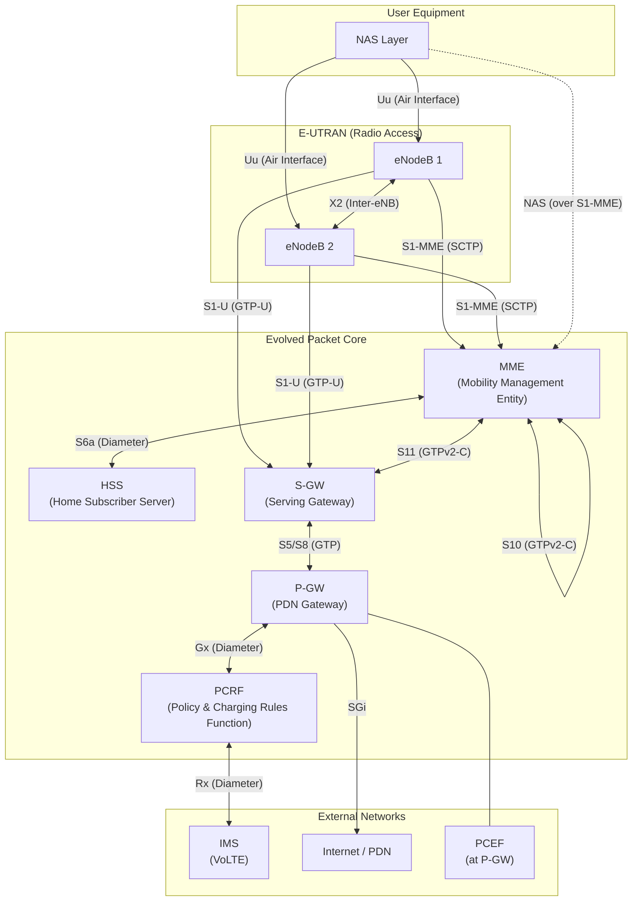
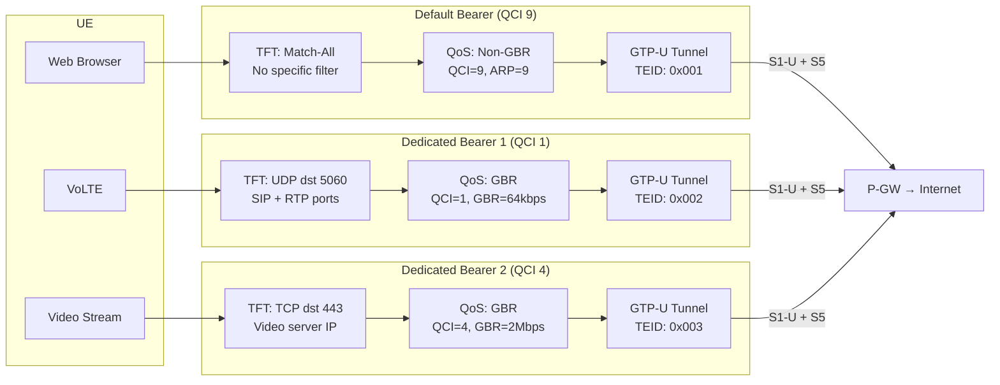
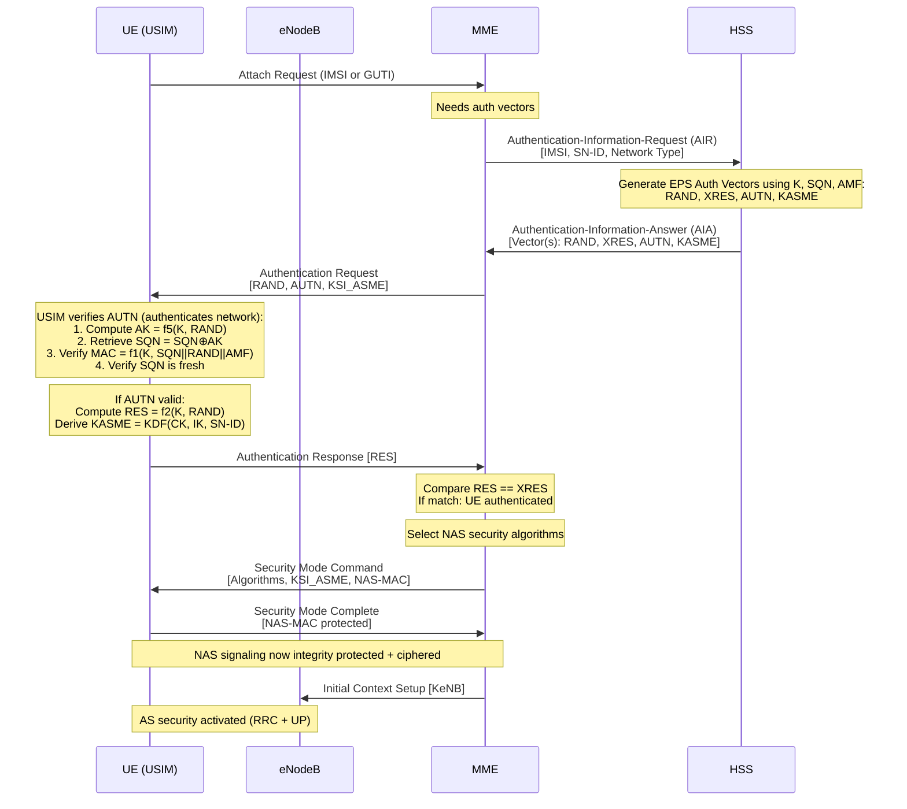

# ماژول 9: هسته بسته تکامل‌یافته (EPC)

## 9.1 چرا EPC طراحی شد

هسته بسته تکامل‌یافته (EPC) در نسخه 8 گروه 3GPP به‌عنوان شبکه هسته برای LTE/4G معرفی شد. طراحی آن توسط محدودیت‌های بنیادی شبکه‌های هسته قدیمی (دامنه‌های سوئیچینگ مداری + سوئیچینگ بسته‌ای نسل 2G/3G) هدایت شد.

### اصول طراحی

| اصل | مسئله قدیمی | راه‌حل EPC |
|-----------|---------------|--------------|
| **معماری تمام-IP** | دامنه‌های جداگانه CS و PS، انتقال TDM | هسته واحد مسطح مبتنی بر IP برای تمام خدمات (صدا از طریق VoLTE/IMS) |
| **معماری مسطح** | سلسله‌مراتب عمیق (RNC، SGSN، GGSN) که تأخیر اضافه می‌کند | کاهش تعداد گره؛ eNB مستقیماً به EPC متصل می‌شود |
| **جداسازی کنترل/صفحه کاربر** | CP/UP ترکیبی در SGSN/GGSN | MME (فقط CP)، S-GW/P-GW (UP با CP حداقلی) |
| **پشتیبانی چند-RAT** | هسته‌های جداگانه در هر RAT | EPC واحد به LTE، WCDMA، CDMA2000، Wi-Fi خدمات می‌دهد |
| **تحرک ساده‌شده** | تحویل پیچیده با گره‌های زیاد | لنگرگذاری مبتنی بر GTP با گام‌های کمتر |
| **همگرایی سیاست و صورت‌حساب** | سیاست/صورت‌حساب تکه‌تکه | معماری PCC یکپارچه (PCRF/PCEF) |

### مزایای کلیدی

- **تأخیر کمتر**: مسیر صفحه کاربر کوتاه‌تر است (eNB ← S-GW ← P-GW ← اینترنت)
- **توان عملیاتی بالاتر**: بدون گلوگاه RNC؛ زمان‌بندی توزیع‌شده در eNB
- **مقیاس‌پذیری**: گره‌های ارسال بدون حالت؛ CP مستقل مقیاس می‌یابد
- **چابکی خدمات**: QoS پویا از طریق حامل‌های اختصاصی و قواعد PCC
- **کارایی هزینه**: انتقال IP در سراسر شبکه؛ سخت‌افزار عمومی

---

## 9.2 مرور معماری EPC

### نمودار معماری کامل



### خلاصه واسط‌ها

| واسط | نقاط انتهایی | پروتکل | هدف |
|-----------|-----------|----------|---------|
| S1-MME | eNB ↔ MME | S1AP over SCTP | سیگنالینگ صفحه کنترل |
| S1-U | eNB ↔ S-GW | GTP-U over UDP | داده صفحه کاربر |
| X2 | eNB ↔ eNB | X2AP + GTP-U | تحویل، مدیریت بار |
| S11 | MME ↔ S-GW | GTPv2-C | مدیریت نشست/حامل |
| S5/S8 | S-GW ↔ P-GW | GTP (S5) یا PMIP (S8) | صفحه کاربر + CP |
| S6a | MME ↔ HSS | Diameter | احراز هویت، اشتراک |
| S10 | MME ↔ MME | GTPv2-C | جابه‌جایی MME |
| S3 | MME ↔ SGSN | GTPv2-C | تحرک بین-RAT |
| Gx | PCRF ↔ P-GW | Diameter | قواعد سیاست و صورت‌حساب |
| Gy | P-GW ↔ OCS | Diameter | صورت‌حساب آنلاین |
| Rx | PCRF ↔ AF/IMS | Diameter | درخواست QoS در سطح سرویس |
| SGi | P-GW ↔ PDN | IP | شبکه داده خارجی |


---

## 9.3 توابع شبکه EPC

### 9.3.1 MME — موجودیت مدیریت تحرک

#### هدف
MME **گره اصلی صفحه کنترل** در EPC است. تمام سیگنالینگ بین UE و شبکه هسته را مدیریت می‌کند و تحرک، امنیت و برقراری نشست را کنترل می‌کند. MME هرگز به داده صفحه کاربر دست نمی‌زند.

#### توابع کلیدی

1. **سیگنالینگ NAS**: پروتکل‌های لایه غیر-دسترسی (EMM و ESM) را با UE پایان می‌دهد
2. **احراز هویت و امنیت**: EPS-AKA را آغاز می‌کند، کلیدها را مشتق می‌کند (KASME ← KeNB)، الگوریتم‌های امنیت NAS را انتخاب می‌کند
3. **مدیریت تحرک**: مکان UE را ردیابی می‌کند (TAI)، حالت‌های ECM را مدیریت می‌کند، سیگنالینگ تحویل را انجام می‌دهد
4. **مدیریت حامل**: حامل‌های EPS را از طریق سیگنالینگ S11 به S-GW ایجاد/اصلاح/حذف می‌کند
5. **صفحه‌بندی**: UEها را در حالت ECM-IDLE هنگام رسیدن داده پیوند پایین‌سو صفحه‌بندی می‌کند
6. **انتخاب و استخر MME**: چندین MME به یک ناحیه استخر خدمات می‌دهند؛ توازن بار از طریق وزن‌دهی S1AP
7. **تحرک بین-RAT**: تحویل به/از 2G/3G را از طریق واسط S3 به SGSN انجام می‌دهد
8. **رهگیری قانونی**: سیگنالینگ برای محرک‌های LI فراهم می‌کند

#### واسط‌ها

| واسط | همتا | پروتکل | هدف |
|-----------|------|----------|---------|
| S1-MME | eNB | S1AP/SCTP | صفحه کنترل RAN |
| S11 | S-GW | GTPv2-C | مدیریت حامل/نشست |
| S6a | HSS | Diameter | بردارهای احراز هویت، داده اشتراک |
| S10 | MME | GTPv2-C | جابه‌جایی MME (تحویل) |
| S3 | SGSN | GTPv2-C | تحرک بین-RAT |
| S13 | EIR | Diameter | بررسی هویت تجهیزات |
| NAS | UE | EMM/ESM (over S1AP) | سیگنالینگ مستقیم UE |

#### پروتکل‌ها
- **S1AP**: پروتکل کاربرد برای واسط S1 (کدگذاری ASN.1، انتقال SCTP)
- **GTPv2-C**: پروتکل تونل‌سازی GPRS نسخه 2 کنترل (پورت UDP 2123)
- **Diameter**: برای S6a (احراز هویت)، S13 (بررسی EIR)
- **NAS**: EMM (مدیریت تحرک EPS) + ESM (مدیریت نشست EPS)

#### تأثیر شکست
- **فوری**: تمام UEهایی که توسط MME شکست‌خورده خدمات می‌گیرند، اتصال سیگنالینگ خود را از دست می‌دهند
- **آزادسازی اتصالات S1**: eNBها شکست را از طریق انقضای ضربان SCTP تشخیص می‌دهند
- **بازیابی**: UEهای در ECM-CONNECTED به ECM-IDLE می‌روند، سپس به MME دیگری در استخر دوباره متصل می‌شوند
- **کاهش اثر**: استخر MME تضمین می‌کند MMEهای باقیمانده بار را جذب می‌کنند؛ زمینه UE را می‌توان از HSS بازیابی کرد

---

### 9.3.2 HSS — سرور مشترک خانگی

#### هدف
HSS **پایگاه داده مرکزی مشترکین** برای EPC است. این تحول HLR/AuC از نسل 2G/3G است که تمام اطلاعات دائمی مشترک، اعتبارنامه‌های احراز هویت و پروفایل‌های خدمات را ذخیره می‌کند.

#### توابع کلیدی

1. **پایگاه داده مشترکین**: IMSI، MSISDN، اشتراک‌های خدمات، پیکربندی‌های APN را ذخیره می‌کند
2. **تولید بردار احراز هویت**: بردارهای احراز هویت EPS (RAND، AUTN، XRES، KASME) را با استفاده از کلید دائمی K و شماره ترتیب SQN تولید می‌کند
3. **مدیریت مکان**: آدرس MME فعلی را برای هر مشترک نگه می‌دارد؛ ثبت‌نام/لغو ثبت‌نام را انجام می‌دهد
4. **پروفایل‌های اشتراک**: APNهای مجاز، پروفایل‌های QoS (AMBR مشترک‌شده، QCI پیش‌فرض)، محدودیت‌های رومینگ را ذخیره می‌کند
5. **ویژگی‌های صورت‌حساب**: پیکربندی صورت‌حساب در هر مشترک
6. **مجوزدهی خدمات**: تعیین می‌کند UE مجاز به کدام خدمات است

#### واسط‌ها

| واسط | همتا | پروتکل | هدف |
|-----------|------|----------|---------|
| S6a | MME | Diameter | بردارهای احراز هویت، به‌روزرسانی مکان، داده اشتراک |
| S6d | SGSN | Diameter | معادل 2G/3G برای S6a |
| Cx/Dx | IMS (CSCF) | Diameter | ثبت‌نام IMS، مسیریابی |
| Sh | AS | Diameter | داده خدمات برای سرورهای کاربردی |

#### پروتکل‌ها
- **Diameter**: تمام واسط‌های HSS از Diameter (RFC 6733) با کاربردهای مشخص استفاده می‌کنند:
  - S6a: کاربرد Diameter گروه 3GPP (AVPهای اختصاصی سازنده)
  - Authentication-Information-Request/Answer (AIR/AIA)
  - Update-Location-Request/Answer (ULR/ULA)
  - Cancel-Location-Request (CLR) برای پاک‌سازی MME قدیمی

#### تأثیر شکست
- **اتصالات جدید شکست می‌خورند**: هیچ بردار احراز هویتی برای UEهای جدید در دسترس نیست
- **نشست‌های موجود زنده می‌مانند**: MME بردارهای احراز هویت را ذخیره می‌کند (معمولاً 5 در هر UE)
- **تحویل‌ها تحت تأثیر قرار می‌گیرند**: اگر MME جدید نتواند پروفایل مشترک را بگیرد
- **کاهش اثر**: HSS معمولاً به‌عنوان یک جفت همسان با افزونگی جغرافیایی و تکرار پایگاه داده مستقر می‌شود


---

### 9.3.3 S-GW — دروازه خدمات‌دهنده

#### هدف
S-GW **لنگر صفحه کاربر** بین شبکه رادیویی و هسته است. به‌عنوان لنگر تحرک محلی برای تحویل‌های بین-eNB عمل می‌کند و تداوم صفحه کاربر را در حین جابه‌جایی UE بین ایستگاه‌های پایه تضمین می‌کند.

#### توابع کلیدی

1. **ارسال صفحه کاربر**: داده کاربر را بین eNB و P-GW از طریق تونل‌های GTP-U مسیریابی می‌کند
2. **لنگر تحرک محلی**: در حین تحویل X2، S-GW بدون تغییر می‌ماند؛ فقط نقطه انتهایی GTP-U پیوند پایین‌سو به eNB مقصد تغییر می‌کند
3. **بافرینگ داده پیوند پایین‌سو**: وقتی UE در ECM-IDLE است، S-GW بسته‌های ورودی را بافر می‌کند و MME را برای صفحه‌بندی UE فعال می‌کند
4. **صورت‌حساب در هر UE**: داده صورت‌حساب (CDRها) را در هر حامل جمع‌آوری و به سیستم صورت‌حساب گزارش می‌کند
5. **رهگیری قانونی**: نقطه کپی صفحه کاربر برای رهگیری قانونی
6. **لنگر بین-RAT**: صفحه کاربر را در حین تحویل بین LTE و 2G/3G لنگر می‌کند (با SGSN)
7. **علامت‌گذاری سطح انتقال**: علامت‌گذاری DSCP بر اساس QCI حامل اعمال می‌کند

#### واسط‌ها

| واسط | همتا | پروتکل | هدف |
|-----------|------|----------|---------|
| S1-U | eNB | GTP-U | صفحه کاربر از RAN |
| S11 | MME | GTPv2-C | مدیریت حامل/تونل |
| S5/S8 | P-GW | GTP-U + GTPv2-C | صفحه کاربر + سیگنالینگ به P-GW |
| S4 | SGSN | GTP | صفحه کاربر بین-RAT (2G/3G) |
| S12 | UTRAN | GTP-U | تونل مستقیم (3G) |

#### پروتکل‌ها
- **GTP-U** (پورت UDP 2152): بسته‌های IP کاربر را در سرآیندهای GTP با TEID کپسوله می‌کند
- **GTPv2-C** (پورت UDP 2123): پیام‌های Create/Modify/Delete Session از MME
- **DSCP**: علامت‌گذاری سرآیند IP بیرونی برای QoS انتقال

#### تأثیر شکست
- **نشست‌های فعال مختل می‌شوند**: جریان‌های داده در جریان قطع می‌شوند
- **تغییر مسیر لازم است**: MME شکست را تشخیص می‌دهد، S-GW جدید انتخاب می‌کند، تونل‌های GTP را دوباره برقرار می‌کند
- **داده بافر‌شده از دست می‌رود**: هر بسته DL بافر‌شده برای UEهای IDLE از دست می‌رود
- **کاهش اثر**: S-GW معمولاً با افزونگی N+1 مستقر می‌شود؛ ICGW (کاهش سیگنالینگ حالت بیکار) حالت را کمینه می‌کند

---

### 9.3.4 P-GW — دروازه PDN

#### هدف
P-GW **نقطه اتصال متقابل** بین EPC و شبکه‌های داده بسته‌ای خارجی (PDNها) است. این نقطه لنگر IP برای نشست‌های UE است — آدرس IP کاربر تا زمانی که اتصال PDN وجود دارد ثابت می‌ماند، بدون توجه به تحرک.

#### توابع کلیدی

1. **تخصیص آدرس IP**:
   - IPv4: DHCPv4 یا تخصیص ایستا از استخرهای پیکربندی‌شده
   - IPv6: پیکربندی خودکار آدرس بدون حالت (SLAAC) از طریق اعلام مسیریاب؛ تخصیص پیشوند /64
   - دو-پشته: هر دو به‌طور همزمان
2. **اجرای سیاست (PCEF)**:
   - قواعد PCC دریافتی از PCRF را اعمال می‌کند
   - قالب‌های جریان ترافیک (TFT): فیلترهای بسته که جریان‌های IP را به حامل‌ها نگاشت می‌کنند
   - فیلترهای جریان داده خدمات (SDF): تطبیق 5-گانه برای QoS/صورت‌حساب
3. **صورت‌حساب**:
   - آفلاین (واسط Gz ← تولید CDR)
   - آنلاین (واسط Gy ← کنترل اعتبار بلادرنگ با OCS)
4. **واسط SGi**: اتصال به شبکه‌های خارجی (اینترنت، IMS، VPN سازمانی)
5. **NAT/NAPT**: ترجمه آدرس شبکه اختیاری برای IPv4
6. **لنگرگذاری GTP**: تونل‌های GTP در S5/S8 از S-GW را پایان می‌دهد

#### واسط‌ها

| واسط | همتا | پروتکل | هدف |
|-----------|------|----------|---------|
| S5/S8 | S-GW | GTP | صفحه کاربر + صفحه کنترل |
| Gx | PCRF | Diameter | دانلود قاعده PCC |
| Gy | OCS | Diameter (Ro) | صورت‌حساب آنلاین |
| Gz | OFCS | GTP' (CDRs) | صورت‌حساب آفلاین |
| SGi | PDN/اینترنت | IP | اتصال خارجی |
| S2a/S2b | ePDG/TWAG | GTP/PMIP | تخلیه Wi-Fi |

#### پروتکل‌ها
- **GTP-U/GTPv2-C**: مدیریت تونل و نشست به‌سمت S-GW
- **Diameter Gx**: کنترل سیاست و صورت‌حساب (نصب/حذف قواعد PCC)
- **Diameter Gy (Ro)**: Credit-Control-Request/Answer برای صورت‌حساب آنلاین
- **DHCPv4/ICMPv6**: تخصیص آدرس IP به UE
- **RADIUS/Diameter**: AAA ممکن برای APNهای سازمانی

#### تأثیر شکست
- **از دست رفتن نشست**: تمام اتصالات PDN از طریق P-GW شکست‌خورده از دست می‌روند (آدرس‌های IP آزاد می‌شوند)
- **UE باید دوباره برقرار کند**: درخواست اتصال PDN جدید ← آدرس IP جدید (نشست‌های TCP در جریان را می‌شکند)
- **تأثیر حیاتی برای VoLTE**: تماس‌های صوتی فعال قطع می‌شوند
- **کاهش اثر**: خوشه‌بندی P-GW، تکرار نشست، ICSR (بازیابی نشست بین-شاسی)


---

### 9.3.5 PCRF — تابع قواعد سیاست و صورت‌حساب

#### هدف
PCRF **نقطه تصمیم سیاست** در معماری PCC است. تصمیمات بلادرنگ درباره مجوزدهی QoS، دروازه‌بندی و قواعد صورت‌حساب بر اساس پروفایل مشترک، شرایط شبکه و نیازمندی‌های کاربرد می‌گیرد.

#### توابع کلیدی

1. **تولید قاعده PCC**: قواعد کنترل سیاست و صورت‌حساب شامل موارد زیر ایجاد می‌کند:
   - فیلترهای SDF (کدام ترافیک)
   - پارامترهای QoS (QCI، GBR، MBR)
   - کلیدها و روش‌های صورت‌حساب
   - وضعیت دروازه (باز/بسته)
2. **مجوزدهی QoS**: QoS درخواستی را در برابر اشتراک و سیاست شبکه اعتبارسنجی می‌کند
3. **سیاست پویا**: تغییرات سیاست بلادرنگ (مثلاً وقتی تماس VoLTE شروع می‌شود ← نصب قاعده حامل GBR)
4. **پردازش واسط Rx**: اطلاعات نشست را از AF/IMS (توصیف رسانه، پهنای باند) دریافت و به قواعد PCC ترجمه می‌کند
5. **محدودیت‌های هزینه**: با OCS برای تصمیمات سیاست بر اساس اعتبار باقیمانده ارتباط برقرار می‌کند
6. **سیاست مبتنی بر اشتراک**: قواعد بر اساس لایه مشترک اعمال می‌کند (مثلاً طرح‌های طلایی/نقره‌ای/برنزی)

#### واسط‌ها

| واسط | همتا | پروتکل | هدف |
|-----------|------|----------|---------|
| Gx | P-GW (PCEF) | Diameter | نصب/حذف قواعد PCC |
| Rx | AF / IMS (P-CSCF) | Diameter | اطلاعات سطح سرویس (SDP) |
| Sp | SPR | Diameter/اختصاصی | بازیابی پروفایل مشترک |
| Sy | OCS | Diameter | گزارش‌دهی محدودیت هزینه |
| Sd | TDF | Diameter | قواعد تابع تشخیص ترافیک |

#### پروتکل‌ها
- **کاربرد Diameter Gx**:
  - CC-Request/Answer (CCR/CCA): Initial، Update، Terminate
  - Re-Auth-Request (RAR): ارسال تغییرات قاعده به PCEF
- **کاربرد Diameter Rx**:
  - AA-Request/Answer (AAR/AAA): برقراری نشست AF
  - Session-Termination-Request (STR): تخریب نشست AF
  - Abort-Session-Request (ASR): حذف با شروع شبکه

#### تأثیر شکست
- **قواعد ایستا ادامه می‌یابند**: قواعد PCC نصب‌شده قبلی در P-GW فعال می‌مانند
- **بدون سیاست پویا**: درخواست‌های خدمات جدید (مثلاً VoLTE) نمی‌توانند مجوز حامل اختصاصی بگیرند
- **فقط QoS پیش‌فرض**: نشست‌های جدید فقط حامل پیش‌فرض با سیاست ایستا می‌گیرند
- **کاهش اثر**: PCRF در جفت‌های فعال/آماده مستقر می‌شود؛ عامل مسیریابی Diameter (DRA) برای تغییر مسیر

---

### 9.3.6 PCEF — تابع اجرای سیاست و صورت‌حساب

#### هدف
PCEF **نقطه اجرای سیاست** است که هم‌مکان با P-GW قرار دارد. قواعد PCC دریافتی از PCRF را با اعمال فیلترکردن بسته، اجرای QoS و اقدامات صورت‌حساب روی هر بسته صفحه کاربر اجرا می‌کند.

#### توابع کلیدی

1. **اجرای فیلتر SDF**: بسته‌های IP ورودی/خروجی را با فیلترهای جریان داده خدمات تطبیق می‌دهد (5-گانه: IP مبدأ، IP مقصد، پورت مبدأ، پورت مقصد، پروتکل)
2. **کنترل دروازه**: دروازه را برای SDFهای مشخص باز یا بسته می‌کند (مسدودکردن/اجازه ترافیک)
3. **اجرای QoS**: محدودسازی نرخ در هر جریان را اعمال می‌کند:
   - GBR (نرخ بیت تضمین‌شده): نرخ حداقلی تضمین‌شده
   - MBR (حداکثر نرخ بیت): سقف سخت در هر حامل
   - AMBR (حداکثر نرخ بیت تجمیعی): سقف در سراسر تمام حامل‌های غیر-GBR
4. **اتصال حامل**: فیلترهای SDF را به حامل‌های EPS مناسب نگاشت می‌کند
5. **اجرای صورت‌حساب**:
   - کلیدهای صورت‌حساب را به ترافیک اعمال می‌کند
   - اندازه‌گیری حجم/زمان در هر گروه نرخ‌گذاری
   - صورت‌حساب آنلاین: مصرف را گزارش می‌دهد، محدودیت‌های اعتبار را اجرا می‌کند
   - صورت‌حساب آفلاین: CDRها را تولید می‌کند
6. **پایش مصرف**: آستانه‌های حجم را به PCRF برای تصمیمات سیاست گزارش می‌دهد

#### واسط‌ها
PCEF درون P-GW یکپارچه شده است، بنابراین واسط خارجی آن عمدتاً:

| واسط | همتا | پروتکل | هدف |
|-----------|------|----------|---------|
| Gx | PCRF | Diameter | دریافت قواعد PCC |
| Gy | OCS | Diameter (Ro) | کنترل اعتبار صورت‌حساب آنلاین |
| Gz | OFCS | GTP' | تحویل CDR آفلاین |

#### پروتکل‌ها
- **Diameter Gx**: AVPهای Charging-Rule-Install/Remove حاوی قواعد PCC را دریافت می‌کند
- **بازرسی عمیق بسته (DPI)**: اختیاری؛ کاربردها را برای صورت‌حساب آگاه به کاربرد شناسایی می‌کند
- **سبد توکن / سبد نشت‌کننده**: الگوریتم‌های اجرای نرخ برای پلیسینگ GBR/MBR

#### تأثیر شکست
- چون PCEF هم‌مکان با P-GW است، شکست PCEF = شکست P-GW (به بخش 9.3.4 مراجعه کنید)
- **حالت تخریب‌شده**: اگر فقط موتور سیاست شکست بخورد، ترافیک ممکن است بدون پلیسینگ عبور کند (fail-open) یا مسدود شود (fail-close) بسته به پیاده‌سازی
- **کاهش اثر**: افزونگی سخت‌افزاری درون شاسی P-GW؛ ارتقاهای نرم‌افزاری بدون وقفه


---

## 9.4 حامل‌های EPC

### مفهوم حامل

یک حامل EPS یک **کانال منطقی سرتاسری** بین UE و P-GW با ویژگی‌های QoS مشخص است. هر حامل توسط سه مؤلفه تعریف می‌شود:

```
Bearer = { TFT + QoS Parameters + GTP Tunnel(s) }
```

- **TFT (قالب جریان ترافیک)**: فیلترهای بسته (5-گانه) که طبقه‌بندی می‌کنند کدام بسته‌های IP به این حامل تعلق دارند
- **پارامترهای QoS**: QCI، ARP، GBR/MBR (برای حامل‌های GBR)، AMBR (تجمیعی)
- **تونل GTP**: شناسایی‌شده با TEID (شناسه نقطه انتهایی تونل) در هر گام:
  - S1-U: eNB ↔ S-GW
  - S5/S8: S-GW ↔ P-GW

### نمودار ساختار حامل



### 9.4.1 حامل پیش‌فرض

- **به‌طور خودکار ایجاد می‌شود** در حین اتصال PDN (Attach یا درخواست اتصال PDN اضافی)
- **همیشه فعال**: برای کل مدت اتصال PDN وجود دارد
- **غیر-GBR**: بدون نرخ بیت تضمین‌شده؛ بهترین تلاش با سقف AMBR
- **TFT تطبیق-همه**: تمام ترافیکی را حمل می‌کند که با TFT هیچ حامل اختصاصی مطابقت ندارد
- **QoS از اشتراک**: مقادیر QCI و AMBR از پروفایل اشتراک HSS می‌آیند
- **یکی در هر اتصال PDN**: هر APN دقیقاً یک حامل پیش‌فرض می‌گیرد (EBI = شناسه حامل EPS تخصیص‌یافته)

### 9.4.2 حامل اختصاصی

- **در صورت نیاز ایجاد می‌شود**: با محرک درخواست خدمات (قاعده PCRF) یا درخواست UE/شبکه
- **QoS مشخص**: می‌تواند GBR (تضمین‌شده) یا غیر-GBR (بهترین تلاش اولویت‌دار) باشد
- **TFT مشخص**: فیلترهای بسته ترافیک منطبق را به این حامل هدایت می‌کنند
- **مرتبط با حامل پیش‌فرض**: همان اتصال PDN را به اشتراک می‌گذارد (همان آدرس IP)
- **چرخه عمر**: از طریق تخصیص منابع حامل ← تصمیم PCRF ← P-GW فعال‌سازی حامل اختصاصی را آغاز می‌کند
- **محرک‌های نمونه**: شروع تماس VoLTE (QCI 1)، پخش جریانی ویدیو (QCI 4)، بازی (QCI 3)

### 9.4.3 جدول QCI (مقادیر استانداردشده)

| QCI | نوع منبع | اولویت | بودجه تأخیر بسته | نرخ افت خطای بسته | خدمات نمونه |
|-----|--------------|----------|--------------------|-----------------------|-----------------|
| 1 | GBR | 2 | 100 ms | 10⁻² | صدای گفتگویی (VoLTE) |
| 2 | GBR | 4 | 150 ms | 10⁻³ | ویدیوی گفتگویی (زنده) |
| 3 | GBR | 3 | 50 ms | 10⁻³ | بازی بلادرنگ |
| 4 | GBR | 5 | 300 ms | 10⁻⁶ | ویدیوی غیرگفتگویی (پخش جریانی بافر‌شده) |
| 5 | غیر-GBR | 1 | 100 ms | 10⁻⁶ | سیگنالینگ IMS (SIP) |
| 6 | غیر-GBR | 6 | 300 ms | 10⁻⁶ | ویدیو (بافر‌شده)، خدمات مبتنی بر TCP (وب، ایمیل) |
| 7 | غیر-GBR | 7 | 100 ms | 10⁻³ | صدا، ویدیو (زنده)، بازی تعاملی |
| 8 | غیر-GBR | 8 | 300 ms | 10⁻⁶ | ویدیو (بافر‌شده)، مبتنی بر TCP (ممتاز) |
| 9 | غیر-GBR | 9 | 300 ms | 10⁻⁶ | ویدیو (بافر‌شده)، مبتنی بر TCP (پیش‌فرض/بهترین تلاش) |

**پارامترهای کلیدی QoS:**
- **QCI (شناسه کلاس QoS)**: مقدار اسکالر (1-9) که به رفتار بسته استانداردشده نگاشت می‌شود
- **ARP (اولویت تخصیص و نگهداری)**: سطح اولویت (1-15)، قابلیت/آسیب‌پذیری پیش‌گیری
- **GBR**: نرخ بیت حداقلی تضمین‌شده (فقط برای QCI 1-4)
- **MBR**: حداکثر نرخ بیت (سقف حامل‌های GBR)
- **UE-AMBR**: MBR تجمیعی در سراسر تمام حامل‌های غیر-GBR یک UE
- **APN-AMBR**: MBR تجمیعی در سراسر تمام حامل‌های غیر-GBR یک APN


---

## 9.5 احراز هویت در EPC

### 9.5.1 EPS-AKA (احراز هویت و توافق کلید EPS)

EPS-AKA **احراز هویت متقابل** بین UE و شبکه را فراهم می‌کند. هر دو طرف دانش کلید دائمی K (ذخیره‌شده در USIM و HSS) را بدون ارسال آن اثبات می‌کنند.

#### جریان EPS-AKA



#### موارد شکست احراز هویت
- **شکست MAC** (UE AUTN را رد می‌کند): شبکه اصیل نیست ← UE یک Authentication Failure می‌فرستد (علت: شکست MAC)
- **SQN خارج از محدوده**: شکست همگام‌سازی ← UE برای همگام‌سازی مجدد AUTS می‌فرستد
- **عدم تطابق XRES**: UE اصیل نیست ← MME یک Authentication Reject می‌فرستد

### 9.5.2 مشتق‌سازی KASME

**KASME** (کلید برای موجودیت مدیریت امنیت دسترسی) کلید اصلی برای تمام امنیت EPC است:

```
KASME = KDF(CK || IK, SN-ID, SQN ⊕ AK)

Where:
- KDF = HMAC-SHA-256 based Key Derivation Function
- CK = Cipher Key = f3(K, RAND)
- IK = Integrity Key = f4(K, RAND)
- SN-ID = Serving Network Identity (MCC || MNC)
- SQN = Sequence Number
- AK = Anonymity Key = f5(K, RAND)
```

#### سلسله‌مراتب کلید

```
K (permanent, in USIM/HSS)
└── CK, IK (from f3, f4)
    └── KASME (master session key)
        ├── KeNB (eNodeB key, for AS security)
        │   ├── KRRCint (RRC integrity)
        │   ├── KRRCenc (RRC ciphering)
        │   └── KUPenc (User plane ciphering)
        ├── KNASint (NAS integrity protection)
        └── KNASenc (NAS ciphering)
```

### 9.5.3 امنیت NAS

امنیت NAS بین UE و MME عمل می‌کند (شفاف نسبت به eNB):

| حفاظت | گزینه‌های الگوریتم | هدف |
|-----------|------------------|---------|
| یکپارچگی (اجباری) | EIA1 (SNOW 3G)، EIA2 (AES)، EIA3 (ZUC) | از دستکاری پیام جلوگیری می‌کند |
| رمزگذاری (اختیاری) | EEA0 (تهی)، EEA1 (SNOW 3G)، EEA2 (AES)، EEA3 (ZUC) | از شنود جلوگیری می‌کند |

- **NAS COUNT**: شمارنده 32 بیتی از حملات بازپخش جلوگیری می‌کند (شمارنده‌های جداگانه UL/DL)
- **Security Mode Command**: الگوریتم‌ها را برقرار می‌کند؛ خودش محافظت‌شده با یکپارچگی است
- **پیام‌های محافظت‌شده**: تمام پیام‌های NAS پس از SMC محافظت‌شده با یکپارچگی هستند؛ اکثر آن‌ها رمزگذاری می‌شوند

### 9.5.4 امنیت AS (لایه دسترسی)

امنیت AS بین UE و eNB عمل می‌کند:

- **KeNB**: مشتق‌شده از KASME در MME، در Initial Context Setup به eNB فرستاده می‌شود
- **حفاظت RRC**: هم یکپارچگی و هم رمزگذاری (SRB1، SRB2)
- **صفحه کاربر**: فقط رمزگذاری (بدون یکپارچگی به دلایل عملکردی در LTE)
- **تازه‌سازی کلید**: KeNB جدید در حین تحویل مشتق می‌شود (KeNB* = KDF(KeNB, PCI, freq))
- **فعال‌سازی از طریق**: SecurityModeCommand (سطح RRC، متمایز از SMC در NAS)


---

## 9.6 مدیریت نشست

### 9.6.1 اتصال PDN (برقراری حامل پیش‌فرض)

اتصال PDN **حامل پیش‌فرض EPS** را ایجاد می‌کند و یک آدرس IP به UE تخصیص می‌دهد.

#### جریان رویه

1. **UE ← MME**: ESM PDN Connectivity Request (APN، نوع PDN: IPv4/IPv6/IPv4v6)
2. **MME ← S-GW**: Create Session Request (IMSI، QoS حامل از پروفایل HSS، APN)
3. **S-GW ← P-GW**: Create Session Request (با F-TEID مربوط به S-GW ارسال می‌شود)
4. **P-GW**: آدرس IP را تخصیص می‌دهد، با PCRF تماس می‌گیرد (CCR-Initial روی Gx)، قواعد PCC پیش‌فرض را نصب می‌کند
5. **P-GW ← S-GW**: Create Session Response (آدرس IP، زمینه حامل، TFT)
6. **S-GW ← MME**: Create Session Response (F-TEID مربوط به S-GW، زمینه حامل)
7. **MME ← eNB**: Initial Context Setup Request (زمینه حامل، KeNB، NAS: Attach Accept + Activate Default Bearer)
8. **eNB ← UE**: RRC Connection Reconfiguration (برقراری DRB) + پیام‌های NAS
9. **UE ← eNB ← MME**: Attach Complete / Activate Default EPS Bearer Context Accept
10. **MME ← S-GW**: Modify Bearer Request (F-TEID مربوط به eNB برای پیوند پایین‌سو)

**نتیجه**: حامل سرتاسری برقرار می‌شود: UE ↔ eNB ↔ S-GW ↔ P-GW ↔ اینترنت

### 9.6.2 فعال‌سازی حامل اختصاصی

حامل‌های اختصاصی **با شروع شبکه** فعال می‌شوند (با محرک قاعده PCRF یا سیاست اپراتور):

1. **PCRF ← P-GW**: Re-Auth-Request (RAR) با قاعده PCC (QCI، GBR، فیلترهای TFT)
2. **P-GW ← S-GW**: Create Bearer Request (EBI، TFT، QoS، F-TEID مربوط به S5)
3. **S-GW ← MME**: Create Bearer Request (با F-TEID مربوط به S1-U ارسال می‌شود)
4. **MME ← eNB ← UE**: Bearer Setup Request (NAS: Activate Dedicated Bearer Context Request)
5. **UE**: می‌پذیرد، TFT را برای طبقه‌بندی پیوند بالاسو ذخیره می‌کند
6. **UE ← eNB ← MME**: Activate Dedicated EPS Bearer Context Accept
7. **MME ← S-GW ← P-GW**: Create Bearer Response (اکنون تمام TEIDها متصل شده‌اند)

### 9.6.3 اصلاح حامل

اصلاح حامل QoS یا TFT یک حامل موجود را تغییر می‌دهد:

- **با شروع شبکه**: PCRF قاعده PCC را به‌روزرسانی می‌کند ← P-GW یک Update Bearer Request می‌فرستد
- **با شروع UE**: UE یک Bearer Resource Modification Request به MME می‌فرستد
- **مثال‌ها**: ارتقای کیفیت ویدیو (افزایش GBR)، افزودن فیلتر SDF جدید، تغییر وضعیت دروازه

### 9.6.4 غیرفعال‌سازی حامل

- **با شروع شبکه**: PCRF قاعده PCC را حذف می‌کند ← P-GW یک Delete Bearer Request می‌فرستد
- **با شروع UE**: UE یک Deactivate EPS Bearer Context Request می‌فرستد
- **غیرفعال‌سازی حامل پیش‌فرض**: تمام حامل‌های اختصاصی مرتبط را حذف + آدرس IP را آزاد می‌کند
- **قطع اتصال PDN**: زمانی فعال می‌شود که آخرین حامل پیش‌فرض غیرفعال شود


---

## 9.7 مدیریت تحرک

### 9.7.1 حالت‌های ECM

| حالت | توضیح | مکان UE معلوم است؟ | منابع |
|-------|------------|-------------------|-----------|
| **ECM-IDLE** | بدون اتصال سیگنالینگ NAS؛ UE صفحه‌بندی را پایش می‌کند | فقط در سطح TA (فهرست TAI) | بدون اتصال S1، بدون DRB؛ S-GW داده DL را بافر می‌کند |
| **ECM-CONNECTED** | سیگنالینگ NAS فعال از طریق S1-MME | در سطح سلول (ECGI) | تونل S1-U فعال؛ DRBها برقرار |

**گذارهای حالت:**
- IDLE ← CONNECTED: Service Request (با محرک UE) یا Paging Response (با محرک شبکه)
- CONNECTED ← IDLE: آزادسازی S1 (انقضای تایمر عدم فعالیت یا آزادسازی صریح)

### 9.7.2 به‌روزرسانی ناحیه ردیابی (TAU)

TAU شبکه را از مکان تقریبی UE در حالت ECM-IDLE مطلع نگه می‌دارد:

**زمانی که TAU فعال می‌شود:**
- UE وارد ناحیه ردیابی (TA) جدیدی می‌شود که در فهرست TAI آن نیست
- تایمر TAU دوره‌ای منقضی می‌شود (قابل پیکربندی، معمولاً 54 دقیقه)
- پس از فعال‌سازی ISR (کاهش سیگنالینگ حالت بیکار)

**رویه TAU:**
1. UE ← MME: Tracking Area Update Request (GUTI قدیمی، TAI بازدیدشده)
2. MME: هویت را تأیید می‌کند، به‌صورت اختیاری احراز هویت می‌کند
3. MME ← HSS: Update Location (اگر MME جدید باشد)
4. MME ← MME قدیمی: انتقال زمینه (اگر MME تغییر کرده باشد)
5. MME ← UE: TAU Accept (GUTI جدید، فهرست TAI جدید)
6. MME ← S-GW: Modify Bearer (اگر S-GW تغییر کرده باشد)

**فهرست TAI**: MME یک فهرست از TAها تخصیص می‌دهد تا فراوانی TAU را کاهش دهد (مبادله توازن بار در برابر هزینه صفحه‌بندی)

### 9.7.3 تحویل X2 (درون-LTE، بدون تغییر MME)

**سریع‌ترین تحویل** در LTE — سیگنالینگ مستقیم eNB-به-eNB بدون دخالت MME برای ارسال داده:

1. **eNB مبدأ**: گزارش‌های اندازه‌گیری نشان می‌دهند سلول مقصد بهتر است
2. **مبدأ ← eNB مقصد** (X2): Handover Request (زمینه UE، حامل‌ها، QoS)
3. **eNB مقصد**: UE را می‌پذیرد، منابع را تخصیص می‌دهد
4. **مقصد ← eNB مبدأ** (X2): Handover Request Acknowledge (آدرس ارسال DL)
5. **eNB مبدأ ← UE**: RRC Connection Reconfiguration (فرمان تحویل)
6. **eNB مبدأ**: شروع ارسال داده بافر‌شده + داده DL جدید به eNB مقصد از طریق X2
7. **UE**: از مبدأ جدا می‌شود، با سلول مقصد همگام می‌شود
8. **UE ← eNB مقصد**: RRC Connection Reconfiguration Complete
9. **eNB مقصد ← MME**: Path Switch Request (ECGI جدید، TEIDهای جدید)
10. **MME ← S-GW**: Modify Bearer Request (آدرس eNB مقصد)
11. **S-GW**: مسیر DL را به eNB مقصد تغییر می‌دهد (نشانگر پایان به مبدأ)
12. **MME ← eNB مقصد**: Path Switch Request Acknowledge
13. **مقصد ← eNB مبدأ**: UE Context Release (پاک‌سازی)

**نکته کلیدی**: S-GW بدون تغییر است (لنگر تحرک محلی). فقط نقطه انتهایی S1-U جابه‌جا می‌شود.

### 9.7.4 تحویل S1 (با تغییر MME/S-GW)

زمانی استفاده می‌شود که X2 در دسترس نیست یا جابه‌جایی MME/S-GW لازم است:

1. **eNB مبدأ ← MME مبدأ**: Handover Required (شناسه مقصد، علت)
2. **MME مبدأ ← MME مقصد**: Forward Relocation Request (زمینه UE) [اگر MME تغییر کند]
3. **MME مقصد ← eNB مقصد**: Handover Request (برقراری حامل)
4. **eNB مقصد ← MME مقصد**: Handover Request Acknowledge
5. **MME مقصد ← MME مبدأ**: Forward Relocation Response
6. **MME مبدأ ← eNB مبدأ**: Handover Command
7. **eNB مبدأ ← UE**: RRC Connection Reconfiguration
8. **UE ← eNB مقصد**: Handover Confirm
9. **eNB مقصد ← MME مقصد**: Handover Notify
10. **MME مقصد ← S-GW**: Modify Bearer / Create Session (اگر S-GW تغییر کند)

**ارسال غیرمستقیم داده**: داده DL در حین شکاف تحویل از eNB مبدأ ← S-GW مبدأ ← S-GW مقصد ← eNB مقصد ارسال می‌شود.

### 9.7.5 تحرک بین-RAT (LTE ↔ 3G)

#### LTE ← 3G (تحویل PS)
1. MME تحویل به UTRAN را فعال می‌کند (گزارش‌های اندازه‌گیری یا پوشش)
2. MME ← SGSN (S3): Forward Relocation Request (زمینه‌های PDP نگاشت‌شده از حامل‌های EPS)
3. SGSN ← RNC: Relocation Request
4. پس از تحویل: S-GW صفحه کاربر را از طریق S4 به SGSN (یا تونل مستقیم از طریق S12 به RNC) تغییر مسیر می‌دهد
5. QoS حامل نگاشت می‌شود: QCI ← کلاس ترافیک UMTS (گفتگویی/پخش جریانی/تعاملی/پس‌زمینه)

#### 3G ← LTE
1. SGSN قابلیت LTE را تشخیص می‌دهد؛ تحویل را آغاز می‌کند
2. SGSN ← MME (S3): Forward Relocation Request
3. MME حامل‌ها را فعال می‌کند، مسیر S1 را برقرار می‌کند
4. زمینه‌های PDP به حامل‌های EPS نگاشت می‌شوند


---

## 9.8 سناریوهای شکست

### 9.8.1 شکست MME

| جنبه | تأثیر |
|--------|--------|
| **تشخیص** | eNB از طریق شکست انجمن SCTP تشخیص می‌دهد (انقضای ضربان حدود 30s) |
| **اثر فوری** | تمام اتصالات S1-MME به MME شکست‌خورده از دست می‌روند |
| **UEهای ECM-CONNECTED** | به ECM-IDLE می‌روند؛ eNB منابع رادیویی را آزاد می‌کند |
| **اقدام بازیابی** | UE یک Service Request / Attach به MME جدید می‌فرستد (انتخاب‌شده از طریق وزن‌دهی S1AP از استخر MME) |
| **بازیابی زمینه** | MME جدید اشتراک را از HSS می‌گیرد؛ حامل‌های فعال از طریق Create Session جدید به S-GW دوباره برقرار می‌شوند |
| **از دست رفتن داده** | لحظه‌ای — نشست‌های TCP در جریان ممکن است زنده بمانند (آدرس IP در P-GW حفظ می‌شود)؛ نشست‌های UDP/بلادرنگ مختل می‌شوند |

**راهبردهای کاهش اثر:**
- استخر MME (چندین MME در هر ناحیه ردیابی)
- فعال/آماده با تکرار وضعیت نشست
- انتقال زمینه مبتنی بر S10 از گره پشتیبان
- انتخاب MME مبتنی بر DNS برای توزیع بار

### 9.8.2 شکست S-GW

| جنبه | تأثیر |
|--------|--------|
| **تشخیص** | MME از طریق انقضای Echo در GTPv2-C روی S11 تشخیص می‌دهد؛ eNB از طریق شکست مسیر GTP-U روی S1-U تشخیص می‌دهد |
| **اثر فوری** | صفحه کاربر برای تمام UEهایی که توسط S-GW شکست‌خورده خدمات می‌گیرند قطع می‌شود |
| **اقدام بازیابی** | MME S-GW جدید انتخاب می‌کند، Modify Bearer را به P-GW با آدرس S-GW جدید می‌فرستد |
| **تغییر مسیر** | P-GW تونل S5 را به S-GW جدید تغییر مسیر می‌دهد؛ MME eNB را با TEID جدید S1-U به‌روزرسانی می‌کند |
| **از دست رفتن داده** | داده DL بافر‌شده (برای UEهای IDLE) در S-GW شکست‌خورده از دست می‌رود |

**راهبردهای کاهش اثر:**
- استخر S-GW با انتخاب مبتنی بر DNS (رکوردهای وزن‌دار)
- تشخیص شکست مسیر GTP-U (Echo Request/Response)
- افزونگی N+1؛ ICSR بین جفت‌های شاسی
- زمینه‌های GTP پشتیبان پیش‌برقرار

### 9.8.3 شکست P-GW

| جنبه | تأثیر |
|--------|--------|
| **تشخیص** | S-GW از طریق شکست مسیر GTP روی S5 تشخیص می‌دهد؛ PCRF از طریق شکست انتقال Diameter روی Gx تشخیص می‌دهد |
| **اثر فوری** | تمام اتصالات PDN از طریق P-GW شکست‌خورده از دست می‌روند |
| **از دست رفتن آدرس IP** | آدرس‌های IP کاربر آزاد می‌شوند — قابل بازیابی نیستند |
| **تأثیر بر نشست** | تمام نشست‌های TCP/UDP خاتمه می‌یابند؛ تماس‌های VoLTE قطع می‌شوند |
| **اقدام بازیابی** | UE باید اتصال PDN جدید برقرار کند (حامل پیش‌فرض جدید، آدرس IP جدید) |
| **تأثیر بر کاربرد** | خدمات مبتنی بر DNS بازیابی می‌شوند؛ نشست‌های طولانی‌مدت (VPN، SSH) می‌شکنند |

**راهبردهای کاهش اثر:**
- بازیابی نشست بین-شاسی (ICSR): جفت P-GW فعال/آماده با همگام‌سازی وضعیت نشست
- شمارنده راه‌اندازی مجدد GTP-C: S-GW راه‌اندازی مجدد P-GW را تشخیص می‌دهد، به MME گزارش می‌دهد
- تکرار استخر آدرس IP بین P-GWهای جفت‌شده
- انتخاب P-GW از طریق DNS با پایش سلامت

### 9.8.4 HSS غیرقابل دسترس

| جنبه | تأثیر |
|--------|--------|
| **تشخیص** | MME از طریق شکست انتقال Diameter یا انقضای نگهبان روی S6a تشخیص می‌دهد |
| **نشست‌های موجود** | به‌طور عادی ادامه می‌یابند — وضعیت حامل در MME/S-GW/P-GW است |
| **احراز هویت** | MME از **بردارهای احراز هویت ذخیره‌شده** استفاده می‌کند (معمولاً 5 بردار در هر UE که در آخرین AIR گرفته شده) |
| **اتصالات جدید** | با تمام‌شدن بردارهای ذخیره‌شده شکست می‌خورند — هیچ UE جدیدی نمی‌تواند احراز هویت شود |
| **تحویل به MME جدید** | تحت تأثیر — MME جدید نمی‌تواند پروفایل اشتراک را بگیرد |
| **تحمل مدت** | به عمق ذخیره بستگی دارد؛ معمولاً عملیات را از چند دقیقه تا چند ساعت حفظ می‌کند |

**راهبردهای کاهش اثر:**
- جفت HSS با افزونگی جغرافیایی (فعال/فعال یا فعال/آماده)
- عامل مسیریابی Diameter (DRA) برای تغییر مسیر خودکار
- افزایش اندازه دسته بردار احراز هویت (مثلاً 10 به‌جای 5)
- ذخیره‌سازی اشتراک در سطح MME با TTL

---

## 9.9 خلاصه

| مؤلفه | صفحه | نقش اصلی | واسط کلیدی |
|-----------|-------|-------------|---------------|
| MME | کنترل | سیگنالینگ، احراز هویت، تحرک | S1-MME، S11، S6a |
| HSS | کنترل | پایگاه داده مشترک، بردارهای احراز هویت | S6a |
| S-GW | کاربر + کنترل | لنگر UP محلی، بافرینگ | S1-U، S5/S8 |
| P-GW | کاربر + کنترل | لنگر IP، اجرای سیاست | S5/S8، SGi، Gx |
| PCRF | کنترل | تصمیم سیاست | Gx، Rx |
| PCEF | کاربر | اجرای سیاست | Gx (در P-GW) |

### نکات کلیدی

1. **EPC سوئیچینگ مداری را حذف می‌کند**: تمام خدمات (شامل صدا) روی حامل‌های IP
2. **تقسیم کنترل/صفحه کاربر**: مقیاس‌پذیری مستقل و تحول به‌سمت 5G را ممکن می‌سازد
3. **QoS مبتنی بر حامل**: کیفیت قطعی برای خدمات بلادرنگ (QCI 1-4 = GBR)
4. **امنیت از پایه**: احراز هویت متقابل (EPS-AKA)، مشتق‌سازی کلید لایه‌ای، یکپارچگی اجباری
5. **تحرک بدون اختلال**: لنگرگذاری GTP در S-GW (محلی) و P-GW (جهانی) نشست‌های IP را حفظ می‌کند
6. **معماری سیاست**: PCRF/PCEF رفتار ترافیک بلادرنگ و آگاه به مشترک را ممکن می‌سازند
7. **تاب‌آوری از طریق استخرسازی**: استخرهای MME، استخرهای S-GW و افزونگی HSS نقاط شکست واحد را کمینه می‌کنند

---

*ماژول 9 — پایان*
