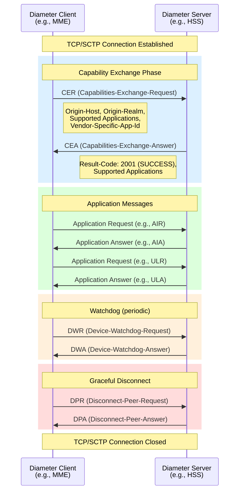
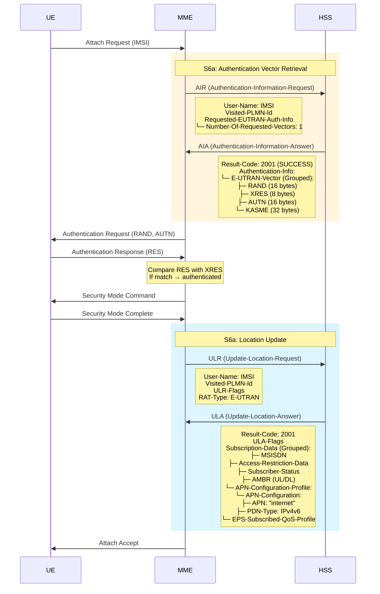
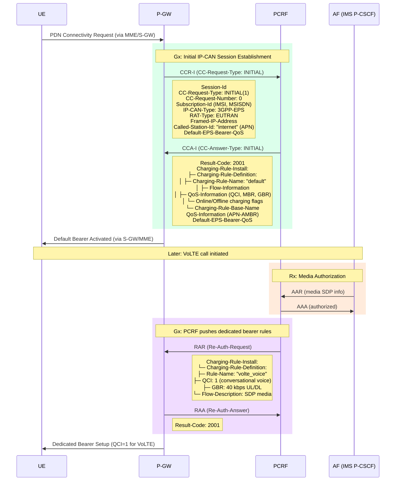

# Module 10: Diameter Protocol

## 1. Why Diameter Was Introduced

### RADIUS Limitations

RADIUS (Remote Authentication Dial-In User Service) was designed in the 1990s for dial-up access. As networks evolved toward 3G/4G, RADIUS could not meet modern requirements:

| Limitation | Impact |
|-----------|--------|
| **UDP transport (unreliable)** | Messages can be lost silently; no built-in retransmission |
| **No server-initiated messages** | Server cannot push policy changes or disconnect users proactively |
| **Limited AVP space** | 8-bit attribute type field = max 255 attribute types |
| **No application-layer ACK** | Cannot confirm message delivery at application level |
| **Weak security model** | Shared secret + MD5 only; no hop-by-hop TLS built-in |
| **No capability negotiation** | Peers cannot discover supported features |
| **Client-server only** | No peer-to-peer; no agent/relay architecture |

### Diameter's Answer

Diameter (the name implies "twice the RADIUS") was defined in **RFC 6733** to address all these limitations:
- Reliable transport (TCP/SCTP)
- Server-initiated messages (push model)
- 32-bit AVP code space (4+ billion attribute types)
- Built-in capability exchange and error handling
- Agent architecture for scalable routing
- Native TLS/DTLS support

> ⚠️ **Key Concept**: Diameter is a **CONTROL PLANE** protocol only. It carries signaling (authentication, authorization, accounting, policy) — never user data traffic.

---

## 2. Diameter vs RADIUS Comparison

| Feature | RADIUS | Diameter |
|---------|--------|----------|
| **RFC** | RFC 2865/2866 | RFC 6733 |
| **Transport** | UDP (unreliable) | TCP/SCTP (reliable) |
| **Port** | 1812/1813 | 3868 |
| **Connection** | Per-request | Persistent peer connections |
| **Direction** | Client→Server only | Peer-to-peer (both can initiate) |
| **AVP code space** | 8-bit (255 max) | 32-bit (4 billion+) |
| **Security** | Shared secret + MD5 | TLS/DTLS, IPsec |
| **Max message size** | 4096 bytes | 16 MB (24-bit length) |
| **Failover** | Application-dependent | Built-in (transport-level detection) |
| **Capability negotiation** | None | CER/CEA exchange |
| **Server-initiated** | No | Yes (e.g., RAR, ASR) |
| **Agent support** | Limited (proxy) | Relay, Proxy, Redirect, Translation |
| **Accounting** | Interim updates only | Real-time with guaranteed delivery |
| **Vendor AVPs** | Limited | Native vendor-ID support |
| **Used in** | Wi-Fi, VPN, ISP | LTE/4G core, IMS, VoLTE |

---

## 3. Diameter Architecture

### 3.1 Diameter Nodes

| Node Type | Role |
|-----------|------|
| **Diameter Client** | Generates requests (e.g., MME, P-GW) |
| **Diameter Server** | Processes requests, returns answers (e.g., HSS, PCRF, OCS) |
| **Diameter Agent** | Intermediary that routes/processes messages |

#### Agent Types

| Agent | Function |
|-------|----------|
| **Relay** | Routes messages based on realm; does NOT modify AVPs |
| **Proxy** | Routes messages AND may modify AVPs (policy enforcement) |
| **Redirect** | Returns routing information to sender (does not forward) |
| **Translation** | Translates between Diameter and other protocols (e.g., RADIUS↔Diameter) |

### 3.2 Peer Connections

- **Transport**: TCP (default) or SCTP (preferred for multi-homing)
- **Port**: 3868 (plaintext) or 5868 (TLS)
- **Persistent**: Connection stays up; monitored by watchdog (DWR/DWA)
- **Peer-to-peer**: Both endpoints can initiate messages
- **Capability Exchange**: CER/CEA must succeed before application messages

### 3.3 Realm-Based Routing

Diameter routes messages based on **realms** (domain-like identifiers):
- Each node is configured with a realm (e.g., `epc.mnc001.mcc208.3gppnetwork.org`)
- Routing table maps realms → peer connections
- Agents use `Destination-Realm` AVP to determine next hop
- Enables multi-operator and roaming scenarios

---


## 4. Diameter Message Structure

### 4.1 Message Header (20 bytes fixed)

```
 0                   1                   2                   3
 0 1 2 3 4 5 6 7 8 9 0 1 2 3 4 5 6 7 8 9 0 1 2 3 4 5 6 7 8 9 0 1
+-+-+-+-+-+-+-+-+-+-+-+-+-+-+-+-+-+-+-+-+-+-+-+-+-+-+-+-+-+-+-+-+
|    Version    |                 Message Length                 |
+-+-+-+-+-+-+-+-+-+-+-+-+-+-+-+-+-+-+-+-+-+-+-+-+-+-+-+-+-+-+-+-+
| R P E T r r r r|                Command Code                  |
+-+-+-+-+-+-+-+-+-+-+-+-+-+-+-+-+-+-+-+-+-+-+-+-+-+-+-+-+-+-+-+-+
|                         Application-ID                         |
+-+-+-+-+-+-+-+-+-+-+-+-+-+-+-+-+-+-+-+-+-+-+-+-+-+-+-+-+-+-+-+-+
|                        Hop-by-Hop ID                           |
+-+-+-+-+-+-+-+-+-+-+-+-+-+-+-+-+-+-+-+-+-+-+-+-+-+-+-+-+-+-+-+-+
|                        End-to-End ID                           |
+-+-+-+-+-+-+-+-+-+-+-+-+-+-+-+-+-+-+-+-+-+-+-+-+-+-+-+-+-+-+-+-+
```

| Field | Size | Description |
|-------|------|-------------|
| **Version** | 1 byte | Always `1` |
| **Message Length** | 3 bytes | Total message length including header |
| **Flags** | 1 byte | R=Request, P=Proxiable, E=Error, T=Retransmit |
| **Command Code** | 3 bytes | Identifies the command (e.g., 318 = AIR) |
| **Application-ID** | 4 bytes | Identifies the application (e.g., 16777251 = S6a) |
| **Hop-by-Hop ID** | 4 bytes | Matches request/answer on a single hop (unique per connection) |
| **End-to-End ID** | 4 bytes | Matches request/answer end-to-end (unique globally) |

#### Header Flags

| Flag | Bit | Meaning |
|------|-----|---------|
| **R** | 0 | Request (1) or Answer (0) |
| **P** | 1 | Proxiable — can be relayed/proxied |
| **E** | 2 | Error — answer contains error |
| **T** | 3 | Retransmitted message |

### 4.2 AVP (Attribute-Value Pair) Structure

```
 0                   1                   2                   3
 0 1 2 3 4 5 6 7 8 9 0 1 2 3 4 5 6 7 8 9 0 1 2 3 4 5 6 7 8 9 0 1
+-+-+-+-+-+-+-+-+-+-+-+-+-+-+-+-+-+-+-+-+-+-+-+-+-+-+-+-+-+-+-+-+
|                           AVP Code                            |
+-+-+-+-+-+-+-+-+-+-+-+-+-+-+-+-+-+-+-+-+-+-+-+-+-+-+-+-+-+-+-+-+
|V M P r r r r r|                  AVP Length                   |
+-+-+-+-+-+-+-+-+-+-+-+-+-+-+-+-+-+-+-+-+-+-+-+-+-+-+-+-+-+-+-+-+
|                        Vendor-ID (optional)                    |
+-+-+-+-+-+-+-+-+-+-+-+-+-+-+-+-+-+-+-+-+-+-+-+-+-+-+-+-+-+-+-+-+
|                            Data ...                            |
+-+-+-+-+-+-+-+-+-+-+-+-+-+-+-+-+-+-+-+-+-+-+-+-+-+-+-+-+-+-+-+-+
```

| Field | Description |
|-------|-------------|
| **AVP Code** | 32-bit identifier for the attribute |
| **V flag** | Vendor-specific — Vendor-ID field is present |
| **M flag** | Mandatory — receiver MUST understand this AVP |
| **P flag** | Protected — end-to-end encryption needed |
| **AVP Length** | Total AVP length (header + data) |
| **Vendor-ID** | 32-bit vendor identifier (present only if V=1) |
| **Data** | The actual value (various types) |

#### AVP Data Types

| Type | Description | Example |
|------|-------------|---------|
| OctetString | Raw bytes | RAND, AUTN |
| UTF8String | Text string | User-Name |
| Unsigned32 | 32-bit unsigned integer | Result-Code |
| Unsigned64 | 64-bit unsigned integer | Accounting counters |
| Address | IP address (IPv4/IPv6) | Framed-IP-Address |
| Time | Seconds since Jan 1, 1900 | Event-Timestamp |
| Enumerated | Named integer values | Auth-Session-State |
| Grouped | Contains other AVPs | Subscription-Data |

### 4.3 Grouped AVPs

Grouped AVPs contain other AVPs as their data — enabling hierarchical structures:

```
Subscription-Data (Grouped AVP)
├── MSISDN: +33612345678
├── Access-Restriction-Data: 0x00000000
├── Subscriber-Status: SERVICE_GRANTED
├── APN-Configuration-Profile (Grouped)
│   ├── Context-Identifier: 1
│   ├── APN-Configuration (Grouped)
│   │   ├── Service-Selection: "internet"
│   │   ├── PDN-Type: IPv4v6
│   │   └── EPS-Subscribed-QoS-Profile (Grouped)
│   │       ├── QoS-Class-Identifier: 9
│   │       └── Allocation-Retention-Priority (Grouped)
│   │           ├── Priority-Level: 15
│   │           └── Pre-emption-Capability: NOT_PRE_EMPT
```

### Key AVPs Table

| AVP Name | Code | Type | Used In |
|----------|------|------|---------|
| Session-Id | 263 | UTF8String | All messages |
| Origin-Host | 264 | DiameterIdentity | All messages |
| Origin-Realm | 296 | DiameterIdentity | All messages |
| Destination-Host | 293 | DiameterIdentity | Requests |
| Destination-Realm | 283 | DiameterIdentity | Requests |
| Result-Code | 268 | Unsigned32 | All answers |
| Auth-Session-State | 277 | Enumerated | Auth messages |
| User-Name | 1 | UTF8String | User identification (IMSI) |
| Visited-PLMN-Id | 1407 | OctetString | S6a messages |
| Subscription-Data | 1400 | Grouped | S6a (ULA) |
| Charging-Rule-Install | 1001 | Grouped | Gx (CCA) |
| CC-Request-Type | 416 | Enumerated | Gy/Gx (CCR) |

---


## 5. Diameter Commands

### 5.1 Naming Convention

All Diameter commands follow the pattern:
- **Request**: `X-Request` (abbreviated `XR`) — R flag = 1
- **Answer**: `X-Answer` (abbreviated `XA`) — R flag = 0

Every request MUST receive exactly one answer.

### 5.2 Base Protocol Commands (Application-ID = 0)

| Command | Code | Abbreviation | Purpose |
|---------|------|--------------|---------|
| Capabilities-Exchange-Request | 257 | CER | Initiate peer connection, exchange capabilities |
| Capabilities-Exchange-Answer | 257 | CEA | Respond with own capabilities |
| Device-Watchdog-Request | 280 | DWR | Heartbeat — verify peer is alive |
| Device-Watchdog-Answer | 280 | DWA | Confirm alive status |
| Disconnect-Peer-Request | 282 | DPR | Gracefully close connection |
| Disconnect-Peer-Answer | 282 | DPA | Acknowledge disconnection |
| Accounting-Request | 271 | ACR | Send accounting record |
| Accounting-Answer | 271 | ACA | Acknowledge accounting record |
| Abort-Session-Request | 274 | ASR | Server requests session termination |
| Abort-Session-Answer | 274 | ASA | Client acknowledges termination |
| Re-Auth-Request | 258 | RAR | Server requests re-authentication |
| Re-Auth-Answer | 258 | RAA | Client acknowledges re-auth |

### 5.3 Diameter Message Exchange Flow



### 5.4 Result Codes

| Code | Name | Meaning |
|------|------|---------|
| 2001 | DIAMETER_SUCCESS | Request processed successfully |
| 3xxx | Protocol Errors | Redirect, unable to deliver |
| 4xxx | Transient Failures | Retry may succeed (e.g., 4012 = DIAMETER_UNABLE_TO_COMPLY) |
| 5xxx | Permanent Failures | Do not retry (e.g., 5001 = DIAMETER_AVP_UNSUPPORTED) |
| 5004 | DIAMETER_UNKNOWN_SESSION_ID | Session not found |
| 5012 | DIAMETER_UNABLE_TO_COMPLY | General permanent failure |

---


## 6. Important Diameter Applications in LTE

### 6.1 Overview of LTE Diameter Interfaces

| Interface | Endpoints | Application-ID | Purpose |
|-----------|-----------|----------------|---------|
| **S6a** | MME ↔ HSS | 16777251 | Authentication, subscriber data |
| **Gx** | PCRF ↔ P-GW | 16777238 | Policy and Charging Control (PCC) |
| **Gy** | OCS ↔ P-GW | 4 (Credit-Control) | Online charging |
| **Rx** | AF ↔ PCRF | 16777236 | Application-level QoS/media authorization |
| **S13** | MME ↔ EIR | 16777252 | Equipment identity check (IMEI) |
| **S6d** | SGSN ↔ HSS | 16777251 | 2G/3G authentication via Diameter |
| **SWx** | 3GPP AAA ↔ HSS | 16777265 | Non-3GPP access authentication |
| **Sh** | AS ↔ HSS | 16777217 | IMS service data |

### 6.2 S6a Interface (MME ↔ HSS)

The most critical Diameter interface in LTE — handles all subscriber authentication and data management.

| Command | Code | Direction | Purpose |
|---------|------|-----------|---------|
| Authentication-Information-Request | 318 | MME→HSS | Request authentication vectors |
| Authentication-Information-Answer | 318 | HSS→MME | Return auth vectors (RAND, AUTN, XRES, KASME) |
| Update-Location-Request | 316 | MME→HSS | Register UE location at MME |
| Update-Location-Answer | 316 | HSS→MME | Return subscription data |
| Purge-UE-Request | 321 | MME→HSS | Inform HSS that UE data purged |
| Purge-UE-Answer | 321 | HSS→MME | Acknowledge purge |
| Cancel-Location-Request | 317 | HSS→MME | HSS tells MME to detach UE |
| Cancel-Location-Answer | 317 | MME→HSS | Acknowledge cancel |
| Notify-Request | 323 | MME→HSS | Notify HSS of terminal info |
| Notify-Answer | 323 | HSS→MME | Acknowledge notification |

### 6.3 Gx Interface (PCRF ↔ P-GW)

Controls **Policy and Charging Control (PCC)** — decides what QoS and charging rules apply to each session.

| Command | Code | Direction | Purpose |
|---------|------|-----------|---------|
| CC-Request (Initial) | 272 | P-GW→PCRF | New IP-CAN session — request PCC rules |
| CC-Answer (Initial) | 272 | PCRF→P-GW | Install PCC rules (QoS, gates, charging) |
| CC-Request (Update) | 272 | P-GW→PCRF | Session modification (e.g., new bearer) |
| CC-Answer (Update) | 272 | PCRF→P-GW | Updated PCC rules |
| CC-Request (Termination) | 272 | P-GW→PCRF | Session ended |
| CC-Answer (Termination) | 272 | PCRF→P-GW | Acknowledge termination |
| Re-Auth-Request | 258 | PCRF→P-GW | Push new PCC rules mid-session |
| Re-Auth-Answer | 258 | P-GW→PCRF | Acknowledge rule update |

**CC-Request-Type values**: INITIAL(1), UPDATE(2), TERMINATION(3), EVENT(4)

### 6.4 Gy Interface (OCS ↔ P-GW)

Handles **online charging** — credit reservation and debit in real-time.

| Command | Code | Direction | Purpose |
|---------|------|-----------|---------|
| CC-Request (Initial) | 272 | P-GW→OCS | Reserve initial credit quota |
| CC-Answer (Initial) | 272 | OCS→P-GW | Grant credit (units/time/volume) |
| CC-Request (Update) | 272 | P-GW→OCS | Report usage, request more credit |
| CC-Answer (Update) | 272 | OCS→P-GW | Grant additional credit or deny |
| CC-Request (Termination) | 272 | P-GW→OCS | Final report, release reservation |
| CC-Answer (Termination) | 272 | OCS→P-GW | Acknowledge final |

> Gx vs Gy: **Gx** = policy rules (what QoS to apply), **Gy** = charging (how much credit remains)

### 6.5 Rx Interface (AF ↔ PCRF)

Allows application functions (e.g., IMS P-CSCF for VoLTE) to request specific QoS from the network.

| Command | Code | Direction | Purpose |
|---------|------|-----------|---------|
| AA-Request | 265 | AF→PCRF | Request media authorization (SDP info) |
| AA-Answer | 265 | PCRF→AF | Confirm media session authorized |
| Session-Termination-Request | 275 | AF→PCRF | Media session ended |
| Session-Termination-Answer | 275 | PCRF→AF | Acknowledge |
| Re-Auth-Request | 258 | PCRF→AF | Notify AF of bearer changes |
| Abort-Session-Request | 274 | PCRF→AF | PCRF aborts media session |

### 6.6 S13 Interface (MME ↔ EIR)

Equipment identity check — validates IMEI against blacklist/greylist.

| Command | Code | Direction | Purpose |
|---------|------|-----------|---------|
| ME-Identity-Check-Request | 324 | MME→EIR | Send IMEI for validation |
| ME-Identity-Check-Answer | 324 | EIR→MME | Return equipment status (white/grey/black) |

---


## 7. Diameter in LTE Authentication (S6a Deep Dive)

### 7.1 Authentication Flow

When a UE attaches to the LTE network, the MME uses S6a to:
1. **Obtain authentication vectors** from the HSS (AIR/AIA)
2. **Register UE location** at the MME (ULR/ULA)



### 7.2 AIR (Authentication-Information-Request) Details

**Purpose**: MME requests fresh authentication vectors from HSS

**Key AVPs in AIR**:
| AVP | Purpose |
|-----|---------|
| User-Name | IMSI of the subscriber |
| Visited-PLMN-Id | 3-byte MCC+MNC of visited network |
| Requested-EUTRAN-Authentication-Info | Specifies how many vectors needed |
| Number-Of-Requested-Vectors | Typically 1-5 |
| Re-Synchronization-Info | Sent if previous auth failed (SQN sync) |

### 7.3 AIA (Authentication-Information-Answer) Details

**Purpose**: HSS returns E-UTRAN authentication vectors

**Key AVPs in AIA**:
| AVP | Purpose |
|-----|---------|
| Result-Code | 2001=success, 5001=user unknown |
| Authentication-Info (Grouped) | Contains the vectors |
| E-UTRAN-Vector (Grouped) | One complete auth vector |
| ├─ RAND | 128-bit random challenge |
| ├─ XRES | Expected Response (for verification) |
| ├─ AUTN | Authentication Token (for mutual auth) |
| └─ KASME | Key for NAS/AS security derivation |

### 7.4 ULR (Update-Location-Request) Details

**Purpose**: MME registers itself as serving MME for this subscriber

**Key AVPs in ULR**:
| AVP | Purpose |
|-----|---------|
| User-Name | IMSI |
| Visited-PLMN-Id | Serving network identity |
| RAT-Type | E-UTRAN (LTE) |
| ULR-Flags | Indicates initial attach vs TAU |

### 7.5 ULA (Update-Location-Answer) Details

**Purpose**: HSS acknowledges and returns complete subscription profile

**Key AVPs in ULA**:
| AVP | Purpose |
|-----|---------|
| Result-Code | Success or failure |
| Subscription-Data (Grouped) | Complete subscriber profile |
| ├─ MSISDN | Phone number |
| ├─ AMBR | Aggregate Max Bit Rate (UL + DL) |
| ├─ APN-Configuration-Profile | All configured APNs |
| └─ Subscriber-Status | SERVICE_GRANTED or BARRED |

---


## Gx Policy Flow (CCR-I/CCA-I at Session Start)



---

## 8. Diameter vs HTTP/2 in 5G

### 8.1 The Transition

| Aspect | 4G (Diameter) | 5G (HTTP/2 + JSON) |
|--------|---------------|---------------------|
| **Protocol** | Diameter (binary, TCP/SCTP) | HTTP/2 (text-based headers, binary framing) |
| **Data format** | AVPs (binary TLV) | JSON (human-readable) |
| **Architecture** | Point-to-point peers | Service-Based Interface (SBI) |
| **Discovery** | Static peer config / DRA | NRF (Network Repository Function) |
| **Interface naming** | S6a, Gx, Gy, Rx | Nausf, Npcf, Nchf, Naf |
| **Session state** | Stateful (session-id maintained) | Stateless (REST-like) |
| **Connection model** | Persistent peer connections | HTTP request/response |
| **Scaling** | Vertical (bigger peers) | Horizontal (cloud-native, k8s) |
| **Message routing** | Diameter Routing Agents (DRA) | Service Mesh / API Gateway |
| **Standard** | IETF RFC 6733 + 3GPP | 3GPP + IETF HTTP/2 (RFC 7540) |

### 8.2 Why 5G Moved Away from Diameter

1. **Simpler tooling**: HTTP/2 + JSON leverages existing web infrastructure (proxies, load balancers, API gateways)
2. **Web-native**: Standard REST APIs — easier for developers, standard debugging tools
3. **Stateless design**: Enables cloud-native microservices, horizontal scaling, Kubernetes orchestration
4. **Cloud-friendly**: No persistent peer connections; standard load balancing works
5. **Flexibility**: JSON schema evolution is easier than binary AVP definitions
6. **Ecosystem**: Massive HTTP/2 ecosystem (libraries, tools, monitoring)

### 8.3 Diameter Equivalent Functions in 5G

| 4G Diameter Interface | 5G SBI Equivalent | NF Involved |
|----------------------|-------------------|-------------|
| S6a (MME↔HSS) | Nudm (UDM services) | AMF ↔ UDM/AUSF |
| Gx (PCRF↔P-GW) | Npcf (Policy services) | SMF ↔ PCF |
| Gy (OCS↔P-GW) | Nchf (Charging services) | SMF ↔ CHF |
| Rx (AF↔PCRF) | Npcf + Naf | AF ↔ PCF (via NEF) |

### 8.4 Migration: 4G/5G Interworking

Diameter is NOT gone — it persists at interworking boundaries:
- **Diameter Routing Agent (DRA)** still used in 4G
- **Interworking Function (IWF)** translates Diameter ↔ HTTP/2 at 4G/5G border
- NSA (Non-Standalone) 5G still uses EPC with Diameter
- Full migration to SA (Standalone) 5G eliminates Diameter within the core

---

## 9. Diameter = Control Plane Only

### Critical Distinction

```
┌─────────────────────────────────────────────────────────────┐
│                    LTE Protocol Planes                        │
├─────────────────────────────────────────────────────────────┤
│                                                              │
│  CONTROL PLANE (Signaling)          USER PLANE (Data)        │
│  ┌───────────────────────┐         ┌──────────────────────┐ │
│  │ • Diameter (S6a, Gx,  │         │ • GTP-U (GPRS        │ │
│  │   Gy, Rx, S13)        │         │   Tunneling Protocol │ │
│  │ • GTP-C (S11, S5)     │         │   - User plane)      │ │
│  │ • NAS (MME↔UE)        │         │ • Carries actual     │ │
│  │ • S1-AP (MME↔eNB)     │         │   IP packets         │ │
│  │ • X2-AP (eNB↔eNB)     │         │ • YouTube, web,      │ │
│  │                        │         │   voice RTP, etc.    │ │
│  └───────────────────────┘         └──────────────────────┘ │
│                                                              │
│  Diameter NEVER carries user data!                           │
│  It only decides: WHO can connect, WHAT QoS they get,       │
│  HOW MUCH they are charged.                                  │
└─────────────────────────────────────────────────────────────┘
```

### What Diameter Controls vs What Carries Data

| Function | Protocol | Plane |
|----------|----------|-------|
| Authenticate subscriber | Diameter S6a | Control |
| Authorize QoS policy | Diameter Gx | Control |
| Check credit balance | Diameter Gy | Control |
| Authorize media session | Diameter Rx | Control |
| Validate IMEI | Diameter S13 | Control |
| Carry YouTube video | GTP-U | User |
| Carry VoLTE voice (RTP) | GTP-U | User |
| Carry web browsing | GTP-U | User |

> 📌 **Remember**: Diameter tells the network *what to do*. GTP-U *does it*.

---

## Summary

| Topic | Key Takeaway |
|-------|-------------|
| Why Diameter | RADIUS too limited for mobile core (no reliable transport, no push, limited AVPs) |
| Architecture | Client/Server/Agent model with persistent TCP/SCTP peers and realm routing |
| Messages | 20-byte header + AVPs; every Request gets exactly one Answer |
| S6a | Authentication (AIR/AIA) + Location Update (ULR/ULA) — the backbone of LTE mobility |
| Gx | Policy control — installs QoS rules on bearers (CCR/CCA + RAR/RAA) |
| Gy | Online charging — real-time credit control |
| Rx | Application QoS — IMS/VoLTE media authorization |
| 5G transition | HTTP/2 + JSON replaces Diameter; IWF for interworking |
| Scope | Control plane ONLY — never carries user data |

---

*Module 10 — Diameter Protocol | Advanced Communication Networks*
