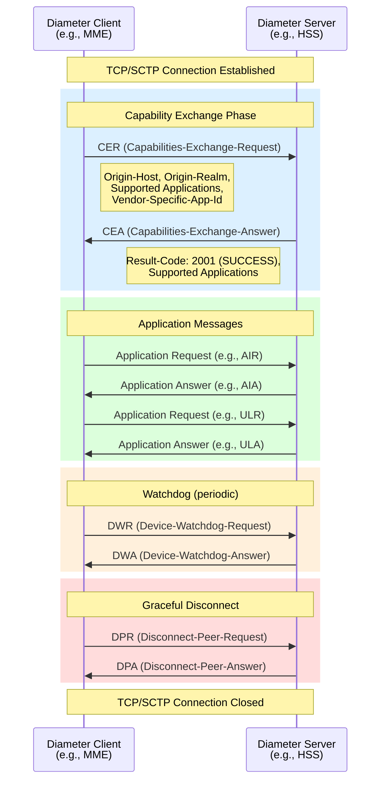
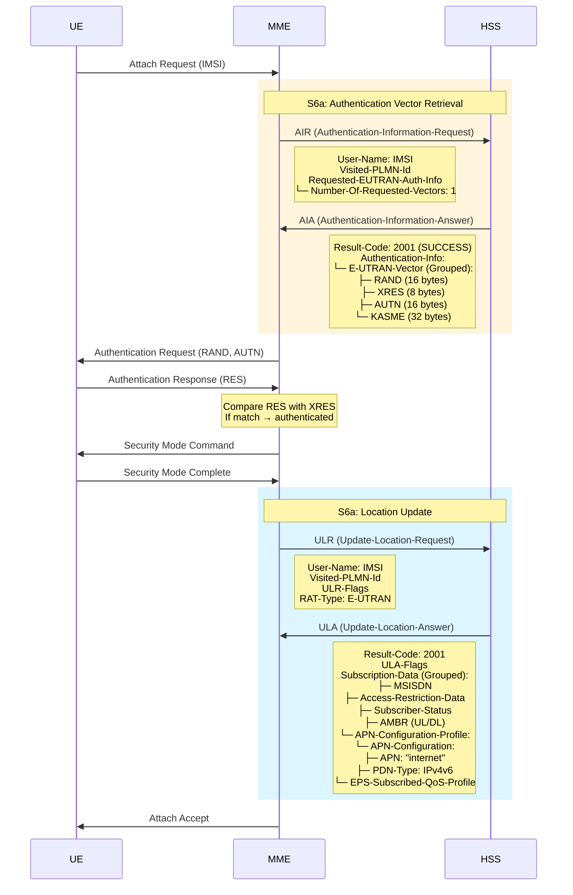
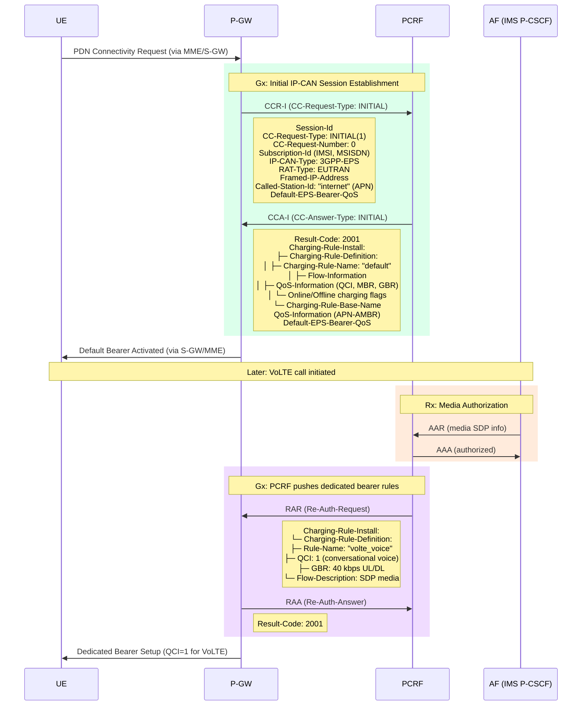

# ماژول 10: پروتکل Diameter

## 1. چرا Diameter معرفی شد

### محدودیت‌های RADIUS

RADIUS (سرویس کاربر شماره‌گیری از راه دور احراز هویت) در دهه 1990 برای دسترسی شماره‌گیری طراحی شد. با تحول شبکه‌ها به‌سمت 3G/4G، RADIUS نمی‌توانست نیازمندی‌های مدرن را برآورده کند:

| محدودیت | تأثیر |
|-----------|--------|
| **انتقال UDP (غیرقابل اعتماد)** | پیام‌ها می‌توانند بی‌صدا گم شوند؛ بدون بازارسال داخلی |
| **بدون پیام‌های با شروع سرور** | سرور نمی‌تواند تغییرات سیاست را ارسال کند یا کاربران را فعالانه قطع کند |
| **فضای محدود AVP** | فیلد نوع صفت 8 بیتی = حداکثر 255 نوع صفت |
| **بدون ACK در لایه کاربرد** | نمی‌توان تحویل پیام را در سطح کاربرد تأیید کرد |
| **مدل امنیتی ضعیف** | فقط راز مشترک + MD5؛ بدون TLS گام-به-گام داخلی |
| **بدون مذاکره قابلیت** | همتاها نمی‌توانند ویژگی‌های پشتیبانی‌شده را کشف کنند |
| **فقط کارخواه-کارساز** | بدون همتا-به-همتا؛ بدون معماری عامل/رله |

### پاسخ Diameter

Diameter (نام آن به معنای «دو برابر RADIUS») در **RFC 6733** برای رفع تمام این محدودیت‌ها تعریف شد:
- انتقال قابل اعتماد (TCP/SCTP)
- پیام‌های با شروع سرور (مدل ارسال)
- فضای کد AVP 32 بیتی (بیش از 4 میلیارد نوع صفت)
- تبادل قابلیت و مدیریت خطای داخلی
- معماری عامل برای مسیریابی مقیاس‌پذیر
- پشتیبانی بومی TLS/DTLS

> ⚠️ **مفهوم کلیدی**: Diameter فقط یک پروتکل **صفحه کنترل** است. سیگنالینگ را حمل می‌کند (احراز هویت، مجوزدهی، حسابداری، سیاست) — هرگز ترافیک داده کاربر.

---

## 2. مقایسه Diameter با RADIUS

| ویژگی | RADIUS | Diameter |
|---------|--------|----------|
| **RFC** | RFC 2865/2866 | RFC 6733 |
| **انتقال** | UDP (غیرقابل اعتماد) | TCP/SCTP (قابل اعتماد) |
| **پورت** | 1812/1813 | 3868 |
| **اتصال** | در هر درخواست | اتصالات همتای پایدار |
| **جهت** | فقط کارخواه←کارساز | همتا-به-همتا (هر دو می‌توانند آغاز کنند) |
| **فضای کد AVP** | 8 بیتی (حداکثر 255) | 32 بیتی (بیش از 4 میلیارد) |
| **امنیت** | راز مشترک + MD5 | TLS/DTLS، IPsec |
| **حداکثر اندازه پیام** | 4096 بایت | 16 MB (طول 24 بیتی) |
| **تغییر مسیر** | وابسته به کاربرد | داخلی (تشخیص در سطح انتقال) |
| **مذاکره قابلیت** | ندارد | تبادل CER/CEA |
| **با شروع سرور** | خیر | بله (مثلاً RAR، ASR) |
| **پشتیبانی عامل** | محدود (پروکسی) | رله، پروکسی، تغییر مسیر، ترجمه |
| **حسابداری** | فقط به‌روزرسانی‌های موقت | بلادرنگ با تحویل تضمین‌شده |
| **AVPهای سازنده** | محدود | پشتیبانی بومی شناسه سازنده |
| **مورد استفاده در** | Wi-Fi، VPN، ISP | هسته LTE/4G، IMS، VoLTE |

---

## 3. معماری Diameter

### 3.1 گره‌های Diameter

| نوع گره | نقش |
|-----------|------|
| **کارخواه Diameter** | درخواست‌ها را تولید می‌کند (مثلاً MME، P-GW) |
| **کارساز Diameter** | درخواست‌ها را پردازش و پاسخ‌ها را بازمی‌گرداند (مثلاً HSS، PCRF، OCS) |
| **عامل Diameter** | واسطه‌ای که پیام‌ها را مسیریابی/پردازش می‌کند |

#### انواع عامل

| عامل | عملکرد |
|-------|----------|
| **رله** | پیام‌ها را بر اساس realm مسیریابی می‌کند؛ AVPها را تغییر **نمی‌دهد** |
| **پروکسی** | پیام‌ها را مسیریابی **و** ممکن است AVPها را تغییر دهد (اجرای سیاست) |
| **تغییر مسیر** | اطلاعات مسیریابی را به فرستنده بازمی‌گرداند (ارسال نمی‌کند) |
| **ترجمه** | بین Diameter و سایر پروتکل‌ها ترجمه می‌کند (مثلاً RADIUS↔Diameter) |

### 3.2 اتصالات همتا

- **انتقال**: TCP (پیش‌فرض) یا SCTP (ترجیحی برای چند-میزبانی)
- **پورت**: 3868 (متن ساده) یا 5868 (TLS)
- **پایدار**: اتصال برقرار می‌ماند؛ با نگهبان (DWR/DWA) پایش می‌شود
- **همتا-به-همتا**: هر دو نقطه انتهایی می‌توانند پیام آغاز کنند
- **تبادل قابلیت**: CER/CEA باید پیش از پیام‌های کاربرد موفق شود

### 3.3 مسیریابی مبتنی بر Realm

Diameter پیام‌ها را بر اساس **realmها** (شناسه‌های شبه-دامنه) مسیریابی می‌کند:
- هر گره با یک realm پیکربندی می‌شود (مثلاً `epc.mnc001.mcc208.3gppnetwork.org`)
- جدول مسیریابی realmها را به اتصالات همتا نگاشت می‌کند
- عامل‌ها از AVP `Destination-Realm` برای تعیین گام بعدی استفاده می‌کنند
- سناریوهای چند-اپراتوری و رومینگ را ممکن می‌سازد

---


## 4. ساختار پیام Diameter

### 4.1 سرآیند پیام (20 بایت ثابت)

```
 0                   1                   2                   3
 0 1 2 3 4 5 6 7 8 9 0 1 2 3 4 5 6 7 8 9 0 1 2 3 4 5 6 7 8 9 0 1
+-+-+-+-+-+-+-+-+-+-+-+-+-+-+-+-+-+-+-+-+-+-+-+-+-+-+-+-+-+-+-+-+
|    Version    |                 Message Length                 |
+-+-+-+-+-+-+-+-+-+-+-+-+-+-+-+-+-+-+-+-+-+-+-+-+-+-+-+-+-+-+-+-+
| R P E T r r r r|                Command Code                  |
+-+-+-+-+-+-+-+-+-+-+-+-+-+-+-+-+-+-+-+-+-+-+-+-+-+-+-+-+-+-+-+-+
|                         Application-ID                         |
+-+-+-+-+-+-+-+-+-+-+-+-+-+-+-+-+-+-+-+-+-+-+-+-+-+-+-+-+-+-+-+-+
|                        Hop-by-Hop ID                           |
+-+-+-+-+-+-+-+-+-+-+-+-+-+-+-+-+-+-+-+-+-+-+-+-+-+-+-+-+-+-+-+-+
|                        End-to-End ID                           |
+-+-+-+-+-+-+-+-+-+-+-+-+-+-+-+-+-+-+-+-+-+-+-+-+-+-+-+-+-+-+-+-+
```

| فیلد | اندازه | توضیح |
|-------|------|-------------|
| **Version** | 1 بایت | همیشه `1` |
| **Message Length** | 3 بایت | طول کل پیام شامل سرآیند |
| **Flags** | 1 بایت | R=Request، P=Proxiable، E=Error، T=Retransmit |
| **Command Code** | 3 بایت | فرمان را شناسایی می‌کند (مثلاً 318 = AIR) |
| **Application-ID** | 4 بایت | کاربرد را شناسایی می‌کند (مثلاً 16777251 = S6a) |
| **Hop-by-Hop ID** | 4 بایت | درخواست/پاسخ را در یک گام تطبیق می‌دهد (یکتا در هر اتصال) |
| **End-to-End ID** | 4 بایت | درخواست/پاسخ را سرتاسری تطبیق می‌دهد (یکتا در سطح جهانی) |

#### پرچم‌های سرآیند

| پرچم | بیت | معنا |
|------|-----|---------|
| **R** | 0 | درخواست (1) یا پاسخ (0) |
| **P** | 1 | قابل پروکسی — می‌تواند رله/پروکسی شود |
| **E** | 2 | خطا — پاسخ شامل خطا است |
| **T** | 3 | پیام دوباره ارسال‌شده |

### 4.2 ساختار AVP (جفت صفت-مقدار)

```
 0                   1                   2                   3
 0 1 2 3 4 5 6 7 8 9 0 1 2 3 4 5 6 7 8 9 0 1 2 3 4 5 6 7 8 9 0 1
+-+-+-+-+-+-+-+-+-+-+-+-+-+-+-+-+-+-+-+-+-+-+-+-+-+-+-+-+-+-+-+-+
|                           AVP Code                            |
+-+-+-+-+-+-+-+-+-+-+-+-+-+-+-+-+-+-+-+-+-+-+-+-+-+-+-+-+-+-+-+-+
|V M P r r r r r|                  AVP Length                   |
+-+-+-+-+-+-+-+-+-+-+-+-+-+-+-+-+-+-+-+-+-+-+-+-+-+-+-+-+-+-+-+-+
|                        Vendor-ID (optional)                    |
+-+-+-+-+-+-+-+-+-+-+-+-+-+-+-+-+-+-+-+-+-+-+-+-+-+-+-+-+-+-+-+-+
|                            Data ...                            |
+-+-+-+-+-+-+-+-+-+-+-+-+-+-+-+-+-+-+-+-+-+-+-+-+-+-+-+-+-+-+-+-+
```

| فیلد | توضیح |
|-------|-------------|
| **AVP Code** | شناسه 32 بیتی برای صفت |
| **پرچم V** | مختص سازنده — فیلد Vendor-ID وجود دارد |
| **پرچم M** | اجباری — گیرنده **باید** این AVP را بفهمد |
| **پرچم P** | محافظت‌شده — رمزنگاری سرتاسری لازم است |
| **AVP Length** | طول کل AVP (سرآیند + داده) |
| **Vendor-ID** | شناسه سازنده 32 بیتی (فقط اگر V=1 باشد وجود دارد) |
| **Data** | مقدار واقعی (انواع مختلف) |

#### انواع داده AVP

| نوع | توضیح | مثال |
|------|-------------|---------|
| OctetString | بایت‌های خام | RAND، AUTN |
| UTF8String | رشته متنی | User-Name |
| Unsigned32 | عدد صحیح بدون علامت 32 بیتی | Result-Code |
| Unsigned64 | عدد صحیح بدون علامت 64 بیتی | شمارنده‌های حسابداری |
| Address | آدرس IP (IPv4/IPv6) | Framed-IP-Address |
| Time | ثانیه از 1 ژانویه 1900 | Event-Timestamp |
| Enumerated | مقادیر صحیح نام‌دار | Auth-Session-State |
| Grouped | شامل AVPهای دیگر | Subscription-Data |

### 4.3 AVPهای گروهی

AVPهای گروهی شامل AVPهای دیگر به‌عنوان داده خود هستند — که ساختارهای سلسله‌مراتبی را ممکن می‌سازند:

```
Subscription-Data (Grouped AVP)
├── MSISDN: +33612345678
├── Access-Restriction-Data: 0x00000000
├── Subscriber-Status: SERVICE_GRANTED
├── APN-Configuration-Profile (Grouped)
│   ├── Context-Identifier: 1
│   ├── APN-Configuration (Grouped)
│   │   ├── Service-Selection: "internet"
│   │   ├── PDN-Type: IPv4v6
│   │   └── EPS-Subscribed-QoS-Profile (Grouped)
│   │       ├── QoS-Class-Identifier: 9
│   │       └── Allocation-Retention-Priority (Grouped)
│   │           ├── Priority-Level: 15
│   │           └── Pre-emption-Capability: NOT_PRE_EMPT
```

### جدول AVPهای کلیدی

| نام AVP | کد | نوع | مورد استفاده در |
|----------|------|------|---------|
| Session-Id | 263 | UTF8String | تمام پیام‌ها |
| Origin-Host | 264 | DiameterIdentity | تمام پیام‌ها |
| Origin-Realm | 296 | DiameterIdentity | تمام پیام‌ها |
| Destination-Host | 293 | DiameterIdentity | درخواست‌ها |
| Destination-Realm | 283 | DiameterIdentity | درخواست‌ها |
| Result-Code | 268 | Unsigned32 | تمام پاسخ‌ها |
| Auth-Session-State | 277 | Enumerated | پیام‌های احراز هویت |
| User-Name | 1 | UTF8String | شناسایی کاربر (IMSI) |
| Visited-PLMN-Id | 1407 | OctetString | پیام‌های S6a |
| Subscription-Data | 1400 | Grouped | S6a (ULA) |
| Charging-Rule-Install | 1001 | Grouped | Gx (CCA) |
| CC-Request-Type | 416 | Enumerated | Gy/Gx (CCR) |

---


## 5. فرمان‌های Diameter

### 5.1 قاعده نام‌گذاری

تمام فرمان‌های Diameter از این الگو پیروی می‌کنند:
- **درخواست**: `X-Request` (مخفف `XR`) — پرچم R = 1
- **پاسخ**: `X-Answer` (مخفف `XA`) — پرچم R = 0

هر درخواست **باید** دقیقاً یک پاسخ دریافت کند.

### 5.2 فرمان‌های پروتکل پایه (Application-ID = 0)

| فرمان | کد | مخفف | هدف |
|---------|------|--------------|---------|
| Capabilities-Exchange-Request | 257 | CER | آغاز اتصال همتا، تبادل قابلیت‌ها |
| Capabilities-Exchange-Answer | 257 | CEA | پاسخ با قابلیت‌های خود |
| Device-Watchdog-Request | 280 | DWR | ضربان — تأیید زنده‌بودن همتا |
| Device-Watchdog-Answer | 280 | DWA | تأیید وضعیت زنده |
| Disconnect-Peer-Request | 282 | DPR | بستن صحیح اتصال |
| Disconnect-Peer-Answer | 282 | DPA | تأیید قطع اتصال |
| Accounting-Request | 271 | ACR | ارسال رکورد حسابداری |
| Accounting-Answer | 271 | ACA | تأیید رکورد حسابداری |
| Abort-Session-Request | 274 | ASR | سرور درخواست خاتمه نشست می‌کند |
| Abort-Session-Answer | 274 | ASA | کارخواه خاتمه را تأیید می‌کند |
| Re-Auth-Request | 258 | RAR | سرور درخواست احراز هویت مجدد می‌کند |
| Re-Auth-Answer | 258 | RAA | کارخواه احراز هویت مجدد را تأیید می‌کند |

### 5.3 جریان تبادل پیام Diameter



### 5.4 کدهای نتیجه

| کد | نام | معنا |
|------|------|---------|
| 2001 | DIAMETER_SUCCESS | درخواست با موفقیت پردازش شد |
| 3xxx | خطاهای پروتکل | تغییر مسیر، عدم توانایی تحویل |
| 4xxx | شکست‌های گذرا | تلاش مجدد ممکن است موفق شود (مثلاً 4012 = DIAMETER_UNABLE_TO_COMPLY) |
| 5xxx | شکست‌های دائمی | تلاش مجدد نکن (مثلاً 5001 = DIAMETER_AVP_UNSUPPORTED) |
| 5004 | DIAMETER_UNKNOWN_SESSION_ID | نشست یافت نشد |
| 5012 | DIAMETER_UNABLE_TO_COMPLY | شکست دائمی عمومی |

---


## 6. کاربردهای مهم Diameter در LTE

### 6.1 مرور واسط‌های Diameter در LTE

| واسط | نقاط انتهایی | Application-ID | هدف |
|-----------|-----------|----------------|---------|
| **S6a** | MME ↔ HSS | 16777251 | احراز هویت، داده مشترک |
| **Gx** | PCRF ↔ P-GW | 16777238 | کنترل سیاست و صورت‌حساب (PCC) |
| **Gy** | OCS ↔ P-GW | 4 (Credit-Control) | صورت‌حساب آنلاین |
| **Rx** | AF ↔ PCRF | 16777236 | مجوزدهی QoS/رسانه در سطح کاربرد |
| **S13** | MME ↔ EIR | 16777252 | بررسی هویت تجهیزات (IMEI) |
| **S6d** | SGSN ↔ HSS | 16777251 | احراز هویت 2G/3G از طریق Diameter |
| **SWx** | 3GPP AAA ↔ HSS | 16777265 | احراز هویت دسترسی غیر-3GPP |
| **Sh** | AS ↔ HSS | 16777217 | داده خدمات IMS |

### 6.2 واسط S6a (MME ↔ HSS)

حیاتی‌ترین واسط Diameter در LTE — تمام احراز هویت مشترک و مدیریت داده را مدیریت می‌کند.

| فرمان | کد | جهت | هدف |
|---------|------|-----------|---------|
| Authentication-Information-Request | 318 | MME←HSS | درخواست بردارهای احراز هویت |
| Authentication-Information-Answer | 318 | HSS←MME | بازگرداندن بردارهای احراز هویت (RAND، AUTN، XRES، KASME) |
| Update-Location-Request | 316 | MME←HSS | ثبت مکان UE در MME |
| Update-Location-Answer | 316 | HSS←MME | بازگرداندن داده اشتراک |
| Purge-UE-Request | 321 | MME←HSS | اطلاع به HSS که داده UE پاک شده است |
| Purge-UE-Answer | 321 | HSS←MME | تأیید پاک‌سازی |
| Cancel-Location-Request | 317 | HSS←MME | HSS به MME می‌گوید UE را جدا کند |
| Cancel-Location-Answer | 317 | MME←HSS | تأیید لغو |
| Notify-Request | 323 | MME←HSS | اطلاع‌دادن اطلاعات پایانه به HSS |
| Notify-Answer | 323 | HSS←MME | تأیید اعلان |

### 6.3 واسط Gx (PCRF ↔ P-GW)

**کنترل سیاست و صورت‌حساب (PCC)** را کنترل می‌کند — تصمیم می‌گیرد چه قواعد QoS و صورت‌حساب بر هر نشست اعمال شود.

| فرمان | کد | جهت | هدف |
|---------|------|-----------|---------|
| CC-Request (Initial) | 272 | P-GW←PCRF | نشست جدید IP-CAN — درخواست قواعد PCC |
| CC-Answer (Initial) | 272 | PCRF←P-GW | نصب قواعد PCC (QoS، دروازه‌ها، صورت‌حساب) |
| CC-Request (Update) | 272 | P-GW←PCRF | اصلاح نشست (مثلاً حامل جدید) |
| CC-Answer (Update) | 272 | PCRF←P-GW | قواعد PCC به‌روزشده |
| CC-Request (Termination) | 272 | P-GW←PCRF | نشست پایان یافت |
| CC-Answer (Termination) | 272 | PCRF←P-GW | تأیید خاتمه |
| Re-Auth-Request | 258 | PCRF←P-GW | ارسال قواعد PCC جدید در میانه نشست |
| Re-Auth-Answer | 258 | P-GW←PCRF | تأیید به‌روزرسانی قاعده |

**مقادیر CC-Request-Type**: INITIAL(1)، UPDATE(2)، TERMINATION(3)، EVENT(4)

### 6.4 واسط Gy (OCS ↔ P-GW)

**صورت‌حساب آنلاین** را مدیریت می‌کند — رزرو و کسر اعتبار به‌صورت بلادرنگ.

| فرمان | کد | جهت | هدف |
|---------|------|-----------|---------|
| CC-Request (Initial) | 272 | P-GW←OCS | رزرو سهمیه اعتبار اولیه |
| CC-Answer (Initial) | 272 | OCS←P-GW | اعطای اعتبار (واحد/زمان/حجم) |
| CC-Request (Update) | 272 | P-GW←OCS | گزارش مصرف، درخواست اعتبار بیشتر |
| CC-Answer (Update) | 272 | OCS←P-GW | اعطای اعتبار اضافی یا رد |
| CC-Request (Termination) | 272 | P-GW←OCS | گزارش نهایی، آزادسازی رزرو |
| CC-Answer (Termination) | 272 | OCS←P-GW | تأیید نهایی |

> Gx در برابر Gy: **Gx** = قواعد سیاست (چه QoS اعمال شود)، **Gy** = صورت‌حساب (چقدر اعتبار باقی است)

### 6.5 واسط Rx (AF ↔ PCRF)

به توابع کاربرد (مثلاً P-CSCF در IMS برای VoLTE) امکان می‌دهد QoS مشخصی از شبکه درخواست کنند.

| فرمان | کد | جهت | هدف |
|---------|------|-----------|---------|
| AA-Request | 265 | AF←PCRF | درخواست مجوز رسانه (اطلاعات SDP) |
| AA-Answer | 265 | PCRF←AF | تأیید مجوز نشست رسانه |
| Session-Termination-Request | 275 | AF←PCRF | نشست رسانه پایان یافت |
| Session-Termination-Answer | 275 | PCRF←AF | تأیید |
| Re-Auth-Request | 258 | PCRF←AF | اطلاع به AF درباره تغییرات حامل |
| Abort-Session-Request | 274 | PCRF←AF | PCRF نشست رسانه را لغو می‌کند |

### 6.6 واسط S13 (MME ↔ EIR)

بررسی هویت تجهیزات — IMEI را در برابر فهرست سیاه/خاکستری اعتبارسنجی می‌کند.

| فرمان | کد | جهت | هدف |
|---------|------|-----------|---------|
| ME-Identity-Check-Request | 324 | MME←EIR | ارسال IMEI برای اعتبارسنجی |
| ME-Identity-Check-Answer | 324 | EIR←MME | بازگرداندن وضعیت تجهیزات (سفید/خاکستری/سیاه) |

---


## 7. Diameter در احراز هویت LTE (بررسی عمیق S6a)

### 7.1 جریان احراز هویت

وقتی UE به شبکه LTE متصل می‌شود، MME از S6a برای موارد زیر استفاده می‌کند:
1. **دریافت بردارهای احراز هویت** از HSS (AIR/AIA)
2. **ثبت مکان UE** در MME (ULR/ULA)



### 7.2 جزئیات AIR (Authentication-Information-Request)

**هدف**: MME بردارهای احراز هویت تازه از HSS درخواست می‌کند

**AVPهای کلیدی در AIR**:
| AVP | هدف |
|-----|---------|
| User-Name | IMSI مشترک |
| Visited-PLMN-Id | MCC+MNC سه بایتی شبکه بازدیدشده |
| Requested-EUTRAN-Authentication-Info | مشخص می‌کند چند بردار لازم است |
| Number-Of-Requested-Vectors | معمولاً 1-5 |
| Re-Synchronization-Info | اگر احراز هویت قبلی شکست خورده باشد ارسال می‌شود (همگام‌سازی SQN) |

### 7.3 جزئیات AIA (Authentication-Information-Answer)

**هدف**: HSS بردارهای احراز هویت E-UTRAN را بازمی‌گرداند

**AVPهای کلیدی در AIA**:
| AVP | هدف |
|-----|---------|
| Result-Code | 2001=موفق، 5001=کاربر ناشناخته |
| Authentication-Info (Grouped) | شامل بردارها |
| E-UTRAN-Vector (Grouped) | یک بردار احراز هویت کامل |
| ├─ RAND | چالش تصادفی 128 بیتی |
| ├─ XRES | پاسخ مورد انتظار (برای تأیید) |
| ├─ AUTN | نشانه احراز هویت (برای احراز هویت متقابل) |
| └─ KASME | کلید برای مشتق‌سازی امنیت NAS/AS |

### 7.4 جزئیات ULR (Update-Location-Request)

**هدف**: MME خود را به‌عنوان MME خدمات‌دهنده برای این مشترک ثبت می‌کند

**AVPهای کلیدی در ULR**:
| AVP | هدف |
|-----|---------|
| User-Name | IMSI |
| Visited-PLMN-Id | هویت شبکه خدمات‌دهنده |
| RAT-Type | E-UTRAN (LTE) |
| ULR-Flags | نشان‌دهنده اتصال اولیه در برابر TAU |

### 7.5 جزئیات ULA (Update-Location-Answer)

**هدف**: HSS تأیید می‌کند و پروفایل اشتراک کامل را بازمی‌گرداند

**AVPهای کلیدی در ULA**:
| AVP | هدف |
|-----|---------|
| Result-Code | موفقیت یا شکست |
| Subscription-Data (Grouped) | پروفایل کامل مشترک |
| ├─ MSISDN | شماره تلفن |
| ├─ AMBR | حداکثر نرخ بیت تجمیعی (UL + DL) |
| ├─ APN-Configuration-Profile | تمام APNهای پیکربندی‌شده |
| └─ Subscriber-Status | SERVICE_GRANTED یا BARRED |

---


## جریان سیاست Gx (CCR-I/CCA-I در شروع نشست)



---

## 8. Diameter در برابر HTTP/2 در 5G

### 8.1 گذار

| جنبه | 4G (Diameter) | 5G (HTTP/2 + JSON) |
|--------|---------------|---------------------|
| **پروتکل** | Diameter (دودویی، TCP/SCTP) | HTTP/2 (سرآیندهای متنی، قاب‌بندی دودویی) |
| **قالب داده** | AVPها (TLV دودویی) | JSON (قابل خواندن توسط انسان) |
| **معماری** | همتاهای نقطه-به-نقطه | واسط خدمات‌محور (SBI) |
| **کشف** | پیکربندی ایستای همتا / DRA | NRF (تابع مخزن شبکه) |
| **نام‌گذاری واسط** | S6a، Gx، Gy، Rx | Nausf، Npcf، Nchf، Naf |
| **وضعیت نشست** | حالت‌دار (session-id نگهداری می‌شود) | بدون حالت (شبیه REST) |
| **مدل اتصال** | اتصالات همتای پایدار | درخواست/پاسخ HTTP |
| **مقیاس‌پذیری** | عمودی (همتاهای بزرگ‌تر) | افقی (بومی-ابر، k8s) |
| **مسیریابی پیام** | عوامل مسیریابی Diameter (DRA) | Service Mesh / دروازه API |
| **استاندارد** | IETF RFC 6733 + 3GPP | 3GPP + IETF HTTP/2 (RFC 7540) |

### 8.2 چرا 5G از Diameter فاصله گرفت

1. **ابزار ساده‌تر**: HTTP/2 + JSON از زیرساخت وب موجود استفاده می‌کند (پروکسی‌ها، متعادل‌کننده‌های بار، دروازه‌های API)
2. **بومی-وب**: APIهای REST استاندارد — آسان‌تر برای توسعه‌دهندگان، ابزارهای اشکال‌زدایی استاندارد
3. **طراحی بدون حالت**: میکروسرویس‌های بومی-ابر، مقیاس‌پذیری افقی، هماهنگ‌سازی Kubernetes را ممکن می‌سازد
4. **سازگار با ابر**: بدون اتصالات همتای پایدار؛ توازن بار استاندارد کار می‌کند
5. **انعطاف‌پذیری**: تکامل طرح JSON آسان‌تر از تعاریف AVP دودویی است
6. **اکوسیستم**: اکوسیستم عظیم HTTP/2 (کتابخانه‌ها، ابزارها، پایش)

### 8.3 توابع معادل Diameter در 5G

| واسط Diameter در 4G | معادل SBI در 5G | NFهای درگیر |
|----------------------|-------------------|-------------|
| S6a (MME↔HSS) | Nudm (خدمات UDM) | AMF ↔ UDM/AUSF |
| Gx (PCRF↔P-GW) | Npcf (خدمات سیاست) | SMF ↔ PCF |
| Gy (OCS↔P-GW) | Nchf (خدمات صورت‌حساب) | SMF ↔ CHF |
| Rx (AF↔PCRF) | Npcf + Naf | AF ↔ PCF (از طریق NEF) |

### 8.4 مهاجرت: هم‌کنش‌گری 4G/5G

Diameter از بین نرفته است — در مرزهای هم‌کنش‌گری باقی می‌ماند:
- **عامل مسیریابی Diameter (DRA)** همچنان در 4G استفاده می‌شود
- **تابع هم‌کنش‌گری (IWF)** در مرز 4G/5G بین Diameter ↔ HTTP/2 ترجمه می‌کند
- 5G NSA (غیرمستقل) همچنان از EPC با Diameter استفاده می‌کند
- مهاجرت کامل به 5G SA (مستقل) Diameter را درون هسته حذف می‌کند

---

## 9. Diameter = فقط صفحه کنترل

### تمایز حیاتی

```
┌─────────────────────────────────────────────────────────────┐
│                    LTE Protocol Planes                        │
├─────────────────────────────────────────────────────────────┤
│                                                              │
│  CONTROL PLANE (Signaling)          USER PLANE (Data)        │
│  ┌───────────────────────┐         ┌──────────────────────┐ │
│  │ • Diameter (S6a, Gx,  │         │ • GTP-U (GPRS        │ │
│  │   Gy, Rx, S13)        │         │   Tunneling Protocol │ │
│  │ • GTP-C (S11, S5)     │         │   - User plane)      │ │
│  │ • NAS (MME↔UE)        │         │ • Carries actual     │ │
│  │ • S1-AP (MME↔eNB)     │         │   IP packets         │ │
│  │ • X2-AP (eNB↔eNB)     │         │ • YouTube, web,      │ │
│  │                        │         │   voice RTP, etc.    │ │
│  └───────────────────────┘         └──────────────────────┘ │
│                                                              │
│  Diameter NEVER carries user data!                           │
│  It only decides: WHO can connect, WHAT QoS they get,       │
│  HOW MUCH they are charged.                                  │
└─────────────────────────────────────────────────────────────┘
```

### Diameter چه چیزی را کنترل می‌کند در برابر چه چیزی داده را حمل می‌کند

| عملکرد | پروتکل | صفحه |
|----------|----------|-------|
| احراز هویت مشترک | Diameter S6a | کنترل |
| مجوزدهی سیاست QoS | Diameter Gx | کنترل |
| بررسی موجودی اعتبار | Diameter Gy | کنترل |
| مجوزدهی نشست رسانه | Diameter Rx | کنترل |
| اعتبارسنجی IMEI | Diameter S13 | کنترل |
| حمل ویدیوی YouTube | GTP-U | کاربر |
| حمل صدای VoLTE (RTP) | GTP-U | کاربر |
| حمل وب‌گردی | GTP-U | کاربر |

> 📌 **به یاد داشته باشید**: Diameter به شبکه می‌گوید *چه کاری انجام دهد*. GTP-U *آن را انجام می‌دهد*.

---

## خلاصه

| موضوع | نکته کلیدی |
|-------|-------------|
| چرا Diameter | RADIUS برای هسته موبایل بیش از حد محدود بود (بدون انتقال قابل اعتماد، بدون ارسال، AVPهای محدود) |
| معماری | مدل کارخواه/کارساز/عامل با همتاهای پایدار TCP/SCTP و مسیریابی realm |
| پیام‌ها | سرآیند 20 بایتی + AVPها؛ هر درخواست دقیقاً یک پاسخ می‌گیرد |
| S6a | احراز هویت (AIR/AIA) + به‌روزرسانی مکان (ULR/ULA) — ستون فقرات تحرک LTE |
| Gx | کنترل سیاست — نصب قواعد QoS روی حامل‌ها (CCR/CCA + RAR/RAA) |
| Gy | صورت‌حساب آنلاین — کنترل اعتبار بلادرنگ |
| Rx | QoS کاربرد — مجوزدهی رسانه IMS/VoLTE |
| گذار 5G | HTTP/2 + JSON جایگزین Diameter می‌شود؛ IWF برای هم‌کنش‌گری |
| دامنه | فقط صفحه کنترل — هرگز داده کاربر را حمل نمی‌کند |

---

*ماژول 10 — پروتکل Diameter | شبکه‌های ارتباطی پیشرفته*
