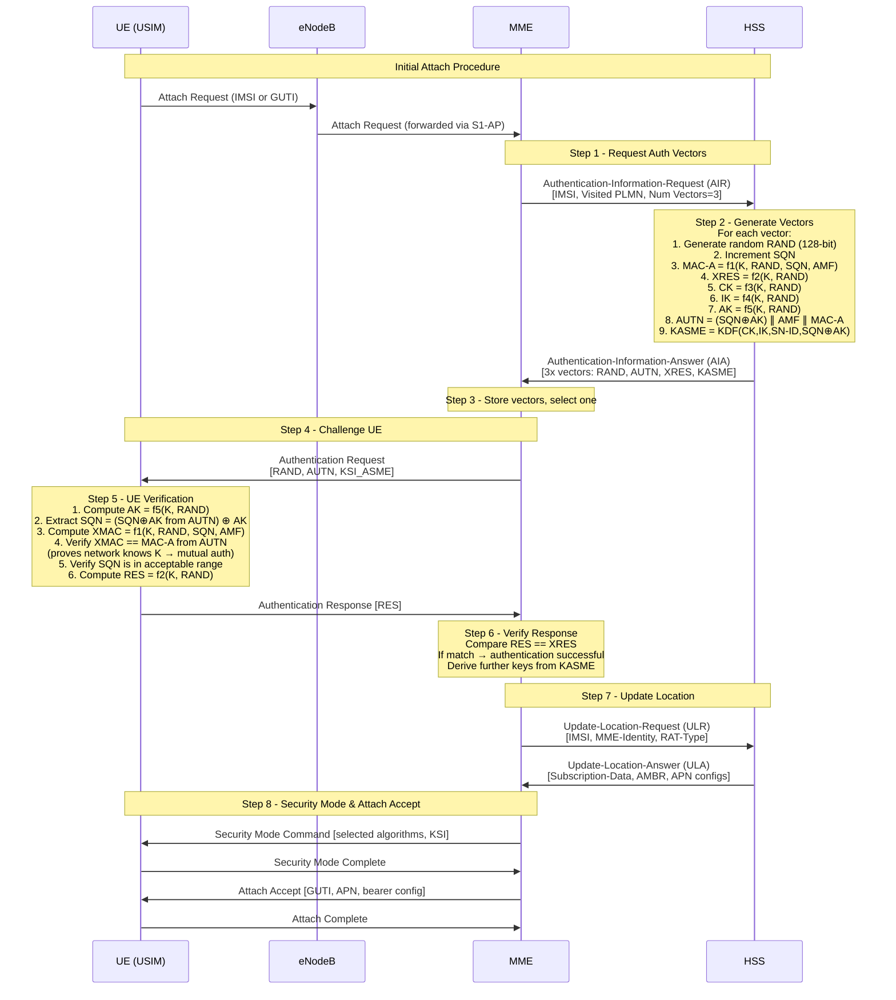

# Module 11: Home Subscriber Server (HSS)

## 1. Why a Centralized Subscriber Database?

In any mobile network, thousands to millions of subscribers connect, move, and consume services simultaneously. A centralized subscriber database is essential for:

| Function | Purpose |
|----------|---------|
| **Authentication** | Verify subscriber identity before granting network access |
| **Authorization** | Determine what services/resources a subscriber is allowed to use |
| **Location Tracking** | Know which network element currently serves each subscriber |
| **Subscription Management** | Store and enforce service plans, QoS profiles, and restrictions |

Without a centralized database:
- Any device could impersonate a subscriber
- The network cannot route incoming calls/data to the correct location
- Service differentiation (premium vs. basic plans) would be impossible
- Roaming between networks would not function

The **HSS (Home Subscriber Server)** is the evolution of the 2G/3G HLR (Home Location Register), redesigned for all-IP LTE/EPC networks using the Diameter protocol instead of SS7/MAP.

---

## 2. HSS Role in LTE/EPC

The HSS is the **master database** for all subscriber and subscription data in the Evolved Packet Core (EPC):

```
┌─────────────────────────────────────────────────────┐
│                        HSS                           │
├─────────────────────────────────────────────────────┤
│  ┌───────────────┐  ┌───────────────────────────┐  │
│  │  Permanent    │  │  Authentication           │  │
│  │  Identity     │  │  Credentials              │  │
│  │  (IMSI)       │  │  (K, OPc, SQN)           │  │
│  └───────────────┘  └───────────────────────────┘  │
│  ┌───────────────┐  ┌───────────────────────────┐  │
│  │  Subscription │  │  Location                 │  │
│  │  Profiles     │  │  Information              │  │
│  │  (APN, QoS)   │  │  (Serving MME)           │  │
│  └───────────────┘  └───────────────────────────┘  │
└─────────────────────────────────────────────────────┘
```

### Key Responsibilities:

1. **Stores Permanent Subscriber Identity (IMSI)**
   - International Mobile Subscriber Identity — globally unique 15-digit identifier
   - Format: MCC (3 digits) + MNC (2-3 digits) + MSIN (9-10 digits)

2. **Stores Authentication Credentials (K, OPc)**
   - **K**: 128-bit permanent secret key (shared only between USIM and HSS)
   - **OPc**: Operator-specific constant derived from OP (operator key) and K
   - Never transmitted over the air — used to generate temporary credentials

3. **Stores Subscription Profiles (APN, QoS, Allowed Services)**
   - Which APNs the subscriber can connect to
   - Maximum bitrates (AMBR) for uplink/downlink
   - Quality of Service class identifiers (QCI)
   - Allowed services and restrictions

4. **Tracks UE Location (Serving MME)**
   - Records which MME currently serves the UE
   - Enables routing of incoming services (MT-SMS, paging)
   - Updated every time UE performs a Tracking Area Update (TAU) or attach

---

## 3. HSS Data Model


### HSS Data Model Diagram

```mermaid
graph TB
    HSS[HSS Database]
    
    HSS --> ID[Identity Data]
    HSS --> AUTH[Authentication Data]
    HSS --> SUB[Subscription Data]
    HSS --> LOC[Location Data]
    HSS --> RESTRICT[Restrictions]
    
    ID --> IMSI[IMSI<br/>234150999999999]
    ID --> MSISDN[MSISDN<br/>+44 7700 900000]
    ID --> IMEI_SV[IMEISV<br/>optional]
    
    AUTH --> K[K - Permanent Key<br/>128-bit secret]
    AUTH --> OPc[OPc - Operator Constant<br/>128-bit derived]
    AUTH --> SQN[SQN - Sequence Number<br/>48-bit counter]
    AUTH --> AMF_val[AMF - Auth Mgmt Field<br/>16-bit]
    
    SUB --> APN_LIST[Allowed APNs<br/>internet, ims, mms]
    SUB --> AMBR[AMBR<br/>UL: 50 Mbps / DL: 150 Mbps]
    SUB --> QCI_SUB[Subscribed QCI<br/>QCI 9 default]
    SUB --> ARP_val[ARP<br/>Priority Level, PCI, PVI]
    
    LOC --> MME_ADDR[Serving MME Address<br/>mme01.epc.operator.com]
    LOC --> SGSN_ADDR[Serving SGSN<br/>for 2G/3G access]
    LOC --> VISITED[Visited PLMN ID]
    
    RESTRICT --> ODB[Operator Determined Barring<br/>outgoing calls, roaming]
    RESTRICT --> ROAM[Roaming Restrictions<br/>allowed/barred PLMNs]
    RESTRICT --> RAT[Access Restriction<br/>E-UTRAN only, etc.]
```



### Detailed Data Fields

| Category | Field | Description | Example |
|----------|-------|-------------|---------|
| **Identity** | IMSI | Unique subscriber ID | 234150999999999 |
| **Identity** | MSISDN | Phone number (E.164) | +447700900000 |
| **Auth** | K | Permanent 128-bit secret key | 0x465B5CE8...(hex) |
| **Auth** | OPc | Operator variant constant | 0xE8ED289D...(hex) |
| **Auth** | SQN | Sequence number (anti-replay) | 000000000021 |
| **Auth** | AMF | Authentication Management Field | 0x8000 |
| **Subscription** | Default APN | Primary data connection | "internet" |
| **Subscription** | APN list | All allowed APNs | internet, ims, mms |
| **Subscription** | UE-AMBR | Max aggregate bitrate | DL:150M, UL:50M |
| **Subscription** | APN-AMBR | Per-APN max bitrate | DL:100M, UL:40M |
| **Subscription** | QCI | QoS Class Identifier | 9 (best effort) |
| **Subscription** | ARP | Allocation/Retention Priority | Level 8, PCI=yes, PVI=no |
| **Location** | MME Identity | Serving MME hostname/address | mme01.epc.mnc015.mcc234 |
| **Location** | MME Realm | Diameter realm of MME | epc.mnc015.mcc234.3gppnetwork.org |
| **Location** | Purged flag | UE detached/unreachable | true/false |
| **Restrictions** | ODB | Operator Determined Barring | Barring of outgoing intl calls |
| **Restrictions** | Roaming | Allowed/barred PLMNs | Home only / EU roaming |
| **Restrictions** | RAT restriction | Allowed access technologies | E-UTRAN, UTRAN |

---

## 4. Authentication Vector Generation

### EPS-AKA (Evolved Packet System - Authentication and Key Agreement)

The HSS generates **Authentication Vectors (AVs)** that enable mutual authentication between UE and network without ever transmitting the permanent key K.

Each Authentication Vector contains:

| Component | Size | Purpose |
|-----------|------|---------|
| **RAND** | 128 bits | Random challenge (generated fresh by HSS) |
| **AUTN** | 128 bits | Authentication Token (proves network identity to UE) |
| **XRES** | 32-128 bits | Expected Response (what UE should reply) |
| **KASME** | 256 bits | Base key for deriving all session keys |

### Milenage Algorithm Set

The **Milenage** algorithm set is the standard cryptographic toolkit (3GPP TS 35.205-208):

```
Inputs: K (128-bit), RAND (128-bit), SQN (48-bit), AMF (16-bit), OPc (128-bit)

┌──────────────────────────────────────────────────┐
│              Milenage Functions                    │
├──────────────────────────────────────────────────┤
│  f1(K, RAND, SQN, AMF)  → MAC-A  (network auth) │
│  f1*(K, RAND, SQN, AMF) → MAC-S  (resync)       │
│  f2(K, RAND)            → RES/XRES (response)    │
│  f3(K, RAND)            → CK  (cipher key)       │
│  f4(K, RAND)            → IK  (integrity key)    │
│  f5(K, RAND)            → AK  (anonymity key)    │
│  f5*(K, RAND)           → AK  (for resync)       │
└──────────────────────────────────────────────────┘
```

**Vector derivation process:**

1. HSS generates random 128-bit **RAND**
2. HSS increments **SQN** (sequence number)
3. Compute: `MAC-A = f1(K, RAND, SQN, AMF)`
4. Compute: `XRES = f2(K, RAND)`
5. Compute: `CK = f3(K, RAND)`
6. Compute: `IK = f4(K, RAND)`
7. Compute: `AK = f5(K, RAND)`
8. Construct: `AUTN = (SQN ⊕ AK) || AMF || MAC-A`
9. Derive: `KASME = KDF(CK, IK, SN-ID, SQN ⊕ AK)`

### SQN Management (Replay Protection)

- **SQN** is a 48-bit counter maintained independently by HSS and USIM
- Prevents replay of old authentication vectors
- UE verifies: received SQN > last accepted SQN (within a window)
- If SQN is out of range → UE sends **AUTS** (resynchronization token)
- HSS uses f1* and f5* to resynchronize its SQN with the USIM

### Vector Delivery to MME

- HSS typically generates **multiple vectors** (batch) per request
- MME stores unused vectors for subsequent re-authentications
- Reduces signaling load (MME doesn't need to contact HSS every time)
- Typical batch size: 3-5 vectors per AIR request

---

## 5. HSS Interaction with MME (S6a / Diameter)

The **S6a interface** uses the **Diameter protocol** (RFC 6733) with the 3GPP Diameter application for EPS (application ID: 16777251).

### Message Flows

| Procedure | Request → Answer | Direction | Purpose |
|-----------|-----------------|-----------|---------|
| Authentication | AIR → AIA | MME → HSS | Get auth vectors |
| Location Update | ULR → ULA | MME → HSS | Register MME, get subscription |
| Purge | PUR → PUA | MME → HSS | UE explicitly detached |
| Cancel Location | CLR → CLA | HSS → MME | Force detach (e.g., UE moved) |
| Insert Sub Data | IDR → IDA | HSS → MME | Push subscription changes |
| Delete Sub Data | DSR → DSA | HSS → MME | Remove subscription data |
| Notification | NOR → NOA | MME → HSS | Notify terminal info |

### Attach Procedure (AIR/AIA + ULR/ULA)

```
MME                                    HSS
 │                                      │
 │──── AIR (IMSI, visited PLMN) ──────→│
 │                                      │ Generate auth vectors
 │←─── AIA (RAND, AUTN, XRES, KASME) ─│
 │                                      │
 │──── ULR (IMSI, MME identity) ──────→│
 │                                      │ Store new MME location
 │                                      │ Cancel old MME (if any)
 │←─── ULA (subscription profile) ─────│
 │                                      │
```

**AIR (Authentication-Information-Request):**
- IMSI of the subscriber
- Visited PLMN ID
- Number of requested vectors
- Resynchronization info (AUTS, if SQN mismatch)

**AIA (Authentication-Information-Answer):**
- One or more EPS Authentication Vectors (RAND, AUTN, XRES, KASME)
- Result code (success/failure)

**ULR (Update-Location-Request):**
- IMSI
- MME identity (hostname + realm)
- RAT type
- ULR flags (initial attach, etc.)

**ULA (Update-Location-Answer):**
- Subscription data (all APNs, AMBR, QoS profiles)
- Result code
- Separation of default APN from additional APNs

### Detach / Purge (PUR/PUA or CLR/CLA)

**Explicit detach (UE-initiated):**
- MME sends **PUR** → HSS marks subscriber as "not attached"
- HSS responds with **PUA**

**Network-initiated cancel (HSS pushes):**
- HSS sends **CLR** to old MME (e.g., UE registered at new MME)
- Old MME removes UE context, responds with **CLA**
- CLR reasons: UE moved, subscription withdrawn, operator policy

### Subscription Modification (IDR/IDA)

When operator modifies a subscription (e.g., customer upgrades plan):
- HSS sends **IDR** (Insert-Subscriber-Data-Request) to serving MME
- MME updates local copy of subscription data
- MME responds with **IDA**
- Changes take effect immediately (no re-attach needed)

---

## 6. HSS Interaction with Other Network Elements

```
┌─────────┐         S6a          ┌─────────┐
│   MME   │◄───────────────────►│         │
└─────────┘    (Diameter)        │         │
                                 │         │
┌─────────┐         S6d          │         │
│  SGSN   │◄───────────────────►│   HSS   │
└─────────┘    (Diameter)        │         │
                                 │         │
┌─────────┐        Cx/Dx         │         │
│I/S-CSCF │◄───────────────────►│         │
└─────────┘    (Diameter)        │         │
                                 │         │
┌─────────┐         Sh           │         │
│   AS    │◄───────────────────►│         │
└─────────┘    (Diameter)        └─────────┘
```

### Interface Details

| Interface | Peer Entity | Protocol | Purpose |
|-----------|-------------|----------|---------|
| **S6a** | MME | Diameter | EPS authentication, location, subscription |
| **S6d** | SGSN | Diameter | 2G/3G interworking (same functions as S6a for GERAN/UTRAN) |
| **Cx** | I-CSCF / S-CSCF | Diameter | IMS registration, user authorization |
| **Dx** | I-CSCF | Diameter | IMS location query (find S-CSCF for user) |
| **Sh** | Application Server | Diameter | Read/write user data for services |
| **S13** | EIR | Diameter | Equipment identity check (IMEI verification) |

### S6d (SGSN — 2G/3G interworking)

- Same message set as S6a but adapted for GERAN/UTRAN access
- Used when UE is connected via 2G/3G radio
- Enables seamless handover between 4G and 2G/3G (IRAT)

### Cx/Dx (IMS — VoLTE)

- **Cx**: Registration/de-registration of IMS users
  - UAR/UAA: User-Authorization (during REGISTER)
  - SAR/SAA: Server-Assignment (assign S-CSCF)
  - MAR/MAA: Multimedia-Auth (get IMS auth vectors)
  - LIR/LIA: Location-Info (find assigned S-CSCF)
- Used for VoLTE call setup and IMS registration

### Sh (Application Servers)

- Allows AS to read/update user-specific data
- Used for supplementary services, presence, messaging
- Supports subscriptions for notifications on data changes

---

## 7. Authentication Scenario (Step-by-Step)


### Full EPS-AKA Authentication Flow



### Step-by-Step Explanation

| Step | Action | Details |
|------|--------|---------|
| 1 | UE sends Attach Request | Contains IMSI (first time) or old GUTI (subsequent) |
| 2 | MME requests vectors | AIR sent to HSS with subscriber IMSI |
| 3 | HSS generates vectors | Uses K + OPc + RAND + SQN through Milenage |
| 4 | HSS returns vectors | AIA contains RAND, AUTN, XRES, KASME (batch of 3-5) |
| 5 | MME challenges UE | Sends RAND + AUTN to UE in NAS Authentication Request |
| 6 | UE verifies network | Checks MAC in AUTN using its own K → **mutual authentication** |
| 7 | UE computes RES | Sends response back to MME |
| 8 | MME verifies UE | Compares RES against XRES from HSS |
| 9 | Location update | MME registers itself at HSS as serving MME |
| 10 | Session setup | Keys derived, bearers established |

### Authentication Failure Scenarios

| Scenario | Cause | Recovery |
|----------|-------|----------|
| MAC failure at UE | Network doesn't know correct K | UE sends Auth Failure (cause: MAC failure) |
| SQN out of range | SQN desynchronized | UE sends Auth Failure + AUTS for resync |
| XRES mismatch at MME | UE doesn't know correct K | MME rejects attach, may send Auth Reject |
| Timeout | Network/UE unreachable | Retry with backoff |

---

## 8. Evolution to 5G: HSS Decomposition

### Architecture Comparison

In 5G (3GPP Release 15+), the monolithic HSS is decomposed into specialized Network Functions:

```
┌─────────────────────────────────────────────────────────────┐
│                    4G (LTE/EPC)                               │
│                                                              │
│    ┌──────────────────────────────────────────────┐         │
│    │                   HSS                         │         │
│    │  ┌──────────┐ ┌──────────┐ ┌──────────────┐ │         │
│    │  │ Auth     │ │ User Data│ │ Subscription │ │         │
│    │  │ Function │ │ Storage  │ │ Management   │ │         │
│    │  └──────────┘ └──────────┘ └──────────────┘ │         │
│    └──────────────────────────────────────────────┘         │
└─────────────────────────────────────────────────────────────┘

                         ↓ Decomposed into ↓

┌─────────────────────────────────────────────────────────────┐
│                    5G (5GC/SBA)                               │
│                                                              │
│  ┌────────┐      ┌────────┐      ┌────────┐                │
│  │  AUSF  │      │  UDM   │      │  UDR   │                │
│  │        │      │        │      │        │                │
│  │ Auth   │◄────►│ User   │◄────►│ Unified│                │
│  │ Server │      │ Data   │      │ Data   │                │
│  │ Func.  │      │ Mgmt   │      │ Repo   │                │
│  └────────┘      └────────┘      └────────┘                │
└─────────────────────────────────────────────────────────────┘
```

### Detailed Comparison: HSS (4G) vs UDM + AUSF + UDR (5G)

| Aspect | HSS (4G) | UDM + AUSF + UDR (5G) |
|--------|----------|------------------------|
| **Architecture** | Monolithic | Decomposed, microservices |
| **Protocol** | Diameter (S6a) | HTTP/2 + JSON (SBI) |
| **Auth Function** | Built into HSS | Separate AUSF (Authentication Server Function) |
| **Data Management** | Built into HSS | Separate UDM (Unified Data Management) |
| **Data Storage** | Internal DB | Separate UDR (Unified Data Repository) |
| **Identity** | IMSI (sent in clear) | SUPI/SUCI (SUCI = encrypted SUPI) |
| **Privacy** | IMSI exposed on air | SUCI conceals identity (ECIES encryption) |
| **Auth Protocol** | EPS-AKA only | 5G-AKA or EAP-AKA' (extensible) |
| **Key Hierarchy** | KASME → KeNB → ... | KAUSF → KSEAF → KAMF → KgNB → ... |
| **Scalability** | Scale entire HSS | Scale each NF independently |
| **Interfaces** | Point-to-point Diameter | Service-Based Interface (REST APIs) |
| **Discovery** | Static config / DNS | NRF (Network Repository Function) |
| **Redundancy** | Active/Standby | Cloud-native, stateless NFs + shared UDR |

### 5G Identity: SUPI and SUCI

```
SUPI (Subscription Permanent Identifier)
  = IMSI (same format as 4G: MCC+MNC+MSIN)
  (never sent over the air in 5G!)

SUCI (Subscription Concealed Identifier)
  = Home Network ID + Routing Indicator + Protection Scheme + Encrypted MSIN
  
  Encryption: ECIES (Elliptic Curve Integrated Encryption Scheme)
  - Home network publishes public key
  - UE encrypts MSIN portion with home network public key
  - Only home network (UDM) can decrypt → reveals SUPI
```

### 5G Authentication Methods

**5G-AKA:**
- Enhanced version of EPS-AKA
- Adds home network confirmation (HRES*/HXRES*)
- Serving network proves to home network that auth completed
- Prevents certain MITM attacks possible in 4G

**EAP-AKA':**
- Extensible Authentication Protocol variant
- Binds authentication to serving network name
- Better suited for non-3GPP access (Wi-Fi, fixed)
- Uses AT_KDF_INPUT for network binding

### 5G Decomposed Functions

| 5G NF | Role | 4G Equivalent |
|--------|------|---------------|
| **AUSF** | Handles authentication procedures, generates keys | HSS auth function |
| **UDM** | Manages subscription data, generates auth vectors, handles registration | HSS data management |
| **UDR** | Stores all data (subscriber, policy, application) | HSS internal database |
| **SIDF** | Decrypts SUCI → SUPI (part of UDM) | N/A (no equivalent in 4G) |

---

## Summary

The HSS is the security and identity anchor of the LTE/EPC network. It:

1. **Guards the keys** — K never leaves the HSS (and USIM)
2. **Proves identity** — Mutual authentication via EPS-AKA
3. **Controls access** — Subscription profiles determine what users can do
4. **Tracks location** — Knows which MME serves each subscriber
5. **Evolves gracefully** — Decomposed into UDM/AUSF/UDR in 5G for cloud-native deployment

Understanding the HSS is critical for:
- Network security analysis
- Debugging authentication failures
- Planning subscriber provisioning
- Understanding the transition from 4G to 5G core

---

## References

- 3GPP TS 29.272: S6a/S6d Diameter-based interface (MME/SGSN–HSS)
- 3GPP TS 33.401: EPS security architecture
- 3GPP TS 35.205-208: Milenage algorithm specification
- 3GPP TS 23.501: 5G System Architecture
- 3GPP TS 33.501: 5G Security Architecture and Procedures
- 3GPP TS 29.509: AUSF Services (5G)
- 3GPP TS 29.503: UDM Services (5G)
