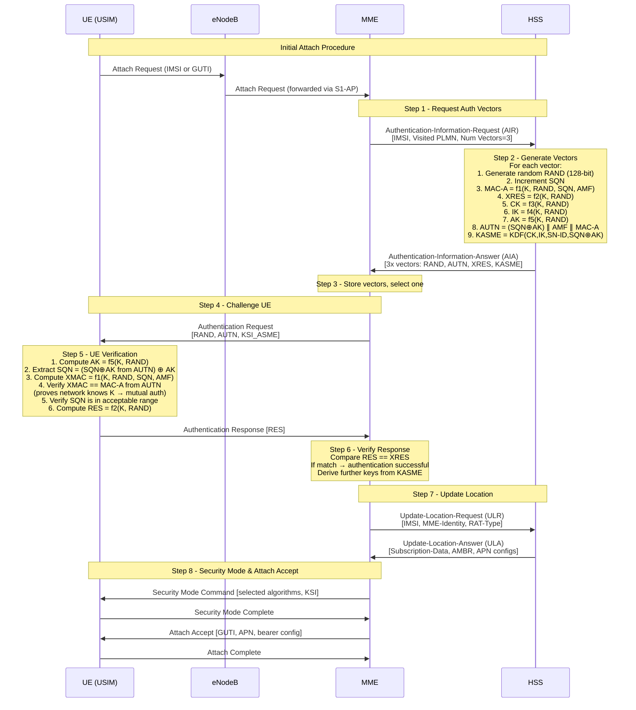

# ماژول 11: سرور مشترک خانگی (HSS)

## 1. چرا یک پایگاه داده مرکزی مشترکین؟

در هر شبکه موبایل، هزاران تا میلیون‌ها مشترک به‌طور همزمان متصل می‌شوند، جابه‌جا می‌شوند و خدمات مصرف می‌کنند. یک پایگاه داده مرکزی مشترکین برای موارد زیر ضروری است:

| عملکرد | هدف |
|----------|---------|
| **احراز هویت** | تأیید هویت مشترک پیش از اعطای دسترسی به شبکه |
| **مجوزدهی** | تعیین اینکه مشترک مجاز به استفاده از کدام خدمات/منابع است |
| **ردیابی مکان** | دانستن اینکه در حال حاضر کدام عنصر شبکه به هر مشترک خدمات می‌دهد |
| **مدیریت اشتراک** | ذخیره و اجرای طرح‌های خدمات، پروفایل‌های QoS و محدودیت‌ها |

بدون یک پایگاه داده مرکزی:
- هر دستگاهی می‌توانست خود را جای مشترک جا بزند
- شبکه نمی‌تواند تماس/داده ورودی را به مکان صحیح مسیریابی کند
- تمایز خدمات (طرح‌های ممتاز در برابر پایه) غیرممکن می‌شد
- رومینگ بین شبکه‌ها کار نمی‌کرد

**HSS (سرور مشترک خانگی)** تحول HLR (ثبت‌کننده مکان خانگی) نسل 2G/3G است که برای شبکه‌های تمام-IP LTE/EPC با استفاده از پروتکل Diameter به‌جای SS7/MAP بازطراحی شده است.

---

## 2. نقش HSS در LTE/EPC

HSS **پایگاه داده اصلی** برای تمام داده‌های مشترک و اشتراک در هسته بسته تکامل‌یافته (EPC) است:

```
┌─────────────────────────────────────────────────────┐
│                        HSS                           │
├─────────────────────────────────────────────────────┤
│  ┌───────────────┐  ┌───────────────────────────┐  │
│  │  Permanent    │  │  Authentication           │  │
│  │  Identity     │  │  Credentials              │  │
│  │  (IMSI)       │  │  (K, OPc, SQN)           │  │
│  └───────────────┘  └───────────────────────────┘  │
│  ┌───────────────┐  ┌───────────────────────────┐  │
│  │  Subscription │  │  Location                 │  │
│  │  Profiles     │  │  Information              │  │
│  │  (APN, QoS)   │  │  (Serving MME)           │  │
│  └───────────────┘  └───────────────────────────┘  │
└─────────────────────────────────────────────────────┘
```

### مسئولیت‌های کلیدی:

1. **ذخیره هویت دائمی مشترک (IMSI)**
   - هویت بین‌المللی مشترک موبایل — شناسه 15 رقمی یکتا در سطح جهانی
   - قالب: MCC (3 رقم) + MNC (2-3 رقم) + MSIN (9-10 رقم)

2. **ذخیره اعتبارنامه‌های احراز هویت (K, OPc)**
   - **K**: کلید مخفی دائمی 128 بیتی (فقط بین USIM و HSS مشترک)
   - **OPc**: ثابت مختص اپراتور مشتق‌شده از OP (کلید اپراتور) و K
   - هرگز روی هوا منتقل نمی‌شود — برای تولید اعتبارنامه‌های موقت استفاده می‌شود

3. **ذخیره پروفایل‌های اشتراک (APN، QoS، خدمات مجاز)**
   - مشترک می‌تواند به کدام APNها متصل شود
   - حداکثر نرخ بیت (AMBR) برای پیوند بالاسو/پایین‌سو
   - شناسه‌های کلاس کیفیت خدمات (QCI)
   - خدمات مجاز و محدودیت‌ها

4. **ردیابی مکان UE (MME خدمات‌دهنده)**
   - ثبت می‌کند که در حال حاضر کدام MME به UE خدمات می‌دهد
   - مسیریابی خدمات ورودی (MT-SMS، صفحه‌بندی) را ممکن می‌سازد
   - هر بار که UE به‌روزرسانی ناحیه ردیابی (TAU) یا اتصال انجام می‌دهد به‌روزرسانی می‌شود

---

## 3. مدل داده HSS


### نمودار مدل داده HSS

```mermaid
graph TB
    HSS[HSS Database]
    
    HSS --> ID[Identity Data]
    HSS --> AUTH[Authentication Data]
    HSS --> SUB[Subscription Data]
    HSS --> LOC[Location Data]
    HSS --> RESTRICT[Restrictions]
    
    ID --> IMSI[IMSI<br/>234150999999999]
    ID --> MSISDN[MSISDN<br/>+44 7700 900000]
    ID --> IMEI_SV[IMEISV<br/>optional]
    
    AUTH --> K[K - Permanent Key<br/>128-bit secret]
    AUTH --> OPc[OPc - Operator Constant<br/>128-bit derived]
    AUTH --> SQN[SQN - Sequence Number<br/>48-bit counter]
    AUTH --> AMF_val[AMF - Auth Mgmt Field<br/>16-bit]
    
    SUB --> APN_LIST[Allowed APNs<br/>internet, ims, mms]
    SUB --> AMBR[AMBR<br/>UL: 50 Mbps / DL: 150 Mbps]
    SUB --> QCI_SUB[Subscribed QCI<br/>QCI 9 default]
    SUB --> ARP_val[ARP<br/>Priority Level, PCI, PVI]
    
    LOC --> MME_ADDR[Serving MME Address<br/>mme01.epc.operator.com]
    LOC --> SGSN_ADDR[Serving SGSN<br/>for 2G/3G access]
    LOC --> VISITED[Visited PLMN ID]
    
    RESTRICT --> ODB[Operator Determined Barring<br/>outgoing calls, roaming]
    RESTRICT --> ROAM[Roaming Restrictions<br/>allowed/barred PLMNs]
    RESTRICT --> RAT[Access Restriction<br/>E-UTRAN only, etc.]
```



### فیلدهای داده تفصیلی

| دسته | فیلد | توضیح | مثال |
|----------|-------|-------------|---------|
| **هویت** | IMSI | شناسه یکتای مشترک | 234150999999999 |
| **هویت** | MSISDN | شماره تلفن (E.164) | +447700900000 |
| **احراز هویت** | K | کلید مخفی دائمی 128 بیتی | 0x465B5CE8...(hex) |
| **احراز هویت** | OPc | ثابت واریانت اپراتور | 0xE8ED289D...(hex) |
| **احراز هویت** | SQN | شماره ترتیب (ضد-بازپخش) | 000000000021 |
| **احراز هویت** | AMF | فیلد مدیریت احراز هویت | 0x8000 |
| **اشتراک** | APN پیش‌فرض | اتصال داده اصلی | "internet" |
| **اشتراک** | فهرست APN | تمام APNهای مجاز | internet، ims، mms |
| **اشتراک** | UE-AMBR | حداکثر نرخ بیت تجمیعی | DL:150M، UL:50M |
| **اشتراک** | APN-AMBR | حداکثر نرخ بیت در هر APN | DL:100M، UL:40M |
| **اشتراک** | QCI | شناسه کلاس QoS | 9 (بهترین تلاش) |
| **اشتراک** | ARP | اولویت تخصیص/نگهداری | سطح 8، PCI=بله، PVI=خیر |
| **مکان** | هویت MME | نام میزبان/آدرس MME خدمات‌دهنده | mme01.epc.mnc015.mcc234 |
| **مکان** | Realm MME | realm Diameter مربوط به MME | epc.mnc015.mcc234.3gppnetwork.org |
| **مکان** | پرچم پاک‌سازی | UE جدا شده/غیرقابل دسترس | true/false |
| **محدودیت‌ها** | ODB | ممنوعیت تعیین‌شده توسط اپراتور | ممنوعیت تماس‌های بین‌المللی خروجی |
| **محدودیت‌ها** | رومینگ | PLMNهای مجاز/ممنوع | فقط خانگی / رومینگ اتحادیه اروپا |
| **محدودیت‌ها** | محدودیت RAT | فناوری‌های دسترسی مجاز | E-UTRAN، UTRAN |

---

## 4. تولید بردار احراز هویت

### EPS-AKA (سیستم بسته تکامل‌یافته - احراز هویت و توافق کلید)

HSS **بردارهای احراز هویت (AV)** را تولید می‌کند که احراز هویت متقابل بین UE و شبکه را بدون ارسال کلید دائمی K ممکن می‌سازد.

هر بردار احراز هویت شامل موارد زیر است:

| مؤلفه | اندازه | هدف |
|-----------|------|---------|
| **RAND** | 128 بیت | چالش تصادفی (تولیدشده تازه توسط HSS) |
| **AUTN** | 128 بیت | نشانه احراز هویت (هویت شبکه را به UE اثبات می‌کند) |
| **XRES** | 32-128 بیت | پاسخ مورد انتظار (آنچه UE باید پاسخ دهد) |
| **KASME** | 256 بیت | کلید پایه برای مشتق‌سازی تمام کلیدهای نشست |

### مجموعه الگوریتم Milenage

مجموعه الگوریتم **Milenage** جعبه‌ابزار رمزنگاری استاندارد است (3GPP TS 35.205-208):

```
Inputs: K (128-bit), RAND (128-bit), SQN (48-bit), AMF (16-bit), OPc (128-bit)

┌──────────────────────────────────────────────────┐
│              Milenage Functions                    │
├──────────────────────────────────────────────────┤
│  f1(K, RAND, SQN, AMF)  → MAC-A  (network auth) │
│  f1*(K, RAND, SQN, AMF) → MAC-S  (resync)       │
│  f2(K, RAND)            → RES/XRES (response)    │
│  f3(K, RAND)            → CK  (cipher key)       │
│  f4(K, RAND)            → IK  (integrity key)    │
│  f5(K, RAND)            → AK  (anonymity key)    │
│  f5*(K, RAND)           → AK  (for resync)       │
└──────────────────────────────────────────────────┘
```

**فرآیند مشتق‌سازی بردار:**

1. HSS یک **RAND** تصادفی 128 بیتی تولید می‌کند
2. HSS مقدار **SQN** (شماره ترتیب) را افزایش می‌دهد
3. محاسبه: `MAC-A = f1(K, RAND, SQN, AMF)`
4. محاسبه: `XRES = f2(K, RAND)`
5. محاسبه: `CK = f3(K, RAND)`
6. محاسبه: `IK = f4(K, RAND)`
7. محاسبه: `AK = f5(K, RAND)`
8. ساخت: `AUTN = (SQN ⊕ AK) || AMF || MAC-A`
9. مشتق‌سازی: `KASME = KDF(CK, IK, SN-ID, SQN ⊕ AK)`

### مدیریت SQN (محافظت از بازپخش)

- **SQN** یک شمارنده 48 بیتی است که به‌طور مستقل توسط HSS و USIM نگهداری می‌شود
- از بازپخش بردارهای احراز هویت قدیمی جلوگیری می‌کند
- UE تأیید می‌کند: SQN دریافتی > آخرین SQN پذیرفته‌شده (در یک پنجره)
- اگر SQN خارج از محدوده باشد ← UE یک **AUTS** (نشانه همگام‌سازی مجدد) می‌فرستد
- HSS از f1* و f5* برای همگام‌سازی مجدد SQN خود با USIM استفاده می‌کند

### تحویل بردار به MME

- HSS معمولاً **چندین بردار** (دسته) در هر درخواست تولید می‌کند
- MME بردارهای استفاده‌نشده را برای احراز هویت‌های مجدد بعدی ذخیره می‌کند
- بار سیگنالینگ را کاهش می‌دهد (MME نیازی به تماس با HSS در هر بار ندارد)
- اندازه دسته معمول: 3-5 بردار در هر درخواست AIR

---

## 5. تعامل HSS با MME (S6a / Diameter)

واسط **S6a** از **پروتکل Diameter** (RFC 6733) با کاربرد Diameter گروه 3GPP برای EPS استفاده می‌کند (شناسه کاربرد: 16777251).

### جریان‌های پیام

| رویه | درخواست ← پاسخ | جهت | هدف |
|-----------|-----------------|-----------|---------|
| احراز هویت | AIR ← AIA | MME ← HSS | دریافت بردارهای احراز هویت |
| به‌روزرسانی مکان | ULR ← ULA | MME ← HSS | ثبت MME، دریافت اشتراک |
| پاک‌سازی | PUR ← PUA | MME ← HSS | UE به‌صراحت جدا شده است |
| لغو مکان | CLR ← CLA | HSS ← MME | جداسازی اجباری (مثلاً UE جابه‌جا شده) |
| درج داده اشتراک | IDR ← IDA | HSS ← MME | ارسال تغییرات اشتراک |
| حذف داده اشتراک | DSR ← DSA | HSS ← MME | حذف داده اشتراک |
| اعلان | NOR ← NOA | MME ← HSS | اطلاع‌دادن اطلاعات پایانه |

### رویه اتصال (AIR/AIA + ULR/ULA)

```
MME                                    HSS
 │                                      │
 │──── AIR (IMSI, visited PLMN) ──────→│
 │                                      │ Generate auth vectors
 │←─── AIA (RAND, AUTN, XRES, KASME) ─│
 │                                      │
 │──── ULR (IMSI, MME identity) ──────→│
 │                                      │ Store new MME location
 │                                      │ Cancel old MME (if any)
 │←─── ULA (subscription profile) ─────│
 │                                      │
```

**AIR (Authentication-Information-Request):**
- IMSI مشترک
- شناسه PLMN بازدیدشده
- تعداد بردارهای درخواستی
- اطلاعات همگام‌سازی مجدد (AUTS، در صورت عدم تطابق SQN)

**AIA (Authentication-Information-Answer):**
- یک یا چند بردار احراز هویت EPS (RAND، AUTN، XRES، KASME)
- کد نتیجه (موفقیت/شکست)

**ULR (Update-Location-Request):**
- IMSI
- هویت MME (نام میزبان + realm)
- نوع RAT
- پرچم‌های ULR (اتصال اولیه و غیره)

**ULA (Update-Location-Answer):**
- داده اشتراک (تمام APNها، AMBR، پروفایل‌های QoS)
- کد نتیجه
- جداسازی APN پیش‌فرض از APNهای اضافی

### جداسازی / پاک‌سازی (PUR/PUA یا CLR/CLA)

**جداسازی صریح (با شروع UE):**
- MME یک **PUR** می‌فرستد ← HSS مشترک را «متصل‌نشده» علامت‌گذاری می‌کند
- HSS با **PUA** پاسخ می‌دهد

**لغو با شروع شبکه (HSS ارسال می‌کند):**
- HSS یک **CLR** به MME قدیمی می‌فرستد (مثلاً UE در MME جدید ثبت‌نام کرده است)
- MME قدیمی زمینه UE را حذف می‌کند، با **CLA** پاسخ می‌دهد
- دلایل CLR: UE جابه‌جا شده، اشتراک لغو شده، سیاست اپراتور

### اصلاح اشتراک (IDR/IDA)

وقتی اپراتور یک اشتراک را اصلاح می‌کند (مثلاً مشتری طرح خود را ارتقا می‌دهد):
- HSS یک **IDR** (Insert-Subscriber-Data-Request) به MME خدمات‌دهنده می‌فرستد
- MME نسخه محلی داده اشتراک را به‌روزرسانی می‌کند
- MME با **IDA** پاسخ می‌دهد
- تغییرات بلافاصله اعمال می‌شوند (نیازی به اتصال مجدد نیست)

---

## 6. تعامل HSS با سایر عناصر شبکه

```
┌─────────┐         S6a          ┌─────────┐
│   MME   │◄───────────────────►│         │
└─────────┘    (Diameter)        │         │
                                 │         │
┌─────────┐         S6d          │         │
│  SGSN   │◄───────────────────►│   HSS   │
└─────────┘    (Diameter)        │         │
                                 │         │
┌─────────┐        Cx/Dx         │         │
│I/S-CSCF │◄───────────────────►│         │
└─────────┘    (Diameter)        │         │
                                 │         │
┌─────────┐         Sh           │         │
│   AS    │◄───────────────────►│         │
└─────────┘    (Diameter)        └─────────┘
```

### جزئیات واسط‌ها

| واسط | موجودیت همتا | پروتکل | هدف |
|-----------|-------------|----------|---------|
| **S6a** | MME | Diameter | احراز هویت EPS، مکان، اشتراک |
| **S6d** | SGSN | Diameter | هم‌کنش‌گری 2G/3G (همان توابع S6a برای GERAN/UTRAN) |
| **Cx** | I-CSCF / S-CSCF | Diameter | ثبت‌نام IMS، مجوزدهی کاربر |
| **Dx** | I-CSCF | Diameter | پرس‌وجوی مکان IMS (یافتن S-CSCF برای کاربر) |
| **Sh** | سرور کاربردی | Diameter | خواندن/نوشتن داده کاربر برای خدمات |
| **S13** | EIR | Diameter | بررسی هویت تجهیزات (تأیید IMEI) |

### S6d (SGSN — هم‌کنش‌گری 2G/3G)

- همان مجموعه پیام S6a اما تطبیق‌یافته برای دسترسی GERAN/UTRAN
- زمانی استفاده می‌شود که UE از طریق رادیو 2G/3G متصل است
- تحویل بی‌وقفه بین 4G و 2G/3G را ممکن می‌سازد (IRAT)

### Cx/Dx (IMS — VoLTE)

- **Cx**: ثبت‌نام/لغو ثبت‌نام کاربران IMS
  - UAR/UAA: مجوزدهی کاربر (در حین REGISTER)
  - SAR/SAA: تخصیص سرور (تخصیص S-CSCF)
  - MAR/MAA: احراز هویت چندرسانه‌ای (دریافت بردارهای احراز هویت IMS)
  - LIR/LIA: اطلاعات مکان (یافتن S-CSCF تخصیص‌یافته)
- برای برقراری تماس VoLTE و ثبت‌نام IMS استفاده می‌شود

### Sh (سرورهای کاربردی)

- به AS امکان می‌دهد داده‌های مختص کاربر را بخواند/به‌روزرسانی کند
- برای خدمات تکمیلی، حضور، پیام‌رسانی استفاده می‌شود
- از اشتراک‌ها برای اعلان‌ها در تغییرات داده پشتیبانی می‌کند

---

## 7. سناریوی احراز هویت (گام-به-گام)


### جریان کامل احراز هویت EPS-AKA



### توضیح گام-به-گام

| گام | اقدام | جزئیات |
|------|--------|---------|
| 1 | UE درخواست اتصال می‌فرستد | شامل IMSI (بار اول) یا GUTI قدیمی (بارهای بعدی) |
| 2 | MME بردار درخواست می‌کند | AIR با IMSI مشترک به HSS فرستاده می‌شود |
| 3 | HSS بردار تولید می‌کند | از K + OPc + RAND + SQN از طریق Milenage استفاده می‌کند |
| 4 | HSS بردارها را بازمی‌گرداند | AIA شامل RAND، AUTN، XRES، KASME (دسته 3-5) |
| 5 | MME به UE چالش می‌دهد | RAND + AUTN را در NAS Authentication Request به UE می‌فرستد |
| 6 | UE شبکه را تأیید می‌کند | MAC در AUTN را با K خود بررسی می‌کند ← **احراز هویت متقابل** |
| 7 | UE مقدار RES را محاسبه می‌کند | پاسخ را به MME بازمی‌گرداند |
| 8 | MME UE را تأیید می‌کند | RES را با XRES از HSS مقایسه می‌کند |
| 9 | به‌روزرسانی مکان | MME خود را به‌عنوان MME خدمات‌دهنده در HSS ثبت می‌کند |
| 10 | برقراری نشست | کلیدها مشتق می‌شوند، حامل‌ها برقرار می‌شوند |

### سناریوهای شکست احراز هویت

| سناریو | علت | بازیابی |
|----------|-------|----------|
| شکست MAC در UE | شبکه K صحیح را نمی‌داند | UE یک Auth Failure می‌فرستد (علت: شکست MAC) |
| SQN خارج از محدوده | SQN از همگام‌سازی خارج شده | UE یک Auth Failure + AUTS برای همگام‌سازی مجدد می‌فرستد |
| عدم تطابق XRES در MME | UE K صحیح را نمی‌داند | MME اتصال را رد می‌کند، ممکن است Auth Reject بفرستد |
| اتمام زمان | شبکه/UE غیرقابل دسترس | تلاش مجدد با عقب‌نشینی |

---

## 8. تحول به 5G: تجزیه HSS

### مقایسه معماری

در 5G (نسخه 15+ گروه 3GPP)، HSS یکپارچه به توابع شبکه تخصصی تجزیه می‌شود:

```
┌─────────────────────────────────────────────────────────────┐
│                    4G (LTE/EPC)                               │
│                                                              │
│    ┌──────────────────────────────────────────────┐         │
│    │                   HSS                         │         │
│    │  ┌──────────┐ ┌──────────┐ ┌──────────────┐ │         │
│    │  │ Auth     │ │ User Data│ │ Subscription │ │         │
│    │  │ Function │ │ Storage  │ │ Management   │ │         │
│    │  └──────────┘ └──────────┘ └──────────────┘ │         │
│    └──────────────────────────────────────────────┘         │
└─────────────────────────────────────────────────────────────┘

                         ↓ Decomposed into ↓

┌─────────────────────────────────────────────────────────────┐
│                    5G (5GC/SBA)                               │
│                                                              │
│  ┌────────┐      ┌────────┐      ┌────────┐                │
│  │  AUSF  │      │  UDM   │      │  UDR   │                │
│  │        │      │        │      │        │                │
│  │ Auth   │◄────►│ User   │◄────►│ Unified│                │
│  │ Server │      │ Data   │      │ Data   │                │
│  │ Func.  │      │ Mgmt   │      │ Repo   │                │
│  └────────┘      └────────┘      └────────┘                │
└─────────────────────────────────────────────────────────────┘
```

### مقایسه تفصیلی: HSS (4G) در برابر UDM + AUSF + UDR (5G)

| جنبه | HSS (4G) | UDM + AUSF + UDR (5G) |
|--------|----------|------------------------|
| **معماری** | یکپارچه | تجزیه‌شده، میکروسرویس‌ها |
| **پروتکل** | Diameter (S6a) | HTTP/2 + JSON (SBI) |
| **عملکرد احراز هویت** | تعبیه‌شده در HSS | AUSF جداگانه (تابع سرور احراز هویت) |
| **مدیریت داده** | تعبیه‌شده در HSS | UDM جداگانه (مدیریت داده یکپارچه) |
| **ذخیره داده** | پایگاه داده داخلی | UDR جداگانه (مخزن داده یکپارچه) |
| **هویت** | IMSI (به‌صورت شفاف ارسال می‌شود) | SUPI/SUCI (SUCI = SUPI رمزنگاری‌شده) |
| **حریم خصوصی** | IMSI روی هوا افشا می‌شود | SUCI هویت را پنهان می‌کند (رمزنگاری ECIES) |
| **پروتکل احراز هویت** | فقط EPS-AKA | 5G-AKA یا EAP-AKA' (قابل توسعه) |
| **سلسله‌مراتب کلید** | KASME ← KeNB ← ... | KAUSF ← KSEAF ← KAMF ← KgNB ← ... |
| **مقیاس‌پذیری** | مقیاس‌دهی کل HSS | مقیاس‌دهی مستقل هر NF |
| **واسط‌ها** | Diameter نقطه-به-نقطه | واسط خدمات‌محور (APIهای REST) |
| **کشف** | پیکربندی ایستا / DNS | NRF (تابع مخزن شبکه) |
| **افزونگی** | فعال/آماده | بومی-ابر، NFهای بدون حالت + UDR مشترک |

### هویت 5G: SUPI و SUCI

```
SUPI (Subscription Permanent Identifier)
  = IMSI (same format as 4G: MCC+MNC+MSIN)
  (never sent over the air in 5G!)

SUCI (Subscription Concealed Identifier)
  = Home Network ID + Routing Indicator + Protection Scheme + Encrypted MSIN
  
  Encryption: ECIES (Elliptic Curve Integrated Encryption Scheme)
  - Home network publishes public key
  - UE encrypts MSIN portion with home network public key
  - Only home network (UDM) can decrypt → reveals SUPI
```

### روش‌های احراز هویت 5G

**5G-AKA:**
- نسخه بهبودیافته EPS-AKA
- تأیید شبکه خانگی را اضافه می‌کند (HRES*/HXRES*)
- شبکه خدمات‌دهنده به شبکه خانگی اثبات می‌کند که احراز هویت کامل شده است
- از حملات MITM خاصی که در 4G ممکن بود جلوگیری می‌کند

**EAP-AKA':**
- واریانت پروتکل احراز هویت قابل توسعه
- احراز هویت را به نام شبکه خدمات‌دهنده متصل می‌کند
- مناسب‌تر برای دسترسی غیر-3GPP (Wi-Fi، ثابت)
- از AT_KDF_INPUT برای اتصال شبکه استفاده می‌کند

### توابع تجزیه‌شده 5G

| NF در 5G | نقش | معادل در 4G |
|--------|------|---------------|
| **AUSF** | رویه‌های احراز هویت را مدیریت می‌کند، کلیدها را تولید می‌کند | عملکرد احراز هویت HSS |
| **UDM** | داده اشتراک را مدیریت می‌کند، بردارهای احراز هویت را تولید می‌کند، ثبت‌نام را انجام می‌دهد | مدیریت داده HSS |
| **UDR** | تمام داده را ذخیره می‌کند (مشترک، سیاست، کاربرد) | پایگاه داده داخلی HSS |
| **SIDF** | SUCI را به SUPI رمزگشایی می‌کند (بخشی از UDM) | N/A (معادلی در 4G ندارد) |

---

## خلاصه

HSS لنگر امنیت و هویت شبکه LTE/EPC است. این سرور:

1. **از کلیدها محافظت می‌کند** — K هرگز از HSS (و USIM) خارج نمی‌شود
2. **هویت را اثبات می‌کند** — احراز هویت متقابل از طریق EPS-AKA
3. **دسترسی را کنترل می‌کند** — پروفایل‌های اشتراک تعیین می‌کنند کاربران چه کاری می‌توانند انجام دهند
4. **مکان را ردیابی می‌کند** — می‌داند کدام MME به هر مشترک خدمات می‌دهد
5. **به‌صورت تدریجی تحول می‌یابد** — در 5G به UDM/AUSF/UDR برای استقرار بومی-ابر تجزیه می‌شود

درک HSS برای موارد زیر حیاتی است:
- تحلیل امنیت شبکه
- اشکال‌زدایی شکست‌های احراز هویت
- برنامه‌ریزی تأمین مشترکین
- درک گذار از هسته 4G به 5G

---

## مراجع

- 3GPP TS 29.272: S6a/S6d Diameter-based interface (MME/SGSN–HSS)
- 3GPP TS 33.401: EPS security architecture
- 3GPP TS 35.205-208: Milenage algorithm specification
- 3GPP TS 23.501: 5G System Architecture
- 3GPP TS 33.501: 5G Security Architecture and Procedures
- 3GPP TS 29.509: AUSF Services (5G)
- 3GPP TS 29.503: UDM Services (5G)
