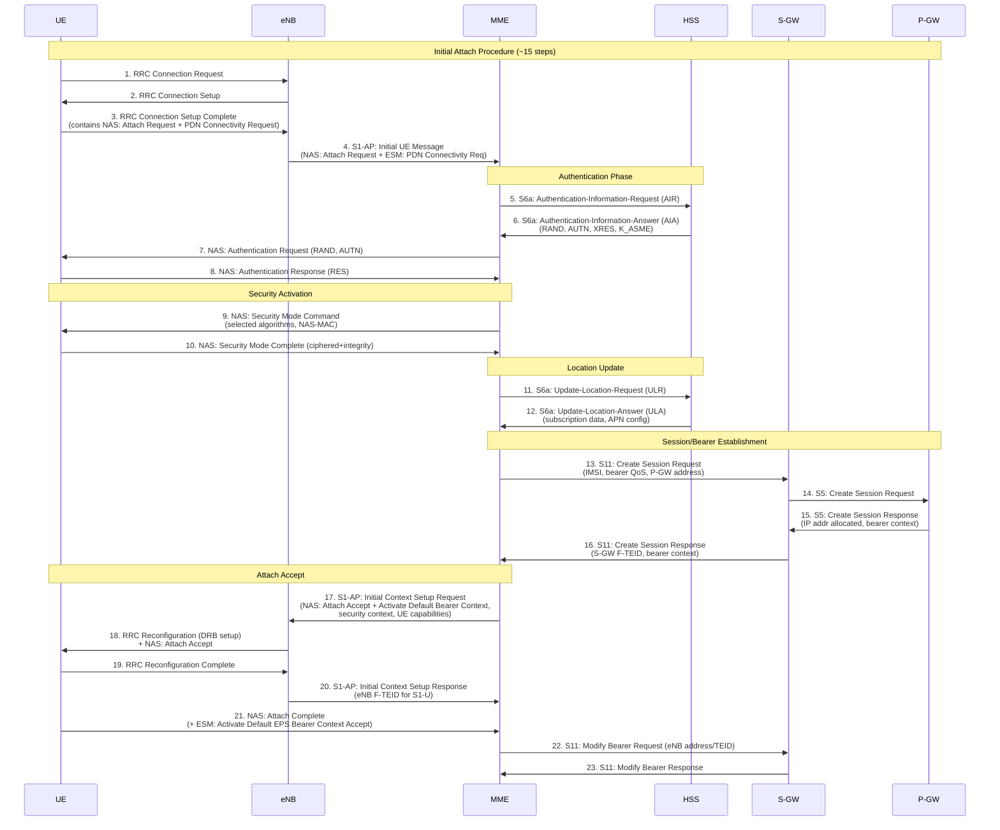
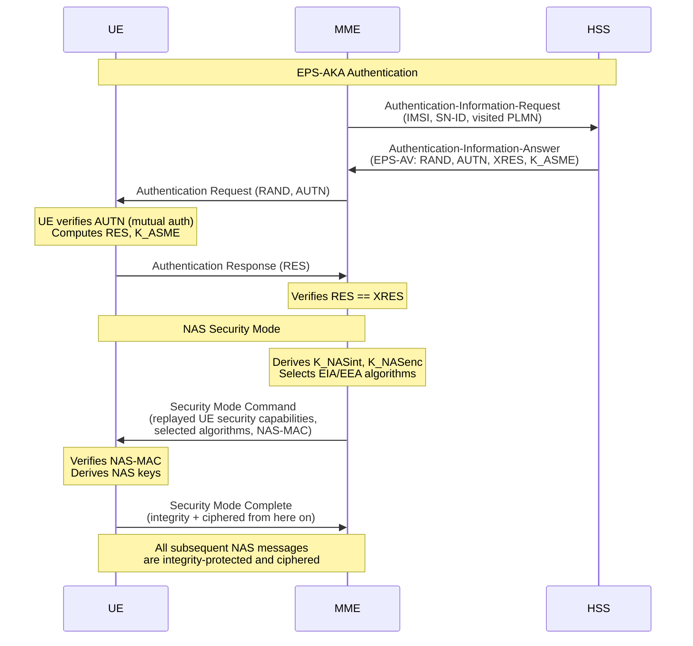
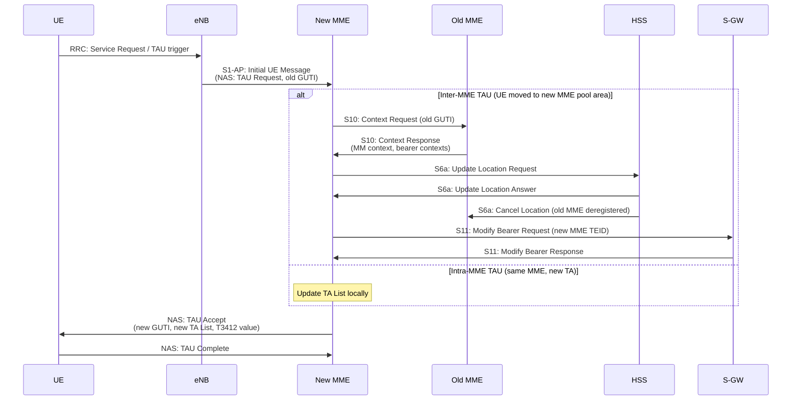
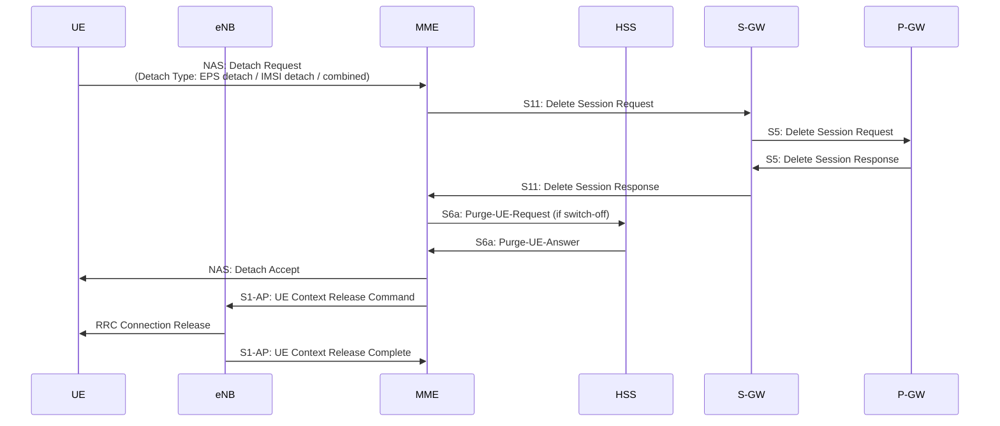
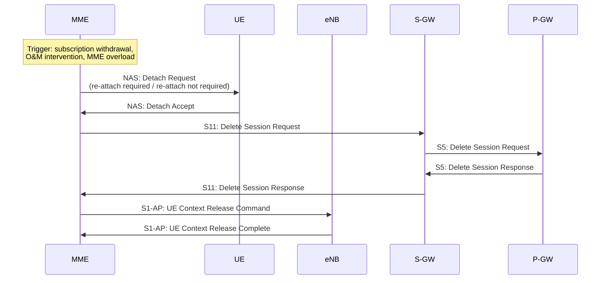
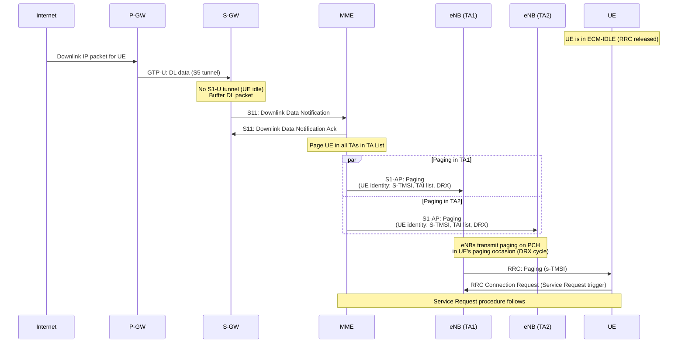
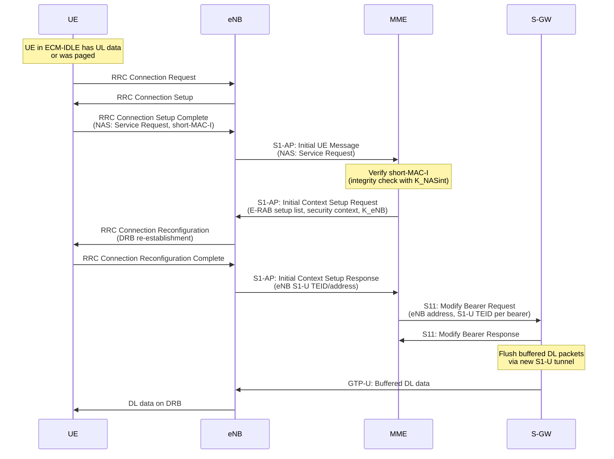
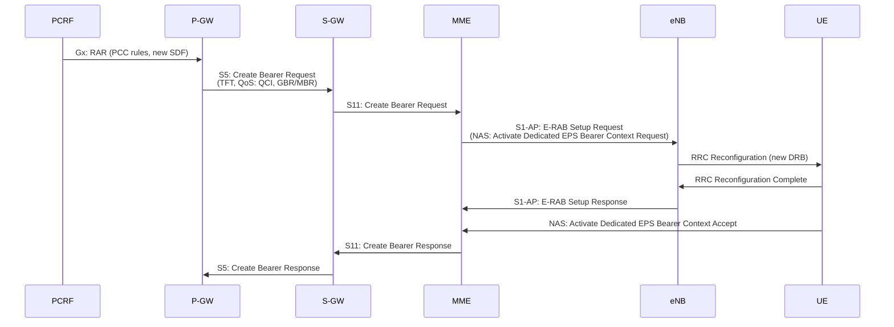

# Module 12: Mobility Management Entity (MME)

## 1. Why MME Exists

The MME is the **central control-plane entity** in the LTE/EPC architecture. It exists to:

- **Offload the RAN from core signaling**: In 2G/3G, the RNC/BSC handled significant core-network signaling. LTE's flat architecture moved all NAS (Non-Access Stratum) signaling termination to the MME, simplifying eNodeB (eNB) design.
- **Centralize control-plane intelligence**: Authentication, mobility management, bearer setup, and paging are all orchestrated by the MME.
- **Decouple control and user planes**: The MME handles no user-plane traffic — it purely manages signaling, enabling independent scaling of CP and UP.

### Key Interfaces

| Interface | Peer Node | Protocol | Purpose |
|-----------|-----------|----------|---------|
| S1-MME | eNB | S1-AP (SCTP) | NAS transport, handover signaling |
| S6a | HSS | Diameter | Authentication vectors, subscription data |
| S11 | S-GW | GTPv2-C | Bearer/session management |
| S10 | Other MME | GTPv2-C | Inter-MME handover, context transfer |
| S3 | SGSN | GTPv2-C | 2G/3G ↔ LTE mobility |

---

## 2. MME Functions

### 2.1 NAS Signaling Termination
- The MME is the NAS endpoint — it terminates all NAS messages from the UE (transported transparently through eNB via S1-AP).
- NAS messages are integrity-protected and ciphered between UE and MME.

### 2.2 Mobility Management
- Tracking Area (TA) management and TA List assignment
- Handover signaling (S1-based and X2 with MME involvement)
- Inter-RAT mobility (to/from 2G/3G via S3/S10)

### 2.3 Authentication and Security
- Retrieves authentication vectors from HSS (via S6a)
- Runs EPS-AKA (Authentication and Key Agreement)
- Derives NAS keys (K_NASint, K_NASenc) and AS keys (K_eNB)
- Initiates NAS Security Mode Command

### 2.4 Bearer Management
- Establishes default EPS bearers during attach
- Coordinates dedicated bearer activation/modification/deactivation
- Interacts with S-GW (S11) and indirectly P-GW

### 2.5 Paging
- Pages UEs in ECM-IDLE state when downlink data arrives
- Sends S1-AP Paging messages to all eNBs in the UE's registered TA list

### 2.6 Idle-Mode Reachability
- Maintains UE context even when UE is IDLE (ECM-IDLE)
- Knows which Tracking Areas the UE may be in
- Triggers paging when data or signaling arrives

### 2.7 MME Selection, Pooling, and Rebalancing
- Multiple MMEs serve the same area (MME Pool)
- Load balancing via relative capacity (weight factor) advertised to eNBs
- Rebalancing: graceful transfer of UE contexts when adding/removing MMEs

---

## 3. NAS Protocol Stack

NAS (Non-Access Stratum) operates between UE and MME, transparent to eNB.

### 3.1 EMM — EPS Mobility Management

Manages UE registration and mobility:
- Attach / Detach
- Tracking Area Update (TAU)
- Authentication (EPS-AKA)
- Security Mode Control
- GUTI Reallocation
- Service Request

**EMM States:**
- EMM-DEREGISTERED: UE not registered
- EMM-REGISTERED: UE attached to network

### 3.2 ESM — EPS Session Management

Manages PDN connections and EPS bearers:
- PDN Connectivity Request/Accept
- Bearer Resource Allocation
- Bearer Modify / Deactivate
- PDN Disconnect

**ESM operates piggybacked on EMM during attach** (ESM message embedded in Attach Request).

---

## 4. Detailed Procedures

### 4.1 LTE Initial Attach (Full Flow)



**Key Points:**
- Steps 7-10: EPS-AKA + NAS security activation
- Steps 13-16: GTP-C session establishment across S11/S5
- The Attach Request carries a piggybacked PDN Connectivity Request (ESM)
- The UE gets its IP address from P-GW (step 15)


### 4.2 Authentication and Security Mode



**Key Derivation Hierarchy:**
```
K (USIM) → CK, IK → K_ASME → K_NASint, K_NASenc, K_eNB → K_UPenc, K_RRCint, K_RRCenc
```

### 4.3 Tracking Area Update (TAU)

**Triggers:**
- **Periodic TAU**: Timer T3412 expires (default ~54 min) — confirms UE is still reachable
- **Mobility-triggered TAU**: UE moves to a cell whose TAC is not in its TA List



### 4.4 Detach Procedure

#### UE-Initiated Detach



#### Network-Initiated Detach




### 4.5 Paging (S1 Paging Procedure)



### 4.6 Service Request (UE in IDLE → CONNECTED)



---

## 5. Bearer Management

### 5.1 Default Bearer Setup
- Created automatically during Initial Attach (part of Create Session)
- One default bearer per PDN connection (always-on, non-GBR)
- QCI typically 9 (best-effort Internet) or 5 (IMS signaling)
- Cannot be deactivated without disconnecting the PDN

### 5.2 Dedicated Bearer Activation



### 5.3 Dedicated Bearer Modification
- Triggered by PCRF policy change (e.g., QoS upgrade during VoLTE call)
- Uses Update Bearer Request/Response across S5 → S11 → S1-AP

### 5.4 Dedicated Bearer Deactivation
- Triggered by PCRF (policy removal), P-GW, or MME
- Uses Delete Bearer Request/Response
- Default bearer deactivation = PDN disconnect (all bearers for that PDN removed)

---

## 6. MME Selection

### 6.1 DNS-Based Selection
- eNB resolves MME FQDN from TAI → DNS returns list of MME IPs
- Format: `tac-XXXX.tac-YYYY.mme.epc.mnc<MNC>.mcc<MCC>.3gppnetwork.org`

### 6.2 Load Balancing
- Each MME advertises a **Relative MME Capacity** (weight, 0-255) via S1 Setup
- eNB distributes new UEs proportionally across pool members
- Higher capacity value = more UEs directed to that MME

### 6.3 GUMMEI — Globally Unique MME Identifier
```
GUMMEI = MCC + MNC + MME Group ID (MMEGI) + MME Code (MMEC)
```
- MMEGI identifies the MME pool
- MMEC identifies a specific MME within the pool
- GUTI = GUMMEI + M-TMSI (temporary UE identity)

---

## 7. S1-Flex and MME Pooling

### Concept
- **S1-Flex**: Each eNB connects to **multiple MMEs** in a pool (not just one)
- **MME Pool Area**: Geographic region served by a set of MMEs
- Benefits:
  - **Redundancy**: If one MME fails, others serve UEs
  - **Load sharing**: New UEs distributed by weight
  - **Geo-redundancy**: Pool members can be in different data centers
  - **Graceful scaling**: Add/remove MMEs without service interruption

### MME Overload and Rebalancing
- MME sends **Overload Start** to eNBs → eNB redirects new connections to other pool members
- **Rebalancing**: MME requests UEs to re-attach to redistribute load (via implicit detach with re-attach indication)

---

## 8. Evolution: MME → AMF (5G)

| Aspect | LTE MME | 5G AMF |
|--------|---------|--------|
| Architecture | Monolithic NE | Microservice (SBI-based) |
| Protocol | GTPv2-C, Diameter | HTTP/2, JSON (SBI), NGAP |
| NAS | EMM + ESM (combined) | 5G-NAS (MM only; SM separated to SMF) |
| Session Mgmt | MME handles bearer signaling | Delegated entirely to SMF |
| Slicing | N/A | Slice-aware, routes to correct SMF per slice |
| Registration | Attach/TAU | Registration (unified) |
| State | Stateful | Designed for stateless (UDSF) |
| Interface to RAN | S1-AP | NGAP (N2) |
| Interface to UDM | Diameter S6a | Nudm (SBI) |

**Key Changes:**
1. **Session management decoupled**: MME handled both mobility + bearers; in 5G, AMF handles only mobility/security, SMF handles sessions
2. **Service-based interface**: AMF exposes Namf services, consumed by other NFs via HTTP/2
3. **Network slicing**: AMF performs slice selection (NSSF interaction) and routes to slice-specific SMF
4. **Stateless design**: UE context can be stored externally (UDSF) for resilience
5. **Unified registration**: No separate Attach vs TAU — single Registration procedure handles both
