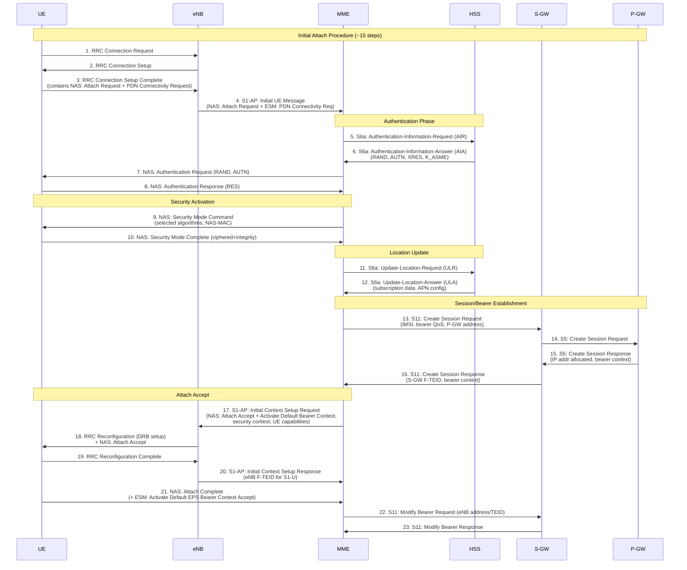
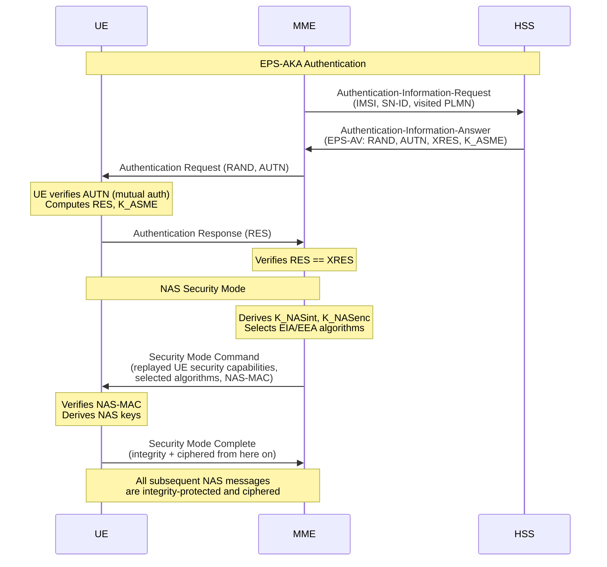
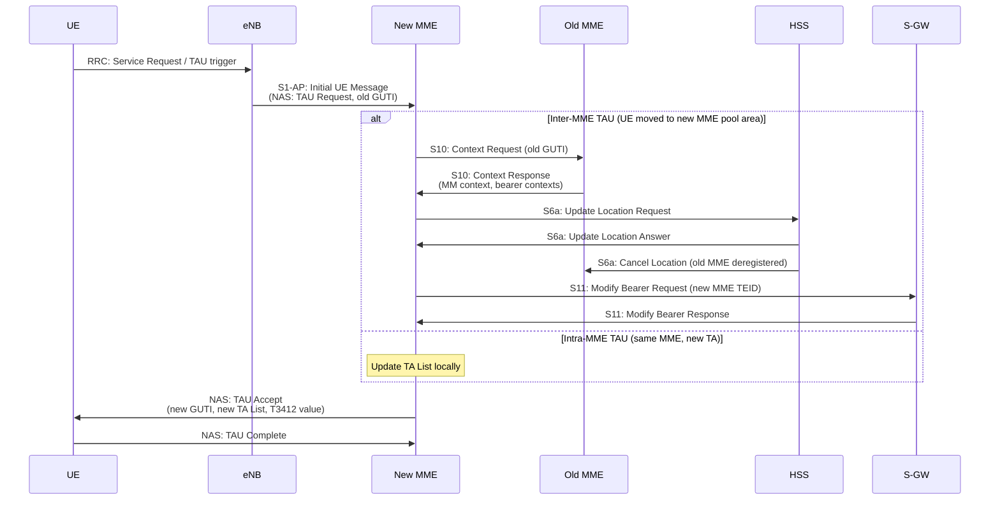
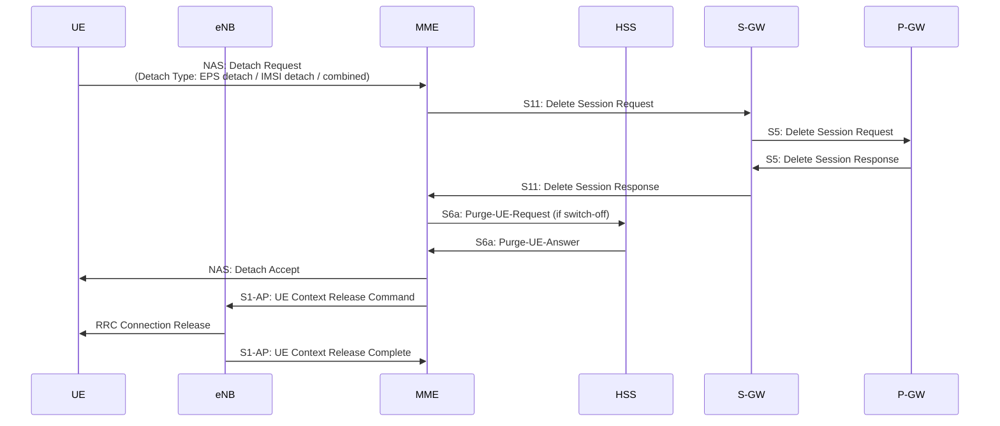
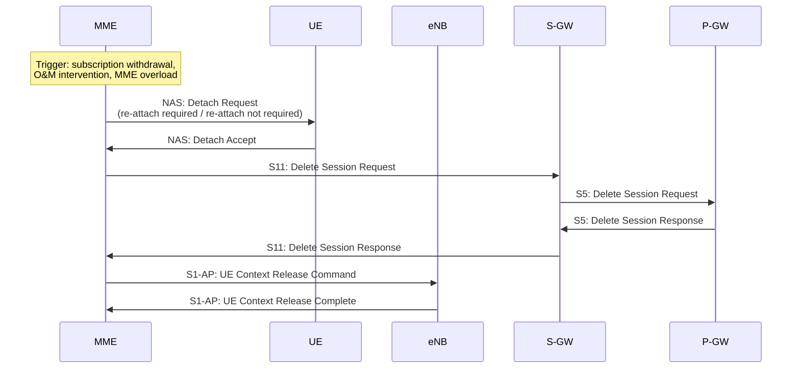
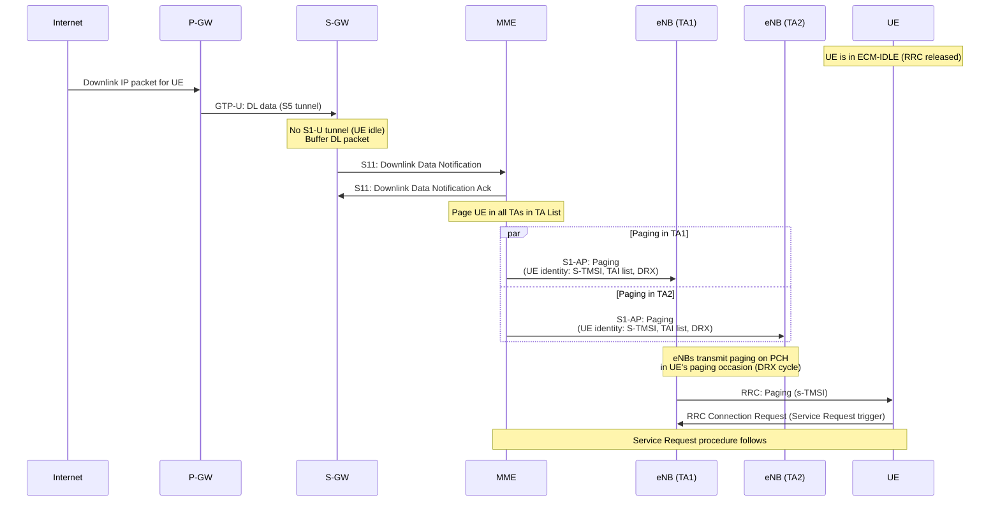
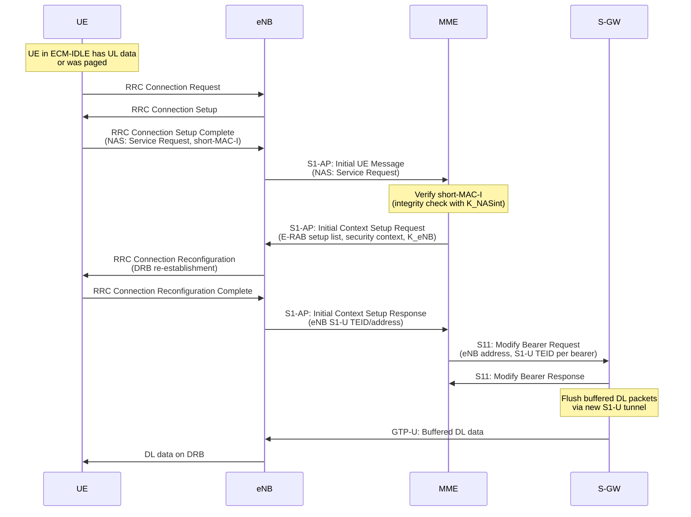
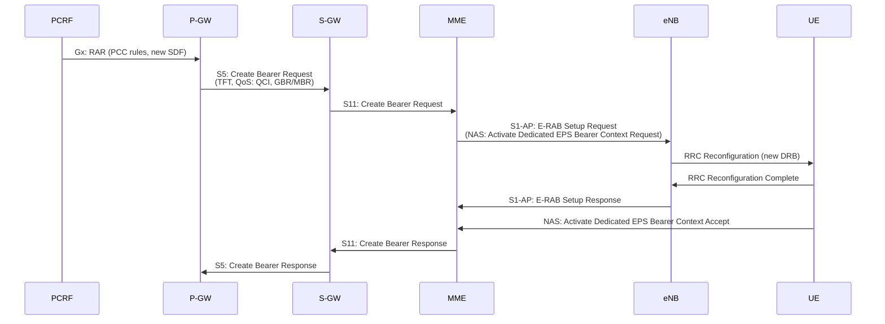

# ماژول 12: موجودیت مدیریت تحرک (MME)

## 1. چرا MME وجود دارد
<div dir="rtl">
MME **موجودیت مرکزی صفحه کنترل** در معماری LTE/EPC است. دلیل وجود آن:
</div>
- **تخلیه RAN از سیگنالینگ هسته**: در 2G/3G، RNC/BSC سیگنالینگ قابل توجهی از شبکه هسته را مدیریت می‌کرد. معماری مسطح LTE تمام پایان‌دهی سیگنالینگ NAS (لایه غیر-دسترسی) را به MME منتقل کرد و طراحی eNodeB (eNB) را ساده کرد.
- **متمرکزسازی هوش صفحه کنترل**: احراز هویت، مدیریت تحرک، برقراری حامل و صفحه‌بندی همه توسط MME هماهنگ می‌شوند.
- **جداکردن صفحه کنترل از صفحه کاربر**: MME به هیچ ترافیک صفحه کاربری دست نمی‌زند — صرفاً سیگنالینگ را مدیریت می‌کند، که مقیاس‌پذیری مستقل CP و UP را ممکن می‌سازد.

### واسط‌های کلیدی

| واسط | گره همتا | پروتکل | هدف |
|-----------|-----------|----------|---------|
| S1-MME | eNB | S1-AP (SCTP) | انتقال NAS، سیگنالینگ تحویل |
| S6a | HSS | Diameter | بردارهای احراز هویت، داده اشتراک |
| S11 | S-GW | GTPv2-C | مدیریت حامل/نشست |
| S10 | MME دیگر | GTPv2-C | تحویل بین-MME، انتقال زمینه |
| S3 | SGSN | GTPv2-C | تحرک 2G/3G ↔ LTE |

---

## 2. توابع MME

### 2.1 پایان‌دهی سیگنالینگ NAS
- MME نقطه انتهایی NAS است — تمام پیام‌های NAS از UE را پایان می‌دهد (که از طریق eNB با S1-AP به‌صورت شفاف منتقل می‌شوند).
- پیام‌های NAS بین UE و MME محافظت‌شده با یکپارچگی و رمزگذاری‌شده هستند.

### 2.2 مدیریت تحرک
- مدیریت ناحیه ردیابی (TA) و تخصیص فهرست TA
- سیگنالینگ تحویل (مبتنی بر S1 و X2 با دخالت MME)
- تحرک بین-RAT (به/از 2G/3G از طریق S3/S10)

### 2.3 احراز هویت و امنیت
- بردارهای احراز هویت را از HSS بازیابی می‌کند (از طریق S6a)
- EPS-AKA (احراز هویت و توافق کلید) را اجرا می‌کند
- کلیدهای NAS (K_NASint، K_NASenc) و کلیدهای AS (K_eNB) را مشتق می‌کند
- NAS Security Mode Command را آغاز می‌کند

### 2.4 مدیریت حامل
- حامل‌های پیش‌فرض EPS را در حین اتصال برقرار می‌کند
- فعال‌سازی/اصلاح/غیرفعال‌سازی حامل اختصاصی را هماهنگ می‌کند
- با S-GW (S11) و به‌طور غیرمستقیم با P-GW تعامل دارد

### 2.5 صفحه‌بندی
- UEها را در حالت ECM-IDLE هنگام رسیدن داده پیوند پایین‌سو صفحه‌بندی می‌کند
- پیام‌های S1-AP Paging را به تمام eNBها در فهرست TA ثبت‌شده UE می‌فرستد

### 2.6 دسترسی‌پذیری در حالت بیکار
- زمینه UE را حتی وقتی UE در IDLE (ECM-IDLE) است حفظ می‌کند
- می‌داند UE ممکن است در کدام نواحی ردیابی باشد
- هنگام رسیدن داده یا سیگنالینگ، صفحه‌بندی را فعال می‌کند

### 2.7 انتخاب، استخرسازی و توازن مجدد MME
- چندین MME به همان ناحیه خدمات می‌دهند (استخر MME)
- توازن بار از طریق ظرفیت نسبی (عامل وزن) که به eNBها اعلام می‌شود
- توازن مجدد: انتقال تدریجی زمینه‌های UE هنگام افزودن/حذف MMEها

---

## 3. پشته پروتکل NAS

NAS (لایه غیر-دسترسی) بین UE و MME عمل می‌کند و نسبت به eNB شفاف است.

### 3.1 EMM — مدیریت تحرک EPS

ثبت‌نام و تحرک UE را مدیریت می‌کند:
- Attach / Detach
- به‌روزرسانی ناحیه ردیابی (TAU)
- احراز هویت (EPS-AKA)
- کنترل حالت امنیتی
- تخصیص مجدد GUTI
- درخواست خدمات

**حالت‌های EMM:**
- EMM-DEREGISTERED: UE ثبت‌نام نشده است
- EMM-REGISTERED: UE به شبکه متصل است

### 3.2 ESM — مدیریت نشست EPS

اتصالات PDN و حامل‌های EPS را مدیریت می‌کند:
- درخواست/پذیرش اتصال PDN
- تخصیص منابع حامل
- اصلاح / غیرفعال‌سازی حامل
- قطع اتصال PDN

**ESM در حین اتصال به‌صورت حمل‌شده روی EMM عمل می‌کند** (پیام ESM درون Attach Request جای می‌گیرد).

---

## 4. رویه‌های تفصیلی

### 4.1 اتصال اولیه LTE (جریان کامل)



**نکات کلیدی:**
- گام‌های 7-10: EPS-AKA + فعال‌سازی امنیت NAS
- گام‌های 13-16: برقراری نشست GTP-C در سراسر S11/S5
- درخواست اتصال، یک PDN Connectivity Request حمل‌شده (ESM) را حمل می‌کند
- UE آدرس IP خود را از P-GW می‌گیرد (گام 15)


### 4.2 احراز هویت و حالت امنیتی



**سلسله‌مراتب مشتق‌سازی کلید:**
```
K (USIM) → CK, IK → K_ASME → K_NASint, K_NASenc, K_eNB → K_UPenc, K_RRCint, K_RRCenc
```

### 4.3 به‌روزرسانی ناحیه ردیابی (TAU)

**محرک‌ها:**
- **TAU دوره‌ای**: تایمر T3412 منقضی می‌شود (پیش‌فرض حدود 54 دقیقه) — تأیید می‌کند UE هنوز قابل دسترسی است
- **TAU با محرک تحرک**: UE به سلولی می‌رود که TAC آن در فهرست TA آن نیست



### 4.4 رویه جداسازی

#### جداسازی با شروع UE



#### جداسازی با شروع شبکه




### 4.5 صفحه‌بندی (رویه صفحه‌بندی S1)



### 4.6 درخواست خدمات (UE از IDLE ← CONNECTED)



---

## 5. مدیریت حامل

### 5.1 برقراری حامل پیش‌فرض
- به‌طور خودکار در حین اتصال اولیه ایجاد می‌شود (بخشی از Create Session)
- یک حامل پیش‌فرض در هر اتصال PDN (همیشه فعال، غیر-GBR)
- QCI معمولاً 9 (اینترنت بهترین تلاش) یا 5 (سیگنالینگ IMS)
- بدون قطع اتصال PDN نمی‌تواند غیرفعال شود

### 5.2 فعال‌سازی حامل اختصاصی



### 5.3 اصلاح حامل اختصاصی
- با محرک تغییر سیاست PCRF (مثلاً ارتقای QoS در حین تماس VoLTE)
- از Update Bearer Request/Response در سراسر S5 ← S11 ← S1-AP استفاده می‌کند

### 5.4 غیرفعال‌سازی حامل اختصاصی
- با محرک PCRF (حذف سیاست)، P-GW یا MME
- از Delete Bearer Request/Response استفاده می‌کند
- غیرفعال‌سازی حامل پیش‌فرض = قطع اتصال PDN (تمام حامل‌های آن PDN حذف می‌شوند)

---

## 6. انتخاب MME

### 6.1 انتخاب مبتنی بر DNS
- eNB نام FQDN مربوط به MME را از TAI حل می‌کند ← DNS فهرست IPهای MME را بازمی‌گرداند
- قالب: `tac-XXXX.tac-YYYY.mme.epc.mnc<MNC>.mcc<MCC>.3gppnetwork.org`

### 6.2 توازن بار
- هر MME یک **ظرفیت نسبی MME** (وزن، 0-255) را از طریق S1 Setup اعلام می‌کند
- eNB UEهای جدید را به‌تناسب در بین اعضای استخر توزیع می‌کند
- مقدار ظرفیت بالاتر = UEهای بیشتر به آن MME هدایت می‌شوند

### 6.3 GUMMEI — شناسه یکتای جهانی MME
```
GUMMEI = MCC + MNC + MME Group ID (MMEGI) + MME Code (MMEC)
```
- MMEGI استخر MME را شناسایی می‌کند
- MMEC یک MME مشخص درون استخر را شناسایی می‌کند
- GUTI = GUMMEI + M-TMSI (هویت موقت UE)

---

## 7. S1-Flex و استخرسازی MME

### مفهوم
- **S1-Flex**: هر eNB به **چندین MME** در یک استخر متصل می‌شود (نه فقط یکی)
- **ناحیه استخر MME**: ناحیه جغرافیایی که توسط مجموعه‌ای از MMEها خدمات می‌گیرد
- مزایا:
  - **افزونگی**: اگر یک MME شکست بخورد، بقیه به UEها خدمات می‌دهند
  - **اشتراک بار**: UEهای جدید بر اساس وزن توزیع می‌شوند
  - **افزونگی جغرافیایی**: اعضای استخر می‌توانند در مراکز داده مختلف باشند
  - **مقیاس‌دهی تدریجی**: افزودن/حذف MMEها بدون وقفه سرویس

### اضافه‌بار و توازن مجدد MME
- MME یک **Overload Start** به eNBها می‌فرستد ← eNB اتصالات جدید را به سایر اعضای استخر هدایت می‌کند
- **توازن مجدد**: MME از UEها می‌خواهد دوباره متصل شوند تا بار را بازتوزیع کند (از طریق جداسازی ضمنی با نشانه اتصال مجدد)

---

## 8. تحول: MME ← AMF (5G)

| جنبه | MME در LTE | AMF در 5G |
|--------|---------|--------|
| معماری | NE یکپارچه | میکروسرویس (مبتنی بر SBI) |
| پروتکل | GTPv2-C، Diameter | HTTP/2، JSON (SBI)، NGAP |
| NAS | EMM + ESM (ترکیبی) | 5G-NAS (فقط MM؛ SM به SMF جدا شد) |
| مدیریت نشست | MME سیگنالینگ حامل را انجام می‌دهد | کاملاً به SMF واگذار شده |
| شبکه‌بندی | N/A | آگاه به برش، مسیریابی به SMF صحیح در هر برش |
| ثبت‌نام | Attach/TAU | Registration (یکپارچه) |
| حالت | حالت‌دار | طراحی‌شده برای بدون-حالت (UDSF) |
| واسط با RAN | S1-AP | NGAP (N2) |
| واسط با UDM | Diameter S6a | Nudm (SBI) |

**تغییرات کلیدی:**
1. **جداسازی مدیریت نشست**: MME هم تحرک و هم حامل‌ها را انجام می‌داد؛ در 5G، AMF فقط تحرک/امنیت را انجام می‌دهد، SMF نشست‌ها را مدیریت می‌کند
2. **واسط خدمات‌محور**: AMF خدمات Namf را ارائه می‌دهد که توسط سایر NFها از طریق HTTP/2 مصرف می‌شود
3. **شبکه‌بندی**: AMF انتخاب برش (تعامل NSSF) را انجام می‌دهد و به SMF مختص برش مسیریابی می‌کند
4. **طراحی بدون حالت**: زمینه UE می‌تواند به‌صورت خارجی (UDSF) برای تاب‌آوری ذخیره شود
5. **ثبت‌نام یکپارچه**: بدون Attach در برابر TAU جداگانه — رویه Registration واحد هر دو را مدیریت می‌کند

