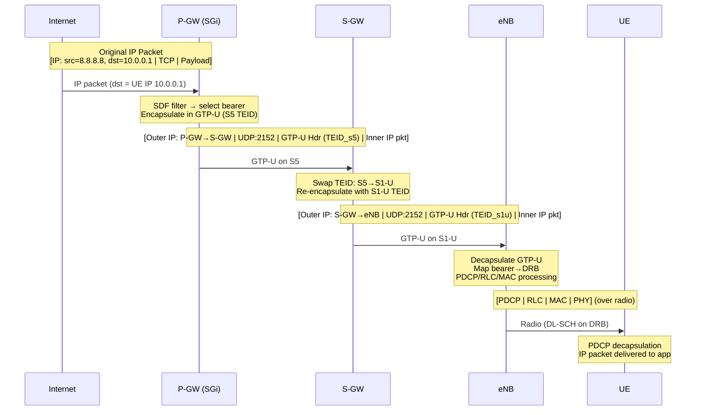
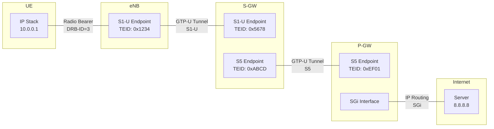
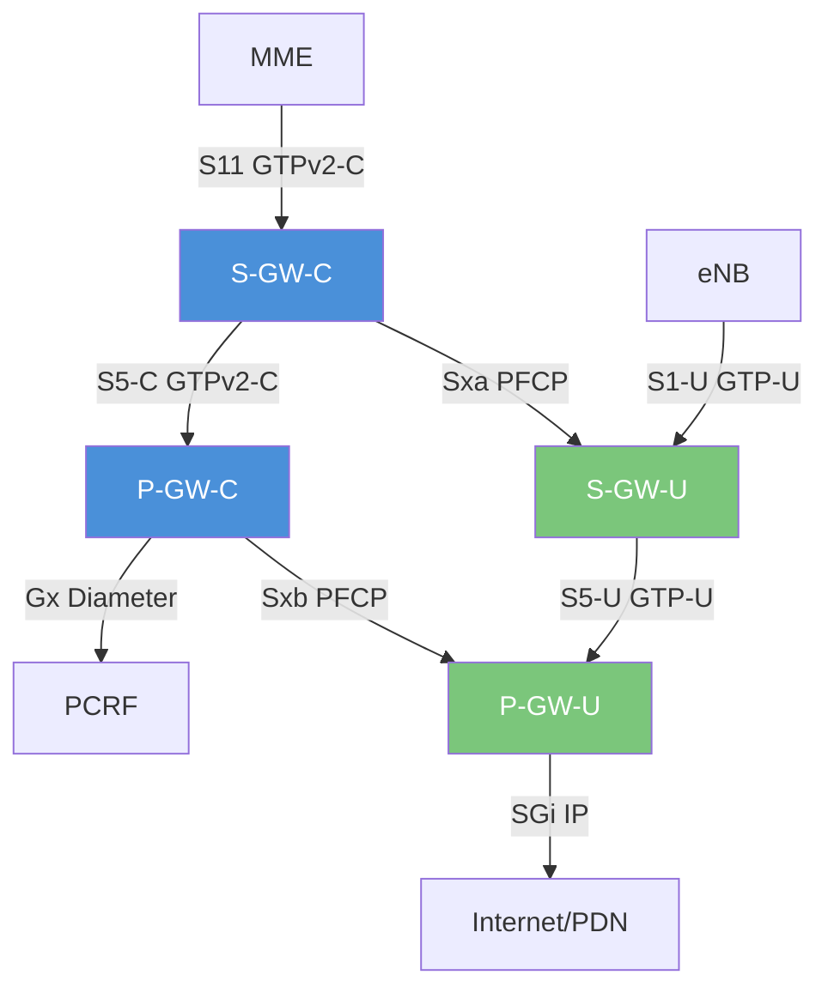

# Module 13: S-GW (Serving Gateway) and P-GW (PDN Gateway)

## 1. Why Separate S-GW and P-GW?

LTE deliberately splits the user-plane gateway into two distinct nodes:

| Role | S-GW | P-GW |
|------|------|------|
| **Anchoring** | Local mobility anchor (intra-LTE) | PDN/IP anchor (inter-RAT, global) |
| **Scope** | Per-MME pool area | Per-PDN connection (could span MME areas) |
| **Mobility** | Changes during inter-MME HO | Stays the same for entire PDN session |
| **Placement** | Close to RAN (low latency) | Centralized (policy, charging) |

**Design Rationale:**
1. **Different lifetimes**: S-GW can relocate during mobility; P-GW remains fixed for IP continuity
2. **Independent scaling**: S-GW scales with local traffic; P-GW scales with subscribers/policies
3. **CUPS preparation**: The split enables Control/User Plane Separation — you can distribute S-GW-U at the edge while keeping S-GW-C centralized
4. **Roaming**: In home-routed roaming, S-GW is in visited PLMN; P-GW is in home PLMN (S8 interface)

---

## 2. S-GW (Serving Gateway)

### 2.1 User-Plane Forwarding

The S-GW is essentially a **GTP-U tunnel switch**:
- Receives DL packets from P-GW on S5/S8 GTP-U tunnel
- Forwards them to eNodeB (eNB) on S1-U GTP-U tunnel
- Receives UL packets from eNB on S1-U and forwards to P-GW on S5/S8

Each bearer has **separate GTP-U tunnels** on each interface (identified by TEID).

### 2.2 Local Mobility Anchor

During **X2 handover** (direct eNB-to-eNB):
- S-GW does NOT change
- Source eNB forwards buffered/in-transit packets to target eNB via X2
- After handover, MME sends **Modify Bearer Request** to S-GW with new eNB address/TEID
- S-GW switches S1-U tunnel endpoint from source eNB to target eNB (**path switch**)

This avoids tearing down the S5 tunnel to P-GW — only the S1-U leg changes.

### 2.3 Downlink Data Buffering

When UE is in **ECM-IDLE** (no S1-U tunnel exists):
1. DL packets arrive from P-GW on S5 tunnel
2. S-GW has no S1-U endpoint → **buffers packets**
3. S-GW sends **Downlink Data Notification** to MME (via S11)
4. MME initiates paging
5. After UE responds (Service Request), MME sends Modify Bearer Request with new eNB TEID
6. S-GW flushes buffered packets to eNB

**Buffer limits**: Configurable per operator; typically 1-10 packets per bearer. Excess dropped.

### 2.4 Per-UE/Per-Bearer Charging

S-GW generates **CDRs (Charging Data Records)** with:
- UL/DL volume per bearer
- Duration
- QoS information (QCI, ARP, GBR/MBR)
- Cause of record closure (HO, time limit, volume limit)

Sent to **offline charging system (CDF)** via Rf/Gz interface.

### 2.5 Lawful Interception

S-GW can mirror user-plane traffic for lawful interception (LI):
- X2 interface (ETSI standard) to Law Enforcement Monitoring Facility (LEMF)
- Triggered by warrant, activated via X1 interface from LI administration
- Duplicates packets without affecting UE service

### 2.6 S-GW Interfaces

| Interface | Peer | Protocol | Function |
|-----------|------|----------|----------|
| **S1-U** | eNB | GTP-U (UDP) | User-plane to/from RAN |
| **S5** | P-GW (same PLMN) | GTP-U + GTPv2-C | UP forwarding + CP session mgmt |
| **S8** | P-GW (roaming) | GTP-U + GTPv2-C | Same as S5 but inter-PLMN |
| **S11** | MME | GTPv2-C | CP: bearer/session management |
| **S12** | UTRAN (3G) | GTP-U | Direct tunnel for 3G interworking |

---

## 3. P-GW (PDN Gateway)

### 3.1 PDN Connectivity and IP Address Allocation

The P-GW is the **UE's gateway to the Internet/PDN** — it assigns the UE its IP address:

**IPv4 Allocation Methods:**
- **Static**: Pre-configured in HSS subscription data
- **Dynamic (DHCPv4)**: P-GW acts as DHCP server or relays to external DHCP
- **Dynamic (internal pool)**: P-GW allocates from local address pool (most common)

**IPv6 Allocation:**
- P-GW assigns a /64 prefix via **Router Advertisement (SLAAC)**
- UE generates Interface ID (EUI-64 or privacy extensions)
- Prefix delivered in PCO (Protocol Configuration Options) during bearer activation

**Dual-Stack (IPv4v6):**
- Both IPv4 address and IPv6 prefix assigned simultaneously
- Requires PDN Type = IPv4v6 in subscription

### 3.2 Policy Enforcement

P-GW enforces policies received from **PCRF** via the **Gx interface**:

- **PCC Rules (Policy and Charging Control):**
  - SDF (Service Data Flow) filters — 5-tuple matching
  - QoS parameters (QCI, GBR, MBR, ARP)
  - Charging keys and rating groups
  - Gate status (open/close specific flows)

- **TFT (Traffic Flow Template):**
  - **DL TFT**: At P-GW — maps incoming DL packets to correct bearer
  - **UL TFT**: Sent to UE — UE maps UL packets to correct bearer
  - Packet filters: source/dest IP, port range, protocol, ToS/DSCP

### 3.3 Charging

| Type | Interface | Node | Use Case |
|------|-----------|------|----------|
| **Online (OCS)** | Gy (Diameter) | OCS | Prepaid; real-time credit control |
| **Offline (OFCS)** | Gz (GTP') | CDF/CGF | Postpaid; CDR generation |

**Charging triggers:**
- Volume threshold (e.g., every 1 MB)
- Time threshold (e.g., every 60 seconds)
- QoS change, bearer modification
- Re-authorization from OCS

### 3.4 Packet Filtering and Routing

- **DL**: Internet → P-GW: Match destination IP to UE session, apply SDF filter to select bearer, encapsulate in GTP-U toward S-GW
- **UL**: UE → P-GW: Decapsulate GTP-U, apply NAT (if private addressing), route to Internet
- **NAT/NAPT**: P-GW often performs NAT for IPv4 (private UE addresses → public)
- **Header compression**: Not at P-GW (done at PDCP layer in RAN)

### 3.5 SGi Interface

- SGi connects P-GW to **external PDNs** (Internet, IMS, enterprise VPNs)
- IP-based interface (no GTP)
- Equivalent to Gi in 3G (GGSN → Internet)
- Multiple PDNs supported (each identified by APN)
- May connect to:
  - Internet (public APN)
  - IMS core (ims APN)
  - Enterprise VPN (private APN)
  - Content/CDN platforms

### 3.6 UL/DL TFT — Mapping Packets to Bearers

```
┌──────────────────────────────────────────────────────────────┐
│ Multiple Bearers per PDN Connection                          │
├──────────────────────────────────────────────────────────────┤
│                                                              │
│  Default Bearer (QCI 9) ← All traffic not matching any TFT  │
│  Dedicated Bearer 1 (QCI 1) ← VoLTE: src port 1234, UDP    │
│  Dedicated Bearer 2 (QCI 4) ← Video: dst port 8080, TCP    │
│                                                              │
└──────────────────────────────────────────────────────────────┘

DL (P-GW side):  Internet packet arrives → P-GW checks SDF filters
                  → matches "VoLTE" rule → maps to Dedicated Bearer 1
                  → encapsulates in GTP-U with Bearer 1's TEID

UL (UE side):    UE app sends VoIP packet → UE checks UL TFT
                  → matches Dedicated Bearer 1 filter
                  → sends on DRB mapped to Bearer 1
```


---

## 4. GTP Protocol

### 4.1 GTP-C (GTP Control Plane) — GTPv2-C

GTP-C manages tunnel/session lifecycle on S11, S5/S8, S10, S3 interfaces.

**Key Messages:**

| Message | Direction | Purpose |
|---------|-----------|---------|
| Create Session Request/Response | MME→S-GW→P-GW | Establish PDN connection + default bearer |
| Modify Bearer Request/Response | MME→S-GW | Update tunnel endpoints (HO, service request) |
| Delete Session Request/Response | MME→S-GW→P-GW | Tear down PDN connection |
| Create Bearer Request/Response | P-GW→S-GW→MME | Dedicated bearer activation |
| Update Bearer Request/Response | P-GW→S-GW→MME | QoS modification |
| Delete Bearer Request/Response | P-GW→S-GW→MME | Dedicated bearer deactivation |
| Downlink Data Notification | S-GW→MME | Trigger paging for idle UE |
| Release Access Bearers | MME→S-GW | UE goes idle, release S1-U |

**GTPv2-C Header:**
```
 0                   1                   2                   3
 0 1 2 3 4 5 6 7 8 9 0 1 2 3 4 5 6 7 8 9 0 1 2 3 4 5 6 7 8 9 0 1
+-+-+-+-+-+-+-+-+-+-+-+-+-+-+-+-+-+-+-+-+-+-+-+-+-+-+-+-+-+-+-+-+
|Version|P|T|S=1|  Message Type |         Message Length        |
+-+-+-+-+-+-+-+-+-+-+-+-+-+-+-+-+-+-+-+-+-+-+-+-+-+-+-+-+-+-+-+-+
|              TEID (if T=1)                                    |
+-+-+-+-+-+-+-+-+-+-+-+-+-+-+-+-+-+-+-+-+-+-+-+-+-+-+-+-+-+-+-+-+
|          Sequence Number                      |    Spare      |
+-+-+-+-+-+-+-+-+-+-+-+-+-+-+-+-+-+-+-+-+-+-+-+-+-+-+-+-+-+-+-+-+
```

**TEID (Tunnel Endpoint Identifier):**
- 32-bit identifier, locally unique per node
- Each side assigns its own TEID and communicates it to the peer
- Allows multiplexing multiple tunnels on same IP:port

### 4.2 GTP-U (GTP User Plane)

GTP-U encapsulates user IP packets for transport between EPC nodes.

**GTP-U Header:**
```
 0                   1                   2                   3
 0 1 2 3 4 5 6 7 8 9 0 1 2 3 4 5 6 7 8 9 0 1 2 3 4 5 6 7 8 9 0 1
+-+-+-+-+-+-+-+-+-+-+-+-+-+-+-+-+-+-+-+-+-+-+-+-+-+-+-+-+-+-+-+-+
|Version| PT| *| E| S|PN| Message Type  |       Length          |
+-+-+-+-+-+-+-+-+-+-+-+-+-+-+-+-+-+-+-+-+-+-+-+-+-+-+-+-+-+-+-+-+
|                           TEID                                |
+-+-+-+-+-+-+-+-+-+-+-+-+-+-+-+-+-+-+-+-+-+-+-+-+-+-+-+-+-+-+-+-+
|      Sequence Number (opt)    | N-PDU Number (opt)| Next Ext  |
+-+-+-+-+-+-+-+-+-+-+-+-+-+-+-+-+-+-+-+-+-+-+-+-+-+-+-+-+-+-+-+-+
```

- **Message Type 0xFF (255)**: T-PDU — contains user data (most common)
- **Transport**: UDP port 2152
- **T-PDU**: The encapsulated user IP packet
- **Sequence Number**: Optional, used for reordering during path switch/handover

### 4.3 GTP-C vs GTP-U Comparison

| Aspect | GTP-C (GTPv2-C) | GTP-U (GTPv1-U) |
|--------|-----------------|------------------|
| **Purpose** | Session/tunnel management | User data transport |
| **Version** | v2 (in LTE) | v1 (unchanged from 3G) |
| **Transport** | UDP port 2123 | UDP port 2152 |
| **Reliability** | Request/Response + retransmission | No ACK (relies on upper layers) |
| **TEID** | Identifies control session | Identifies user data tunnel (per-bearer) |
| **Messages** | Create/Modify/Delete Session, etc. | T-PDU (0xFF), Echo, Error Indication |
| **Interfaces** | S11, S5/S8, S10, S3 | S1-U, S5/S8 (user plane) |
| **Payload** | IE (Information Elements) structured | Raw IP packet (T-PDU) |
| **Header size** | 12 bytes (min) | 8 bytes (min), 12 with options |
| **Statefulness** | Stateful (sessions) | Stateless (per-packet forwarding) |

---

## 5. Packet Path Trace (End-to-End with Encapsulation)

### 5.1 Downlink: Internet → UE



### 5.2 Headers at Each Point

```
┌─────────────────────────────────────────────────────────────────────────────┐
│ SEGMENT 1: Internet → P-GW (SGi interface)                                 │
│ ┌────────────┬────────┬─────────────────────────────────────┐              │
│ │ IP Header  │  TCP   │          Application Data           │              │
│ │src=8.8.8.8 │        │                                     │              │
│ │dst=10.0.0.1│        │                                     │              │
│ └────────────┴────────┴─────────────────────────────────────┘              │
├─────────────────────────────────────────────────────────────────────────────┤
│ SEGMENT 2: P-GW → S-GW (S5/S8 GTP-U tunnel)                               │
│ ┌───────────────┬──────────┬───────────────┬────────────┬────────┬────────┐│
│ │ Outer IP      │ UDP      │ GTP-U Header  │ Inner IP   │  TCP   │  Data  ││
│ │src=P-GW IP    │dst=2152  │TEID=0xABCD    │src=8.8.8.8 │        │        ││
│ │dst=S-GW IP    │          │Type=0xFF(TPDU)│dst=10.0.0.1│        │        ││
│ └───────────────┴──────────┴───────────────┴────────────┴────────┴────────┘│
├─────────────────────────────────────────────────────────────────────────────┤
│ SEGMENT 3: S-GW → eNB (S1-U GTP-U tunnel)                                  │
│ ┌───────────────┬──────────┬───────────────┬────────────┬────────┬────────┐│
│ │ Outer IP      │ UDP      │ GTP-U Header  │ Inner IP   │  TCP   │  Data  ││
│ │src=S-GW IP    │dst=2152  │TEID=0x1234    │src=8.8.8.8 │        │        ││
│ │dst=eNB IP     │          │Type=0xFF(TPDU)│dst=10.0.0.1│        │        ││
│ └───────────────┴──────────┴───────────────┴────────────┴────────┴────────┘│
├─────────────────────────────────────────────────────────────────────────────┤
│ SEGMENT 4: eNB → UE (Radio / Air Interface)                                 │
│ ┌──────┬──────┬──────┬────────────┬────────┬──────────────────────────────┐│
│ │ PHY  │ MAC  │ RLC  │   PDCP     │ Inner IP Packet                      ││
│ │      │      │      │(ciphered)  │ (original IP pkt delivered to UE)    ││
│ └──────┴──────┴──────┴────────────┴────────┴──────────────────────────────┘│
└─────────────────────────────────────────────────────────────────────────────┘
```

### 5.3 GTP Tunnel Structure Diagram



**Note:** Each GTP-U tunnel segment has **two TEIDs** — one for each direction:
- S1-U UL: eNB→S-GW uses S-GW's TEID (0x5678)
- S1-U DL: S-GW→eNB uses eNB's TEID (0x1234)


---

## 6. CUPS: Control and User Plane Separation

### 6.1 Concept (3GPP Release 14+)

CUPS splits S-GW and P-GW each into control-plane and user-plane components:

```
Traditional:                          CUPS:
┌─────────┐                          ┌─────────────┐
│  S-GW   │ (CP+UP combined)         │   S-GW-C    │ ← Control plane (GTPv2-C)
│         │                           └──────┬──────┘
└─────────┘                                  │ Sxa (PFCP)
                                       ┌─────┴──────┐
                                       │   S-GW-U    │ ← User plane (GTP-U forwarding)
                                       └─────────────┘

┌─────────┐                          ┌─────────────┐
│  P-GW   │ (CP+UP combined)         │   P-GW-C    │ ← Control plane (Gx, GTPv2-C)
│         │                           └──────┬──────┘
└─────────┘                                  │ Sxb (PFCP)
                                       ┌─────┴──────┐
                                       │   P-GW-U    │ ← User plane (GTP-U, policy enforcement)
                                       └─────────────┘
```

### 6.2 Sx Interface and PFCP Protocol

**PFCP (Packet Forwarding Control Protocol)** — 3GPP TS 29.244:
- Runs between CP and UP components (Sxa for S-GW, Sxb for P-GW, Sxc for TDF)
- **Session Establishment**: CP tells UP to create forwarding rules
- **Session Modification**: CP updates rules (e.g., new TEID after handover)
- **Session Deletion**: CP instructs UP to remove forwarding state

**PFCP Key Concepts:**
| Element | Purpose |
|---------|---------|
| PDR (Packet Detection Rule) | Match criteria (TEID, IP, port) |
| FAR (Forwarding Action Rule) | What to do (forward, buffer, drop) |
| QER (QoS Enforcement Rule) | Rate limiting (GBR/MBR) |
| URR (Usage Reporting Rule) | Volume/time measurement for charging |
| BAR (Buffering Action Rule) | Buffering behavior for idle UE |

### 6.3 Benefits of CUPS

1. **Distributed user plane**: Deploy S-GW-U / P-GW-U at edge (low latency for MEC)
2. **Centralized control**: Keep S-GW-C / P-GW-C in central DC (simpler management)
3. **Independent scaling**: Scale UP with traffic volume, CP with signaling load
4. **Flexible deployment**: Multiple UP instances per CP, or vice versa
5. **5G readiness**: CUPS architecture directly maps to 5G SMF (CP) + UPF (UP) split

### 6.4 CUPS Architecture Diagram



**Blue = Control Plane** | **Green = User Plane**

---

## 7. Evolution: S-GW + P-GW → UPF (5G)

### 7.1 Why Merged into UPF?

In 5G, S-GW and P-GW user-plane functions are **merged into a single UPF (User Plane Function)**:

| Aspect | LTE (S-GW + P-GW) | 5G (UPF) |
|--------|-------------------|-----------|
| Nodes | 2 separate (S-GW, P-GW) | 1 unified (UPF) |
| GTP hops | 2 (S1-U + S5) | 1 (N3 only, or N3+N9 for chaining) |
| Control | S-GW-C + P-GW-C | SMF (single CP for UP) |
| CP-UP protocol | Sxa/Sxb PFCP | N4 PFCP (same protocol, evolved) |
| Deployment | Typically centralized | Distributed (edge UPF, anchor UPF) |
| Mobility anchor | Fixed P-GW | Flexible (SSC modes 1/2/3) |
| Slicing | N/A | UPF per slice |

### 7.2 Why the Merge Makes Sense

1. **Eliminates one GTP-U hop**: S1-U + S5 → just N3 (+ optional N9 between UPFs)
   - Lower latency, fewer encap/decap operations
2. **Simplified forwarding**: One node handles both local mobility and PDN anchoring
3. **Edge deployment**: UPF placed close to user for MEC/URLLC — no need for separate S-GW-U at edge
4. **Flexible anchoring (SSC modes)**:
   - SSC 1: Fixed UPF (like LTE P-GW) — IP continuity
   - SSC 2: UPF can change — new IP address (for non-persistent sessions)
   - SSC 3: Multi-homing — old + new UPF active simultaneously during transition
5. **UPF chaining**: Multiple UPFs in series (I-UPF as intermediate, PSA-UPF as anchor) replaces S-GW→P-GW chain with more flexible topology

### 7.3 Interface Mapping

```
LTE                          5G
─────────────────────────────────────────
S1-U (eNB↔S-GW)      →     N3 (gNB↔UPF)
S5/S8 (S-GW↔P-GW)    →     N9 (UPF↔UPF, if chained)
SGi (P-GW↔Internet)  →     N6 (UPF↔DN)
S11 (MME↔S-GW)       →     N4 (SMF↔UPF) [PFCP]
Gx (PCRF↔P-GW)       →     N7 (PCF↔SMF) [SBI]
```

---

## Summary

| Function | S-GW | P-GW |
|----------|------|------|
| User-plane forwarding | ✅ | ✅ |
| GTP-U termination | S1-U + S5 | S5 + SGi |
| IP address allocation | ❌ | ✅ |
| Policy enforcement (PCC) | ❌ | ✅ |
| Charging (online) | ❌ | ✅ (Gy) |
| Charging (offline) | ✅ (CDRs) | ✅ (Gz) |
| DL buffering + paging trigger | ✅ | ❌ |
| Local mobility anchor | ✅ | ❌ |
| PDN/IP anchor | ❌ | ✅ |
| Lawful interception | ✅ | ✅ |
| NAT | ❌ | ✅ |
| TFT/SDF enforcement | ❌ | ✅ |
