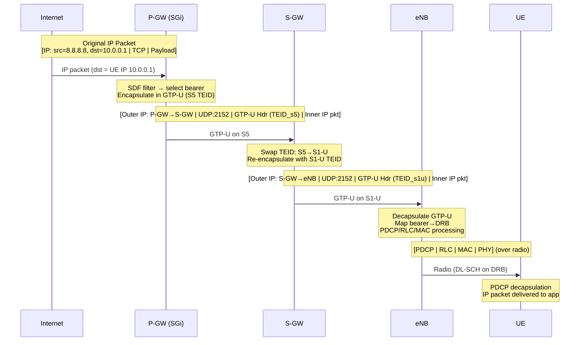
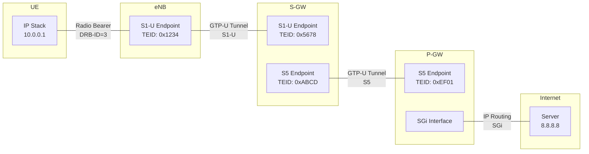
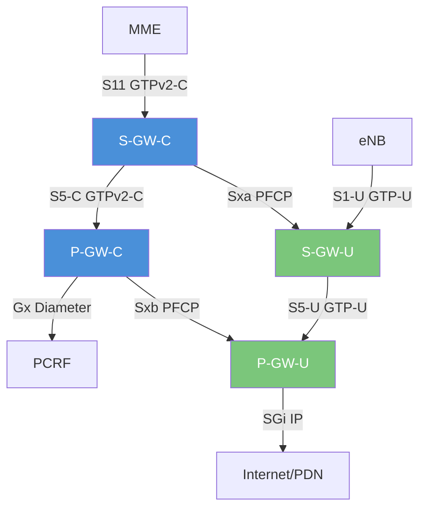

# ماژول 13: S-GW (دروازه خدمات‌دهنده) و P-GW (دروازه PDN)

## 1. چرا S-GW و P-GW جدا هستند؟

LTE به‌طور آگاهانه دروازه صفحه کاربر را به دو گره متمایز تقسیم می‌کند:

| نقش | S-GW | P-GW |
|------|------|------|
| **لنگرگذاری** | لنگر تحرک محلی (درون-LTE) | لنگر PDN/IP (بین-RAT، جهانی) |
| **دامنه** | در هر ناحیه استخر MME | در هر اتصال PDN (ممکن است نواحی MME را در بر گیرد) |
| **تحرک** | در حین تحویل بین-MME تغییر می‌کند | برای کل نشست PDN ثابت می‌ماند |
| **مکان استقرار** | نزدیک RAN (تأخیر کم) | متمرکز (سیاست، صورت‌حساب) |

**منطق طراحی:**
1. **طول عمر متفاوت**: S-GW می‌تواند در حین تحرک جابه‌جا شود؛ P-GW برای تداوم IP ثابت می‌ماند
2. **مقیاس‌پذیری مستقل**: S-GW با ترافیک محلی مقیاس می‌یابد؛ P-GW با مشترکین/سیاست‌ها
3. **آماده‌سازی CUPS**: این تقسیم، جداسازی کنترل/صفحه کاربر را ممکن می‌سازد — می‌توانید S-GW-U را در لبه توزیع کنید در حالی که S-GW-C متمرکز می‌ماند
4. **رومینگ**: در رومینگ با مسیریابی خانگی، S-GW در PLMN بازدیدشده است؛ P-GW در PLMN خانگی (واسط S8)

---

## 2. S-GW (دروازه خدمات‌دهنده)

### 2.1 ارسال صفحه کاربر

S-GW اساساً یک **سوئیچ تونل GTP-U** است:
- بسته‌های DL را از P-GW روی تونل GTP-U در S5/S8 دریافت می‌کند
- آن‌ها را به eNodeB (eNB) روی تونل GTP-U در S1-U ارسال می‌کند
- بسته‌های UL را از eNB روی S1-U دریافت و به P-GW روی S5/S8 ارسال می‌کند

هر حامل **تونل‌های GTP-U جداگانه** روی هر واسط دارد (شناسایی‌شده با TEID).

### 2.2 لنگر تحرک محلی

در حین **تحویل X2** (مستقیم eNB-به-eNB):
- S-GW تغییر **نمی‌کند**
- eNB مبدأ بسته‌های بافر‌شده/در حال عبور را از طریق X2 به eNB مقصد ارسال می‌کند
- پس از تحویل، MME یک **Modify Bearer Request** با آدرس/TEID جدید eNB به S-GW می‌فرستد
- S-GW نقطه انتهایی تونل S1-U را از eNB مبدأ به eNB مقصد تغییر می‌دهد (**تغییر مسیر**)

این کار از تخریب تونل S5 به P-GW جلوگیری می‌کند — فقط بخش S1-U تغییر می‌کند.

### 2.3 بافرینگ داده پیوند پایین‌سو

وقتی UE در **ECM-IDLE** است (هیچ تونل S1-U وجود ندارد):
1. بسته‌های DL از P-GW روی تونل S5 می‌رسند
2. S-GW نقطه انتهایی S1-U ندارد ← **بسته‌ها را بافر می‌کند**
3. S-GW یک **Downlink Data Notification** به MME می‌فرستد (از طریق S11)
4. MME صفحه‌بندی را آغاز می‌کند
5. پس از پاسخ UE (درخواست خدمات)، MME یک Modify Bearer Request با TEID جدید eNB می‌فرستد
6. S-GW بسته‌های بافر‌شده را به eNB تخلیه می‌کند

**محدودیت‌های بافر**: قابل پیکربندی در هر اپراتور؛ معمولاً 1-10 بسته در هر حامل. مازاد دور ریخته می‌شود.

### 2.4 صورت‌حساب در هر UE/هر حامل

S-GW **CDRها (رکوردهای داده صورت‌حساب)** را با موارد زیر تولید می‌کند:
- حجم UL/DL در هر حامل
- مدت
- اطلاعات QoS (QCI، ARP، GBR/MBR)
- علت بسته‌شدن رکورد (تحویل، محدودیت زمان، محدودیت حجم)

از طریق واسط Rf/Gz به **سیستم صورت‌حساب آفلاین (CDF)** فرستاده می‌شود.

### 2.5 رهگیری قانونی

S-GW می‌تواند ترافیک صفحه کاربر را برای رهگیری قانونی (LI) آینه کند:
- واسط X2 (استاندارد ETSI) به تسهیلات پایش اجرای قانون (LEMF)
- با حکم قضایی فعال می‌شود، از طریق واسط X1 از مدیریت LI فعال می‌گردد
- بسته‌ها را بدون تأثیر بر سرویس UE تکثیر می‌کند

### 2.6 واسط‌های S-GW

| واسط | همتا | پروتکل | عملکرد |
|-----------|------|----------|----------|
| **S1-U** | eNB | GTP-U (UDP) | صفحه کاربر به/از RAN |
| **S5** | P-GW (همان PLMN) | GTP-U + GTPv2-C | ارسال UP + مدیریت نشست CP |
| **S8** | P-GW (رومینگ) | GTP-U + GTPv2-C | همان S5 اما بین-PLMN |
| **S11** | MME | GTPv2-C | CP: مدیریت حامل/نشست |
| **S12** | UTRAN (3G) | GTP-U | تونل مستقیم برای هم‌کنش‌گری 3G |

---

## 3. P-GW (دروازه PDN)

### 3.1 اتصال PDN و تخصیص آدرس IP

P-GW **دروازه UE به اینترنت/PDN** است — آدرس IP را به UE تخصیص می‌دهد:

**روش‌های تخصیص IPv4:**
- **ایستا**: پیش‌پیکربندی‌شده در داده اشتراک HSS
- **پویا (DHCPv4)**: P-GW به‌عنوان کارساز DHCP عمل می‌کند یا به DHCP خارجی رله می‌کند
- **پویا (استخر داخلی)**: P-GW از استخر آدرس محلی تخصیص می‌دهد (رایج‌ترین)

**تخصیص IPv6:**
- P-GW یک پیشوند /64 از طریق **اعلام مسیریاب (SLAAC)** تخصیص می‌دهد
- UE شناسه واسط را تولید می‌کند (EUI-64 یا افزونه‌های حریم خصوصی)
- پیشوند در PCO (گزینه‌های پیکربندی پروتکل) در حین فعال‌سازی حامل تحویل می‌شود

**دو-پشته (IPv4v6):**
- هم آدرس IPv4 و هم پیشوند IPv6 به‌طور همزمان تخصیص می‌یابند
- نیازمند نوع PDN = IPv4v6 در اشتراک است

### 3.2 اجرای سیاست

P-GW سیاست‌های دریافتی از **PCRF** را از طریق **واسط Gx** اجرا می‌کند:

- **قواعد PCC (کنترل سیاست و صورت‌حساب):**
  - فیلترهای SDF (جریان داده خدمات) — تطبیق 5-گانه
  - پارامترهای QoS (QCI، GBR، MBR، ARP)
  - کلیدهای صورت‌حساب و گروه‌های نرخ‌گذاری
  - وضعیت دروازه (باز/بسته کردن جریان‌های مشخص)

- **TFT (قالب جریان ترافیک):**
  - **TFT پیوند پایین‌سو**: در P-GW — بسته‌های DL ورودی را به حامل صحیح نگاشت می‌کند
  - **TFT پیوند بالاسو**: به UE فرستاده می‌شود — UE بسته‌های UL را به حامل صحیح نگاشت می‌کند
  - فیلترهای بسته: IP مبدأ/مقصد، محدوده پورت، پروتکل، ToS/DSCP

### 3.3 صورت‌حساب

| نوع | واسط | گره | مورد استفاده |
|------|-----------|------|----------|
| **آنلاین (OCS)** | Gy (Diameter) | OCS | پیش‌پرداخت؛ کنترل اعتبار بلادرنگ |
| **آفلاین (OFCS)** | Gz (GTP') | CDF/CGF | پس‌پرداخت؛ تولید CDR |

**محرک‌های صورت‌حساب:**
- آستانه حجم (مثلاً هر 1 MB)
- آستانه زمان (مثلاً هر 60 ثانیه)
- تغییر QoS، اصلاح حامل
- مجوزدهی مجدد از OCS

### 3.4 فیلترکردن و مسیریابی بسته

- **DL**: اینترنت ← P-GW: IP مقصد را با نشست UE تطبیق می‌دهد، فیلتر SDF را برای انتخاب حامل اعمال می‌کند، در GTP-U به‌سمت S-GW کپسوله می‌کند
- **UL**: UE ← P-GW: GTP-U را واکپسوله می‌کند، NAT را اعمال می‌کند (در صورت آدرس‌دهی خصوصی)، به اینترنت مسیریابی می‌کند
- **NAT/NAPT**: P-GW اغلب NAT را برای IPv4 انجام می‌دهد (آدرس‌های خصوصی UE ← عمومی)
- **فشرده‌سازی سرآیند**: در P-GW نیست (در لایه PDCP در RAN انجام می‌شود)

### 3.5 واسط SGi

- SGi P-GW را به **PDNهای خارجی** متصل می‌کند (اینترنت، IMS، VPNهای سازمانی)
- واسط مبتنی بر IP (بدون GTP)
- معادل Gi در 3G (GGSN ← اینترنت)
- چندین PDN پشتیبانی می‌شود (هر یک با یک APN شناسایی می‌شود)
- ممکن است به موارد زیر متصل شود:
  - اینترنت (APN عمومی)
  - هسته IMS (APN مربوط به ims)
  - VPN سازمانی (APN خصوصی)
  - پلتفرم‌های محتوا/CDN

### 3.6 TFT پیوند بالاسو/پایین‌سو — نگاشت بسته‌ها به حامل‌ها

```
┌──────────────────────────────────────────────────────────────┐
│ Multiple Bearers per PDN Connection                          │
├──────────────────────────────────────────────────────────────┤
│                                                              │
│  Default Bearer (QCI 9) ← All traffic not matching any TFT  │
│  Dedicated Bearer 1 (QCI 1) ← VoLTE: src port 1234, UDP    │
│  Dedicated Bearer 2 (QCI 4) ← Video: dst port 8080, TCP    │
│                                                              │
└──────────────────────────────────────────────────────────────┘

DL (P-GW side):  Internet packet arrives → P-GW checks SDF filters
                  → matches "VoLTE" rule → maps to Dedicated Bearer 1
                  → encapsulates in GTP-U with Bearer 1's TEID

UL (UE side):    UE app sends VoIP packet → UE checks UL TFT
                  → matches Dedicated Bearer 1 filter
                  → sends on DRB mapped to Bearer 1
```


---

## 4. پروتکل GTP

### 4.1 GTP-C (صفحه کنترل GTP) — GTPv2-C

GTP-C چرخه عمر تونل/نشست را روی واسط‌های S11، S5/S8، S10، S3 مدیریت می‌کند.

**پیام‌های کلیدی:**

| پیام | جهت | هدف |
|---------|-----------|---------|
| Create Session Request/Response | MME←S-GW←P-GW | برقراری اتصال PDN + حامل پیش‌فرض |
| Modify Bearer Request/Response | MME←S-GW | به‌روزرسانی نقاط انتهایی تونل (تحویل، درخواست خدمات) |
| Delete Session Request/Response | MME←S-GW←P-GW | تخریب اتصال PDN |
| Create Bearer Request/Response | P-GW←S-GW←MME | فعال‌سازی حامل اختصاصی |
| Update Bearer Request/Response | P-GW←S-GW←MME | اصلاح QoS |
| Delete Bearer Request/Response | P-GW←S-GW←MME | غیرفعال‌سازی حامل اختصاصی |
| Downlink Data Notification | S-GW←MME | فعال‌سازی صفحه‌بندی برای UE بیکار |
| Release Access Bearers | MME←S-GW | UE بیکار می‌شود، آزادسازی S1-U |

**سرآیند GTPv2-C:**
```
 0                   1                   2                   3
 0 1 2 3 4 5 6 7 8 9 0 1 2 3 4 5 6 7 8 9 0 1 2 3 4 5 6 7 8 9 0 1
+-+-+-+-+-+-+-+-+-+-+-+-+-+-+-+-+-+-+-+-+-+-+-+-+-+-+-+-+-+-+-+-+
|Version|P|T|S=1|  Message Type |         Message Length        |
+-+-+-+-+-+-+-+-+-+-+-+-+-+-+-+-+-+-+-+-+-+-+-+-+-+-+-+-+-+-+-+-+
|              TEID (if T=1)                                    |
+-+-+-+-+-+-+-+-+-+-+-+-+-+-+-+-+-+-+-+-+-+-+-+-+-+-+-+-+-+-+-+-+
|          Sequence Number                      |    Spare      |
+-+-+-+-+-+-+-+-+-+-+-+-+-+-+-+-+-+-+-+-+-+-+-+-+-+-+-+-+-+-+-+-+
```

**TEID (شناسه نقطه انتهایی تونل):**
- شناسه 32 بیتی، یکتا به‌صورت محلی در هر گره
- هر طرف TEID خود را تخصیص می‌دهد و به همتا اطلاع می‌دهد
- چندگانه‌سازی چندین تونل روی همان IP:port را ممکن می‌سازد

### 4.2 GTP-U (صفحه کاربر GTP)

GTP-U بسته‌های IP کاربر را برای انتقال بین گره‌های EPC کپسوله می‌کند.

**سرآیند GTP-U:**
```
 0                   1                   2                   3
 0 1 2 3 4 5 6 7 8 9 0 1 2 3 4 5 6 7 8 9 0 1 2 3 4 5 6 7 8 9 0 1
+-+-+-+-+-+-+-+-+-+-+-+-+-+-+-+-+-+-+-+-+-+-+-+-+-+-+-+-+-+-+-+-+
|Version| PT| *| E| S|PN| Message Type  |       Length          |
+-+-+-+-+-+-+-+-+-+-+-+-+-+-+-+-+-+-+-+-+-+-+-+-+-+-+-+-+-+-+-+-+
|                           TEID                                |
+-+-+-+-+-+-+-+-+-+-+-+-+-+-+-+-+-+-+-+-+-+-+-+-+-+-+-+-+-+-+-+-+
|      Sequence Number (opt)    | N-PDU Number (opt)| Next Ext  |
+-+-+-+-+-+-+-+-+-+-+-+-+-+-+-+-+-+-+-+-+-+-+-+-+-+-+-+-+-+-+-+-+
```

- **نوع پیام 0xFF (255)**: T-PDU — شامل داده کاربر (رایج‌ترین)
- **انتقال**: پورت UDP 2152
- **T-PDU**: بسته IP کاربر کپسوله‌شده
- **شماره ترتیب**: اختیاری، برای بازترتیبی در حین تغییر مسیر/تحویل استفاده می‌شود

### 4.3 مقایسه GTP-C با GTP-U

| جنبه | GTP-C (GTPv2-C) | GTP-U (GTPv1-U) |
|--------|-----------------|------------------|
| **هدف** | مدیریت نشست/تونل | انتقال داده کاربر |
| **نسخه** | v2 (در LTE) | v1 (بدون تغییر از 3G) |
| **انتقال** | پورت UDP 2123 | پورت UDP 2152 |
| **قابلیت اطمینان** | درخواست/پاسخ + بازارسال | بدون ACK (به لایه‌های بالاتر تکیه می‌کند) |
| **TEID** | نشست کنترل را شناسایی می‌کند | تونل داده کاربر را شناسایی می‌کند (در هر حامل) |
| **پیام‌ها** | Create/Modify/Delete Session و غیره | T-PDU (0xFF)، Echo، Error Indication |
| **واسط‌ها** | S11، S5/S8، S10، S3 | S1-U، S5/S8 (صفحه کاربر) |
| **بار** | IE (عناصر اطلاعات) ساخت‌یافته | بسته IP خام (T-PDU) |
| **اندازه سرآیند** | 12 بایت (حداقل) | 8 بایت (حداقل)، 12 با گزینه‌ها |
| **حالت‌داری** | حالت‌دار (نشست‌ها) | بدون حالت (ارسال در هر بسته) |

---

## 5. ردیابی مسیر بسته (سرتاسری با کپسوله‌سازی)

### 5.1 پیوند پایین‌سو: اینترنت ← UE



### 5.2 سرآیندها در هر نقطه

```
┌─────────────────────────────────────────────────────────────────────────────┐
│ SEGMENT 1: Internet → P-GW (SGi interface)                                 │
│ ┌────────────┬────────┬─────────────────────────────────────┐              │
│ │ IP Header  │  TCP   │          Application Data           │              │
│ │src=8.8.8.8 │        │                                     │              │
│ │dst=10.0.0.1│        │                                     │              │
│ └────────────┴────────┴─────────────────────────────────────┘              │
├─────────────────────────────────────────────────────────────────────────────┤
│ SEGMENT 2: P-GW → S-GW (S5/S8 GTP-U tunnel)                               │
│ ┌───────────────┬──────────┬───────────────┬────────────┬────────┬────────┐│
│ │ Outer IP      │ UDP      │ GTP-U Header  │ Inner IP   │  TCP   │  Data  ││
│ │src=P-GW IP    │dst=2152  │TEID=0xABCD    │src=8.8.8.8 │        │        ││
│ │dst=S-GW IP    │          │Type=0xFF(TPDU)│dst=10.0.0.1│        │        ││
│ └───────────────┴──────────┴───────────────┴────────────┴────────┴────────┘│
├─────────────────────────────────────────────────────────────────────────────┤
│ SEGMENT 3: S-GW → eNB (S1-U GTP-U tunnel)                                  │
│ ┌───────────────┬──────────┬───────────────┬────────────┬────────┬────────┐│
│ │ Outer IP      │ UDP      │ GTP-U Header  │ Inner IP   │  TCP   │  Data  ││
│ │src=S-GW IP    │dst=2152  │TEID=0x1234    │src=8.8.8.8 │        │        ││
│ │dst=eNB IP     │          │Type=0xFF(TPDU)│dst=10.0.0.1│        │        ││
│ └───────────────┴──────────┴───────────────┴────────────┴────────┴────────┘│
├─────────────────────────────────────────────────────────────────────────────┤
│ SEGMENT 4: eNB → UE (Radio / Air Interface)                                 │
│ ┌──────┬──────┬──────┬────────────┬────────┬──────────────────────────────┐│
│ │ PHY  │ MAC  │ RLC  │   PDCP     │ Inner IP Packet                      ││
│ │      │      │      │(ciphered)  │ (original IP pkt delivered to UE)    ││
│ └──────┴──────┴──────┴────────────┴────────┴──────────────────────────────┘│
└─────────────────────────────────────────────────────────────────────────────┘
```

### 5.3 نمودار ساختار تونل GTP



**یادداشت:** هر بخش تونل GTP-U **دو TEID** دارد — یکی برای هر جهت:
- UL در S1-U: eNB←S-GW از TEID مربوط به S-GW استفاده می‌کند (0x5678)
- DL در S1-U: S-GW←eNB از TEID مربوط به eNB استفاده می‌کند (0x1234)


---

## 6. CUPS: جداسازی صفحه کنترل و صفحه کاربر

### 6.1 مفهوم (نسخه 14+ گروه 3GPP)

CUPS هر یک از S-GW و P-GW را به مؤلفه‌های صفحه کنترل و صفحه کاربر تقسیم می‌کند:

```
Traditional:                          CUPS:
┌─────────┐                          ┌─────────────┐
│  S-GW   │ (CP+UP combined)         │   S-GW-C    │ ← Control plane (GTPv2-C)
│         │                           └──────┬──────┘
└─────────┘                                  │ Sxa (PFCP)
                                       ┌─────┴──────┐
                                       │   S-GW-U    │ ← User plane (GTP-U forwarding)
                                       └─────────────┘

┌─────────┐                          ┌─────────────┐
│  P-GW   │ (CP+UP combined)         │   P-GW-C    │ ← Control plane (Gx, GTPv2-C)
│         │                           └──────┬──────┘
└─────────┘                                  │ Sxb (PFCP)
                                       ┌─────┴──────┐
                                       │   P-GW-U    │ ← User plane (GTP-U, policy enforcement)
                                       └─────────────┘
```

### 6.2 واسط Sx و پروتکل PFCP

**PFCP (پروتکل کنترل ارسال بسته)** — 3GPP TS 29.244:
- بین مؤلفه‌های CP و UP اجرا می‌شود (Sxa برای S-GW، Sxb برای P-GW، Sxc برای TDF)
- **برقراری نشست**: CP به UP می‌گوید قواعد ارسال را ایجاد کند
- **اصلاح نشست**: CP قواعد را به‌روزرسانی می‌کند (مثلاً TEID جدید پس از تحویل)
- **حذف نشست**: CP به UP دستور می‌دهد وضعیت ارسال را حذف کند

**مفاهیم کلیدی PFCP:**
| عنصر | هدف |
|---------|---------|
| PDR (قاعده تشخیص بسته) | معیارهای تطبیق (TEID، IP، پورت) |
| FAR (قاعده اقدام ارسال) | چه کاری انجام شود (ارسال، بافر، دور ریختن) |
| QER (قاعده اجرای QoS) | محدودسازی نرخ (GBR/MBR) |
| URR (قاعده گزارش‌دهی مصرف) | اندازه‌گیری حجم/زمان برای صورت‌حساب |
| BAR (قاعده اقدام بافرینگ) | رفتار بافرینگ برای UE بیکار |

### 6.3 مزایای CUPS

1. **صفحه کاربر توزیع‌شده**: استقرار S-GW-U / P-GW-U در لبه (تأخیر کم برای MEC)
2. **کنترل متمرکز**: نگه‌داشتن S-GW-C / P-GW-C در DC مرکزی (مدیریت ساده‌تر)
3. **مقیاس‌پذیری مستقل**: مقیاس‌دهی UP با حجم ترافیک، CP با بار سیگنالینگ
4. **استقرار انعطاف‌پذیر**: چندین نمونه UP در هر CP، یا برعکس
5. **آمادگی 5G**: معماری CUPS مستقیماً به تقسیم SMF (CP) + UPF (UP) در 5G نگاشت می‌شود

### 6.4 نمودار معماری CUPS



**آبی = صفحه کنترل** | **سبز = صفحه کاربر**

---

## 7. تحول: S-GW + P-GW ← UPF (5G)

### 7.1 چرا در UPF ادغام شدند؟

در 5G، توابع صفحه کاربر S-GW و P-GW در **یک UPF واحد (تابع صفحه کاربر) ادغام می‌شوند**:

| جنبه | LTE (S-GW + P-GW) | 5G (UPF) |
|--------|-------------------|-----------|
| گره‌ها | 2 جداگانه (S-GW، P-GW) | 1 یکپارچه (UPF) |
| گام‌های GTP | 2 (S1-U + S5) | 1 (فقط N3، یا N3+N9 برای زنجیره‌سازی) |
| کنترل | S-GW-C + P-GW-C | SMF (CP واحد برای UP) |
| پروتکل CP-UP | Sxa/Sxb PFCP | N4 PFCP (همان پروتکل، تکامل‌یافته) |
| استقرار | معمولاً متمرکز | توزیع‌شده (UPF لبه، UPF لنگر) |
| لنگر تحرک | P-GW ثابت | انعطاف‌پذیر (حالت‌های SSC 1/2/3) |
| شبکه‌بندی | N/A | UPF در هر برش |

### 7.2 چرا ادغام منطقی است

1. **حذف یک گام GTP-U**: S1-U + S5 ← فقط N3 (+ N9 اختیاری بین UPFها)
   - تأخیر کمتر، عملیات کپسوله/واکپسوله کمتر
2. **ارسال ساده‌شده**: یک گره هم تحرک محلی و هم لنگرگذاری PDN را انجام می‌دهد
3. **استقرار در لبه**: UPF نزدیک کاربر برای MEC/URLLC قرار می‌گیرد — نیازی به S-GW-U جداگانه در لبه نیست
4. **لنگرگذاری انعطاف‌پذیر (حالت‌های SSC)**:
   - SSC 1: UPF ثابت (مانند P-GW در LTE) — تداوم IP
   - SSC 2: UPF می‌تواند تغییر کند — آدرس IP جدید (برای نشست‌های غیرماندگار)
   - SSC 3: چند-میزبانی — UPF قدیمی + جدید به‌طور همزمان در حین انتقال فعال
5. **زنجیره‌سازی UPF**: چندین UPF به‌صورت سری (I-UPF به‌عنوان واسط، PSA-UPF به‌عنوان لنگر) زنجیره S-GW←P-GW را با توپولوژی انعطاف‌پذیرتر جایگزین می‌کند

### 7.3 نگاشت واسط‌ها

```
LTE                          5G
─────────────────────────────────────────
S1-U (eNB↔S-GW)      →     N3 (gNB↔UPF)
S5/S8 (S-GW↔P-GW)    →     N9 (UPF↔UPF, if chained)
SGi (P-GW↔Internet)  →     N6 (UPF↔DN)
S11 (MME↔S-GW)       →     N4 (SMF↔UPF) [PFCP]
Gx (PCRF↔P-GW)       →     N7 (PCF↔SMF) [SBI]
```

---

## خلاصه

| عملکرد | S-GW | P-GW |
|----------|------|------|
| ارسال صفحه کاربر | ✅ | ✅ |
| پایان‌دهی GTP-U | S1-U + S5 | S5 + SGi |
| تخصیص آدرس IP | ❌ | ✅ |
| اجرای سیاست (PCC) | ❌ | ✅ |
| صورت‌حساب (آنلاین) | ❌ | ✅ (Gy) |
| صورت‌حساب (آفلاین) | ✅ (CDRها) | ✅ (Gz) |
| بافرینگ DL + محرک صفحه‌بندی | ✅ | ❌ |
| لنگر تحرک محلی | ✅ | ❌ |
| لنگر PDN/IP | ❌ | ✅ |
| رهگیری قانونی | ✅ | ✅ |
| NAT | ❌ | ✅ |
| اجرای TFT/SDF | ❌ | ✅ |
