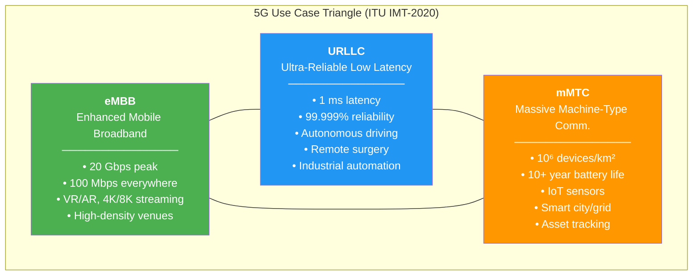
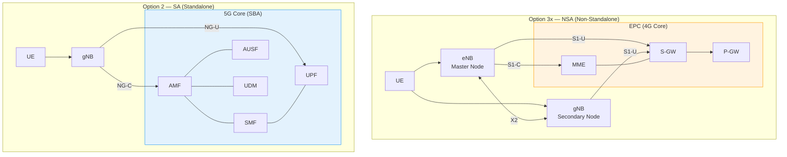
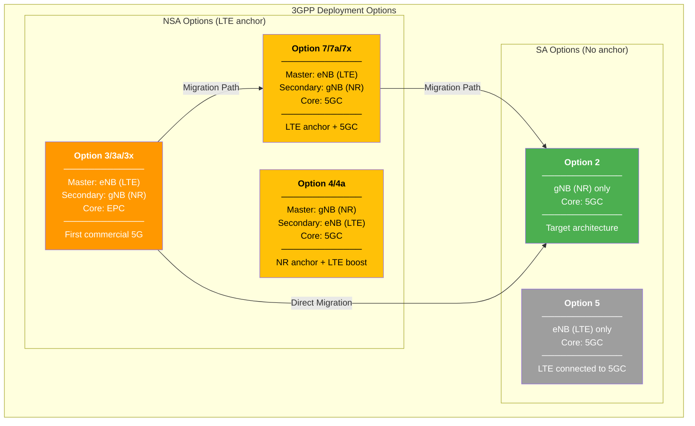
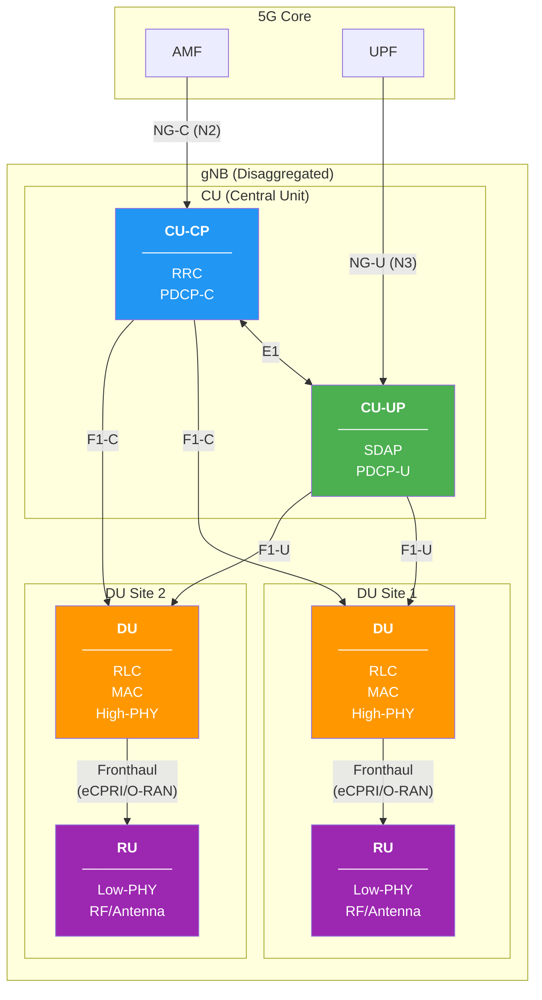

# Module 14: 5G Networks Introduction

## Advanced Communication Networks Course

---

## 1. Why 5G? — Limitations of LTE/4G

Despite the success of LTE (4G), several fundamental limitations drove the need for a new generation:

### 1.1 Latency Floor (~10 ms)

- LTE's Transmission Time Interval (TTI) is fixed at **1 ms** subframe
- With scheduling, HARQ, and processing delays, the practical **round-trip latency floor is ~10 ms**
- This is insufficient for:
  - Autonomous vehicle control (requires < 5 ms)
  - Remote surgery / haptic feedback (requires ~1 ms)
  - Industrial real-time control loops

### 1.2 Capacity Ceiling

- LTE peak: ~1 Gbps (Cat-16, 3CA, 4×4 MIMO, 256-QAM) — theoretical
- Practical throughput: 100–300 Mbps in ideal conditions
- Spectrum below 6 GHz is congested; limited bandwidth per carrier (20 MHz max)
- 4×4 MIMO is the practical antenna limit in LTE form factors

### 1.3 IoT Scale

- LTE was designed for **human-centric** broadband communication
- LTE-M / NB-IoT added IoT support, but:
  - Connection density limited to ~10⁴ devices/km²
  - Not natively designed for **10⁶ devices/km²** required for smart city/industrial IoT
  - Signaling overhead per device is too high for massive deployments

### 1.4 Summary of LTE Limitations

| Parameter | LTE Capability | 5G Target |
|-----------|---------------|-----------|
| Peak data rate (DL) | ~1 Gbps | 20 Gbps |
| User-plane latency | ~10 ms | 1 ms |
| Connection density | ~10⁴/km² | 10⁶/km² |
| Spectral efficiency | 30 bps/Hz | 90 bps/Hz |
| Mobility | 350 km/h | 500 km/h |

---

## 2. 5G Requirements — ITU IMT-2020 Targets

The International Telecommunication Union (ITU) defined **IMT-2020** as the framework for 5G with the following key performance indicators (KPIs):

### 2.1 Peak Data Rate

- **Downlink**: 20 Gbps
- **Uplink**: 10 Gbps
- Achieved through wider bandwidth (up to 400 MHz per carrier) + higher-order MIMO + 256-QAM

### 2.2 Latency

- **User-plane latency**: **1 ms** (URLLC scenario)
- **Control-plane latency**: 20 ms (idle to connected)
- Enables real-time control applications previously impossible on cellular

### 2.3 Connection Density

- **10⁶ devices per km²** (mMTC scenario)
- 100× improvement over LTE
- Support for sensors, actuators, meters with minimal overhead

### 2.4 User-Experienced Data Rate

- **100 Mbps** available everywhere (cell edge, dense urban)
- **50 Mbps UL** everywhere
- Represents the "guaranteed minimum" user experience

### 2.5 Reliability

- **99.999%** (five nines) for URLLC
- Packet delivery within latency budget with 10⁻⁵ error probability
- Critical for safety-of-life applications

### 2.6 Additional IMT-2020 Targets

| KPI | Target |
|-----|--------|
| Area traffic capacity | 10 Mbps/m² |
| Network energy efficiency | 100× improvement |
| Spectrum efficiency | 3× over IMT-Advanced |
| Mobility | 500 km/h |

---

## 3. Three Pillars — 5G Use Cases

5G is defined by three fundamental service categories (use-case pillars):

### 5G Use Case Triangle



### 3.1 eMBB — Enhanced Mobile Broadband

**Focus**: High data rates, capacity, coverage

| Characteristic | Details |
|---------------|---------|
| Peak rate | 20 Gbps DL / 10 Gbps UL |
| User experience | 100 Mbps everywhere |
| Key tech | Massive MIMO, mmWave, CA |

**Applications**:
- Virtual Reality (VR) / Augmented Reality (AR) — requires >100 Mbps, <20 ms
- 4K/8K video streaming
- High-density event venues (stadiums: 100k+ users)
- Fixed Wireless Access (FWA) as fiber replacement

### 3.2 URLLC — Ultra-Reliable Low Latency Communications

**Focus**: Deterministic latency, extreme reliability

| Characteristic | Details |
|---------------|---------|
| Latency | 1 ms (user plane, one way) |
| Reliability | 99.999% (10⁻⁵ BLER) |
| Key tech | Mini-slots, pre-emption, redundancy |

**Applications**:
- **Autonomous driving**: V2X communication, cooperative perception
- **Remote surgery**: Haptic feedback over cellular
- **Industry 4.0**: Real-time robotic control, motion control
- **Smart grid**: Protection and fault isolation

### 3.3 mMTC — Massive Machine-Type Communications

**Focus**: Scalability, energy efficiency, low cost

| Characteristic | Details |
|---------------|---------|
| Density | 10⁶ devices/km² |
| Battery life | 10–15 years on coin cell |
| Key tech | Grant-free access, NOMA, deep coverage |

**Applications**:
- IoT sensor networks (environmental, agricultural)
- Smart city infrastructure (parking, waste, lighting)
- Smart metering (electricity, water, gas)
- Asset tracking and logistics
- Wearables

---

## 4. 5G NR (New Radio) — Physical Layer

5G NR is the radio access technology defined in 3GPP Release 15+, designed from the ground up for flexibility.

### 4.1 Flexible Numerology

Unlike LTE (fixed 15 kHz SCS, 1 ms TTI), NR supports **multiple subcarrier spacings (SCS)**:

| Numerology (μ) | SCS (kHz) | Slot Duration | CP Type | Typical Use |
|:-:|:-:|:-:|:-:|:--|
| 0 | 15 | 1 ms | Normal | FR1, eMBB (low freq) |
| 1 | 30 | 0.5 ms | Normal | FR1, typical deployment |
| 2 | 60 | 0.25 ms | Normal/Extended | FR1/FR2, URLLC |
| 3 | 120 | 0.125 ms | Normal | FR2 (mmWave) |
| 4 | 240 | 62.5 μs | Normal | FR2 (SSB only) |

**Key relationships**:
- Slot duration = 1 ms / 2^μ
- Symbols per slot = 14 (normal CP) or 12 (extended CP)
- Higher SCS → shorter slot → lower latency (but wider subcarrier → more phase noise tolerance needed for mmWave)

### 4.2 Frequency Ranges

| Range | Band | Frequencies | Max BW/carrier | Typical SCS |
|:---:|:---:|:---:|:---:|:---:|
| **FR1** | Sub-7 GHz | 410 MHz – 7.125 GHz | 100 MHz | 15/30/60 kHz |
| **FR2** | mmWave | 24.25 – 52.6 GHz | 400 MHz | 60/120/240 kHz |

- **FR1** provides coverage and capacity (n77, n78 = C-band 3.3–4.2 GHz)
- **FR2** provides extreme capacity in short range (n257 = 28 GHz, n258 = 26 GHz, n260 = 39 GHz, n261 = 28 GHz)
- 3GPP Rel-17 introduced **FR2-2**: 52.6–71 GHz

### 4.3 Bandwidth Parts (BWP)

- A **Bandwidth Part** is a contiguous subset of the carrier bandwidth
- UE can be configured with up to **4 BWPs per serving cell** (1 active at a time)
- Allows UE power saving: narrow BWP for monitoring, wide BWP for data
- Each BWP can have its own numerology (SCS, CP)

### 4.4 Mini-Slots

- Standard NR slot = 14 symbols
- **Mini-slot** = 2, 4, or 7 OFDM symbols
- Enables sub-slot scheduling for **URLLC** without waiting for slot boundary
- Can **pre-empt** ongoing eMBB transmissions for urgent URLLC traffic

### 4.5 Massive MIMO and Beamforming

| Feature | LTE | 5G NR |
|---------|-----|-------|
| Max antenna ports | 16 (Rel-13 FD-MIMO) | 256+ |
| Beamforming | Fixed / semi-static | Dynamic, per-slot beam management |
| Beam management | N/A | SSB beams, CSI-RS, beam tracking |
| Panel architecture | Single panel | Multi-panel (FR2) |

**5G NR beam management procedures**:
1. **P1**: Initial beam acquisition (SSB sweep)
2. **P2**: gNB Tx beam refinement (CSI-RS)
3. **P3**: UE Rx beam refinement
4. **Beam failure recovery**: Detect failure → select new candidate → RACH-based recovery

### 4.6 Key Differences from LTE PHY

| Aspect | LTE | 5G NR |
|--------|-----|-------|
| Subcarrier spacing | Fixed 15 kHz | 15/30/60/120/240 kHz |
| Max bandwidth | 20 MHz | 100 MHz (FR1) / 400 MHz (FR2) |
| Waveform DL | OFDMA | CP-OFDMA |
| Waveform UL | SC-FDMA | CP-OFDMA (+ DFT-s-OFDMA) |
| Reference signals | CRS always-on | No CRS; on-demand DMRS/CSI-RS |
| HARQ timing | Fixed (8 ms RTT) | Flexible, configurable |
| Scheduling | Slot-based only | Slot + mini-slot |
| Duplex | FDD or TDD (fixed) | Dynamic TDD, self-contained slot |
| Control channel | PDCCH in first 1-3 symbols | CORESET (flexible in time/freq) |
| DC subcarrier | Yes (LTE center) | No DC subcarrier |

---

## 5. 5G NSA vs SA — Deployment Strategies

### 5.1 Non-Standalone (NSA) — Option 3/3a/3x

**Architecture**: NR radio (gNB) + **LTE core (EPC)**

- The LTE eNB acts as the **master node** (anchor)
- NR gNB is the **secondary node** (adds capacity)
- Control plane goes through LTE (eNB → EPC)
- User plane can be split or switched

**Sub-options**:
- **Option 3**: User plane through eNB (split at eNB)
- **Option 3a**: User plane directly from gNB to EPC
- **Option 3x**: User plane split at gNB (gNB handles NR data + some LTE data)

### 5.2 Standalone (SA) — Option 2

**Architecture**: NR radio (gNB) + **5G Core (5GC)**

- gNB connects directly to 5G Core via **NG interface**
- Full 5G functionality available
- No dependency on LTE infrastructure

### 5.3 Why NSA Was Deployed First

1. **Faster time-to-market**: Reuse existing EPC infrastructure
2. **Lower CAPEX**: No need to deploy 5G Core immediately
3. **Coverage anchor**: LTE provides ubiquitous coverage; NR adds throughput
4. **Proven core**: EPC is mature, well-understood
5. **Spectrum strategy**: Early NR deployments in limited bands

### 5.4 Why SA Is the Target

1. **Network Slicing**: Requires 5G Core SBA
2. **URLLC**: End-to-end low latency needs 5GC + MEC
3. **mMTC**: Native 5GC support for IoT optimizations
4. **Edge Computing**: UPF placement flexibility
5. **Independence**: No LTE dependency, cleaner architecture
6. **Service-Based Architecture**: Enables rapid service creation

### 5.5 NSA vs SA Architecture Comparison



### 5.6 Deployment Options Overview



**Migration path**: Most operators follow **Option 3 → Option 7 → Option 2** or directly **Option 3 → Option 2**.

---

## 6. 5G Architecture Overview

### 6.1 NG-RAN (Next Generation Radio Access Network)

| Node | Full Name | Description |
|------|-----------|-------------|
| **gNB** | Next Generation Node B | 5G NR base station (SA) |
| **en-gNB** | E-UTRA-NR gNB | NR node in NSA (secondary to eNB) |
| **ng-eNB** | Next Generation eNB | LTE node connected to 5GC |

**Interfaces**:
- **Xn**: Between gNBs (and ng-eNBs) — handover, dual connectivity
- **NG**: Between gNB and 5G Core (NG-C to AMF, NG-U to UPF)
- **F1**: Internal gNB split (CU ↔ DU)
- **E1**: CU-CP ↔ CU-UP

### 6.2 5G Core — Service-Based Architecture (SBA)

The 5G Core replaces the monolithic EPC with **microservices**:

| Network Function | Role |
|-----------------|------|
| **AMF** (Access & Mobility Mgmt) | Registration, connection, mobility, NAS security |
| **SMF** (Session Management) | PDU session establishment, QoS, UPF selection |
| **UPF** (User Plane Function) | Packet routing, inspection, QoS enforcement |
| **AUSF** (Authentication Server) | Authentication procedures |
| **UDM** (Unified Data Mgmt) | Subscription data, similar to HSS |
| **PCF** (Policy Control) | Policy rules, replaces PCRF |
| **NSSF** (Network Slice Selection) | Slice selection and management |
| **NEF** (Network Exposure) | API exposure to external applications |
| **NRF** (NF Repository) | Service discovery and registration |

**Key SBA principles**:
- NFs communicate via **HTTP/2 REST APIs** (service-based interfaces)
- **Stateless** design: compute and storage separated
- **Cloud-native**: containerized, horizontally scalable
- **Service discovery**: NRF enables dynamic NF registration

### 6.3 Separation of Radio Technology from Network Architecture

A critical 5G design principle:

```
Radio Access Technology (RAT)  ≠  Core Network Architecture
```

- LTE radio can connect to 5G Core (ng-eNB → Option 5/7)
- NR radio can connect to EPC (en-gNB → Option 3)
- **Decoupling** enables flexible migration and coexistence

---

## 7. gNB Architecture — CU/DU Split

### 7.1 Functional Split

The gNB can be decomposed into:

| Component | Function | Location |
|-----------|----------|----------|
| **CU** (Central Unit) | RRC, SDAP, PDCP | Centralized (edge DC) |
| **DU** (Distributed Unit) | RLC, MAC, High-PHY | Near antenna site |
| **RU** (Radio Unit) | Low-PHY, RF | At antenna |

### 7.2 CU-CP / CU-UP Split

The CU is further split:
- **CU-CP** (Control Plane): RRC + control part of PDCP
- **CU-UP** (User Plane): SDAP + user part of PDCP

This enables:
- Independent scaling of control and user plane
- Multiple CU-UPs per CU-CP
- Flexible placement (CU-UP closer to edge for low latency)

### 7.3 gNB CU/DU Split Architecture



### 7.4 Interface Summary

| Interface | Endpoints | Protocol | Purpose |
|-----------|-----------|----------|---------|
| **NG-C (N2)** | gNB ↔ AMF | NGAP/SCTP | Control plane signaling |
| **NG-U (N3)** | gNB ↔ UPF | GTP-U/UDP | User data transport |
| **Xn-C** | gNB ↔ gNB | XnAP/SCTP | Handover, dual connectivity |
| **Xn-U** | gNB ↔ gNB | GTP-U/UDP | Data forwarding during HO |
| **F1-C** | CU-CP ↔ DU | F1AP/SCTP | RRC message transport, UE context |
| **F1-U** | CU-UP ↔ DU | GTP-U/UDP | User data between CU-UP and DU |
| **E1** | CU-CP ↔ CU-UP | E1AP/SCTP | Bearer context management |

### 7.5 Deployment Scenarios

| Scenario | CU Location | DU Location | Fronthaul | Use Case |
|----------|-------------|-------------|-----------|----------|
| **Co-located** | Cell site | Cell site | Internal | Rural, simple |
| **Centralized CU** | Edge DC | Cell site | Midhaul (F1) | Urban, pooling |
| **Full disaggregation** | Regional DC | Aggregation | Mid + Fronthaul | Cloud RAN, O-RAN |

---

## 8. Timeline — 3GPP Releases

### 8.1 Release Overview

| Release | Freeze Date | Key Features |
|---------|------------|--------------|
| **Rel-15** | 2018 (Late Drop: 2019) | First 5G NR specification; NSA & SA; eMBB focus |
| **Rel-16** | 2020 (Q3) | URLLC enhancements; V2X; NR-U (unlicensed); IIoT; NR positioning |
| **Rel-17** | 2022 (Q1) | FR2-2 (52-71 GHz); RedCap (reduced capability); NTN (satellite); NR sidelink; MBS |
| **Rel-18** | 2024 (Q1) | 5G-Advanced; AI/ML for air interface; XR optimization; duplex evolution; network energy saving |

### 8.2 Evolution Path

```
Rel-15 (2018)     Rel-16 (2020)     Rel-17 (2022)     Rel-18 (2024)
    │                  │                  │                  │
    │ "First 5G"       │ "5G Phase 2"    │ "5G Expansion"   │ "5G-Advanced"
    │                  │                  │                  │
    ├─ NSA/SA          ├─ URLLC enh.     ├─ RedCap          ├─ AI/ML for NR
    ├─ eMBB            ├─ V2X (NR)       ├─ NTN (satellite) ├─ XR support
    ├─ Basic NR PHY    ├─ NR-U           ├─ FR2-2           ├─ Duplex evolution
    ├─ 5GC SBA         ├─ IIoT           ├─ MBS             ├─ Energy saving
    └─ Network slicing ├─ Positioning    ├─ Sidelink enh.   └─ MIMO evolution
                       └─ IAB            └─ Coverage enh.
```

### 8.3 Key Milestones

- **Dec 2017**: Rel-15 NSA (Option 3) specification completed (early drop)
- **Jun 2018**: Rel-15 SA (Option 2) specification completed
- **Apr 2019**: First commercial 5G NSA networks launched (South Korea, US)
- **2020**: First 5G SA commercial deployments (T-Mobile US, China operators)
- **2022**: Rel-17 freeze; RedCap enables mid-tier IoT on NR
- **2024**: Rel-18 (5G-Advanced) freeze; bridge to 6G research

---

## Summary — Key Takeaways

1. **5G addresses three fundamental LTE limitations**: latency, capacity, and IoT scale
2. **IMT-2020 targets** define quantitative goals: 20 Gbps, 1 ms, 10⁶ devices/km²
3. **Three pillars** (eMBB/URLLC/mMTC) serve different verticals with different KPIs
4. **5G NR** introduces flexible numerology, mmWave support, and dynamic beamforming
5. **NSA enables quick deployment** by reusing LTE/EPC; **SA unlocks full 5G** potential
6. **SBA-based 5G Core** is cloud-native, microservice-based, enabling slicing and edge
7. **gNB disaggregation** (CU/DU/RU) enables flexible, scalable deployments
8. **3GPP releases** progressively add features: 15→basic, 16→URLLC, 17→expansion, 18→5G-Advanced

---

## References

- 3GPP TS 38.300: NR and NG-RAN Overall Description
- 3GPP TS 38.401: NG-RAN Architecture Description
- 3GPP TS 23.501: System Architecture for 5G System
- ITU-R M.2083: IMT Vision — Framework and Overall Objectives of the Future Development of IMT for 2020 and Beyond
- 3GPP TS 38.211: NR Physical Channels and Modulation
- 3GPP TS 38.104: NR Base Station Radio Transmission and Reception

---

*Module 14 — Advanced Communication Networks Course*  
*Last updated: August 2026*
