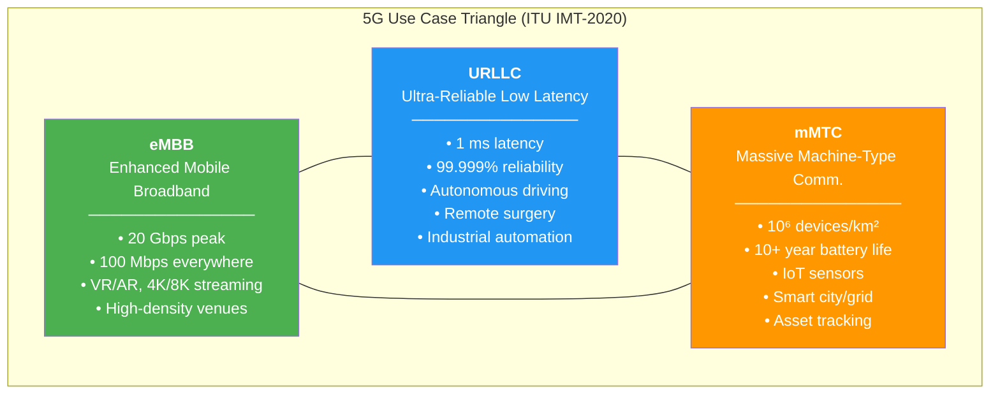
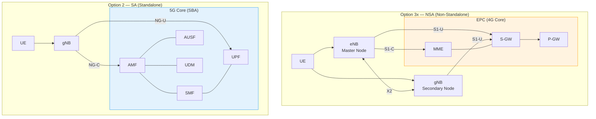
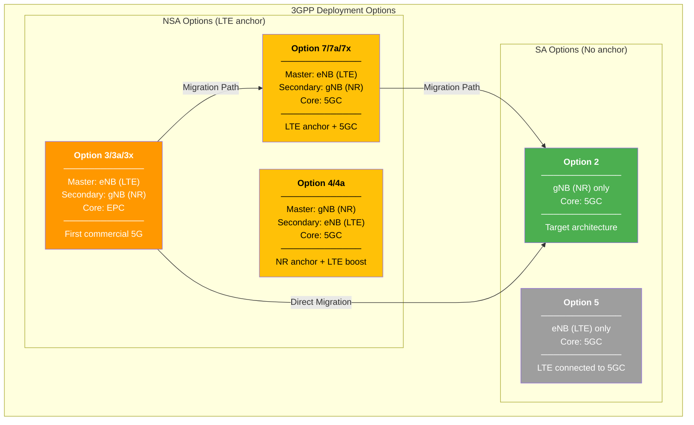
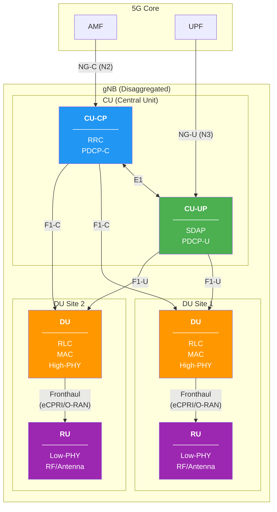

# ماژول 14: مقدمه‌ای بر شبکه‌های 5G

## درس شبکه‌های ارتباطی پیشرفته

---

## 1. چرا 5G؟ — محدودیت‌های LTE/4G

با وجود موفقیت LTE (4G)، چند محدودیت بنیادی نیاز به یک نسل جدید را ایجاب کرد:

### 1.1 کف تأخیر (حدود 10 ms)

- فاصله زمانی انتقال (TTI) در LTE به‌صورت ثابت **1 ms** زیرفریم است
- با تأخیرهای زمان‌بندی، HARQ و پردازش، **کف تأخیر رفت-و-برگشت عملی حدود 10 ms** است
- این برای موارد زیر کافی نیست:
  - کنترل خودروی خودران (نیازمند کمتر از 5 ms)
  - جراحی از راه دور / بازخورد لمسی (نیازمند حدود 1 ms)
  - حلقه‌های کنترل بلادرنگ صنعتی

### 1.2 سقف ظرفیت

- اوج LTE: حدود 1 Gbps (Cat-16، 3CA، MIMO 4×4، 256-QAM) — نظری
- توان عملیاتی عملی: 100–300 Mbps در شرایط ایده‌آل
- طیف زیر 6 GHz اشباع است؛ پهنای باند محدود در هر حامل (حداکثر 20 MHz)
- MIMO 4×4 حد عملی آنتن در قالب‌های LTE است

### 1.3 مقیاس IoT

- LTE برای ارتباط پهن‌باند **انسان‌محور** طراحی شده بود
- LTE-M / NB-IoT پشتیبانی IoT را اضافه کردند، اما:
  - چگالی اتصال به حدود 10⁴ دستگاه/km² محدود است
  - به‌طور بومی برای **10⁶ دستگاه/km²** مورد نیاز شهر هوشمند/IoT صنعتی طراحی نشده است
  - سربار سیگنالینگ در هر دستگاه برای استقرارهای انبوه بیش از حد بالاست

### 1.4 خلاصه محدودیت‌های LTE

| پارامتر | قابلیت LTE | هدف 5G |
|-----------|---------------|-----------|
| حداکثر نرخ داده (DL) | حدود 1 Gbps | 20 Gbps |
| تأخیر صفحه کاربر | حدود 10 ms | 1 ms |
| چگالی اتصال | حدود 10⁴/km² | 10⁶/km² |
| کارایی طیفی | 30 bps/Hz | 90 bps/Hz |
| تحرک | 350 km/h | 500 km/h |

---

## 2. نیازمندی‌های 5G — اهداف IMT-2020 اتحادیه مخابرات بین‌المللی

اتحادیه مخابرات بین‌المللی (ITU) **IMT-2020** را به‌عنوان چارچوب 5G با شاخص‌های کلیدی عملکرد (KPI) زیر تعریف کرد:

### 2.1 حداکثر نرخ داده

- **پیوند پایین‌سو**: 20 Gbps
- **پیوند بالاسو**: 10 Gbps
- از طریق پهنای باند بیشتر (تا 400 MHz در هر حامل) + MIMO مرتبه بالاتر + 256-QAM به دست می‌آید

### 2.2 تأخیر

- **تأخیر صفحه کاربر**: **1 ms** (سناریوی URLLC)
- **تأخیر صفحه کنترل**: 20 ms (بیکار تا متصل)
- کاربردهای کنترل بلادرنگ را که قبلاً روی شبکه سلولی غیرممکن بود ممکن می‌سازد

### 2.3 چگالی اتصال

- **10⁶ دستگاه در هر km²** (سناریوی mMTC)
- بهبود 100 برابری نسبت به LTE
- پشتیبانی از حسگرها، محرک‌ها، کنتورها با حداقل سربار

### 2.4 نرخ داده تجربه‌شده توسط کاربر

- **100 Mbps** در همه‌جا در دسترس (لبه سلول، شهری متراکم)
- **50 Mbps در UL** در همه‌جا
- نمایانگر «حداقل تضمین‌شده» تجربه کاربر است

### 2.5 قابلیت اطمینان

- **99.999%** (پنج نه) برای URLLC
- تحویل بسته درون بودجه تأخیر با احتمال خطای 10⁻⁵
- حیاتی برای کاربردهای مرتبط با ایمنی جان

### 2.6 اهداف اضافی IMT-2020

| KPI | هدف |
|-----|--------|
| ظرفیت ترافیک ناحیه‌ای | 10 Mbps/m² |
| کارایی انرژی شبکه | بهبود 100 برابری |
| کارایی طیفی | 3 برابر نسبت به IMT-Advanced |
| تحرک | 500 km/h |

---

## 3. سه ستون — موارد استفاده 5G

5G با سه دسته خدمات بنیادی (ستون‌های موارد استفاده) تعریف می‌شود:

### مثلث موارد استفاده 5G



### 3.1 eMBB — پهن‌باند موبایل بهبودیافته

**تمرکز**: نرخ داده بالا، ظرفیت، پوشش

| ویژگی | جزئیات |
|---------------|---------|
| نرخ اوج | 20 Gbps DL / 10 Gbps UL |
| تجربه کاربر | 100 Mbps در همه‌جا |
| فناوری کلیدی | Massive MIMO، mmWave، CA |

**کاربردها**:
- واقعیت مجازی (VR) / واقعیت افزوده (AR) — نیازمند بیش از 100 Mbps، کمتر از 20 ms
- پخش جریانی ویدیوی 4K/8K
- مکان‌های رویداد با تراکم بالا (استادیوم‌ها: بیش از 100 هزار کاربر)
- دسترسی بی‌سیم ثابت (FWA) به‌عنوان جانشین فیبر

### 3.2 URLLC — ارتباطات فوق‌قابل اعتماد کم-تأخیر

**تمرکز**: تأخیر قطعی، قابلیت اطمینان شدید

| ویژگی | جزئیات |
|---------------|---------|
| تأخیر | 1 ms (صفحه کاربر، یک‌طرفه) |
| قابلیت اطمینان | 99.999% (10⁻⁵ BLER) |
| فناوری کلیدی | مینی-اسلات، پیش‌گیری، افزونگی |

**کاربردها**:
- **رانندگی خودران**: ارتباط V2X، ادراک مشارکتی
- **جراحی از راه دور**: بازخورد لمسی روی شبکه سلولی
- **صنعت 4.0**: کنترل رباتیک بلادرنگ، کنترل حرکت
- **شبکه هوشمند**: حفاظت و جداسازی خطا

### 3.3 mMTC — ارتباطات انبوه ماشین-به-ماشین

**تمرکز**: مقیاس‌پذیری، کارایی انرژی، هزینه پایین

| ویژگی | جزئیات |
|---------------|---------|
| چگالی | 10⁶ دستگاه/km² |
| عمر باتری | 10–15 سال روی باتری سکه‌ای |
| فناوری کلیدی | دسترسی بدون-اعطا، NOMA، پوشش عمیق |

**کاربردها**:
- شبکه‌های حسگر IoT (محیطی، کشاورزی)
- زیرساخت شهر هوشمند (پارکینگ، پسماند، روشنایی)
- کنتورخوانی هوشمند (برق، آب، گاز)
- ردیابی دارایی و لجستیک
- دستگاه‌های پوشیدنی

---

## 4. 5G NR (رادیو جدید) — لایه فیزیکی

5G NR فناوری دسترسی رادیویی تعریف‌شده در نسخه 15+ گروه 3GPP است که از پایه برای انعطاف‌پذیری طراحی شده است.

### 4.1 عددشناسی انعطاف‌پذیر

برخلاف LTE (SCS ثابت 15 kHz، TTI 1 ms)، NR از **فاصله‌های زیرحامل (SCS) متعدد** پشتیبانی می‌کند:

| عددشناسی (μ) | SCS (kHz) | مدت شکاف | نوع CP | کاربرد معمول |
|:-:|:-:|:-:|:-:|:--|
| 0 | 15 | 1 ms | معمولی | FR1، eMBB (فرکانس پایین) |
| 1 | 30 | 0.5 ms | معمولی | FR1، استقرار معمول |
| 2 | 60 | 0.25 ms | معمولی/گسترده | FR1/FR2، URLLC |
| 3 | 120 | 0.125 ms | معمولی | FR2 (mmWave) |
| 4 | 240 | 62.5 μs | معمولی | FR2 (فقط SSB) |

**روابط کلیدی**:
- مدت شکاف = 1 ms / 2^μ
- نماد در هر شکاف = 14 (CP معمولی) یا 12 (CP گسترده)
- SCS بالاتر ← شکاف کوتاه‌تر ← تأخیر کمتر (اما زیرحامل پهن‌تر ← تحمل نویز فاز بیشتر مورد نیاز برای mmWave)

### 4.2 محدوده‌های فرکانسی

| محدوده | باند | فرکانس‌ها | حداکثر BW/حامل | SCS معمول |
|:---:|:---:|:---:|:---:|:---:|
| **FR1** | زیر-7 GHz | 410 MHz – 7.125 GHz | 100 MHz | 15/30/60 kHz |
| **FR2** | mmWave | 24.25 – 52.6 GHz | 400 MHz | 60/120/240 kHz |

- **FR1** پوشش و ظرفیت فراهم می‌کند (n77، n78 = باند C با 3.3–4.2 GHz)
- **FR2** ظرفیت شدید در برد کوتاه فراهم می‌کند (n257 = 28 GHz، n258 = 26 GHz، n260 = 39 GHz، n261 = 28 GHz)
- 3GPP در Rel-17 **FR2-2** را معرفی کرد: 52.6–71 GHz

### 4.3 بخش‌های پهنای باند (BWP)

- یک **بخش پهنای باند** یک زیرمجموعه پیوسته از پهنای باند حامل است
- UE می‌تواند تا **4 BWP در هر سلول خدمات‌دهنده** پیکربندی شود (1 فعال در هر زمان)
- صرفه‌جویی در توان UE را ممکن می‌سازد: BWP باریک برای پایش، BWP پهن برای داده
- هر BWP می‌تواند عددشناسی خود را داشته باشد (SCS، CP)

### 4.4 مینی-اسلات‌ها

- شکاف استاندارد NR = 14 نماد
- **مینی-اسلات** = 2، 4 یا 7 نماد OFDM
- زمان‌بندی زیر-شکاف را برای **URLLC** بدون انتظار برای مرز شکاف ممکن می‌سازد
- می‌تواند ارسال‌های در جریان eMBB را برای ترافیک فوری URLLC **پیش‌گیری** کند

### 4.5 Massive MIMO و شکل‌دهی پرتو

| ویژگی | LTE | 5G NR |
|---------|-----|-------|
| حداکثر پورت آنتن | 16 (FD-MIMO در Rel-13) | بیش از 256 |
| شکل‌دهی پرتو | ثابت / نیمه-ایستا | پویا، مدیریت پرتو در هر شکاف |
| مدیریت پرتو | N/A | پرتوهای SSB، CSI-RS، ردیابی پرتو |
| معماری پنل | پنل واحد | چند-پنل (FR2) |

**رویه‌های مدیریت پرتو در 5G NR**:
1. **P1**: کسب پرتو اولیه (جاروب SSB)
2. **P2**: پالایش پرتو ارسال gNB (CSI-RS)
3. **P3**: پالایش پرتو دریافت UE
4. **بازیابی شکست پرتو**: تشخیص شکست ← انتخاب نامزد جدید ← بازیابی مبتنی بر RACH

### 4.6 تفاوت‌های کلیدی با PHY در LTE

| جنبه | LTE | 5G NR |
|--------|-----|-------|
| فاصله زیرحامل | ثابت 15 kHz | 15/30/60/120/240 kHz |
| حداکثر پهنای باند | 20 MHz | 100 MHz (FR1) / 400 MHz (FR2) |
| شکل‌موج DL | OFDMA | CP-OFDMA |
| شکل‌موج UL | SC-FDMA | CP-OFDMA (+ DFT-s-OFDMA) |
| سیگنال‌های مرجع | CRS همیشه-فعال | بدون CRS؛ DMRS/CSI-RS در صورت تقاضا |
| زمان‌بندی HARQ | ثابت (RTT 8 ms) | انعطاف‌پذیر، قابل پیکربندی |
| زمان‌بندی | فقط مبتنی بر شکاف | شکاف + مینی-اسلات |
| دوپلکس | FDD یا TDD (ثابت) | TDD پویا، شکاف خود-شامل |
| کانال کنترل | PDCCH در 1-3 نماد اول | CORESET (انعطاف‌پذیر در زمان/فرکانس) |
| زیرحامل DC | بله (مرکز LTE) | بدون زیرحامل DC |

---

## 5. NSA در برابر SA — راهبردهای استقرار

### 5.1 غیرمستقل (NSA) — گزینه 3/3a/3x

**معماری**: رادیو NR (gNB) + **هسته LTE (EPC)**

- eNB در LTE به‌عنوان **گره اصلی** (لنگر) عمل می‌کند
- gNB در NR **گره ثانویه** است (ظرفیت اضافه می‌کند)
- صفحه کنترل از LTE عبور می‌کند (eNB ← EPC)
- صفحه کاربر می‌تواند تقسیم یا سوئیچ شود

**زیرگزینه‌ها**:
- **گزینه 3**: صفحه کاربر از طریق eNB (تقسیم در eNB)
- **گزینه 3a**: صفحه کاربر مستقیماً از gNB به EPC
- **گزینه 3x**: صفحه کاربر در gNB تقسیم می‌شود (gNB داده NR + بخشی از داده LTE را مدیریت می‌کند)

### 5.2 مستقل (SA) — گزینه 2

**معماری**: رادیو NR (gNB) + **هسته 5G (5GC)**

- gNB مستقیماً از طریق **واسط NG** به هسته 5G متصل می‌شود
- تمام قابلیت‌های 5G در دسترس است
- بدون وابستگی به زیرساخت LTE

### 5.3 چرا NSA ابتدا مستقر شد

1. **زمان سریع‌تر به بازار**: استفاده مجدد از زیرساخت EPC موجود
2. **CAPEX کمتر**: نیاز به استقرار فوری هسته 5G نیست
3. **لنگر پوشش**: LTE پوشش همه‌جاگیر فراهم می‌کند؛ NR توان عملیاتی اضافه می‌کند
4. **هسته اثبات‌شده**: EPC بالغ و شناخته‌شده است
5. **راهبرد طیف**: استقرارهای اولیه NR در باندهای محدود

### 5.4 چرا SA هدف است

1. **شبکه‌بندی**: نیازمند هسته 5G مبتنی بر SBA است
2. **URLLC**: تأخیر کم سرتاسری نیازمند 5GC + MEC است
3. **mMTC**: پشتیبانی بومی 5GC برای بهینه‌سازی‌های IoT
4. **رایانش لبه**: انعطاف‌پذیری مکان UPF
5. **استقلال**: بدون وابستگی به LTE، معماری تمیزتر
6. **معماری خدمات‌محور**: ایجاد سریع خدمات را ممکن می‌سازد

### 5.5 مقایسه معماری NSA و SA



### 5.6 مرور گزینه‌های استقرار



**مسیر مهاجرت**: اکثر اپراتورها **گزینه 3 ← گزینه 7 ← گزینه 2** یا مستقیماً **گزینه 3 ← گزینه 2** را دنبال می‌کنند.

---

## 6. مرور معماری 5G

### 6.1 NG-RAN (شبکه دسترسی رادیویی نسل بعد)

| گره | نام کامل | توضیح |
|------|-----------|-------------|
| **gNB** | Node B نسل بعد | ایستگاه پایه 5G NR (SA) |
| **en-gNB** | gNB در E-UTRA-NR | گره NR در NSA (ثانویه نسبت به eNB) |
| **ng-eNB** | eNB نسل بعد | گره LTE متصل به 5GC |

**واسط‌ها**:
- **Xn**: بین gNBها (و ng-eNBها) — تحویل، اتصال دوگانه
- **NG**: بین gNB و هسته 5G (NG-C به AMF، NG-U به UPF)
- **F1**: تقسیم داخلی gNB (CU ↔ DU)
- **E1**: CU-CP ↔ CU-UP

### 6.2 هسته 5G — معماری خدمات‌محور (SBA)

هسته 5G جایگزین EPC یکپارچه با **میکروسرویس‌ها** می‌شود:

| تابع شبکه | نقش |
|-----------------|------|
| **AMF** (مدیریت دسترسی و تحرک) | ثبت‌نام، اتصال، تحرک، امنیت NAS |
| **SMF** (مدیریت نشست) | برقراری نشست PDU، QoS، انتخاب UPF |
| **UPF** (تابع صفحه کاربر) | مسیریابی بسته، بازرسی، اجرای QoS |
| **AUSF** (کارساز احراز هویت) | رویه‌های احراز هویت |
| **UDM** (مدیریت داده یکپارچه) | داده اشتراک، مشابه HSS |
| **PCF** (کنترل سیاست) | قواعد سیاست، جایگزین PCRF |
| **NSSF** (انتخاب برش شبکه) | انتخاب و مدیریت برش |
| **NEF** (نمایش شبکه) | نمایش API به کاربردهای خارجی |
| **NRF** (مخزن NF) | کشف و ثبت‌نام خدمات |

**اصول کلیدی SBA**:
- NFها از طریق **APIهای REST مبتنی بر HTTP/2** (واسط‌های خدمات‌محور) ارتباط برقرار می‌کنند
- طراحی **بدون حالت**: محاسبه و ذخیره‌سازی جدا شده‌اند
- **بومی-ابر**: کانتینری، مقیاس‌پذیر افقی
- **کشف خدمات**: NRF ثبت‌نام پویای NF را ممکن می‌سازد

### 6.3 جداسازی فناوری رادیویی از معماری شبکه

یک اصل طراحی حیاتی 5G:

```
Radio Access Technology (RAT)  ≠  Core Network Architecture
```

- رادیو LTE می‌تواند به هسته 5G متصل شود (ng-eNB ← گزینه 5/7)
- رادیو NR می‌تواند به EPC متصل شود (en-gNB ← گزینه 3)
- **جداسازی** مهاجرت انعطاف‌پذیر و همزیستی را ممکن می‌سازد

---

## 7. معماری gNB — تقسیم CU/DU

### 7.1 تقسیم عملکردی

gNB می‌تواند به موارد زیر تجزیه شود:

| مؤلفه | عملکرد | مکان |
|-----------|----------|----------|
| **CU** (واحد مرکزی) | RRC، SDAP، PDCP | متمرکز (DC لبه) |
| **DU** (واحد توزیع‌شده) | RLC، MAC، High-PHY | نزدیک سایت آنتن |
| **RU** (واحد رادیویی) | Low-PHY، RF | در آنتن |

### 7.2 تقسیم CU-CP / CU-UP

CU بیشتر تقسیم می‌شود:
- **CU-CP** (صفحه کنترل): RRC + بخش کنترل PDCP
- **CU-UP** (صفحه کاربر): SDAP + بخش کاربر PDCP

این موارد را ممکن می‌سازد:
- مقیاس‌پذیری مستقل صفحه کنترل و صفحه کاربر
- چندین CU-UP در هر CU-CP
- مکان‌یابی انعطاف‌پذیر (CU-UP نزدیک‌تر به لبه برای تأخیر کم)

### 7.3 معماری تقسیم CU/DU در gNB



### 7.4 خلاصه واسط‌ها

| واسط | نقاط انتهایی | پروتکل | هدف |
|-----------|-----------|----------|---------|
| **NG-C (N2)** | gNB ↔ AMF | NGAP/SCTP | سیگنالینگ صفحه کنترل |
| **NG-U (N3)** | gNB ↔ UPF | GTP-U/UDP | انتقال داده کاربر |
| **Xn-C** | gNB ↔ gNB | XnAP/SCTP | تحویل، اتصال دوگانه |
| **Xn-U** | gNB ↔ gNB | GTP-U/UDP | ارسال داده در حین تحویل |
| **F1-C** | CU-CP ↔ DU | F1AP/SCTP | انتقال پیام RRC، زمینه UE |
| **F1-U** | CU-UP ↔ DU | GTP-U/UDP | داده کاربر بین CU-UP و DU |
| **E1** | CU-CP ↔ CU-UP | E1AP/SCTP | مدیریت زمینه حامل |

### 7.5 سناریوهای استقرار

| سناریو | مکان CU | مکان DU | فرانت‌هال | مورد استفاده |
|----------|-------------|-------------|-----------|----------|
| **هم‌مکان** | سایت سلول | سایت سلول | داخلی | روستایی، ساده |
| **CU متمرکز** | DC لبه | سایت سلول | مید‌هال (F1) | شهری، استخرسازی |
| **تجزیه کامل** | DC منطقه‌ای | تجمیع | مید + فرانت‌هال | Cloud RAN، O-RAN |

---

## 8. خط زمانی — نسخه‌های 3GPP

### 8.1 مرور نسخه‌ها

| نسخه | تاریخ تثبیت | ویژگی‌های کلیدی |
|---------|------------|--------------|
| **Rel-15** | 2018 (Late Drop: 2019) | اولین مشخصات 5G NR؛ NSA و SA؛ تمرکز eMBB |
| **Rel-16** | 2020 (Q3) | بهبودهای URLLC؛ V2X؛ NR-U (غیرمجاز)؛ IIoT؛ مکان‌یابی NR |
| **Rel-17** | 2022 (Q1) | FR2-2 (52-71 GHz)؛ RedCap (قابلیت کاهش‌یافته)؛ NTN (ماهواره)؛ سایدلینک NR؛ MBS |
| **Rel-18** | 2024 (Q1) | 5G-Advanced؛ AI/ML برای واسط رادیویی؛ بهینه‌سازی XR؛ تحول دوپلکس؛ صرفه‌جویی انرژی شبکه |

### 8.2 مسیر تحول

```
Rel-15 (2018)     Rel-16 (2020)     Rel-17 (2022)     Rel-18 (2024)
    │                  │                  │                  │
    │ "First 5G"       │ "5G Phase 2"    │ "5G Expansion"   │ "5G-Advanced"
    │                  │                  │                  │
    ├─ NSA/SA          ├─ URLLC enh.     ├─ RedCap          ├─ AI/ML for NR
    ├─ eMBB            ├─ V2X (NR)       ├─ NTN (satellite) ├─ XR support
    ├─ Basic NR PHY    ├─ NR-U           ├─ FR2-2           ├─ Duplex evolution
    ├─ 5GC SBA         ├─ IIoT           ├─ MBS             ├─ Energy saving
    └─ Network slicing ├─ Positioning    ├─ Sidelink enh.   └─ MIMO evolution
                       └─ IAB            └─ Coverage enh.
```

### 8.3 نقاط عطف کلیدی

- **دسامبر 2017**: مشخصات Rel-15 NSA (گزینه 3) تکمیل شد (early drop)
- **ژوئن 2018**: مشخصات Rel-15 SA (گزینه 2) تکمیل شد
- **آوریل 2019**: اولین شبکه‌های تجاری 5G NSA راه‌اندازی شد (کره جنوبی، آمریکا)
- **2020**: اولین استقرارهای تجاری 5G SA (T-Mobile US، اپراتورهای چین)
- **2022**: تثبیت Rel-17؛ RedCap IoT میان‌رده را روی NR ممکن ساخت
- **2024**: تثبیت Rel-18 (5G-Advanced)؛ پل به پژوهش 6G

---

## خلاصه — نکات کلیدی

1. **5G سه محدودیت بنیادی LTE را برطرف می‌کند**: تأخیر، ظرفیت و مقیاس IoT
2. **اهداف IMT-2020** اهداف کمی را تعریف می‌کنند: 20 Gbps، 1 ms، 10⁶ دستگاه/km²
3. **سه ستون** (eMBB/URLLC/mMTC) به صنایع مختلف با KPIهای مختلف خدمات می‌دهند
4. **5G NR** عددشناسی انعطاف‌پذیر، پشتیبانی mmWave و شکل‌دهی پرتو پویا را معرفی می‌کند
5. **NSA استقرار سریع را ممکن می‌سازد** با استفاده مجدد از LTE/EPC؛ **SA پتانسیل کامل 5G را آزاد می‌کند**
6. **هسته 5G مبتنی بر SBA** بومی-ابر و مبتنی بر میکروسرویس است و شبکه‌بندی و لبه را ممکن می‌سازد
7. **تجزیه gNB** (CU/DU/RU) استقرارهای انعطاف‌پذیر و مقیاس‌پذیر را ممکن می‌سازد
8. **نسخه‌های 3GPP** به‌تدریج ویژگی‌ها را اضافه می‌کنند: 15←پایه، 16←URLLC، 17←گسترش، 18←5G-Advanced

---

## مراجع

- 3GPP TS 38.300: NR and NG-RAN Overall Description
- 3GPP TS 38.401: NG-RAN Architecture Description
- 3GPP TS 23.501: System Architecture for 5G System
- ITU-R M.2083: IMT Vision — Framework and Overall Objectives of the Future Development of IMT for 2020 and Beyond
- 3GPP TS 38.211: NR Physical Channels and Modulation
- 3GPP TS 38.104: NR Base Station Radio Transmission and Reception

---

*ماژول 14 — درس شبکه‌های ارتباطی پیشرفته*
*آخرین به‌روزرسانی: اوت 2026*
