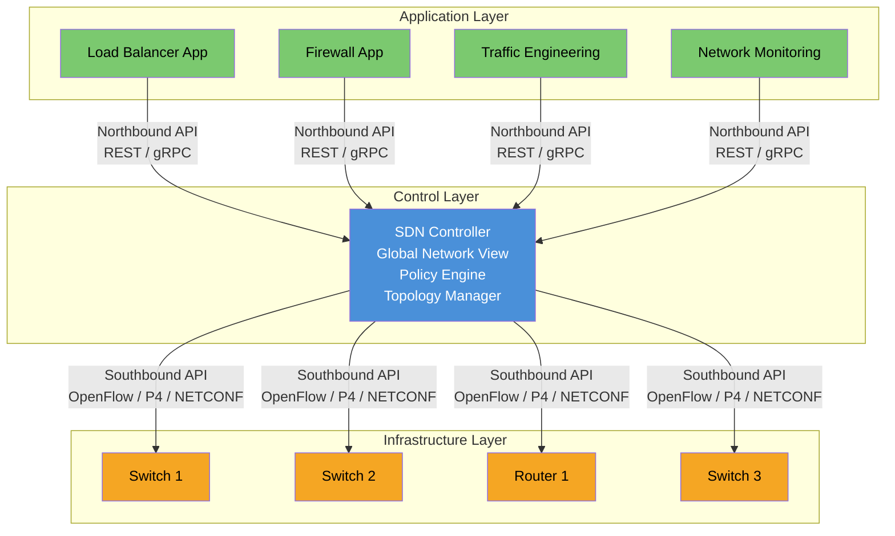
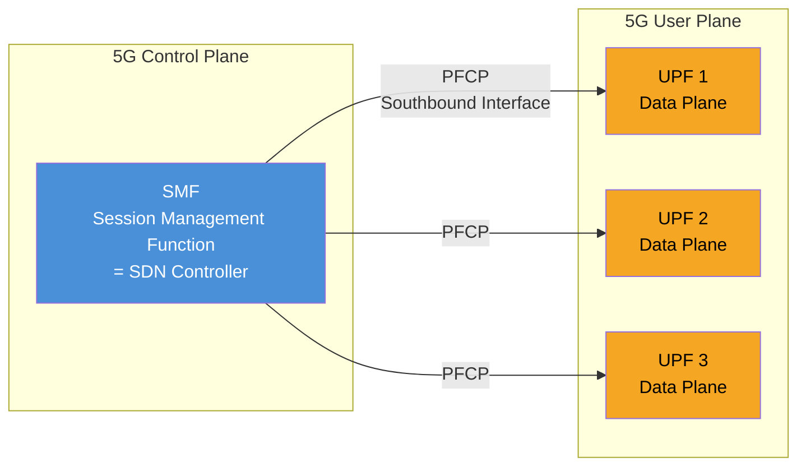

# Module 15: Software Defined Networking (SDN)

## 1. Why SDN?

Traditional networks suffer from fundamental limitations that hinder innovation and agility:

| Problem | Description |
|---------|-------------|
| **Distributed Control** | Every device runs its own control plane independently. No single entity has a global view of the network state. |
| **Vendor Lock-in** | Proprietary hardware + software bundles. Migrating between vendors is costly and complex. |
| **Slow Provisioning** | Manual, box-by-box configuration via CLI. Weeks to deploy a new service. Human errors cause outages. |
| **Rigid Architecture** | Adding new protocols requires vendor firmware updates. Innovation cycles measured in years. |
| **Inconsistent Policies** | Policies must be manually replicated across hundreds of devices. Drift is inevitable. |

> **The Core Insight**: If we separate the "brain" (control plane) from the "muscle" (data plane), we can centralize intelligence, automate operations, and program the network like software.

---

## 2. Traditional vs SDN Architecture

### Traditional Architecture

- **Control plane embedded in every device**
- Each device independently computes forwarding decisions
- Distributed protocols (OSPF, BGP, STP) synchronize state
- Convergence takes time; no global optimization

### SDN Architecture

- **Control plane extracted and centralized**
- Switches become simple forwarding devices
- Controller has a **global view** of the entire network
- Programmable via APIs (northbound and southbound)

| Aspect | Traditional | SDN |
|--------|-------------|-----|
| Control Plane | Distributed (per device) | Centralized (controller) |
| Data Plane | Coupled with control | Separated, simple forwarding |
| Configuration | CLI, box-by-box | API-driven, programmable |
| Vendor | Locked-in | Open, multi-vendor |
| Innovation Speed | Years (firmware cycle) | Days (software development) |
| Visibility | Per-device, fragmented | Global, real-time |
| Automation | Scripts/templates | Native API + intent |

---

## 3. SDN Architecture Layers



### 3.1 Infrastructure Layer (Data Plane)

- Physical or virtual **switches and routers**
- Performs packet forwarding based on **flow tables** programmed by the controller
- No independent decision-making — follows instructions from the control layer
- Hardware: white-box switches, programmable ASICs, TCAM for fast lookup

### 3.2 Control Layer (SDN Controller)

- The **"brain"** of the network
- Maintains a **global view** of topology, links, hosts, and traffic
- Translates high-level policies into low-level flow rules
- Examples: ONOS, OpenDaylight (ODL), Ryu, Floodlight, Nokia NSP, Cisco ACI

### 3.3 Application Layer

- **Business logic and policies** expressed as software applications
- Consumes the controller's northbound API
- Examples: traffic engineering, security (micro-segmentation), load balancing, monitoring, intent-based networking

---

## 4. SDN Controller Functions

| Function | Description |
|----------|-------------|
| **Topology Discovery** | Discovers all network devices, links, and hosts. Builds a graph representation. Uses LLDP, OFDP. |
| **Path Computation / Routing** | Computes optimal paths using global view. Can apply constraints (latency, bandwidth, cost). |
| **Policy Enforcement** | Translates high-level policies into device-level flow rules. |
| **API Exposure** | Provides northbound REST/gRPC APIs for applications to consume network services. |
| **State Management** | Maintains consistent network state (flow tables, counters, port status). |
| **Multi-tenancy** | Network slicing and isolation between tenants. |
| **Fault Management** | Detects link/device failures and reroutes traffic in milliseconds. |

---

## 5. Southbound Interfaces

The southbound interface connects the **controller to infrastructure devices** (data plane).

### 5.1 OpenFlow

- Most well-known SDN southbound protocol
- Defined by **Open Networking Foundation (ONF)**
- Provides a standard way to program **flow tables** in switches
- Controller installs/modifies/deletes flow entries
- Switch reports events (topology changes, packet-in) to controller
- Versions: 1.0 → 1.3 (most deployed) → 1.5

### 5.2 P4 (Programming Protocol-independent Packet Processors)

- **Domain-specific language** for programming the data plane itself
- Goes beyond OpenFlow: defines **what** the switch can match on
- Programmable packet parsing and processing pipelines
- Target-independent: compiles to different hardware (Tofino, FPGA, software switches)
- Use case: custom headers, in-network computing, INT (In-band Network Telemetry)

### 5.3 ForCES (Forwarding and Control Element Separation)

- IETF standard (RFC 5810)
- Separates Control Element (CE) from Forwarding Element (FE)
- Defines a protocol for CE-FE communication
- Less adopted than OpenFlow in practice

### 5.4 Other Southbound Protocols

| Protocol | Use Case |
|----------|----------|
| NETCONF/YANG | Device configuration (model-driven) |
| gNMI/gNOI | Streaming telemetry and operations |
| BGP-LS | Topology export from traditional networks to SDN controller |
| PCEP | Path computation for MPLS/SR networks |

---

## 6. Northbound Interfaces

The northbound interface connects **applications to the controller**.

### 6.1 REST APIs

- Most common northbound interface
- HTTP-based, JSON/XML payloads
- CRUD operations on network resources (flows, topologies, policies)
- Example:
  ```json
  POST /api/v1/flows
  {
    "switch": "s1",
    "match": {"src_ip": "10.0.0.1", "dst_ip": "10.0.0.2"},
    "action": {"output": "port3"},
    "priority": 100
  }
  ```

### 6.2 Intent-Based Networking (IBN)

- Higher abstraction: express **what** you want, not **how** to achieve it
- Controller translates intent into device-level configuration
- Example intent: *"Ensure video traffic between Site A and Site B has latency < 10ms"*
- The controller figures out the path, QoS policies, and failover
- Implementations: ONOS intent framework, Cisco DNA Center, Nokia NSP

### 6.3 gRPC / Protobuf

- High-performance, streaming-capable API
- Used in modern controllers for real-time telemetry and configuration
- Strongly typed (protobuf schemas)

---

## 7. OpenFlow Basics

### 7.1 Flow Table Structure

Each switch maintains one or more **flow tables**. Each entry contains:

| Field | Description |
|-------|-------------|
| **Match Fields** | Criteria to match packets (src/dst MAC, IP, port, VLAN, MPLS label) |
| **Priority** | Higher priority entries matched first |
| **Counters** | Packet/byte count for statistics |
| **Instructions/Actions** | What to do with matched packets |
| **Timeouts** | Idle timeout, hard timeout (auto-expire) |
| **Cookie** | Opaque identifier set by controller |

### 7.2 Actions

| Action | Description |
|--------|-------------|
| `OUTPUT(port)` | Forward packet to specified port |
| `DROP` | Discard the packet |
| `SET_FIELD` | Modify header fields (rewrite MAC, IP, VLAN) |
| `PUSH/POP_VLAN` | Add or remove VLAN tags |
| `GROUP` | Send to a group table (multipath, failover) |
| `METER` | Rate-limit the flow |

### 7.3 Group Tables

Enable advanced forwarding:

| Group Type | Use Case |
|------------|----------|
| **All** | Multicast/broadcast (copy to all buckets) |
| **Select** | Load balancing (round-robin or weighted) |
| **Indirect** | Single next-hop (efficient pointer) |
| **Fast Failover** | First live bucket used (link protection) |

### 7.4 Meter Tables

- Rate limiting per flow
- Defined in **bands**: rate threshold + action (drop or DSCP remark)
- Enables QoS enforcement at the switch level

### 7.5 Packet Processing Pipeline

```
Packet In → Table 0 → Match? → Execute Instructions → Table 1 → ... → Output
                         ↓ No match
                    Table-miss entry → Send to controller (Packet-In)
```

---

## 8. SDN in Telecom

### 8.1 Transport SDN (WAN Optimization)

- Centralized control of optical/MPLS transport networks
- Dynamic bandwidth allocation based on traffic demand
- Multi-layer optimization (IP over optical)
- Examples: Nokia NSP, Ciena Blue Planet, Cisco WAE

### 8.2 SD-WAN (Software-Defined Wide Area Network)

- SDN principles applied to enterprise WAN
- Centralized controller manages branch CPE devices
- Overlays on top of multiple underlay transports (MPLS, Internet, LTE)
- Application-aware routing (route voice over MPLS, web over Internet)
- Zero-touch provisioning for branch sites
- Vendors: Cisco Viptela, VMware VeloCloud, Fortinet, Versa

### 8.3 5G Integration: SMF as SDN Controller for UPF



**The 5G User Plane is inherently SDN-like:**

| SDN Concept | 5G Equivalent |
|-------------|---------------|
| SDN Controller | **SMF** (Session Management Function) |
| Data Plane Switch | **UPF** (User Plane Function) |
| Southbound Protocol | **PFCP** (Packet Forwarding Control Protocol) |
| Flow Rules | **PDRs** (Packet Detection Rules) + **FARs** (Forwarding Action Rules) |
| QoS Enforcement | **QERs** (QoS Enforcement Rules) |

### 8.4 UPF Programmability via PFCP

PFCP (3GPP TS 29.244) is the protocol between SMF and UPF:

- **PDR (Packet Detection Rule)**: Match criteria (source interface, IP, GTP TEID)
- **FAR (Forwarding Action Rule)**: Action (forward, drop, buffer, encapsulate)
- **QER (QoS Enforcement Rule)**: Rate limiting (MBR, GBR)
- **URR (Usage Reporting Rule)**: Traffic measurement and reporting

This is functionally equivalent to OpenFlow's match-action model!

---

## 9. Benefits of SDN

| Benefit | Description |
|---------|-------------|
| **Programmability** | Network is software-controlled; automate everything via APIs |
| **Automation** | Zero-touch provisioning, auto-remediation, CI/CD for network |
| **Multi-vendor** | Open interfaces allow mixing hardware vendors (white-box revolution) |
| **Fast Innovation** | New services deployed in hours/days vs. months |
| **Global Optimization** | Centralized view enables optimal path computation |
| **Network Slicing** | Dynamic resource allocation per tenant/service |
| **Cost Reduction** | Commodity hardware + open-source software vs. proprietary boxes |

---

## 10. Challenges of SDN

### 10.1 Controller Scalability

- Single controller cannot handle thousands of switches + millions of flows
- **Solution**: Controller clustering (ONOS, ODL support distributed controllers)
- Trade-off: consistency vs. availability (CAP theorem applies)

### 10.2 Single Point of Failure

- If the controller fails, no new flows can be installed
- Data plane continues forwarding existing flows (proactive mode)
- **Mitigation**: Controller redundancy (active-standby, active-active)

### 10.3 East-West Interface

- Communication between controller instances in a cluster
- No standard protocol (each controller has proprietary clustering)
- Challenges: state synchronization, split-brain scenarios, consistency

### 10.4 Security

| Threat | Impact |
|--------|--------|
| Controller compromise | Attacker controls entire network |
| Man-in-the-middle (controller↔switch) | Flow rule injection/modification |
| DoS on controller | Overwhelm with Packet-In messages |
| Malicious application | Rogue app installs harmful flows via NBI |

**Mitigations**: TLS on OpenFlow channel, RBAC for northbound API, rate-limiting Packet-In, application sandboxing.

---

## Key Takeaways

1. SDN **separates** the control plane from the data plane
2. A **centralized controller** provides a global view and programmability
3. **OpenFlow** is the foundational southbound protocol (match-action paradigm)
4. **P4** extends programmability to the data plane pipeline itself
5. 5G architecture is **inherently SDN-like** (SMF controls UPF via PFCP)
6. SDN enables **network automation, slicing, and rapid service deployment**
7. Challenges remain around **scalability, security, and standardization**
