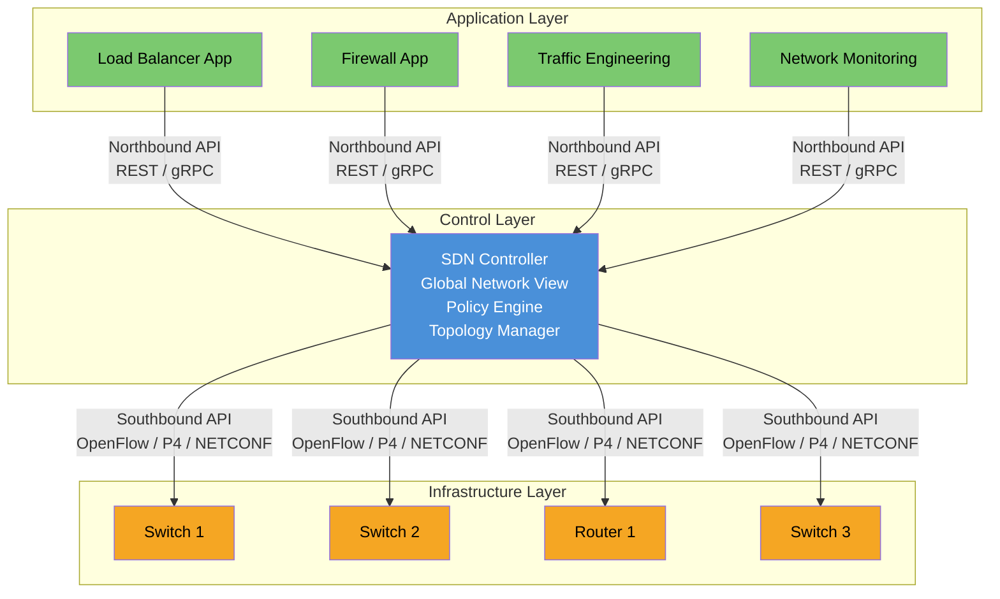
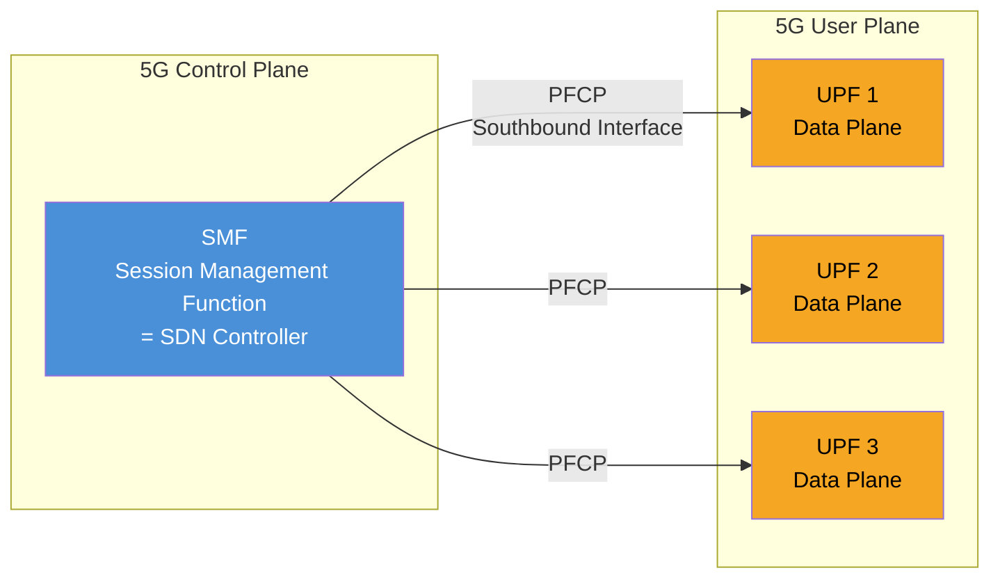

# ماژول 15: شبکه‌سازی نرم‌افزارمحور (SDN)

## 1. چرا SDN؟

شبکه‌های سنتی از محدودیت‌های بنیادی رنج می‌برند که مانع نوآوری و چابکی می‌شوند:

| مسئله | توضیح |
|---------|-------------|
| **کنترل توزیع‌شده** | هر دستگاه صفحه کنترل خود را به‌طور مستقل اجرا می‌کند. هیچ موجودیت واحدی نمای جهانی از وضعیت شبکه ندارد. |
| **وابستگی به سازنده** | بسته‌های سخت‌افزار + نرم‌افزار اختصاصی. مهاجرت بین سازندگان پرهزینه و پیچیده است. |
| **تأمین کند** | پیکربندی دستی، جعبه-به-جعبه از طریق CLI. هفته‌ها برای استقرار یک سرویس جدید. خطاهای انسانی باعث قطعی می‌شوند. |
| **معماری سخت** | افزودن پروتکل‌های جدید نیازمند به‌روزرسانی فرم‌ور سازنده است. چرخه‌های نوآوری در مقیاس سال اندازه‌گیری می‌شوند. |
| **سیاست‌های ناسازگار** | سیاست‌ها باید به‌صورت دستی در صدها دستگاه تکرار شوند. انحراف اجتناب‌ناپذیر است. |

> **بینش اصلی**: اگر «مغز» (صفحه کنترل) را از «ماهیچه» (صفحه داده) جدا کنیم، می‌توانیم هوش را متمرکز کنیم، عملیات را خودکار کنیم و شبکه را مانند نرم‌افزار برنامه‌ریزی کنیم.

---

## 2. معماری سنتی در برابر SDN

### معماری سنتی

- **صفحه کنترل تعبیه‌شده در هر دستگاه**
- هر دستگاه به‌طور مستقل تصمیمات ارسال را محاسبه می‌کند
- پروتکل‌های توزیع‌شده (OSPF، BGP، STP) وضعیت را همگام می‌کنند
- همگرایی زمان می‌برد؛ بدون بهینه‌سازی جهانی

### معماری SDN

- **صفحه کنترل استخراج و متمرکز شده**
- سوئیچ‌ها به دستگاه‌های ارسال ساده تبدیل می‌شوند
- کنترلر **نمای جهانی** از کل شبکه دارد
- قابل برنامه‌ریزی از طریق APIها (شمال‌سو و جنوب‌سو)

| جنبه | سنتی | SDN |
|--------|-------------|-----|
| صفحه کنترل | توزیع‌شده (در هر دستگاه) | متمرکز (کنترلر) |
| صفحه داده | جفت‌شده با کنترل | جدا شده، ارسال ساده |
| پیکربندی | CLI، جعبه-به-جعبه | مبتنی بر API، قابل برنامه‌ریزی |
| سازنده | وابسته | باز، چند-سازنده |
| سرعت نوآوری | سال‌ها (چرخه فرم‌ور) | روزها (توسعه نرم‌افزار) |
| دیدپذیری | در هر دستگاه، تکه‌تکه | جهانی، بلادرنگ |
| خودکارسازی | اسکریپت‌ها/قالب‌ها | API بومی + قصد |

---

## 3. لایه‌های معماری SDN



### 3.1 لایه زیرساخت (صفحه داده)

- **سوئیچ‌ها و مسیریاب‌های** فیزیکی یا مجازی
- ارسال بسته را بر اساس **جداول جریان** برنامه‌ریزی‌شده توسط کنترلر انجام می‌دهد
- بدون تصمیم‌گیری مستقل — دستورالعمل‌های لایه کنترل را دنبال می‌کند
- سخت‌افزار: سوئیچ‌های جعبه-سفید، ASICهای قابل برنامه‌ریزی، TCAM برای جستجوی سریع

### 3.2 لایه کنترل (کنترلر SDN)

- **«مغز»** شبکه
- **نمای جهانی** از توپولوژی، پیوندها، میزبان‌ها و ترافیک را نگه می‌دارد
- سیاست‌های سطح بالا را به قواعد جریان سطح پایین ترجمه می‌کند
- نمونه‌ها: ONOS، OpenDaylight (ODL)، Ryu، Floodlight، Nokia NSP، Cisco ACI

### 3.3 لایه کاربرد

- **منطق تجاری و سیاست‌ها** به‌صورت کاربردهای نرم‌افزاری بیان می‌شوند
- API شمال‌سوی کنترلر را مصرف می‌کند
- نمونه‌ها: مهندسی ترافیک، امنیت (خرد-قطعه‌بندی)، توازن بار، پایش، شبکه‌سازی مبتنی بر قصد

---

## 4. توابع کنترلر SDN

| عملکرد | توضیح |
|----------|-------------|
| **کشف توپولوژی** | تمام دستگاه‌ها، پیوندها و میزبان‌های شبکه را کشف می‌کند. نمایش گرافی می‌سازد. از LLDP، OFDP استفاده می‌کند. |
| **محاسبه مسیر / مسیریابی** | مسیرهای بهینه را با استفاده از نمای جهانی محاسبه می‌کند. می‌تواند محدودیت‌ها (تأخیر، پهنای باند، هزینه) اعمال کند. |
| **اجرای سیاست** | سیاست‌های سطح بالا را به قواعد جریان سطح دستگاه ترجمه می‌کند. |
| **نمایش API** | APIهای REST/gRPC شمال‌سو برای مصرف خدمات شبکه توسط کاربردها فراهم می‌کند. |
| **مدیریت وضعیت** | وضعیت سازگار شبکه را نگه می‌دارد (جداول جریان، شمارنده‌ها، وضعیت پورت). |
| **چند-مستأجری** | شبکه‌بندی و جداسازی بین مستأجران. |
| **مدیریت خطا** | شکست پیوند/دستگاه را تشخیص می‌دهد و ترافیک را در میلی‌ثانیه تغییر مسیر می‌دهد. |

---

## 5. واسط‌های جنوب‌سو

واسط جنوب‌سو **کنترلر را به دستگاه‌های زیرساخت** (صفحه داده) متصل می‌کند.

### 5.1 OpenFlow

- شناخته‌شده‌ترین پروتکل جنوب‌سوی SDN
- تعریف‌شده توسط **بنیاد شبکه‌سازی باز (ONF)**
- روشی استاندارد برای برنامه‌ریزی **جداول جریان** در سوئیچ‌ها فراهم می‌کند
- کنترلر ورودی‌های جریان را نصب/اصلاح/حذف می‌کند
- سوئیچ رویدادها (تغییرات توپولوژی، packet-in) را به کنترلر گزارش می‌دهد
- نسخه‌ها: 1.0 ← 1.3 (پراستقرارترین) ← 1.5

### 5.2 P4 (پردازنده‌های بسته مستقل از پروتکل برنامه‌نویسی‌پذیر)

- **زبان دامنه-خاص** برای برنامه‌ریزی خود صفحه داده
- فراتر از OpenFlow می‌رود: مشخص می‌کند سوئیچ روی **چه چیزی** می‌تواند تطبیق دهد
- خطوط لوله تجزیه و پردازش بسته قابل برنامه‌ریزی
- مستقل از هدف: به سخت‌افزارهای مختلف کامپایل می‌شود (Tofino، FPGA، سوئیچ‌های نرم‌افزاری)
- مورد استفاده: سرآیندهای سفارشی، رایانش درون-شبکه، INT (تله‌متری درون-باند شبکه)

### 5.3 ForCES (جداسازی عنصر ارسال و کنترل)

- استاندارد IETF (RFC 5810)
- عنصر کنترل (CE) را از عنصر ارسال (FE) جدا می‌کند
- پروتکلی برای ارتباط CE-FE تعریف می‌کند
- در عمل کمتر از OpenFlow پذیرفته شده است

### 5.4 سایر پروتکل‌های جنوب‌سو

| پروتکل | مورد استفاده |
|----------|----------|
| NETCONF/YANG | پیکربندی دستگاه (مدل-محور) |
| gNMI/gNOI | تله‌متری جریانی و عملیات |
| BGP-LS | صادرات توپولوژی از شبکه‌های سنتی به کنترلر SDN |
| PCEP | محاسبه مسیر برای شبکه‌های MPLS/SR |

---

## 6. واسط‌های شمال‌سو

واسط شمال‌سو **کاربردها را به کنترلر** متصل می‌کند.

### 6.1 APIهای REST

- رایج‌ترین واسط شمال‌سو
- مبتنی بر HTTP، بارهای JSON/XML
- عملیات CRUD روی منابع شبکه (جریان‌ها، توپولوژی‌ها، سیاست‌ها)
- مثال:
  ```json
  POST /api/v1/flows
  {
    "switch": "s1",
    "match": {"src_ip": "10.0.0.1", "dst_ip": "10.0.0.2"},
    "action": {"output": "port3"},
    "priority": 100
  }
  ```

### 6.2 شبکه‌سازی مبتنی بر قصد (IBN)

- انتزاع بالاتر: بیان کنید **چه چیزی** می‌خواهید، نه **چگونه** به آن برسید
- کنترلر قصد را به پیکربندی سطح دستگاه ترجمه می‌کند
- قصد نمونه: *«اطمینان حاصل کن که ترافیک ویدیو بین سایت A و سایت B تأخیر کمتر از 10ms دارد»*
- کنترلر مسیر، سیاست‌های QoS و تغییر مسیر را تعیین می‌کند
- پیاده‌سازی‌ها: چارچوب قصد ONOS، Cisco DNA Center، Nokia NSP

### 6.3 gRPC / Protobuf

- API با عملکرد بالا و قابلیت جریانی
- در کنترلرهای مدرن برای تله‌متری و پیکربندی بلادرنگ استفاده می‌شود
- به‌شدت نوع‌دار (طرح‌واره‌های protobuf)

---

## 7. مبانی OpenFlow

### 7.1 ساختار جدول جریان

هر سوئیچ یک یا چند **جدول جریان** نگه می‌دارد. هر ورودی شامل موارد زیر است:

| فیلد | توضیح |
|-------|-------------|
| **فیلدهای تطبیق** | معیارهای تطبیق بسته‌ها (MAC مبدأ/مقصد، IP، پورت، VLAN، برچسب MPLS) |
| **اولویت** | ورودی‌های با اولویت بالاتر ابتدا تطبیق می‌یابند |
| **شمارنده‌ها** | تعداد بسته/بایت برای آمار |
| **دستورالعمل‌ها/اقدامات** | با بسته‌های تطبیق‌یافته چه کاری انجام شود |
| **مهلت‌ها** | مهلت بیکاری، مهلت سخت (انقضای خودکار) |
| **Cookie** | شناسه مبهم تعیین‌شده توسط کنترلر |

### 7.2 اقدامات

| اقدام | توضیح |
|--------|-------------|
| `OUTPUT(port)` | ارسال بسته به پورت مشخص |
| `DROP` | دور ریختن بسته |
| `SET_FIELD` | اصلاح فیلدهای سرآیند (بازنویسی MAC، IP، VLAN) |
| `PUSH/POP_VLAN` | افزودن یا حذف برچسب‌های VLAN |
| `GROUP` | ارسال به جدول گروه (چند-مسیری، تغییر مسیر) |
| `METER` | محدودسازی نرخ جریان |

### 7.3 جداول گروه

ارسال پیشرفته را ممکن می‌سازند:

| نوع گروه | مورد استفاده |
|------------|----------|
| **All** | چندپخشی/پخش (کپی به همه سبدها) |
| **Select** | توازن بار (گردشی یا وزن‌دار) |
| **Indirect** | گام بعدی واحد (اشاره‌گر کارآمد) |
| **Fast Failover** | اولین سبد زنده استفاده می‌شود (حفاظت پیوند) |

### 7.4 جداول Meter

- محدودسازی نرخ در هر جریان
- در **باندها** تعریف می‌شود: آستانه نرخ + اقدام (دور ریختن یا بازنویسی DSCP)
- اجرای QoS در سطح سوئیچ را ممکن می‌سازد

### 7.5 خط لوله پردازش بسته

```
Packet In → Table 0 → Match? → Execute Instructions → Table 1 → ... → Output
                         ↓ No match
                    Table-miss entry → Send to controller (Packet-In)
```

---

## 8. SDN در مخابرات

### 8.1 SDN انتقال (بهینه‌سازی WAN)

- کنترل متمرکز شبکه‌های انتقال نوری/MPLS
- تخصیص پویای پهنای باند بر اساس تقاضای ترافیک
- بهینه‌سازی چند-لایه (IP روی نوری)
- نمونه‌ها: Nokia NSP، Ciena Blue Planet، Cisco WAE

### 8.2 SD-WAN (شبکه گسترده نرم‌افزارمحور)

- اصول SDN اعمال‌شده بر WAN سازمانی
- کنترلر متمرکز دستگاه‌های CPE شعب را مدیریت می‌کند
- لایه‌های رویی بر فراز چندین انتقال زیرین (MPLS، اینترنت، LTE)
- مسیریابی آگاه به کاربرد (مسیریابی صدا روی MPLS، وب روی اینترنت)
- تأمین بدون-لمس برای سایت‌های شعب
- سازندگان: Cisco Viptela، VMware VeloCloud، Fortinet، Versa

### 8.3 یکپارچگی 5G: SMF به‌عنوان کنترلر SDN برای UPF



**صفحه کاربر 5G ذاتاً شبیه SDN است:**

| مفهوم SDN | معادل در 5G |
|-------------|---------------|
| کنترلر SDN | **SMF** (تابع مدیریت نشست) |
| سوئیچ صفحه داده | **UPF** (تابع صفحه کاربر) |
| پروتکل جنوب‌سو | **PFCP** (پروتکل کنترل ارسال بسته) |
| قواعد جریان | **PDRها** (قواعد تشخیص بسته) + **FARها** (قواعد اقدام ارسال) |
| اجرای QoS | **QERها** (قواعد اجرای QoS) |

### 8.4 برنامه‌پذیری UPF از طریق PFCP

PFCP (3GPP TS 29.244) پروتکل بین SMF و UPF است:

- **PDR (قاعده تشخیص بسته)**: معیارهای تطبیق (واسط مبدأ، IP، TEID در GTP)
- **FAR (قاعده اقدام ارسال)**: اقدام (ارسال، دور ریختن، بافر، کپسوله‌سازی)
- **QER (قاعده اجرای QoS)**: محدودسازی نرخ (MBR، GBR)
- **URR (قاعده گزارش‌دهی مصرف)**: اندازه‌گیری و گزارش‌دهی ترافیک

این از نظر عملکردی معادل مدل تطبیق-اقدام OpenFlow است!

---

## 9. مزایای SDN

| مزیت | توضیح |
|---------|-------------|
| **برنامه‌پذیری** | شبکه تحت کنترل نرم‌افزار است؛ همه چیز را از طریق APIها خودکار کنید |
| **خودکارسازی** | تأمین بدون-لمس، خود-ترمیمی، CI/CD برای شبکه |
| **چند-سازنده** | واسط‌های باز امکان ترکیب سازندگان سخت‌افزار را می‌دهند (انقلاب جعبه-سفید) |
| **نوآوری سریع** | خدمات جدید در ساعت/روز به‌جای ماه مستقر می‌شوند |
| **بهینه‌سازی جهانی** | نمای متمرکز محاسبه مسیر بهینه را ممکن می‌سازد |
| **شبکه‌بندی** | تخصیص پویای منابع در هر مستأجر/سرویس |
| **کاهش هزینه** | سخت‌افزار عمومی + نرم‌افزار متن‌باز در برابر جعبه‌های اختصاصی |

---

## 10. چالش‌های SDN

### 10.1 مقیاس‌پذیری کنترلر

- کنترلر واحد نمی‌تواند هزاران سوئیچ + میلیون‌ها جریان را مدیریت کند
- **راه‌حل**: خوشه‌بندی کنترلر (ONOS، ODL از کنترلرهای توزیع‌شده پشتیبانی می‌کنند)
- مبادله: سازگاری در برابر دسترس‌پذیری (قضیه CAP اعمال می‌شود)

### 10.2 نقطه شکست واحد

- اگر کنترلر شکست بخورد، هیچ جریان جدیدی نمی‌تواند نصب شود
- صفحه داده ارسال جریان‌های موجود را ادامه می‌دهد (حالت فعالانه)
- **کاهش اثر**: افزونگی کنترلر (فعال-آماده، فعال-فعال)

### 10.3 واسط شرق-غرب

- ارتباط بین نمونه‌های کنترلر در یک خوشه
- بدون پروتکل استاندارد (هر کنترلر خوشه‌بندی اختصاصی دارد)
- چالش‌ها: همگام‌سازی وضعیت، سناریوهای مغز-شکافته، سازگاری

### 10.4 امنیت

| تهدید | تأثیر |
|--------|--------|
| نفوذ به کنترلر | مهاجم کل شبکه را کنترل می‌کند |
| مرد-در-میان (کنترلر↔سوئیچ) | تزریق/اصلاح قاعده جریان |
| DoS روی کنترلر | اشباع با پیام‌های Packet-In |
| کاربرد مخرب | برنامه سرکش جریان‌های زیان‌بار را از طریق NBI نصب می‌کند |

**کاهش اثر**: TLS روی کانال OpenFlow، RBAC برای API شمال‌سو، محدودسازی نرخ Packet-In، جعبه‌شنی کاربرد.

---

## نکات کلیدی

1. SDN صفحه کنترل را از صفحه داده **جدا می‌کند**
2. یک **کنترلر متمرکز** نمای جهانی و برنامه‌پذیری فراهم می‌کند
3. **OpenFlow** پروتکل جنوب‌سوی بنیادی است (پارادایم تطبیق-اقدام)
4. **P4** برنامه‌پذیری را به خود خط لوله صفحه داده گسترش می‌دهد
5. معماری 5G **ذاتاً شبیه SDN است** (SMF از طریق PFCP UPF را کنترل می‌کند)
6. SDN **خودکارسازی شبکه، شبکه‌بندی و استقرار سریع سرویس** را ممکن می‌سازد
7. چالش‌ها پیرامون **مقیاس‌پذیری، امنیت و استانداردسازی** باقی می‌مانند
