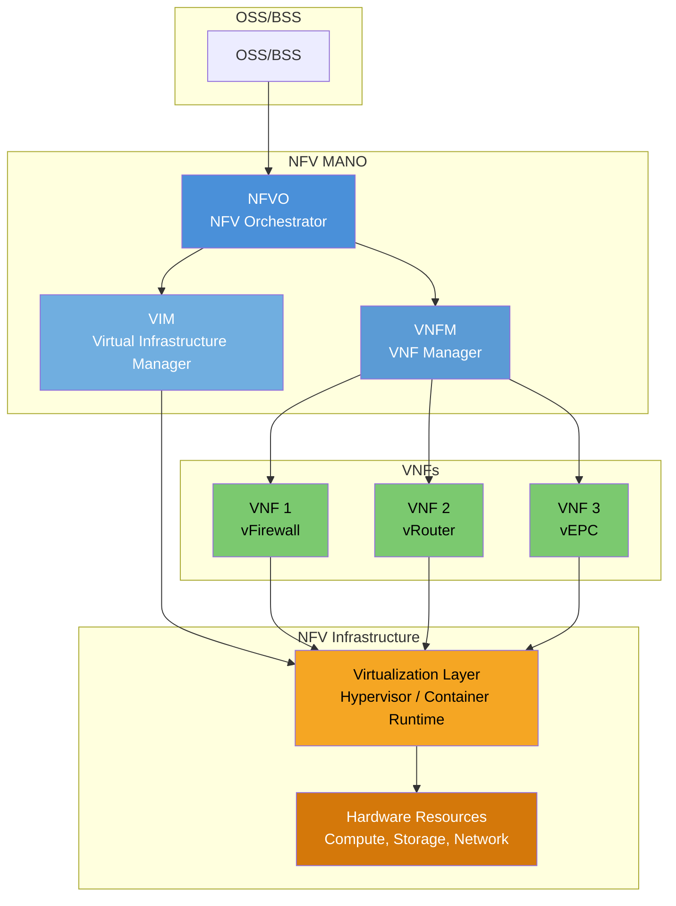
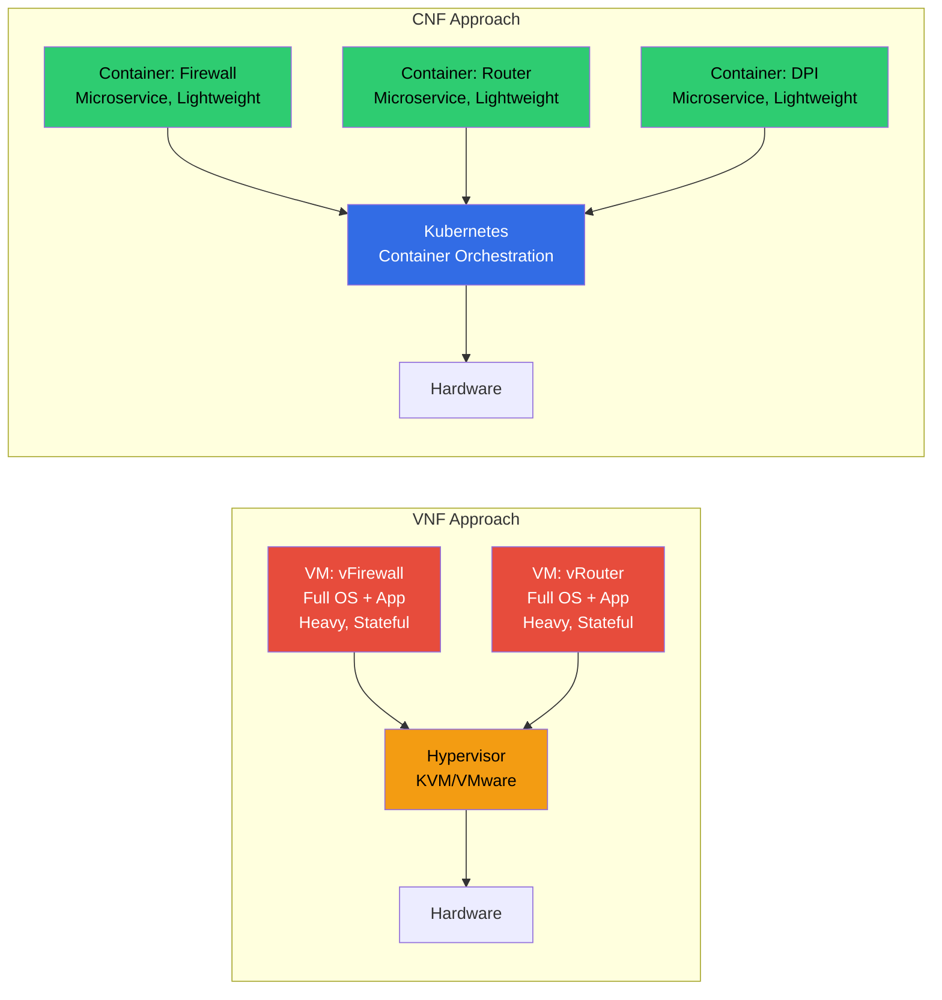
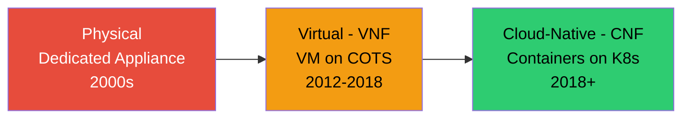

# Module 16: Network Function Virtualization (NFV)

## 1. Why NFV?

Traditional telecom networks rely on **proprietary hardware appliances** for every network function:

| Problem | Description |
|---------|-------------|
| **High CAPEX** | Each function requires dedicated, expensive hardware (firewall appliance, load balancer, DPI box, etc.) |
| **High OPEX** | Power, cooling, rack space, vendor maintenance contracts for each appliance |
| **Slow Scaling** | Need more capacity? Order hardware, wait weeks for delivery, rack-and-stack, configure |
| **Underutilization** | Hardware sized for peak load; average utilization often 20-30% |
| **Vendor Dependency** | Locked into vendor hardware lifecycle, upgrade timelines, and pricing |
| **Rigid Deployment** | Cannot easily move functions, resize, or replicate on demand |

> **The Core Insight**: If network functions (firewall, router, load balancer) are just software, why not run them on standard servers as VMs or containers?

**NFV was initiated by a group of telecom operators (AT&T, BT, Deutsche Telekom, etc.) who published the ETSI NFV white paper in 2012.**

---

## 2. Traditional vs NFV Comparison

### Traditional Approach

```
┌──────────────┐ ┌──────────────┐ ┌──────────────┐
│  Dedicated   │ │  Dedicated   │ │  Dedicated   │
│  Firewall    │ │  Load        │ │  DPI         │
│  Appliance   │ │  Balancer    │ │  Appliance   │
│  (Vendor A)  │ │  (Vendor B)  │ │  (Vendor C)  │
└──────────────┘ └──────────────┘ └──────────────┘
  Proprietary HW   Proprietary HW   Proprietary HW
```

### NFV Approach

```
┌──────────────┐ ┌──────────────┐ ┌──────────────┐
│  vFirewall   │ │  vLB         │ │  vDPI        │
│  (VM/Container)│ │ (VM/Container)│ │(VM/Container)│
├──────────────┴─┴──────────────┴─┴──────────────┤
│         Virtualization Layer (Hypervisor/K8s)    │
├──────────────────────────────────────────────────┤
│         COTS Server (x86 / ARM)                  │
└──────────────────────────────────────────────────┘
```

| Aspect | Traditional | NFV |
|--------|-------------|-----|
| Hardware | Proprietary, purpose-built | COTS (Commercial Off-The-Shelf) servers |
| Software | Embedded in appliance | Decoupled, runs as VM/container |
| Scaling | Buy more hardware | Spin up more instances (minutes) |
| Cost | High CAPEX + OPEX | Lower (commodity HW + SW licenses) |
| Flexibility | Fixed function | Any function on any server |
| Lifecycle | 5-7 year hardware refresh | Continuous software updates |

---

## 3. ETSI NFV Architecture



### Three Main Components:

| Component | Role |
|-----------|------|
| **NFVI** | The infrastructure: hardware + virtualization layer that hosts VNFs |
| **VNF** | Software implementation of a network function running on NFVI |
| **MANO** | Management and Orchestration: lifecycle, resources, service chaining |

---

## 4. NFV Infrastructure (NFVI)

NFVI provides the environment where VNFs execute.

### 4.1 Hardware Resources

| Resource | Description |
|----------|-------------|
| **Compute** | x86/ARM CPUs, GPU accelerators, NUMA topology |
| **Storage** | Local SSD/NVMe, SAN, distributed storage (Ceph) |
| **Network** | NICs (10/25/100G), SmartNICs, switches, SR-IOV capable |

### 4.2 Virtualization Layer

| Technology | Description |
|------------|-------------|
| **Hypervisor** | KVM, VMware ESXi, Xen — creates VMs |
| **Container Runtime** | Docker, containerd, CRI-O — creates containers |
| **Kubernetes** | Container orchestration platform (for CNFs) |

### 4.3 COTS Servers

- **Commercial Off-The-Shelf** servers (Dell, HP, Supermicro)
- Standard x86 architecture — no proprietary hardware
- High-volume, competitive pricing
- Performance enhanced with: SR-IOV, DPDK, huge pages, CPU pinning, NUMA awareness

### 4.4 Acceleration Technologies

| Technology | Purpose |
|------------|---------|
| **SR-IOV** | Bypass hypervisor for direct NIC access (low latency) |
| **DPDK** | User-space packet processing (bypass kernel) |
| **SmartNIC/DPU** | Offload networking to NIC hardware |
| **FPGA** | Programmable hardware acceleration |
| **Huge Pages** | Reduce TLB misses for high-throughput workloads |

---

## 5. VNF vs CNF



### Comparison

| Aspect | VNF (VM-based) | CNF (Container-based) |
|--------|----------------|----------------------|
| **Runtime** | Hypervisor (KVM, VMware) | Container runtime (K8s) |
| **Size** | GBs (full OS image) | MBs (shared kernel) |
| **Boot Time** | Minutes | Seconds |
| **Architecture** | Monolithic | Microservices |
| **State** | Stateful (local state in VM) | Stateless (external state store) |
| **Scaling** | Vertical (bigger VM) or slow horizontal | Fast horizontal (replicas) |
| **Updates** | Disruptive (VM restart) | Rolling updates, canary |
| **Lifecycle** | VNFM manages | Kubernetes manages (Helm, Operators) |
| **Density** | Low (few VMs per server) | High (hundreds of containers) |
| **CI/CD** | Difficult | Native (GitOps, pipelines) |

### 5G Core = CNFs

The 3GPP 5G Core (5GC) is designed as a **Service-Based Architecture (SBA)** with cloud-native principles:

- Each Network Function (AMF, SMF, UPF, NRF, etc.) is a **CNF**
- Deployed on **Kubernetes**
- Communicates via **HTTP/2 + REST APIs**
- Stateless design with external data stores (e.g., UDSF)
- Horizontal scaling, rolling upgrades, self-healing

---

## 6. MANO (Management and Orchestration)

### 6.1 NFVO (NFV Orchestrator)

| Function | Description |
|----------|-------------|
| **Service Orchestration** | Composes end-to-end network services from multiple VNFs |
| **Lifecycle Management** | Onboard, instantiate, scale, update, terminate services |
| **Resource Coordination** | Requests resources from VIM across multiple data centers |
| **Catalog Management** | Stores NSD (Network Service Descriptors) and VNF packages |
| **Policy Management** | Placement, affinity, anti-affinity rules |

Examples: ONAP, OSM (Open Source MANO), Cloudify, Nokia CloudBand

### 6.2 VNFM (VNF Manager)

| Function | Description |
|----------|-------------|
| **Instantiate** | Deploy VNF from package (image + descriptor) |
| **Scale** | Scale out (add instances) or scale in (remove) |
| **Heal** | Detect failure and restart/replace VNF instances |
| **Terminate** | Graceful shutdown and resource release |
| **Update/Upgrade** | Apply new software version |
| **Configure** | Day-0 (initial), Day-1 (service), Day-2 (operational) config |

### 6.3 VIM (Virtualized Infrastructure Manager)

| Function | Description |
|----------|-------------|
| **Compute Management** | Create/delete VMs or containers, CPU/memory allocation |
| **Network Management** | Virtual networks, subnets, ports, security groups |
| **Storage Management** | Volumes, snapshots, object storage |
| **Resource Monitoring** | Utilization, capacity, alarms |

Examples:
- **OpenStack** — most common VIM for VNFs (Nova, Neutron, Cinder)
- **Kubernetes** — VIM for CNFs (native container orchestration)
- **VMware vCenter** — enterprise virtualization

---

## 7. NFV in Telecom (Real Examples)

### 7.1 vEPC (Virtualized Evolved Packet Core)

| Component | Traditional | Virtualized |
|-----------|-------------|-------------|
| MME | Dedicated chassis | VM running MME software |
| S-GW | Proprietary appliance | VM/container with S-GW logic |
| P-GW | Proprietary appliance | VM/container with P-GW logic |
| HSS | Dedicated server | VM with database |

Benefits: scale MME independently during mass events, deploy regional instances

### 7.2 vIMS (Virtualized IP Multimedia Subsystem)

- P-CSCF, S-CSCF, I-CSCF as VNFs
- Scales voice/video capacity on demand
- Deploy in new markets without shipping hardware

### 7.3 5G Core as CNFs on Kubernetes

```
┌─────────────────────────────────────────────────────────┐
│                    Kubernetes Cluster                     │
│                                                          │
│  ┌─────┐ ┌─────┐ ┌─────┐ ┌─────┐ ┌─────┐ ┌─────┐     │
│  │ AMF │ │ SMF │ │ UPF │ │ NRF │ │ PCF │ │ UDM │     │
│  │(CNF)│ │(CNF)│ │(CNF)│ │(CNF)│ │(CNF)│ │(CNF)│     │
│  └─────┘ └─────┘ └─────┘ └─────┘ └─────┘ └─────┘     │
│                                                          │
│  ┌──────────────────────────────────────────────────┐   │
│  │  Service Mesh (Istio/Envoy) + Observability      │   │
│  └──────────────────────────────────────────────────┘   │
└─────────────────────────────────────────────────────────┘
```

- Each 5G NF is a Kubernetes deployment with multiple replicas
- Helm charts or Operators manage lifecycle
- GitOps pipelines for CI/CD
- Horizontal Pod Autoscaler for dynamic scaling

---

## 8. Evolution: Physical → Virtual → Cloud-Native



| Generation | Form Factor | Orchestration | Scaling | Updates |
|------------|-------------|---------------|---------|---------|
| **Physical** | Proprietary appliance | Manual / NMS | Buy hardware | Firmware upgrade (downtime) |
| **Virtual (VNF)** | VM on hypervisor | MANO (NFVO/VNFM) | New VMs (minutes) | VM image replacement |
| **Cloud-Native (CNF)** | Container on K8s | Kubernetes + GitOps | Pod replicas (seconds) | Rolling / Canary / Blue-Green |

### Why the Industry Moved to CNF:

1. **Faster scaling**: Seconds vs. minutes
2. **Higher density**: More functions per server
3. **DevOps native**: CI/CD, GitOps, automated testing
4. **Resilience**: Self-healing, stateless design
5. **Portability**: Run anywhere Kubernetes runs (on-prem, public cloud, edge)

---

## 9. Benefits of NFV

| Benefit | Description |
|---------|-------------|
| **Flexibility** | Deploy any function on any server; relocate workloads |
| **Elastic Scaling** | Scale out/in based on demand (auto-scaling) |
| **Multi-tenancy** | Multiple tenants share infrastructure securely |
| **CI/CD** | Continuous integration and deployment of network functions |
| **Cost Reduction** | 40-60% CAPEX reduction, 30-50% OPEX reduction (industry estimates) |
| **Speed to Market** | New services in days/weeks vs. months/years |
| **Vendor Diversity** | Mix VNFs from different vendors on same infrastructure |
| **Geographic Flexibility** | Deploy at edge, regional DC, or central cloud |
| **Resource Efficiency** | Better utilization through sharing and dynamic allocation |

---

## 10. Challenges of NFV

### 10.1 Performance (Packet Processing)

- VMs/containers add overhead vs. bare-metal ASIC processing
- **Mitigation**: DPDK, SR-IOV, SmartNICs, CPU pinning, huge pages
- UPF and other data-plane VNFs are most sensitive

### 10.2 Orchestration Complexity

- MANO stack is complex to deploy and operate
- Multi-vendor VNF interoperability issues
- Descriptor standardization still evolving (TOSCA, SOL001/006)
- Day-2 operations (monitoring, healing, scaling policies) are hard

### 10.3 State Management

- VNFs often designed as stateful monoliths (ported from appliances)
- Stateful VMs are hard to scale horizontally or migrate
- CNF approach: externalize state (Redis, etcd, databases)
- Challenge: latency of external state access for high-throughput functions

### 10.4 Reliability and Availability

- Software failures more frequent than hardware failures
- Need robust health monitoring, auto-healing, redundancy
- Carrier-grade availability (99.999%) requires careful design

### 10.5 Security

- Larger attack surface (hypervisor, orchestration APIs, shared infrastructure)
- Multi-tenant isolation must be enforced at multiple layers
- Container escape vulnerabilities

### 10.6 Skills Gap

- Operators must learn cloud technologies (OpenStack, K8s, CI/CD)
- Telecom + IT convergence requires new organizational models

---

## Key Takeaways

1. NFV **decouples network functions from proprietary hardware** → software on COTS
2. ETSI NFV architecture: **NFVI + VNF + MANO**
3. **VNFs** (VM-based) are being replaced by **CNFs** (container-based, cloud-native)
4. **5G Core is designed as CNFs** on Kubernetes from the start
5. **MANO** orchestrates the full lifecycle: instantiate, scale, heal, terminate
6. Evolution: Physical → Virtual (VNF) → **Cloud-Native (CNF)**
7. Key challenges: **performance, orchestration complexity, and state management**
8. NFV + SDN together enable **fully programmable, automated telecom networks**
