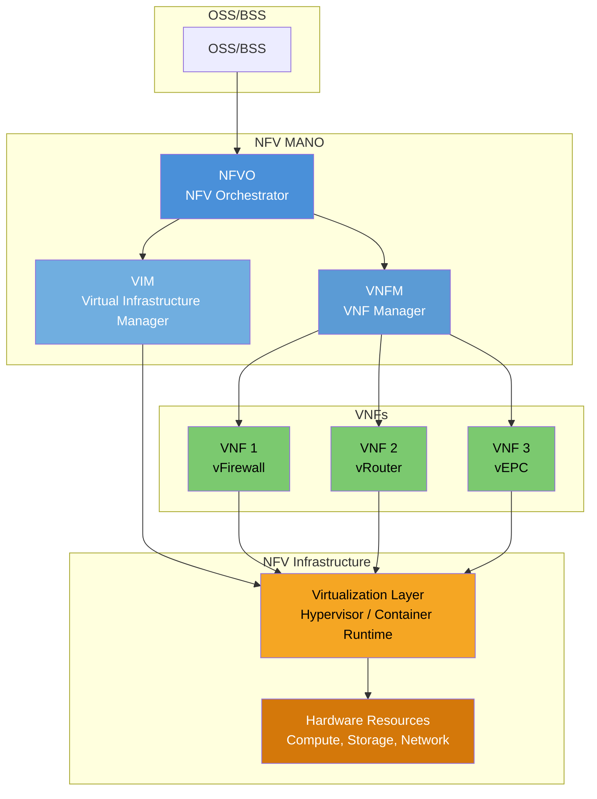
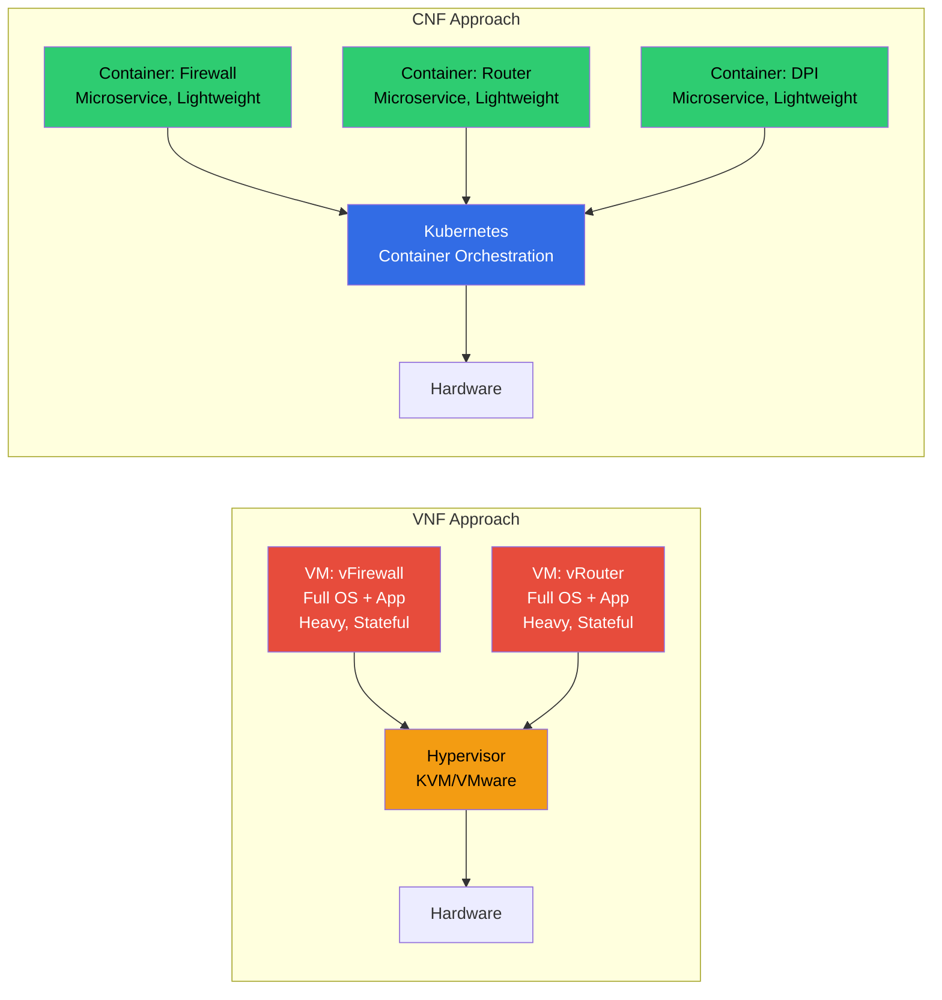
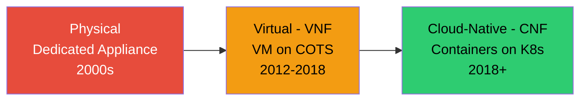

# ماژول 16: مجازی‌سازی توابع شبکه (NFV)

## 1. چرا NFV؟

شبکه‌های مخابراتی سنتی برای هر تابع شبکه بر **تجهیزات سخت‌افزاری اختصاصی** تکیه می‌کنند:

| مسئله | توضیح |
|---------|-------------|
| **CAPEX بالا** | هر تابع نیازمند سخت‌افزار اختصاصی و گران است (تجهیزات فایروال، متعادل‌کننده بار، جعبه DPI و غیره) |
| **OPEX بالا** | توان، سرمایش، فضای رک، قراردادهای نگهداری سازنده برای هر تجهیز |
| **مقیاس‌دهی کند** | ظرفیت بیشتر می‌خواهید؟ سخت‌افزار سفارش دهید، هفته‌ها منتظر تحویل بمانید، رک و پشته کنید، پیکربندی کنید |
| **استفاده ناکافی** | سخت‌افزار برای بار اوج اندازه‌بندی می‌شود؛ استفاده میانگین اغلب 20-30% است |
| **وابستگی به سازنده** | قفل‌شدن در چرخه عمر سخت‌افزار، زمان‌بندی ارتقا و قیمت‌گذاری سازنده |
| **استقرار سخت** | نمی‌توان به‌راحتی توابع را جابه‌جا، تغییر اندازه یا در صورت نیاز تکثیر کرد |

> **بینش اصلی**: اگر توابع شبکه (فایروال، مسیریاب، متعادل‌کننده بار) فقط نرم‌افزار هستند، چرا آن‌ها را روی سرورهای استاندارد به‌عنوان VM یا کانتینر اجرا نکنیم؟

**NFV توسط گروهی از اپراتورهای مخابراتی (AT&T، BT، Deutsche Telekom و غیره) آغاز شد که در سال 2012 مقاله سفید NFV سازمان ETSI را منتشر کردند.**

---

## 2. مقایسه سنتی با NFV

### رویکرد سنتی

```
┌──────────────┐ ┌──────────────┐ ┌──────────────┐
│  Dedicated   │ │  Dedicated   │ │  Dedicated   │
│  Firewall    │ │  Load        │ │  DPI         │
│  Appliance   │ │  Balancer    │ │  Appliance   │
│  (Vendor A)  │ │  (Vendor B)  │ │  (Vendor C)  │
└──────────────┘ └──────────────┘ └──────────────┘
  Proprietary HW   Proprietary HW   Proprietary HW
```

### رویکرد NFV

```
┌──────────────┐ ┌──────────────┐ ┌──────────────┐
│  vFirewall   │ │  vLB         │ │  vDPI        │
│  (VM/Container)│ │ (VM/Container)│ │(VM/Container)│
├──────────────┴─┴──────────────┴─┴──────────────┤
│         Virtualization Layer (Hypervisor/K8s)    │
├──────────────────────────────────────────────────┤
│         COTS Server (x86 / ARM)                  │
└──────────────────────────────────────────────────┘
```

| جنبه | سنتی | NFV |
|--------|-------------|-----|
| سخت‌افزار | اختصاصی، با هدف خاص | سرورهای COTS (تجاری آماده) |
| نرم‌افزار | تعبیه‌شده در تجهیز | جدا شده، به‌عنوان VM/کانتینر اجرا می‌شود |
| مقیاس‌دهی | سخت‌افزار بیشتر بخرید | نمونه‌های بیشتر راه‌اندازی کنید (دقیقه‌ها) |
| هزینه | CAPEX + OPEX بالا | کمتر (سخت‌افزار عمومی + مجوزهای نرم‌افزار) |
| انعطاف‌پذیری | عملکرد ثابت | هر تابع روی هر سرور |
| چرخه عمر | نوسازی سخت‌افزار 5-7 ساله | به‌روزرسانی‌های پیوسته نرم‌افزار |

---

## 3. معماری NFV سازمان ETSI



### سه مؤلفه اصلی:

| مؤلفه | نقش |
|-----------|------|
| **NFVI** | زیرساخت: سخت‌افزار + لایه مجازی‌سازی که VNFها را میزبانی می‌کند |
| **VNF** | پیاده‌سازی نرم‌افزاری یک تابع شبکه که روی NFVI اجرا می‌شود |
| **MANO** | مدیریت و هماهنگ‌سازی: چرخه عمر، منابع، زنجیره‌سازی سرویس |

---

## 4. زیرساخت NFV (NFVI)

NFVI محیطی را فراهم می‌کند که VNFها در آن اجرا می‌شوند.

### 4.1 منابع سخت‌افزاری

| منبع | توضیح |
|----------|-------------|
| **محاسبه** | CPUهای x86/ARM، شتاب‌دهنده‌های GPU، توپولوژی NUMA |
| **ذخیره‌سازی** | SSD/NVMe محلی، SAN، ذخیره‌سازی توزیع‌شده (Ceph) |
| **شبکه** | کارت‌های شبکه (10/25/100G)، SmartNIC، سوئیچ‌ها، توانمند SR-IOV |

### 4.2 لایه مجازی‌سازی

| فناوری | توضیح |
|------------|-------------|
| **Hypervisor** | KVM، VMware ESXi، Xen — VMها را ایجاد می‌کند |
| **زمان اجرا کانتینر** | Docker، containerd، CRI-O — کانتینرها را ایجاد می‌کند |
| **Kubernetes** | پلتفرم هماهنگ‌سازی کانتینر (برای CNFها) |

### 4.3 سرورهای COTS

- سرورهای **تجاری آماده** (Dell، HP، Supermicro)
- معماری استاندارد x86 — بدون سخت‌افزار اختصاصی
- پرحجم، قیمت‌گذاری رقابتی
- عملکرد تقویت‌شده با: SR-IOV، DPDK، صفحات بزرگ، پین‌کردن CPU، آگاهی از NUMA

### 4.4 فناوری‌های شتاب‌دهی

| فناوری | هدف |
|------------|---------|
| **SR-IOV** | دور زدن hypervisor برای دسترسی مستقیم به NIC (تأخیر کم) |
| **DPDK** | پردازش بسته در فضای کاربر (دور زدن هسته) |
| **SmartNIC/DPU** | تخلیه شبکه به سخت‌افزار NIC |
| **FPGA** | شتاب‌دهی سخت‌افزاری قابل برنامه‌ریزی |
| **صفحات بزرگ** | کاهش خطاهای TLB برای بارهای پرتوان‌عملیات |

---

## 5. VNF در برابر CNF



### مقایسه

| جنبه | VNF (مبتنی بر VM) | CNF (مبتنی بر کانتینر) |
|--------|----------------|----------------------|
| **زمان اجرا** | Hypervisor (KVM، VMware) | زمان اجرا کانتینر (K8s) |
| **اندازه** | گیگابایت (تصویر کامل OS) | مگابایت (هسته مشترک) |
| **زمان راه‌اندازی** | دقیقه‌ها | ثانیه‌ها |
| **معماری** | یکپارچه | میکروسرویس‌ها |
| **حالت** | حالت‌دار (حالت محلی در VM) | بدون حالت (مخزن حالت خارجی) |
| **مقیاس‌دهی** | عمودی (VM بزرگ‌تر) یا افقی کند | افقی سریع (تکثیرها) |
| **به‌روزرسانی‌ها** | مخرب (راه‌اندازی مجدد VM) | به‌روزرسانی‌های غلتان، کاناری |
| **چرخه عمر** | VNFM مدیریت می‌کند | Kubernetes مدیریت می‌کند (Helm، Operators) |
| **چگالی** | پایین (VMهای کم در هر سرور) | بالا (صدها کانتینر) |
| **CI/CD** | دشوار | بومی (GitOps، خطوط لوله) |

### هسته 5G = CNFها

هسته 5G گروه 3GPP (5GC) به‌عنوان یک **معماری خدمات‌محور (SBA)** با اصول بومی-ابر طراحی شده است:

- هر تابع شبکه (AMF، SMF، UPF، NRF و غیره) یک **CNF** است
- روی **Kubernetes** مستقر می‌شود
- از طریق **HTTP/2 + APIهای REST** ارتباط برقرار می‌کند
- طراحی بدون حالت با مخازن داده خارجی (مثلاً UDSF)
- مقیاس‌پذیری افقی، ارتقاهای غلتان، خود-ترمیمی

---

## 6. MANO (مدیریت و هماهنگ‌سازی)

### 6.1 NFVO (هماهنگ‌ساز NFV)

| عملکرد | توضیح |
|----------|-------------|
| **هماهنگ‌سازی سرویس** | خدمات شبکه سرتاسری را از چندین VNF ترکیب می‌کند |
| **مدیریت چرخه عمر** | سرویس‌ها را وارد، نمونه‌سازی، مقیاس‌دهی، به‌روزرسانی و خاتمه می‌دهد |
| **هماهنگی منابع** | منابع را از VIM در چندین مرکز داده درخواست می‌کند |
| **مدیریت فهرست** | NSD (توصیف‌گرهای سرویس شبکه) و بسته‌های VNF را ذخیره می‌کند |
| **مدیریت سیاست** | قواعد مکان‌یابی، هم‌بستگی، ضد-هم‌بستگی |

نمونه‌ها: ONAP، OSM (MANO متن‌باز)، Cloudify، Nokia CloudBand

### 6.2 VNFM (مدیر VNF)

| عملکرد | توضیح |
|----------|-------------|
| **نمونه‌سازی** | VNF را از بسته مستقر می‌کند (تصویر + توصیف‌گر) |
| **مقیاس‌دهی** | مقیاس‌دهی بیرونی (افزودن نمونه) یا درونی (حذف) |
| **ترمیم** | شکست را تشخیص می‌دهد و نمونه‌های VNF را دوباره راه‌اندازی/جایگزین می‌کند |
| **خاتمه** | خاموشی تدریجی و آزادسازی منابع |
| **به‌روزرسانی/ارتقا** | اعمال نسخه نرم‌افزاری جدید |
| **پیکربندی** | پیکربندی روز-0 (اولیه)، روز-1 (سرویس)، روز-2 (عملیاتی) |

### 6.3 VIM (مدیر زیرساخت مجازی)

| عملکرد | توضیح |
|----------|-------------|
| **مدیریت محاسبه** | ایجاد/حذف VMها یا کانتینرها، تخصیص CPU/حافظه |
| **مدیریت شبکه** | شبکه‌های مجازی، زیرشبکه‌ها، پورت‌ها، گروه‌های امنیتی |
| **مدیریت ذخیره‌سازی** | حجم‌ها، عکس‌های لحظه‌ای، ذخیره‌سازی شیئی |
| **پایش منابع** | استفاده، ظرفیت، هشدارها |

نمونه‌ها:
- **OpenStack** — رایج‌ترین VIM برای VNFها (Nova، Neutron، Cinder)
- **Kubernetes** — VIM برای CNFها (هماهنگ‌سازی بومی کانتینر)
- **VMware vCenter** — مجازی‌سازی سازمانی

---

## 7. NFV در مخابرات (مثال‌های واقعی)

### 7.1 vEPC (هسته بسته تکامل‌یافته مجازی‌شده)

| مؤلفه | سنتی | مجازی‌شده |
|-----------|-------------|-------------|
| MME | شاسی اختصاصی | VM اجراکننده نرم‌افزار MME |
| S-GW | تجهیز اختصاصی | VM/کانتینر با منطق S-GW |
| P-GW | تجهیز اختصاصی | VM/کانتینر با منطق P-GW |
| HSS | سرور اختصاصی | VM با پایگاه داده |

مزایا: مقیاس‌دهی مستقل MME در حین رویدادهای انبوه، استقرار نمونه‌های منطقه‌ای

### 7.2 vIMS (زیرسیستم چندرسانه‌ای IP مجازی‌شده)

- P-CSCF، S-CSCF، I-CSCF به‌عنوان VNF
- مقیاس‌دهی ظرفیت صدا/ویدیو بر اساس تقاضا
- استقرار در بازارهای جدید بدون ارسال سخت‌افزار

### 7.3 هسته 5G به‌عنوان CNF روی Kubernetes

```
┌─────────────────────────────────────────────────────────┐
│                    Kubernetes Cluster                     │
│                                                          │
│  ┌─────┐ ┌─────┐ ┌─────┐ ┌─────┐ ┌─────┐ ┌─────┐     │
│  │ AMF │ │ SMF │ │ UPF │ │ NRF │ │ PCF │ │ UDM │     │
│  │(CNF)│ │(CNF)│ │(CNF)│ │(CNF)│ │(CNF)│ │(CNF)│     │
│  └─────┘ └─────┘ └─────┘ └─────┘ └─────┘ └─────┘     │
│                                                          │
│  ┌──────────────────────────────────────────────────┐   │
│  │  Service Mesh (Istio/Envoy) + Observability      │   │
│  └──────────────────────────────────────────────────┘   │
└─────────────────────────────────────────────────────────┘
```

- هر NF در 5G یک استقرار Kubernetes با چندین تکثیر است
- نمودارهای Helm یا Operators چرخه عمر را مدیریت می‌کنند
- خطوط لوله GitOps برای CI/CD
- Horizontal Pod Autoscaler برای مقیاس‌دهی پویا

---

## 8. تحول: فیزیکی ← مجازی ← بومی-ابر



| نسل | شکل | هماهنگ‌سازی | مقیاس‌دهی | به‌روزرسانی‌ها |
|------------|-------------|---------------|---------|---------|
| **فیزیکی** | تجهیز اختصاصی | دستی / NMS | خرید سخت‌افزار | ارتقای فرم‌ور (زمان توقف) |
| **مجازی (VNF)** | VM روی hypervisor | MANO (NFVO/VNFM) | VMهای جدید (دقیقه‌ها) | جایگزینی تصویر VM |
| **بومی-ابر (CNF)** | کانتینر روی K8s | Kubernetes + GitOps | تکثیرهای Pod (ثانیه‌ها) | غلتان / کاناری / آبی-سبز |

### چرا صنعت به‌سمت CNF حرکت کرد:

1. **مقیاس‌دهی سریع‌تر**: ثانیه‌ها در برابر دقیقه‌ها
2. **چگالی بالاتر**: توابع بیشتر در هر سرور
3. **بومی DevOps**: CI/CD، GitOps، آزمون خودکار
4. **تاب‌آوری**: خود-ترمیمی، طراحی بدون حالت
5. **قابلیت حمل**: اجرا در هر جایی که Kubernetes اجرا می‌شود (درون-محل، ابر عمومی، لبه)

---

## 9. مزایای NFV

| مزیت | توضیح |
|---------|-------------|
| **انعطاف‌پذیری** | استقرار هر تابع روی هر سرور؛ جابه‌جایی بارهای کاری |
| **مقیاس‌دهی کشسان** | مقیاس‌دهی بیرونی/درونی بر اساس تقاضا (مقیاس‌دهی خودکار) |
| **چند-مستأجری** | چندین مستأجر زیرساخت را به‌صورت ایمن به اشتراک می‌گذارند |
| **CI/CD** | یکپارچه‌سازی و استقرار پیوسته توابع شبکه |
| **کاهش هزینه** | کاهش 40-60% در CAPEX، کاهش 30-50% در OPEX (برآوردهای صنعت) |
| **سرعت به بازار** | خدمات جدید در روز/هفته در برابر ماه/سال |
| **تنوع سازندگان** | ترکیب VNFهای سازندگان مختلف روی همان زیرساخت |
| **انعطاف جغرافیایی** | استقرار در لبه، DC منطقه‌ای، یا ابر مرکزی |
| **کارایی منابع** | استفاده بهتر از طریق اشتراک‌گذاری و تخصیص پویا |

---

## 10. چالش‌های NFV

### 10.1 عملکرد (پردازش بسته)

- VMها/کانتینرها در مقایسه با پردازش ASIC برهنه سربار اضافه می‌کنند
- **کاهش اثر**: DPDK، SR-IOV، SmartNICها، پین‌کردن CPU، صفحات بزرگ
- UPF و سایر VNFهای صفحه داده حساس‌ترین هستند

### 10.2 پیچیدگی هماهنگ‌سازی

- پشته MANO برای استقرار و بهره‌برداری پیچیده است
- مسائل هم‌کنش‌گری VNF چند-سازنده
- استانداردسازی توصیف‌گر همچنان در حال تحول است (TOSCA، SOL001/006)
- عملیات روز-2 (پایش، ترمیم، سیاست‌های مقیاس‌دهی) دشوار است

### 10.3 مدیریت حالت

- VNFها اغلب به‌عنوان یکپارچه‌های حالت‌دار طراحی می‌شوند (منتقل‌شده از تجهیزات)
- VMهای حالت‌دار برای مقیاس‌دهی افقی یا مهاجرت دشوار هستند
- رویکرد CNF: خارجی‌سازی حالت (Redis، etcd، پایگاه‌های داده)
- چالش: تأخیر دسترسی به حالت خارجی برای توابع پرتوان‌عملیات

### 10.4 قابلیت اطمینان و دسترس‌پذیری

- شکست‌های نرم‌افزاری مکررتر از شکست‌های سخت‌افزاری هستند
- نیازمند پایش سلامت مقاوم، خود-ترمیمی، افزونگی
- دسترس‌پذیری در سطح حامل (99.999%) نیازمند طراحی دقیق است

### 10.5 امنیت

- سطح حمله بزرگ‌تر (hypervisor، APIهای هماهنگ‌سازی، زیرساخت مشترک)
- جداسازی چند-مستأجری باید در چندین لایه اجرا شود
- آسیب‌پذیری‌های فرار از کانتینر

### 10.6 شکاف مهارتی

- اپراتورها باید فناوری‌های ابری را بیاموزند (OpenStack، K8s، CI/CD)
- همگرایی مخابرات + فناوری اطلاعات نیازمند مدل‌های سازمانی جدید است

---

## نکات کلیدی

1. NFV توابع شبکه را **از سخت‌افزار اختصاصی جدا می‌کند** ← نرم‌افزار روی COTS
2. معماری NFV سازمان ETSI: **NFVI + VNF + MANO**
3. **VNFها** (مبتنی بر VM) با **CNFها** (مبتنی بر کانتینر، بومی-ابر) جایگزین می‌شوند
4. **هسته 5G از ابتدا به‌عنوان CNF** روی Kubernetes طراحی شده است
5. **MANO** کل چرخه عمر را هماهنگ می‌کند: نمونه‌سازی، مقیاس‌دهی، ترمیم، خاتمه
6. تحول: فیزیکی ← مجازی (VNF) ← **بومی-ابر (CNF)**
7. چالش‌های کلیدی: **عملکرد، پیچیدگی هماهنگ‌سازی و مدیریت حالت**
8. NFV + SDN با هم **شبکه‌های مخابراتی کاملاً قابل برنامه‌ریزی و خودکار** را ممکن می‌سازند
