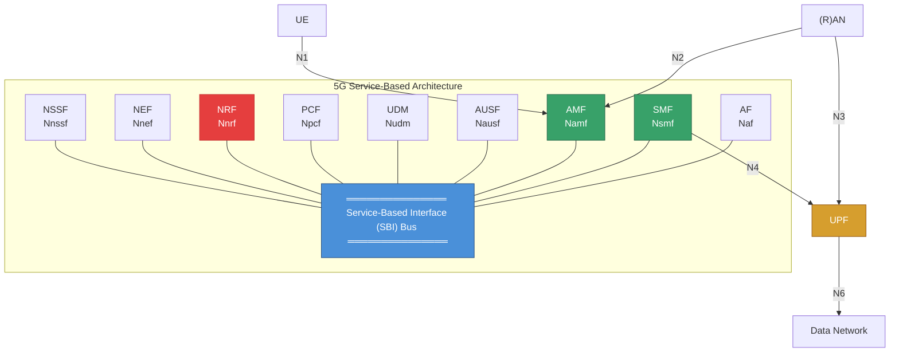
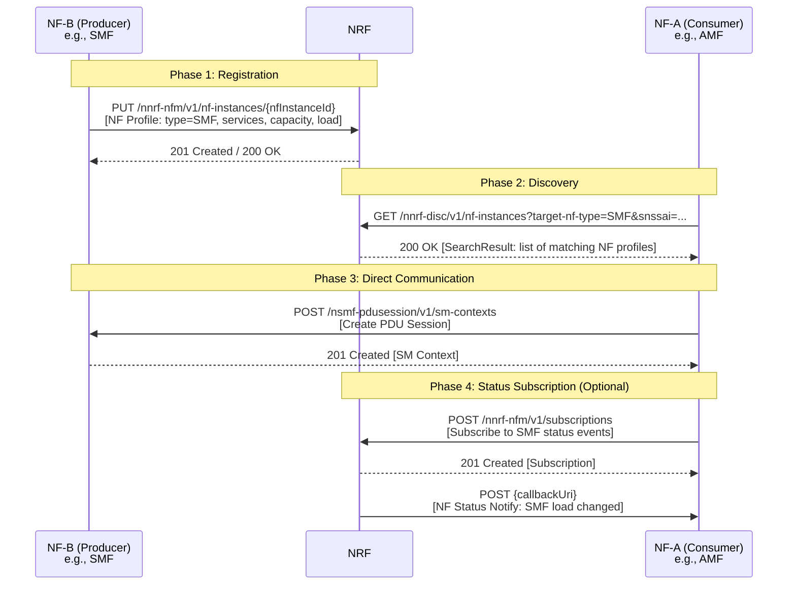
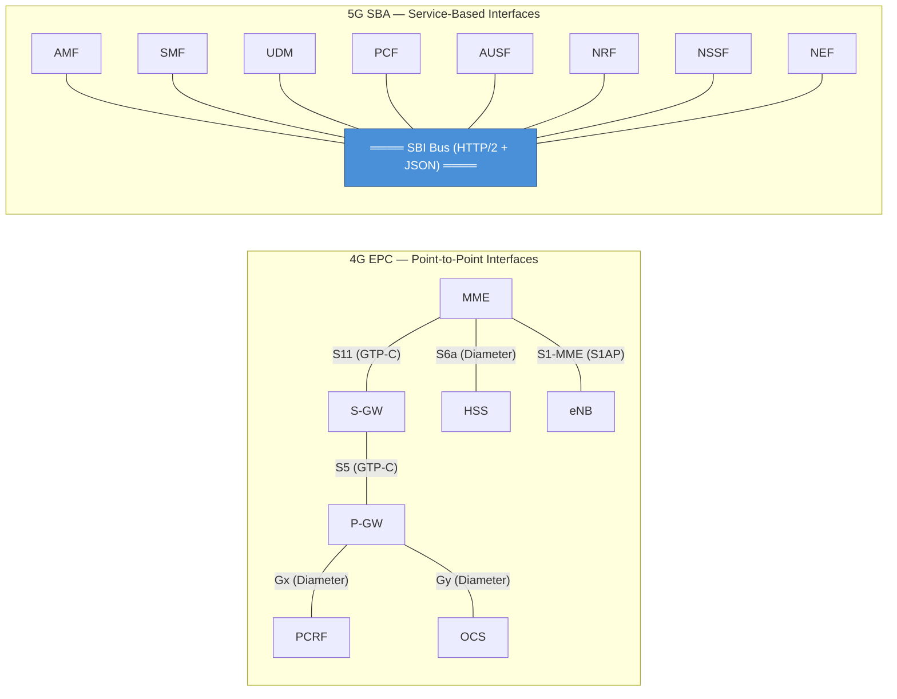

# Module 18: 5G Service-Based Architecture (SBA)

## Learning Objectives

By the end of this module, you will be able to:
- Explain why 5G abandoned EPC's point-to-point interface model
- Describe SBA design principles and the role of HTTP/2, JSON, and REST
- Identify all 5G Core Network Functions and their services
- Explain the NRF's critical role in service discovery
- Compare direct vs indirect (SCP) communication models
- Contrast EPC architecture with 5G SBA

---

## 1. Why 5G Moved Away from EPC Point-to-Point Interfaces

### 1.1 The EPC Problem

In 4G/LTE, the Evolved Packet Core (EPC) uses **point-to-point reference points** between network elements:

| Element Pair | Interface |
|---|---|
| MME ↔ S-GW | S11 |
| MME ↔ HSS | S6a |
| S-GW ↔ P-GW | S5/S8 |
| MME ↔ eNB | S1-MME |
| P-GW ↔ PCRF | Gx |

**The scaling problem:**
- With N network elements, you need up to **N×(N-1)/2** unique reference points
- Each interface has its own protocol specification (Diameter, GTP-C, etc.)
- Adding a new network element requires defining new interfaces to every existing element
- Rigid coupling makes evolution extremely difficult
- Vendor interoperability requires testing every interface combination

**Example:** EPC with 6 core elements → up to 15 unique interfaces, each with its own protocol, message formats, and procedures.

### 1.2 The SBA Solution

5G introduces **Service-Based Architecture** where:

- Network Functions (NFs) expose **services** via a common interface framework
- Any NF can **discover and consume** any other NF's services
- Adding a new NF only requires registering its services — no new interfaces needed
- Common protocol stack (HTTP/2 + JSON) for all control plane communication

### 1.3 Cloud-Native Principles

SBA embraces cloud-native design:

| Principle | Implementation in 5G SBA |
|---|---|
| **Microservices** | Each NF is decomposed into independent services |
| **Stateless** | NF instances don't store session state locally (externalized to data stores) |
| **Horizontal scaling** | Add more NF instances behind load balancers |
| **Containerization** | NFs deployed as containers in Kubernetes |
| **CI/CD** | Independent NF lifecycle management |
| **Service mesh** | SCP provides routing, load balancing, observability |

---

## 2. SBA Design Principles

### 2.1 Service-Based Interfaces (SBI) vs Reference Points

```
EPC (Reference Points):          5G SBA (Service-Based):
                                  
  MME ----S11---- S-GW              ┌─────────────────────────────┐
   |                |               │    Common Service Bus (SBI)  │
  S6a             S5/S8             └──┬───┬───┬───┬───┬───┬───┬──┘
   |                |                  │   │   │   │   │   │   │
  HSS             P-GW               AMF SMF PCF UDM AUSF NRF NSSF
                                     Namf Nsmf Npcf Nudm Nausf Nnrf Nnssf
```

**Reference Points (4G):** Each line is a unique protocol/interface specification
**Service-Based Interfaces (5G):** All NFs connect to a common bus using the same protocol framework

### 2.2 NF Service Interaction Models

NFs communicate using two patterns:

**1. Request-Response (Synchronous)**
- NF Consumer sends a request to NF Producer
- Producer processes and returns a response
- Example: AMF queries UDM for subscriber data

**2. Subscribe-Notify (Asynchronous)**
- NF Consumer subscribes to events from NF Producer
- Producer sends notifications when events occur
- Example: AMF subscribes to UDM for subscription data changes

### 2.3 HTTP/2 as Transport Protocol

5G SBA chose HTTP/2 over HTTP/1.1 for critical reasons:

| Feature | Benefit for 5G |
|---|---|
| **Multiplexing** | Multiple requests/responses over single TCP connection — reduces latency |
| **Header compression (HPACK)** | Reduces overhead for repetitive signaling headers |
| **Server push** | Enables efficient notification delivery |
| **Binary framing** | More efficient parsing than text-based HTTP/1.1 |
| **Stream prioritization** | Critical signaling (e.g., emergency calls) gets priority |

### 2.4 JSON as Data Format

| Reason | Explanation |
|---|---|
| **Human-readable** | Easy debugging, logging, troubleshooting |
| **Web-native** | Leverages massive web ecosystem tooling |
| **Tooling** | Validators, editors, parsers available in every language |
| **Schema support** | OpenAPI/JSON Schema for API definition |
| **Lightweight** | Less verbose than XML (used in older 3GPP specs) |

### 2.5 REST API Design Principles

5G SBA APIs follow RESTful conventions:

- **Resources** identified by URIs: `https://{nfInstanceId}.5gc.mnc{MNC}.mcc{MCC}/nsmf-pdusession/v1/sm-contexts`
- **HTTP methods** map to operations: GET (read), POST (create), PUT (update), DELETE (remove), PATCH (partial update)
- **Stateless** requests — each request contains all necessary context
- **HATEOAS** — responses include links to related resources
- **API versioning** — version in URI path (v1, v2)

---


## 3. 5G Core Network Functions

### SBA Architecture Diagram



### 3.1 AMF — Access and Mobility Management Function

**Purpose:** Handles all access and mobility-related signaling for the UE.

**Service Interface:** `Namf`

**Key Services:**
| Service | Description |
|---|---|
| `Namf_Communication` | N1/N2 message transport, UE-specific signaling |
| `Namf_EventExposure` | Expose mobility events (location, reachability) |
| `Namf_MT` | Mobile-terminated message delivery |
| `Namf_Location` | UE location services |

**Key Responsibilities:**
- UE registration and deregistration
- Connection management (idle ↔ connected)
- Mobility management (handover, tracking area updates)
- Security context management (NAS encryption/integrity)
- Relay NAS-SM messages between UE and SMF

---

### 3.2 SMF — Session Management Function

**Purpose:** Manages PDU (data) sessions between UE and Data Network.

**Service Interface:** `Nsmf`

**Key Services:**
| Service | Description |
|---|---|
| `Nsmf_PDUSession` | Create, modify, release PDU sessions |
| `Nsmf_EventExposure` | PDU session events (e.g., IP address change) |

**Key Responsibilities:**
- PDU session establishment, modification, release
- UE IP address allocation and management
- UPF selection and control (via N4/PFCP)
- QoS flow management and enforcement
- Downlink data notification
- Traffic steering and routing configuration

---

### 3.3 UPF — User Plane Function

**Purpose:** Forwards user data packets between RAN and Data Networks.

**⚠️ Note:** UPF does NOT use SBI. It uses reference points:
- **N3** — between RAN and UPF (GTP-U tunnel)
- **N4** — between SMF and UPF (PFCP protocol)
- **N6** — between UPF and Data Network (IP traffic)
- **N9** — between UPFs (inter-UPF GTP-U tunnel)

**Key Responsibilities:**
- Packet routing and forwarding
- QoS handling (marking, policing, shaping)
- Traffic usage reporting
- Uplink traffic verification
- Lawful intercept (user plane)
- Buffering of downlink packets (UE in idle mode)

---

### 3.4 UDM — Unified Data Management

**Purpose:** Manages subscriber data and computes authentication credentials.

**Service Interface:** `Nudm`

**Key Services:**
| Service | Description |
|---|---|
| `Nudm_SubscriberDataManagement` | Retrieve/update subscription data |
| `Nudm_UEContextManagement` | Track which AMF/SMF serves a UE |
| `Nudm_UEAuthentication` | Generate authentication vectors |
| `Nudm_EventExposure` | Subscription data change notifications |

**Key Responsibilities:**
- Stores subscription data (authorized slices, QoS profiles, DNN permissions)
- Computes authentication credentials (using SUPI, K, OPc)
- Manages UE context registration (serving AMF, serving SMF)
- De-concealment of SUCI → SUPI

---

### 3.5 AUSF — Authentication Server Function

**Purpose:** Executes the authentication procedure for UEs.

**Service Interface:** `Nausf`

**Key Services:**
| Service | Description |
|---|---|
| `Nausf_UEAuthentication` | Perform 5G-AKA or EAP-AKA' authentication |
| `Nausf_SoRProtection` | Steering of Roaming security |

**Key Responsibilities:**
- Authenticates UEs during registration
- Supports 5G-AKA and EAP-AKA' methods
- Stores intermediate key material (KAUSF)
- Interfaces with UDM for authentication vectors

---

### 3.6 PCF — Policy Control Function

**Purpose:** Provides policy rules governing network behavior and QoS.

**Service Interface:** `Npcf`

**Key Services:**
| Service | Description |
|---|---|
| `Npcf_SMPolicyControl` | Session-level policies (QoS, charging, gating) |
| `Npcf_AMPolicyControl` | Access and mobility policies (RFSP, service area) |
| `Npcf_PolicyAuthorization` | AF-triggered policy (e.g., IMS requests QoS) |
| `Npcf_BDTPolicyControl` | Background data transfer policies |
| `Npcf_EventExposure` | Policy-related event notifications |

**Key Responsibilities:**
- QoS policy decisions
- Charging policy rules
- Access control and gating decisions
- Network slicing policies
- Usage monitoring control

---

### 3.7 NRF — Network Repository Function

**Purpose:** The **central registry** of all NF instances and their services — the backbone of SBA.

**Service Interface:** `Nnrf`

**Key Services:**
| Service | Description |
|---|---|
| `Nnrf_NFManagement` | NF registration, update, deregistration |
| `Nnrf_NFDiscovery` | Query available NFs by type, slice, location |
| `Nnrf_AccessToken` | Issue OAuth2.0 tokens for NF-to-NF authorization |

> 🔑 **NRF is the critical enabler of SBA** — without it, NFs cannot discover each other and the service-based model collapses back to static configuration.

---

### 3.8 NSSF — Network Slice Selection Function

**Purpose:** Selects the appropriate network slice instance for a UE.

**Service Interface:** `Nnssf`

**Key Services:**
| Service | Description |
|---|---|
| `Nnssf_NSSelection` | Determine allowed slices and target AMF set |
| `Nnssf_NSSAIAvailability` | Manage NSSAI availability per tracking area |

**Key Responsibilities:**
- Determines the Allowed NSSAI for UE registration
- Selects target AMF Set/AMF based on requested slices
- Manages per-TA NSSAI availability information

---

### 3.9 NEF — Network Exposure Function

**Purpose:** Securely exposes 5G network capabilities to external applications.

**Service Interface:** `Nnef`

**Key Services:**
| Service | Description |
|---|---|
| `Nnef_EventExposure` | Expose network events to AFs |
| `Nnef_PFDManagement` | Packet Flow Description management |
| `Nnef_TrafficInfluence` | Allow AF to influence traffic routing |
| `Nnef_ParameterProvision` | Provision expected UE behavior |

**Key Responsibilities:**
- API gateway between 5G core and external world
- Translates internal 5GC information to external representations
- Enforces security policies on external access
- Rate limiting and API management

---

### 3.10 AF — Application Function

**Purpose:** Represents third-party applications that interact with the 5G core.

**Service Interface:** `Naf`

**Key Responsibilities:**
- Requests QoS for application flows (e.g., video streaming)
- Influences traffic routing (e.g., edge computing)
- Subscribes to network events (e.g., UE location)
- Can access 5GC directly (trusted) or via NEF (untrusted)

**Examples:** IMS (VoNR), streaming platforms, enterprise applications, MEC orchestrators.

---


## 4. NRF — The Key Enabler of SBA

The NRF is the **most critical component** that makes SBA work. Without NRF, 5G would revert to static, pre-configured connections like EPC.

### 4.1 NF Registration

When an NF instance starts, it **registers** with the NRF by providing its **NF Profile**:

```json
{
  "nfInstanceId": "3fa85f64-5717-4562-b3fc-2c963f66afa6",
  "nfType": "SMF",
  "nfStatus": "REGISTERED",
  "heartBeatTimer": 30,
  "plmnList": [{"mcc": "310", "mnc": "014"}],
  "sNssais": [{"sst": 1, "sd": "000001"}],
  "fqdn": "smf1.5gc.mnc014.mcc310.3gppnetwork.org",
  "ipv4Addresses": ["10.10.10.5"],
  "nfServices": [
    {
      "serviceInstanceId": "nsmf-pdusession-01",
      "serviceName": "nsmf-pdusession",
      "versions": [{"apiVersionInUri": "v1", "apiFullVersion": "1.2.0"}],
      "scheme": "https",
      "nfServiceStatus": "REGISTERED",
      "capacity": 100,
      "load": 25,
      "priority": 1
    }
  ],
  "smfInfo": {
    "sNssaiSmfInfoList": [{"sNssai": {"sst": 1}, "dnnSmfInfoList": [{"dnn": "internet"}]}]
  },
  "capacity": 100,
  "load": 25,
  "locality": "DC-East-1"
}
```

**NF Profile contains:**
- **NF Type** — what kind of NF (AMF, SMF, PCF, etc.)
- **Services offered** — list of service names and versions
- **Capacity** — relative capacity for load balancing (0-65535)
- **Load** — current load percentage (0-100)
- **Locality** — geographic/data center location for proximity-based selection
- **PLMN** — which networks this NF serves
- **S-NSSAI** — which slices this NF supports
- **IP/FQDN** — how to reach this NF

### 4.2 NF Discovery

When an NF needs a service, it queries the NRF:

```
GET /nnrf-disc/v1/nf-instances?target-nf-type=SMF&requester-nf-type=AMF&snssai={"sst":1,"sd":"000001"}&dnn=internet
```

**Discovery query parameters:**
| Parameter | Purpose |
|---|---|
| `target-nf-type` | Type of NF being searched (mandatory) |
| `requester-nf-type` | Type of the requesting NF (mandatory) |
| `service-names` | Specific services needed |
| `snssai` | Network slice filter |
| `dnn` | Data Network Name filter |
| `tai` | Tracking area for locality |
| `preferred-locality` | Prefer NFs in same data center |

**NRF returns:** Ranked list of matching NF instances with endpoints and load information.

### 4.3 NF Status Notification

NFs can **subscribe** to NRF for status events:

- NF registered / deregistered
- NF profile changed (load, capacity)
- NF service status changed

This enables:
- **AMF** to be notified when new SMFs become available
- **Load balancers** to update routing when NF load changes
- **Fault detection** when NF heartbeat expires

### NF Discovery Flow Diagram



---

## 5. Service Discovery and Communication Flow

### 5.1 Direct Communication

In the **direct model**, NF-A communicates directly with NF-B after discovery:

```
1. NF-A → NRF: "Find me an SMF for slice 1, DNN internet"
2. NRF → NF-A: "Here are 3 SMFs: SMF-1 (load=20%), SMF-2 (load=45%), SMF-3 (load=80%)"
3. NF-A selects SMF-1 (lowest load)
4. NF-A → SMF-1: Direct service request
```

**Advantages:** Low latency (no intermediate hop), simple
**Disadvantages:** NF-A must handle load balancing, retries, failover logic

### 5.2 Indirect Communication via SCP

The **Service Communication Proxy (SCP)** acts as an intermediary:

```
                    ┌──────────┐
                    │   NRF    │
                    └────┬─────┘
                         │ Discovery
                         │ (delegated or pre-loaded)
┌───────┐    Request    ┌┴────────┐    Request    ┌───────┐
│ NF-A  │──────────────→│   SCP   │──────────────→│ NF-B  │
│       │←──────────────│         │←──────────────│       │
└───────┘    Response   └─────────┘    Response   └───────┘
```

**SCP provides:**
- Delegated discovery (SCP queries NRF on behalf of NF-A)
- Load balancing across NF-B instances
- Message routing and topology hiding
- Retry and failover logic
- Monitoring and observability
- Connection pooling

**Communication Models (3GPP TS 23.501):**
| Model | Discovery | Routing |
|---|---|---|
| Model A | NF-A via NRF | Direct NF-A → NF-B |
| Model B | NF-A via NRF | Via SCP (NF-A → SCP → NF-B) |
| Model C | Delegated to SCP | Via SCP (NF-A → SCP → NF-B) |
| Model D | Delegated to SCP | Direct NF-A → NF-B |

---

## 6. SBI Protocol Stack

### Complete Protocol Stack

```
┌──────────────────────────────────────┐
│   5G NF Service Layer                │
│   (Namf, Nsmf, Npcf, Nudm, etc.)    │
├──────────────────────────────────────┤
│   REST API (OpenAPI 3.0 spec)        │
├──────────────────────────────────────┤
│   Serialization: JSON                │
├──────────────────────────────────────┤
│   Authorization: OAuth 2.0           │
│   (NRF as Authorization Server)      │
├──────────────────────────────────────┤
│   Transport: HTTP/2                  │
├──────────────────────────────────────┤
│   Security: TLS 1.2+ (mutual TLS)   │
├──────────────────────────────────────┤
│   TCP/IP                             │
└──────────────────────────────────────┘
```

### OAuth 2.0 for NF Authorization

Before NF-A can call NF-B's service, it must obtain an **access token** from the NRF:

```
1. NF-A → NRF: POST /oauth2/token
   {
     "grant_type": "client_credentials",
     "nfInstanceId": "{NF-A ID}",
     "nfType": "AMF",
     "targetNfType": "SMF",
     "scope": "nsmf-pdusession"
   }
   
2. NRF → NF-A: Access Token (JWT)
   {
     "access_token": "eyJ...",
     "token_type": "Bearer",
     "expires_in": 3600,
     "scope": "nsmf-pdusession"
   }

3. NF-A → NF-B: Service Request + Authorization: Bearer eyJ...
4. NF-B validates the token (signature, expiry, scope)
```

---

## 7. Comparison: EPC Interfaces vs 5G SBA

### EPC vs SBA Comparison Diagram



### Detailed Comparison Table

| Aspect | 4G EPC | 5G SBA |
|---|---|---|
| **Architecture** | Point-to-point reference points | Service-based interfaces on common bus |
| **Protocols** | Diameter, GTP-C, S1AP (multiple) | HTTP/2 + JSON (unified) |
| **Coupling** | Tight — each pair has unique interface | Loose — common framework for all |
| **Adding new NF** | Define new interfaces to all peers | Register services with NRF |
| **Discovery** | Static configuration | Dynamic via NRF |
| **Scaling** | Scale entire monolithic element | Scale individual NF services independently |
| **Deployment** | Hardware appliances / VMs | Cloud-native containers (Kubernetes) |
| **State** | Stateful network elements | Stateless NFs (externalized state) |
| **Redundancy** | Active-standby pairs | Horizontal scaling + NRF re-selection |
| **Load balancing** | DNS-based or static | NRF-based (capacity, load, locality) |
| **Authorization** | Hop-by-hop TLS | End-to-end OAuth 2.0 tokens |
| **API definition** | 3GPP-specific ASN.1/XML | OpenAPI 3.0 (industry standard) |
| **Extensibility** | New release = new interfaces | New services registered dynamically |
| **Vendor ecosystem** | Telecom-specific vendors | Cloud/IT vendors can participate |

### Functional Mapping: EPC → 5G

| EPC Element | 5G Equivalent | Key Difference |
|---|---|---|
| MME | AMF + SMF | Separated access/mobility from session mgmt |
| S-GW + P-GW | UPF | Simplified to single user plane element |
| HSS | UDM + AUSF | Separated data storage from authentication |
| PCRF | PCF | Same role, now on SBI |
| — (new) | NRF | Service registry (no EPC equivalent!) |
| — (new) | NSSF | Slice selection (no slicing in 4G) |
| — (new) | NEF | Replaces SCEF with richer API exposure |

---

## Summary

| Concept | Key Takeaway |
|---|---|
| **SBA motivation** | EPC's N×(N-1)/2 interfaces don't scale; SBA uses a common bus |
| **Design principles** | HTTP/2, JSON, REST, microservices, stateless |
| **NRF** | Heart of SBA — registration, discovery, authorization |
| **Communication** | Direct (NF→NF) or Indirect (via SCP) |
| **Security** | mTLS + OAuth 2.0 tokens from NRF |
| **Key difference** | EPC = static, rigid, monolithic; SBA = dynamic, flexible, cloud-native |

---

## Review Questions

1. Calculate how many unique interfaces are needed for 8 EPC elements. How does SBA solve this?
2. Why was HTTP/2 chosen over HTTP/1.1 for SBI?
3. What information is included in an NF Profile during NRF registration?
4. Why is the UPF not connected to the SBI bus?
5. Compare SCP communication Models B and C — when would you use each?
6. How does OAuth 2.0 work in the 5G SBA context? What role does NRF play?
7. An operator wants to add a new Analytics NF (NWDAF). Compare the effort in EPC vs SBA architecture.
8. Why is NRF considered the "single most critical" component of SBA?

---

## References

- 3GPP TS 23.501 — System Architecture for the 5G System (Stage 2)
- 3GPP TS 23.502 — Procedures for the 5G System (Stage 2)
- 3GPP TS 29.510 — NRF Services (Stage 3)
- 3GPP TS 29.500 — Technical Realization of Service-Based Architecture
- 3GPP TS 33.501 — Security Architecture and Procedures for 5G System
