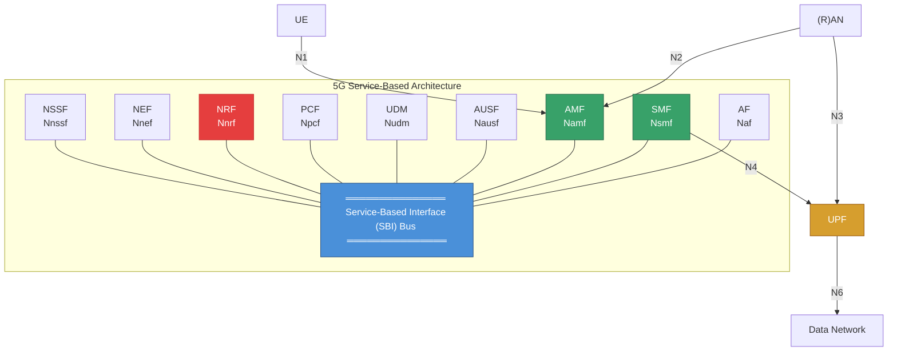
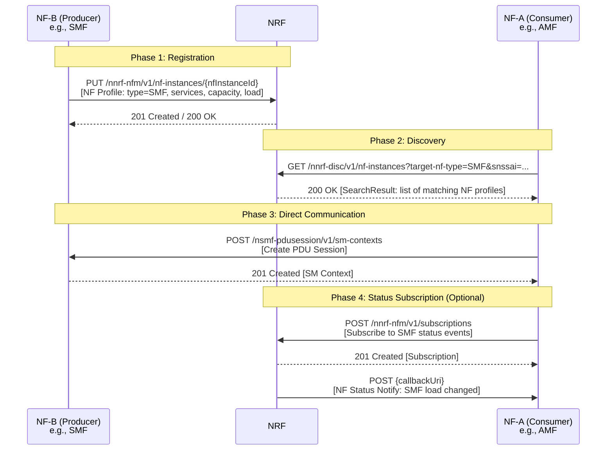
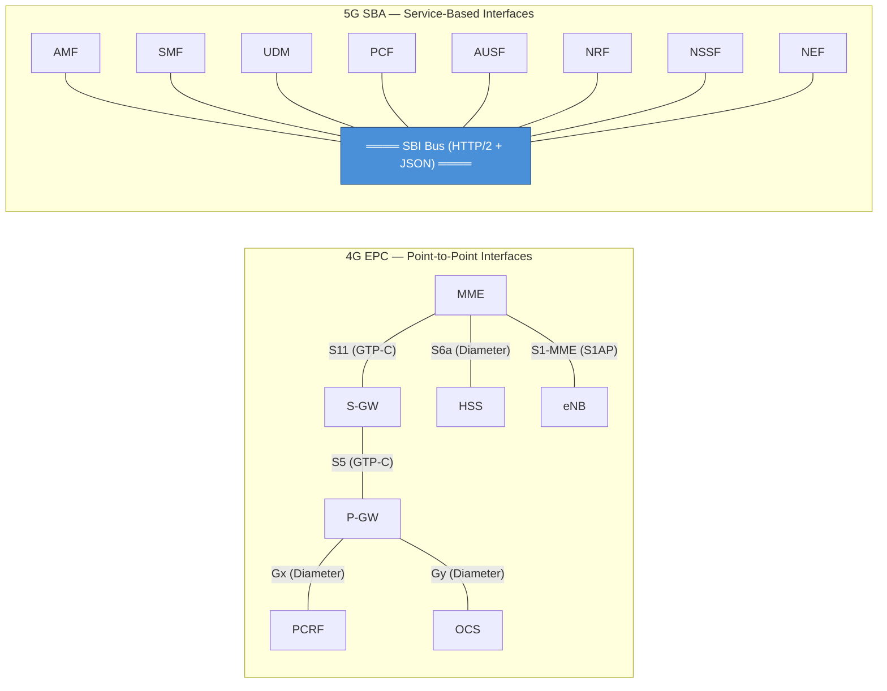

# ماژول 18: معماری خدمات‌محور 5G (SBA)

## اهداف یادگیری

در پایان این ماژول، شما قادر خواهید بود:
- توضیح دهید چرا 5G مدل واسط نقطه-به-نقطه EPC را رها کرد
- اصول طراحی SBA و نقش HTTP/2، JSON و REST را توصیف کنید
- تمام توابع شبکه هسته 5G و خدمات آن‌ها را شناسایی کنید
- نقش حیاتی NRF در کشف خدمات را توضیح دهید
- مدل‌های ارتباطی مستقیم در برابر غیرمستقیم (SCP) را مقایسه کنید
- معماری EPC را با SBA در 5G مقایسه کنید

---

## 1. چرا 5G از واسط‌های نقطه-به-نقطه EPC فاصله گرفت

### 1.1 مشکل EPC

در 4G/LTE، هسته بسته تکامل‌یافته (EPC) از **نقاط مرجع نقطه-به-نقطه** بین عناصر شبکه استفاده می‌کند:

| جفت عنصر | واسط |
|---|---|
| MME ↔ S-GW | S11 |
| MME ↔ HSS | S6a |
| S-GW ↔ P-GW | S5/S8 |
| MME ↔ eNB | S1-MME |
| P-GW ↔ PCRF | Gx |

**مشکل مقیاس‌پذیری:**
- با N عنصر شبکه، تا **N×(N-1)/2** نقطه مرجع یکتا نیاز دارید
- هر واسط مشخصات پروتکل خود را دارد (Diameter، GTP-C و غیره)
- افزودن یک عنصر شبکه جدید نیازمند تعریف واسط‌های جدید به هر عنصر موجود است
- جفت‌شدگی سخت، تحول را بسیار دشوار می‌کند
- هم‌کنش‌گری سازندگان نیازمند آزمون هر ترکیب واسط است

**مثال:** EPC با 6 عنصر هسته ← تا 15 واسط یکتا، هر یک با پروتکل، قالب‌های پیام و رویه‌های خود.

### 1.2 راه‌حل SBA

5G **معماری خدمات‌محور** را معرفی می‌کند که در آن:

- توابع شبکه (NF) **خدمات** را از طریق یک چارچوب واسط مشترک ارائه می‌دهند
- هر NF می‌تواند خدمات هر NF دیگر را **کشف و مصرف** کند
- افزودن یک NF جدید فقط نیازمند ثبت خدمات آن است — بدون نیاز به واسط‌های جدید
- پشته پروتکل مشترک (HTTP/2 + JSON) برای تمام ارتباطات صفحه کنترل

### 1.3 اصول بومی-ابر

SBA طراحی بومی-ابر را در آغوش می‌گیرد:

| اصل | پیاده‌سازی در SBA 5G |
|---|---|
| **میکروسرویس‌ها** | هر NF به خدمات مستقل تجزیه می‌شود |
| **بدون حالت** | نمونه‌های NF وضعیت نشست را به‌صورت محلی ذخیره نمی‌کنند (به مخازن داده خارجی‌سازی می‌شود) |
| **مقیاس‌پذیری افقی** | نمونه‌های NF بیشتر پشت متعادل‌کننده‌های بار اضافه کنید |
| **کانتینری‌سازی** | NFها به‌عنوان کانتینر در Kubernetes مستقر می‌شوند |
| **CI/CD** | مدیریت چرخه عمر مستقل NF |
| **Service mesh** | SCP مسیریابی، توازن بار، دیدپذیری فراهم می‌کند |

---

## 2. اصول طراحی SBA

### 2.1 واسط‌های خدمات‌محور (SBI) در برابر نقاط مرجع

```
EPC (Reference Points):          5G SBA (Service-Based):
                                  
  MME ----S11---- S-GW              ┌─────────────────────────────┐
   |                |               │    Common Service Bus (SBI)  │
  S6a             S5/S8             └──┬───┬───┬───┬───┬───┬───┬──┘
   |                |                  │   │   │   │   │   │   │
  HSS             P-GW               AMF SMF PCF UDM AUSF NRF NSSF
                                     Namf Nsmf Npcf Nudm Nausf Nnrf Nnssf
```

**نقاط مرجع (4G):** هر خط یک مشخصات پروتکل/واسط یکتا است
**واسط‌های خدمات‌محور (5G):** تمام NFها با استفاده از همان چارچوب پروتکل به یک گذرگاه مشترک متصل می‌شوند

### 2.2 مدل‌های تعامل خدمات NF

NFها با استفاده از دو الگو ارتباط برقرار می‌کنند:

**1. درخواست-پاسخ (همگام)**
- مصرف‌کننده NF یک درخواست به تولیدکننده NF می‌فرستد
- تولیدکننده پردازش می‌کند و پاسخی بازمی‌گرداند
- مثال: AMF از UDM برای داده مشترک پرس‌وجو می‌کند

**2. اشتراک-اعلان (ناهمگام)**
- مصرف‌کننده NF به رویدادهای تولیدکننده NF اشتراک می‌کند
- تولیدکننده هنگام رخ‌دادن رویدادها اعلان می‌فرستد
- مثال: AMF به تغییرات داده اشتراک در UDM اشتراک می‌کند

### 2.3 HTTP/2 به‌عنوان پروتکل انتقال

SBA در 5G به دلایل حیاتی HTTP/2 را بر HTTP/1.1 ترجیح داد:

| ویژگی | مزیت برای 5G |
|---|---|
| **چندگانه‌سازی** | چندین درخواست/پاسخ روی یک اتصال TCP — کاهش تأخیر |
| **فشرده‌سازی سرآیند (HPACK)** | کاهش سربار برای سرآیندهای سیگنالینگ تکراری |
| **ارسال سرور** | تحویل کارآمد اعلان را ممکن می‌سازد |
| **قاب‌بندی دودویی** | تجزیه کارآمدتر از HTTP/1.1 متنی |
| **اولویت‌بندی جریان** | سیگنالینگ حیاتی (مثلاً تماس‌های اضطراری) اولویت می‌گیرد |

### 2.4 JSON به‌عنوان قالب داده

| دلیل | توضیح |
|---|---|
| **قابل خواندن توسط انسان** | اشکال‌زدایی، ثبت گزارش، عیب‌یابی آسان |
| **بومی-وب** | بهره‌گیری از ابزارهای عظیم اکوسیستم وب |
| **ابزارها** | اعتبارسنج‌ها، ویرایشگرها، تجزیه‌گرها در هر زبانی موجودند |
| **پشتیبانی طرح‌واره** | OpenAPI/JSON Schema برای تعریف API |
| **سبک** | کم‌حجم‌تر از XML (مورد استفاده در مشخصات قدیمی‌تر 3GPP) |

### 2.5 اصول طراحی API مبتنی بر REST

APIهای SBA در 5G از قراردادهای RESTful پیروی می‌کنند:

- **منابع** شناسایی‌شده با URI: `https://{nfInstanceId}.5gc.mnc{MNC}.mcc{MCC}/nsmf-pdusession/v1/sm-contexts`
- **متدهای HTTP** به عملیات نگاشت می‌شوند: GET (خواندن)، POST (ایجاد)، PUT (به‌روزرسانی)، DELETE (حذف)، PATCH (به‌روزرسانی جزئی)
- **درخواست‌های بدون حالت** — هر درخواست شامل تمام زمینه لازم است
- **HATEOAS** — پاسخ‌ها شامل پیوندهایی به منابع مرتبط هستند
- **نسخه‌بندی API** — نسخه در مسیر URI (v1، v2)

---


## 3. توابع شبکه هسته 5G

### نمودار معماری SBA



### 3.1 AMF — تابع مدیریت دسترسی و تحرک

**هدف:** تمام سیگنالینگ مرتبط با دسترسی و تحرک UE را مدیریت می‌کند.

**واسط خدمات:** `Namf`

**خدمات کلیدی:**
| خدمت | توضیح |
|---|---|
| `Namf_Communication` | انتقال پیام N1/N2، سیگنالینگ مختص UE |
| `Namf_EventExposure` | نمایش رویدادهای تحرک (مکان، دسترسی‌پذیری) |
| `Namf_MT` | تحویل پیام با مقصد موبایل |
| `Namf_Location` | خدمات مکان UE |

**مسئولیت‌های کلیدی:**
- ثبت‌نام و لغو ثبت‌نام UE
- مدیریت اتصال (بیکار ↔ متصل)
- مدیریت تحرک (تحویل، به‌روزرسانی نواحی ردیابی)
- مدیریت زمینه امنیتی (رمزنگاری/یکپارچگی NAS)
- رله پیام‌های NAS-SM بین UE و SMF

---

### 3.2 SMF — تابع مدیریت نشست

**هدف:** نشست‌های PDU (داده) بین UE و شبکه داده را مدیریت می‌کند.

**واسط خدمات:** `Nsmf`

**خدمات کلیدی:**
| خدمت | توضیح |
|---|---|
| `Nsmf_PDUSession` | ایجاد، اصلاح، آزادسازی نشست‌های PDU |
| `Nsmf_EventExposure` | رویدادهای نشست PDU (مثلاً تغییر آدرس IP) |

**مسئولیت‌های کلیدی:**
- برقراری، اصلاح، آزادسازی نشست PDU
- تخصیص و مدیریت آدرس IP کاربر
- انتخاب و کنترل UPF (از طریق N4/PFCP)
- مدیریت و اجرای جریان QoS
- اعلان داده پیوند پایین‌سو
- پیکربندی هدایت و مسیریابی ترافیک

---

### 3.3 UPF — تابع صفحه کاربر

**هدف:** بسته‌های داده کاربر را بین RAN و شبکه‌های داده ارسال می‌کند.

**⚠️ یادداشت:** UPF از SBI استفاده **نمی‌کند**. از نقاط مرجع استفاده می‌کند:
- **N3** — بین RAN و UPF (تونل GTP-U)
- **N4** — بین SMF و UPF (پروتکل PFCP)
- **N6** — بین UPF و شبکه داده (ترافیک IP)
- **N9** — بین UPFها (تونل GTP-U بین-UPF)

**مسئولیت‌های کلیدی:**
- مسیریابی و ارسال بسته
- مدیریت QoS (علامت‌گذاری، پلیسینگ، شکل‌دهی)
- گزارش‌دهی مصرف ترافیک
- تأیید ترافیک پیوند بالاسو
- رهگیری قانونی (صفحه کاربر)
- بافرینگ بسته‌های پیوند پایین‌سو (UE در حالت بیکار)

---

### 3.4 UDM — مدیریت داده یکپارچه

**هدف:** داده مشترک را مدیریت و اعتبارنامه‌های احراز هویت را محاسبه می‌کند.

**واسط خدمات:** `Nudm`

**خدمات کلیدی:**
| خدمت | توضیح |
|---|---|
| `Nudm_SubscriberDataManagement` | بازیابی/به‌روزرسانی داده اشتراک |
| `Nudm_UEContextManagement` | ردیابی اینکه کدام AMF/SMF به UE خدمات می‌دهد |
| `Nudm_UEAuthentication` | تولید بردارهای احراز هویت |
| `Nudm_EventExposure` | اعلان‌های تغییر داده اشتراک |

**مسئولیت‌های کلیدی:**
- ذخیره داده اشتراک (برش‌های مجاز، پروفایل‌های QoS، مجوزهای DNN)
- محاسبه اعتبارنامه‌های احراز هویت (با استفاده از SUPI، K، OPc)
- مدیریت ثبت‌نام زمینه UE (AMF خدمات‌دهنده، SMF خدمات‌دهنده)
- رمزگشایی SUCI ← SUPI

---

### 3.5 AUSF — تابع سرور احراز هویت

**هدف:** رویه احراز هویت برای UEها را اجرا می‌کند.

**واسط خدمات:** `Nausf`

**خدمات کلیدی:**
| خدمت | توضیح |
|---|---|
| `Nausf_UEAuthentication` | انجام احراز هویت 5G-AKA یا EAP-AKA' |
| `Nausf_SoRProtection` | امنیت هدایت رومینگ |

**مسئولیت‌های کلیدی:**
- احراز هویت UEها در حین ثبت‌نام
- پشتیبانی از روش‌های 5G-AKA و EAP-AKA'
- ذخیره مواد کلید میانی (KAUSF)
- واسط با UDM برای بردارهای احراز هویت

---

### 3.6 PCF — تابع کنترل سیاست

**هدف:** قواعد سیاستی که رفتار شبکه و QoS را اداره می‌کنند فراهم می‌کند.

**واسط خدمات:** `Npcf`

**خدمات کلیدی:**
| خدمت | توضیح |
|---|---|
| `Npcf_SMPolicyControl` | سیاست‌های سطح نشست (QoS، صورت‌حساب، دروازه‌بندی) |
| `Npcf_AMPolicyControl` | سیاست‌های دسترسی و تحرک (RFSP، ناحیه خدمات) |
| `Npcf_PolicyAuthorization` | سیاست با محرک AF (مثلاً IMS درخواست QoS می‌کند) |
| `Npcf_BDTPolicyControl` | سیاست‌های انتقال داده پس‌زمینه |
| `Npcf_EventExposure` | اعلان‌های رویداد مرتبط با سیاست |

**مسئولیت‌های کلیدی:**
- تصمیمات سیاست QoS
- قواعد سیاست صورت‌حساب
- تصمیمات کنترل دسترسی و دروازه‌بندی
- سیاست‌های شبکه‌بندی
- کنترل پایش مصرف

---

### 3.7 NRF — تابع مخزن شبکه

**هدف:** **ثبت مرکزی** تمام نمونه‌های NF و خدمات آن‌ها — ستون فقرات SBA.

**واسط خدمات:** `Nnrf`

**خدمات کلیدی:**
| خدمت | توضیح |
|---|---|
| `Nnrf_NFManagement` | ثبت‌نام، به‌روزرسانی، لغو ثبت‌نام NF |
| `Nnrf_NFDiscovery` | پرس‌وجوی NFهای موجود بر اساس نوع، برش، مکان |
| `Nnrf_AccessToken` | صدور نشانه‌های OAuth2.0 برای مجوزدهی NF-به-NF |

> 🔑 **NRF توانمندساز حیاتی SBA است** — بدون آن، NFها نمی‌توانند یکدیگر را کشف کنند و مدل خدمات‌محور به پیکربندی ایستا بازمی‌گردد.

---

### 3.8 NSSF — تابع انتخاب برش شبکه

**هدف:** نمونه برش شبکه مناسب را برای UE انتخاب می‌کند.

**واسط خدمات:** `Nnssf`

**خدمات کلیدی:**
| خدمت | توضیح |
|---|---|
| `Nnssf_NSSelection` | تعیین برش‌های مجاز و مجموعه AMF هدف |
| `Nnssf_NSSAIAvailability` | مدیریت دسترسی‌پذیری NSSAI در هر ناحیه ردیابی |

**مسئولیت‌های کلیدی:**
- تعیین NSSAI مجاز برای ثبت‌نام UE
- انتخاب مجموعه AMF/AMF هدف بر اساس برش‌های درخواستی
- مدیریت اطلاعات دسترسی‌پذیری NSSAI در هر TA

---

### 3.9 NEF — تابع نمایش شبکه

**هدف:** قابلیت‌های شبکه 5G را به‌صورت ایمن به کاربردهای خارجی نمایش می‌دهد.

**واسط خدمات:** `Nnef`

**خدمات کلیدی:**
| خدمت | توضیح |
|---|---|
| `Nnef_EventExposure` | نمایش رویدادهای شبکه به AFها |
| `Nnef_PFDManagement` | مدیریت توصیف جریان بسته |
| `Nnef_TrafficInfluence` | امکان تأثیر AF بر مسیریابی ترافیک |
| `Nnef_ParameterProvision` | تأمین رفتار مورد انتظار UE |

**مسئولیت‌های کلیدی:**
- دروازه API بین هسته 5G و دنیای خارجی
- ترجمه اطلاعات داخلی 5GC به بازنمایی‌های خارجی
- اجرای سیاست‌های امنیتی بر دسترسی خارجی
- محدودسازی نرخ و مدیریت API

---

### 3.10 AF — تابع کاربرد

**هدف:** نمایندگی کاربردهای شخص سوم که با هسته 5G تعامل دارند.

**واسط خدمات:** `Naf`

**مسئولیت‌های کلیدی:**
- درخواست QoS برای جریان‌های کاربرد (مثلاً پخش جریانی ویدیو)
- تأثیر بر مسیریابی ترافیک (مثلاً رایانش لبه)
- اشتراک در رویدادهای شبکه (مثلاً مکان UE)
- می‌تواند مستقیماً به 5GC دسترسی یابد (مورد اعتماد) یا از طریق NEF (غیرقابل اعتماد)

**مثال‌ها:** IMS (VoNR)، پلتفرم‌های پخش جریانی، کاربردهای سازمانی، هماهنگ‌سازهای MEC.

---


## 4. NRF — توانمندساز کلیدی SBA

NRF **حیاتی‌ترین مؤلفه** است که SBA را کار می‌اندازد. بدون NRF، 5G به اتصالات ایستا و پیش‌پیکربندی‌شده مانند EPC بازمی‌گشت.

### 4.1 ثبت‌نام NF

وقتی یک نمونه NF راه‌اندازی می‌شود، با ارائه **پروفایل NF** خود در NRF **ثبت‌نام** می‌کند:

```json
{
  "nfInstanceId": "3fa85f64-5717-4562-b3fc-2c963f66afa6",
  "nfType": "SMF",
  "nfStatus": "REGISTERED",
  "heartBeatTimer": 30,
  "plmnList": [{"mcc": "310", "mnc": "014"}],
  "sNssais": [{"sst": 1, "sd": "000001"}],
  "fqdn": "smf1.5gc.mnc014.mcc310.3gppnetwork.org",
  "ipv4Addresses": ["10.10.10.5"],
  "nfServices": [
    {
      "serviceInstanceId": "nsmf-pdusession-01",
      "serviceName": "nsmf-pdusession",
      "versions": [{"apiVersionInUri": "v1", "apiFullVersion": "1.2.0"}],
      "scheme": "https",
      "nfServiceStatus": "REGISTERED",
      "capacity": 100,
      "load": 25,
      "priority": 1
    }
  ],
  "smfInfo": {
    "sNssaiSmfInfoList": [{"sNssai": {"sst": 1}, "dnnSmfInfoList": [{"dnn": "internet"}]}]
  },
  "capacity": 100,
  "load": 25,
  "locality": "DC-East-1"
}
```

**پروفایل NF شامل موارد زیر است:**
- **نوع NF** — چه نوع NF (AMF، SMF، PCF و غیره)
- **خدمات ارائه‌شده** — فهرست نام‌ها و نسخه‌های خدمات
- **ظرفیت** — ظرفیت نسبی برای توازن بار (0-65535)
- **بار** — درصد بار فعلی (0-100)
- **محلیت** — مکان جغرافیایی/مرکز داده برای انتخاب مبتنی بر نزدیکی
- **PLMN** — این NF به کدام شبکه‌ها خدمات می‌دهد
- **S-NSSAI** — این NF از کدام برش‌ها پشتیبانی می‌کند
- **IP/FQDN** — چگونه به این NF دسترسی یابیم

### 4.2 کشف NF

وقتی یک NF به خدمتی نیاز دارد، از NRF پرس‌وجو می‌کند:

```
GET /nnrf-disc/v1/nf-instances?target-nf-type=SMF&requester-nf-type=AMF&snssai={"sst":1,"sd":"000001"}&dnn=internet
```

**پارامترهای پرس‌وجوی کشف:**
| پارامتر | هدف |
|---|---|
| `target-nf-type` | نوع NF مورد جستجو (اجباری) |
| `requester-nf-type` | نوع NF درخواست‌کننده (اجباری) |
| `service-names` | خدمات مشخص مورد نیاز |
| `snssai` | فیلتر برش شبکه |
| `dnn` | فیلتر نام شبکه داده |
| `tai` | ناحیه ردیابی برای محلیت |
| `preferred-locality` | ترجیح NFها در همان مرکز داده |

**NRF بازمی‌گرداند:** فهرست رتبه‌بندی‌شده نمونه‌های NF منطبق با نقاط انتهایی و اطلاعات بار.

### 4.3 اعلان وضعیت NF

NFها می‌توانند در NRF برای رویدادهای وضعیت **اشتراک** کنند:

- NF ثبت‌نام شد / لغو ثبت‌نام شد
- پروفایل NF تغییر کرد (بار، ظرفیت)
- وضعیت خدمات NF تغییر کرد

این موارد را ممکن می‌سازد:
- **AMF** هنگام در دسترس قرار گرفتن SMFهای جدید مطلع شود
- **متعادل‌کننده‌های بار** هنگام تغییر بار NF مسیریابی را به‌روزرسانی کنند
- **تشخیص خطا** هنگام انقضای ضربان NF

### نمودار جریان کشف NF



---

## 5. جریان کشف و ارتباط خدمات

### 5.1 ارتباط مستقیم

در **مدل مستقیم**، NF-A پس از کشف مستقیماً با NF-B ارتباط برقرار می‌کند:

```
1. NF-A → NRF: "Find me an SMF for slice 1, DNN internet"
2. NRF → NF-A: "Here are 3 SMFs: SMF-1 (load=20%), SMF-2 (load=45%), SMF-3 (load=80%)"
3. NF-A selects SMF-1 (lowest load)
4. NF-A → SMF-1: Direct service request
```

**مزایا:** تأخیر کم (بدون گام واسطه)، ساده
**معایب:** NF-A باید منطق توازن بار، تلاش مجدد و تغییر مسیر را مدیریت کند

### 5.2 ارتباط غیرمستقیم از طریق SCP

**عامل ارتباط خدمات (SCP)** به‌عنوان واسطه عمل می‌کند:

```
                    ┌──────────┐
                    │   NRF    │
                    └────┬─────┘
                         │ Discovery
                         │ (delegated or pre-loaded)
┌───────┐    Request    ┌┴────────┐    Request    ┌───────┐
│ NF-A  │──────────────→│   SCP   │──────────────→│ NF-B  │
│       │←──────────────│         │←──────────────│       │
└───────┘    Response   └─────────┘    Response   └───────┘
```

**SCP فراهم می‌کند:**
- کشف واگذارشده (SCP به‌جای NF-A از NRF پرس‌وجو می‌کند)
- توازن بار در بین نمونه‌های NF-B
- مسیریابی پیام و پنهان‌سازی توپولوژی
- منطق تلاش مجدد و تغییر مسیر
- پایش و دیدپذیری
- استخرسازی اتصال

**مدل‌های ارتباطی (3GPP TS 23.501):**
| مدل | کشف | مسیریابی |
|---|---|---|
| مدل A | NF-A از طریق NRF | مستقیم NF-A ← NF-B |
| مدل B | NF-A از طریق NRF | از طریق SCP (NF-A ← SCP ← NF-B) |
| مدل C | واگذارشده به SCP | از طریق SCP (NF-A ← SCP ← NF-B) |
| مدل D | واگذارشده به SCP | مستقیم NF-A ← NF-B |

---

## 6. پشته پروتکل SBI

### پشته پروتکل کامل

```
┌──────────────────────────────────────┐
│   5G NF Service Layer                │
│   (Namf, Nsmf, Npcf, Nudm, etc.)    │
├──────────────────────────────────────┤
│   REST API (OpenAPI 3.0 spec)        │
├──────────────────────────────────────┤
│   Serialization: JSON                │
├──────────────────────────────────────┤
│   Authorization: OAuth 2.0           │
│   (NRF as Authorization Server)      │
├──────────────────────────────────────┤
│   Transport: HTTP/2                  │
├──────────────────────────────────────┤
│   Security: TLS 1.2+ (mutual TLS)   │
├──────────────────────────────────────┤
│   TCP/IP                             │
└──────────────────────────────────────┘
```

### OAuth 2.0 برای مجوزدهی NF

پیش از آنکه NF-A بتواند خدمت NF-B را فراخوانی کند، باید یک **نشانه دسترسی** از NRF دریافت کند:

```
1. NF-A → NRF: POST /oauth2/token
   {
     "grant_type": "client_credentials",
     "nfInstanceId": "{NF-A ID}",
     "nfType": "AMF",
     "targetNfType": "SMF",
     "scope": "nsmf-pdusession"
   }
   
2. NRF → NF-A: Access Token (JWT)
   {
     "access_token": "eyJ...",
     "token_type": "Bearer",
     "expires_in": 3600,
     "scope": "nsmf-pdusession"
   }

3. NF-A → NF-B: Service Request + Authorization: Bearer eyJ...
4. NF-B validates the token (signature, expiry, scope)
```

---

## 7. مقایسه: واسط‌های EPC در برابر SBA در 5G

### نمودار مقایسه EPC با SBA



### جدول مقایسه تفصیلی

| جنبه | EPC در 4G | SBA در 5G |
|---|---|---|
| **معماری** | نقاط مرجع نقطه-به-نقطه | واسط‌های خدمات‌محور روی گذرگاه مشترک |
| **پروتکل‌ها** | Diameter، GTP-C، S1AP (متعدد) | HTTP/2 + JSON (یکپارچه) |
| **جفت‌شدگی** | سخت — هر جفت واسط یکتا دارد | سست — چارچوب مشترک برای همه |
| **افزودن NF جدید** | تعریف واسط‌های جدید به همه همتاها | ثبت خدمات در NRF |
| **کشف** | پیکربندی ایستا | پویا از طریق NRF |
| **مقیاس‌پذیری** | مقیاس‌دهی کل عنصر یکپارچه | مقیاس‌دهی مستقل هر خدمت NF |
| **استقرار** | تجهیزات سخت‌افزاری / VM | کانتینرهای بومی-ابر (Kubernetes) |
| **حالت** | عناصر شبکه حالت‌دار | NFهای بدون حالت (حالت خارجی‌سازی‌شده) |
| **افزونگی** | جفت‌های فعال-آماده | مقیاس‌پذیری افقی + انتخاب مجدد NRF |
| **توازن بار** | مبتنی بر DNS یا ایستا | مبتنی بر NRF (ظرفیت، بار، محلیت) |
| **مجوزدهی** | TLS گام-به-گام | نشانه‌های OAuth 2.0 سرتاسری |
| **تعریف API** | ASN.1/XML اختصاصی 3GPP | OpenAPI 3.0 (استاندارد صنعت) |
| **قابلیت توسعه** | نسخه جدید = واسط‌های جدید | خدمات جدید به‌صورت پویا ثبت می‌شوند |
| **اکوسیستم سازندگان** | سازندگان مختص مخابرات | سازندگان ابر/IT می‌توانند مشارکت کنند |

### نگاشت عملکردی: EPC ← 5G

| عنصر EPC | معادل در 5G | تفاوت کلیدی |
|---|---|---|
| MME | AMF + SMF | جداسازی دسترسی/تحرک از مدیریت نشست |
| S-GW + P-GW | UPF | ساده‌شده به یک عنصر صفحه کاربر واحد |
| HSS | UDM + AUSF | جداسازی ذخیره‌سازی داده از احراز هویت |
| PCRF | PCF | همان نقش، اکنون روی SBI |
| — (جدید) | NRF | ثبت خدمات (بدون معادل در EPC!) |
| — (جدید) | NSSF | انتخاب برش (بدون شبکه‌بندی در 4G) |
| — (جدید) | NEF | جایگزین SCEF با نمایش API غنی‌تر |

---

## خلاصه

| مفهوم | نکته کلیدی |
|---|---|
| **انگیزه SBA** | واسط‌های N×(N-1)/2 در EPC مقیاس‌پذیر نیستند؛ SBA از گذرگاه مشترک استفاده می‌کند |
| **اصول طراحی** | HTTP/2، JSON، REST، میکروسرویس‌ها، بدون حالت |
| **NRF** | قلب SBA — ثبت‌نام، کشف، مجوزدهی |
| **ارتباط** | مستقیم (NF←NF) یا غیرمستقیم (از طریق SCP) |
| **امنیت** | mTLS + نشانه‌های OAuth 2.0 از NRF |
| **تفاوت کلیدی** | EPC = ایستا، سخت، یکپارچه؛ SBA = پویا، انعطاف‌پذیر، بومی-ابر |

---

## پرسش‌های مرور

1. محاسبه کنید برای 8 عنصر EPC چند واسط یکتا لازم است. SBA چگونه این را حل می‌کند؟
2. چرا HTTP/2 بر HTTP/1.1 برای SBI انتخاب شد؟
3. در حین ثبت‌نام NRF چه اطلاعاتی در پروفایل NF گنجانده می‌شود؟
4. چرا UPF به گذرگاه SBI متصل نیست؟
5. مدل‌های ارتباطی B و C در SCP را مقایسه کنید — چه زمانی هر یک را استفاده می‌کنید؟
6. OAuth 2.0 در بستر SBA در 5G چگونه کار می‌کند؟ NRF چه نقشی دارد؟
7. یک اپراتور می‌خواهد یک NF تحلیلی جدید (NWDAF) اضافه کند. میزان تلاش را در معماری EPC در برابر SBA مقایسه کنید.
8. چرا NRF به‌عنوان «تنها حیاتی‌ترین» مؤلفه SBA در نظر گرفته می‌شود؟

---

## مراجع

- 3GPP TS 23.501 — System Architecture for the 5G System (Stage 2)
- 3GPP TS 23.502 — Procedures for the 5G System (Stage 2)
- 3GPP TS 29.510 — NRF Services (Stage 3)
- 3GPP TS 29.500 — Technical Realization of Service-Based Architecture
- 3GPP TS 33.501 — Security Architecture and Procedures for 5G System
