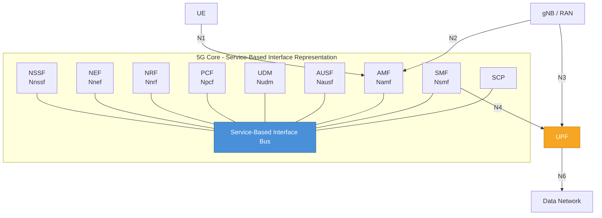
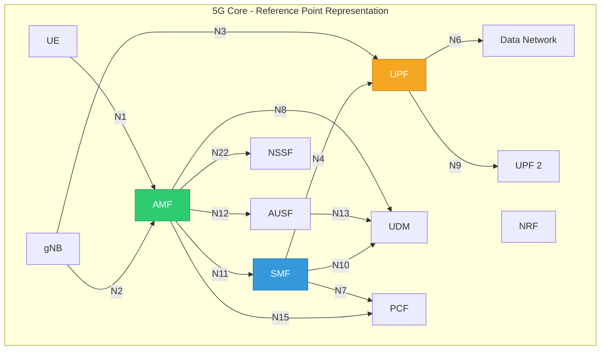
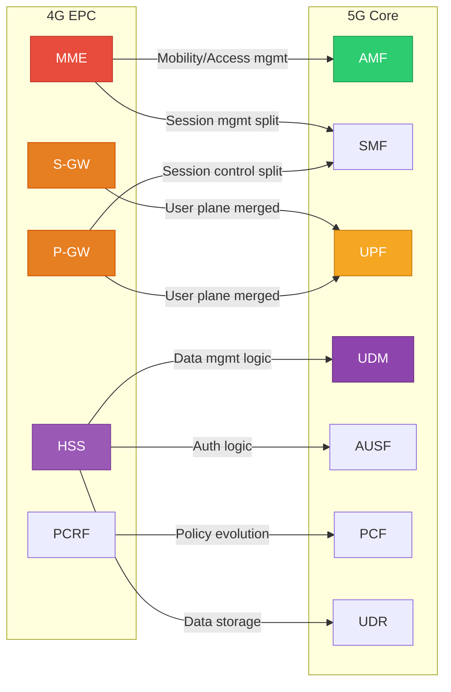
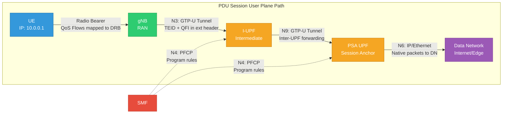

# Module 19: 5G Core Architecture

## 1. 5G Core Overview

The 5G Core (5GC) network is defined in **3GPP TS 23.501** and represents a fundamental redesign of the mobile core network. Unlike the 4G EPC which used point-to-point interfaces between monolithic network elements, the 5GC adopts a **Service-Based Architecture (SBA)** where Network Functions (NFs) expose services via RESTful APIs over HTTP/2.

### Key Design Principles

- **Service-Based Architecture (SBA):** NFs communicate via service-based interfaces (SBI) using HTTP/2 and JSON
- **Control and User Plane Separation (CUPS):** Complete decoupling of CP and UP
- **Stateless NF Design:** State stored externally (UDSF) enabling horizontal scaling
- **Network Slicing Native:** Built-in support for multiple logical networks on shared infrastructure
- **Cloud-Native:** Designed for containerized, microservice-based deployment
- **Registration-Based NF Discovery:** NFs register with NRF and discover peers dynamically

---

## 2. Reference Architecture

The 5GC architecture has two equivalent representations defined in TS 23.501:

### 2.1 Service-Based Interface (SBI) Representation

In this view, all control-plane NFs connect to a common service bus and expose/consume services.



### 2.2 Reference Point Representation

In this view, explicit point-to-point reference points are shown between NFs.



---


## 3. Network Functions in Detail

### 3.1 Access and Mobility Management Function (AMF)

The AMF is the single point of contact for all UE-related signaling from the RAN. It terminates the N1 (NAS) and N2 (NGAP) interfaces.

**Key Responsibilities:**
- **NAS Termination:** All NAS messages (Registration, Service Request, PDU Session Establishment) terminate at AMF
- **Registration Management:** Handles UE registration, deregistration, and periodic registration updates
- **Connection Management:** Manages RRC signaling context via N2 toward gNB
- **Mobility Management:** Handover signaling, tracking area management, paging coordination
- **Security:** Initiates authentication (delegates to AUSF), manages NAS security context (ciphering + integrity)
- **Slice Selection:** Interacts with NSSF to determine the appropriate network slice

**Key Identifiers:**

| Identifier | Description |
|---|---|
| **GUAMI** | Globally Unique AMF Identifier = MCC + MNC + AMF Region ID + AMF Set ID + AMF Pointer |
| **5G-GUTI** | 5G Globally Unique Temporary Identifier = GUAMI + 5G-TMSI (assigned to UE by AMF) |
| **AMF Region ID** | 8 bits — identifies a region within a PLMN |
| **AMF Set ID** | 10 bits — identifies an AMF Set within a region |
| **AMF Pointer** | 6 bits — identifies a specific AMF within a set |

**Interfaces:**
- **N1:** UE ↔ AMF (NAS signaling, carried transparently over RAN)
- **N2:** RAN ↔ AMF (NGAP protocol over SCTP)
- **N8:** AMF ↔ UDM (subscription data retrieval)
- **N11:** AMF ↔ SMF (session management messages)
- **N12:** AMF ↔ AUSF (authentication procedures)
- **N14:** AMF ↔ AMF (UE mobility between AMFs)
- **N15:** AMF ↔ PCF (access and mobility policy)
- **N22:** AMF ↔ NSSF (slice selection)

**Registration Area:**
- Composed of one or more Tracking Areas (TAs)
- UE only performs Registration Update when moving outside its Registration Area
- Larger registration areas → less signaling, more paging load
- AMF allocates the Registration Area based on UE mobility pattern

---

### 3.2 Session Management Function (SMF)

The SMF manages PDU sessions end-to-end. It selects and controls the UPF(s) that form the user plane path.

**Key Responsibilities:**
- **PDU Session Management:** Establishment, modification, and release of PDU sessions
- **UPF Selection and Control:** Selects appropriate UPF(s), programs forwarding rules via N4/PFCP
- **IP Address Allocation:** Assigns IPv4/IPv6 addresses to UEs (or delegates to external DHCP)
- **QoS Enforcement:** Installs QoS rules in UPF based on PCF policies
- **Roaming:** Handles home-routed and local breakout scenarios
- **Downlink Data Notification:** Triggers paging via AMF when downlink data arrives for idle UE

**PDU Session Types:**

| Type | Description | Use Case |
|---|---|---|
| **IPv4** | Traditional IPv4 connectivity | Legacy internet access |
| **IPv6** | IPv6-only connectivity | IoT, modern networks |
| **IPv4v6** | Dual-stack IPv4 + IPv6 | Default smartphone access |
| **Ethernet** | Layer-2 Ethernet frames | Industrial LAN extension, TSN |
| **Unstructured** | Raw IP or non-IP data | IoT sensors, point-to-point tunnels |

**N4 Interface and PFCP:**
- **N4** connects SMF to UPF using **PFCP (Packet Forwarding Control Protocol)** — 3GPP TS 29.244
- PFCP is a UDP-based protocol (port 8805) with:
  - **Session Establishment:** Create forwarding context in UPF
  - **Session Modification:** Update rules (e.g., handover, QoS change)
  - **Session Deletion:** Remove forwarding context
  - **Heartbeat:** Detect UPF failure

**Session Anchor:**
- The **PDU Session Anchor (PSA)** is the UPF that maintains a stable point of attachment to the Data Network
- Provides IP address continuity during UE mobility
- Does NOT change during handover (unlike intermediate UPFs)
- SMF may insert Intermediate UPFs (I-UPF) for local routing while keeping PSA stable

---

### 3.3 User Plane Function (UPF)

The UPF is the **only user-plane NF** in the 5G Core. It handles all packet processing, forwarding, and policy enforcement for user data.

**Key Responsibilities:**
- **Packet Routing and Forwarding:** Routes packets between RAN and Data Network
- **Traffic Detection and Reporting:** Performs DPI for application identification
- **QoS Handling:** Enforces per-flow QoS (marking, policing, shaping)
- **Usage Reporting:** Measures traffic volume/duration for charging
- **Uplink Classifier (UL-CL):** Steers traffic to different data networks based on traffic matching
- **Branching Point:** Supports multi-homed PDU sessions
- **Buffering:** Buffers downlink packets for idle UEs, triggers DDN to SMF

**Interfaces:**

| Interface | Connection | Protocol | Purpose |
|---|---|---|---|
| **N3** | gNB ↔ UPF | GTP-U over UDP | User plane tunnel from RAN |
| **N6** | UPF ↔ DN | IP / Ethernet | Exit point to Data Network |
| **N9** | UPF ↔ UPF | GTP-U over UDP | Inter-UPF forwarding (chaining) |
| **N4** | SMF ↔ UPF | PFCP over UDP | Control of UPF from SMF |

**PFCP Rules (programmed by SMF via N4):**

| Rule | Full Name | Purpose |
|---|---|---|
| **PDR** | Packet Detection Rule | Matches incoming packets (source interface, IP filters, GTP TEID, QFI) |
| **FAR** | Forwarding Action Rule | Defines what to do (forward, drop, buffer, duplicate); specifies destination |
| **QER** | QoS Enforcement Rule | Rate limiting (MBR/GBR), gating (open/close), reflective QoS |
| **URR** | Usage Reporting Rule | Volume/time/event-based measurement triggers for charging |
| **BAR** | Buffering Action Rule | Controls buffering behavior, notification parameters |

**Traffic Detection Methods:**
- **SDF Filter:** 5-tuple IP filter (src/dst IP, src/dst port, protocol)
- **Application ID:** Pre-configured or dynamically learned via DPI
- **GTP-U TEID:** Identifies specific GTP tunnels
- **QFI (QoS Flow Identifier):** Maps to specific QoS flows

---


### 3.4 Unified Data Management (UDM)

The UDM provides subscriber data management, authentication credential handling, and subscription authorization. It is the 5G equivalent of the HSS.

**Key Responsibilities:**
- **SUPI Storage:** Stores and manages the Subscription Permanent Identifier (SUPI = IMSI or NAI format)
- **Authentication Credential Computation:** Generates authentication vectors (AV) using subscriber's long-term key (K) and operator parameters (OP/OPc)
- **Subscription Profile Management:** Maintains subscribed services, DNN authorizations, QoS profiles
- **Registration Management:** Tracks serving AMF/SMF per subscriber (NF registration)
- **DNN Authorization:** Validates whether a UE is authorized to access a specific DNN/slice combination
- **SUCI De-concealment:** Resolves SUCI back to SUPI (using SIDF — Subscription Identifier De-concealing Function)

**Key Data Stored:**
- SUPI, SUCI resolution keys
- Subscriber authentication credentials (K, OP/OPc, SQN)
- Subscribed S-NSSAI and DNN list
- Default session QoS parameters
- Serving NF registrations (AMF, SMF)
- Access and mobility subscription data

**Interfaces:**
- **Nudm:** Service-based interface exposed by UDM
- **N8 (via Nudm):** AMF retrieves subscription/mobility data
- **N10 (via Nudm):** SMF retrieves session management subscription data
- **N13 (via Nudm):** AUSF retrieves authentication credentials

**Relationship to UDR:**
- UDM contains application logic (auth vector computation, SUCI de-concealment)
- UDR is the pure data store backend
- UDM accesses UDR via **Nudr** interface

---

### 3.5 Authentication Server Function (AUSF)

The AUSF acts as the authentication server for the 5G network. It executes authentication procedures between the UE and the home network.

**Key Responsibilities:**
- **Authentication Execution:** Runs 5G-AKA or EAP-AKA' procedures
- **KAUSF Derivation:** Derives the anchor key (KAUSF) from which all subsequent keys are derived
- **Authentication Result Storage:** Stores authentication status for future reference
- **Home Network Authority:** Ensures authentication decision is made by the home network (even in roaming)

**Authentication Methods:**

| Method | Description | Use Case |
|---|---|---|
| **5G-AKA** | 5G Authentication and Key Agreement — enhanced AKA with home network confirmation | Primary method for USIM-based UEs |
| **EAP-AKA'** | Extensible Authentication Protocol with AKA prime — EAP framework-based | Roaming, non-3GPP access, IoT |

**Key Hierarchy from AUSF:**
```
K (permanent key in USIM and UDM)
  └── CK, IK (from AKA procedure)
       └── KAUSF (anchor key at AUSF)
            └── KSEAF (sent to serving network)
                 └── KAMF (derived at AMF)
                      ├── KNASint (NAS integrity)
                      ├── KNASenc (NAS ciphering)
                      └── KgNB (RAN security)
                           ├── KRRCint
                           ├── KRRCenc
                           └── KUPenc / KUPint
```

**Interfaces:**
- **Nausf:** Service-based interface exposed by AUSF
- **N12 (via Nausf):** AMF initiates authentication
- **N13 (via Nudm):** AUSF retrieves authentication vectors from UDM

---

### 3.6 Policy Control Function (PCF)

The PCF is the centralized policy engine of the 5GC. It provides policy rules to control network behavior for access, sessions, and UE-specific policies.

**Key Responsibilities:**
- **PCC Rule Generation:** Creates Policy and Charging Control rules for QoS and charging
- **AM Policy:** Access and Mobility policies (RFSP index, service area restrictions, RAT/frequency selection)
- **SM Policy:** Session Management policies (QoS, gating, charging, traffic steering)
- **UE Policy:** Policies delivered to the UE (URSP rules — UE Route Selection Policy, ANDSP)
- **Policy Decision:** Makes real-time policy decisions based on subscription, network conditions, AF requests

**Policy Types:**

| Policy | Scope | Delivered To | Purpose |
|---|---|---|---|
| **AM Policy** | Access & Mobility | AMF (N15) | Service area, RFSP, RAT restriction |
| **SM Policy** | Session | SMF (N7) | QoS flows, PCC rules, charging |
| **UE Policy** | UE behavior | UE (via AMF) | URSP, ANDSP, WLANSP |

**PCC Rule Contents:**
- Rule identifier and precedence
- Traffic flow template (SDF filter or application ID)
- QoS parameters (5QI, ARP, MBR, GBR)
- Gating status (open/close for UL/DL)
- Charging method (online/offline) and rating group
- Traffic steering policy

**Interfaces:**
- **Npcf:** Service-based interface exposed by PCF
- **N7 (via Npcf):** SMF retrieves SM policy decisions
- **N15 (via Npcf):** AMF retrieves AM policy decisions
- **N5 (via Npcf):** AF influences policy via NEF or directly

---


### 3.7 Network Slice Selection Function (NSSF)

The NSSF assists in selecting the appropriate network slice instance and AMF set for a UE.

**Key Responsibilities:**
- **Allowed NSSAI Determination:** Determines which S-NSSAIs the UE is permitted to use in the serving PLMN
- **S-NSSAI Mapping:** Maps Requested NSSAI to Configured NSSAI (home↔serving PLMN mapping in roaming)
- **AMF Redirection:** When the current AMF cannot serve the selected slice, NSSF identifies a target AMF set that can
- **NRF Selection:** Helps select appropriate NRF instance for slice-specific NF discovery

**Key Concepts:**

| Term | Description |
|---|---|
| **S-NSSAI** | Single NSSAI = SST (8-bit Slice/Service Type) + optional SD (24-bit Slice Differentiator) |
| **Requested NSSAI** | S-NSSAIs sent by UE in Registration Request |
| **Allowed NSSAI** | S-NSSAIs permitted by network (returned in Registration Accept) |
| **Configured NSSAI** | S-NSSAIs provisioned in the UE by the HPLMN/VPLMN |
| **Subscribed S-NSSAI** | Slice subscription in UDM |

**Standard SST Values:**
- SST=1: eMBB (enhanced Mobile Broadband)
- SST=2: URLLC (Ultra-Reliable Low-Latency Communications)
- SST=3: MIoT (Massive IoT)
- SST=4: V2X (Vehicle-to-Everything)

---

### 3.8 Network Repository Function (NRF)

The NRF is the central registry for all NF instances in the 5GC. It enables service discovery and authorization.

**Key Responsibilities:**
- **NF Registration:** NFs register their profiles (type, capacity, supported services, PLMN, slice, location)
- **NF Discovery:** Consumer NFs query NRF to find producer NFs matching criteria
- **NF Status Notification:** Notifies subscribed NFs about NF status changes (registered, deregistered, suspended)
- **OAuth2 Token Issuance:** Issues access tokens for service-based interface authorization

**NF Profile Contents:**
- NF Instance ID (UUID)
- NF Type (AMF, SMF, UPF, etc.)
- NF Status (REGISTERED, SUSPENDED, UNDISCOVERABLE)
- PLMN ID(s) served
- S-NSSAI(s) supported
- FQDN or IP addresses
- Supported services and versions
- Capacity, priority, load information
- Geographic locality

**Discovery Query Parameters:**
- Target NF Type
- Requester NF Type
- Service names
- Target PLMN, S-NSSAI, DNN
- Preferred locality

**OAuth2 in 5GC:**
- NRF acts as OAuth2 Authorization Server
- Consumer NF requests token with target NF type and services
- Token included in SBI requests (Authorization header)
- Producer NF validates token before serving the request

---

### 3.9 Network Exposure Function (NEF)

The NEF provides a secure framework for exposing 5GC capabilities and events to external Application Functions (AFs).

**Key Responsibilities:**
- **Exposure Framework:** Exposes network capabilities to 3rd-party AFs via standardized APIs
- **Traffic Influence:** AF can request specific traffic routing (e.g., route traffic to local edge server)
- **Monitoring Events:** AF subscribes to UE events (reachability, location, connectivity status)
- **Parameter Provisioning:** AF provisions expected UE behavior, background data transfer policies
- **Translation:** Maps between external identifiers (GPSI, external group ID) and internal identifiers (SUPI)
- **Security Gateway:** Prevents direct AF access to internal NFs

**Key Exposure Capabilities:**

| Capability | Description |
|---|---|
| **Monitoring Events** | UE reachability, location reporting, loss of connectivity, roaming status |
| **Traffic Influence** | Request traffic routing to local Data Network (edge computing) |
| **Analytics Exposure** | Expose NWDAF analytics to external AFs |
| **Parameter Provisioning** | Expected UE behavior, background data transfer |
| **Device Triggering** | Trigger specific action on IoT device |
| **NIDD** | Non-IP Data Delivery for IoT |

---

### 3.10 Unified Data Repository (UDR)

The UDR is the backend data store for subscriber, policy, and exposure data. It is accessed by UDM, PCF, and NEF.

**Key Responsibilities:**
- **Subscription Data Storage:** Stores subscriber profiles accessed by UDM
- **Policy Data Storage:** Stores policy data (PCC rules, AM/SM policies) accessed by PCF
- **Exposure Data Storage:** Stores exposure subscriptions and data accessed by NEF
- **Application Data Storage:** Stores AF-provided data (e.g., PFDs — Packet Flow Descriptions)

**Data Categories:**

| Data Type | Consumer NF | Examples |
|---|---|---|
| **Subscription Data** | UDM | Authentication credentials, subscribed S-NSSAI, DNN configs |
| **Policy Data** | PCF | PCC rule templates, sponsored data policies |
| **Exposure Data** | NEF | Monitoring subscriptions, AF influence requests |
| **Application Data** | NEF/PCF | PFDs, background data transfer policies |

**Interface:**
- **Nudr:** Service-based interface (the only interface of UDR)
- Accessed by UDM (Nudr_DataManagement), PCF (Nudr_DataManagement), NEF (Nudr_DataManagement)

---

### 3.11 Unstructured Data Storage Function (UDSF)

The UDSF enables stateless design of NFs by providing external storage for NF context data.

**Key Responsibilities:**
- **Unstructured Data Storage:** Stores arbitrary NF context/state as opaque data blocks
- **Stateless NF Support:** NFs can recover state after restart or load-balance across instances
- **CRUD Operations:** Create, Read, Update, Delete operations on stored records

**Why UDSF Matters:**
- Without UDSF, each NF instance holds session state in memory
- With UDSF, any NF instance can serve any request by retrieving state from UDSF
- Enables true horizontal scaling, failover, and cloud-native deployment
- Each NF type may have its own UDSF instance

**Interface:**
- **Nudsf:** Service-based interface for storing/retrieving unstructured data

---

### 3.12 Service Communication Proxy (SCP)

The SCP is a routing and load-balancing element placed in the SBI communication path between NFs. Defined in TS 23.501 Release 16+.

**Key Responsibilities:**
- **Indirect Communication:** NFs send requests to SCP instead of directly to the target NF
- **Load Balancing:** Distributes requests across multiple NF instances
- **Message Routing:** Routes messages based on discovery parameters without consumer NF needing full discovery
- **Topology Hiding:** Hides internal NF topology from external networks (roaming)
- **Overload Control:** Implements congestion handling and request throttling

**Communication Models:**

| Model | Description |
|---|---|
| **Model A (Direct)** | NF consumer discovers target via NRF, communicates directly |
| **Model B (Indirect w/o delegated discovery)** | NF discovers target via NRF, routes via SCP |
| **Model C (Indirect w/ delegated discovery)** | NF sends to SCP, SCP performs discovery and routing |
| **Model D (Indirect w/ delegated discovery + selection)** | SCP handles everything: discovery, selection, routing |

**Benefits:**
- Simplifies NF implementation (NFs don't need complex discovery/retry logic)
- Centralized observability and telemetry
- Easier deployment of cross-cutting concerns (mTLS termination, tracing)
- Enables seamless NF scaling without reconfiguration

---


## 4. Control Plane vs User Plane in 5G Core

The 5GC enforces a strict separation between Control Plane (CP) and User Plane (UP), known as CUPS (Control and User Plane Separation).

### Control Plane (CP)

- **All NFs except UPF** operate in the control plane
- Communication via **Service-Based Interfaces (SBI)** using HTTP/2 + JSON
- Protocol stack: HTTP/2 → TCP → IP (or via SCP)
- Functions: signaling, policy, authentication, registration, session management, discovery
- Deployed centrally or regionally depending on latency requirements
- AMF and SMF are the primary CP anchors for UE signaling and session management

### User Plane (UP)

- **Only UPF** operates in the user plane
- Programmed by SMF via **N4 / PFCP** (control interface)
- User data protocol stack: App Data → PDU Layer → GTP-U → UDP → IP
- Functions: packet forwarding, QoS enforcement, traffic detection, usage measurement, buffering
- Can be deployed at edge, regional, or central locations depending on latency and data locality needs
- Multiple UPFs can be chained (via N9) for service function chaining or local breakout

### CP/UP Interaction Summary

```
┌─────────────────────────────────────────────────────────────────┐
│                     CONTROL PLANE (SBI)                          │
│  ┌─────┐ ┌─────┐ ┌─────┐ ┌─────┐ ┌─────┐ ┌─────┐ ┌─────┐    │
│  │ AMF │ │ SMF │ │ PCF │ │ UDM │ │AUSF │ │ NRF │ │NSSF │    │
│  └──┬──┘ └──┬──┘ └─────┘ └─────┘ └─────┘ └─────┘ └─────┘    │
│     │N2      │N4 (PFCP)                                         │
├─────┼────────┼──────────────────────────────────────────────────┤
│     │        │              USER PLANE                           │
│  ┌──┴──┐  ┌──┴──┐                    ┌──────┐                  │
│  │ gNB │──│ UPF │────────────────────▶│  DN  │                  │
│  └─────┘N3└─────┘        N6          └──────┘                  │
└─────────────────────────────────────────────────────────────────┘
```

---

## 5. Major Comparison: 4G EPC vs 5G Core

| Aspect | 4G EPC | 5G Core (5GC) |
|--------|--------|----------------|
| **Architecture Style** | Point-to-point interfaces between monolithic NEs | Service-Based Architecture (SBA), microservices |
| **Signaling Protocol** | GTP-C (v2), Diameter | HTTP/2 + JSON (RESTful APIs) |
| **User Plane** | S-GW + P-GW (combined or separated) | UPF (single user-plane NF) |
| **Subscriber Database** | HSS (Diameter-based) | UDM + UDR (SBI-based, separated logic/storage) |
| **Authentication** | EPS-AKA via HSS | 5G-AKA / EAP-AKA' via AUSF + UDM |
| **Policy** | PCRF (Gx, Rx, Sd interfaces) | PCF (Npcf SBI, AM/SM/UE policies) |
| **Session Management** | MME + S-GW + P-GW combined | SMF (dedicated NF, decoupled from mobility) |
| **Mobility Management** | MME (combined with session signaling) | AMF (pure mobility/access, no session logic) |
| **Network Slicing** | Not natively supported | Native support (S-NSSAI, NSSF, per-slice NF instances) |
| **Interface Style** | Fixed reference points (S1, S5, S6a, S11…) | SBI services + reference points for UP |
| **State Management** | Stateful NEs | Stateless NFs + UDSF for external state |
| **Deployment** | Appliance-based, monolithic | Cloud-native, containerized, microservices |
| **Discovery** | Preconfigured or DNS-based | Dynamic via NRF (registration + discovery + OAuth2) |
| **Edge Computing** | Difficult (LIPA/SIPTO limited) | Native (distributed UPF, LADN, MEC integration) |

### 4G to 5G Network Function Mapping



---


## 6. Reference Points

Reference points define the interfaces between specific NF pairs. While SBI is used for CP-to-CP communication, reference points remain important for understanding protocol specifics.

### Complete Reference Point Table

| Reference Point | Connection | Protocol/Transport | Purpose |
|---|---|---|---|
| **N1** | UE ↔ AMF | NAS over RRC (via gNB) | NAS signaling (registration, session mgmt requests) |
| **N2** | RAN ↔ AMF | NGAP over SCTP | RAN-CN signaling (context setup, handover, paging) |
| **N3** | RAN ↔ UPF | GTP-U over UDP/IP | User plane tunnel carrying PDU session data |
| **N4** | SMF ↔ UPF | PFCP over UDP (port 8805) | UPF programming (PDR, FAR, QER, URR rules) |
| **N6** | UPF ↔ DN | IP / Ethernet | User traffic exit to Data Network |
| **N7** | SMF ↔ PCF | SBI (HTTP/2) | SM policy (PCC rules, QoS decisions) |
| **N8** | AMF ↔ UDM | SBI (HTTP/2) | Access/mobility subscription data |
| **N9** | UPF ↔ UPF | GTP-U over UDP/IP | Inter-UPF user plane forwarding |
| **N10** | SMF ↔ UDM | SBI (HTTP/2) | Session management subscription data |
| **N11** | AMF ↔ SMF | SBI (HTTP/2) | PDU session lifecycle management |
| **N12** | AMF ↔ AUSF | SBI (HTTP/2) | Authentication initiation |
| **N13** | AUSF ↔ UDM | SBI (HTTP/2) | Authentication vector retrieval |
| **N14** | AMF ↔ AMF | SBI (HTTP/2) | Inter-AMF mobility (UE context transfer) |
| **N15** | AMF ↔ PCF | SBI (HTTP/2) | AM policy (access/mobility restrictions) |
| **N22** | AMF ↔ NSSF | SBI (HTTP/2) | Slice selection assistance |
| **N27** | NRF ↔ NRF | SBI (HTTP/2) | Inter-PLMN NF discovery (via SEPP) |
| **N32** | SEPP ↔ SEPP | PRINS / TLS | Inter-PLMN security (roaming) |

### Key Reference Point Details

**N1 (UE ↔ AMF):**
- Carries NAS PDUs (Registration Request/Accept, Authentication, Security Mode, PDU Session Establishment)
- NAS messages are transparently relayed by gNB (encapsulated in NGAP on N2)
- Supports NAS security (integrity + ciphering) after security activation

**N2 (RAN ↔ AMF):**
- NGAP protocol over SCTP
- Procedures: Initial UE Message, PDU Session Resource Setup, Handover Required/Request, Paging
- Carries UE-associated and non-UE-associated signaling

**N3 (RAN ↔ UPF):**
- GTP-U tunnel identified by TEID (Tunnel Endpoint Identifier)
- One GTP-U tunnel per PDU session per gNB-UPF pair
- QoS Flow Identifier (QFI) carried in GTP-U extension header to map QoS flows

**N4 (SMF ↔ UPF):**
- PFCP (Packet Forwarding Control Protocol) — 3GPP TS 29.244
- Session-level management (Establishment, Modification, Deletion)
- Node-level management (Association Setup, Heartbeat)
- Reports: Usage Reports, Downlink Data Notification, End Marker

**N9 (UPF ↔ UPF):**
- GTP-U tunnel for multi-hop user plane paths
- Used in UL-CL (Uplink Classifier) and branching point scenarios
- Enables service function chaining and distributed UPF deployment

---

## 7. Deployment Options

The 5GC's modular architecture allows flexible deployment topologies based on service requirements.

### 7.1 Centralized Deployment

All NFs (including UPF) deployed in a central data center.

**Characteristics:**
- Simple operations, single site
- Higher latency for user plane (all traffic traverses central site)
- Suitable for wide-area coverage with relaxed latency requirements
- Lower infrastructure cost

### 7.2 Distributed Deployment

Control plane centralized, user plane distributed closer to users.

**Characteristics:**
- CP NFs (AMF, SMF, PCF, etc.) in regional/central DC
- UPF deployed at regional aggregation points
- Reduced user-plane latency
- SMF manages multiple UPF instances across locations

### 7.3 Edge UPF Deployment (MEC Integration)

UPF instances deployed at the network edge (cell site or local aggregation point) for ultra-low latency.

**Characteristics:**
- Local breakout of traffic at the edge
- Enables Multi-access Edge Computing (MEC) — ETSI MEC framework
- SMF can insert/remove edge UPFs dynamically based on UE location
- **UL-CL (Uplink Classifier):** Steers specific traffic flows to edge UPF while rest goes to central UPF
- **Local Area Data Network (LADN):** Data Network available only in specific geographic area
- Typical use cases: AR/VR, autonomous driving, industrial automation, cloud gaming

### Deployment Architecture Comparison

| Aspect | Centralized | Distributed | Edge UPF |
|--------|------------|-------------|----------|
| **CP Location** | Central DC | Central/Regional DC | Central/Regional DC |
| **UP Location** | Central DC | Regional PoP | Cell site / Edge DC |
| **User Plane Latency** | High (10-50ms) | Medium (5-20ms) | Ultra-low (1-5ms) |
| **Complexity** | Low | Medium | High |
| **Use Cases** | General broadband | Regional services | URLLC, MEC, V2X |
| **UPF Count** | Few | Moderate | Many |

### PDU Session User Plane Path



**PDU Session Establishment Flow (simplified):**
1. UE → AMF: NAS PDU Session Establishment Request (via N1)
2. AMF → SMF: Nsmf_PDUSession_CreateSMContext (via N11)
3. SMF selects UPF, allocates IP address
4. SMF → UPF: PFCP Session Establishment (via N4) — installs PDR/FAR/QER
5. SMF → AMF: N1N2MessageTransfer (contains NAS accept + N2 info)
6. AMF → gNB: PDU Session Resource Setup Request (via N2)
7. gNB → UPF: GTP-U tunnel established (N3)
8. UE receives PDU Session Establishment Accept with QoS rules

---

## Summary

The 5G Core represents a paradigm shift from the 4G EPC:

- **SBA replaces point-to-point interfaces** — enabling flexibility, reusability, and independent NF evolution
- **Complete CUPS** — UPF is the only user-plane entity, programmable via PFCP
- **Cloud-native by design** — stateless NFs, UDSF, NRF-based discovery, containerization
- **Native slicing** — S-NSSAI, NSSF, per-slice NF selection from the ground up
- **Security enhanced** — SUCI concealment, home-network-controlled authentication, SBI OAuth2
- **Edge-ready** — distributed UPF, UL-CL, LADN for ultra-low-latency services

---

*References: 3GPP TS 23.501 (System Architecture), TS 23.502 (Procedures), TS 29.244 (PFCP), TS 33.501 (Security Architecture)*
