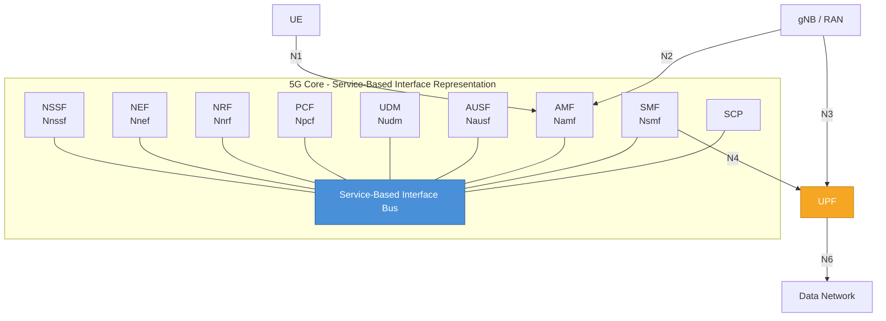
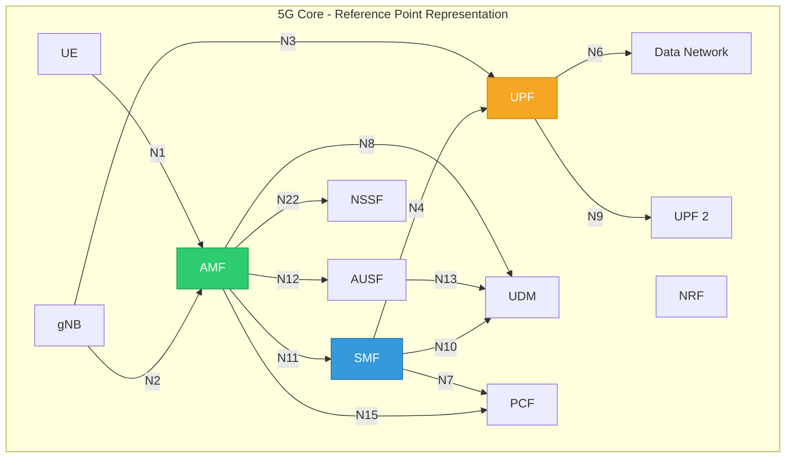
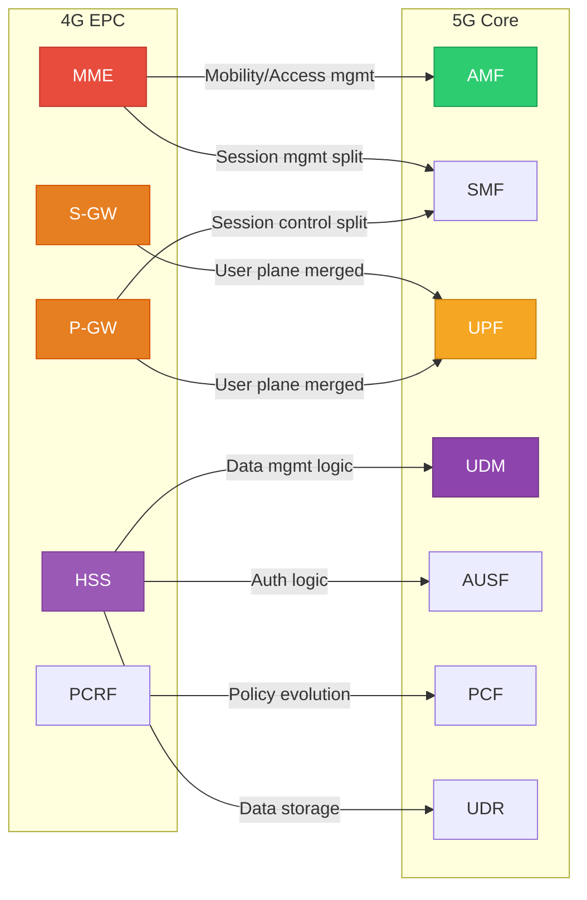
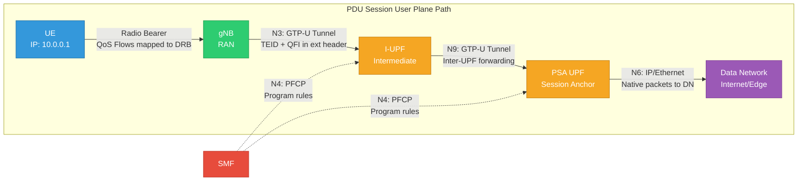

# ماژول 19: معماری هسته 5G

## 1. مرور هسته 5G

شبکه هسته 5G (5GC) در **3GPP TS 23.501** تعریف شده است و یک بازطراحی بنیادی شبکه هسته موبایل را نمایندگی می‌کند. برخلاف EPC در 4G که از واسط‌های نقطه-به-نقطه بین عناصر شبکه یکپارچه استفاده می‌کرد، 5GC یک **معماری خدمات‌محور (SBA)** را در پیش می‌گیرد که در آن توابع شبکه (NF) خدمات را از طریق APIهای RESTful روی HTTP/2 ارائه می‌دهند.

### اصول طراحی کلیدی

- **معماری خدمات‌محور (SBA):** NFها از طریق واسط‌های خدمات‌محور (SBI) با استفاده از HTTP/2 و JSON ارتباط برقرار می‌کنند
- **جداسازی کنترل و صفحه کاربر (CUPS):** جداسازی کامل CP و UP
- **طراحی NF بدون حالت:** حالت به‌صورت خارجی ذخیره می‌شود (UDSF) و مقیاس‌پذیری افقی را ممکن می‌سازد
- **شبکه‌بندی بومی:** پشتیبانی درون‌ساخت از چندین شبکه منطقی روی زیرساخت مشترک
- **بومی-ابر:** طراحی‌شده برای استقرار کانتینری و مبتنی بر میکروسرویس
- **کشف NF مبتنی بر ثبت‌نام:** NFها در NRF ثبت‌نام می‌کنند و همتاها را به‌صورت پویا کشف می‌کنند

---

## 2. معماری مرجع

معماری 5GC دو بازنمایی معادل دارد که در TS 23.501 تعریف شده‌اند:

### 2.1 بازنمایی واسط خدمات‌محور (SBI)

در این نما، تمام NFهای صفحه کنترل به یک گذرگاه خدمات مشترک متصل می‌شوند و خدمات را ارائه/مصرف می‌کنند.



### 2.2 بازنمایی نقطه مرجع

در این نما، نقاط مرجع نقطه-به-نقطه صریح بین NFها نشان داده می‌شوند.



---


## 3. توابع شبکه به‌صورت تفصیلی

### 3.1 تابع مدیریت دسترسی و تحرک (AMF)

AMF نقطه تماس واحد برای تمام سیگنالینگ مرتبط با UE از RAN است. واسط‌های N1 (NAS) و N2 (NGAP) را پایان می‌دهد.

**مسئولیت‌های کلیدی:**
- **پایان‌دهی NAS:** تمام پیام‌های NAS (ثبت‌نام، درخواست خدمات، برقراری نشست PDU) در AMF پایان می‌یابند
- **مدیریت ثبت‌نام:** ثبت‌نام، لغو ثبت‌نام و به‌روزرسانی‌های دوره‌ای ثبت‌نام UE را مدیریت می‌کند
- **مدیریت اتصال:** زمینه سیگنالینگ RRC را از طریق N2 به‌سمت gNB مدیریت می‌کند
- **مدیریت تحرک:** سیگنالینگ تحویل، مدیریت ناحیه ردیابی، هماهنگی صفحه‌بندی
- **امنیت:** احراز هویت را آغاز می‌کند (به AUSF واگذار می‌کند)، زمینه امنیتی NAS را مدیریت می‌کند (رمزگذاری + یکپارچگی)
- **انتخاب برش:** با NSSF برای تعیین برش شبکه مناسب تعامل دارد

**شناسه‌های کلیدی:**

| شناسه | توضیح |
|---|---|
| **GUAMI** | شناسه یکتای جهانی AMF = MCC + MNC + AMF Region ID + AMF Set ID + AMF Pointer |
| **5G-GUTI** | شناسه موقت یکتای جهانی 5G = GUAMI + 5G-TMSI (تخصیص‌یافته به UE توسط AMF) |
| **AMF Region ID** | 8 بیت — یک منطقه درون PLMN را شناسایی می‌کند |
| **AMF Set ID** | 10 بیت — یک مجموعه AMF درون یک منطقه را شناسایی می‌کند |
| **AMF Pointer** | 6 بیت — یک AMF مشخص درون یک مجموعه را شناسایی می‌کند |

**واسط‌ها:**
- **N1:** UE ↔ AMF (سیگنالینگ NAS، حمل‌شده به‌صورت شفاف روی RAN)
- **N2:** RAN ↔ AMF (پروتکل NGAP روی SCTP)
- **N8:** AMF ↔ UDM (بازیابی داده اشتراک)
- **N11:** AMF ↔ SMF (پیام‌های مدیریت نشست)
- **N12:** AMF ↔ AUSF (رویه‌های احراز هویت)
- **N14:** AMF ↔ AMF (تحرک UE بین AMFها)
- **N15:** AMF ↔ PCF (سیاست دسترسی و تحرک)
- **N22:** AMF ↔ NSSF (انتخاب برش)

**ناحیه ثبت‌نام:**
- از یک یا چند ناحیه ردیابی (TA) تشکیل شده است
- UE فقط هنگام حرکت به خارج از ناحیه ثبت‌نام خود، به‌روزرسانی ثبت‌نام انجام می‌دهد
- نواحی ثبت‌نام بزرگ‌تر ← سیگنالینگ کمتر، بار صفحه‌بندی بیشتر
- AMF ناحیه ثبت‌نام را بر اساس الگوی تحرک UE تخصیص می‌دهد

---

### 3.2 تابع مدیریت نشست (SMF)

SMF نشست‌های PDU را سرتاسری مدیریت می‌کند. UPF(ها)یی را که مسیر صفحه کاربر را تشکیل می‌دهند انتخاب و کنترل می‌کند.

**مسئولیت‌های کلیدی:**
- **مدیریت نشست PDU:** برقراری، اصلاح و آزادسازی نشست‌های PDU
- **انتخاب و کنترل UPF:** UPF(های) مناسب را انتخاب می‌کند، قواعد ارسال را از طریق N4/PFCP برنامه‌ریزی می‌کند
- **تخصیص آدرس IP:** آدرس‌های IPv4/IPv6 را به UEها تخصیص می‌دهد (یا به DHCP خارجی واگذار می‌کند)
- **اجرای QoS:** قواعد QoS را در UPF بر اساس سیاست‌های PCF نصب می‌کند
- **رومینگ:** سناریوهای مسیریابی خانگی و شکست محلی را مدیریت می‌کند
- **اعلان داده پیوند پایین‌سو:** هنگام رسیدن داده پیوند پایین‌سو برای UE بیکار، صفحه‌بندی را از طریق AMF فعال می‌کند

**انواع نشست PDU:**

| نوع | توضیح | مورد استفاده |
|---|---|---|
| **IPv4** | اتصال IPv4 سنتی | دسترسی اینترنت قدیمی |
| **IPv6** | اتصال فقط-IPv6 | IoT، شبکه‌های مدرن |
| **IPv4v6** | دو-پشته IPv4 + IPv6 | دسترسی پیش‌فرض گوشی هوشمند |
| **Ethernet** | فریم‌های اترنت لایه-2 | گسترش LAN صنعتی، TSN |
| **Unstructured** | داده IP خام یا غیر-IP | حسگرهای IoT، تونل‌های نقطه-به-نقطه |

**واسط N4 و PFCP:**
- **N4** SMF را با استفاده از **PFCP (پروتکل کنترل ارسال بسته)** به UPF متصل می‌کند — 3GPP TS 29.244
- PFCP یک پروتکل مبتنی بر UDP است (پورت 8805) با:
  - **برقراری نشست:** ایجاد زمینه ارسال در UPF
  - **اصلاح نشست:** به‌روزرسانی قواعد (مثلاً تحویل، تغییر QoS)
  - **حذف نشست:** حذف زمینه ارسال
  - **ضربان:** تشخیص شکست UPF

**لنگر نشست:**
- **لنگر نشست PDU (PSA)** همان UPF است که نقطه اتصال پایدار به شبکه داده را حفظ می‌کند
- تداوم آدرس IP را در حین تحرک UE فراهم می‌کند
- در حین تحویل تغییر **نمی‌کند** (برخلاف UPFهای میانی)
- SMF می‌تواند UPFهای میانی (I-UPF) را برای مسیریابی محلی وارد کند در حالی که PSA پایدار می‌ماند

---

### 3.3 تابع صفحه کاربر (UPF)

UPF **تنها NF صفحه کاربر** در هسته 5G است. تمام پردازش بسته، ارسال و اجرای سیاست برای داده کاربر را انجام می‌دهد.

**مسئولیت‌های کلیدی:**
- **مسیریابی و ارسال بسته:** بسته‌ها را بین RAN و شبکه داده مسیریابی می‌کند
- **تشخیص و گزارش‌دهی ترافیک:** برای شناسایی کاربرد DPI انجام می‌دهد
- **مدیریت QoS:** QoS در هر جریان را اجرا می‌کند (علامت‌گذاری، پلیسینگ، شکل‌دهی)
- **گزارش‌دهی مصرف:** حجم/مدت ترافیک را برای صورت‌حساب اندازه‌گیری می‌کند
- **طبقه‌بند پیوند بالاسو (UL-CL):** ترافیک را بر اساس تطبیق ترافیک به شبکه‌های داده مختلف هدایت می‌کند
- **نقطه انشعاب:** از نشست‌های PDU چند-میزبانه پشتیبانی می‌کند
- **بافرینگ:** بسته‌های پیوند پایین‌سو را برای UEهای بیکار بافر می‌کند، DDN را به SMF فعال می‌کند

**واسط‌ها:**

| واسط | اتصال | پروتکل | هدف |
|---|---|---|---|
| **N3** | gNB ↔ UPF | GTP-U روی UDP | تونل صفحه کاربر از RAN |
| **N6** | UPF ↔ DN | IP / Ethernet | نقطه خروج به شبکه داده |
| **N9** | UPF ↔ UPF | GTP-U روی UDP | ارسال بین-UPF (زنجیره‌سازی) |
| **N4** | SMF ↔ UPF | PFCP روی UDP | کنترل UPF از SMF |

**قواعد PFCP (برنامه‌ریزی‌شده توسط SMF از طریق N4):**

| قاعده | نام کامل | هدف |
|---|---|---|
| **PDR** | قاعده تشخیص بسته | بسته‌های ورودی را تطبیق می‌دهد (واسط مبدأ، فیلترهای IP، TEID در GTP، QFI) |
| **FAR** | قاعده اقدام ارسال | تعریف می‌کند چه کاری انجام شود (ارسال، دور ریختن، بافر، تکثیر)؛ مقصد را مشخص می‌کند |
| **QER** | قاعده اجرای QoS | محدودسازی نرخ (MBR/GBR)، دروازه‌بندی (باز/بسته)، QoS بازتابی |
| **URR** | قاعده گزارش‌دهی مصرف | محرک‌های اندازه‌گیری مبتنی بر حجم/زمان/رویداد برای صورت‌حساب |
| **BAR** | قاعده اقدام بافرینگ | رفتار بافرینگ، پارامترهای اعلان را کنترل می‌کند |

**روش‌های تشخیص ترافیک:**
- **فیلتر SDF:** فیلتر IP 5-گانه (IP مبدأ/مقصد، پورت مبدأ/مقصد، پروتکل)
- **شناسه کاربرد:** پیش‌پیکربندی‌شده یا به‌صورت پویا از طریق DPI یادگرفته‌شده
- **TEID در GTP-U:** تونل‌های GTP مشخص را شناسایی می‌کند
- **QFI (شناسه جریان QoS):** به جریان‌های QoS مشخص نگاشت می‌شود

---


### 3.4 مدیریت داده یکپارچه (UDM)

UDM مدیریت داده مشترک، مدیریت اعتبارنامه احراز هویت و مجوزدهی اشتراک را فراهم می‌کند. این معادل HSS در 5G است.

**مسئولیت‌های کلیدی:**
- **ذخیره SUPI:** شناسه دائمی اشتراک (SUPI = قالب IMSI یا NAI) را ذخیره و مدیریت می‌کند
- **محاسبه اعتبارنامه احراز هویت:** بردارهای احراز هویت (AV) را با استفاده از کلید بلندمدت مشترک (K) و پارامترهای اپراتور (OP/OPc) تولید می‌کند
- **مدیریت پروفایل اشتراک:** خدمات اشتراک‌شده، مجوزهای DNN، پروفایل‌های QoS را نگه می‌دارد
- **مدیریت ثبت‌نام:** AMF/SMF خدمات‌دهنده را در هر مشترک ردیابی می‌کند (ثبت‌نام NF)
- **مجوزدهی DNN:** تأیید می‌کند که UE مجاز به دسترسی به ترکیب DNN/برش مشخص است
- **رمزگشایی SUCI:** SUCI را به SUPI بازمی‌گرداند (با استفاده از SIDF — تابع رمزگشایی شناسه اشتراک)

**داده‌های کلیدی ذخیره‌شده:**
- SUPI، کلیدهای رمزگشایی SUCI
- اعتبارنامه‌های احراز هویت مشترک (K، OP/OPc، SQN)
- S-NSSAI و فهرست DNN اشتراک‌شده
- پارامترهای QoS پیش‌فرض نشست
- ثبت‌نام‌های NF خدمات‌دهنده (AMF، SMF)
- داده اشتراک دسترسی و تحرک

**واسط‌ها:**
- **Nudm:** واسط خدمات‌محور ارائه‌شده توسط UDM
- **N8 (از طریق Nudm):** AMF داده اشتراک/تحرک را بازیابی می‌کند
- **N10 (از طریق Nudm):** SMF داده اشتراک مدیریت نشست را بازیابی می‌کند
- **N13 (از طریق Nudm):** AUSF اعتبارنامه‌های احراز هویت را بازیابی می‌کند

**رابطه با UDR:**
- UDM شامل منطق کاربرد است (محاسبه بردار احراز هویت، رمزگشایی SUCI)
- UDR مخزن داده خالص پشتیبان است
- UDM از طریق واسط **Nudr** به UDR دسترسی می‌یابد

---

### 3.5 تابع سرور احراز هویت (AUSF)

AUSF به‌عنوان کارساز احراز هویت برای شبکه 5G عمل می‌کند. رویه‌های احراز هویت بین UE و شبکه خانگی را اجرا می‌کند.

**مسئولیت‌های کلیدی:**
- **اجرای احراز هویت:** رویه‌های 5G-AKA یا EAP-AKA' را اجرا می‌کند
- **مشتق‌سازی KAUSF:** کلید لنگر (KAUSF) را مشتق می‌کند که تمام کلیدهای بعدی از آن مشتق می‌شوند
- **ذخیره نتیجه احراز هویت:** وضعیت احراز هویت را برای مراجعه بعدی ذخیره می‌کند
- **اختیار شبکه خانگی:** تضمین می‌کند تصمیم احراز هویت توسط شبکه خانگی گرفته می‌شود (حتی در رومینگ)

**روش‌های احراز هویت:**

| روش | توضیح | مورد استفاده |
|---|---|---|
| **5G-AKA** | احراز هویت و توافق کلید 5G — AKA بهبودیافته با تأیید شبکه خانگی | روش اصلی برای UEهای مبتنی بر USIM |
| **EAP-AKA'** | پروتکل احراز هویت قابل توسعه با AKA prime — مبتنی بر چارچوب EAP | رومینگ، دسترسی غیر-3GPP، IoT |

**سلسله‌مراتب کلید از AUSF:**
```
K (permanent key in USIM and UDM)
  └── CK, IK (from AKA procedure)
       └── KAUSF (anchor key at AUSF)
            └── KSEAF (sent to serving network)
                 └── KAMF (derived at AMF)
                      ├── KNASint (NAS integrity)
                      ├── KNASenc (NAS ciphering)
                      └── KgNB (RAN security)
                           ├── KRRCint
                           ├── KRRCenc
                           └── KUPenc / KUPint
```

**واسط‌ها:**
- **Nausf:** واسط خدمات‌محور ارائه‌شده توسط AUSF
- **N12 (از طریق Nausf):** AMF احراز هویت را آغاز می‌کند
- **N13 (از طریق Nudm):** AUSF بردارهای احراز هویت را از UDM بازیابی می‌کند

---

### 3.6 تابع کنترل سیاست (PCF)

PCF موتور سیاست متمرکز 5GC است. قواعد سیاستی برای کنترل رفتار شبکه در دسترسی، نشست‌ها و سیاست‌های مختص UE فراهم می‌کند.

**مسئولیت‌های کلیدی:**
- **تولید قاعده PCC:** قواعد کنترل سیاست و صورت‌حساب برای QoS و صورت‌حساب ایجاد می‌کند
- **سیاست AM:** سیاست‌های دسترسی و تحرک (شاخص RFSP، محدودیت‌های ناحیه خدمات، انتخاب RAT/فرکانس)
- **سیاست SM:** سیاست‌های مدیریت نشست (QoS، دروازه‌بندی، صورت‌حساب، هدایت ترافیک)
- **سیاست UE:** سیاست‌های تحویل‌شده به UE (قواعد URSP — سیاست انتخاب مسیر UE، ANDSP)
- **تصمیم سیاست:** تصمیمات سیاست بلادرنگ بر اساس اشتراک، شرایط شبکه، درخواست‌های AF می‌گیرد

**انواع سیاست:**

| سیاست | دامنه | تحویل به | هدف |
|---|---|---|---|
| **سیاست AM** | دسترسی و تحرک | AMF (N15) | ناحیه خدمات، RFSP، محدودیت RAT |
| **سیاست SM** | نشست | SMF (N7) | جریان‌های QoS، قواعد PCC، صورت‌حساب |
| **سیاست UE** | رفتار UE | UE (از طریق AMF) | URSP، ANDSP، WLANSP |

**محتوای قاعده PCC:**
- شناسه قاعده و تقدم
- قالب جریان ترافیک (فیلتر SDF یا شناسه کاربرد)
- پارامترهای QoS (5QI، ARP، MBR، GBR)
- وضعیت دروازه‌بندی (باز/بسته برای UL/DL)
- روش صورت‌حساب (آنلاین/آفلاین) و گروه نرخ‌گذاری
- سیاست هدایت ترافیک

**واسط‌ها:**
- **Npcf:** واسط خدمات‌محور ارائه‌شده توسط PCF
- **N7 (از طریق Npcf):** SMF تصمیمات سیاست SM را بازیابی می‌کند
- **N15 (از طریق Npcf):** AMF تصمیمات سیاست AM را بازیابی می‌کند
- **N5 (از طریق Npcf):** AF از طریق NEF یا مستقیماً بر سیاست تأثیر می‌گذارد

---


### 3.7 تابع انتخاب برش شبکه (NSSF)

NSSF در انتخاب نمونه برش شبکه و مجموعه AMF مناسب برای یک UE کمک می‌کند.

**مسئولیت‌های کلیدی:**
- **تعیین NSSAI مجاز:** تعیین می‌کند UE مجاز به استفاده از کدام S-NSSAIها در PLMN خدمات‌دهنده است
- **نگاشت S-NSSAI:** NSSAI درخواستی را به NSSAI پیکربندی‌شده نگاشت می‌کند (نگاشت PLMN خانگی↔خدمات‌دهنده در رومینگ)
- **تغییر مسیر AMF:** وقتی AMF فعلی نمی‌تواند به برش انتخاب‌شده خدمات دهد، NSSF مجموعه AMF هدفی را شناسایی می‌کند که می‌تواند
- **انتخاب NRF:** به انتخاب نمونه NRF مناسب برای کشف NF مختص برش کمک می‌کند

**مفاهیم کلیدی:**

| اصطلاح | توضیح |
|---|---|
| **S-NSSAI** | NSSAI واحد = SST (نوع برش/خدمات 8 بیتی) + SD اختیاری (تفکیک‌کننده برش 24 بیتی) |
| **NSSAI درخواستی** | S-NSSAIهای فرستاده‌شده توسط UE در Registration Request |
| **NSSAI مجاز** | S-NSSAIهای مجاز توسط شبکه (بازگردانده‌شده در Registration Accept) |
| **NSSAI پیکربندی‌شده** | S-NSSAIهای تأمین‌شده در UE توسط HPLMN/VPLMN |
| **S-NSSAI اشتراک‌شده** | اشتراک برش در UDM |

**مقادیر استاندارد SST:**
- SST=1: eMBB (پهن‌باند موبایل بهبودیافته)
- SST=2: URLLC (ارتباطات فوق‌قابل اعتماد کم-تأخیر)
- SST=3: MIoT (IoT انبوه)
- SST=4: V2X (خودرو-به-همه‌چیز)

---

### 3.8 تابع مخزن شبکه (NRF)

NRF ثبت مرکزی برای تمام نمونه‌های NF در 5GC است. کشف و مجوزدهی خدمات را ممکن می‌سازد.

**مسئولیت‌های کلیدی:**
- **ثبت‌نام NF:** NFها پروفایل خود را ثبت می‌کنند (نوع، ظرفیت، خدمات پشتیبانی‌شده، PLMN، برش، مکان)
- **کشف NF:** NFهای مصرف‌کننده از NRF پرس‌وجو می‌کنند تا NFهای تولیدکننده منطبق با معیارها را بیابند
- **اعلان وضعیت NF:** NFهای مشترک‌شده را درباره تغییرات وضعیت NF مطلع می‌کند (ثبت‌نام‌شده، لغو ثبت‌نام‌شده، معلق)
- **صدور نشانه OAuth2:** نشانه‌های دسترسی برای مجوزدهی واسط خدمات‌محور صادر می‌کند

**محتوای پروفایل NF:**
- شناسه نمونه NF (UUID)
- نوع NF (AMF، SMF، UPF و غیره)
- وضعیت NF (REGISTERED، SUSPENDED، UNDISCOVERABLE)
- شناسه(های) PLMN خدمات‌داده‌شده
- S-NSSAI(های) پشتیبانی‌شده
- آدرس‌های FQDN یا IP
- خدمات و نسخه‌های پشتیبانی‌شده
- اطلاعات ظرفیت، اولویت، بار
- محلیت جغرافیایی

**پارامترهای پرس‌وجوی کشف:**
- نوع NF هدف
- نوع NF درخواست‌کننده
- نام خدمات
- PLMN هدف، S-NSSAI، DNN
- محلیت ترجیحی

**OAuth2 در 5GC:**
- NRF به‌عنوان کارساز مجوزدهی OAuth2 عمل می‌کند
- NF مصرف‌کننده نشانه را با نوع NF هدف و خدمات درخواست می‌کند
- نشانه در درخواست‌های SBI گنجانده می‌شود (سرآیند Authorization)
- NF تولیدکننده پیش از سرویس‌دهی به درخواست، نشانه را اعتبارسنجی می‌کند

---

### 3.9 تابع نمایش شبکه (NEF)

NEF یک چارچوب ایمن برای نمایش قابلیت‌ها و رویدادهای 5GC به توابع کاربرد خارجی (AF) فراهم می‌کند.

**مسئولیت‌های کلیدی:**
- **چارچوب نمایش:** قابلیت‌های شبکه را از طریق APIهای استاندارد به AFهای شخص سوم نمایش می‌دهد
- **تأثیر ترافیک:** AF می‌تواند مسیریابی ترافیک مشخص را درخواست کند (مثلاً مسیریابی ترافیک به کارساز لبه محلی)
- **رویدادهای پایش:** AF در رویدادهای UE اشتراک می‌کند (دسترسی‌پذیری، مکان، وضعیت اتصال)
- **تأمین پارامتر:** AF رفتار مورد انتظار UE، سیاست‌های انتقال داده پس‌زمینه را تأمین می‌کند
- **ترجمه:** بین شناسه‌های خارجی (GPSI، شناسه گروه خارجی) و شناسه‌های داخلی (SUPI) نگاشت می‌کند
- **دروازه امنیتی:** از دسترسی مستقیم AF به NFهای داخلی جلوگیری می‌کند

**قابلیت‌های کلیدی نمایش:**

| قابلیت | توضیح |
|---|---|
| **رویدادهای پایش** | دسترسی‌پذیری UE، گزارش مکان، از دست رفتن اتصال، وضعیت رومینگ |
| **تأثیر ترافیک** | درخواست مسیریابی ترافیک به شبکه داده محلی (رایانش لبه) |
| **نمایش تحلیل** | نمایش تحلیل‌های NWDAF به AFهای خارجی |
| **تأمین پارامتر** | رفتار مورد انتظار UE، انتقال داده پس‌زمینه |
| **محرک‌سازی دستگاه** | فعال‌سازی اقدام مشخص روی دستگاه IoT |
| **NIDD** | تحویل داده غیر-IP برای IoT |

---

### 3.10 مخزن داده یکپارچه (UDR)

UDR مخزن داده پشتیبان برای داده مشترک، سیاست و نمایش است. توسط UDM، PCF و NEF دسترسی می‌شود.

**مسئولیت‌های کلیدی:**
- **ذخیره داده اشتراک:** پروفایل‌های مشترک دسترسی‌شده توسط UDM را ذخیره می‌کند
- **ذخیره داده سیاست:** داده سیاست (قواعد PCC، سیاست‌های AM/SM) دسترسی‌شده توسط PCF را ذخیره می‌کند
- **ذخیره داده نمایش:** اشتراک‌های نمایش و داده دسترسی‌شده توسط NEF را ذخیره می‌کند
- **ذخیره داده کاربرد:** داده ارائه‌شده توسط AF (مثلاً PFDها — توصیف‌های جریان بسته) را ذخیره می‌کند

**دسته‌های داده:**

| نوع داده | NF مصرف‌کننده | مثال‌ها |
|---|---|---|
| **داده اشتراک** | UDM | اعتبارنامه‌های احراز هویت، S-NSSAI اشتراک‌شده، پیکربندی‌های DNN |
| **داده سیاست** | PCF | قالب‌های قاعده PCC، سیاست‌های داده حمایت‌شده |
| **داده نمایش** | NEF | اشتراک‌های پایش، درخواست‌های تأثیر AF |
| **داده کاربرد** | NEF/PCF | PFDها، سیاست‌های انتقال داده پس‌زمینه |

**واسط:**
- **Nudr:** واسط خدمات‌محور (تنها واسط UDR)
- دسترسی‌شده توسط UDM (Nudr_DataManagement)، PCF (Nudr_DataManagement)، NEF (Nudr_DataManagement)

---

### 3.11 تابع ذخیره‌سازی داده غیرساخت‌یافته (UDSF)

UDSF با فراهم کردن ذخیره‌سازی خارجی برای داده زمینه NF، طراحی بدون حالت NFها را ممکن می‌سازد.

**مسئولیت‌های کلیدی:**
- **ذخیره‌سازی داده غیرساخت‌یافته:** زمینه/حالت دلخواه NF را به‌عنوان بلوک‌های داده مبهم ذخیره می‌کند
- **پشتیبانی NF بدون حالت:** NFها می‌توانند پس از راه‌اندازی مجدد حالت را بازیابی کنند یا بار را در بین نمونه‌ها متعادل کنند
- **عملیات CRUD:** عملیات ایجاد، خواندن، به‌روزرسانی، حذف روی رکوردهای ذخیره‌شده

**چرا UDSF مهم است:**
- بدون UDSF، هر نمونه NF وضعیت نشست را در حافظه نگه می‌دارد
- با UDSF، هر نمونه NF می‌تواند با بازیابی حالت از UDSF به هر درخواستی خدمات دهد
- مقیاس‌پذیری افقی واقعی، تغییر مسیر و استقرار بومی-ابر را ممکن می‌سازد
- هر نوع NF ممکن است نمونه UDSF خود را داشته باشد

**واسط:**
- **Nudsf:** واسط خدمات‌محور برای ذخیره/بازیابی داده غیرساخت‌یافته

---

### 3.12 عامل ارتباط خدمات (SCP)

SCP یک عنصر مسیریابی و توازن بار است که در مسیر ارتباط SBI بین NFها قرار می‌گیرد. در TS 23.501 نسخه 16+ تعریف شده است.

**مسئولیت‌های کلیدی:**
- **ارتباط غیرمستقیم:** NFها درخواست‌ها را به SCP می‌فرستند به‌جای مستقیماً به NF هدف
- **توازن بار:** درخواست‌ها را در بین چندین نمونه NF توزیع می‌کند
- **مسیریابی پیام:** پیام‌ها را بر اساس پارامترهای کشف مسیریابی می‌کند بدون نیاز NF مصرف‌کننده به کشف کامل
- **پنهان‌سازی توپولوژی:** توپولوژی NF داخلی را از شبکه‌های خارجی پنهان می‌کند (رومینگ)
- **کنترل اضافه‌بار:** مدیریت ازدحام و محدودسازی درخواست را پیاده‌سازی می‌کند

**مدل‌های ارتباطی:**

| مدل | توضیح |
|---|---|
| **مدل A (مستقیم)** | NF مصرف‌کننده هدف را از طریق NRF کشف می‌کند، مستقیماً ارتباط برقرار می‌کند |
| **مدل B (غیرمستقیم بدون کشف واگذارشده)** | NF هدف را از طریق NRF کشف می‌کند، از طریق SCP مسیریابی می‌کند |
| **مدل C (غیرمستقیم با کشف واگذارشده)** | NF به SCP می‌فرستد، SCP کشف و مسیریابی را انجام می‌دهد |
| **مدل D (غیرمستقیم با کشف واگذارشده + انتخاب)** | SCP همه چیز را مدیریت می‌کند: کشف، انتخاب، مسیریابی |

**مزایا:**
- پیاده‌سازی NF را ساده می‌کند (NFها نیازی به منطق پیچیده کشف/تلاش مجدد ندارند)
- دیدپذیری و تله‌متری متمرکز
- استقرار آسان‌تر دغدغه‌های عرضی (پایان‌دهی mTLS، ردیابی)
- مقیاس‌دهی بی‌وقفه NF بدون پیکربندی مجدد را ممکن می‌سازد

---


## 4. صفحه کنترل در برابر صفحه کاربر در هسته 5G

5GC جداسازی سختگیرانه‌ای بین صفحه کنترل (CP) و صفحه کاربر (UP) اعمال می‌کند که به‌عنوان CUPS (جداسازی کنترل و صفحه کاربر) شناخته می‌شود.

### صفحه کنترل (CP)

- **تمام NFها به‌جز UPF** در صفحه کنترل عمل می‌کنند
- ارتباط از طریق **واسط‌های خدمات‌محور (SBI)** با استفاده از HTTP/2 + JSON
- پشته پروتکل: HTTP/2 ← TCP ← IP (یا از طریق SCP)
- توابع: سیگنالینگ، سیاست، احراز هویت، ثبت‌نام، مدیریت نشست، کشف
- بسته به نیازمندی‌های تأخیر، به‌صورت متمرکز یا منطقه‌ای مستقر می‌شود
- AMF و SMF لنگرهای اصلی CP برای سیگنالینگ UE و مدیریت نشست هستند

### صفحه کاربر (UP)

- **فقط UPF** در صفحه کاربر عمل می‌کند
- توسط SMF از طریق **N4 / PFCP** (واسط کنترل) برنامه‌ریزی می‌شود
- پشته پروتکل داده کاربر: داده کاربرد ← لایه PDU ← GTP-U ← UDP ← IP
- توابع: ارسال بسته، اجرای QoS، تشخیص ترافیک، اندازه‌گیری مصرف، بافرینگ
- بسته به نیازهای تأخیر و محلیت داده، می‌تواند در لبه، منطقه‌ای یا مکان‌های مرکزی مستقر شود
- چندین UPF می‌توانند زنجیره شوند (از طریق N9) برای زنجیره‌سازی تابع سرویس یا شکست محلی

### خلاصه تعامل CP/UP

```
┌─────────────────────────────────────────────────────────────────┐
│                     CONTROL PLANE (SBI)                          │
│  ┌─────┐ ┌─────┐ ┌─────┐ ┌─────┐ ┌─────┐ ┌─────┐ ┌─────┐    │
│  │ AMF │ │ SMF │ │ PCF │ │ UDM │ │AUSF │ │ NRF │ │NSSF │    │
│  └──┬──┘ └──┬──┘ └─────┘ └─────┘ └─────┘ └─────┘ └─────┘    │
│     │N2      │N4 (PFCP)                                         │
├─────┼────────┼──────────────────────────────────────────────────┤
│     │        │              USER PLANE                           │
│  ┌──┴──┐  ┌──┴──┐                    ┌──────┐                  │
│  │ gNB │──│ UPF │────────────────────▶│  DN  │                  │
│  └─────┘N3└─────┘        N6          └──────┘                  │
└─────────────────────────────────────────────────────────────────┘
```

---

## 5. مقایسه عمده: EPC در 4G در برابر هسته 5G

| جنبه | EPC در 4G | هسته 5G (5GC) |
|--------|--------|----------------|
| **سبک معماری** | واسط‌های نقطه-به-نقطه بین NEهای یکپارچه | معماری خدمات‌محور (SBA)، میکروسرویس‌ها |
| **پروتکل سیگنالینگ** | GTP-C (v2)، Diameter | HTTP/2 + JSON (APIهای RESTful) |
| **صفحه کاربر** | S-GW + P-GW (ترکیبی یا جدا) | UPF (NF واحد صفحه کاربر) |
| **پایگاه داده مشترکین** | HSS (مبتنی بر Diameter) | UDM + UDR (مبتنی بر SBI، منطق/ذخیره‌سازی جدا) |
| **احراز هویت** | EPS-AKA از طریق HSS | 5G-AKA / EAP-AKA' از طریق AUSF + UDM |
| **سیاست** | PCRF (واسط‌های Gx، Rx، Sd) | PCF (SBI مربوط به Npcf، سیاست‌های AM/SM/UE) |
| **مدیریت نشست** | MME + S-GW + P-GW ترکیبی | SMF (NF اختصاصی، جدا از تحرک) |
| **مدیریت تحرک** | MME (ترکیب با سیگنالینگ نشست) | AMF (تحرک/دسترسی خالص، بدون منطق نشست) |
| **شبکه‌بندی** | به‌طور بومی پشتیبانی نمی‌شود | پشتیبانی بومی (S-NSSAI، NSSF، نمونه‌های NF در هر برش) |
| **سبک واسط** | نقاط مرجع ثابت (S1، S5، S6a، S11…) | خدمات SBI + نقاط مرجع برای UP |
| **مدیریت حالت** | NEهای حالت‌دار | NFهای بدون حالت + UDSF برای حالت خارجی |
| **استقرار** | مبتنی بر تجهیز، یکپارچه | بومی-ابر، کانتینری، میکروسرویس‌ها |
| **کشف** | پیش‌پیکربندی‌شده یا مبتنی بر DNS | پویا از طریق NRF (ثبت‌نام + کشف + OAuth2) |
| **رایانش لبه** | دشوار (LIPA/SIPTO محدود) | بومی (UPF توزیع‌شده، LADN، یکپارچگی MEC) |

### نگاشت توابع شبکه از 4G به 5G



---


## 6. نقاط مرجع

نقاط مرجع واسط‌های بین جفت‌های NF مشخص را تعریف می‌کنند. در حالی که SBI برای ارتباط CP-به-CP استفاده می‌شود، نقاط مرجع برای درک جزئیات پروتکل مهم باقی می‌مانند.

### جدول کامل نقاط مرجع

| نقطه مرجع | اتصال | پروتکل/انتقال | هدف |
|---|---|---|---|
| **N1** | UE ↔ AMF | NAS روی RRC (از طریق gNB) | سیگنالینگ NAS (ثبت‌نام، درخواست‌های مدیریت نشست) |
| **N2** | RAN ↔ AMF | NGAP روی SCTP | سیگنالینگ RAN-CN (برقراری زمینه، تحویل، صفحه‌بندی) |
| **N3** | RAN ↔ UPF | GTP-U روی UDP/IP | تونل صفحه کاربر حامل داده نشست PDU |
| **N4** | SMF ↔ UPF | PFCP روی UDP (پورت 8805) | برنامه‌ریزی UPF (قواعد PDR، FAR، QER، URR) |
| **N6** | UPF ↔ DN | IP / Ethernet | خروج ترافیک کاربر به شبکه داده |
| **N7** | SMF ↔ PCF | SBI (HTTP/2) | سیاست SM (قواعد PCC، تصمیمات QoS) |
| **N8** | AMF ↔ UDM | SBI (HTTP/2) | داده اشتراک دسترسی/تحرک |
| **N9** | UPF ↔ UPF | GTP-U روی UDP/IP | ارسال صفحه کاربر بین-UPF |
| **N10** | SMF ↔ UDM | SBI (HTTP/2) | داده اشتراک مدیریت نشست |
| **N11** | AMF ↔ SMF | SBI (HTTP/2) | مدیریت چرخه عمر نشست PDU |
| **N12** | AMF ↔ AUSF | SBI (HTTP/2) | آغاز احراز هویت |
| **N13** | AUSF ↔ UDM | SBI (HTTP/2) | بازیابی بردار احراز هویت |
| **N14** | AMF ↔ AMF | SBI (HTTP/2) | تحرک بین-AMF (انتقال زمینه UE) |
| **N15** | AMF ↔ PCF | SBI (HTTP/2) | سیاست AM (محدودیت‌های دسترسی/تحرک) |
| **N22** | AMF ↔ NSSF | SBI (HTTP/2) | کمک در انتخاب برش |
| **N27** | NRF ↔ NRF | SBI (HTTP/2) | کشف NF بین-PLMN (از طریق SEPP) |
| **N32** | SEPP ↔ SEPP | PRINS / TLS | امنیت بین-PLMN (رومینگ) |

### جزئیات نقاط مرجع کلیدی

**N1 (UE ↔ AMF):**
- PDUهای NAS را حمل می‌کند (Registration Request/Accept، احراز هویت، حالت امنیتی، برقراری نشست PDU)
- پیام‌های NAS به‌صورت شفاف توسط gNB رله می‌شوند (کپسوله‌شده در NGAP روی N2)
- پس از فعال‌سازی امنیت، از امنیت NAS (یکپارچگی + رمزگذاری) پشتیبانی می‌کند

**N2 (RAN ↔ AMF):**
- پروتکل NGAP روی SCTP
- رویه‌ها: Initial UE Message، PDU Session Resource Setup، Handover Required/Request، Paging
- سیگنالینگ مرتبط با UE و غیرمرتبط با UE را حمل می‌کند

**N3 (RAN ↔ UPF):**
- تونل GTP-U شناسایی‌شده با TEID (شناسه نقطه انتهایی تونل)
- یک تونل GTP-U در هر نشست PDU در هر جفت gNB-UPF
- شناسه جریان QoS (QFI) در سرآیند افزونه GTP-U برای نگاشت جریان‌های QoS حمل می‌شود

**N4 (SMF ↔ UPF):**
- PFCP (پروتکل کنترل ارسال بسته) — 3GPP TS 29.244
- مدیریت سطح نشست (برقراری، اصلاح، حذف)
- مدیریت سطح گره (برقراری ارتباط، ضربان)
- گزارش‌ها: گزارش‌های مصرف، اعلان داده پیوند پایین‌سو، نشانگر پایان

**N9 (UPF ↔ UPF):**
- تونل GTP-U برای مسیرهای صفحه کاربر چند-گامی
- در سناریوهای UL-CL (طبقه‌بند پیوند بالاسو) و نقطه انشعاب استفاده می‌شود
- زنجیره‌سازی تابع سرویس و استقرار UPF توزیع‌شده را ممکن می‌سازد

---

## 7. گزینه‌های استقرار

معماری پیمانه‌ای 5GC توپولوژی‌های استقرار انعطاف‌پذیر بر اساس نیازمندی‌های سرویس را ممکن می‌سازد.

### 7.1 استقرار متمرکز

تمام NFها (شامل UPF) در یک مرکز داده مرکزی مستقر می‌شوند.

**ویژگی‌ها:**
- عملیات ساده، سایت واحد
- تأخیر بالاتر برای صفحه کاربر (تمام ترافیک از سایت مرکزی عبور می‌کند)
- مناسب برای پوشش گسترده با نیازمندی‌های تأخیر آسان‌گیر
- هزینه زیرساخت کمتر

### 7.2 استقرار توزیع‌شده

صفحه کنترل متمرکز، صفحه کاربر توزیع‌شده نزدیک‌تر به کاربران.

**ویژگی‌ها:**
- NFهای CP (AMF، SMF، PCF و غیره) در DC منطقه‌ای/مرکزی
- UPF در نقاط تجمیع منطقه‌ای مستقر می‌شود
- تأخیر صفحه کاربر کاهش‌یافته
- SMF چندین نمونه UPF را در مکان‌های مختلف مدیریت می‌کند

### 7.3 استقرار UPF در لبه (یکپارچگی MEC)

نمونه‌های UPF در لبه شبکه (سایت سلول یا نقطه تجمیع محلی) برای تأخیر فوق‌العاده کم مستقر می‌شوند.

**ویژگی‌ها:**
- شکست محلی ترافیک در لبه
- رایانش لبه چند-دسترسی (MEC) را ممکن می‌سازد — چارچوب MEC سازمان ETSI
- SMF می‌تواند UPFهای لبه را بر اساس مکان UE به‌صورت پویا وارد/حذف کند
- **UL-CL (طبقه‌بند پیوند بالاسو):** جریان‌های ترافیک مشخص را به UPF لبه هدایت می‌کند در حالی که بقیه به UPF مرکزی می‌رود
- **شبکه داده ناحیه محلی (LADN):** شبکه داده فقط در ناحیه جغرافیایی مشخص در دسترس است
- موارد استفاده معمول: AR/VR، رانندگی خودران، خودکارسازی صنعتی، بازی ابری

### مقایسه معماری استقرار

| جنبه | متمرکز | توزیع‌شده | UPF لبه |
|--------|------------|-------------|----------|
| **مکان CP** | DC مرکزی | DC مرکزی/منطقه‌ای | DC مرکزی/منطقه‌ای |
| **مکان UP** | DC مرکزی | PoP منطقه‌ای | سایت سلول / DC لبه |
| **تأخیر صفحه کاربر** | بالا (10-50ms) | متوسط (5-20ms) | فوق‌العاده کم (1-5ms) |
| **پیچیدگی** | کم | متوسط | بالا |
| **موارد استفاده** | پهن‌باند عمومی | خدمات منطقه‌ای | URLLC، MEC، V2X |
| **تعداد UPF** | کم | متوسط | زیاد |

### مسیر صفحه کاربر نشست PDU



**جریان برقراری نشست PDU (ساده‌شده):**
1. UE ← AMF: NAS PDU Session Establishment Request (از طریق N1)
2. AMF ← SMF: Nsmf_PDUSession_CreateSMContext (از طریق N11)
3. SMF UPF را انتخاب می‌کند، آدرس IP تخصیص می‌دهد
4. SMF ← UPF: PFCP Session Establishment (از طریق N4) — PDR/FAR/QER را نصب می‌کند
5. SMF ← AMF: N1N2MessageTransfer (شامل NAS accept + اطلاعات N2)
6. AMF ← gNB: PDU Session Resource Setup Request (از طریق N2)
7. gNB ← UPF: تونل GTP-U برقرار می‌شود (N3)
8. UE دریافت PDU Session Establishment Accept با قواعد QoS

---

## خلاصه

هسته 5G یک تغییر پارادایم از EPC در 4G را نمایندگی می‌کند:

- **SBA جایگزین واسط‌های نقطه-به-نقطه می‌شود** — انعطاف‌پذیری، قابلیت استفاده مجدد و تحول مستقل NF را ممکن می‌سازد
- **CUPS کامل** — UPF تنها موجودیت صفحه کاربر است، قابل برنامه‌ریزی از طریق PFCP
- **بومی-ابر از طراحی** — NFهای بدون حالت، UDSF، کشف مبتنی بر NRF، کانتینری‌سازی
- **شبکه‌بندی بومی** — S-NSSAI، NSSF، انتخاب NF در هر برش از پایه
- **امنیت تقویت‌شده** — پنهان‌سازی SUCI، احراز هویت کنترل‌شده توسط شبکه خانگی، OAuth2 در SBI
- **آماده-لبه** — UPF توزیع‌شده، UL-CL، LADN برای خدمات فوق‌کم-تأخیر

---

*مراجع: 3GPP TS 23.501 (معماری سیستم)، TS 23.502 (رویه‌ها)، TS 29.244 (PFCP)، TS 33.501 (معماری امنیت)*
