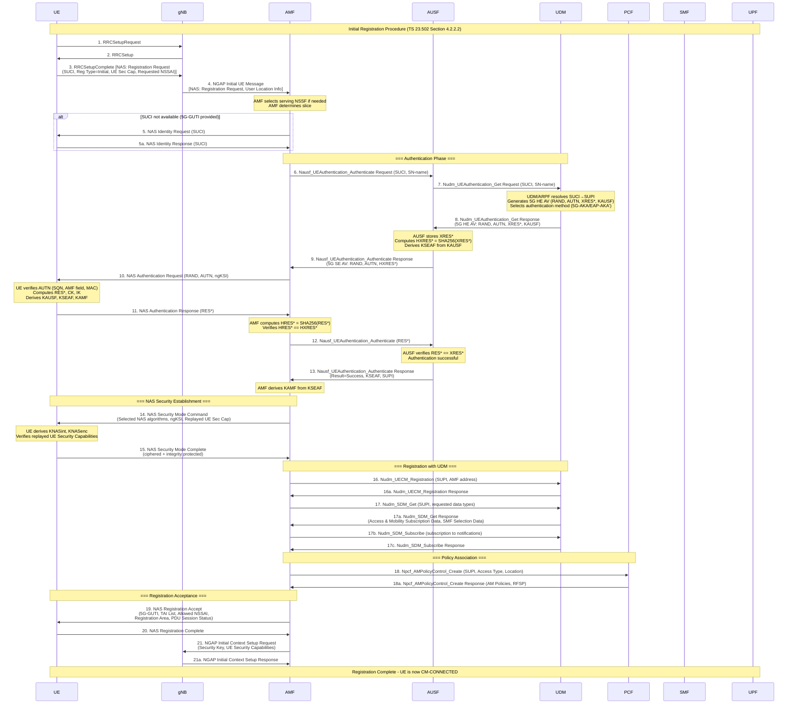
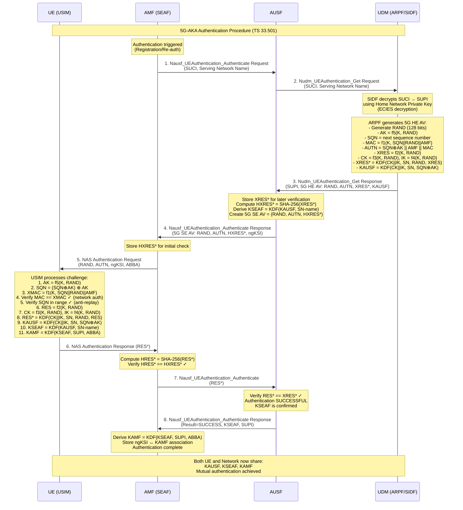
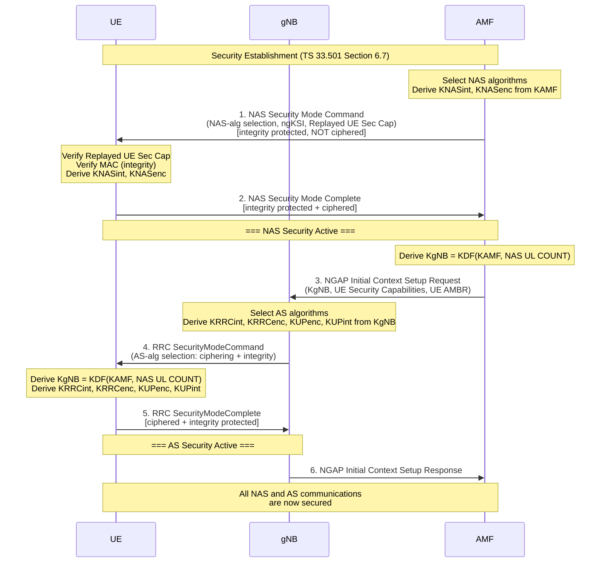
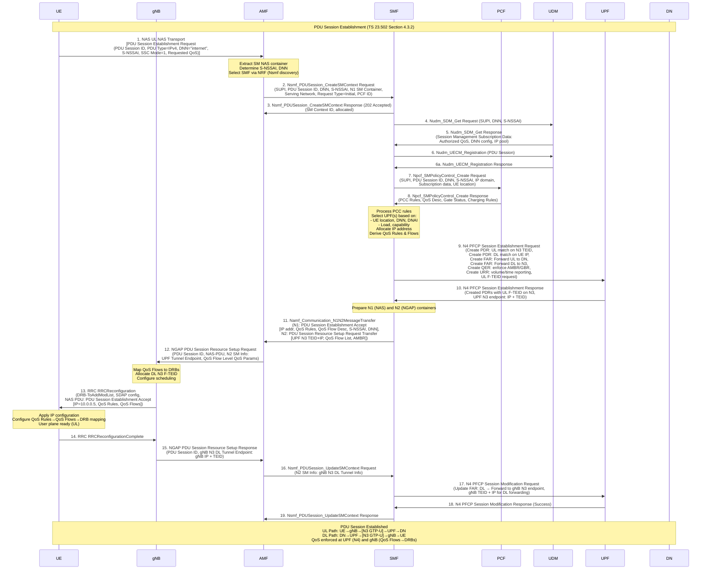
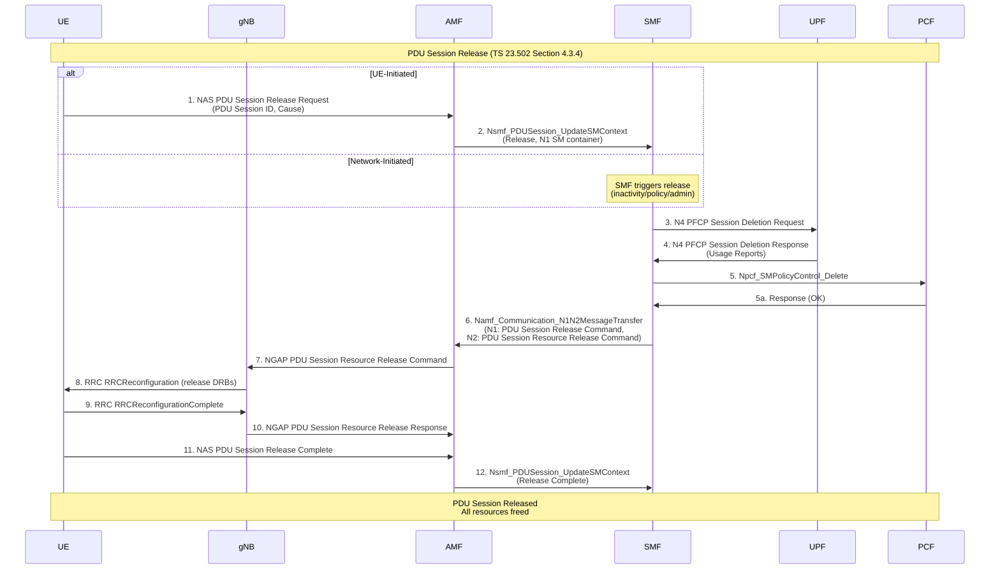
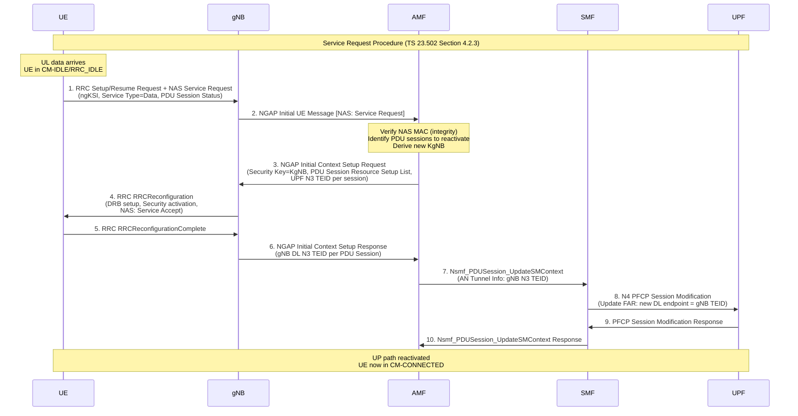
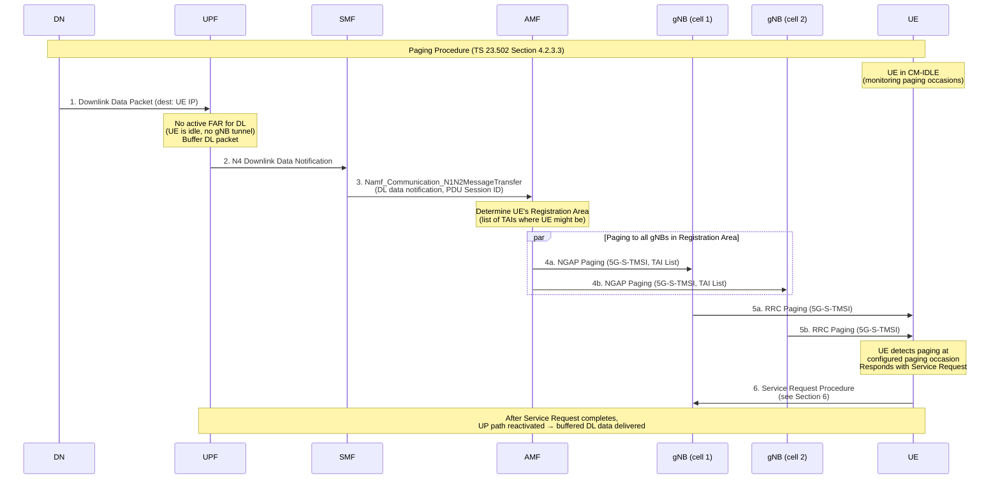
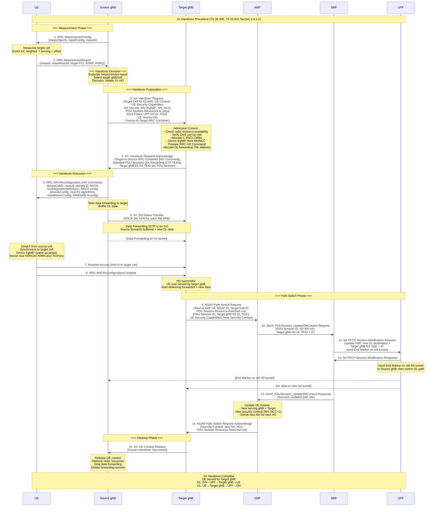
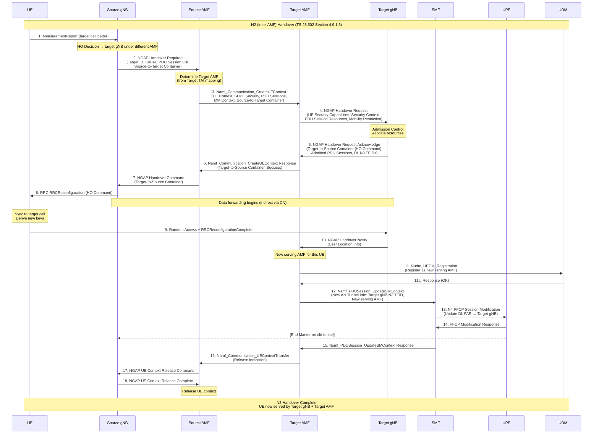

# Module 20: 5G Procedures

## Advanced Communication Networks Course

---

## Table of Contents

1. [Registration (Initial Registration)](#1-registration-initial-registration)
2. [Authentication (5G-AKA)](#2-authentication-5g-aka)
3. [Security Establishment](#3-security-establishment)
4. [PDU Session Establishment](#4-pdu-session-establishment)
5. [PDU Session Release](#5-pdu-session-release)
6. [Service Request](#6-service-request)
7. [Paging](#7-paging)
8. [Xn Handover](#8-xn-handover)
9. [N2 Handover (Inter-AMF)](#9-n2-handover-inter-amf)

---

## 1. Registration (Initial Registration)

### Purpose

The Initial Registration procedure allows a UE to register with the 5G Core Network (5GC) for the first time or after being deregistered. It establishes the UE's presence in the network, authenticates the subscriber, allocates a 5G-GUTI (Globally Unique Temporary Identifier), and optionally establishes a PDU session for data connectivity.

### Preconditions

- UE is powered on and has a valid USIM with 5G subscription credentials
- UE has selected a PLMN and camped on a cell (gNB)
- UE is in RRC_IDLE or RRC_INACTIVE state
- UE has no valid 5G-GUTI (first-time registration) or previous GUTI has expired
- RRC connection has been established (Random Access procedure completed)

### NFs Involved

| Network Function | Role |
|---|---|
| UE | Initiates registration, provides identity (SUCI/5G-GUTI) |
| gNB | RAN node, forwards NAS messages between UE and AMF |
| AMF | Anchor for registration, selects AUSF, manages context |
| AUSF | Authentication server, validates credentials |
| UDM | Stores subscription data, generates auth vectors |
| ARPF | Authentication credential Repository (within UDM) |
| PCF | Provides AM policies |
| SMF | Session management (if PDU session requested) |
| UPF | User plane (if PDU session requested) |
| NRF | NF discovery and selection |
| NSSF | Network Slice selection |

### Messages

| Step | Interface | Message |
|---|---|---|
| 1 | Uu (UE→gNB) | RRCSetupRequest |
| 2 | Uu (gNB→UE) | RRCSetup |
| 3 | Uu (UE→gNB) | RRCSetupComplete + NAS Registration Request |
| 4 | N2 (gNB→AMF) | NGAP Initial UE Message (NAS: Registration Request) |
| 5 | N12 (AMF→AUSF) | Nausf_UEAuthentication_Authenticate Request |
| 6 | N13 (AUSF→UDM) | Nudm_UEAuthentication_Get Request |
| 7 | N13 (UDM→AUSF) | Nudm_UEAuthentication_Get Response (AV) |
| 8 | N12 (AUSF→AMF) | Nausf_UEAuthentication_Authenticate Response |
| 9 | N2/NAS (AMF→UE) | Authentication Request (RAND, AUTN) |
| 10 | N2/NAS (UE→AMF) | Authentication Response (RES*) |
| 11 | N12 (AMF→AUSF) | Nausf_UEAuthentication_Authenticate (RES*) |
| 12 | N12 (AUSF→AMF) | Nausf_UEAuthentication_Authenticate (Success + KSEAF) |
| 13 | N2/NAS (AMF→UE) | Security Mode Command |
| 14 | N2/NAS (UE→AMF) | Security Mode Complete |
| 15 | N8 (AMF→UDM) | Nudm_UECM_Registration |
| 16 | N8 (AMF→UDM) | Nudm_SDM_Get (Subscription Data) |
| 17 | N15 (AMF→PCF) | Npcf_AMPolicyControl_Create |
| 18 | N2/NAS (AMF→UE) | Registration Accept (5G-GUTI, TAI List, Allowed NSSAI) |
| 19 | N2/NAS (UE→AMF) | Registration Complete |
| 20 | N2 (AMF→gNB) | NGAP Initial Context Setup Request |

### Step-by-Step Flow

1. **RRC Connection Establishment**: UE performs Random Access and sends RRCSetupRequest to gNB
2. **RRC Setup**: gNB responds with RRCSetup message
3. **Registration Request**: UE sends RRCSetupComplete containing NAS Registration Request (includes SUCI or 5G-GUTI, Registration Type, UE Security Capabilities, Requested NSSAI)
4. **AMF Selection**: gNB selects appropriate AMF (via NSSF if needed) and forwards via NGAP Initial UE Message
5. **Identity Request (conditional)**: If AMF cannot resolve identity, sends Identity Request to UE
6. **SUCI Resolution**: AMF initiates authentication; sends SUCI to AUSF
7. **Auth Vector Request**: AUSF requests authentication vector from UDM/ARPF
8. **AV Generation**: UDM/ARPF generates 5G HE AV (RAND, AUTN, XRES*, KAUSF), resolves SUCI→SUPI
9. **Auth Vector Response**: AUSF receives AV, computes HXRES*, stores XRES*
10. **Authentication Request**: AMF sends NAS Authentication Request to UE (RAND, AUTN)
11. **UE Verification**: UE verifies AUTN, computes RES*, CK, IK, derives KAUSF
12. **Authentication Response**: UE sends Authentication Response (RES*) to AMF
13. **RES* Verification**: AMF sends RES* to AUSF; AUSF verifies HRES* matches HXRES*
14. **Authentication Confirmation**: AUSF confirms to AMF, provides KSEAF; AMF derives KAMF
15. **NAS Security**: AMF sends Security Mode Command (selected algorithms); UE responds with Security Mode Complete
16. **UDM Registration**: AMF registers with UDM (Nudm_UECM_Registration)
17. **Subscription Retrieval**: AMF retrieves subscription data from UDM (Nudm_SDM_Get)
18. **Policy Association**: AMF establishes AM Policy association with PCF
19. **Registration Accept**: AMF sends Registration Accept (5G-GUTI, TAI List, Allowed NSSAI, Registration Area)
20. **Registration Complete**: UE acknowledges with Registration Complete; stores new 5G-GUTI

### Detailed Sequence Diagram



### Failure Cases

| Failure | Cause | Network Response |
|---|---|---|
| Authentication Failure | Invalid credentials, SQN out of sync | Authentication Reject or Sync Failure |
| Registration Reject | No subscription, roaming not allowed | Registration Reject (Cause: #11, #15) |
| PLMN Not Allowed | UE not subscribed for visited PLMN | Registration Reject (Cause: #11) |
| Congestion | Network overload | Registration Reject (Cause: #22) + back-off timer |
| Integrity Check Failure | NAS MAC failure | Reject silently or re-authenticate |
| UDM Unreachable | SBI communication failure | Registration Reject or AMF retry |
| Slice Not Available | Requested S-NSSAI not supported | Registration Accept with reduced Allowed NSSAI |

---


## 2. Authentication (5G-AKA)

### Purpose

The 5G-AKA (Authentication and Key Agreement) procedure provides mutual authentication between the UE and network, and establishes shared cryptographic keys. It ensures the network verifies the subscriber's identity and the UE verifies it is communicating with a legitimate network. The procedure generates the anchor key (KAUSF) from which all subsequent security keys are derived.

### Preconditions

- UE has initiated Registration or Re-authentication is triggered
- UE has valid USIM with long-term key K and OP/OPc
- AUSF is reachable from the serving AMF
- UDM/ARPF has valid subscription credentials for the subscriber
- SUCI has been provided (either from UE or resolved from 5G-GUTI)

### NFs Involved

| Network Function | Role |
|---|---|
| UE (USIM) | Holds permanent key K; verifies AUTN; computes RES* |
| AMF (SEAF) | Security Anchor; relays auth messages; derives KAMF |
| AUSF | Verifies RES* against XRES*; derives KSEAF |
| UDM/ARPF | Generates authentication vectors; holds permanent key K |
| SIDF (in UDM) | Decrypts SUCI to obtain SUPI |

### Messages

| Step | Interface | Message | Key Parameters |
|---|---|---|---|
| 1 | N12 | Nausf_UEAuthentication_Authenticate Request | SUCI/SUPI, Serving Network Name |
| 2 | N13 | Nudm_UEAuthentication_Get Request | SUCI/SUPI, Serving Network Name |
| 3 | N13 | Nudm_UEAuthentication_Get Response | 5G HE AV (RAND, AUTN, XRES*, KAUSF) |
| 4 | N12 | Nausf_UEAuthentication_Authenticate Response | 5G SE AV (RAND, AUTN, HXRES*) |
| 5 | NAS | Authentication Request | RAND, AUTN, ngKSI |
| 6 | NAS | Authentication Response | RES* |
| 7 | N12 | Nausf_UEAuthentication_Authenticate | RES* |
| 8 | N12 | Nausf_UEAuthentication_Authenticate Response | Result, KSEAF, SUPI |

### Step-by-Step Flow

1. **Trigger**: AMF determines authentication is needed (initial registration, periodic re-auth, or inter-AMF handover)
2. **AUSF Selection**: AMF selects AUSF based on SUPI home network (via NRF)
3. **Auth Initiation**: AMF sends SUCI and Serving Network Name (SN-name) to AUSF
4. **UDM Request**: AUSF forwards request to UDM with SUCI and SN-name
5. **SUCI Decryption**: SIDF (within UDM) decrypts SUCI using home network private key → obtains SUPI
6. **AV Generation**: ARPF generates 5G HE AV using:
   - RAND (random challenge)
   - AUTN = SQN⊕AK || AMF || MAC (network authentication token)
   - XRES* = KDF(CK, IK, SN-name, RAND, RES) (expected response)
   - KAUSF = KDF(CK, IK, SN-name, SQN⊕AK) (anchor key)
7. **AV to AUSF**: UDM returns 5G HE AV to AUSF
8. **AUSF Processing**: AUSF stores XRES*, computes HXRES* = SHA-256(XRES*[128..255] || XRES*), derives KSEAF from KAUSF
9. **SE AV to AMF**: AUSF sends 5G SE AV (RAND, AUTN, HXRES*) to AMF
10. **Challenge to UE**: AMF sends Authentication Request (RAND, AUTN, ngKSI) to UE
11. **UE Verification**: USIM verifies AUTN:
    - Extracts AK from RAND using f5, recovers SQN
    - Computes XMAC and verifies XMAC == MAC (network authentication)
    - Verifies SQN is in acceptable range (replay protection)
12. **UE Key Derivation**: UE computes:
    - RES, CK, IK from RAND using f2, f3, f4
    - RES* = KDF(CK, IK, SN-name, RAND, RES)
    - KAUSF = KDF(CK, IK, SN-name, SQN⊕AK)
    - KSEAF = KDF(KAUSF, SN-name)
    - KAMF = KDF(KSEAF, SUPI, ABBA)
13. **Response**: UE sends Authentication Response with RES* to AMF
14. **AMF Verification**: AMF computes HRES* and verifies HRES* == HXRES*
15. **AUSF Verification**: AMF forwards RES* to AUSF; AUSF verifies RES* == XRES*
16. **Success**: AUSF returns success, KSEAF, and confirmed SUPI to AMF
17. **KAMF Derivation**: AMF derives KAMF = KDF(KSEAF, SUPI, ABBA)

### Key Hierarchy Derived

```
K (permanent, in USIM and ARPF)
├── CK, IK (from RAND via f3, f4)
│   └── KAUSF = KDF(CK||IK, SN-name, SQN⊕AK)
│       └── KSEAF = KDF(KAUSF, SN-name)
│           └── KAMF = KDF(KSEAF, SUPI, ABBA)
│               ├── KNASint (NAS integrity)
│               ├── KNASenc (NAS ciphering)
│               └── KgNB (RAN key)
│                   ├── KRRCint (RRC integrity)
│                   ├── KRRCenc (RRC ciphering)
│                   └── KUPenc (User plane ciphering)
```

### Detailed Sequence Diagram



### Failure Cases

| Failure | Cause | UE Action | Network Action |
|---|---|---|---|
| MAC Failure | AUTN verification fails (wrong K or tampered) | Send Auth Failure (MAC failure) | AMF informs AUSF; may retry |
| SQN Sync Failure | SQN out of acceptable range | Send Auth Failure (Synch failure) + AUTS | UDM resynchronizes SQN, generates new AV |
| Network Auth Failure | UE cannot verify network identity | Abort authentication | — |
| RES* Mismatch | UE response doesn't match expected | — | AUSF reports failure; AMF rejects registration |
| HXRES* Mismatch | Initial check at AMF fails | — | AMF still forwards to AUSF for final decision |
| AUSF Timeout | AUSF unreachable | — | AMF may select alternate AUSF or reject |
| SUCI Decryption Failure | Invalid SUCI format or wrong HN key | — | UDM reports error; registration fails |

---


## 3. Security Establishment

### Purpose

The Security Establishment procedure activates NAS and AS security between the UE and the network. It selects and activates ciphering and integrity protection algorithms for both NAS signaling (between UE and AMF) and AS signaling/user plane (between UE and gNB). This procedure ensures all subsequent communications are protected against eavesdropping and tampering.

### Preconditions

- Authentication has been successfully completed
- KAMF has been derived at both UE and AMF
- UE Security Capabilities have been provided to the AMF
- ngKSI is established (identifies the active security context)

### NFs Involved

| Network Function | Role |
|---|---|
| UE | Derives NAS/AS keys, verifies algorithm selection |
| AMF | Selects NAS algorithms, sends Security Mode Command, derives NAS keys |
| gNB | Selects AS algorithms, activates RRC/UP security |

### Messages

| Step | Interface | Message | Key Parameters |
|---|---|---|---|
| 1 | NAS | Security Mode Command | NAS algorithms, ngKSI, Replayed UE Sec Cap, IMEISV request |
| 2 | NAS | Security Mode Complete | IMEISV (if requested), NAS message container |
| 3 | N2 | Initial Context Setup Request | KgNB, UE Security Capabilities |
| 4 | RRC | SecurityModeCommand | AS algorithms (ciphering + integrity) |
| 5 | RRC | SecurityModeComplete | — |
| 6 | N2 | Initial Context Setup Response | — |

### Step-by-Step Flow

1. **NAS Algorithm Selection**: AMF selects NAS security algorithms based on UE Security Capabilities and AMF policy (highest priority algorithm supported by both)
2. **NAS Key Derivation (AMF)**: AMF derives:
   - KNASint = KDF(KAMF, NAS-int-alg-ID, alg-type)
   - KNASenc = KDF(KAMF, NAS-enc-alg-ID, alg-type)
3. **Security Mode Command**: AMF sends NAS Security Mode Command (integrity protected with KNASint but NOT ciphered):
   - Selected NAS ciphering algorithm (e.g., NEA1, NEA2)
   - Selected NAS integrity algorithm (e.g., NIA1, NIA2)
   - ngKSI, Replayed UE Security Capabilities, IMEISV request
4. **UE Verification**: UE verifies:
   - Replayed UE Security Capabilities match what was sent (anti-MITM)
   - Integrity protection of the message using derived KNASint
5. **NAS Key Derivation (UE)**: UE derives KNASint and KNASenc using same KDF
6. **Security Mode Complete**: UE sends NAS Security Mode Complete (integrity protected AND ciphered)
7. **NAS Security Active**: NAS security context is now active in both directions
8. **KgNB Derivation**: AMF derives KgNB = KDF(KAMF, NAS UL COUNT) and sends to gNB via Initial Context Setup Request
9. **AS Algorithm Selection**: gNB selects AS algorithms based on UE Security Capabilities and gNB policy
10. **AS Key Derivation**: gNB derives:
    - KRRCint = KDF(KgNB, RRC-int-alg-ID)
    - KRRCenc = KDF(KgNB, RRC-enc-alg-ID)
    - KUPenc = KDF(KgNB, UP-enc-alg-ID)
    - KUPint = KDF(KgNB, UP-int-alg-ID) [optional for DRBs]
11. **RRC Security Mode Command**: gNB sends RRC SecurityModeCommand to UE (integrity protected)
12. **UE AS Key Derivation**: UE derives same AS keys from KgNB
13. **RRC Security Mode Complete**: UE responds with RRC SecurityModeComplete (ciphered + integrity protected)
14. **AS Security Active**: Full AS security is now active

### Key Hierarchy Diagram

```
KAUSF (from authentication)
  └── KSEAF = KDF(KAUSF, Serving Network Name)
       └── KAMF = KDF(KSEAF, SUPI, ABBA)
            ├── KNASint = KDF(KAMF, algorithm-type=0x02, NIA-alg-id)
            ├── KNASenc = KDF(KAMF, algorithm-type=0x01, NEA-alg-id)
            └── KgNB = KDF(KAMF, NAS Uplink COUNT)
                 ├── KRRCint = KDF(KgNB, algorithm-type=0x04, NIA-alg-id)
                 ├── KRRCenc = KDF(KgNB, algorithm-type=0x03, NEA-alg-id)
                 ├── KUPenc = KDF(KgNB, algorithm-type=0x05, NEA-alg-id)
                 ├── KUPint = KDF(KgNB, algorithm-type=0x06, NIA-alg-id)
                 └── NH = KDF(KAMF, KgNB) [for handover forward security]
                      └── KgNB* = KDF(NH, Target PCI, DL ARFCN) [handover]
```

### Condensed Sequence Diagram



### Failure Cases

| Failure | Cause | Response |
|---|---|---|
| UE Sec Cap Mismatch | Replayed capabilities don't match (bidding-down attack) | UE sends Security Mode Reject |
| Integrity Verification Failure | MAC check fails on Security Mode Command | UE sends Security Mode Reject |
| Algorithm Not Supported | Selected algorithm not in UE capabilities | UE sends Security Mode Reject |
| NAS Security Mode Reject | Any NAS SMC failure | AMF may re-attempt or reject registration |
| AS Security Mode Failure | RRC SMC integrity check fails | gNB reports failure; may release connection |
| Null Integrity Not Allowed | NIA0 selected when not permitted | UE rejects (NIA0 only for emergency) |

---

## 4. PDU Session Establishment

### Purpose

The PDU Session Establishment procedure creates a data connectivity session between the UE and a Data Network (DN). It allocates an IP address (or other PDU type), sets up QoS rules and flows, establishes GTP-U tunnels on N3 (gNB↔UPF) and N9 (UPF↔UPF) interfaces, and configures PFCP sessions on N4 (SMF↔UPF). This enables the UE to send and receive user plane data.

### Preconditions

- UE is registered with the 5GC (Registration procedure completed)
- UE is in CM-CONNECTED state (RRC connection active)
- NAS security context is established
- UE has valid subscription for the requested DNN and S-NSSAI
- SMF and UPF resources are available for the requested slice

### NFs Involved

| Network Function | Role |
|---|---|
| UE | Initiates session request, provides DNN/S-NSSAI/PDU type |
| gNB | Forwards NAS, establishes N3 GTP-U tunnel |
| AMF | Routes SM NAS messages, selects SMF |
| SMF | Session management, IP allocation, QoS policy, UPF selection/control |
| UPF | User plane forwarding, packet detection/enforcement |
| PCF | Provides SM policies and PCC rules |
| UDM | Provides session management subscription data |
| DN-AAA | External authentication (if required by DN) |
| CHF | Charging function |

### Messages

| Step | Interface | Message |
|---|---|---|
| 1 | NAS | PDU Session Establishment Request (in UL NAS Transport) |
| 2 | N11 | Nsmf_PDUSession_CreateSMContext Request |
| 3 | N10 | Nudm_SDM_Get (SM Subscription Data) |
| 4 | N7 | Npcf_SMPolicyControl_Create |
| 5 | N4 | PFCP Session Establishment Request |
| 6 | N4 | PFCP Session Establishment Response |
| 7 | N11 | Nsmf_PDUSession_CreateSMContext Response |
| 8 | N11 | Namf_Communication_N1N2MessageTransfer |
| 9 | N2 | NGAP PDU Session Resource Setup Request |
| 10 | RRC | RRCReconfiguration (DRB setup) |
| 11 | RRC | RRCReconfigurationComplete |
| 12 | N2 | NGAP PDU Session Resource Setup Response |
| 13 | N11 | Nsmf_PDUSession_UpdateSMContext (N2 Info) |
| 14 | N4 | PFCP Session Modification Request (DL tunnel info) |
| 15 | NAS | PDU Session Establishment Accept |

### Step-by-Step Flow

1. **UE Request**: UE sends PDU Session Establishment Request containing:
   - PDU Session ID, PDU Type (IPv4/IPv6/IPv4v6/Ethernet/Unstructured)
   - Requested DNN, S-NSSAI, SSC Mode
   - SM PDU DN Request Container (optional)
   - Requested QoS Rules and QoS Flow Descriptions
2. **NAS Transport**: AMF receives UL NAS Transport message with SM NAS container
3. **SMF Selection**: AMF selects SMF based on DNN, S-NSSAI, PLMN, and NRF discovery
4. **SM Context Creation**: AMF sends Nsmf_PDUSession_CreateSMContext to selected SMF
5. **Subscription Data**: SMF retrieves session management subscription data from UDM (Nudm_SDM_Get)
6. **SMF Registration**: SMF registers with UDM for the PDU session
7. **Policy Association**: SMF creates SM Policy association with PCF (Npcf_SMPolicyControl_Create)
8. **PCF Response**: PCF returns PCC rules, QoS policies, and charging rules
9. **UPF Selection**: SMF selects appropriate UPF(s) based on UE location, DNN, slice, and data path requirements
10. **IP Allocation**: SMF allocates IP address/prefix (from local pool, UPF pool, or external DHCP/AAA)
11. **N4 Session Establishment**: SMF sends PFCP Session Establishment Request to UPF:
    - PDRs (Packet Detection Rules), FARs (Forwarding Action Rules)
    - QERs (QoS Enforcement Rules), URRs (Usage Reporting Rules)
    - UL tunnel endpoint (F-TEID on UPF for N3)
12. **UPF Response**: UPF responds with allocated F-TEID (N3 UL endpoint)
13. **N1N2 Message Transfer**: SMF sends to AMF:
    - N1 SM container: PDU Session Establishment Accept (IP addr, QoS rules, S-NSSAI)
    - N2 SM container: PDU Session Resource Setup Request Transfer (UPF N3 TEID, QoS Profile)
14. **RAN Setup**: AMF forwards to gNB via NGAP PDU Session Resource Setup Request
15. **DRB Establishment**: gNB maps QoS flows to DRBs, sends RRCReconfiguration to UE
16. **UE Configuration**: UE applies QoS rules, configures DRBs, responds with RRCReconfigurationComplete
17. **gNB Response**: gNB sends NGAP PDU Session Resource Setup Response (gNB N3 F-TEID for DL)
18. **Path Update**: AMF forwards gNB's DL tunnel info to SMF (Nsmf_PDUSession_UpdateSMContext)
19. **N4 Modification**: SMF sends PFCP Session Modification to UPF with DL tunnel endpoint (gNB's F-TEID)
20. **Session Active**: End-to-end user plane path is established: UE↔gNB↔UPF↔DN

### Detailed Sequence Diagram



### Failure Cases

| Failure | Cause | Response |
|---|---|---|
| Insufficient Resources | No IP addresses available or UPF overloaded | PDU Session Establishment Reject (Cause: #26) |
| DNN Not Subscribed | UE not authorized for requested DNN | Reject (Cause: #27) |
| Invalid S-NSSAI | Slice not in Allowed NSSAI | Reject (Cause: #62) |
| SMF Unavailable | No SMF available for DNN/slice | AMF rejects request |
| UPF Selection Failure | No suitable UPF found | SMF rejects session |
| PCF Policy Denial | PCF rejects session based on policy | SMF rejects session |
| N4 Establishment Failure | PFCP to UPF fails | SMF retries or rejects |
| DRB Setup Failure | gNB cannot allocate radio resources | Partial/failed resource setup reported to AMF |
| Max Sessions Reached | UE subscription limit exceeded | Reject (Cause: #65) |
| Network Failure | Transport network issue | Session establishment timeout |

---


## 5. PDU Session Release

### Purpose

The PDU Session Release procedure tears down an existing PDU session, releasing all associated resources including IP address, GTP-U tunnels (N3/N9), PFCP sessions (N4), QoS flows, and DRBs. It can be initiated by the UE (user no longer needs connectivity), the SMF (inactivity timer, policy), or the AMF (deregistration).

### Preconditions

- An active PDU Session exists (SM context in SMF, N4 session in UPF)
- UE is registered with the network
- NAS security context is active

### NFs Involved

| Network Function | Role |
|---|---|
| UE | Initiates release (UE-triggered) or acknowledges |
| gNB | Releases DRBs and N3 tunnel resources |
| AMF | Routes SM NAS messages |
| SMF | Orchestrates release, removes SM context |
| UPF | Removes PFCP session, releases tunnels |
| PCF | Terminates SM policy association |
| UDM | Deregisters PDU session |
| CHF | Final charging record |

### Messages

| Step | Interface | Message |
|---|---|---|
| 1 | NAS | PDU Session Release Request (UE-initiated) |
| 2 | N11 | Nsmf_PDUSession_UpdateSMContext (Release) |
| 3 | N4 | PFCP Session Deletion Request |
| 4 | N4 | PFCP Session Deletion Response |
| 5 | N7 | Npcf_SMPolicyControl_Delete |
| 6 | N2 | NGAP PDU Session Resource Release Command |
| 7 | NAS | PDU Session Release Command |
| 8 | RRC | RRCReconfiguration (DRB release) |
| 9 | N2 | NGAP PDU Session Resource Release Response |
| 10 | NAS | PDU Session Release Complete |

### Step-by-Step Flow

#### UE-Initiated Release
1. UE sends PDU Session Release Request (PDU Session ID, Cause)
2. AMF forwards to SMF (Nsmf_PDUSession_UpdateSMContext)
3. SMF initiates resource cleanup
4. SMF sends PFCP Session Deletion Request to UPF
5. UPF releases tunnels, responds with PFCP Session Deletion Response
6. SMF terminates PCF policy association
7. SMF deregisters session from UDM
8. SMF sends PDU Session Release Command to UE (via AMF N1N2 transfer)
9. AMF sends NGAP PDU Session Resource Release Command to gNB
10. gNB releases DRBs, sends RRCReconfiguration to UE
11. gNB responds with PDU Session Resource Release Response
12. UE sends PDU Session Release Complete

#### Network-Initiated Release
1. SMF decides to release (inactivity, policy change, subscription withdrawal)
2. SMF sends PDU Session Release Command to UE via AMF
3. Remaining steps are similar to UE-initiated from step 9

### Condensed Sequence Diagram



### Failure Cases

| Failure | Cause | Response |
|---|---|---|
| UPF Unreachable | N4 path failure | SMF retries; local cleanup after timeout |
| UE Unreachable (CM-IDLE) | UE in idle mode | SMF proceeds with network-side cleanup |
| Timer Expiry | No response from UE | Implicit release; local resource cleanup |
| Partial Release | Some resources fail to release | SMF performs cleanup of remaining resources |

---

## 6. Service Request

### Purpose

The Service Request procedure allows a UE in CM-IDLE state (or CM-CONNECTED with inactive user plane) to re-establish signaling and/or user plane connections when uplink data or signaling needs to be sent. It triggers transition from RRC_IDLE/RRC_INACTIVE to RRC_CONNECTED and reactivates the user plane path (N3 GTP-U tunnels) for existing PDU sessions.

### Preconditions

- UE is registered with valid registration context
- UE is in CM-IDLE (RRC_IDLE or RRC_INACTIVE) state
- UE has at least one active PDU session (UP resources to reactivate)
- NAS security context exists (KAMF, KNASint, KNASenc available)
- UE has uplink data or NAS signaling to send

### NFs Involved

| Network Function | Role |
|---|---|
| UE | Triggers service request when UL data arrives |
| gNB | Establishes RRC connection, allocates DRBs |
| AMF | Processes service request, coordinates UP reactivation |
| SMF | Updates N4 session with new DL tunnel info |
| UPF | Receives updated FAR for DL forwarding |

### Messages

| Step | Interface | Message |
|---|---|---|
| 1 | Uu | RRC Resume/Setup Request (if RRC_INACTIVE/IDLE) |
| 2 | NAS | Service Request (ngKSI, PDU Session Status) |
| 3 | N2 | NGAP Initial UE Message or UE Context Resume |
| 4 | N2 | NGAP Initial Context Setup / PDU Session Resource Setup |
| 5 | N11 | Nsmf_PDUSession_UpdateSMContext (UP activate) |
| 6 | N4 | PFCP Session Modification (new DL TEID) |
| 7 | RRC | RRCReconfiguration (DRB reactivation) |
| 8 | NAS | Service Accept |

### Step-by-Step Flow

1. **Trigger**: UE application generates uplink data; NAS layer detects CM-IDLE state
2. **RRC Connection**: UE initiates RRC connection (RRC Setup from IDLE or RRC Resume from INACTIVE)
3. **Service Request**: UE sends NAS Service Request (integrity protected with KNASint):
   - ngKSI, Service Type (signaling/data/mobile-terminated)
   - PDU Session Status, Uplink Data Status
4. **AMF Processing**: AMF verifies integrity, identifies active PDU sessions
5. **Security Activation**: AMF sends new KgNB to gNB (Initial Context Setup or UE Context Resume)
6. **UP Reactivation**: For each PDU session to reactivate:
   - AMF sends Nsmf_PDUSession_UpdateSMContext to SMF (new AN info needed)
   - gNB allocates DRBs, assigns DL N3 TEID
   - SMF updates UPF with new DL tunnel info (PFCP Session Modification)
7. **DRB Setup**: gNB sends RRCReconfiguration to UE with DRB configuration
8. **Service Accept**: AMF sends Service Accept to UE
9. **Data Flow**: User plane path is re-established; buffered DL data is forwarded

### Condensed Sequence Diagram



### Failure Cases

| Failure | Cause | Response |
|---|---|---|
| Integrity Failure | NAS MAC verification fails | AMF rejects; may trigger re-authentication |
| Context Not Found | AMF has no UE context (e.g., AMF restart) | Service Reject (Cause: #9) → UE re-registers |
| PDU Session Mismatch | Status inconsistency between UE and network | AMF triggers PDU session status sync |
| RAN Resources Unavailable | gNB cannot allocate DRBs | Partial acceptance or rejection |
| Security Context Invalid | ngKSI mismatch or expired context | Trigger re-authentication |

---

## 7. Paging

### Purpose

The Paging procedure allows the network to reach a UE that is in CM-IDLE state when downlink data or signaling arrives for that UE. The AMF distributes paging messages to all gNBs in the UE's Registration Area (set of Tracking Areas), and the UE responds with a Service Request to re-establish connectivity.

### Preconditions

- UE is in CM-IDLE state (RRC_IDLE or RRC_INACTIVE)
- Downlink data arrives at UPF for the UE, or MT signaling is pending
- AMF has valid UE context with Registration Area information
- UE is monitoring paging occasions in its current cell

### NFs Involved

| Network Function | Role |
|---|---|
| UPF | Detects DL data for idle UE, sends notification |
| SMF | Receives data notification, triggers paging via AMF |
| AMF | Distributes paging to gNBs in Registration Area |
| gNB(s) | Broadcasts paging message on Uu interface |
| UE | Monitors paging, initiates Service Request |

### Messages

| Step | Interface | Message |
|---|---|---|
| 1 | N4 | Downlink Data Notification (UPF→SMF via PFCP) |
| 2 | N11 | Nsmf_PDUSession_UpdateSMContext (DL data pending) or Namf_Communication_N1N2MessageTransfer |
| 3 | N2 | NGAP Paging (to all gNBs in Registration Area) |
| 4 | Uu | RRC Paging message (5G-S-TMSI) |
| 5 | Uu | Service Request (UE response) |

### Step-by-Step Flow

1. **DL Data Arrival**: Downlink packet arrives at UPF for a UE in CM-IDLE state
2. **Data Notification**: UPF buffers the packet and sends Downlink Data Notification to SMF (via N4 PFCP)
3. **Paging Trigger**: SMF sends Namf_Communication_N1N2MessageTransfer or Nsmf notification to AMF indicating DL data pending
4. **Paging Distribution**: AMF sends NGAP Paging message to all gNBs in the UE's Registration Area:
   - 5G-S-TMSI (for UE identification)
   - TAI List (Tracking Area Identities)
   - Paging Priority (if applicable)
   - Paging DRX information
5. **RRC Paging**: Each gNB broadcasts RRC Paging message on PCCH at the UE's paging occasion
6. **UE Detection**: UE wakes up at its paging occasion (determined by 5G-S-TMSI and DRX cycle), detects its identity
7. **Service Request**: UE initiates Service Request procedure (see Section 6)
8. **Data Delivery**: After UP path is reactivated, UPF forwards buffered DL data
9. **Paging Retry**: If UE doesn't respond within T3513, AMF retries paging (up to configured retransmissions)

### Condensed Sequence Diagram



### Failure Cases

| Failure | Cause | Response |
|---|---|---|
| UE Not Responding | UE powered off, out of coverage | AMF retries (T3513); eventually notifies SMF |
| Paging Timeout | Max retransmissions reached | AMF informs SMF; UPF may discard buffered data |
| Wrong Registration Area | UE moved without updating TA | Paging fails; UE will eventually re-register |
| UPF Buffer Overflow | Too much buffered DL data | UPF discards oldest packets |
| Paging Congestion | Too many paging requests | AMF applies paging restrictions/priorities |

---


## 8. Xn Handover

### Purpose

The Xn Handover procedure transfers a UE's connection from a source gNB to a target gNB over the Xn interface without involving the AMF in the handover decision. It provides seamless mobility with minimal service interruption. The source gNB makes the handover decision based on measurement reports, prepares the target gNB, and the user plane path is switched at the UPF. This is used when both gNBs are connected to the same AMF and an Xn interface exists between them.

### Preconditions

- UE is in RRC_CONNECTED state with active PDU sessions
- Xn interface exists between source and target gNBs
- Both gNBs are served by the same AMF
- UE measurement reports indicate target cell is better than source
- Target cell belongs to same or compatible network slice
- Source gNB has the UE's security context and active AS keys

### NFs Involved

| Network Function | Role |
|---|---|
| UE | Sends measurement reports, performs handover to target |
| Source gNB | Makes HO decision, prepares target, forwards data |
| Target gNB | Admits UE, allocates resources, becomes new serving |
| AMF | Updates UE context with new serving gNB (path switch) |
| SMF | Updates N4 session for new downlink tunnel |
| UPF | Switches downlink path to target gNB |

### Messages

| Step | Interface | Message |
|---|---|---|
| 1 | Uu | RRC MeasurementReport (UE→Source gNB) |
| 2 | Xn | Handover Request (Source→Target) |
| 3 | Xn | Handover Request Acknowledge (Target→Source) |
| 4 | Uu | RRC RRCReconfiguration (HO Command) |
| 5 | — | UE detaches from source, syncs to target |
| 6 | Uu | RRC RRCReconfigurationComplete (UE→Target) |
| 7 | Xn | SN Status Transfer (Source→Target) |
| 8 | N2 | NGAP Path Switch Request (Target→AMF) |
| 9 | N11 | Nsmf_PDUSession_UpdateSMContext (AMF→SMF) |
| 10 | N4 | PFCP Session Modification (SMF→UPF) |
| 11 | N11 | Nsmf_PDUSession_UpdateSMContext Response |
| 12 | N2 | NGAP Path Switch Request Acknowledge (AMF→Target) |
| 13 | Xn | UE Context Release (Target→Source) |

### Step-by-Step Flow

1. **Measurement Configuration**: Source gNB configures UE with measurement objects and reporting criteria
2. **Measurement Report**: UE detects target cell signal meets threshold; sends MeasurementReport to source gNB
3. **HO Decision**: Source gNB evaluates measurement report, selects target cell, decides to handover
4. **Handover Preparation**:
   - Source gNB sends Handover Request to target gNB over Xn:
     - UE context (security, capabilities, PDU session info)
     - UE History Information
     - Source-to-Target transparent container (RRC config)
5. **Admission Control**: Target gNB performs admission control, allocates resources (DRBs, radio resources)
6. **Handover Request Ack**: Target gNB responds with:
   - Target-to-Source transparent container (RRC HO Command)
   - Allocated DL forwarding tunnels (for data forwarding during HO)
7. **HO Command**: Source gNB sends RRCReconfiguration (mobilityControlInfo) to UE containing:
   - Target cell ID, new C-RNTI
   - Target gNB security algorithm configuration
   - Radio resource configuration for target cell
8. **Data Forwarding**: Source gNB begins forwarding buffered/incoming DL data to target gNB (via Xn forwarding tunnel)
9. **SN Status Transfer**: Source gNB sends PDCP SN Status Transfer to target gNB (for lossless handover on AM DRBs)
10. **Random Access**: UE synchronizes to target cell (RACH procedure)
11. **HO Complete**: UE sends RRCReconfigurationComplete to target gNB
12. **Path Switch**: Target gNB sends NGAP Path Switch Request to AMF:
    - New security context info (NH/NCC if needed)
    - New N3 tunnel info for each PDU session (target gNB's F-TEID)
13. **UP Path Update**: AMF sends Nsmf_PDUSession_UpdateSMContext to SMF with new AN tunnel info
14. **UPF Update**: SMF sends PFCP Session Modification to UPF → update DL FAR to point to target gNB
15. **End Marker**: UPF sends end marker packet on old N3 tunnel (to source gNB) to indicate DL path switched
16. **Path Switch Ack**: AMF sends NGAP Path Switch Request Acknowledge to target gNB (new NH, NCC for future HO)
17. **UE Context Release**: Target gNB sends UE Context Release to source gNB over Xn
18. **Source Cleanup**: Source gNB releases UE context and resources

### Detailed Sequence Diagram



### Failure Cases

| Failure | Cause | Response |
|---|---|---|
| HO Preparation Failure | Target rejects (no resources, admission control) | Source gNB tries another target or maintains connection |
| HO Failure (timer expiry) | UE fails RACH to target within T304 | UE initiates RRC Re-establishment to source or other cell |
| RRC Re-establishment | Radio link failure during HO | UE attempts re-establishment; may trigger new HO |
| Path Switch Failure | AMF/SMF fails to switch path | AMF sends Path Switch Request Failure; target may release UE |
| Data Loss | Forwarding tunnel congestion | Some packets lost during HO gap (UM bearers) |
| Too-Late HO | UE loses source before HO command | RLF; RRC Re-establishment required |
| Too-Early HO | HO triggered before stable measurement | UE may fail at target; RRC Re-establishment back to source |
| Xn Interface Failure | Transport issue between gNBs | Fall back to N2 (inter-AMF) handover via AMF |

---


## 9. N2 Handover (Inter-AMF)

### Purpose

The N2 Handover (inter-AMF) procedure handles mobility when the target gNB is served by a different AMF than the source. This is more complex than Xn Handover because it requires UE context transfer between AMFs, re-establishment of NF associations (SMF, PCF), and potentially re-authentication. It is used when no Xn interface exists between source and target gNBs, or when the target falls under a different AMF's serving area.

### Preconditions

- UE is in RRC_CONNECTED state with active PDU sessions
- Source gNB determines handover is needed (measurement reports)
- Target gNB is NOT served by the same AMF (different AMF region/set)
- OR no Xn interface exists between source and target gNBs
- N2 interface available between source gNB and source AMF

### NFs Involved

| Network Function | Role |
|---|---|
| UE | Performs handover to target cell |
| Source gNB | Initiates HO, sends HO Required to source AMF |
| Target gNB | Admits UE, allocates resources |
| Source AMF | Identifies target AMF, initiates context transfer |
| Target AMF | Receives UE context, becomes new serving AMF |
| SMF | Updates UP path for each PDU session |
| UPF | Switches DL tunnel to target gNB |
| UDM | Updates AMF registration (new AMF) |

### Messages

| Step | Interface | Message |
|---|---|---|
| 1 | Uu | MeasurementReport (UE→Source gNB) |
| 2 | N2 | NGAP Handover Required (Source gNB→Source AMF) |
| 3 | N14 | Namf_Communication_CreateUEContext (Source AMF→Target AMF) |
| 4 | N2 | NGAP Handover Request (Target AMF→Target gNB) |
| 5 | N2 | NGAP Handover Request Acknowledge (Target gNB→Target AMF) |
| 6 | N14 | Namf_Communication_CreateUEContext Response (Target AMF→Source AMF) |
| 7 | N2 | NGAP Handover Command (Source AMF→Source gNB) |
| 8 | Uu | RRC RRCReconfiguration (HO Command to UE) |
| 9 | Uu | RRC RRCReconfigurationComplete (UE→Target gNB) |
| 10 | N2 | NGAP Handover Notify (Target gNB→Target AMF) |
| 11 | N14/N2 | UE Context Release (cleanup) |

### Step-by-Step Flow

1. **HO Decision**: Source gNB decides handover based on measurement reports
2. **HO Required**: Source gNB sends NGAP Handover Required to source AMF:
   - Target ID (Target gNB + Target TAI)
   - Source-to-Target RRC transparent container
   - PDU Session Resource List
3. **Target AMF Selection**: Source AMF determines target gNB is served by different AMF (based on TAI→AMF mapping)
4. **UE Context Transfer**: Source AMF sends Namf_Communication_CreateUEContext to target AMF:
   - UE context (SUPI, security context, PDU session list)
   - Source-to-Target container
   - MM context, SM contexts
5. **Target gNB Preparation**: Target AMF sends NGAP Handover Request to target gNB
6. **Admission Control**: Target gNB performs admission, allocates resources
7. **HO Request Ack**: Target gNB sends Handover Request Acknowledge (HO Command, DL tunnel info)
8. **Context Response**: Target AMF responds to source AMF with HO Command
9. **HO Command Forwarded**: Source AMF sends NGAP Handover Command to source gNB
10. **RRC HO Command**: Source gNB forwards HO Command to UE via RRCReconfiguration
11. **Data Forwarding**: Source gNB forwards data to target gNB (indirect via UPF or direct if possible)
12. **UE Handover**: UE detaches from source, attaches to target cell
13. **HO Complete**: UE sends RRCReconfigurationComplete to target gNB
14. **HO Notify**: Target gNB sends NGAP Handover Notify to target AMF
15. **Registration Update**: Target AMF registers with UDM as new serving AMF
16. **UP Path Switch**: Target AMF triggers Nsmf_PDUSession_UpdateSMContext for each PDU session
17. **N4 Update**: SMF updates UPF with new DL tunnel info (target gNB TEID)
18. **Source Cleanup**: Target AMF→Source AMF: UE Context Release; Source AMF→Source gNB: UE Context Release Command

### Condensed Sequence Diagram



### Failure Cases

| Failure | Cause | Response |
|---|---|---|
| Target AMF Unreachable | N14 communication failure | Source AMF sends HO Preparation Failure to gNB |
| Target gNB Rejects | Admission control failure at target | Target AMF informs Source AMF; HO Preparation Failure |
| HO Failure (UE side) | UE cannot reach target cell | UE attempts RRC Re-establishment |
| Context Transfer Failure | Incomplete/corrupted UE context | Target AMF rejects; source maintains UE |
| Timer Expiry (TRELOCprep) | Preparation takes too long | Source AMF cancels HO |
| Timer Expiry (TRELOCoverall) | Overall HO takes too long | Source AMF releases, target AMF cleans up |
| Path Switch Failure | SMF/UPF update fails | Handover may succeed but UP path broken; recovery needed |
| Security Context Mismatch | Keys don't match after transfer | Target AMF triggers re-authentication |

---

## Summary: Procedure Comparison Table

| Procedure | Trigger | Key NFs | Latency Budget | 3GPP Reference |
|---|---|---|---|---|
| Initial Registration | UE power-on / new PLMN | AMF, AUSF, UDM, PCF | Seconds | TS 23.502 §4.2.2.2 |
| 5G-AKA | Registration / Re-auth | AMF, AUSF, UDM | ~100ms (NW side) | TS 33.501 §6.1 |
| Security Establishment | Post-authentication | AMF, gNB | ~50ms | TS 33.501 §6.7 |
| PDU Session Establishment | UE data request | AMF, SMF, UPF, PCF | ~200-500ms | TS 23.502 §4.3.2 |
| PDU Session Release | UE/Network decision | SMF, UPF | ~100ms | TS 23.502 §4.3.4 |
| Service Request | UL data in IDLE | AMF, SMF, UPF | ~50-100ms | TS 23.502 §4.2.3 |
| Paging | DL data for IDLE UE | AMF, gNBs | ~320ms-2s (DRX) | TS 23.502 §4.2.3.3 |
| Xn Handover | Mobility (same AMF) | gNBs, AMF, SMF, UPF | ~30-50ms interrupt | TS 38.300 §9.2.3 |
| N2 Handover | Mobility (diff AMF) | gNBs, AMFs, SMF, UPF, UDM | ~50-100ms interrupt | TS 23.502 §4.9.1.3 |

---

## Key References

- **3GPP TS 23.501**: System Architecture for the 5G System (5GS)
- **3GPP TS 23.502**: Procedures for the 5G System (5GS)
- **3GPP TS 33.501**: Security architecture and procedures for 5G System
- **3GPP TS 38.300**: NR; NR and NG-RAN Overall Description
- **3GPP TS 38.331**: NR; Radio Resource Control (RRC) Protocol
- **3GPP TS 29.244**: Interface between the Control Plane and the User Plane (PFCP)
- **3GPP TS 38.413**: NG-RAN; NG Application Protocol (NGAP)
- **3GPP TS 38.423**: NG-RAN; Xn Application Protocol (XnAP)
