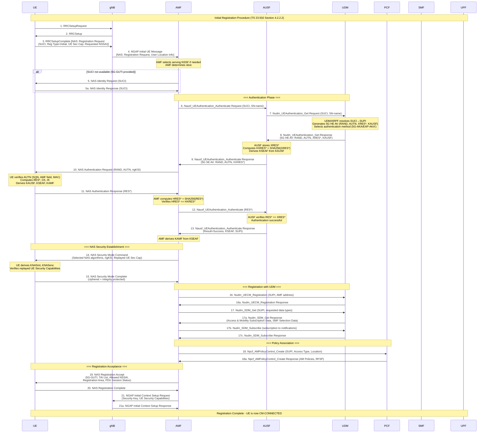
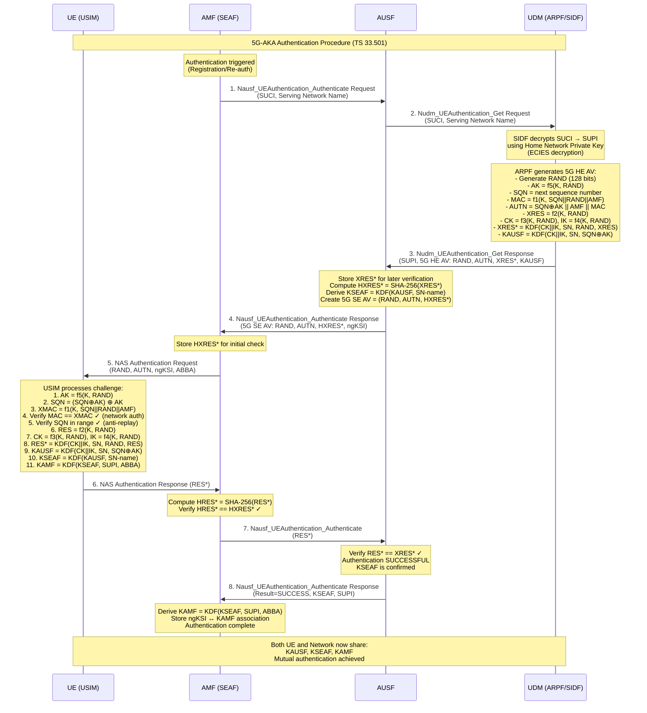
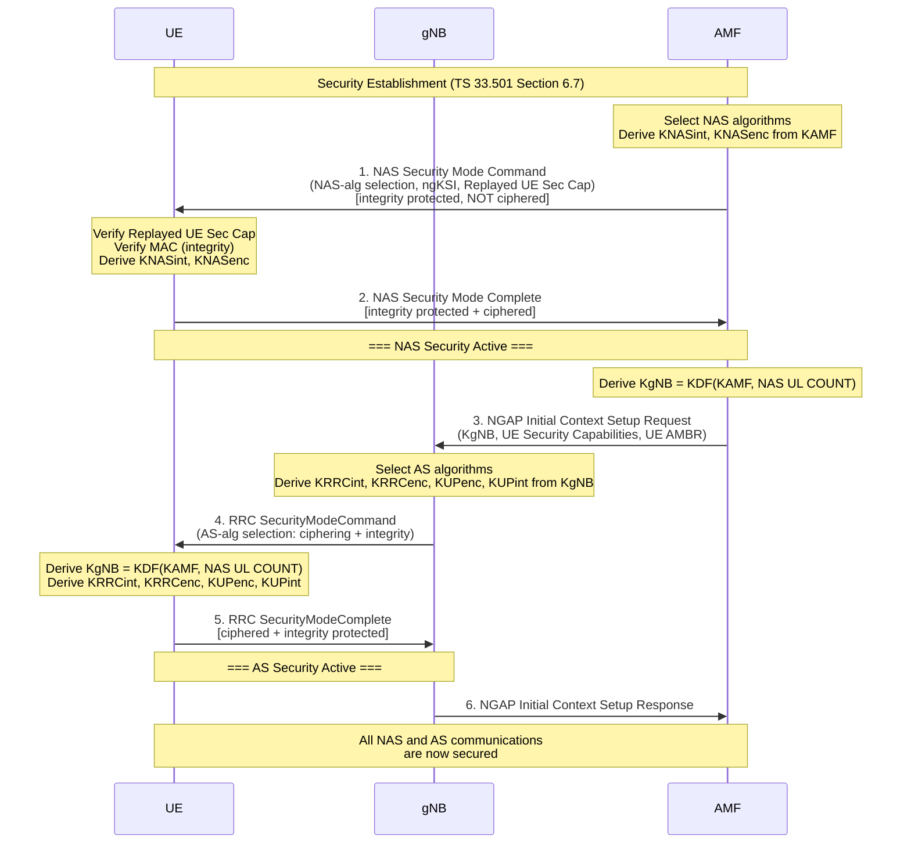
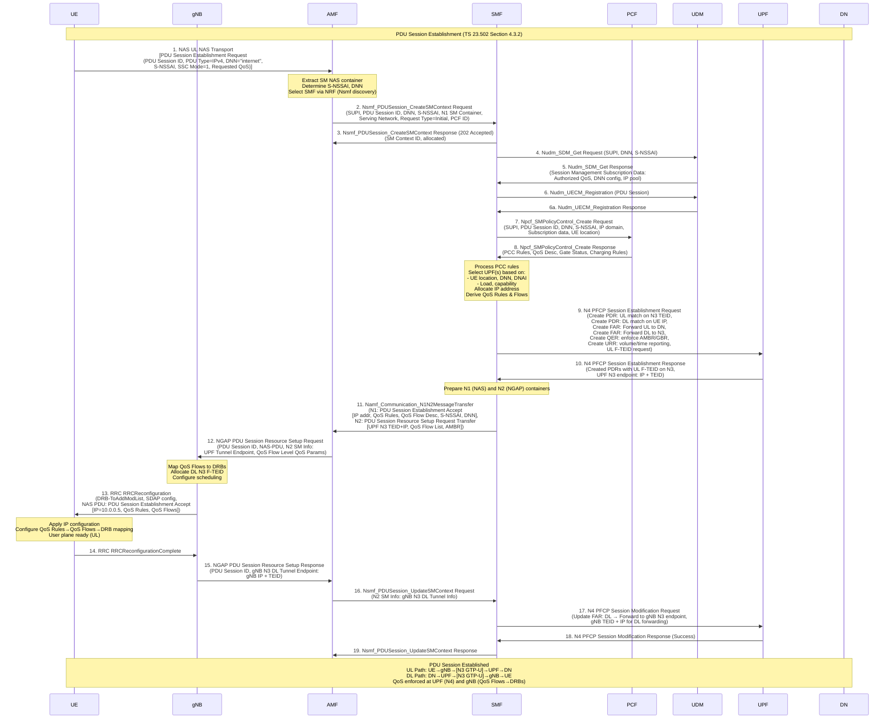
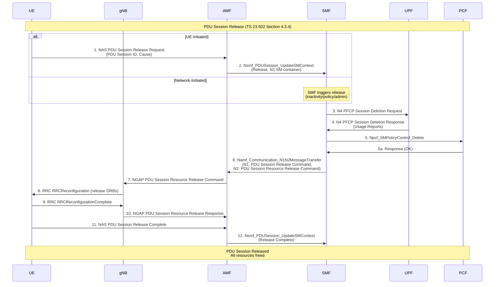
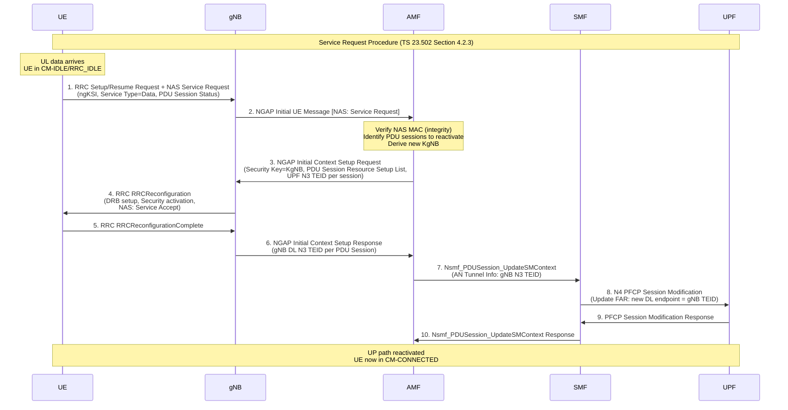
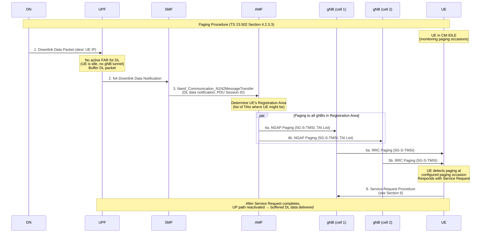
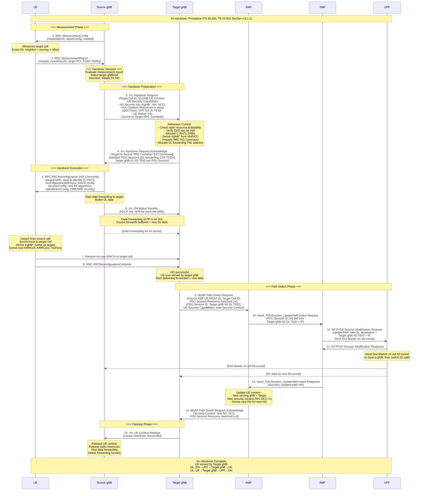
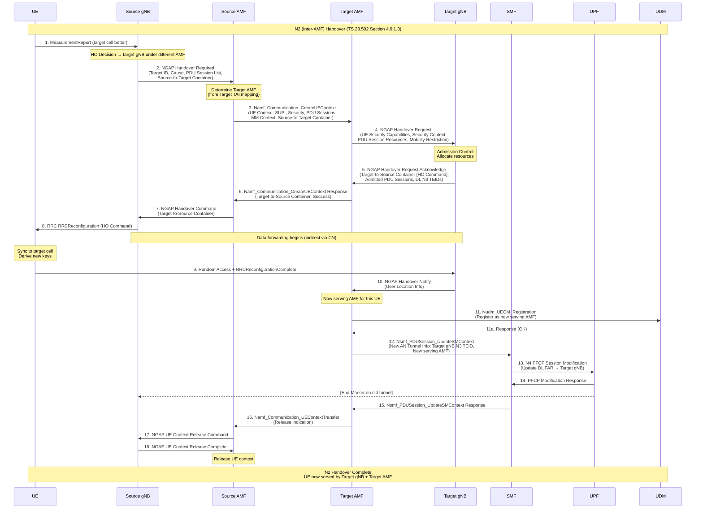

# ماژول 20: رویه‌های 5G

## درس شبکه‌های ارتباطی پیشرفته

---

## فهرست مطالب

1. [ثبت‌نام (ثبت‌نام اولیه)](#1-ثبتنام-ثبتنام-اولیه)
2. [احراز هویت (5G-AKA)](#2-احراز-هویت-5g-aka)
3. [برقراری امنیت](#3-برقراری-امنیت)
4. [برقراری نشست PDU](#4-برقراری-نشست-pdu)
5. [آزادسازی نشست PDU](#5-آزادسازی-نشست-pdu)
6. [درخواست خدمات](#6-درخواست-خدمات)
7. [صفحه‌بندی](#7-صفحهبندی)
8. [تحویل Xn](#8-تحویل-xn)
9. [تحویل N2 (بین-AMF)](#9-تحویل-n2-بین-amf)

---

## 1. ثبت‌نام (ثبت‌نام اولیه)

### هدف

رویه ثبت‌نام اولیه به UE امکان می‌دهد برای اولین بار یا پس از لغو ثبت‌نام، در شبکه هسته 5G (5GC) ثبت‌نام کند. حضور UE در شبکه را برقرار می‌کند، مشترک را احراز هویت می‌کند، یک 5G-GUTI (شناسه موقت یکتای جهانی) تخصیص می‌دهد و به‌صورت اختیاری یک نشست PDU برای اتصال داده برقرار می‌کند.

### پیش‌شرط‌ها

- UE روشن است و یک USIM معتبر با اعتبارنامه‌های اشتراک 5G دارد
- UE یک PLMN انتخاب کرده و روی یک سلول (gNB) کمپ کرده است
- UE در حالت RRC_IDLE یا RRC_INACTIVE است
- UE هیچ 5G-GUTI معتبری ندارد (ثبت‌نام بار اول) یا GUTI قبلی منقضی شده است
- اتصال RRC برقرار شده است (رویه دسترسی تصادفی کامل شده)

### NFهای درگیر

| تابع شبکه | نقش |
|---|---|
| UE | ثبت‌نام را آغاز می‌کند، هویت (SUCI/5G-GUTI) را ارائه می‌دهد |
| gNB | گره RAN، پیام‌های NAS را بین UE و AMF ارسال می‌کند |
| AMF | لنگر ثبت‌نام، AUSF را انتخاب می‌کند، زمینه را مدیریت می‌کند |
| AUSF | کارساز احراز هویت، اعتبارنامه‌ها را اعتبارسنجی می‌کند |
| UDM | داده اشتراک را ذخیره می‌کند، بردارهای احراز هویت را تولید می‌کند |
| ARPF | مخزن اعتبارنامه احراز هویت (درون UDM) |
| PCF | سیاست‌های AM را فراهم می‌کند |
| SMF | مدیریت نشست (در صورت درخواست نشست PDU) |
| UPF | صفحه کاربر (در صورت درخواست نشست PDU) |
| NRF | کشف و انتخاب NF |
| NSSF | انتخاب برش شبکه |

### پیام‌ها

| گام | واسط | پیام |
|---|---|---|
| 1 | Uu (UE←gNB) | RRCSetupRequest |
| 2 | Uu (gNB←UE) | RRCSetup |
| 3 | Uu (UE←gNB) | RRCSetupComplete + NAS Registration Request |
| 4 | N2 (gNB←AMF) | NGAP Initial UE Message (NAS: Registration Request) |
| 5 | N12 (AMF←AUSF) | Nausf_UEAuthentication_Authenticate Request |
| 6 | N13 (AUSF←UDM) | Nudm_UEAuthentication_Get Request |
| 7 | N13 (UDM←AUSF) | Nudm_UEAuthentication_Get Response (AV) |
| 8 | N12 (AUSF←AMF) | Nausf_UEAuthentication_Authenticate Response |
| 9 | N2/NAS (AMF←UE) | Authentication Request (RAND, AUTN) |
| 10 | N2/NAS (UE←AMF) | Authentication Response (RES*) |
| 11 | N12 (AMF←AUSF) | Nausf_UEAuthentication_Authenticate (RES*) |
| 12 | N12 (AUSF←AMF) | Nausf_UEAuthentication_Authenticate (Success + KSEAF) |
| 13 | N2/NAS (AMF←UE) | Security Mode Command |
| 14 | N2/NAS (UE←AMF) | Security Mode Complete |
| 15 | N8 (AMF←UDM) | Nudm_UECM_Registration |
| 16 | N8 (AMF←UDM) | Nudm_SDM_Get (Subscription Data) |
| 17 | N15 (AMF←PCF) | Npcf_AMPolicyControl_Create |
| 18 | N2/NAS (AMF←UE) | Registration Accept (5G-GUTI، TAI List، Allowed NSSAI) |
| 19 | N2/NAS (UE←AMF) | Registration Complete |
| 20 | N2 (AMF←gNB) | NGAP Initial Context Setup Request |

### جریان گام-به-گام

1. **برقراری اتصال RRC**: UE دسترسی تصادفی انجام می‌دهد و RRCSetupRequest را به gNB می‌فرستد
2. **راه‌اندازی RRC**: gNB با پیام RRCSetup پاسخ می‌دهد
3. **درخواست ثبت‌نام**: UE یک RRCSetupComplete حاوی NAS Registration Request می‌فرستد (شامل SUCI یا 5G-GUTI، نوع ثبت‌نام، قابلیت‌های امنیتی UE، NSSAI درخواستی)
4. **انتخاب AMF**: gNB AMF مناسب را انتخاب می‌کند (در صورت نیاز از طریق NSSF) و از طریق NGAP Initial UE Message ارسال می‌کند
5. **درخواست هویت (شرطی)**: اگر AMF نتواند هویت را حل کند، Identity Request را به UE می‌فرستد
6. **حل SUCI**: AMF احراز هویت را آغاز می‌کند؛ SUCI را به AUSF می‌فرستد
7. **درخواست بردار احراز هویت**: AUSF بردار احراز هویت را از UDM/ARPF درخواست می‌کند
8. **تولید AV**: UDM/ARPF یک 5G HE AV تولید می‌کند (RAND، AUTN، XRES*، KAUSF)، SUCI را به SUPI حل می‌کند
9. **پاسخ بردار احراز هویت**: AUSF بردار را دریافت می‌کند، HXRES* را محاسبه می‌کند، XRES* را ذخیره می‌کند
10. **درخواست احراز هویت**: AMF یک NAS Authentication Request به UE می‌فرستد (RAND، AUTN)
11. **تأیید UE**: UE مقدار AUTN را تأیید می‌کند، RES*، CK، IK را محاسبه و KAUSF را مشتق می‌کند
12. **پاسخ احراز هویت**: UE یک Authentication Response (RES*) به AMF می‌فرستد
13. **تأیید RES***: AMF مقدار RES* را به AUSF می‌فرستد؛ AUSF تأیید می‌کند HRES* با HXRES* مطابقت دارد
14. **تأیید احراز هویت**: AUSF به AMF تأیید می‌کند، KSEAF را فراهم می‌کند؛ AMF مقدار KAMF را مشتق می‌کند
15. **امنیت NAS**: AMF یک Security Mode Command می‌فرستد (الگوریتم‌های انتخاب‌شده)؛ UE با Security Mode Complete پاسخ می‌دهد
16. **ثبت‌نام در UDM**: AMF در UDM ثبت‌نام می‌کند (Nudm_UECM_Registration)
17. **بازیابی اشتراک**: AMF داده اشتراک را از UDM بازیابی می‌کند (Nudm_SDM_Get)
18. **انجمن سیاست**: AMF انجمن سیاست AM را با PCF برقرار می‌کند
19. **پذیرش ثبت‌نام**: AMF یک Registration Accept می‌فرستد (5G-GUTI، TAI List، Allowed NSSAI، ناحیه ثبت‌نام)
20. **تکمیل ثبت‌نام**: UE با Registration Complete تأیید می‌کند؛ 5G-GUTI جدید را ذخیره می‌کند

### نمودار توالی تفصیلی



### موارد شکست

| شکست | علت | پاسخ شبکه |
|---|---|---|
| شکست احراز هویت | اعتبارنامه نامعتبر، SQN از همگام‌سازی خارج | Authentication Reject یا Sync Failure |
| رد ثبت‌نام | بدون اشتراک، رومینگ مجاز نیست | Registration Reject (علت: #11، #15) |
| PLMN مجاز نیست | UE برای PLMN بازدیدشده اشتراک ندارد | Registration Reject (علت: #11) |
| ازدحام | اضافه‌بار شبکه | Registration Reject (علت: #22) + تایمر عقب‌نشینی |
| شکست بررسی یکپارچگی | شکست NAS MAC | رد بی‌صدا یا احراز هویت مجدد |
| UDM غیرقابل دسترس | شکست ارتباط SBI | Registration Reject یا تلاش مجدد AMF |
| برش در دسترس نیست | S-NSSAI درخواستی پشتیبانی نمی‌شود | Registration Accept با Allowed NSSAI کاهش‌یافته |

---


## 2. احراز هویت (5G-AKA)

### هدف

رویه 5G-AKA (احراز هویت و توافق کلید) احراز هویت متقابل بین UE و شبکه را فراهم می‌کند و کلیدهای رمزنگاری مشترک را برقرار می‌سازد. تضمین می‌کند شبکه هویت مشترک را تأیید می‌کند و UE تأیید می‌کند که با شبکه‌ای مشروع در ارتباط است. این رویه کلید لنگر (KAUSF) را تولید می‌کند که تمام کلیدهای امنیتی بعدی از آن مشتق می‌شوند.

### پیش‌شرط‌ها

- UE ثبت‌نام را آغاز کرده یا احراز هویت مجدد فعال شده است
- UE یک USIM معتبر با کلید بلندمدت K و OP/OPc دارد
- AUSF از AMF خدمات‌دهنده قابل دسترس است
- UDM/ARPF اعتبارنامه‌های اشتراک معتبر برای مشترک دارد
- SUCI ارائه شده است (یا از UE یا حل‌شده از 5G-GUTI)

### NFهای درگیر

| تابع شبکه | نقش |
|---|---|
| UE (USIM) | کلید دائمی K را نگه می‌دارد؛ AUTN را تأیید می‌کند؛ RES* را محاسبه می‌کند |
| AMF (SEAF) | لنگر امنیتی؛ پیام‌های احراز هویت را رله می‌کند؛ KAMF را مشتق می‌کند |
| AUSF | RES* را در برابر XRES* تأیید می‌کند؛ KSEAF را مشتق می‌کند |
| UDM/ARPF | بردارهای احراز هویت را تولید می‌کند؛ کلید دائمی K را نگه می‌دارد |
| SIDF (درون UDM) | SUCI را برای به‌دست آوردن SUPI رمزگشایی می‌کند |

### پیام‌ها

| گام | واسط | پیام | پارامترهای کلیدی |
|---|---|---|---|
| 1 | N12 | Nausf_UEAuthentication_Authenticate Request | SUCI/SUPI، نام شبکه خدمات‌دهنده |
| 2 | N13 | Nudm_UEAuthentication_Get Request | SUCI/SUPI، نام شبکه خدمات‌دهنده |
| 3 | N13 | Nudm_UEAuthentication_Get Response | 5G HE AV (RAND، AUTN، XRES*، KAUSF) |
| 4 | N12 | Nausf_UEAuthentication_Authenticate Response | 5G SE AV (RAND، AUTN، HXRES*) |
| 5 | NAS | Authentication Request | RAND، AUTN، ngKSI |
| 6 | NAS | Authentication Response | RES* |
| 7 | N12 | Nausf_UEAuthentication_Authenticate | RES* |
| 8 | N12 | Nausf_UEAuthentication_Authenticate Response | Result، KSEAF، SUPI |

### جریان گام-به-گام

1. **محرک**: AMF تعیین می‌کند احراز هویت لازم است (ثبت‌نام اولیه، احراز هویت مجدد دوره‌ای، یا تحویل بین-AMF)
2. **انتخاب AUSF**: AMF بر اساس شبکه خانگی SUPI یک AUSF انتخاب می‌کند (از طریق NRF)
3. **آغاز احراز هویت**: AMF مقدار SUCI و نام شبکه خدمات‌دهنده (SN-name) را به AUSF می‌فرستد
4. **درخواست UDM**: AUSF درخواست را با SUCI و SN-name به UDM ارسال می‌کند
5. **رمزگشایی SUCI**: SIDF (درون UDM) SUCI را با کلید خصوصی شبکه خانگی رمزگشایی می‌کند ← SUPI را به‌دست می‌آورد
6. **تولید AV**: ARPF یک 5G HE AV با استفاده از موارد زیر تولید می‌کند:
   - RAND (چالش تصادفی)
   - AUTN = SQN⊕AK || AMF || MAC (نشانه احراز هویت شبکه)
   - XRES* = KDF(CK, IK, SN-name, RAND, RES) (پاسخ مورد انتظار)
   - KAUSF = KDF(CK, IK, SN-name, SQN⊕AK) (کلید لنگر)
7. **AV به AUSF**: UDM مقدار 5G HE AV را به AUSF بازمی‌گرداند
8. **پردازش AUSF**: AUSF مقدار XRES* را ذخیره می‌کند، HXRES* = SHA-256(XRES*[128..255] || XRES*) را محاسبه می‌کند، KSEAF را از KAUSF مشتق می‌کند
9. **SE AV به AMF**: AUSF مقدار 5G SE AV (RAND، AUTN، HXRES*) را به AMF می‌فرستد
10. **چالش به UE**: AMF یک Authentication Request (RAND، AUTN، ngKSI) به UE می‌فرستد
11. **تأیید UE**: USIM مقدار AUTN را تأیید می‌کند:
    - AK را از RAND با استفاده از f5 استخراج می‌کند، SQN را بازیابی می‌کند
    - XMAC را محاسبه و تأیید می‌کند XMAC == MAC (احراز هویت شبکه)
    - تأیید می‌کند SQN در محدوده قابل قبول است (محافظت از بازپخش)
12. **مشتق‌سازی کلید در UE**: UE موارد زیر را محاسبه می‌کند:
    - RES، CK، IK از RAND با استفاده از f2، f3، f4
    - RES* = KDF(CK, IK, SN-name, RAND, RES)
    - KAUSF = KDF(CK, IK, SN-name, SQN⊕AK)
    - KSEAF = KDF(KAUSF, SN-name)
    - KAMF = KDF(KSEAF, SUPI, ABBA)
13. **پاسخ**: UE یک Authentication Response با RES* به AMF می‌فرستد
14. **تأیید AMF**: AMF مقدار HRES* را محاسبه و تأیید می‌کند HRES* == HXRES*
15. **تأیید AUSF**: AMF مقدار RES* را به AUSF ارسال می‌کند؛ AUSF تأیید می‌کند RES* == XRES*
16. **موفقیت**: AUSF موفقیت، KSEAF و SUPI تأییدشده را به AMF بازمی‌گرداند
17. **مشتق‌سازی KAMF**: AMF مقدار KAMF = KDF(KSEAF, SUPI, ABBA) را مشتق می‌کند

### سلسله‌مراتب کلید مشتق‌شده

```
K (permanent, in USIM and ARPF)
├── CK, IK (from RAND via f3, f4)
│   └── KAUSF = KDF(CK||IK, SN-name, SQN⊕AK)
│       └── KSEAF = KDF(KAUSF, SN-name)
│           └── KAMF = KDF(KSEAF, SUPI, ABBA)
│               ├── KNASint (NAS integrity)
│               ├── KNASenc (NAS ciphering)
│               └── KgNB (RAN key)
│                   ├── KRRCint (RRC integrity)
│                   ├── KRRCenc (RRC ciphering)
│                   └── KUPenc (User plane ciphering)
```

### نمودار توالی تفصیلی



### موارد شکست

| شکست | علت | اقدام UE | اقدام شبکه |
|---|---|---|---|
| شکست MAC | تأیید AUTN شکست می‌خورد (K اشتباه یا دستکاری‌شده) | ارسال Auth Failure (شکست MAC) | AMF به AUSF اطلاع می‌دهد؛ ممکن است تلاش مجدد کند |
| شکست همگام‌سازی SQN | SQN خارج از محدوده قابل قبول | ارسال Auth Failure (شکست همگام‌سازی) + AUTS | UDM مقدار SQN را همگام‌سازی مجدد می‌کند، AV جدید تولید می‌کند |
| شکست احراز هویت شبکه | UE نمی‌تواند هویت شبکه را تأیید کند | لغو احراز هویت | — |
| عدم تطابق RES* | پاسخ UE با مورد انتظار مطابقت ندارد | — | AUSF شکست را گزارش می‌دهد؛ AMF ثبت‌نام را رد می‌کند |
| عدم تطابق HXRES* | بررسی اولیه در AMF شکست می‌خورد | — | AMF همچنان برای تصمیم نهایی به AUSF ارسال می‌کند |
| اتمام زمان AUSF | AUSF غیرقابل دسترس | — | AMF ممکن است AUSF جایگزین انتخاب کند یا رد کند |
| شکست رمزگشایی SUCI | قالب SUCI نامعتبر یا کلید HN اشتباه | — | UDM خطا را گزارش می‌دهد؛ ثبت‌نام شکست می‌خورد |

---


## 3. برقراری امنیت

### هدف

رویه برقراری امنیت، امنیت NAS و AS را بین UE و شبکه فعال می‌کند. الگوریتم‌های رمزگذاری و محافظت یکپارچگی را هم برای سیگنالینگ NAS (بین UE و AMF) و هم برای سیگنالینگ AS/صفحه کاربر (بین UE و gNB) انتخاب و فعال می‌کند. این رویه تضمین می‌کند تمام ارتباطات بعدی در برابر شنود و دستکاری محافظت می‌شوند.

### پیش‌شرط‌ها

- احراز هویت با موفقیت کامل شده است
- KAMF در هر دو UE و AMF مشتق شده است
- قابلیت‌های امنیتی UE به AMF ارائه شده است
- ngKSI برقرار شده است (زمینه امنیتی فعال را شناسایی می‌کند)

### NFهای درگیر

| تابع شبکه | نقش |
|---|---|
| UE | کلیدهای NAS/AS را مشتق می‌کند، انتخاب الگوریتم را تأیید می‌کند |
| AMF | الگوریتم‌های NAS را انتخاب می‌کند، Security Mode Command می‌فرستد، کلیدهای NAS را مشتق می‌کند |
| gNB | الگوریتم‌های AS را انتخاب می‌کند، امنیت RRC/UP را فعال می‌کند |

### پیام‌ها

| گام | واسط | پیام | پارامترهای کلیدی |
|---|---|---|---|
| 1 | NAS | Security Mode Command | الگوریتم‌های NAS، ngKSI، Replayed UE Sec Cap، درخواست IMEISV |
| 2 | NAS | Security Mode Complete | IMEISV (در صورت درخواست)، محفظه پیام NAS |
| 3 | N2 | Initial Context Setup Request | KgNB، قابلیت‌های امنیتی UE |
| 4 | RRC | SecurityModeCommand | الگوریتم‌های AS (رمزگذاری + یکپارچگی) |
| 5 | RRC | SecurityModeComplete | — |
| 6 | N2 | Initial Context Setup Response | — |

### جریان گام-به-گام

1. **انتخاب الگوریتم NAS**: AMF الگوریتم‌های امنیتی NAS را بر اساس قابلیت‌های امنیتی UE و سیاست AMF انتخاب می‌کند (الگوریتم با بالاترین اولویت که هر دو پشتیبانی می‌کنند)
2. **مشتق‌سازی کلید NAS (AMF)**: AMF موارد زیر را مشتق می‌کند:
   - KNASint = KDF(KAMF, NAS-int-alg-ID, alg-type)
   - KNASenc = KDF(KAMF, NAS-enc-alg-ID, alg-type)
3. **Security Mode Command**: AMF یک NAS Security Mode Command می‌فرستد (محافظت‌شده با یکپارچگی با KNASint اما **رمزگذاری‌نشده**):
   - الگوریتم رمزگذاری NAS انتخاب‌شده (مثلاً NEA1، NEA2)
   - الگوریتم یکپارچگی NAS انتخاب‌شده (مثلاً NIA1، NIA2)
   - ngKSI، قابلیت‌های امنیتی UE بازپخش‌شده، درخواست IMEISV
4. **تأیید UE**: UE موارد زیر را تأیید می‌کند:
   - قابلیت‌های امنیتی UE بازپخش‌شده با آنچه فرستاده شده مطابقت دارند (ضد-MITM)
   - محافظت یکپارچگی پیام با استفاده از KNASint مشتق‌شده
5. **مشتق‌سازی کلید NAS (UE)**: UE مقدار KNASint و KNASenc را با همان KDF مشتق می‌کند
6. **Security Mode Complete**: UE یک NAS Security Mode Complete می‌فرستد (محافظت‌شده با یکپارچگی **و** رمزگذاری‌شده)
7. **فعال‌شدن امنیت NAS**: زمینه امنیتی NAS اکنون در هر دو جهت فعال است
8. **مشتق‌سازی KgNB**: AMF مقدار KgNB = KDF(KAMF, NAS UL COUNT) را مشتق و از طریق Initial Context Setup Request به gNB می‌فرستد
9. **انتخاب الگوریتم AS**: gNB الگوریتم‌های AS را بر اساس قابلیت‌های امنیتی UE و سیاست gNB انتخاب می‌کند
10. **مشتق‌سازی کلید AS**: gNB موارد زیر را مشتق می‌کند:
    - KRRCint = KDF(KgNB, RRC-int-alg-ID)
    - KRRCenc = KDF(KgNB, RRC-enc-alg-ID)
    - KUPenc = KDF(KgNB, UP-enc-alg-ID)
    - KUPint = KDF(KgNB, UP-int-alg-ID) [اختیاری برای DRBها]
11. **RRC Security Mode Command**: gNB یک RRC SecurityModeCommand به UE می‌فرستد (محافظت‌شده با یکپارچگی)
12. **مشتق‌سازی کلید AS در UE**: UE همان کلیدهای AS را از KgNB مشتق می‌کند
13. **RRC Security Mode Complete**: UE با یک RRC SecurityModeComplete پاسخ می‌دهد (رمزگذاری‌شده + محافظت‌شده با یکپارچگی)
14. **فعال‌شدن امنیت AS**: امنیت کامل AS اکنون فعال است

### نمودار سلسله‌مراتب کلید

```
KAUSF (from authentication)
  └── KSEAF = KDF(KAUSF, Serving Network Name)
       └── KAMF = KDF(KSEAF, SUPI, ABBA)
            ├── KNASint = KDF(KAMF, algorithm-type=0x02, NIA-alg-id)
            ├── KNASenc = KDF(KAMF, algorithm-type=0x01, NEA-alg-id)
            └── KgNB = KDF(KAMF, NAS Uplink COUNT)
                 ├── KRRCint = KDF(KgNB, algorithm-type=0x04, NIA-alg-id)
                 ├── KRRCenc = KDF(KgNB, algorithm-type=0x03, NEA-alg-id)
                 ├── KUPenc = KDF(KgNB, algorithm-type=0x05, NEA-alg-id)
                 ├── KUPint = KDF(KgNB, algorithm-type=0x06, NIA-alg-id)
                 └── NH = KDF(KAMF, KgNB) [for handover forward security]
                      └── KgNB* = KDF(NH, Target PCI, DL ARFCN) [handover]
```

### نمودار توالی فشرده



### موارد شکست

| شکست | علت | پاسخ |
|---|---|---|
| عدم تطابق قابلیت‌های امنیتی UE | قابلیت‌های بازپخش‌شده مطابقت ندارند (حمله کاهش تدریجی) | UE یک Security Mode Reject می‌فرستد |
| شکست تأیید یکپارچگی | بررسی MAC روی Security Mode Command شکست می‌خورد | UE یک Security Mode Reject می‌فرستد |
| الگوریتم پشتیبانی نمی‌شود | الگوریتم انتخاب‌شده در قابلیت‌های UE نیست | UE یک Security Mode Reject می‌فرستد |
| رد حالت امنیتی NAS | هر شکست NAS SMC | AMF ممکن است دوباره تلاش کند یا ثبت‌نام را رد کند |
| شکست حالت امنیتی AS | بررسی یکپارچگی RRC SMC شکست می‌خورد | gNB شکست را گزارش می‌دهد؛ ممکن است اتصال را آزاد کند |
| یکپارچگی تهی مجاز نیست | NIA0 انتخاب‌شده در حالی که مجاز نیست | UE رد می‌کند (NIA0 فقط برای اضطراری) |

---

## 4. برقراری نشست PDU

### هدف

رویه برقراری نشست PDU یک نشست اتصال داده بین UE و یک شبکه داده (DN) ایجاد می‌کند. یک آدرس IP (یا نوع PDU دیگر) تخصیص می‌دهد، قواعد و جریان‌های QoS را تنظیم می‌کند، تونل‌های GTP-U روی واسط‌های N3 (gNB↔UPF) و N9 (UPF↔UPF) برقرار می‌کند و نشست‌های PFCP روی N4 (SMF↔UPF) را پیکربندی می‌کند. این به UE امکان می‌دهد داده صفحه کاربر بفرستد و دریافت کند.

### پیش‌شرط‌ها

- UE در 5GC ثبت‌نام کرده است (رویه ثبت‌نام کامل شده)
- UE در حالت CM-CONNECTED است (اتصال RRC فعال)
- زمینه امنیتی NAS برقرار شده است
- UE اشتراک معتبر برای DNN و S-NSSAI درخواستی دارد
- منابع SMF و UPF برای برش درخواستی در دسترس هستند

### NFهای درگیر

| تابع شبکه | نقش |
|---|---|
| UE | درخواست نشست را آغاز می‌کند، DNN/S-NSSAI/نوع PDU را ارائه می‌دهد |
| gNB | NAS را ارسال می‌کند، تونل GTP-U در N3 را برقرار می‌کند |
| AMF | پیام‌های NAS مربوط به SM را مسیریابی می‌کند، SMF را انتخاب می‌کند |
| SMF | مدیریت نشست، تخصیص IP، سیاست QoS، انتخاب/کنترل UPF |
| UPF | ارسال صفحه کاربر، تشخیص/اجرای بسته |
| PCF | سیاست‌های SM و قواعد PCC را فراهم می‌کند |
| UDM | داده اشتراک مدیریت نشست را فراهم می‌کند |
| DN-AAA | احراز هویت خارجی (در صورت نیاز DN) |
| CHF | تابع صورت‌حساب |

### پیام‌ها

| گام | واسط | پیام |
|---|---|---|
| 1 | NAS | PDU Session Establishment Request (در UL NAS Transport) |
| 2 | N11 | Nsmf_PDUSession_CreateSMContext Request |
| 3 | N10 | Nudm_SDM_Get (SM Subscription Data) |
| 4 | N7 | Npcf_SMPolicyControl_Create |
| 5 | N4 | PFCP Session Establishment Request |
| 6 | N4 | PFCP Session Establishment Response |
| 7 | N11 | Nsmf_PDUSession_CreateSMContext Response |
| 8 | N11 | Namf_Communication_N1N2MessageTransfer |
| 9 | N2 | NGAP PDU Session Resource Setup Request |
| 10 | RRC | RRCReconfiguration (راه‌اندازی DRB) |
| 11 | RRC | RRCReconfigurationComplete |
| 12 | N2 | NGAP PDU Session Resource Setup Response |
| 13 | N11 | Nsmf_PDUSession_UpdateSMContext (اطلاعات N2) |
| 14 | N4 | PFCP Session Modification Request (اطلاعات تونل DL) |
| 15 | NAS | PDU Session Establishment Accept |

### جریان گام-به-گام

1. **درخواست UE**: UE یک PDU Session Establishment Request می‌فرستد شامل:
   - شناسه نشست PDU، نوع PDU (IPv4/IPv6/IPv4v6/Ethernet/Unstructured)
   - DNN درخواستی، S-NSSAI، حالت SSC
   - محفظه درخواست DN در PDU مربوط به SM (اختیاری)
   - قواعد QoS و توصیف‌های جریان QoS درخواستی
2. **انتقال NAS**: AMF پیام UL NAS Transport با محفظه NAS مربوط به SM را دریافت می‌کند
3. **انتخاب SMF**: AMF بر اساس DNN، S-NSSAI، PLMN و کشف NRF یک SMF انتخاب می‌کند
4. **ایجاد زمینه SM**: AMF یک Nsmf_PDUSession_CreateSMContext به SMF انتخاب‌شده می‌فرستد
5. **داده اشتراک**: SMF داده اشتراک مدیریت نشست را از UDM بازیابی می‌کند (Nudm_SDM_Get)
6. **ثبت‌نام SMF**: SMF برای نشست PDU در UDM ثبت‌نام می‌کند
7. **انجمن سیاست**: SMF انجمن سیاست SM را با PCF ایجاد می‌کند (Npcf_SMPolicyControl_Create)
8. **پاسخ PCF**: PCF قواعد PCC، سیاست‌های QoS و قواعد صورت‌حساب را بازمی‌گرداند
9. **انتخاب UPF**: SMF بر اساس مکان UE، DNN، برش و نیازمندی‌های مسیر داده UPF(های) مناسب را انتخاب می‌کند
10. **تخصیص IP**: SMF آدرس/پیشوند IP را تخصیص می‌دهد (از استخر محلی، استخر UPF، یا DHCP/AAA خارجی)
11. **برقراری نشست N4**: SMF یک PFCP Session Establishment Request به UPF می‌فرستد:
    - PDRها (قواعد تشخیص بسته)، FARها (قواعد اقدام ارسال)
    - QERها (قواعد اجرای QoS)، URRها (قواعد گزارش‌دهی مصرف)
    - نقطه انتهایی تونل UL (F-TEID روی UPF برای N3)
12. **پاسخ UPF**: UPF با F-TEID تخصیص‌یافته پاسخ می‌دهد (نقطه انتهایی UL در N3)
13. **انتقال پیام N1N2**: SMF به AMF می‌فرستد:
    - محفظه N1 SM: PDU Session Establishment Accept (آدرس IP، قواعد QoS، S-NSSAI)
    - محفظه N2 SM: PDU Session Resource Setup Request Transfer (TEID مربوط به N3 در UPF، پروفایل QoS)
14. **راه‌اندازی RAN**: AMF از طریق NGAP PDU Session Resource Setup Request به gNB ارسال می‌کند
15. **برقراری DRB**: gNB جریان‌های QoS را به DRBها نگاشت می‌کند، RRCReconfiguration را به UE می‌فرستد
16. **پیکربندی UE**: UE قواعد QoS را اعمال می‌کند، DRBها را پیکربندی می‌کند، با RRCReconfigurationComplete پاسخ می‌دهد
17. **پاسخ gNB**: gNB یک NGAP PDU Session Resource Setup Response می‌فرستد (F-TEID مربوط به N3 در gNB برای DL)
18. **به‌روزرسانی مسیر**: AMF اطلاعات تونل DL مربوط به gNB را به SMF ارسال می‌کند (Nsmf_PDUSession_UpdateSMContext)
19. **اصلاح N4**: SMF یک PFCP Session Modification با نقطه انتهایی تونل DL (F-TEID مربوط به gNB) به UPF می‌فرستد
20. **نشست فعال**: مسیر صفحه کاربر سرتاسری برقرار است: UE↔gNB↔UPF↔DN

### نمودار توالی تفصیلی



### موارد شکست

| شکست | علت | پاسخ |
|---|---|---|
| منابع ناکافی | هیچ آدرس IP در دسترس نیست یا UPF اضافه‌بار دارد | PDU Session Establishment Reject (علت: #26) |
| DNN اشتراک‌نشده | UE برای DNN درخواستی مجاز نیست | Reject (علت: #27) |
| S-NSSAI نامعتبر | برش در Allowed NSSAI نیست | Reject (علت: #62) |
| SMF در دسترس نیست | هیچ SMF برای DNN/برش در دسترس نیست | AMF درخواست را رد می‌کند |
| شکست انتخاب UPF | هیچ UPF مناسبی یافت نشد | SMF نشست را رد می‌کند |
| رد سیاست PCF | PCF نشست را بر اساس سیاست رد می‌کند | SMF نشست را رد می‌کند |
| شکست برقراری N4 | PFCP به UPF شکست می‌خورد | SMF دوباره تلاش می‌کند یا رد می‌کند |
| شکست راه‌اندازی DRB | gNB نمی‌تواند منابع رادیویی تخصیص دهد | راه‌اندازی منابع جزئی/شکست‌خورده به AMF گزارش می‌شود |
| رسیدن به حداکثر نشست‌ها | محدودیت اشتراک UE تجاوز شده | Reject (علت: #65) |
| شکست شبکه | مسئله شبکه انتقال | اتمام زمان برقراری نشست |

---


## 5. آزادسازی نشست PDU

### هدف

رویه آزادسازی نشست PDU یک نشست PDU موجود را تخریب می‌کند و تمام منابع مرتبط شامل آدرس IP، تونل‌های GTP-U (N3/N9)، نشست‌های PFCP (N4)، جریان‌های QoS و DRBها را آزاد می‌کند. می‌تواند توسط UE (کاربر دیگر به اتصال نیاز ندارد)، SMF (تایمر بی‌فعالیتی، سیاست) یا AMF (لغو ثبت‌نام) آغاز شود.

### پیش‌شرط‌ها

- یک نشست PDU فعال وجود دارد (زمینه SM در SMF، نشست N4 در UPF)
- UE در شبکه ثبت‌نام کرده است
- زمینه امنیتی NAS فعال است

### NFهای درگیر

| تابع شبکه | نقش |
|---|---|
| UE | آزادسازی را آغاز می‌کند (با محرک UE) یا تأیید می‌کند |
| gNB | DRBها و منابع تونل N3 را آزاد می‌کند |
| AMF | پیام‌های NAS مربوط به SM را مسیریابی می‌کند |
| SMF | آزادسازی را هماهنگ می‌کند، زمینه SM را حذف می‌کند |
| UPF | نشست PFCP را حذف می‌کند، تونل‌ها را آزاد می‌کند |
| PCF | انجمن سیاست SM را خاتمه می‌دهد |
| UDM | نشست PDU را لغو ثبت‌نام می‌کند |
| CHF | رکورد صورت‌حساب نهایی |

### پیام‌ها

| گام | واسط | پیام |
|---|---|---|
| 1 | NAS | PDU Session Release Request (با محرک UE) |
| 2 | N11 | Nsmf_PDUSession_UpdateSMContext (Release) |
| 3 | N4 | PFCP Session Deletion Request |
| 4 | N4 | PFCP Session Deletion Response |
| 5 | N7 | Npcf_SMPolicyControl_Delete |
| 6 | N2 | NGAP PDU Session Resource Release Command |
| 7 | NAS | PDU Session Release Command |
| 8 | RRC | RRCReconfiguration (آزادسازی DRB) |
| 9 | N2 | NGAP PDU Session Resource Release Response |
| 10 | NAS | PDU Session Release Complete |

### جریان گام-به-گام

#### آزادسازی با محرک UE
1. UE یک PDU Session Release Request می‌فرستد (شناسه نشست PDU، علت)
2. AMF به SMF ارسال می‌کند (Nsmf_PDUSession_UpdateSMContext)
3. SMF پاک‌سازی منابع را آغاز می‌کند
4. SMF یک PFCP Session Deletion Request به UPF می‌فرستد
5. UPF تونل‌ها را آزاد می‌کند، با PFCP Session Deletion Response پاسخ می‌دهد
6. SMF انجمن سیاست PCF را خاتمه می‌دهد
7. SMF نشست را از UDM لغو ثبت‌نام می‌کند
8. SMF یک PDU Session Release Command به UE می‌فرستد (از طریق انتقال N1N2 در AMF)
9. AMF یک NGAP PDU Session Resource Release Command به gNB می‌فرستد
10. gNB DRBها را آزاد می‌کند، RRCReconfiguration را به UE می‌فرستد
11. gNB با PDU Session Resource Release Response پاسخ می‌دهد
12. UE یک PDU Session Release Complete می‌فرستد

#### آزادسازی با محرک شبکه
1. SMF تصمیم به آزادسازی می‌گیرد (بی‌فعالیتی، تغییر سیاست، لغو اشتراک)
2. SMF یک PDU Session Release Command از طریق AMF به UE می‌فرستد
3. گام‌های باقی‌مانده مشابه آزادسازی با محرک UE از گام 9 است

### نمودار توالی فشرده



### موارد شکست

| شکست | علت | پاسخ |
|---|---|---|
| UPF غیرقابل دسترس | شکست مسیر N4 | SMF دوباره تلاش می‌کند؛ پاک‌سازی محلی پس از اتمام زمان |
| UE غیرقابل دسترس (CM-IDLE) | UE در حالت بیکار | SMF پاک‌سازی سمت شبکه را ادامه می‌دهد |
| انقضای تایمر | بدون پاسخ از UE | آزادسازی ضمنی؛ پاک‌سازی منابع محلی |
| آزادسازی جزئی | برخی منابع آزاد نمی‌شوند | SMF پاک‌سازی منابع باقی‌مانده را انجام می‌دهد |

---

## 6. درخواست خدمات

### هدف

رویه درخواست خدمات به UE در حالت CM-IDLE (یا CM-CONNECTED با صفحه کاربر غیرفعال) امکان می‌دهد اتصالات سیگنالینگ و/یا صفحه کاربر را زمانی که داده یا سیگنالینگ پیوند بالاسو باید فرستاده شود، دوباره برقرار کند. گذار از RRC_IDLE/RRC_INACTIVE به RRC_CONNECTED را فعال می‌کند و مسیر صفحه کاربر (تونل‌های GTP-U در N3) را برای نشست‌های PDU موجود دوباره فعال می‌کند.

### پیش‌شرط‌ها

- UE با زمینه ثبت‌نام معتبر ثبت‌نام کرده است
- UE در حالت CM-IDLE (RRC_IDLE یا RRC_INACTIVE) است
- UE حداقل یک نشست PDU فعال دارد (منابع UP برای فعال‌سازی مجدد)
- زمینه امنیتی NAS وجود دارد (KAMF، KNASint، KNASenc در دسترس)
- UE داده پیوند بالاسو یا سیگنالینگ NAS برای فرستادن دارد

### NFهای درگیر

| تابع شبکه | نقش |
|---|---|
| UE | هنگام رسیدن داده UL درخواست خدمات را فعال می‌کند |
| gNB | اتصال RRC را برقرار می‌کند، DRBها را تخصیص می‌دهد |
| AMF | درخواست خدمات را پردازش می‌کند، فعال‌سازی مجدد UP را هماهنگ می‌کند |
| SMF | نشست N4 را با اطلاعات تونل DL جدید به‌روزرسانی می‌کند |
| UPF | FAR به‌روزشده برای ارسال DL را دریافت می‌کند |

### پیام‌ها

| گام | واسط | پیام |
|---|---|---|
| 1 | Uu | RRC Resume/Setup Request (اگر RRC_INACTIVE/IDLE) |
| 2 | NAS | Service Request (ngKSI، وضعیت نشست PDU) |
| 3 | N2 | NGAP Initial UE Message یا UE Context Resume |
| 4 | N2 | NGAP Initial Context Setup / PDU Session Resource Setup |
| 5 | N11 | Nsmf_PDUSession_UpdateSMContext (فعال‌سازی UP) |
| 6 | N4 | PFCP Session Modification (TEID جدید DL) |
| 7 | RRC | RRCReconfiguration (فعال‌سازی مجدد DRB) |
| 8 | NAS | Service Accept |

### جریان گام-به-گام

1. **محرک**: کاربرد UE داده پیوند بالاسو تولید می‌کند؛ لایه NAS حالت CM-IDLE را تشخیص می‌دهد
2. **اتصال RRC**: UE اتصال RRC را آغاز می‌کند (RRC Setup از IDLE یا RRC Resume از INACTIVE)
3. **درخواست خدمات**: UE یک NAS Service Request می‌فرستد (محافظت‌شده با یکپارچگی با KNASint):
   - ngKSI، نوع خدمات (سیگنالینگ/داده/با مقصد موبایل)
   - وضعیت نشست PDU، وضعیت داده پیوند بالاسو
4. **پردازش AMF**: AMF یکپارچگی را تأیید می‌کند، نشست‌های PDU فعال را شناسایی می‌کند
5. **فعال‌سازی امنیت**: AMF یک KgNB جدید به gNB می‌فرستد (Initial Context Setup یا UE Context Resume)
6. **فعال‌سازی مجدد UP**: برای هر نشست PDU که باید دوباره فعال شود:
   - AMF یک Nsmf_PDUSession_UpdateSMContext به SMF می‌فرستد (اطلاعات AN جدید لازم است)
   - gNB DRBها را تخصیص می‌دهد، TEID مربوط به N3 در DL را اختصاص می‌دهد
   - SMF UPF را با اطلاعات تونل DL جدید به‌روزرسانی می‌کند (PFCP Session Modification)
7. **راه‌اندازی DRB**: gNB یک RRCReconfiguration با پیکربندی DRB به UE می‌فرستد
8. **پذیرش خدمات**: AMF یک Service Accept به UE می‌فرستد
9. **جریان داده**: مسیر صفحه کاربر دوباره برقرار می‌شود؛ داده DL بافر‌شده ارسال می‌شود

### نمودار توالی فشرده



### موارد شکست

| شکست | علت | پاسخ |
|---|---|---|
| شکست یکپارچگی | تأیید NAS MAC شکست می‌خورد | AMF رد می‌کند؛ ممکن است احراز هویت مجدد را فعال کند |
| زمینه یافت نشد | AMF زمینه UE را ندارد (مثلاً راه‌اندازی مجدد AMF) | Service Reject (علت: #9) ← UE دوباره ثبت‌نام می‌کند |
| عدم تطابق نشست PDU | ناسازگاری وضعیت بین UE و شبکه | AMF همگام‌سازی وضعیت نشست PDU را فعال می‌کند |
| منابع RAN در دسترس نیست | gNB نمی‌تواند DRBها را تخصیص دهد | پذیرش جزئی یا رد |
| زمینه امنیتی نامعتبر | عدم تطابق ngKSI یا زمینه منقضی | فعال‌سازی احراز هویت مجدد |

---

## 7. صفحه‌بندی

### هدف

رویه صفحه‌بندی به شبکه امکان می‌دهد به UE در حالت CM-IDLE دسترسی یابد زمانی که داده یا سیگنالینگ پیوند پایین‌سو برای آن UE می‌رسد. AMF پیام‌های صفحه‌بندی را به تمام gNBها در ناحیه ثبت‌نام UE (مجموعه‌ای از نواحی ردیابی) توزیع می‌کند و UE با یک درخواست خدمات پاسخ می‌دهد تا اتصال را دوباره برقرار کند.

### پیش‌شرط‌ها

- UE در حالت CM-IDLE است (RRC_IDLE یا RRC_INACTIVE)
- داده پیوند پایین‌سو در UPF برای UE می‌رسد، یا سیگنالینگ MT در انتظار است
- AMF زمینه UE معتبر با اطلاعات ناحیه ثبت‌نام دارد
- UE در سلول فعلی خود موقعیت‌های صفحه‌بندی را پایش می‌کند

### NFهای درگیر

| تابع شبکه | نقش |
|---|---|
| UPF | داده DL برای UE بیکار را تشخیص می‌دهد، اعلان می‌فرستد |
| SMF | اعلان داده را دریافت می‌کند، صفحه‌بندی را از طریق AMF فعال می‌کند |
| AMF | صفحه‌بندی را به gNBها در ناحیه ثبت‌نام توزیع می‌کند |
| gNB(ها) | پیام صفحه‌بندی را روی واسط Uu پخش می‌کند |
| UE | صفحه‌بندی را پایش می‌کند، درخواست خدمات را آغاز می‌کند |

### پیام‌ها

| گام | واسط | پیام |
|---|---|---|
| 1 | N4 | Downlink Data Notification (UPF←SMF از طریق PFCP) |
| 2 | N11 | Nsmf_PDUSession_UpdateSMContext (داده DL در انتظار) یا Namf_Communication_N1N2MessageTransfer |
| 3 | N2 | NGAP Paging (به تمام gNBها در ناحیه ثبت‌نام) |
| 4 | Uu | پیام RRC Paging (5G-S-TMSI) |
| 5 | Uu | Service Request (پاسخ UE) |

### جریان گام-به-گام

1. **رسیدن داده DL**: یک بسته پیوند پایین‌سو در UPF برای UE در حالت CM-IDLE می‌رسد
2. **اعلان داده**: UPF بسته را بافر می‌کند و یک Downlink Data Notification به SMF می‌فرستد (از طریق N4 PFCP)
3. **محرک صفحه‌بندی**: SMF یک Namf_Communication_N1N2MessageTransfer یا اعلان Nsmf به AMF می‌فرستد که نشان می‌دهد داده DL در انتظار است
4. **توزیع صفحه‌بندی**: AMF یک پیام NGAP Paging به تمام gNBها در ناحیه ثبت‌نام UE می‌فرستد:
   - 5G-S-TMSI (برای شناسایی UE)
   - فهرست TAI (شناسه‌های ناحیه ردیابی)
   - اولویت صفحه‌بندی (در صورت کاربرد)
   - اطلاعات DRX صفحه‌بندی
5. **صفحه‌بندی RRC**: هر gNB پیام RRC Paging را روی PCCH در موقعیت صفحه‌بندی UE پخش می‌کند
6. **تشخیص UE**: UE در موقعیت صفحه‌بندی خود بیدار می‌شود (تعیین‌شده با 5G-S-TMSI و چرخه DRX)، هویت خود را تشخیص می‌دهد
7. **درخواست خدمات**: UE رویه درخواست خدمات را آغاز می‌کند (بخش 6 را ببینید)
8. **تحویل داده**: پس از فعال‌سازی مجدد مسیر UP، UPF داده DL بافر‌شده را ارسال می‌کند
9. **تلاش مجدد صفحه‌بندی**: اگر UE در T3513 پاسخ ندهد، AMF صفحه‌بندی را دوباره تلاش می‌کند (تا حداکثر بازارسال‌های پیکربندی‌شده)

### نمودار توالی فشرده



### موارد شکست

| شکست | علت | پاسخ |
|---|---|---|
| UE پاسخ نمی‌دهد | UE خاموش است، خارج از پوشش | AMF دوباره تلاش می‌کند (T3513)؛ در نهایت به SMF اطلاع می‌دهد |
| اتمام زمان صفحه‌بندی | رسیدن به حداکثر بازارسال‌ها | AMF به SMF اطلاع می‌دهد؛ UPF ممکن است داده بافر‌شده را دور بریزد |
| ناحیه ثبت‌نام اشتباه | UE بدون به‌روزرسانی TA جابه‌جا شده | صفحه‌بندی شکست می‌خورد؛ UE در نهایت دوباره ثبت‌نام می‌کند |
| سرریز بافر UPF | داده DL بافر‌شده بیش از حد | UPF قدیمی‌ترین بسته‌ها را دور می‌ریزد |
| ازدحام صفحه‌بندی | درخواست‌های صفحه‌بندی بیش از حد | AMF محدودیت‌ها/اولویت‌های صفحه‌بندی را اعمال می‌کند |

---


## 8. تحویل Xn

### هدف

رویه تحویل Xn اتصال UE را از gNB مبدأ به gNB مقصد روی واسط Xn بدون دخالت AMF در تصمیم تحویل منتقل می‌کند. تحرک بی‌وقفه با حداقل وقفه سرویس فراهم می‌کند. gNB مبدأ تصمیم تحویل را بر اساس گزارش‌های اندازه‌گیری می‌گیرد، gNB مقصد را آماده می‌کند و مسیر صفحه کاربر در UPF سوئیچ می‌شود. این زمانی استفاده می‌شود که هر دو gNB به همان AMF متصل باشند و واسط Xn بین آن‌ها وجود داشته باشد.

### پیش‌شرط‌ها

- UE در حالت RRC_CONNECTED با نشست‌های PDU فعال است
- واسط Xn بین gNBهای مبدأ و مقصد وجود دارد
- هر دو gNB توسط همان AMF خدمات‌دهی می‌شوند
- گزارش‌های اندازه‌گیری UE نشان می‌دهند سلول مقصد بهتر از مبدأ است
- سلول مقصد به همان برش شبکه یا برش سازگار تعلق دارد
- gNB مبدأ زمینه امنیتی UE و کلیدهای AS فعال را دارد

### NFهای درگیر

| تابع شبکه | نقش |
|---|---|
| UE | گزارش‌های اندازه‌گیری می‌فرستد، تحویل به مقصد را انجام می‌دهد |
| gNB مبدأ | تصمیم تحویل می‌گیرد، مقصد را آماده می‌کند، داده ارسال می‌کند |
| gNB مقصد | UE را می‌پذیرد، منابع تخصیص می‌دهد، خدمات‌دهنده جدید می‌شود |
| AMF | زمینه UE را با gNB خدمات‌دهنده جدید به‌روزرسانی می‌کند (تغییر مسیر) |
| SMF | نشست N4 را برای تونل پیوند پایین‌سو جدید به‌روزرسانی می‌کند |
| UPF | مسیر پیوند پایین‌سو را به gNB مقصد سوئیچ می‌کند |

### پیام‌ها

| گام | واسط | پیام |
|---|---|---|
| 1 | Uu | RRC MeasurementReport (UE←gNB مبدأ) |
| 2 | Xn | Handover Request (مبدأ←مقصد) |
| 3 | Xn | Handover Request Acknowledge (مقصد←مبدأ) |
| 4 | Uu | RRC RRCReconfiguration (فرمان تحویل) |
| 5 | — | UE از مبدأ جدا می‌شود، به مقصد همگام می‌شود |
| 6 | Uu | RRC RRCReconfigurationComplete (UE←مقصد) |
| 7 | Xn | SN Status Transfer (مبدأ←مقصد) |
| 8 | N2 | NGAP Path Switch Request (مقصد←AMF) |
| 9 | N11 | Nsmf_PDUSession_UpdateSMContext (AMF←SMF) |
| 10 | N4 | PFCP Session Modification (SMF←UPF) |
| 11 | N11 | Nsmf_PDUSession_UpdateSMContext Response |
| 12 | N2 | NGAP Path Switch Request Acknowledge (AMF←مقصد) |
| 13 | Xn | UE Context Release (مقصد←مبدأ) |

### جریان گام-به-گام

1. **پیکربندی اندازه‌گیری**: gNB مبدأ UE را با اشیای اندازه‌گیری و معیارهای گزارش‌دهی پیکربندی می‌کند
2. **گزارش اندازه‌گیری**: UE تشخیص می‌دهد سیگنال سلول مقصد به آستانه می‌رسد؛ یک MeasurementReport به gNB مبدأ می‌فرستد
3. **تصمیم تحویل**: gNB مبدأ گزارش اندازه‌گیری را ارزیابی می‌کند، سلول مقصد را انتخاب می‌کند، تصمیم به تحویل می‌گیرد
4. **آماده‌سازی تحویل**:
   - gNB مبدأ یک Handover Request به gNB مقصد روی Xn می‌فرستد:
     - زمینه UE (امنیت، قابلیت‌ها، اطلاعات نشست PDU)
     - اطلاعات تاریخچه UE
     - محفظه شفاف مبدأ-به-مقصد (پیکربندی RRC)
5. **کنترل پذیرش**: gNB مقصد کنترل پذیرش را انجام می‌دهد، منابع را تخصیص می‌دهد (DRBها، منابع رادیویی)
6. **تأیید درخواست تحویل**: gNB مقصد با موارد زیر پاسخ می‌دهد:
   - محفظه شفاف مقصد-به-مبدأ (فرمان تحویل RRC)
   - تونل‌های ارسال DL تخصیص‌یافته (برای ارسال داده در حین تحویل)
7. **فرمان تحویل**: gNB مبدأ یک RRCReconfiguration (mobilityControlInfo) به UE می‌فرستد شامل:
   - شناسه سلول مقصد، C-RNTI جدید
   - پیکربندی الگوریتم امنیتی gNB مقصد
   - پیکربندی منابع رادیویی برای سلول مقصد
8. **ارسال داده**: gNB مبدأ شروع به ارسال داده DL بافر‌شده/ورودی به gNB مقصد می‌کند (از طریق تونل ارسال Xn)
9. **انتقال وضعیت SN**: gNB مبدأ یک PDCP SN Status Transfer به gNB مقصد می‌فرستد (برای تحویل بدون‌اتلاف روی DRBهای AM)
10. **دسترسی تصادفی**: UE به سلول مقصد همگام می‌شود (رویه RACH)
11. **تکمیل تحویل**: UE یک RRCReconfigurationComplete به gNB مقصد می‌فرستد
12. **تغییر مسیر**: gNB مقصد یک NGAP Path Switch Request به AMF می‌فرستد:
    - اطلاعات زمینه امنیتی جدید (NH/NCC در صورت نیاز)
    - اطلاعات تونل N3 جدید برای هر نشست PDU (F-TEID مربوط به gNB مقصد)
13. **به‌روزرسانی مسیر UP**: AMF یک Nsmf_PDUSession_UpdateSMContext با اطلاعات تونل AN جدید به SMF می‌فرستد
14. **به‌روزرسانی UPF**: SMF یک PFCP Session Modification به UPF می‌فرستد ← FAR مربوط به DL را به‌سمت gNB مقصد به‌روزرسانی می‌کند
15. **نشانگر پایان**: UPF یک بسته نشانگر پایان روی تونل N3 قدیمی (به gNB مبدأ) می‌فرستد تا نشان دهد مسیر DL سوئیچ شده است
16. **تأیید تغییر مسیر**: AMF یک NGAP Path Switch Request Acknowledge به gNB مقصد می‌فرستد (NH، NCC جدید برای تحویل آینده)
17. **آزادسازی زمینه UE**: gNB مقصد یک UE Context Release به gNB مبدأ روی Xn می‌فرستد
18. **پاک‌سازی مبدأ**: gNB مبدأ زمینه و منابع UE را آزاد می‌کند

### نمودار توالی تفصیلی



### موارد شکست

| شکست | علت | پاسخ |
|---|---|---|
| شکست آماده‌سازی تحویل | مقصد رد می‌کند (بدون منابع، کنترل پذیرش) | gNB مبدأ هدف دیگری را امتحان می‌کند یا اتصال را حفظ می‌کند |
| شکست تحویل (انقضای تایمر) | UE در RACH به مقصد در T304 شکست می‌خورد | UE بازبرقراری RRC را به مبدأ یا سلول دیگر آغاز می‌کند |
| بازبرقراری RRC | شکست پیوند رادیویی در حین تحویل | UE بازبرقراری را تلاش می‌کند؛ ممکن است تحویل جدید را فعال کند |
| شکست تغییر مسیر | AMF/SMF در تغییر مسیر شکست می‌خورد | AMF یک Path Switch Request Failure می‌فرستد؛ مقصد ممکن است UE را آزاد کند |
| اتلاف داده | ازدحام تونل ارسال | برخی بسته‌ها در شکاف تحویل گم می‌شوند (حامل‌های UM) |
| تحویل خیلی-دیرهنگام | UE مبدأ را پیش از فرمان تحویل از دست می‌دهد | RLF؛ بازبرقراری RRC لازم است |
| تحویل خیلی-زودهنگام | تحویل پیش از اندازه‌گیری پایدار فعال می‌شود | UE ممکن است در مقصد شکست بخورد؛ بازبرقراری RRC به مبدأ |
| شکست واسط Xn | مسئله انتقال بین gNBها | بازگشت به تحویل N2 (بین-AMF) از طریق AMF |

---


## 9. تحویل N2 (بین-AMF)

### هدف

رویه تحویل N2 (بین-AMF) تحرک را زمانی مدیریت می‌کند که gNB مقصد توسط AMF متفاوتی نسبت به مبدأ خدمات‌دهی می‌شود. این پیچیده‌تر از تحویل Xn است زیرا نیازمند انتقال زمینه UE بین AMFها، بازبرقراری انجمن‌های NF (SMF، PCF) و به‌طور بالقوه احراز هویت مجدد است. زمانی استفاده می‌شود که هیچ واسط Xn بین gNBهای مبدأ و مقصد وجود ندارد، یا زمانی که مقصد در ناحیه خدمات AMF متفاوتی قرار می‌گیرد.

### پیش‌شرط‌ها

- UE در حالت RRC_CONNECTED با نشست‌های PDU فعال است
- gNB مبدأ تعیین می‌کند تحویل لازم است (گزارش‌های اندازه‌گیری)
- gNB مقصد توسط همان AMF خدمات‌دهی **نمی‌شود** (منطقه/مجموعه AMF متفاوت)
- **یا** هیچ واسط Xn بین gNBهای مبدأ و مقصد وجود ندارد
- واسط N2 بین gNB مبدأ و AMF مبدأ در دسترس است

### NFهای درگیر

| تابع شبکه | نقش |
|---|---|
| UE | تحویل به سلول مقصد را انجام می‌دهد |
| gNB مبدأ | تحویل را آغاز می‌کند، HO Required را به AMF مبدأ می‌فرستد |
| gNB مقصد | UE را می‌پذیرد، منابع تخصیص می‌دهد |
| AMF مبدأ | AMF مقصد را شناسایی می‌کند، انتقال زمینه را آغاز می‌کند |
| AMF مقصد | زمینه UE را دریافت می‌کند، AMF خدمات‌دهنده جدید می‌شود |
| SMF | مسیر UP را برای هر نشست PDU به‌روزرسانی می‌کند |
| UPF | تونل DL را به gNB مقصد سوئیچ می‌کند |
| UDM | ثبت‌نام AMF را به‌روزرسانی می‌کند (AMF جدید) |

### پیام‌ها

| گام | واسط | پیام |
|---|---|---|
| 1 | Uu | MeasurementReport (UE←gNB مبدأ) |
| 2 | N2 | NGAP Handover Required (gNB مبدأ←AMF مبدأ) |
| 3 | N14 | Namf_Communication_CreateUEContext (AMF مبدأ←AMF مقصد) |
| 4 | N2 | NGAP Handover Request (AMF مقصد←gNB مقصد) |
| 5 | N2 | NGAP Handover Request Acknowledge (gNB مقصد←AMF مقصد) |
| 6 | N14 | Namf_Communication_CreateUEContext Response (AMF مقصد←AMF مبدأ) |
| 7 | N2 | NGAP Handover Command (AMF مبدأ←gNB مبدأ) |
| 8 | Uu | RRC RRCReconfiguration (فرمان تحویل به UE) |
| 9 | Uu | RRC RRCReconfigurationComplete (UE←gNB مقصد) |
| 10 | N2 | NGAP Handover Notify (gNB مقصد←AMF مقصد) |
| 11 | N14/N2 | UE Context Release (پاک‌سازی) |

### جریان گام-به-گام

1. **تصمیم تحویل**: gNB مبدأ بر اساس گزارش‌های اندازه‌گیری تصمیم تحویل می‌گیرد
2. **HO Required**: gNB مبدأ یک NGAP Handover Required به AMF مبدأ می‌فرستد:
   - شناسه مقصد (gNB مقصد + TAI مقصد)
   - محفظه شفاف RRC مبدأ-به-مقصد
   - فهرست منابع نشست PDU
3. **انتخاب AMF مقصد**: AMF مبدأ تعیین می‌کند gNB مقصد توسط AMF متفاوتی خدمات‌دهی می‌شود (بر اساس نگاشت TAI←AMF)
4. **انتقال زمینه UE**: AMF مبدأ یک Namf_Communication_CreateUEContext به AMF مقصد می‌فرستد:
   - زمینه UE (SUPI، زمینه امنیتی، فهرست نشست PDU)
   - محفظه مبدأ-به-مقصد
   - زمینه MM، زمینه‌های SM
5. **آماده‌سازی gNB مقصد**: AMF مقصد یک NGAP Handover Request به gNB مقصد می‌فرستد
6. **کنترل پذیرش**: gNB مقصد پذیرش را انجام می‌دهد، منابع را تخصیص می‌دهد
7. **تأیید درخواست تحویل**: gNB مقصد یک Handover Request Acknowledge می‌فرستد (فرمان تحویل، اطلاعات تونل DL)
8. **پاسخ زمینه**: AMF مقصد به AMF مبدأ با فرمان تحویل پاسخ می‌دهد
9. **ارسال فرمان تحویل**: AMF مبدأ یک NGAP Handover Command به gNB مبدأ می‌فرستد
10. **فرمان تحویل RRC**: gNB مبدأ فرمان تحویل را از طریق RRCReconfiguration به UE ارسال می‌کند
11. **ارسال داده**: gNB مبدأ داده را به gNB مقصد ارسال می‌کند (غیرمستقیم از طریق UPF یا مستقیم در صورت امکان)
12. **تحویل UE**: UE از مبدأ جدا و به سلول مقصد متصل می‌شود
13. **تکمیل تحویل**: UE یک RRCReconfigurationComplete به gNB مقصد می‌فرستد
14. **اعلان تحویل**: gNB مقصد یک NGAP Handover Notify به AMF مقصد می‌فرستد
15. **به‌روزرسانی ثبت‌نام**: AMF مقصد به‌عنوان AMF خدمات‌دهنده جدید در UDM ثبت‌نام می‌کند
16. **تغییر مسیر UP**: AMF مقصد برای هر نشست PDU یک Nsmf_PDUSession_UpdateSMContext فعال می‌کند
17. **به‌روزرسانی N4**: SMF مقدار UPF را با اطلاعات تونل DL جدید (TEID مربوط به gNB مقصد) به‌روزرسانی می‌کند
18. **پاک‌سازی مبدأ**: AMF مقصد←AMF مبدأ: UE Context Release؛ AMF مبدأ←gNB مبدأ: UE Context Release Command

### نمودار توالی فشرده



### موارد شکست

| شکست | علت | پاسخ |
|---|---|---|
| AMF مقصد غیرقابل دسترس | شکست ارتباط N14 | AMF مبدأ یک HO Preparation Failure به gNB می‌فرستد |
| gNB مقصد رد می‌کند | شکست کنترل پذیرش در مقصد | AMF مقصد به AMF مبدأ اطلاع می‌دهد؛ HO Preparation Failure |
| شکست تحویل (سمت UE) | UE نمی‌تواند به سلول مقصد برسد | UE بازبرقراری RRC را تلاش می‌کند |
| شکست انتقال زمینه | زمینه UE ناقص/خراب | AMF مقصد رد می‌کند؛ مبدأ UE را حفظ می‌کند |
| انقضای تایمر (TRELOCprep) | آماده‌سازی بیش از حد طول می‌کشد | AMF مبدأ تحویل را لغو می‌کند |
| انقضای تایمر (TRELOCoverall) | تحویل کلی بیش از حد طول می‌کشد | AMF مبدأ آزاد می‌کند، AMF مقصد پاک‌سازی می‌کند |
| شکست تغییر مسیر | به‌روزرسانی SMF/UPF شکست می‌خورد | تحویل ممکن است موفق شود اما مسیر UP شکسته است؛ بازیابی لازم است |
| عدم تطابق زمینه امنیتی | کلیدها پس از انتقال مطابقت ندارند | AMF مقصد احراز هویت مجدد را فعال می‌کند |

---

## خلاصه: جدول مقایسه رویه‌ها

| رویه | محرک | NFهای کلیدی | بودجه تأخیر | مرجع 3GPP |
|---|---|---|---|---|
| ثبت‌نام اولیه | روشن‌شدن UE / PLMN جدید | AMF، AUSF، UDM، PCF | ثانیه‌ها | TS 23.502 §4.2.2.2 |
| 5G-AKA | ثبت‌نام / احراز هویت مجدد | AMF، AUSF، UDM | حدود 100ms (سمت شبکه) | TS 33.501 §6.1 |
| برقراری امنیت | پس از احراز هویت | AMF، gNB | حدود 50ms | TS 33.501 §6.7 |
| برقراری نشست PDU | درخواست داده UE | AMF، SMF، UPF، PCF | حدود 200-500ms | TS 23.502 §4.3.2 |
| آزادسازی نشست PDU | تصمیم UE/شبکه | SMF، UPF | حدود 100ms | TS 23.502 §4.3.4 |
| درخواست خدمات | داده UL در IDLE | AMF، SMF، UPF | حدود 50-100ms | TS 23.502 §4.2.3 |
| صفحه‌بندی | داده DL برای UE بیکار | AMF، gNBها | حدود 320ms-2s (DRX) | TS 23.502 §4.2.3.3 |
| تحویل Xn | تحرک (همان AMF) | gNBها، AMF، SMF، UPF | وقفه حدود 30-50ms | TS 38.300 §9.2.3 |
| تحویل N2 | تحرک (AMF متفاوت) | gNBها، AMFها، SMF، UPF، UDM | وقفه حدود 50-100ms | TS 23.502 §4.9.1.3 |

---

## مراجع کلیدی

- **3GPP TS 23.501**: System Architecture for the 5G System (5GS)
- **3GPP TS 23.502**: Procedures for the 5G System (5GS)
- **3GPP TS 33.501**: Security architecture and procedures for 5G System
- **3GPP TS 38.300**: NR; NR and NG-RAN Overall Description
- **3GPP TS 38.331**: NR; Radio Resource Control (RRC) Protocol
- **3GPP TS 29.244**: Interface between the Control Plane and the User Plane (PFCP)
- **3GPP TS 38.413**: NG-RAN; NG Application Protocol (NGAP)
- **3GPP TS 38.423**: NG-RAN; Xn Application Protocol (XnAP)
