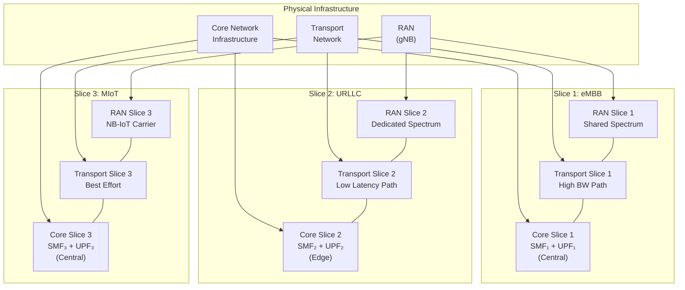
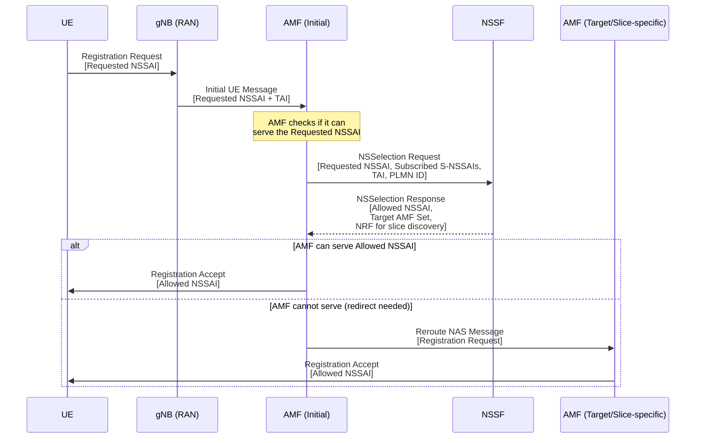
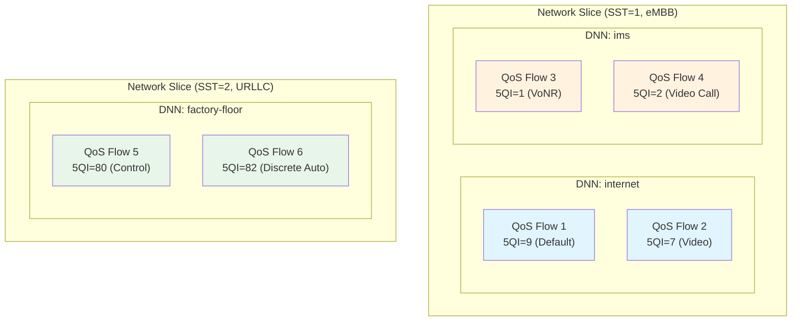

# Module 21: Network Slicing

## 1. Why Network Slicing?

Traditional mobile networks deploy a single, monolithic infrastructure designed for a "one-size-fits-all" service model. However, 5G must simultaneously serve radically different requirements:

| Use Case | Requirement | Challenge |
|----------|-------------|-----------|
| Enhanced Mobile Broadband (eMBB) | High throughput (Gbps), moderate latency | Bandwidth-hungry |
| Ultra-Reliable Low Latency (URLLC) | Sub-1ms latency, 99.999% reliability | Deterministic guarantees |
| Massive IoT (MIoT) | Millions of devices/km², ultra-low power | Scale and efficiency |
| Vehicle-to-Everything (V2X) | Low latency + high reliability + mobility | Safety-critical |

**Network slicing** solves this by allowing **one physical network** to serve all these diverse requirements simultaneously through multiple logical networks, each optimized for its specific purpose.

**Key drivers:**
- **Economic efficiency**: Share expensive infrastructure (spectrum, towers, fiber) across services
- **Service differentiation**: Offer tailored SLAs to different verticals (automotive, healthcare, industry)
- **Operational agility**: Deploy new services without building new physical networks
- **Multi-tenancy**: Enable MVNOs and enterprises to operate isolated virtual networks

---

## 2. Network Slicing Concept

A **network slice** is a complete, logical end-to-end network built on top of shared physical infrastructure.

### 2.1 End-to-End Scope

Each slice spans the entire network:
- **RAN Slice**: Radio resource allocation, scheduling policies, beamforming configuration
- **Transport Slice**: Bandwidth guarantees, routing paths, latency bounds in backhaul/midhaul
- **Core Slice**: Dedicated or shared Network Functions (SMF, UPF, PCF, etc.)

### 2.2 Isolation Between Slices

Three dimensions of isolation:
1. **Resource Isolation**: Dedicated spectrum, compute, storage, and bandwidth per slice
2. **Security Isolation**: Separate security contexts, key hierarchies, access controls
3. **Failure Isolation**: A fault in one slice does not propagate to another

### 2.3 Customization Per Slice

Each slice can be independently customized:
- **Network Functions**: Choose which NFs are deployed (e.g., URLLC may skip certain NFs)
- **Topology**: Define the placement of NFs (e.g., edge UPF for URLLC)
- **QoS Parameters**: Configure slice-specific 5QI values, AMBR, priority levels
- **Policies**: Independent charging, access control, and mobility management rules



---

## 3. Slice Identification

### 3.1 S-NSSAI (Single Network Slice Selection Assistance Information)

The fundamental identifier for a network slice consists of two components:

```
S-NSSAI = SST + SD
```

| Field | Size | Description |
|-------|------|-------------|
| **SST** (Slice/Service Type) | 8 bits | Indicates the expected behavior of the slice (service characteristics) |
| **SD** (Slice Differentiator) | 24 bits (optional) | Differentiates among slices of the same SST (e.g., different tenants) |

### 3.2 Standardized SST Values

| SST Value | Slice Type | Description |
|-----------|-----------|-------------|
| 1 | eMBB | Enhanced Mobile Broadband |
| 2 | URLLC | Ultra-Reliable Low Latency Communications |
| 3 | MIoT | Massive IoT |
| 4 | V2X | Vehicle-to-Everything |
| 5–127 | Reserved | For future standardized use |
| 128–255 | Operator-specific | Custom slice types |

### 3.3 NSSAI (Network Slice Selection Assistance Information)

**NSSAI** = a collection (set) of S-NSSAIs. Multiple NSSAI types exist in the system:

| NSSAI Type | Where Stored | Purpose |
|------------|--------------|---------|
| **Configured NSSAI** | UE (from HPLMN) | All S-NSSAIs the UE is subscribed to |
| **Requested NSSAI** | Sent by UE in Registration | S-NSSAIs the UE wants to use now |
| **Allowed NSSAI** | Returned by network | S-NSSAIs the UE is permitted to use in current PLMN |
| **Rejected NSSAI** | Returned by network | S-NSSAIs denied (with rejection cause) |
| **Pending NSSAI** | AMF internal | S-NSSAIs requiring additional authorization |

### 3.4 Example

```
UE Subscription:
  Configured NSSAI = { S-NSSAI(SST=1), S-NSSAI(SST=1,SD=0x000001),
                       S-NSSAI(SST=2), S-NSSAI(SST=3) }

Registration Request:
  Requested NSSAI = { S-NSSAI(SST=1), S-NSSAI(SST=2) }

Network Response:
  Allowed NSSAI = { S-NSSAI(SST=1), S-NSSAI(SST=2) }
  Rejected NSSAI = {}
```

---

## 4. Slice Selection (NSSF Role)

The **Network Slice Selection Function (NSSF)** is the dedicated NF responsible for determining the appropriate network slice instance(s) for a UE.

### 4.1 Slice Selection Procedure



### 4.2 NSSF Functions

| Function | Description |
|----------|-------------|
| **Slice selection** | Determine Allowed NSSAI based on subscription, PLMN policies, and availability |
| **AMF set determination** | Identify the set of AMFs capable of serving the selected slices |
| **NRF redirection** | Provide NRF endpoint for slice-specific NF discovery |
| **Roaming support** | Map between HPLMN and VPLMN S-NSSAIs |

### 4.3 Slice Selection Inputs

The NSSF considers:
- **Requested NSSAI** from UE
- **Subscribed S-NSSAIs** from UDM (subscription data)
- **PLMN policies** (which slices are available in this area)
- **Tracking Area** (slice availability may vary by location)
- **Roaming agreements** (mapping between home and visited PLMN slices)

---

## 5. Slice Architecture

### 5.1 Dedicated vs. Shared NFs

```
┌─────────────────────────────────────────────────────────┐
│                    SHARED LAYER                          │
│   ┌─────┐  ┌─────┐  ┌──────┐  ┌─────┐  ┌─────┐       │
│   │ AMF │  │ NSSF│  │ NRF  │  │ UDM │  │AUSF │       │
│   └─────┘  └─────┘  └──────┘  └─────┘  └─────┘       │
├─────────────────────────────────────────────────────────┤
│              SLICE-SPECIFIC LAYER                        │
│                                                         │
│  ┌──────────────────┐  ┌──────────────────┐            │
│  │   eMBB Slice     │  │   URLLC Slice    │            │
│  │ ┌─────┐ ┌─────┐ │  │ ┌─────┐ ┌─────┐ │            │
│  │ │SMF-1│ │UPF-1│ │  │ │SMF-2│ │UPF-2│ │            │
│  │ └─────┘ └─────┘ │  │ └─────┘ └─────┘ │            │
│  │ ┌─────┐ ┌─────┐ │  │ ┌─────┐ ┌─────┐ │            │
│  │ │PCF-1│ │CHF-1│ │  │ │PCF-2│ │CHF-2│ │            │
│  │ └─────┘ └─────┘ │  │ └─────┘ └─────┘ │            │
│  └──────────────────┘  └──────────────────┘            │
└─────────────────────────────────────────────────────────┘
```

### 5.2 NF Deployment Model

| NF | Typically Shared/Dedicated | Rationale |
|----|---------------------------|-----------|
| **AMF** | Shared (or per-slice set) | Handles initial access for all UEs; may have slice-specific AMF sets |
| **NSSF** | Shared | Central slice selection logic |
| **NRF** | Shared (with slice-aware discovery) | NF registry, supports slice-based queries |
| **UDM/AUSF** | Shared | Subscription/authentication is per-UE, not per-slice |
| **SMF** | Dedicated per slice | Session management varies significantly between slice types |
| **UPF** | Dedicated per slice | Data plane customization (edge vs. central, throughput vs. latency) |
| **PCF** | Dedicated per slice | Policies differ drastically between eMBB and URLLC |
| **CHF** | Dedicated or shared | Charging models may differ per slice |

### 5.3 Slice-Specific Customization

| Aspect | eMBB Slice | URLLC Slice | MIoT Slice |
|--------|-----------|-------------|------------|
| **UPF Placement** | Central DC | Edge (MEC) | Central DC |
| **QoS Priority** | Medium (5QI=9) | Highest (5QI=80-82) | Low (5QI=79) |
| **Redundancy** | Standard | Dual connectivity, redundant paths | Minimal |
| **Mobility** | Full handover support | Conditional handover, DAPS | Rarely mobile |
| **Charging** | Volume-based | Latency SLA-based | Per-device flat rate |

---

## 6. Slice Isolation

Slice isolation ensures that slices behave as independent networks despite sharing physical infrastructure.

### 6.1 Resource Isolation

| Resource | Isolation Mechanism |
|----------|-------------------|
| **Spectrum** | Dedicated carriers, BWP (Bandwidth Parts), scheduling isolation |
| **Compute** | Dedicated VMs/containers, CPU pinning, NUMA allocation |
| **Storage** | Separate volumes, IOPS guarantees |
| **Transport** | VLAN/VxLAN segmentation, FlexE, dedicated wavelengths |
| **Core NFs** | Separate instances (pods/VMs) per slice |

### 6.2 Security Isolation

- **Separate security domains**: Each slice can have independent security policies
- **Key hierarchy isolation**: Potential for separate key derivation per slice
- **Access control**: Slice-specific authentication/authorization (e.g., enterprise slice with additional EAP)
- **Traffic encryption**: Separate encryption contexts between slices
- **Audit trails**: Independent logging and compliance per slice

### 6.3 Failure Isolation

| Failure Type | Isolation Approach |
|-------------|-------------------|
| NF crash | Slice-dedicated NFs don't affect other slices |
| Overload | Resource quotas prevent one slice from starving others |
| Security breach | Compromised slice cannot access another slice's data/control |
| Configuration error | Slice-scoped config limits blast radius |
| Hardware failure | Slice-aware redundancy and recovery |

### 6.4 Isolation Levels

```
Level 1: Logical Isolation (shared infrastructure, policy-based separation)
         └── Lowest cost, weakest guarantees
         
Level 2: Virtual Isolation (dedicated VMs/containers, virtual networks)
         └── Moderate cost, good separation
         
Level 3: Physical Isolation (dedicated hardware, spectrum, fiber)
         └── Highest cost, strongest guarantees (enterprise/government)
```

---

## 7. Slice Lifecycle Management

### 7.1 Lifecycle Phases

```
┌──────────┐    ┌───────────────┐    ┌───────────┐    ┌─────────────────┐
│  Design/ │───▶│Commissioning  │───▶│ Operation │───▶│Decommissioning  │
│ Planning │    │(Instantiation)│    │(Run-time) │    │  (Termination)  │
└──────────┘    └───────────────┘    └───────────┘    └─────────────────┘
     │                 │                    │                   │
     ▼                 ▼                    ▼                   ▼
 - Requirements    - NF deployment     - Monitoring        - Graceful drain
 - SLA definition  - Configuration     - Scaling           - UE migration
 - Capacity plan   - Testing           - Healing           - Resource release
 - Template design - Activation        - SLA assurance     - Data cleanup
```

### 7.2 Management Functions

| Function | Role |
|----------|------|
| **CSMF** (Communication Service Mgmt Function) | Translates customer requirements into slice requirements |
| **NSMF** (Network Slice Mgmt Function) | Manages the overall slice lifecycle |
| **NSSMF** (Network Slice Subnet Mgmt Function) | Manages individual slice subnets (RAN, Core, Transport) |

**Hierarchy:**
```
Customer Intent → CSMF → NSMF → NSSMF (RAN) + NSSMF (Core) + NSSMF (Transport)
```

### 7.3 Intent-Based Slice Management

Instead of specifying low-level parameters, operators express **intents**:

```yaml
# Example Slice Intent
slice_intent:
  name: "Enterprise-Manufacturing"
  service_type: URLLC
  requirements:
    latency: "< 5ms"
    reliability: "99.999%"
    throughput: "> 100 Mbps"
    isolation: "dedicated"
    coverage: "Factory Floor Building A"
  constraints:
    max_devices: 500
    mobility: "low"
    security: "enhanced"
```

The management system automatically translates this intent into:
- NF deployment configurations
- Resource allocation decisions
- RAN scheduling parameters
- Transport path computation

---

## 8. Slice Use Cases

### 8.1 eMBB Slice

| Attribute | Configuration |
|-----------|--------------|
| **Goal** | Maximum throughput for mobile broadband |
| **SST** | 1 |
| **RAN** | Shared spectrum, wide bandwidth (100 MHz+), MIMO |
| **UPF** | Central data center, high-capacity |
| **Typical Services** | Video streaming, AR/VR, web browsing |
| **SLA** | DL: 100 Mbps guaranteed, latency < 20ms |

### 8.2 URLLC Slice

| Attribute | Configuration |
|-----------|--------------|
| **Goal** | Deterministic ultra-low latency and high reliability |
| **SST** | 2 |
| **RAN** | Dedicated spectrum, mini-slots, configured grant |
| **UPF** | Edge deployment (MEC), co-located with gNB |
| **Typical Services** | Industrial automation, remote surgery, autonomous driving |
| **SLA** | Latency < 1ms, reliability 99.999% |

### 8.3 MIoT Slice

| Attribute | Configuration |
|-----------|--------------|
| **Goal** | Support massive number of low-power devices |
| **SST** | 3 |
| **RAN** | NB-IoT/LTE-M carrier, relaxed scheduling |
| **UPF** | Central, optimized for small packets |
| **Typical Services** | Smart meters, sensors, environmental monitoring |
| **SLA** | Supports 1M+ devices/km², battery life > 10 years |

### 8.4 Enterprise Slice (Private Network)

| Attribute | Configuration |
|-----------|--------------|
| **Goal** | Fully isolated private network for enterprise |
| **SST** | Operator-specific (e.g., 128) |
| **RAN** | Dedicated small cells on enterprise premises |
| **UPF** | On-premises (local breakout) |
| **Typical Services** | Campus connectivity, industrial IoT, private LAN |
| **SLA** | Full SLA customization, dedicated resources |
| **Isolation** | Level 3 (physical isolation where possible) |

---

## 9. Slicing vs. QoS vs. DNN

### 9.1 Conceptual Comparison



### 9.2 Detailed Comparison

| Aspect | Network Slicing | QoS (5QI/QoS Flows) | DNN |
|--------|----------------|---------------------|-----|
| **Scope** | End-to-end logical network | Per-flow packet treatment | Connectivity endpoint (PDU Session) |
| **Granularity** | Entire network (RAN + Core + Transport) | Individual data flows | Per PDU Session |
| **Identifier** | S-NSSAI (SST + SD) | 5QI, QFI, ARP | DNN string (e.g., "internet") |
| **Isolation** | Full (resource, security, failure) | No isolation (shared NFs) | No isolation |
| **Customization** | NF topology, placement, policies | Scheduling priority, rate, latency | Routing to specific data network |
| **Analogy** | Separate highway systems | Lane priorities on a highway | Highway exit (destination) |
| **Who decides** | Network (NSSF) at registration | PCF/SMF per session/flow | UE requests in PDU Session Establishment |
| **Number** | Few per PLMN (max 8 per UE) | Many per slice (up to 64 per session) | Multiple per slice |
| **Relationship** | Contains DNNs and QoS | Exists within a slice | Exists within a slice |

### 9.3 Hierarchical Relationship

```
Network Slice (S-NSSAI)
├── DNN: "internet"
│   ├── PDU Session → QoS Flow (5QI=9, best effort)
│   └── PDU Session → QoS Flow (5QI=7, video streaming)
├── DNN: "enterprise"
│   └── PDU Session → QoS Flow (5QI=6, TCP-optimized)
└── DNN: "ims"
    ├── PDU Session → QoS Flow (5QI=1, voice)
    └── PDU Session → QoS Flow (5QI=2, video call)
```

### 9.4 When to Use What

| Requirement | Solution |
|-------------|----------|
| Different vertical industries on same network | **Network Slicing** |
| Prioritize voice over web traffic | **QoS** (different 5QI values) |
| Connect to different external data networks | **DNN** |
| Isolate enterprise traffic from consumer | **Network Slicing** |
| Differentiate video streaming from file download | **QoS** |
| Route to MEC application vs. central cloud | **DNN** (+ UPF selection) |

---

## 10. RAN Slicing

### 10.1 Radio Resource Partitioning

RAN slicing divides radio resources among slices using different strategies:

| Strategy | Description | Trade-off |
|----------|-------------|-----------|
| **Hard Partitioning** | Dedicated PRBs/carriers per slice | Strong isolation, lower multiplexing gain |
| **Soft Partitioning** | Minimum guaranteed + shared pool | Good isolation + statistical multiplexing |
| **Priority-based** | Shared resources with priority scheduling | Maximum efficiency, weakest isolation |
| **BWP-based** | Assign Bandwidth Parts per slice | Clean separation at physical layer |

### 10.2 Slice-Aware Scheduling

The gNB MAC scheduler must support multi-slice operation:

```
┌──────────────────────────────────────────────────┐
│              gNB MAC Scheduler                    │
├──────────────────────────────────────────────────┤
│                                                  │
│  ┌──────────────┐  Inter-Slice Scheduler         │
│  │ Slice SLA    │  (Allocates resources to slices)│
│  │ Requirements │──────────────────┐             │
│  └──────────────┘                  ▼             │
│                          ┌─────────────────┐     │
│                          │ Resource Pool    │     │
│                          │ PRBs per slot    │     │
│                          └───┬───┬───┬─────┘     │
│                              │   │   │           │
│              ┌───────────────┘   │   └────────┐  │
│              ▼                   ▼             ▼  │
│  ┌──────────────────┐ ┌──────────────┐ ┌──────┐ │
│  │Intra-slice Sched │ │Intra-slice   │ │Intra │ │
│  │(eMBB: Prop Fair) │ │(URLLC: EDF)  │ │(IoT) │ │
│  └──────────────────┘ └──────────────┘ └──────┘ │
└──────────────────────────────────────────────────┘
```

**Two-level scheduling:**
1. **Inter-slice scheduler**: Allocates resources (PRBs, slots) to each slice based on SLA
2. **Intra-slice scheduler**: Schedules individual UEs within a slice using slice-appropriate algorithms

### 10.3 RAN Slice SLA Enforcement

| SLA Parameter | Enforcement Mechanism |
|---------------|----------------------|
| Minimum throughput | Reserved PRBs (guaranteed minimum) |
| Maximum latency | Priority scheduling, configured grants, mini-slots |
| Reliability target | HARQ configuration, repetition, diversity |
| Maximum UE count | Admission control per slice |
| Isolation level | BWP separation or hard partitioning |

### 10.4 RAN Slicing Signaling

- **S-NSSAI in RRC**: UE provides S-NSSAI during RRC setup, gNB maps to appropriate slice
- **Slice-aware DRB mapping**: QoS flows from same slice map to common DRBs
- **RAN slice descriptors**: O-RAN defines slice-level radio resource management policies
- **NSSI (Network Slice Subnet Instance)**: RAN maintains per-slice subnet instances

---

## Summary

| Concept | Key Point |
|---------|-----------|
| **Network Slice** | Logical end-to-end network (RAN + Transport + Core) on shared infrastructure |
| **S-NSSAI** | SST (8-bit type) + SD (24-bit differentiator) identifies a slice |
| **NSSF** | Selects appropriate slice for UE during registration |
| **Isolation** | Resource + Security + Failure isolation between slices |
| **Lifecycle** | Design → Commission → Operate → Decommission (managed by NSMF/NSSMF) |
| **RAN Slicing** | Radio resource partitioning with two-level scheduling |
| **Slice vs QoS vs DNN** | Slice (whole network) ⊃ DNN (connectivity) ⊃ QoS (per-flow treatment) |

---

## Key Takeaways

1. **Network slicing is the defining feature of 5G architecture** — it transforms a single physical network into multiple purpose-built logical networks
2. **S-NSSAI = SST + SD** is the fundamental slice identifier; UE provides Requested NSSAI, network returns Allowed NSSAI
3. **NSSF is the brain of slice selection** — it determines which slices a UE can access and which AMF should serve it
4. **Isolation is multi-dimensional** — resource, security, and failure isolation must all be addressed
5. **RAN slicing requires two-level scheduling** — inter-slice allocation followed by intra-slice per-UE scheduling
6. **Slicing ≠ QoS** — slicing provides end-to-end logical network separation; QoS provides per-flow treatment within a slice
7. **Lifecycle management** automates slice creation through decommissioning, driven by intent-based specifications
