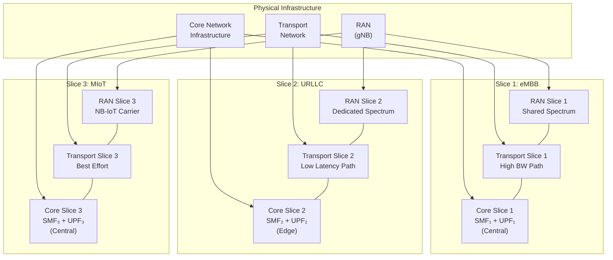
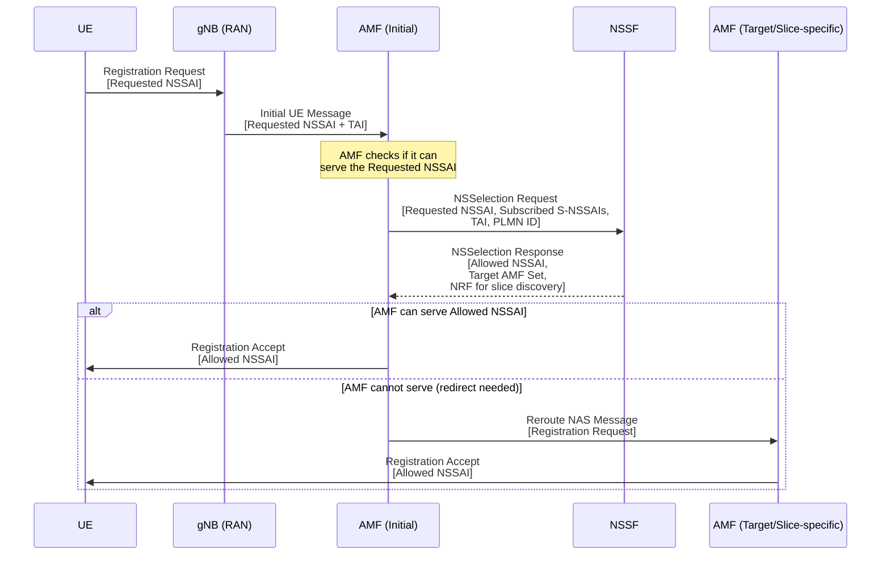
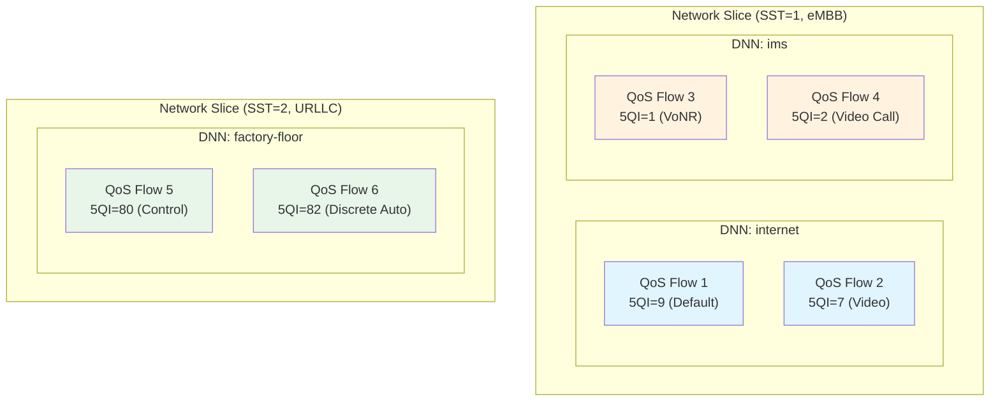

# ماژول 21: شبکه‌بندی

## 1. چرا شبکه‌بندی؟

شبکه‌های موبایل سنتی یک زیرساخت واحد و یکپارچه را مستقر می‌کنند که برای مدل خدمات «یک‌اندازه-برای-همه» طراحی شده است. با این حال، 5G باید به‌طور همزمان نیازمندی‌های کاملاً متفاوتی را برآورده کند:

| مورد استفاده | نیازمندی | چالش |
|----------|-------------|-----------|
| پهن‌باند موبایل بهبودیافته (eMBB) | توان عملیاتی بالا (Gbps)، تأخیر متوسط | پرمصرف پهنای باند |
| فوق‌قابل اعتماد کم-تأخیر (URLLC) | تأخیر زیر 1ms، قابلیت اطمینان 99.999% | تضمین‌های قطعی |
| IoT انبوه (MIoT) | میلیون‌ها دستگاه/km²، توان فوق‌العاده کم | مقیاس و کارایی |
| خودرو-به-همه‌چیز (V2X) | تأخیر کم + قابلیت اطمینان بالا + تحرک | حیاتی برای ایمنی |

**شبکه‌بندی** این را با اجازه دادن به **یک شبکه فیزیکی** برای خدمت‌دهی به تمام این نیازمندی‌های متنوع به‌طور همزمان از طریق چندین شبکه منطقی حل می‌کند، که هر یک برای هدف خاص خود بهینه شده است.

**محرک‌های کلیدی:**
- **کارایی اقتصادی**: اشتراک‌گذاری زیرساخت گران (طیف، برج‌ها، فیبر) در بین خدمات
- **تمایز خدمات**: ارائه SLAهای متناسب به صنایع مختلف (خودروسازی، بهداشت، صنعت)
- **چابکی عملیاتی**: استقرار خدمات جدید بدون ساخت شبکه‌های فیزیکی جدید
- **چند-مستأجری**: امکان فعالیت MVNOها و شرکت‌ها در شبکه‌های مجازی جدا

---

## 2. مفهوم شبکه‌بندی

یک **برش شبکه** یک شبکه منطقی کامل و سرتاسری است که بر پایه زیرساخت فیزیکی مشترک ساخته می‌شود.

### 2.1 دامنه سرتاسری

هر برش کل شبکه را در بر می‌گیرد:
- **برش RAN**: تخصیص منابع رادیویی، سیاست‌های زمان‌بندی، پیکربندی شکل‌دهی پرتو
- **برش انتقال**: تضمین‌های پهنای باند، مسیرهای مسیریابی، کران‌های تأخیر در بک‌هال/مید‌هال
- **برش هسته**: توابع شبکه اختصاصی یا مشترک (SMF، UPF، PCF و غیره)

### 2.2 جداسازی بین برش‌ها

سه بُعد جداسازی:
1. **جداسازی منابع**: طیف، محاسبه، ذخیره‌سازی و پهنای باند اختصاصی در هر برش
2. **جداسازی امنیتی**: زمینه‌های امنیتی جدا، سلسله‌مراتب کلید، کنترل‌های دسترسی
3. **جداسازی شکست**: یک خطا در یک برش به دیگری منتشر نمی‌شود

### 2.3 سفارشی‌سازی در هر برش

هر برش می‌تواند به‌طور مستقل سفارشی شود:
- **توابع شبکه**: انتخاب کنید کدام NFها مستقر شوند (مثلاً URLLC ممکن است از برخی NFها صرف‌نظر کند)
- **توپولوژی**: مکان‌یابی NFها را تعریف کنید (مثلاً UPF لبه برای URLLC)
- **پارامترهای QoS**: مقادیر 5QI، AMBR، سطوح اولویت مختص برش را پیکربندی کنید
- **سیاست‌ها**: صورت‌حساب، کنترل دسترسی و قواعد مدیریت تحرک مستقل



---

## 3. شناسایی برش

### 3.1 S-NSSAI (اطلاعات کمکی انتخاب برش شبکه واحد)

شناسه بنیادی برای یک برش شبکه از دو مؤلفه تشکیل شده است:

```
S-NSSAI = SST + SD
```

| فیلد | اندازه | توضیح |
|-------|------|-------------|
| **SST** (نوع برش/خدمات) | 8 بیت | رفتار مورد انتظار برش را نشان می‌دهد (ویژگی‌های خدمات) |
| **SD** (تفکیک‌کننده برش) | 24 بیت (اختیاری) | بین برش‌های با SST یکسان تمایز می‌گذارد (مثلاً مستأجران مختلف) |

### 3.2 مقادیر استاندارد SST

| مقدار SST | نوع برش | توضیح |
|-----------|-----------|-------------|
| 1 | eMBB | پهن‌باند موبایل بهبودیافته |
| 2 | URLLC | ارتباطات فوق‌قابل اعتماد کم-تأخیر |
| 3 | MIoT | IoT انبوه |
| 4 | V2X | خودرو-به-همه‌چیز |
| 5–127 | رزروشده | برای استفاده استاندارد شده آینده |
| 128–255 | مختص اپراتور | انواع برش سفارشی |

### 3.3 NSSAI (اطلاعات کمکی انتخاب برش شبکه)

**NSSAI** = مجموعه‌ای از S-NSSAIها. چندین نوع NSSAI در سیستم وجود دارد:

| نوع NSSAI | محل ذخیره | هدف |
|------------|--------------|---------|
| **NSSAI پیکربندی‌شده** | UE (از HPLMN) | تمام S-NSSAIهایی که UE به آن‌ها اشتراک دارد |
| **NSSAI درخواستی** | فرستاده‌شده توسط UE در ثبت‌نام | S-NSSAIهایی که UE اکنون می‌خواهد استفاده کند |
| **NSSAI مجاز** | بازگردانده‌شده توسط شبکه | S-NSSAIهایی که UE مجاز به استفاده در PLMN فعلی است |
| **NSSAI ردشده** | بازگردانده‌شده توسط شبکه | S-NSSAIهای ردشده (با علت رد) |
| **NSSAI در انتظار** | داخلی AMF | S-NSSAIهایی که نیازمند مجوزدهی اضافی هستند |

### 3.4 مثال

```
UE Subscription:
  Configured NSSAI = { S-NSSAI(SST=1), S-NSSAI(SST=1,SD=0x000001),
                       S-NSSAI(SST=2), S-NSSAI(SST=3) }

Registration Request:
  Requested NSSAI = { S-NSSAI(SST=1), S-NSSAI(SST=2) }

Network Response:
  Allowed NSSAI = { S-NSSAI(SST=1), S-NSSAI(SST=2) }
  Rejected NSSAI = {}
```

---

## 4. انتخاب برش (نقش NSSF)

**تابع انتخاب برش شبکه (NSSF)** همان NF اختصاصی مسئول تعیین نمونه(های) برش شبکه مناسب برای یک UE است.

### 4.1 رویه انتخاب برش



### 4.2 توابع NSSF

| عملکرد | توضیح |
|----------|-------------|
| **انتخاب برش** | تعیین NSSAI مجاز بر اساس اشتراک، سیاست‌های PLMN و دسترسی‌پذیری |
| **تعیین مجموعه AMF** | شناسایی مجموعه AMFهای قادر به خدمات‌دهی به برش‌های انتخاب‌شده |
| **تغییر مسیر NRF** | فراهم کردن نقطه انتهایی NRF برای کشف NF مختص برش |
| **پشتیبانی رومینگ** | نگاشت بین S-NSSAIهای HPLMN و VPLMN |

### 4.3 ورودی‌های انتخاب برش

NSSF موارد زیر را در نظر می‌گیرد:
- **NSSAI درخواستی** از UE
- **S-NSSAIهای اشتراک‌شده** از UDM (داده اشتراک)
- **سیاست‌های PLMN** (کدام برش‌ها در این ناحیه در دسترس هستند)
- **ناحیه ردیابی** (دسترسی‌پذیری برش ممکن است بر اساس مکان متفاوت باشد)
- **توافق‌نامه‌های رومینگ** (نگاشت بین برش‌های PLMN خانگی و بازدیدشده)

---

## 5. معماری برش

### 5.1 NFهای اختصاصی در برابر مشترک

```
┌─────────────────────────────────────────────────────────┐
│                    SHARED LAYER                          │
│   ┌─────┐  ┌─────┐  ┌──────┐  ┌─────┐  ┌─────┐       │
│   │ AMF │  │ NSSF│  │ NRF  │  │ UDM │  │AUSF │       │
│   └─────┘  └─────┘  └──────┘  └─────┘  └─────┘       │
├─────────────────────────────────────────────────────────┤
│              SLICE-SPECIFIC LAYER                        │
│                                                         │
│  ┌──────────────────┐  ┌──────────────────┐            │
│  │   eMBB Slice     │  │   URLLC Slice    │            │
│  │ ┌─────┐ ┌─────┐ │  │ ┌─────┐ ┌─────┐ │            │
│  │ │SMF-1│ │UPF-1│ │  │ │SMF-2│ │UPF-2│ │            │
│  │ └─────┘ └─────┘ │  │ └─────┘ └─────┘ │            │
│  │ ┌─────┐ ┌─────┐ │  │ ┌─────┐ ┌─────┐ │            │
│  │ │PCF-1│ │CHF-1│ │  │ │PCF-2│ │CHF-2│ │            │
│  │ └─────┘ └─────┘ │  │ └─────┘ └─────┘ │            │
│  └──────────────────┘  └──────────────────┘            │
└─────────────────────────────────────────────────────────┘
```

### 5.2 مدل استقرار NF

| NF | معمولاً مشترک/اختصاصی | منطق |
|----|---------------------------|-----------|
| **AMF** | مشترک (یا مجموعه در هر برش) | دسترسی اولیه برای همه UEها را مدیریت می‌کند؛ ممکن است مجموعه‌های AMF مختص برش داشته باشد |
| **NSSF** | مشترک | منطق انتخاب برش مرکزی |
| **NRF** | مشترک (با کشف آگاه به برش) | ثبت NF، از پرس‌وجوهای مبتنی بر برش پشتیبانی می‌کند |
| **UDM/AUSF** | مشترک | اشتراک/احراز هویت در هر UE است، نه در هر برش |
| **SMF** | اختصاصی در هر برش | مدیریت نشست بین انواع برش به‌طور قابل توجهی متفاوت است |
| **UPF** | اختصاصی در هر برش | سفارشی‌سازی صفحه داده (لبه در برابر مرکزی، توان عملیاتی در برابر تأخیر) |
| **PCF** | اختصاصی در هر برش | سیاست‌ها بین eMBB و URLLC به‌شدت متفاوت است |
| **CHF** | اختصاصی یا مشترک | مدل‌های صورت‌حساب ممکن است در هر برش متفاوت باشد |

### 5.3 سفارشی‌سازی مختص برش

| جنبه | برش eMBB | برش URLLC | برش MIoT |
|--------|-----------|-------------|------------|
| **مکان UPF** | DC مرکزی | لبه (MEC) | DC مرکزی |
| **اولویت QoS** | متوسط (5QI=9) | بالاترین (5QI=80-82) | پایین (5QI=79) |
| **افزونگی** | استاندارد | اتصال دوگانه، مسیرهای افزونه | حداقلی |
| **تحرک** | پشتیبانی کامل تحویل | تحویل شرطی، DAPS | به‌ندرت متحرک |
| **صورت‌حساب** | مبتنی بر حجم | مبتنی بر SLA تأخیر | نرخ ثابت در هر دستگاه |

---

## 6. جداسازی برش

جداسازی برش تضمین می‌کند برش‌ها با وجود اشتراک زیرساخت فیزیکی، به‌عنوان شبکه‌های مستقل رفتار کنند.

### 6.1 جداسازی منابع

| منبع | سازوکار جداسازی |
|----------|-------------------|
| **طیف** | حامل‌های اختصاصی، BWP (بخش‌های پهنای باند)، جداسازی زمان‌بندی |
| **محاسبه** | VM/کانتینر اختصاصی، پین‌کردن CPU، تخصیص NUMA |
| **ذخیره‌سازی** | حجم‌های جدا، تضمین‌های IOPS |
| **انتقال** | قطعه‌بندی VLAN/VxLAN، FlexE، طول‌موج‌های اختصاصی |
| **NFهای هسته** | نمونه‌های جدا (pod/VM) در هر برش |

### 6.2 جداسازی امنیتی

- **دامنه‌های امنیتی جدا**: هر برش می‌تواند سیاست‌های امنیتی مستقل داشته باشد
- **جداسازی سلسله‌مراتب کلید**: امکان مشتق‌سازی کلید جدا در هر برش
- **کنترل دسترسی**: احراز هویت/مجوزدهی مختص برش (مثلاً برش سازمانی با EAP اضافی)
- **رمزنگاری ترافیک**: زمینه‌های رمزنگاری جدا بین برش‌ها
- **مسیرهای حسابرسی**: ثبت گزارش و انطباق مستقل در هر برش

### 6.3 جداسازی شکست

| نوع شکست | رویکرد جداسازی |
|-------------|-------------------|
| سقوط NF | NFهای اختصاصی برش بر سایر برش‌ها تأثیر نمی‌گذارند |
| اضافه‌بار | سهمیه‌های منابع از گرسنگی یک برش توسط دیگری جلوگیری می‌کنند |
| نقض امنیتی | برش نفوذشده نمی‌تواند به داده/کنترل برش دیگر دسترسی یابد |
| خطای پیکربندی | پیکربندی محدود به برش شعاع اثر را محدود می‌کند |
| شکست سخت‌افزاری | افزونگی و بازیابی آگاه به برش |

### 6.4 سطوح جداسازی

```
Level 1: Logical Isolation (shared infrastructure, policy-based separation)
         └── Lowest cost, weakest guarantees
         
Level 2: Virtual Isolation (dedicated VMs/containers, virtual networks)
         └── Moderate cost, good separation
         
Level 3: Physical Isolation (dedicated hardware, spectrum, fiber)
         └── Highest cost, strongest guarantees (enterprise/government)
```

---

## 7. مدیریت چرخه عمر برش

### 7.1 مراحل چرخه عمر

```
┌──────────┐    ┌───────────────┐    ┌───────────┐    ┌─────────────────┐
│  Design/ │───▶│Commissioning  │───▶│ Operation │───▶│Decommissioning  │
│ Planning │    │(Instantiation)│    │(Run-time) │    │  (Termination)  │
└──────────┘    └───────────────┘    └───────────┘    └─────────────────┘
     │                 │                    │                   │
     ▼                 ▼                    ▼                   ▼
 - Requirements    - NF deployment     - Monitoring        - Graceful drain
 - SLA definition  - Configuration     - Scaling           - UE migration
 - Capacity plan   - Testing           - Healing           - Resource release
 - Template design - Activation        - SLA assurance     - Data cleanup
```

### 7.2 توابع مدیریت

| عملکرد | نقش |
|----------|------|
| **CSMF** (تابع مدیریت خدمات ارتباطی) | نیازمندی‌های مشتری را به نیازمندی‌های برش ترجمه می‌کند |
| **NSMF** (تابع مدیریت برش شبکه) | چرخه عمر کلی برش را مدیریت می‌کند |
| **NSSMF** (تابع مدیریت زیرشبکه برش شبکه) | زیرشبکه‌های برش منفرد (RAN، هسته، انتقال) را مدیریت می‌کند |

**سلسله‌مراتب:**
```
Customer Intent → CSMF → NSMF → NSSMF (RAN) + NSSMF (Core) + NSSMF (Transport)
```

### 7.3 مدیریت برش مبتنی بر قصد

به‌جای تعیین پارامترهای سطح پایین، اپراتورها **قصدها** را بیان می‌کنند:

```yaml
# Example Slice Intent
slice_intent:
  name: "Enterprise-Manufacturing"
  service_type: URLLC
  requirements:
    latency: "< 5ms"
    reliability: "99.999%"
    throughput: "> 100 Mbps"
    isolation: "dedicated"
    coverage: "Factory Floor Building A"
  constraints:
    max_devices: 500
    mobility: "low"
    security: "enhanced"
```

سیستم مدیریت به‌طور خودکار این قصد را به موارد زیر ترجمه می‌کند:
- پیکربندی‌های استقرار NF
- تصمیمات تخصیص منابع
- پارامترهای زمان‌بندی RAN
- محاسبه مسیر انتقال

---

## 8. موارد استفاده برش

### 8.1 برش eMBB

| ویژگی | پیکربندی |
|-----------|--------------|
| **هدف** | حداکثر توان عملیاتی برای پهن‌باند موبایل |
| **SST** | 1 |
| **RAN** | طیف مشترک، پهنای باند گسترده (بیش از 100 MHz)، MIMO |
| **UPF** | مرکز داده مرکزی، ظرفیت بالا |
| **خدمات معمول** | پخش جریانی ویدیو، AR/VR، مرور وب |
| **SLA** | DL: تضمین 100 Mbps، تأخیر کمتر از 20ms |

### 8.2 برش URLLC

| ویژگی | پیکربندی |
|-----------|--------------|
| **هدف** | تأخیر فوق‌العاده کم قطعی و قابلیت اطمینان بالا |
| **SST** | 2 |
| **RAN** | طیف اختصاصی، مینی-اسلات‌ها، اعطای پیکربندی‌شده |
| **UPF** | استقرار در لبه (MEC)، هم‌مکان با gNB |
| **خدمات معمول** | خودکارسازی صنعتی، جراحی از راه دور، رانندگی خودران |
| **SLA** | تأخیر کمتر از 1ms، قابلیت اطمینان 99.999% |

### 8.3 برش MIoT

| ویژگی | پیکربندی |
|-----------|--------------|
| **هدف** | پشتیبانی از تعداد انبوه دستگاه‌های کم‌توان |
| **SST** | 3 |
| **RAN** | حامل NB-IoT/LTE-M، زمان‌بندی آسان‌گیر |
| **UPF** | مرکزی، بهینه‌شده برای بسته‌های کوچک |
| **خدمات معمول** | کنتورهای هوشمند، حسگرها، پایش محیطی |
| **SLA** | پشتیبانی از بیش از 1M دستگاه/km²، عمر باتری بیش از 10 سال |

### 8.4 برش سازمانی (شبکه خصوصی)

| ویژگی | پیکربندی |
|-----------|--------------|
| **هدف** | شبکه خصوصی کاملاً جدا برای شرکت |
| **SST** | مختص اپراتور (مثلاً 128) |
| **RAN** | سلول‌های کوچک اختصاصی در محل شرکت |
| **UPF** | درون-محل (شکست محلی) |
| **خدمات معمول** | اتصال پردیس، IoT صنعتی، LAN خصوصی |
| **SLA** | سفارشی‌سازی کامل SLA، منابع اختصاصی |
| **جداسازی** | سطح 3 (جداسازی فیزیکی در صورت امکان) |

---

## 9. شبکه‌بندی در برابر QoS در برابر DNN

### 9.1 مقایسه مفهومی



### 9.2 مقایسه تفصیلی

| جنبه | شبکه‌بندی | QoS (5QI/جریان‌های QoS) | DNN |
|--------|----------------|---------------------|-----|
| **دامنه** | شبکه منطقی سرتاسری | رفتار بسته در هر جریان | نقطه انتهایی اتصال (نشست PDU) |
| **دانه‌بندی** | کل شبکه (RAN + هسته + انتقال) | جریان‌های داده منفرد | در هر نشست PDU |
| **شناسه** | S-NSSAI (SST + SD) | 5QI، QFI، ARP | رشته DNN (مثلاً "internet") |
| **جداسازی** | کامل (منبع، امنیت، شکست) | بدون جداسازی (NFهای مشترک) | بدون جداسازی |
| **سفارشی‌سازی** | توپولوژی NF، مکان‌یابی، سیاست‌ها | اولویت زمان‌بندی، نرخ، تأخیر | مسیریابی به شبکه داده مشخص |
| **قیاس** | سیستم‌های بزرگراه جدا | اولویت‌های خط در یک بزرگراه | خروجی بزرگراه (مقصد) |
| **چه کسی تصمیم می‌گیرد** | شبکه (NSSF) در ثبت‌نام | PCF/SMF در هر نشست/جریان | UE درخواست می‌کند در برقراری نشست PDU |
| **تعداد** | کم در هر PLMN (حداکثر 8 در هر UE) | زیاد در هر برش (تا 64 در هر نشست) | چندین در هر برش |
| **رابطه** | شامل DNNها و QoS | درون یک برش وجود دارد | درون یک برش وجود دارد |

### 9.3 رابطه سلسله‌مراتبی

```
Network Slice (S-NSSAI)
├── DNN: "internet"
│   ├── PDU Session → QoS Flow (5QI=9, best effort)
│   └── PDU Session → QoS Flow (5QI=7, video streaming)
├── DNN: "enterprise"
│   └── PDU Session → QoS Flow (5QI=6, TCP-optimized)
└── DNN: "ims"
    ├── PDU Session → QoS Flow (5QI=1, voice)
    └── PDU Session → QoS Flow (5QI=2, video call)
```

### 9.4 چه زمانی از چه چیزی استفاده کنیم

| نیازمندی | راه‌حل |
|-------------|----------|
| صنایع عمودی مختلف روی همان شبکه | **شبکه‌بندی** |
| اولویت صدا بر ترافیک وب | **QoS** (مقادیر 5QI مختلف) |
| اتصال به شبکه‌های داده خارجی مختلف | **DNN** |
| جداسازی ترافیک سازمانی از مصرف‌کننده | **شبکه‌بندی** |
| تمایز پخش جریانی ویدیو از دانلود فایل | **QoS** |
| مسیریابی به کاربرد MEC در برابر ابر مرکزی | **DNN** (+ انتخاب UPF) |

---

## 10. شبکه‌بندی RAN

### 10.1 قطعه‌بندی منابع رادیویی

شبکه‌بندی RAN منابع رادیویی را با استفاده از راهبردهای مختلف در بین برش‌ها تقسیم می‌کند:

| راهبرد | توضیح | مبادله |
|----------|-------------|-----------|
| **قطعه‌بندی سخت** | PRB/حامل اختصاصی در هر برش | جداسازی قوی، بهره چندگانه‌سازی کمتر |
| **قطعه‌بندی نرم** | حداقل تضمین‌شده + استخر مشترک | جداسازی خوب + چندگانه‌سازی آماری |
| **مبتنی بر اولویت** | منابع مشترک با زمان‌بندی اولویت‌دار | حداکثر کارایی، ضعیف‌ترین جداسازی |
| **مبتنی بر BWP** | تخصیص بخش‌های پهنای باند در هر برش | جداسازی تمیز در لایه فیزیکی |

### 10.2 زمان‌بندی آگاه به برش

زمان‌بند MAC در gNB باید از عملیات چند-برشی پشتیبانی کند:

```
┌──────────────────────────────────────────────────┐
│              gNB MAC Scheduler                    │
├──────────────────────────────────────────────────┤
│                                                  │
│  ┌──────────────┐  Inter-Slice Scheduler         │
│  │ Slice SLA    │  (Allocates resources to slices)│
│  │ Requirements │──────────────────┐             │
│  └──────────────┘                  ▼             │
│                          ┌─────────────────┐     │
│                          │ Resource Pool    │     │
│                          │ PRBs per slot    │     │
│                          └───┬───┬───┬─────┘     │
│                              │   │   │           │
│              ┌───────────────┘   │   └────────┐  │
│              ▼                   ▼             ▼  │
│  ┌──────────────────┐ ┌──────────────┐ ┌──────┐ │
│  │Intra-slice Sched │ │Intra-slice   │ │Intra │ │
│  │(eMBB: Prop Fair) │ │(URLLC: EDF)  │ │(IoT) │ │
│  └──────────────────┘ └──────────────┘ └──────┘ │
└──────────────────────────────────────────────────┘
```

**زمان‌بندی دو-سطحی:**
1. **زمان‌بند بین-برشی**: منابع (PRB، شکاف‌ها) را بر اساس SLA به هر برش تخصیص می‌دهد
2. **زمان‌بند درون-برشی**: UEهای منفرد درون یک برش را با الگوریتم‌های متناسب با برش زمان‌بندی می‌کند

### 10.3 اجرای SLA برش RAN

| پارامتر SLA | سازوکار اجرا |
|---------------|----------------------|
| حداقل توان عملیاتی | PRBهای رزروشده (حداقل تضمین‌شده) |
| حداکثر تأخیر | زمان‌بندی اولویت‌دار، اعطاهای پیکربندی‌شده، مینی-اسلات‌ها |
| هدف قابلیت اطمینان | پیکربندی HARQ، تکرار، تنوع |
| حداکثر تعداد UE | کنترل پذیرش در هر برش |
| سطح جداسازی | جداسازی BWP یا قطعه‌بندی سخت |

### 10.4 سیگنالینگ شبکه‌بندی RAN

- **S-NSSAI در RRC**: UE مقدار S-NSSAI را در حین راه‌اندازی RRC ارائه می‌دهد، gNB به برش مناسب نگاشت می‌کند
- **نگاشت DRB آگاه به برش**: جریان‌های QoS از همان برش به DRBهای مشترک نگاشت می‌شوند
- **توصیف‌گرهای برش RAN**: O-RAN سیاست‌های مدیریت منابع رادیویی سطح برش را تعریف می‌کند
- **NSSI (نمونه زیرشبکه برش شبکه)**: RAN نمونه‌های زیرشبکه مختص برش را نگه می‌دارد

---

## خلاصه

| مفهوم | نکته کلیدی |
|---------|-----------|
| **برش شبکه** | شبکه منطقی سرتاسری (RAN + انتقال + هسته) روی زیرساخت مشترک |
| **S-NSSAI** | SST (نوع 8 بیتی) + SD (تفکیک‌کننده 24 بیتی) یک برش را شناسایی می‌کند |
| **NSSF** | برش مناسب را برای UE در حین ثبت‌نام انتخاب می‌کند |
| **جداسازی** | جداسازی منابع + امنیت + شکست بین برش‌ها |
| **چرخه عمر** | طراحی ← راه‌اندازی ← بهره‌برداری ← ازکاراندازی (مدیریت‌شده توسط NSMF/NSSMF) |
| **شبکه‌بندی RAN** | قطعه‌بندی منابع رادیویی با زمان‌بندی دو-سطحی |
| **برش در برابر QoS در برابر DNN** | برش (کل شبکه) ⊃ DNN (اتصال) ⊃ QoS (رفتار در هر جریان) |

---

## نکات کلیدی

1. **شبکه‌بندی ویژگی تعریف‌کننده معماری 5G است** — یک شبکه فیزیکی واحد را به چندین شبکه منطقی هدف‌ساخته تبدیل می‌کند
2. **S-NSSAI = SST + SD** شناسه بنیادی برش است؛ UE مقدار NSSAI درخواستی را ارائه می‌دهد، شبکه NSSAI مجاز را بازمی‌گرداند
3. **NSSF مغز انتخاب برش است** — تعیین می‌کند UE به کدام برش‌ها دسترسی دارد و کدام AMF باید به آن خدمات دهد
4. **جداسازی چند-بُعدی است** — جداسازی منبع، امنیت و شکست همه باید مورد توجه قرار گیرند
5. **شبکه‌بندی RAN نیازمند زمان‌بندی دو-سطحی است** — تخصیص بین-برشی و سپس زمان‌بندی درون-برشی در هر UE
6. **شبکه‌بندی ≠ QoS** — شبکه‌بندی جداسازی شبکه منطقی سرتاسری فراهم می‌کند؛ QoS رفتار در هر جریان را درون یک برش فراهم می‌کند
7. **مدیریت چرخه عمر** ایجاد تا ازکاراندازی برش را خودکار می‌کند، با محرک مشخصات مبتنی بر قصد
