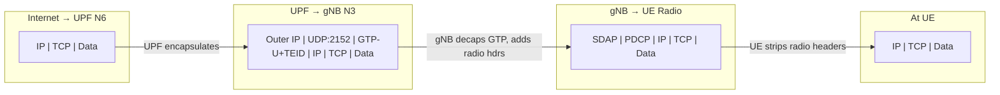
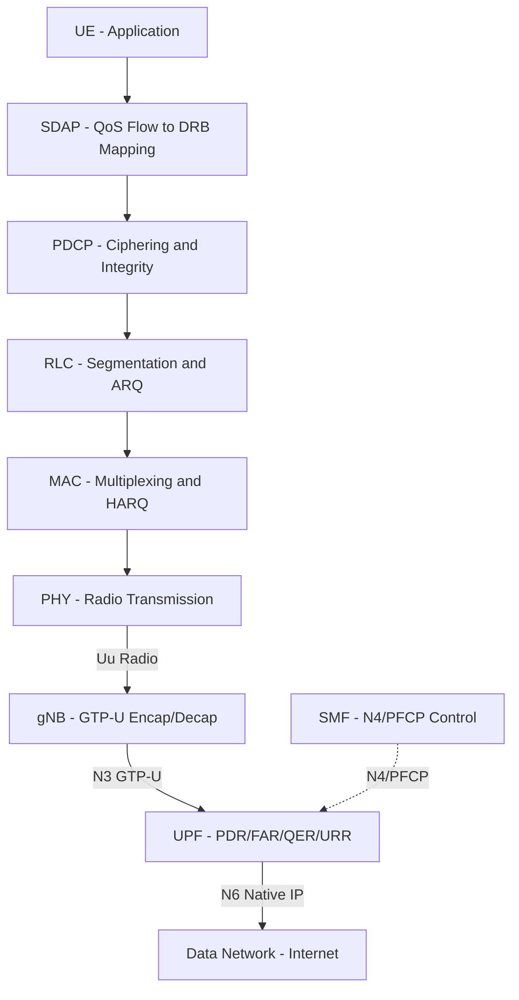

# Module 23: User Plane

## 1. User Plane Concept

The **User Plane** (also called the **Data Plane** or **U-Plane**) is responsible for carrying actual user data through the mobile network. This includes:

- **IP packets** (web browsing, app data, file transfers)
- **Voice data** (VoLTE/VoNR encoded speech frames)
- **Video streams** (real-time video, streaming content)
- **Any application-layer payload**

The user plane is distinct from the control plane — while the control plane sets up, manages, and tears down connections, the user plane is the "pipe" through which data actually flows once those connections are established.

**Key characteristics:**
- High throughput requirement
- Low latency sensitivity
- Stateless forwarding (once tunnels are established)
- QoS-aware packet handling
- Transparent to signaling — carries data without interpreting it

---

## 2. GTP-U Protocol (GPRS Tunneling Protocol — User Plane)

GTP-U (3GPP TS 29.281) is the core tunneling protocol used to transport user data between network nodes across all generations (3G, 4G, 5G).

### 2.1 Header Structure

The GTP-U header has an **8-byte mandatory portion** plus optional extension headers:

```
 0                   1                   2                   3
 0 1 2 3 4 5 6 7 8 9 0 1 2 3 4 5 6 7 8 9 0 1 2 3 4 5 6 7 8 9 0 1
+-+-+-+-+-+-+-+-+-+-+-+-+-+-+-+-+-+-+-+-+-+-+-+-+-+-+-+-+-+-+-+-+
|Ver|PT|(*)|E|S|PN|  Msg Type   |         Length                |
+-+-+-+-+-+-+-+-+-+-+-+-+-+-+-+-+-+-+-+-+-+-+-+-+-+-+-+-+-+-+-+-+
|                  TEID (Tunnel Endpoint Identifier)             |
+-+-+-+-+-+-+-+-+-+-+-+-+-+-+-+-+-+-+-+-+-+-+-+-+-+-+-+-+-+-+-+-+
|      Sequence Number (opt)    |  N-PDU Number |Next Ext Hdr   |
+-+-+-+-+-+-+-+-+-+-+-+-+-+-+-+-+-+-+-+-+-+-+-+-+-+-+-+-+-+-+-+-+
```

| Field | Bits | Description |
|-------|------|-------------|
| Version | 3 | Always `001` (GTPv1) |
| PT (Protocol Type) | 1 | `1` = GTP, `0` = GTP' (charging) |
| Reserved (*) | 1 | Must be 0 |
| E (Extension Header) | 1 | Extension header follows |
| S (Sequence Number) | 1 | Sequence number field present |
| PN (N-PDU Number) | 1 | N-PDU number field present |
| Message Type | 8 | `0xFF` = T-PDU (user data), others = signaling |
| Length | 16 | Payload length (excludes mandatory 8 bytes) |
| TEID | 32 | Tunnel Endpoint Identifier |

### 2.2 TEID (Tunnel Endpoint Identifier)

The **TEID** is a 32-bit value that uniquely identifies a GTP tunnel endpoint at a receiving node:

- Each direction of a tunnel has its own TEID
- The **receiving node** assigns the TEID (tells the sender "use this TEID when sending to me")
- TEID = 0 is reserved for control plane initial messages
- A node may have thousands of TEIDs active simultaneously (one per bearer/session per direction)

**Example:**
```
gNB tells UPF: "For downlink data to UE-X, use TEID = 0x00A1B2C3 on N3"
UPF tells gNB: "For uplink data from UE-X, use TEID = 0x00D4E5F6 on N3"
```

### 2.3 Encapsulation / Decapsulation

At each GTP-U hop, the user's IP packet is **encapsulated** inside:

```
[Outer IP Header][UDP (port 2152)][GTP-U Header][Inner IP Packet (user data)]
```

- **Encapsulation** (sending node): Prepends GTP-U header + UDP + outer IP
- **Decapsulation** (receiving node): Strips outer IP + UDP + GTP-U header, forwards inner IP
- At intermediate nodes: may decapsulate and re-encapsulate with new TEID

### 2.4 Sequence Numbers and Extension Headers

**Sequence Numbers (16-bit):**
- Optional but used for reordering at tunnel endpoints
- Critical during handover (ensures no packet loss/reorder)
- Incremented per PDU per tunnel

**Extension Headers:**
- Chained via "Next Extension Header Type" field
- Each extension: `[Length (1 byte)][Content (variable)][Next Ext Hdr Type (1 byte)]`

Common extension headers:

| Type | Name | Purpose |
|------|------|---------|
| 0x85 | PDU Session Container | 5G QoS Flow Identifier (QFI), reflective QoS |
| 0xC0 | PDCP PDU Number | For lossless handover |
| 0x40 | UDP Port | Additional multiplexing |

---

## 3. User Plane in LTE (4G)

### 3.1 End-to-End Path

```
UE ←──Radio/PDCP──→ eNB ←──GTP-U/S1-U──→ S-GW ←──GTP-U/S5──→ P-GW ←──IP──→ Internet
```

### 3.2 Packet Headers at Each Segment

**Segment 1: UE → eNB (Radio Interface / Uu)**
```
[PDCP Header][IP Packet (user data)]
  └─ Over radio: RLC → MAC → PHY
```

**Segment 2: eNB → S-GW (S1-U Interface)**
```
[Outer IP (eNB→SGW)][UDP:2152][GTP-U (TEID-S1)][IP Packet (user data)]
```

**Segment 3: S-GW → P-GW (S5/S8 Interface)**
```
[Outer IP (SGW→PGW)][UDP:2152][GTP-U (TEID-S5)][IP Packet (user data)]
```

**Segment 4: P-GW → Internet**
```
[IP Packet (user data)]  ← Native IP, no tunneling
```

### 3.3 LTE Bearer Model

- **Default Bearer**: Always-on, established at attach (one per PDN connection)
- **Dedicated Bearer**: Additional QoS, established on demand (e.g., VoLTE)
- Each bearer = unique set of TEIDs on S1-U and S5


---

## 4. User Plane in 5G

### 4.1 End-to-End Path

```
UE ←──Radio/SDAP/PDCP──→ gNB ←──GTP-U/N3──→ UPF ←──N6 (native IP)──→ DN
```

### 4.2 5G Reference Points for User Plane

| Interface | Between | Transport | Purpose |
|-----------|---------|-----------|---------|
| **N3** | gNB ↔ UPF | GTP-U over UDP/IP | RAN to Core user data |
| **N9** | UPF ↔ UPF | GTP-U over UDP/IP | Inter-UPF forwarding |
| **N6** | UPF ↔ DN | Native IP | Exit to data network |

### 4.3 SDAP Layer (Service Data Adaptation Protocol)

The **SDAP** layer is new in 5G NR (not present in LTE) and sits above PDCP:

```
┌──────────────┐
│   QoS Flows  │  (identified by QFI: QoS Flow Identifier)
├──────────────┤
│     SDAP     │  ← Maps QoS Flows to DRBs
├──────────────┤
│     PDCP     │
├──────────────┤
│     RLC      │
├──────────────┤
│     MAC      │
├──────────────┤
│     PHY      │
└──────────────┘
```

**SDAP Functions:**
- **Downlink:** QoS Flow → DRB mapping (based on QFI in GTP-U extension header)
- **Uplink:** DRB → QoS Flow marking (stamps QFI on uplink packets)
- **Reflective QoS:** UE mirrors the DL mapping for UL without explicit signaling

### 4.4 Multiple UPFs Architecture

5G supports **UPF chaining** for flexible traffic routing:

| UPF Type | Role | Use Case |
|----------|------|----------|
| **I-UPF** (Intermediate) | Transit/branching point | Handover anchor, traffic steering |
| **PSA-UPF** (PDU Session Anchor) | Session anchor, IP allocation | Stable IP address point |

```
gNB ──N3──→ I-UPF ──N9──→ PSA-UPF ──N6──→ DN
                 │
                 └──N9──→ Local UPF ──N6──→ Edge DN (MEC)
```

---

## 5. UPF Functions (3GPP TS 23.501)

The UPF is controlled by the SMF via the **N4 interface** using the **PFCP protocol** (Packet Forwarding Control Protocol, TS 29.244).

### 5.1 PFCP Rules

| Rule | Acronym | Function |
|------|---------|----------|
| **Packet Detection Rule** | PDR | Match incoming packets (by TEID, IP, port, QFI, etc.) |
| **Forwarding Action Rule** | FAR | What to do (forward, drop, buffer, duplicate) |
| **QoS Enforcement Rule** | QER | Rate limiting (MBR/GBR), gating, marking |
| **Usage Reporting Rule** | URR | Volume/time measurement, triggers for reporting |
| **Buffering Action Rule** | BAR | Buffer DL packets when UE is idle, notify SMF |

### 5.2 How Rules Work Together

```
Incoming Packet
      │
      ▼
┌─────────────┐
│     PDR     │  ← Match: outer header (TEID, IP), inner header, QFI
│  (Detect)   │
└──────┬──────┘
       │ matched → associated rules:
       ▼
┌─────────────┐  ┌─────────────┐  ┌─────────────┐  ┌─────────────┐
│     FAR     │  │     QER     │  │     URR     │  │     BAR     │
│ (Forward)   │  │ (QoS Enforce)│  │  (Report)   │  │  (Buffer)   │
└─────────────┘  └─────────────┘  └─────────────┘  └─────────────┘
```

### 5.3 N4/PFCP Interface

- **SMF → UPF:** Session Establishment/Modification/Deletion Request
- **UPF → SMF:** Session Report (usage reports, DL data notification)
- PFCP uses **SEID** (Session Endpoint Identifier) — analogous to TEID but for control
- Runs over UDP port 8805

### 5.4 Complete UPF Function List

1. Packet routing & forwarding
2. Packet inspection (DPI for application detection)
3. UL/DL rate enforcement (per QoS flow)
4. Traffic usage reporting (for charging)
5. DL packet buffering & notification
6. QoS handling (DSCP marking, policing)
7. Lawful intercept (UP collection)
8. Transport level packet marking (outer header DSCP)


---

## 6. Packet Trace Example: Downlink Data

**Scenario:** Server on Internet sends data to UE

### 6.1 Step-by-Step

**Step 1: Internet → UPF (N6 interface)**
```
┌─────────────────────────────────────┐
│ IP Header                           │
│  Src: 93.184.216.34 (server)        │
│  Dst: 10.0.0.1 (UE IP)             │
├─────────────────────────────────────┤
│ TCP/UDP Header                      │
├─────────────────────────────────────┤
│ Application Data (payload)          │
└─────────────────────────────────────┘
```

**Step 2: UPF → gNB (N3 interface — GTP-U encapsulation)**
```
┌─────────────────────────────────────┐
│ Outer IP Header                     │
│  Src: 192.168.100.1 (UPF N3 IP)    │
│  Dst: 192.168.200.1 (gNB N3 IP)    │
├─────────────────────────────────────┤
│ UDP Header (Src: ephemeral, Dst: 2152) │
├─────────────────────────────────────┤
│ GTP-U Header                        │
│  TEID: 0x00A1B2C3 (assigned by gNB)│
│  Ext Hdr: PDU Session Container     │
│    QFI: 9 (QoS Flow ID)            │
├─────────────────────────────────────┤
│ Inner IP Header                     │
│  Src: 93.184.216.34 (server)        │
│  Dst: 10.0.0.1 (UE IP)             │
├─────────────────────────────────────┤
│ TCP/UDP + Application Data          │
└─────────────────────────────────────┘
```

**Step 3: gNB → UE (Radio Interface)**
```
┌─────────────────────────────────────┐
│ SDAP Header (QFI: 9)               │
├─────────────────────────────────────┤
│ PDCP Header (SN, integrity info)    │
├─────────────────────────────────────┤
│ IP Header                           │
│  Src: 93.184.216.34                 │
│  Dst: 10.0.0.1                      │
├─────────────────────────────────────┤
│ TCP/UDP + Application Data          │
└─────────────────────────────────────┘
  └── RLC segmentation → MAC mux → PHY (radio transmission)
```

**Step 4: At UE**
```
┌─────────────────────────────────────┐
│ IP Header                           │
│  Src: 93.184.216.34                 │
│  Dst: 10.0.0.1                      │
├─────────────────────────────────────┤
│ TCP/UDP + Application Data          │
└─────────────────────────────────────┘
  └── Delivered to application layer
```

### 6.2 Encapsulation Layer Diagram



---

## 7. User Plane Optimization

### 7.1 Dual Connectivity (DC) — Split Bearer

In **EN-DC** (E-UTRA–NR Dual Connectivity) or **NR-DC**:

```
                    ┌── MN (Master Node: eNB/gNB) ──┐
UE ←── Radio ──────┤                                 ├──→ Core
                    └── SN (Secondary Node: gNB)  ──┘
```

**Split Bearer types:**

| Type | Description | GTP-U path |
|------|-------------|------------|
| MCG Bearer | Data only via Master Node | UPF ↔ MN |
| SCG Bearer | Data only via Secondary Node | UPF ↔ SN |
| Split Bearer | Data split across both nodes | UPF ↔ MN ↔ SN (MN routes) |

- Increases throughput by aggregating radio resources from two nodes
- PDCP layer at MN handles reordering for split bearers

### 7.2 Multi-Path UPF

Multiple UPFs in the data path for:
- **Load balancing**: Distribute traffic across UPFs
- **Redundancy**: N9 links between UPFs for resiliency
- **Geographic optimization**: Route traffic through nearest UPF

### 7.3 Edge Computing (Local Breakout)

5G enables **traffic steering** for MEC (Multi-access Edge Computing):

**UL Classifier (UL CL):**
```
gNB ──N3──→ UL CL (I-UPF) ──N9──→ PSA-UPF ──N6──→ Central DN
                    │
                    └──────N6──→ Local DN (Edge/MEC)
```
- UL CL inspects UL packets and routes matching traffic to local DN
- Non-matching traffic continues to central DN
- **Same UE IP address** for both paths (transparent to UE)

**Branching Point:**
```
gNB ──N3──→ BP (I-UPF) ──N9──→ PSA-UPF ──N6──→ Central DN
                  │
                  └──N9──→ Local PSA-UPF ──N6──→ Edge DN
```
- Different PDU session anchors for local vs. remote
- May use different UE IP addresses

**Benefits of Edge Computing:**
- Ultra-low latency (< 10 ms RTT)
- Reduced backhaul bandwidth
- Local data processing (privacy, compliance)
- Use cases: AR/VR, autonomous driving, industrial IoT

---

## Complete 5G User Plane Path Diagram



---

## Summary Table: User Plane Across Generations

| Aspect | 3G (UMTS) | 4G (LTE) | 5G (NR) |
|--------|-----------|----------|---------|
| Tunnel Protocol | GTP-U | GTP-U | GTP-U |
| RAN→Core Interface | Iu-PS | S1-U | N3 |
| Core Internal | Gn (SGSN↔GGSN) | S5/S8 (SGW↔PGW) | N9 (UPF↔UPF) |
| Core→DN | Gi | SGi | N6 |
| QoS Mechanism | Traffic classes | Bearers (QCI) | QoS Flows (QFI) |
| Radio QoS Layer | — | — | SDAP |
| Gateway Function | GGSN | P-GW | UPF |
| Control of UP | — | — | PFCP (N4) |
| Edge Support | No | Limited | Native (UL CL, BP) |

---

## Key Takeaways

1. **GTP-U** is the universal user plane tunnel — same protocol from 3G to 5G
2. **TEID** identifies each tunnel endpoint — assigned by the receiver
3. **5G separates control and user plane** (CUPS) — SMF controls UPF via PFCP/N4
4. **SDAP** is the new 5G layer that maps QoS flows to radio bearers
5. **UPF rules (PDR/FAR/QER/URR/BAR)** provide programmable packet processing
6. **Edge computing** is natively supported via UL Classifier and Branching Point
7. User plane optimization (DC, multi-UPF, edge) enables diverse 5G use cases
