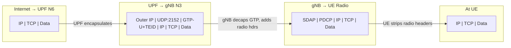
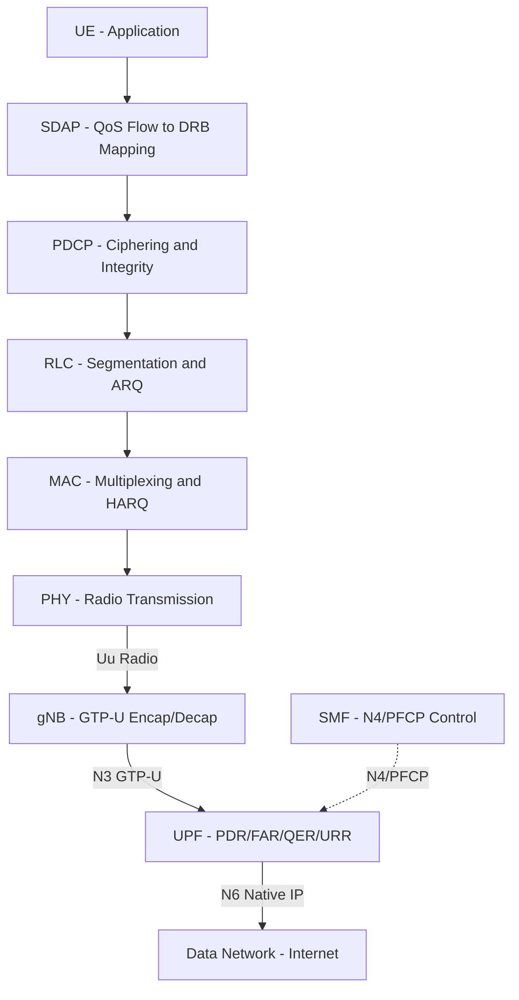

# ماژول 23: صفحه کاربر

## 1. مفهوم صفحه کاربر

**صفحه کاربر** (که **صفحه داده** یا **صفحه-U** نیز نامیده می‌شود) مسئول حمل داده واقعی کاربر از طریق شبکه موبایل است. این شامل موارد زیر است:

- **بسته‌های IP** (مرور وب، داده کاربرد، انتقال فایل)
- **داده صدا** (فریم‌های گفتار کدگذاری‌شده VoLTE/VoNR)
- **جریان‌های ویدیو** (ویدیوی بلادرنگ، محتوای پخش جریانی)
- **هر بار لایه کاربرد**

صفحه کاربر از صفحه کنترل متمایز است — در حالی که صفحه کنترل اتصالات را برقرار، مدیریت و تخریب می‌کند، صفحه کاربر همان «لوله‌ای» است که داده پس از برقراری آن اتصالات در آن جریان می‌یابد.

**ویژگی‌های کلیدی:**
- نیازمندی توان عملیاتی بالا
- حساسیت کم به تأخیر
- ارسال بدون حالت (پس از برقراری تونل‌ها)
- مدیریت بسته آگاه به QoS
- شفاف نسبت به سیگنالینگ — داده را بدون تفسیر حمل می‌کند

---

## 2. پروتکل GTP-U (پروتکل تونل‌سازی GPRS — صفحه کاربر)

GTP-U (3GPP TS 29.281) پروتکل تونل‌سازی اصلی است که برای انتقال داده کاربر بین گره‌های شبکه در تمام نسل‌ها (3G، 4G، 5G) استفاده می‌شود.

### 2.1 ساختار سرآیند

سرآیند GTP-U یک **بخش اجباری 8 بایتی** به‌علاوه سرآیندهای افزونه اختیاری دارد:

```
 0                   1                   2                   3
 0 1 2 3 4 5 6 7 8 9 0 1 2 3 4 5 6 7 8 9 0 1 2 3 4 5 6 7 8 9 0 1
+-+-+-+-+-+-+-+-+-+-+-+-+-+-+-+-+-+-+-+-+-+-+-+-+-+-+-+-+-+-+-+-+
|Ver|PT|(*)|E|S|PN|  Msg Type   |         Length                |
+-+-+-+-+-+-+-+-+-+-+-+-+-+-+-+-+-+-+-+-+-+-+-+-+-+-+-+-+-+-+-+-+
|                  TEID (Tunnel Endpoint Identifier)             |
+-+-+-+-+-+-+-+-+-+-+-+-+-+-+-+-+-+-+-+-+-+-+-+-+-+-+-+-+-+-+-+-+
|      Sequence Number (opt)    |  N-PDU Number |Next Ext Hdr   |
+-+-+-+-+-+-+-+-+-+-+-+-+-+-+-+-+-+-+-+-+-+-+-+-+-+-+-+-+-+-+-+-+
```

| فیلد | بیت‌ها | توضیح |
|-------|------|-------------|
| Version | 3 | همیشه `001` (GTPv1) |
| PT (نوع پروتکل) | 1 | `1` = GTP، `0` = GTP' (صورت‌حساب) |
| رزروشده (*) | 1 | باید 0 باشد |
| E (سرآیند افزونه) | 1 | سرآیند افزونه در ادامه می‌آید |
| S (شماره ترتیب) | 1 | فیلد شماره ترتیب موجود است |
| PN (شماره N-PDU) | 1 | فیلد شماره N-PDU موجود است |
| نوع پیام | 8 | `0xFF` = T-PDU (داده کاربر)، بقیه = سیگنالینگ |
| طول | 16 | طول بار (بدون 8 بایت اجباری) |
| TEID | 32 | شناسه نقطه انتهایی تونل |

### 2.2 TEID (شناسه نقطه انتهایی تونل)

**TEID** یک مقدار 32 بیتی است که یک نقطه انتهایی تونل GTP را در گره دریافت‌کننده به‌طور یکتا شناسایی می‌کند:

- هر جهت یک تونل TEID خود را دارد
- **گره دریافت‌کننده** TEID را تخصیص می‌دهد (به فرستنده می‌گوید «هنگام ارسال به من از این TEID استفاده کن»)
- TEID = 0 برای پیام‌های اولیه صفحه کنترل رزرو شده است
- یک گره ممکن است هزاران TEID فعال به‌طور همزمان داشته باشد (یکی در هر حامل/نشست در هر جهت)

**مثال:**
```
gNB tells UPF: "For downlink data to UE-X, use TEID = 0x00A1B2C3 on N3"
UPF tells gNB: "For uplink data from UE-X, use TEID = 0x00D4E5F6 on N3"
```

### 2.3 کپسوله‌سازی / واکپسوله‌سازی

در هر گام GTP-U، بسته IP کاربر درون موارد زیر **کپسوله** می‌شود:

```
[Outer IP Header][UDP (port 2152)][GTP-U Header][Inner IP Packet (user data)]
```

- **کپسوله‌سازی** (گره فرستنده): سرآیند GTP-U + UDP + IP بیرونی را پیش اضافه می‌کند
- **واکپسوله‌سازی** (گره دریافت‌کننده): IP بیرونی + UDP + سرآیند GTP-U را حذف می‌کند، IP درونی را ارسال می‌کند
- در گره‌های میانی: ممکن است واکپسوله و با TEID جدید دوباره کپسوله کند

### 2.4 شماره‌های ترتیب و سرآیندهای افزونه

**شماره‌های ترتیب (16 بیتی):**
- اختیاری اما برای بازترتیبی در نقاط انتهایی تونل استفاده می‌شود
- حیاتی در حین تحویل (تضمین عدم اتلاف/بازترتیبی بسته)
- در هر PDU در هر تونل افزایش می‌یابد

**سرآیندهای افزونه:**
- از طریق فیلد «نوع سرآیند افزونه بعدی» زنجیره می‌شوند
- هر افزونه: `[Length (1 byte)][Content (variable)][Next Ext Hdr Type (1 byte)]`

سرآیندهای افزونه معمول:

| نوع | نام | هدف |
|------|------|---------|
| 0x85 | محفظه نشست PDU | شناسه جریان QoS در 5G (QFI)، QoS بازتابی |
| 0xC0 | شماره PDU در PDCP | برای تحویل بدون‌اتلاف |
| 0x40 | پورت UDP | چندگانه‌سازی اضافی |

---

## 3. صفحه کاربر در LTE (4G)

### 3.1 مسیر سرتاسری

```
UE ←──Radio/PDCP──→ eNB ←──GTP-U/S1-U──→ S-GW ←──GTP-U/S5──→ P-GW ←──IP──→ Internet
```

### 3.2 سرآیندهای بسته در هر بخش

**بخش 1: UE ← eNB (واسط رادیویی / Uu)**
```
[PDCP Header][IP Packet (user data)]
  └─ Over radio: RLC → MAC → PHY
```

**بخش 2: eNB ← S-GW (واسط S1-U)**
```
[Outer IP (eNB→SGW)][UDP:2152][GTP-U (TEID-S1)][IP Packet (user data)]
```

**بخش 3: S-GW ← P-GW (واسط S5/S8)**
```
[Outer IP (SGW→PGW)][UDP:2152][GTP-U (TEID-S5)][IP Packet (user data)]
```

**بخش 4: P-GW ← اینترنت**
```
[IP Packet (user data)]  ← Native IP, no tunneling
```

### 3.3 مدل حامل LTE

- **حامل پیش‌فرض**: همیشه فعال، در اتصال برقرار می‌شود (یکی در هر اتصال PDN)
- **حامل اختصاصی**: QoS اضافی، در صورت تقاضا برقرار می‌شود (مثلاً VoLTE)
- هر حامل = مجموعه یکتایی از TEIDها روی S1-U و S5


---

## 4. صفحه کاربر در 5G

### 4.1 مسیر سرتاسری

```
UE ←──Radio/SDAP/PDCP──→ gNB ←──GTP-U/N3──→ UPF ←──N6 (native IP)──→ DN
```

### 4.2 نقاط مرجع 5G برای صفحه کاربر

| واسط | بین | انتقال | هدف |
|-----------|---------|-----------|---------|
| **N3** | gNB ↔ UPF | GTP-U روی UDP/IP | داده کاربر RAN به هسته |
| **N9** | UPF ↔ UPF | GTP-U روی UDP/IP | ارسال بین-UPF |
| **N6** | UPF ↔ DN | IP خام | خروج به شبکه داده |

### 4.3 لایه SDAP (پروتکل انطباق داده خدمات)

لایه **SDAP** در 5G NR جدید است (در LTE وجود ندارد) و بالای PDCP قرار می‌گیرد:

```
┌──────────────┐
│   QoS Flows  │  (identified by QFI: QoS Flow Identifier)
├──────────────┤
│     SDAP     │  ← Maps QoS Flows to DRBs
├──────────────┤
│     PDCP     │
├──────────────┤
│     RLC      │
├──────────────┤
│     MAC      │
├──────────────┤
│     PHY      │
└──────────────┘
```

**توابع SDAP:**
- **پیوند پایین‌سو:** نگاشت جریان QoS ← DRB (بر اساس QFI در سرآیند افزونه GTP-U)
- **پیوند بالاسو:** علامت‌گذاری DRB ← جریان QoS (QFI را روی بسته‌های پیوند بالاسو می‌زند)
- **QoS بازتابی:** UE نگاشت DL را برای UL بدون سیگنالینگ صریح آینه می‌کند

### 4.4 معماری چند-UPF

5G از **زنجیره‌سازی UPF** برای مسیریابی انعطاف‌پذیر ترافیک پشتیبانی می‌کند:

| نوع UPF | نقش | مورد استفاده |
|----------|------|----------|
| **I-UPF** (میانی) | نقطه عبور/انشعاب | لنگر تحویل، هدایت ترافیک |
| **PSA-UPF** (لنگر نشست PDU) | لنگر نشست، تخصیص IP | نقطه آدرس IP پایدار |

```
gNB ──N3──→ I-UPF ──N9──→ PSA-UPF ──N6──→ DN
                 │
                 └──N9──→ Local UPF ──N6──→ Edge DN (MEC)
```

---

## 5. توابع UPF (3GPP TS 23.501)

UPF توسط SMF از طریق **واسط N4** با استفاده از **پروتکل PFCP** (پروتکل کنترل ارسال بسته، TS 29.244) کنترل می‌شود.

### 5.1 قواعد PFCP

| قاعده | سرواژه | عملکرد |
|------|---------|----------|
| **قاعده تشخیص بسته** | PDR | تطبیق بسته‌های ورودی (با TEID، IP، پورت، QFI و غیره) |
| **قاعده اقدام ارسال** | FAR | چه کاری انجام شود (ارسال، دور ریختن، بافر، تکثیر) |
| **قاعده اجرای QoS** | QER | محدودسازی نرخ (MBR/GBR)، دروازه‌بندی، علامت‌گذاری |
| **قاعده گزارش‌دهی مصرف** | URR | اندازه‌گیری حجم/زمان، محرک‌های گزارش‌دهی |
| **قاعده اقدام بافرینگ** | BAR | بافر بسته‌های DL وقتی UE بیکار است، اطلاع به SMF |

### 5.2 نحوه کار قواعد با هم

```
Incoming Packet
      │
      ▼
┌─────────────┐
│     PDR     │  ← Match: outer header (TEID, IP), inner header, QFI
│  (Detect)   │
└──────┬──────┘
       │ matched → associated rules:
       ▼
┌─────────────┐  ┌─────────────┐  ┌─────────────┐  ┌─────────────┐
│     FAR     │  │     QER     │  │     URR     │  │     BAR     │
│ (Forward)   │  │ (QoS Enforce)│  │  (Report)   │  │  (Buffer)   │
└─────────────┘  └─────────────┘  └─────────────┘  └─────────────┘
```

### 5.3 واسط N4/PFCP

- **SMF ← UPF:** درخواست برقراری/اصلاح/حذف نشست
- **UPF ← SMF:** گزارش نشست (گزارش‌های مصرف، اعلان داده DL)
- PFCP از **SEID** (شناسه نقطه انتهایی نشست) استفاده می‌کند — مشابه TEID اما برای کنترل
- روی پورت UDP 8805 اجرا می‌شود

### 5.4 فهرست کامل توابع UPF

1. مسیریابی و ارسال بسته
2. بازرسی بسته (DPI برای تشخیص کاربرد)
3. اجرای نرخ UL/DL (در هر جریان QoS)
4. گزارش‌دهی مصرف ترافیک (برای صورت‌حساب)
5. بافرینگ و اعلان بسته DL
6. مدیریت QoS (علامت‌گذاری DSCP، پلیسینگ)
7. رهگیری قانونی (جمع‌آوری UP)
8. علامت‌گذاری بسته در سطح انتقال (DSCP سرآیند بیرونی)


---

## 6. مثال ردیابی بسته: داده پیوند پایین‌سو

**سناریو:** کارساز روی اینترنت داده را به UE می‌فرستد

### 6.1 گام-به-گام

**گام 1: اینترنت ← UPF (واسط N6)**
```
┌─────────────────────────────────────┐
│ IP Header                           │
│  Src: 93.184.216.34 (server)        │
│  Dst: 10.0.0.1 (UE IP)             │
├─────────────────────────────────────┤
│ TCP/UDP Header                      │
├─────────────────────────────────────┤
│ Application Data (payload)          │
└─────────────────────────────────────┘
```

**گام 2: UPF ← gNB (واسط N3 — کپسوله‌سازی GTP-U)**
```
┌─────────────────────────────────────┐
│ Outer IP Header                     │
│  Src: 192.168.100.1 (UPF N3 IP)    │
│  Dst: 192.168.200.1 (gNB N3 IP)    │
├─────────────────────────────────────┤
│ UDP Header (Src: ephemeral, Dst: 2152) │
├─────────────────────────────────────┤
│ GTP-U Header                        │
│  TEID: 0x00A1B2C3 (assigned by gNB)│
│  Ext Hdr: PDU Session Container     │
│    QFI: 9 (QoS Flow ID)            │
├─────────────────────────────────────┤
│ Inner IP Header                     │
│  Src: 93.184.216.34 (server)        │
│  Dst: 10.0.0.1 (UE IP)             │
├─────────────────────────────────────┤
│ TCP/UDP + Application Data          │
└─────────────────────────────────────┘
```

**گام 3: gNB ← UE (واسط رادیویی)**
```
┌─────────────────────────────────────┐
│ SDAP Header (QFI: 9)               │
├─────────────────────────────────────┤
│ PDCP Header (SN, integrity info)    │
├─────────────────────────────────────┤
│ IP Header                           │
│  Src: 93.184.216.34                 │
│  Dst: 10.0.0.1                      │
├─────────────────────────────────────┤
│ TCP/UDP + Application Data          │
└─────────────────────────────────────┘
  └── RLC segmentation → MAC mux → PHY (radio transmission)
```

**گام 4: در UE**
```
┌─────────────────────────────────────┐
│ IP Header                           │
│  Src: 93.184.216.34                 │
│  Dst: 10.0.0.1                      │
├─────────────────────────────────────┤
│ TCP/UDP + Application Data          │
└─────────────────────────────────────┘
  └── Delivered to application layer
```

### 6.2 نمودار لایه‌های کپسوله‌سازی



---

## 7. بهینه‌سازی صفحه کاربر

### 7.1 اتصال دوگانه (DC) — حامل تقسیم‌شده

در **EN-DC** (اتصال دوگانه E-UTRA–NR) یا **NR-DC**:

```
                    ┌── MN (Master Node: eNB/gNB) ──┐
UE ←── Radio ──────┤                                 ├──→ Core
                    └── SN (Secondary Node: gNB)  ──┘
```

**انواع حامل تقسیم‌شده:**

| نوع | توضیح | مسیر GTP-U |
|------|-------------|------------|
| حامل MCG | داده فقط از طریق گره اصلی | UPF ↔ MN |
| حامل SCG | داده فقط از طریق گره ثانویه | UPF ↔ SN |
| حامل تقسیم‌شده | داده در هر دو گره تقسیم می‌شود | UPF ↔ MN ↔ SN (MN مسیریابی می‌کند) |

- توان عملیاتی را با تجمیع منابع رادیویی از دو گره افزایش می‌دهد
- لایه PDCP در MN بازترتیبی را برای حامل‌های تقسیم‌شده مدیریت می‌کند

### 7.2 UPF چند-مسیره

چندین UPF در مسیر داده برای موارد زیر:
- **توازن بار**: توزیع ترافیک در بین UPFها
- **افزونگی**: پیوندهای N9 بین UPFها برای تاب‌آوری
- **بهینه‌سازی جغرافیایی**: مسیریابی ترافیک از نزدیک‌ترین UPF

### 7.3 رایانش لبه (شکست محلی)

5G **هدایت ترافیک** را برای MEC (رایانش لبه چند-دسترسی) ممکن می‌سازد:

**طبقه‌بند پیوند بالاسو (UL CL):**
```
gNB ──N3──→ UL CL (I-UPF) ──N9──→ PSA-UPF ──N6──→ Central DN
                    │
                    └──────N6──→ Local DN (Edge/MEC)
```
- UL CL بسته‌های UL را بازرسی می‌کند و ترافیک منطبق را به DN محلی مسیریابی می‌کند
- ترافیک غیرمنطبق به DN مرکزی ادامه می‌یابد
- **همان آدرس IP UE** برای هر دو مسیر (شفاف نسبت به UE)

**نقطه انشعاب:**
```
gNB ──N3──→ BP (I-UPF) ──N9──→ PSA-UPF ──N6──→ Central DN
                  │
                  └──N9──→ Local PSA-UPF ──N6──→ Edge DN
```
- لنگرهای نشست PDU متفاوت برای محلی در برابر دور
- ممکن است از آدرس‌های IP متفاوت UE استفاده کند

**مزایای رایانش لبه:**
- تأخیر فوق‌العاده کم (RTT کمتر از 10 ms)
- پهنای باند بک‌هال کاهش‌یافته
- پردازش داده محلی (حریم خصوصی، انطباق)
- موارد استفاده: AR/VR، رانندگی خودران، IoT صنعتی

---

## نمودار مسیر کامل صفحه کاربر 5G



---

## جدول خلاصه: صفحه کاربر در نسل‌ها

| جنبه | 3G (UMTS) | 4G (LTE) | 5G (NR) |
|--------|-----------|----------|---------|
| پروتکل تونل | GTP-U | GTP-U | GTP-U |
| واسط RAN←هسته | Iu-PS | S1-U | N3 |
| درون هسته | Gn (SGSN↔GGSN) | S5/S8 (SGW↔PGW) | N9 (UPF↔UPF) |
| هسته←DN | Gi | SGi | N6 |
| سازوکار QoS | کلاس‌های ترافیک | حامل‌ها (QCI) | جریان‌های QoS (QFI) |
| لایه QoS رادیویی | — | — | SDAP |
| عملکرد دروازه | GGSN | P-GW | UPF |
| کنترل UP | — | — | PFCP (N4) |
| پشتیبانی لبه | خیر | محدود | بومی (UL CL، BP) |

---

## نکات کلیدی

1. **GTP-U** تونل جهانی صفحه کاربر است — همان پروتکل از 3G تا 5G
2. **TEID** هر نقطه انتهایی تونل را شناسایی می‌کند — توسط گیرنده تخصیص می‌یابد
3. **5G صفحه کنترل و صفحه کاربر را جدا می‌کند** (CUPS) — SMF از طریق PFCP/N4 UPF را کنترل می‌کند
4. **SDAP** لایه جدید 5G است که جریان‌های QoS را به حامل‌های رادیویی نگاشت می‌کند
5. **قواعد UPF (PDR/FAR/QER/URR/BAR)** پردازش بسته قابل برنامه‌ریزی فراهم می‌کنند
6. **رایانش لبه** به‌طور بومی از طریق طبقه‌بند پیوند بالاسو و نقطه انشعاب پشتیبانی می‌شود
7. بهینه‌سازی صفحه کاربر (DC، چند-UPF، لبه) موارد استفاده متنوع 5G را ممکن می‌سازد
