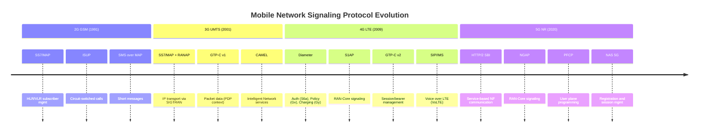
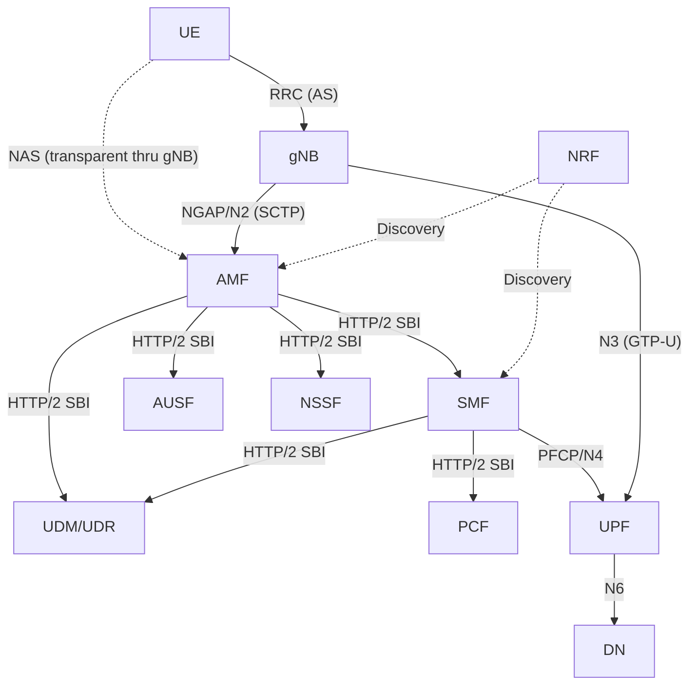

# Module 24: Control Plane

## 1. Control Plane Concept

The **Control Plane** (C-Plane) handles all **signaling** in the mobile network — the messages that set up, manage, modify, and tear down connections. It does NOT carry user data.

**Control Plane responsibilities:**
- **Authentication & Security**: Verify subscriber identity, establish encryption
- **Registration & Mobility**: Attach, detach, tracking area updates, handovers
- **Session Management**: Establish/modify/release PDU sessions or bearers
- **QoS Negotiation**: Agree on quality parameters for data flows
- **Paging**: Locate idle UEs for incoming data/calls
- **Policy & Charging**: Apply operator rules to sessions

**Key principle:** The control plane "programs" the user plane — it sets up the tunnels, rules, and routing that the user plane then uses to forward data.

---

## 2. Control Plane Protocols — MAJOR Reference Table

| Protocol | Generation | Layer | Plane | Between | Purpose |
|----------|-----------|-------|-------|---------|---------|
| **MAP** (Mobile Application Part) | 2G/3G | Application | Control | MSC↔HLR, VLR↔HLR | Subscriber data, auth, SMS routing, HO |
| **ISUP** (ISDN User Part) | 2G/3G | Application | Control | MSC↔MSC, MSC↔PSTN | Circuit-switched call setup/release |
| **RANAP** (RAN Application Protocol) | 3G | Application | Control | RNC↔CN (MSC/SGSN) | RAN-Core signaling (Iu interface) |
| **S1AP** (S1 Application Protocol) | 4G | Application | Control | eNB↔MME | RAN-Core signaling (S1-MME) |
| **NGAP** (NG Application Protocol) | 5G | Application | Control | gNB↔AMF | RAN-Core signaling (N2) |
| **GTP-C v1** | 3G | Tunnel Control | Control | SGSN↔GGSN | PDP context create/modify/delete |
| **GTP-C v2** | 4G/5G | Tunnel Control | Control | MME↔S-GW↔P-GW | Session create/modify/delete bearer |
| **Diameter** | 4G | AAA/Policy | Control | MME↔HSS, PCRF↔P-GW | Auth (S6a), policy (Gx), charging (Gy) |
| **HTTP/2 SBI** | 5G | Service-Based | Control | NF↔NF (all 5GC NFs) | Service discovery, registration, session mgmt |
| **NAS EMM** | 4G | Non-Access Stratum | Control | UE↔MME | Attach, TAU, authentication, security |
| **NAS ESM** | 4G | Non-Access Stratum | Control | UE↔MME (→P-GW) | Bearer setup/modify/release |
| **NAS 5GMM** | 5G | Non-Access Stratum | Control | UE↔AMF | Registration, authentication, service request |
| **NAS 5GSM** | 5G | Non-Access Stratum | Control | UE↔SMF (via AMF) | PDU session establish/modify/release |
| **RRC (LTE)** | 4G | Access Stratum | Control | UE↔eNB | Connection setup, meas config, HO, SIBs |
| **RRC (NR)** | 5G | Access Stratum | Control | UE↔gNB | Same + BWP config, beam mgmt, CHO |
| **SCTP** | 4G/5G | Transport | Control | eNB↔MME, gNB↔AMF | Reliable signaling transport (multi-stream) |
| **SIP** (Session Initiation Protocol) | 4G/5G (IMS) | Application | Control | UE↔P-CSCF↔S-CSCF | VoLTE/VoNR call setup, IMS registration |
| **PFCP** | 5G (4G CUPS) | Control | Control | SMF↔UPF | User plane rule programming (N4) |

### Protocol Stack Relationships

```
┌─────────────────────────────────────────────────────────────┐
│                    APPLICATION PROTOCOLS                      │
│  MAP | RANAP | S1AP | NGAP | GTP-C | Diameter | HTTP/2 SBI  │
├─────────────────────────────────────────────────────────────┤
│                    TRANSPORT PROTOCOLS                        │
│         SCTP          |        TCP        |      UDP         │
├─────────────────────────────────────────────────────────────┤
│                         IP                                    │
├─────────────────────────────────────────────────────────────┤
│                     L2 / L1 (Ethernet, etc.)                 │
└─────────────────────────────────────────────────────────────┘
```


---

## 3. NAS (Non-Access Stratum)

NAS protocols operate **between the UE and the core network** — they pass transparently through the RAN (the eNB/gNB does not interpret NAS messages, only relays them).

### 3.1 LTE NAS (TS 24.301)

LTE NAS has two sub-layers:

**EMM (EPS Mobility Management):**

| Procedure | Messages | Purpose |
|-----------|----------|---------|
| Attach | Attach Request/Accept/Complete | Register UE to network |
| Detach | Detach Request/Accept | Deregister UE |
| TAU | TAU Request/Accept | Update Tracking Area |
| Authentication | Auth Request/Response | Mutual authentication (AKA) |
| Security Mode | SMC Command/Complete | Activate NAS ciphering/integrity |
| Service Request | Service Request/Accept | Transition IDLE→CONNECTED |
| Identity | Identity Request/Response | Request IMSI if no GUTI |

**ESM (EPS Session Management):**

| Procedure | Messages | Purpose |
|-----------|----------|---------|
| PDN Connectivity | PDN Conn Request/Activate Default Bearer | Establish PDN connection |
| Bearer Resource Alloc | Bearer Resource Alloc Req | UE-initiated dedicated bearer |
| Activate Dedicated Bearer | Act Ded Bearer Req/Accept | Network-initiated QoS bearer |
| Modify Bearer | Modify Bearer Req/Accept | Change bearer QoS |
| Deactivate Bearer | Deact Bearer Req/Accept | Release bearer |

### 3.2 5G NAS (TS 24.501)

5G NAS also has two sub-layers but with enhanced capabilities:

**5GMM (5G Mobility Management):**

| Procedure | Messages | Purpose |
|-----------|----------|---------|
| Registration | Registration Req/Accept/Complete | Initial, mobility, periodic reg |
| Deregistration | Dereg Request/Accept | UE or network initiated |
| Authentication | Auth Request/Response/Failure | 5G-AKA or EAP-AKA' |
| Security Mode | SMC Command/Complete | NAS security activation |
| Service Request | Service Request/Accept | Resume from IDLE/INACTIVE |
| Configuration Update | Config Update Command/Complete | GUTI reallocation, NSSAI |
| Notification | Notification/Response | Network triggers (SOR, UPU) |

**5GSM (5G Session Management):**

| Procedure | Messages | Purpose |
|-----------|----------|---------|
| PDU Session Establishment | PDU Session Est Req/Accept | Create PDU session |
| PDU Session Modification | PDU Session Mod Req/Accept | Modify QoS flows |
| PDU Session Release | PDU Session Rel Req/Accept | Tear down session |

**Key 5G NAS enhancements vs. 4G:**
- Registration replaces Attach + TAU (unified procedure)
- Supports network slicing (requested NSSAI in registration)
- PDU session types: IPv4, IPv6, IPv4v6, Ethernet, Unstructured
- NAS messages routed via AMF to SMF for session management

### 3.3 NAS Transparency Through RAN

```
┌──────┐         ┌──────┐         ┌──────┐
│  UE  │────────→│ gNB  │────────→│ AMF  │
│      │  RRC    │      │  NGAP   │      │
│ NAS  │─ ─ ─ ─ ─ ─ ─ ─ ─ ─ ─ ─→│ NAS  │
└──────┘         └──────┘         └──────┘
                  (transparent)
```

- NAS messages are carried inside RRC messages on the radio interface
- RRC carries them inside NGAP (5G) or S1AP (4G) to the core
- The RAN node does NOT decrypt or interpret NAS content
- Separate NAS security context (NAS ciphering/integrity) from AS security (RRC/UP)

---

## 4. RRC (Radio Resource Control)

RRC operates **between the UE and the base station** (Access Stratum) and controls the radio connection.

### 4.1 LTE RRC (TS 36.331)

**Key Procedures:**

| Procedure | Messages | Purpose |
|-----------|----------|---------|
| Connection Setup | RRC Conn Setup Req/Setup/Complete | Establish SRB1 |
| Connection Reconfiguration | RRC Conn Reconfig | Add/modify bearers, handover |
| Connection Release | RRC Conn Release | Release radio resources |
| Measurement Configuration | (in Reconfig) | Configure meas events (A1-A6, B1-B2) |
| Handover | RRC Conn Reconfig (mobilityCtrlInfo) | Execute handover |
| Security Mode | Security Mode Command/Complete | Activate AS ciphering/integrity |
| System Information | MIB, SIB1-SIB19 | Broadcast cell parameters |

**LTE RRC States:**

```
┌─────────────┐                    ┌──────────────────┐
│  RRC_IDLE   │◄──── Release ──────│  RRC_CONNECTED   │
│             │                    │                  │
│ • Cell sel/ │──── Setup ────────→│ • Active data    │
│   resel     │                    │ • Measurements   │
│ • Paging    │                    │ • Handover       │
│ • No UE ctx │                    │ • UE context     │
└─────────────┘                    └──────────────────┘
```

### 4.2 NR RRC (TS 38.331)

NR RRC includes all LTE RRC functions **plus**:

| Feature | Description |
|---------|-------------|
| **BWP Configuration** | Configure Bandwidth Parts (active BWP switching) |
| **Beam Management** | SSB beam indication, beam failure recovery, L1-RSRP reporting |
| **Conditional Handover (CHO)** | Pre-configure HO conditions — execute when met (no HO command delay) |
| **Cell Group Config** | MCG + SCG for dual connectivity |
| **MeasConfig enhancements** | NR events (similar + inter-RAT NR↔LTE), L3 filtering per beam |
| **SIB enhancements** | On-demand SIBs, SIB for RedCap, NTN, sidelink |

### 4.3 RRC States in 5G (Three States)

```
┌─────────────┐         ┌──────────────────┐         ┌──────────────────┐
│  RRC_IDLE   │         │  RRC_INACTIVE    │         │  RRC_CONNECTED   │
│             │         │  (NEW in 5G)     │         │                  │
│ • No UE ctx │         │ • UE ctx in gNB  │         │ • Full connection│
│   in RAN    │         │   + core (stored)│         │ • Active data    │
│ • Core: RM  │         │ • Fast resume    │         │ • Measurements   │
│   registered│         │ • RAN paging     │         │ • Handover       │
│ • CN paging │         │ • RNA (RAN-based │         │                  │
│             │         │   notification)  │         │                  │
└──────┬──────┘         └────────┬─────────┘         └────────┬─────────┘
       │                         │                             │
       │◄─── Release ────────────┼──────── Release ────────────┘
       │                         │◄──── Suspend ───────────────┘
       │──── Setup ─────────────→│──── Resume ────────────────→│
       │──── Setup ──────────────────────────────────────────→ │
```

**RRC_INACTIVE benefits:**
- UE context preserved in Last Serving gNB → fast resume (~10 ms vs ~50 ms)
- No full connection setup needed — just RRC Resume
- RNA (RAN-based Notification Area) for mobility without core notification
- Ideal for IoT devices with infrequent small data


---

## 5. NGAP (NG Application Protocol) — TS 38.413

NGAP is the **5G equivalent of S1AP** (LTE) — it runs between the **gNB and AMF** over the **N2 interface**.

### 5.1 Transport

```
[NGAP PDU] → [SCTP (multi-stream)] → [IP] → [L2/L1]
```
- SCTP provides reliable, in-order delivery with multiple streams
- Stream 0: non-UE-associated signaling (setup, reset)
- Other streams: UE-associated signaling (one stream per UE-group)

### 5.2 Key Procedures

| Category | Procedure | Description |
|----------|-----------|-------------|
| **Interface Mgmt** | NG Setup | gNB registers with AMF (capabilities, served cells) |
| | AMF Configuration Update | AMF informs gNB of changes |
| | NG Reset | Error recovery |
| **UE Context** | Initial Context Setup | AMF→gNB: create UE context, security, PDU sessions |
| | UE Context Release | Release UE resources at gNB |
| | UE Context Modification | Modify existing context |
| **Mobility** | Handover Required | gNB→AMF: request inter-gNB HO |
| | Handover Request | AMF→target gNB: prepare HO |
| | Handover Notify | Target gNB confirms HO complete |
| | Path Switch Request | Intra-AMF, X2-based HO notification |
| **NAS Transport** | Initial UE Message | First NAS message from UE (gNB→AMF) |
| | Downlink NAS Transport | AMF→gNB→UE: carry NAS message |
| | Uplink NAS Transport | UE→gNB→AMF: carry NAS message |
| **Paging** | Paging | AMF→gNB: page UE in TA cells |
| **PDU Session** | PDU Session Resource Setup | Establish user plane resources |
| | PDU Session Resource Modify | Modify QoS/resources |
| | PDU Session Resource Release | Release UP resources |

### 5.3 NGAP vs. S1AP Comparison

| Feature | S1AP (4G) | NGAP (5G) |
|---------|-----------|-----------|
| Interface | S1-MME | N2 |
| Nodes | eNB ↔ MME | gNB ↔ AMF |
| Transport | SCTP | SCTP |
| Session concept | E-RAB (bearer) | PDU Session + QoS Flows |
| Slice support | No | Yes (S-NSSAI in procedures) |
| UE states | IDLE, CONNECTED | IDLE, INACTIVE, CONNECTED |
| Multi-connectivity | No | Yes (secondary RAT) |

---

## 6. GTP-C (GTP Control Plane)

### 6.1 GTP-C v1 (3G — TS 29.060)

| Interface | Between | Purpose |
|-----------|---------|---------|
| Gn/Gp | SGSN ↔ GGSN | PDP Context management |

**Key messages:**
- Create PDP Context Request/Response
- Update PDP Context Request/Response
- Delete PDP Context Request/Response

### 6.2 GTP-C v2 (4G — TS 29.274)

GTPv2-C is a complete redesign with improved efficiency:

| Interface | Between | Purpose |
|-----------|---------|---------|
| S11 | MME ↔ S-GW | Session/bearer management |
| S5/S8 | S-GW ↔ P-GW | Session/bearer management |
| S10 | MME ↔ MME | Inter-MME handover |
| S3 | MME ↔ SGSN | 3G↔4G mobility |

**Key GTPv2-C Messages:**

| Message | Direction | Purpose |
|---------|-----------|---------|
| Create Session Request/Response | MME→S-GW→P-GW | Establish PDN connection |
| Modify Bearer Request/Response | MME→S-GW | Update after HO (new eNB TEID) |
| Delete Session Request/Response | MME→S-GW→P-GW | Release PDN connection |
| Create Bearer Request/Response | P-GW→S-GW→MME | Dedicated bearer setup |
| Delete Bearer Request/Response | P-GW→S-GW→MME | Dedicated bearer release |
| Release Access Bearers | MME→S-GW | UE goes IDLE (release S1-U) |
| Downlink Data Notification | S-GW→MME | DL data arrived for idle UE |

**GTPv2-C Header:**
```
 0                   1                   2                   3
+-+-+-+-+-+-+-+-+-+-+-+-+-+-+-+-+-+-+-+-+-+-+-+-+-+-+-+-+-+-+-+-+
|Ver| P| T|Spare|  Message Type |         Length                |
+-+-+-+-+-+-+-+-+-+-+-+-+-+-+-+-+-+-+-+-+-+-+-+-+-+-+-+-+-+-+-+-+
|        TEID (if T=1)          |   Sequence Number   | Spare  |
+-+-+-+-+-+-+-+-+-+-+-+-+-+-+-+-+-+-+-+-+-+-+-+-+-+-+-+-+-+-+-+-+
|                     IE (Information Elements)                  |
```

### 6.3 5G: From GTP-C to PFCP + HTTP/2

In 5G, the traditional GTP-C role is split:
- **SMF ↔ UPF**: Uses **PFCP** (N4) — not GTP-C
- **Inter-NF signaling**: Uses **HTTP/2 SBI** — not GTP-C
- GTPv2-C remains for interworking with 4G (N26 interface: AMF↔MME)

---

## 7. HTTP/2 SBI (Service-Based Interface)

### 7.1 Concept

5G Core replaces point-to-point interfaces with a **Service-Based Architecture (SBA)**:
- Each NF exposes **services** via RESTful APIs
- Communication uses **HTTP/2** over **TLS 1.3** over **TCP**
- Data format: **JSON** (OpenAPI 3.0 specifications)

### 7.2 Key NF Services

| NF | Service | Operations | Purpose |
|----|---------|-----------|---------|
| **AMF** | Namf_Communication | N1N2MessageTransfer, UEContextTransfer | NAS relay, context |
| **SMF** | Nsmf_PDUSession | Create, Update, Release | PDU session lifecycle |
| **UDM** | Nudm_SubscriberDataMgmt | Get, Subscribe, Unsubscribe | Subscriber data |
| **AUSF** | Nausf_UEAuthentication | Authenticate | 5G-AKA, EAP-AKA' |
| **PCF** | Npcf_SMPolicyControl | Create, Update, Delete | QoS/charging policy |
| **NRF** | Nnrf_NFDiscovery | Discover | Find NF instances |
| **NSSF** | Nnssf_NSSelection | Get | Network slice selection |
| **NEF** | Nnef_EventExposure | Subscribe, Unsubscribe | Event reporting to AF |

### 7.3 Communication Patterns

| Pattern | Description | Example |
|---------|-------------|---------|
| **Request-Response** | Synchronous API call | SMF queries UDM for subscription |
| **Subscribe-Notify** | Asynchronous event | PCF subscribes to AMF for UE location |
| **Service Discovery** | Query NRF for NF endpoint | AMF discovers SMF via NRF |

### 7.4 SBI Protocol Stack

```
┌─────────────────────────────┐
│  NF Service (e.g., Nsmf)    │
├─────────────────────────────┤
│  HTTP/2 (multiplexed streams)│
├─────────────────────────────┤
│  TLS 1.3 (mTLS between NFs) │
├─────────────────────────────┤
│  TCP                         │
├─────────────────────────────┤
│  IP                          │
└─────────────────────────────┘
```

---

## 8. Signaling Protocol Evolution: SS7 → Diameter → HTTP/2

### 8.1 Timeline

| Era | Technology | Signaling Stack | Characteristics |
|-----|-----------|-----------------|-----------------|
| **1G/2G** (1980s-90s) | GSM | SS7 (MAP, ISUP, SCCP, MTP) | Circuit-switched, TDM-based, binary encoding |
| **3G** (2000s) | UMTS | SS7 + RANAP + GTP-C v1 | IP transport added (SIGTRAN), still SS7 app layer |
| **4G** (2010s) | LTE | Diameter + S1AP + GTP-C v2 | All-IP, AVP-based encoding, point-to-point |
| **5G** (2020s) | NR | HTTP/2 SBI + NGAP + PFCP | Cloud-native, RESTful, service-mesh, JSON |

### 8.2 Key Evolutionary Drivers

```
SS7 (1980s)          Diameter (2010s)         HTTP/2 SBI (2020s)
─────────────        ─────────────────        ────────────────────
• TDM transport      • IP transport           • IP transport
• Binary encoding    • AVP binary encoding    • JSON text encoding
• Fixed nodes        • Fixed nodes            • Microservices (NFs)
• Point-to-point     • Point-to-point         • Service mesh
• Centralized (STP)  • Diameter agents (DRA)  • Service discovery (NRF)
• Rigid interfaces   • Defined interfaces     • API-driven, extensible
• Hard to scale      • Moderately scalable    • Cloud-native, auto-scale
• Telecom-only       • Telecom-specific       • IT/Cloud standard
```

### 8.3 Signaling Evolution Timeline Diagram



### 8.4 Protocol Comparison: Auth Flow Example

**2G/3G (SS7/MAP):**
```
VLR ──MAP SendAuthInfo──→ HLR
HLR ──MAP SendAuthInfo Resp (triplets/quintets)──→ VLR
```

**4G (Diameter):**
```
MME ──Diameter AIR (Auth-Info-Request)──→ HSS    [S6a interface]
HSS ──Diameter AIA (Auth-Info-Answer, EPS vectors)──→ MME
```

**5G (HTTP/2):**
```
AMF ──POST /nausf-auth/v1/ue-authentications──→ AUSF
AUSF ──POST /nudm-ueau/v1/{supi}/auth-events──→ UDM
UDM ──200 OK (auth vectors)──→ AUSF
AUSF ──201 Created (5G-AKA challenge)──→ AMF
```

---

## Complete Control Plane Architecture Diagram (5G)



---

## Summary: Control Plane vs. User Plane

| Aspect | Control Plane | User Plane |
|--------|--------------|------------|
| Carries | Signaling messages | User data (IP, voice, video) |
| Purpose | Setup, manage, release connections | Transport data end-to-end |
| Latency tolerance | Moderate (100s of ms OK) | Critical (low latency required) |
| Volume | Low (small messages) | High (bulk data transfer) |
| Protocols | NAS, RRC, NGAP, HTTP/2, Diameter | GTP-U, SDAP, PDCP |
| 5G separation | AMF, SMF, AUSF, etc. | UPF (controlled by SMF via PFCP) |
| Scaling | Scale per signaling load | Scale per throughput demand |
| State | Stateful (tracks UE context) | Stateless forwarding (rules from CP) |

---

## Key Takeaways

1. **Control plane = signaling brain**: Sets up tunnels, authenticates users, manages mobility
2. **NAS is end-to-end (UE↔Core)** — transparent to RAN; separate security context
3. **RRC manages the radio** — connection setup, measurements, handover commands
4. **5G adds RRC_INACTIVE** state for fast resume and IoT efficiency
5. **NGAP replaced S1AP** — supports slicing, QoS flows, and three RRC states
6. **GTP-C evolved**: v1 (3G) → v2 (4G) → replaced by PFCP+HTTP/2 in 5G
7. **HTTP/2 SBI is revolutionary** — cloud-native, RESTful, auto-scalable NF communication
8. **Signaling evolution**: SS7 (binary, TDM) → Diameter (binary, IP) → HTTP/2 (JSON, cloud-native)
