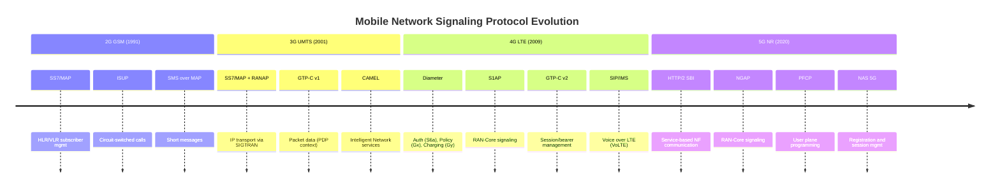
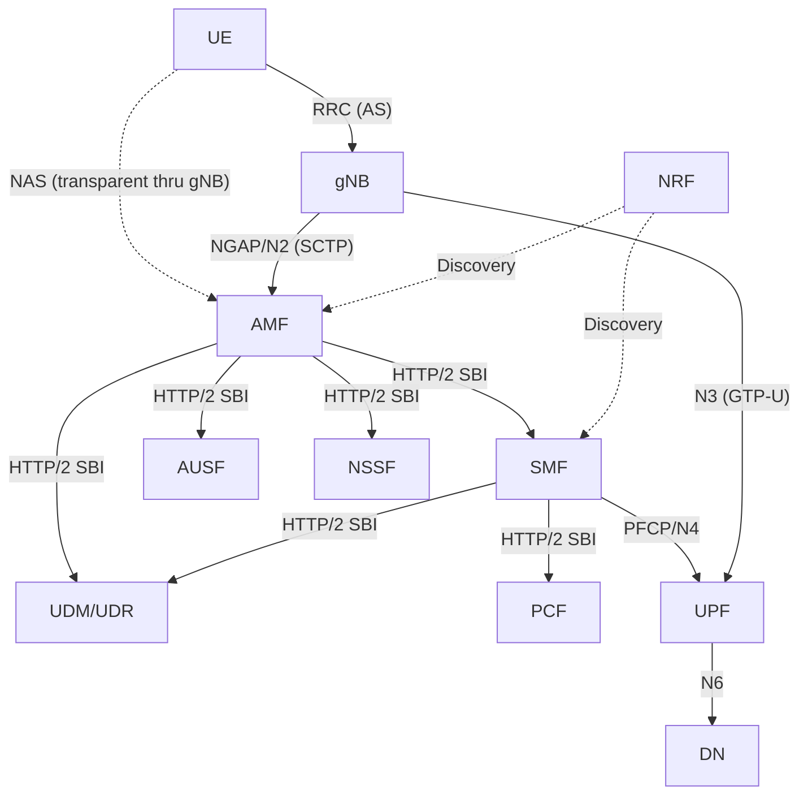

# ماژول 24: صفحه کنترل

## 1. مفهوم صفحه کنترل

**صفحه کنترل** (صفحه-C) تمام **سیگنالینگ** در شبکه موبایل را مدیریت می‌کند — پیام‌هایی که اتصالات را برقرار، مدیریت، اصلاح و تخریب می‌کنند. این صفحه داده کاربر را حمل **نمی‌کند**.

**مسئولیت‌های صفحه کنترل:**
- **احراز هویت و امنیت**: تأیید هویت مشترک، برقراری رمزنگاری
- **ثبت‌نام و تحرک**: اتصال، جداسازی، به‌روزرسانی نواحی ردیابی، تحویل‌ها
- **مدیریت نشست**: برقراری/اصلاح/آزادسازی نشست‌های PDU یا حامل‌ها
- **مذاکره QoS**: توافق بر پارامترهای کیفیت برای جریان‌های داده
- **صفحه‌بندی**: یافتن UEهای بیکار برای داده/تماس‌های ورودی
- **سیاست و صورت‌حساب**: اعمال قواعد اپراتور بر نشست‌ها

**اصل کلیدی:** صفحه کنترل صفحه کاربر را «برنامه‌ریزی» می‌کند — تونل‌ها، قواعد و مسیریابی را برقرار می‌کند که صفحه کاربر سپس برای ارسال داده از آن‌ها استفاده می‌کند.

---

## 2. پروتکل‌های صفحه کنترل — جدول مرجع اصلی

| پروتکل | نسل | لایه | صفحه | بین | هدف |
|----------|-----------|-------|-------|---------|---------|
| **MAP** (بخش کاربرد موبایل) | 2G/3G | کاربرد | کنترل | MSC↔HLR، VLR↔HLR | داده مشترک، احراز هویت، مسیریابی SMS، تحویل |
| **ISUP** (بخش کاربر ISDN) | 2G/3G | کاربرد | کنترل | MSC↔MSC، MSC↔PSTN | برقراری/آزادسازی تماس مدار-گزارشی |
| **RANAP** (پروتکل کاربرد RAN) | 3G | کاربرد | کنترل | RNC↔CN (MSC/SGSN) | سیگنالینگ RAN-هسته (واسط Iu) |
| **S1AP** (پروتکل کاربرد S1) | 4G | کاربرد | کنترل | eNB↔MME | سیگنالینگ RAN-هسته (S1-MME) |
| **NGAP** (پروتکل کاربرد NG) | 5G | کاربرد | کنترل | gNB↔AMF | سیگنالینگ RAN-هسته (N2) |
| **GTP-C v1** | 3G | کنترل تونل | کنترل | SGSN↔GGSN | ایجاد/اصلاح/حذف زمینه PDP |
| **GTP-C v2** | 4G/5G | کنترل تونل | کنترل | MME↔S-GW↔P-GW | ایجاد/اصلاح/حذف نشست و حامل |
| **Diameter** | 4G | AAA/سیاست | کنترل | MME↔HSS، PCRF↔P-GW | احراز هویت (S6a)، سیاست (Gx)، صورت‌حساب (Gy) |
| **HTTP/2 SBI** | 5G | خدمات‌محور | کنترل | NF↔NF (تمام NFهای 5GC) | کشف خدمات، ثبت‌نام، مدیریت نشست |
| **NAS EMM** | 4G | لایه غیر-دسترسی | کنترل | UE↔MME | اتصال، TAU، احراز هویت، امنیت |
| **NAS ESM** | 4G | لایه غیر-دسترسی | کنترل | UE↔MME (←P-GW) | راه‌اندازی/اصلاح/آزادسازی حامل |
| **NAS 5GMM** | 5G | لایه غیر-دسترسی | کنترل | UE↔AMF | ثبت‌نام، احراز هویت، درخواست خدمات |
| **NAS 5GSM** | 5G | لایه غیر-دسترسی | کنترل | UE↔SMF (از طریق AMF) | برقراری/اصلاح/آزادسازی نشست PDU |
| **RRC (LTE)** | 4G | لایه دسترسی | کنترل | UE↔eNB | راه‌اندازی اتصال، پیکربندی اندازه‌گیری، تحویل، SIBها |
| **RRC (NR)** | 5G | لایه دسترسی | کنترل | UE↔gNB | همان + پیکربندی BWP، مدیریت پرتو، CHO |
| **SCTP** | 4G/5G | انتقال | کنترل | eNB↔MME، gNB↔AMF | انتقال سیگنالینگ قابل اعتماد (چند-جریانی) |
| **SIP** (پروتکل آغاز نشست) | 4G/5G (IMS) | کاربرد | کنترل | UE↔P-CSCF↔S-CSCF | برقراری تماس VoLTE/VoNR، ثبت‌نام IMS |
| **PFCP** | 5G (CUPS در 4G) | کنترل | کنترل | SMF↔UPF | برنامه‌ریزی قواعد صفحه کاربر (N4) |

### روابط پشته پروتکل

```
┌─────────────────────────────────────────────────────────────┐
│                    APPLICATION PROTOCOLS                      │
│  MAP | RANAP | S1AP | NGAP | GTP-C | Diameter | HTTP/2 SBI  │
├─────────────────────────────────────────────────────────────┤
│                    TRANSPORT PROTOCOLS                        │
│         SCTP          |        TCP        |      UDP         │
├─────────────────────────────────────────────────────────────┤
│                         IP                                    │
├─────────────────────────────────────────────────────────────┤
│                     L2 / L1 (Ethernet, etc.)                 │
└─────────────────────────────────────────────────────────────┘
```


---

## 3. NAS (لایه غیر-دسترسی)

پروتکل‌های NAS **بین UE و شبکه هسته** عمل می‌کنند — آن‌ها به‌صورت شفاف از RAN عبور می‌کنند (eNB/gNB محتوای NAS را تفسیر نمی‌کند، فقط آن را رله می‌کند).

### 3.1 NAS در LTE (TS 24.301)

NAS در LTE دو زیرلایه دارد:

**EMM (مدیریت تحرک EPS):**

| رویه | پیام‌ها | هدف |
|-----------|----------|---------|
| Attach | Attach Request/Accept/Complete | ثبت UE در شبکه |
| Detach | Detach Request/Accept | لغو ثبت UE |
| TAU | TAU Request/Accept | به‌روزرسانی ناحیه ردیابی |
| احراز هویت | Auth Request/Response | احراز هویت متقابل (AKA) |
| حالت امنیتی | SMC Command/Complete | فعال‌سازی رمزگذاری/یکپارچگی NAS |
| درخواست خدمات | Service Request/Accept | گذار IDLE←CONNECTED |
| هویت | Identity Request/Response | درخواست IMSI در صورت نبود GUTI |

**ESM (مدیریت نشست EPS):**

| رویه | پیام‌ها | هدف |
|-----------|----------|---------|
| اتصال PDN | PDN Conn Request/Activate Default Bearer | برقراری اتصال PDN |
| تخصیص منبع حامل | Bearer Resource Alloc Req | حامل اختصاصی با محرک UE |
| فعال‌سازی حامل اختصاصی | Act Ded Bearer Req/Accept | حامل QoS با محرک شبکه |
| اصلاح حامل | Modify Bearer Req/Accept | تغییر QoS حامل |
| غیرفعال‌سازی حامل | Deact Bearer Req/Accept | آزادسازی حامل |

### 3.2 NAS در 5G (TS 24.501)

NAS در 5G نیز دو زیرلایه دارد اما با قابلیت‌های بهبودیافته:

**5GMM (مدیریت تحرک 5G):**

| رویه | پیام‌ها | هدف |
|-----------|----------|---------|
| ثبت‌نام | Registration Req/Accept/Complete | اولیه، تحرک، ثبت‌نام دوره‌ای |
| لغو ثبت‌نام | Dereg Request/Accept | با محرک UE یا شبکه |
| احراز هویت | Auth Request/Response/Failure | 5G-AKA یا EAP-AKA' |
| حالت امنیتی | SMC Command/Complete | فعال‌سازی امنیت NAS |
| درخواست خدمات | Service Request/Accept | بازگشت از IDLE/INACTIVE |
| به‌روزرسانی پیکربندی | Config Update Command/Complete | تخصیص مجدد GUTI، NSSAI |
| اعلان | Notification/Response | محرک‌های شبکه (SOR، UPU) |

**5GSM (مدیریت نشست 5G):**

| رویه | پیام‌ها | هدف |
|-----------|----------|---------|
| برقراری نشست PDU | PDU Session Est Req/Accept | ایجاد نشست PDU |
| اصلاح نشست PDU | PDU Session Mod Req/Accept | اصلاح جریان‌های QoS |
| آزادسازی نشست PDU | PDU Session Rel Req/Accept | تخریب نشست |

**بهبودهای کلیدی NAS در 5G نسبت به 4G:**
- ثبت‌نام جایگزین Attach + TAU می‌شود (رویه یکپارچه)
- از شبکه‌بندی پشتیبانی می‌کند (NSSAI درخواستی در ثبت‌نام)
- انواع نشست PDU: IPv4، IPv6، IPv4v6، Ethernet، Unstructured
- پیام‌های NAS از طریق AMF به SMF برای مدیریت نشست مسیریابی می‌شوند

### 3.3 شفافیت NAS از طریق RAN

```
┌──────┐         ┌──────┐         ┌──────┐
│  UE  │────────→│ gNB  │────────→│ AMF  │
│      │  RRC    │      │  NGAP   │      │
│ NAS  │─ ─ ─ ─ ─ ─ ─ ─ ─ ─ ─ ─→│ NAS  │
└──────┘         └──────┘         └──────┘
                  (transparent)
```

- پیام‌های NAS درون پیام‌های RRC روی واسط رادیویی حمل می‌شوند
- RRC آن‌ها را درون NGAP (5G) یا S1AP (4G) به هسته حمل می‌کند
- گره RAN محتوای NAS را رمزگشایی یا تفسیر **نمی‌کند**
- زمینه امنیتی NAS جدا (رمزگذاری/یکپارچگی NAS) از امنیت AS (RRC/UP)

---

## 4. RRC (کنترل منابع رادیویی)

RRC **بین UE و ایستگاه پایه** (لایه دسترسی) عمل می‌کند و اتصال رادیویی را کنترل می‌کند.

### 4.1 RRC در LTE (TS 36.331)

**رویه‌های کلیدی:**

| رویه | پیام‌ها | هدف |
|-----------|----------|---------|
| راه‌اندازی اتصال | RRC Conn Setup Req/Setup/Complete | برقراری SRB1 |
| پیکربندی مجدد اتصال | RRC Conn Reconfig | افزودن/اصلاح حامل‌ها، تحویل |
| آزادسازی اتصال | RRC Conn Release | آزادسازی منابع رادیویی |
| پیکربندی اندازه‌گیری | (در Reconfig) | پیکربندی رویدادهای اندازه‌گیری (A1-A6، B1-B2) |
| تحویل | RRC Conn Reconfig (mobilityCtrlInfo) | اجرای تحویل |
| حالت امنیتی | Security Mode Command/Complete | فعال‌سازی رمزگذاری/یکپارچگی AS |
| اطلاعات سیستم | MIB، SIB1-SIB19 | پخش پارامترهای سلول |

**حالت‌های RRC در LTE:**

```
┌─────────────┐                    ┌──────────────────┐
│  RRC_IDLE   │◄──── Release ──────│  RRC_CONNECTED   │
│             │                    │                  │
│ • Cell sel/ │──── Setup ────────→│ • Active data    │
│   resel     │                    │ • Measurements   │
│ • Paging    │                    │ • Handover       │
│ • No UE ctx │                    │ • UE context     │
└─────────────┘                    └──────────────────┘
```

### 4.2 RRC در NR (TS 38.331)

RRC در NR شامل تمام توابع RRC در LTE **به‌علاوه**:

| ویژگی | توضیح |
|---------|-------------|
| **پیکربندی BWP** | پیکربندی بخش‌های پهنای باند (تغییر BWP فعال) |
| **مدیریت پرتو** | نشانگر پرتو SSB، بازیابی شکست پرتو، گزارش L1-RSRP |
| **تحویل شرطی (CHO)** | پیش‌پیکربندی شرایط تحویل — هنگام برآورده شدن اجرا (بدون تأخیر فرمان تحویل) |
| **پیکربندی گروه سلول** | MCG + SCG برای اتصال دوگانه |
| **بهبودهای MeasConfig** | رویدادهای NR (مشابه + بین-RAT NR↔LTE)، فیلترکردن L3 در هر پرتو |
| **بهبودهای SIB** | SIBهای در صورت تقاضا، SIB برای RedCap، NTN، سایدلینک |

### 4.3 حالت‌های RRC در 5G (سه حالت)

```
┌─────────────┐         ┌──────────────────┐         ┌──────────────────┐
│  RRC_IDLE   │         │  RRC_INACTIVE    │         │  RRC_CONNECTED   │
│             │         │  (NEW in 5G)     │         │                  │
│ • No UE ctx │         │ • UE ctx in gNB  │         │ • Full connection│
│   in RAN    │         │   + core (stored)│         │ • Active data    │
│ • Core: RM  │         │ • Fast resume    │         │ • Measurements   │
│   registered│         │ • RAN paging     │         │ • Handover       │
│ • CN paging │         │ • RNA (RAN-based │         │                  │
│             │         │   notification)  │         │                  │
└──────┬──────┘         └────────┬─────────┘         └────────┬─────────┘
       │                         │                             │
       │◄─── Release ────────────┼──────── Release ────────────┘
       │                         │◄──── Suspend ───────────────┘
       │──── Setup ─────────────→│──── Resume ────────────────→│
       │──── Setup ──────────────────────────────────────────→ │
```

**مزایای RRC_INACTIVE:**
- زمینه UE در gNB خدمات‌دهنده آخر حفظ می‌شود ← بازگشت سریع (حدود 10 ms در برابر حدود 50 ms)
- نیازی به راه‌اندازی کامل اتصال نیست — فقط RRC Resume
- RNA (ناحیه اعلان مبتنی بر RAN) برای تحرک بدون اطلاع هسته
- ایده‌آل برای دستگاه‌های IoT با داده کوچک و کم‌تکرار


---

## 5. NGAP (پروتکل کاربرد NG) — TS 38.413

NGAP **معادل S1AP در 5G** است (متعلق به LTE) — بین **gNB و AMF** روی **واسط N2** اجرا می‌شود.

### 5.1 انتقال

```
[NGAP PDU] → [SCTP (multi-stream)] → [IP] → [L2/L1]
```
- SCTP تحویل قابل اعتماد و به‌ترتیب با چندین جریان فراهم می‌کند
- جریان 0: سیگنالینگ غیرمرتبط با UE (راه‌اندازی، بازتنظیم)
- سایر جریان‌ها: سیگنالینگ مرتبط با UE (یک جریان در هر گروه-UE)

### 5.2 رویه‌های کلیدی

| دسته | رویه | توضیح |
|----------|-----------|-------------|
| **مدیریت واسط** | NG Setup | gNB در AMF ثبت‌نام می‌کند (قابلیت‌ها، سلول‌های خدمات‌داده‌شده) |
| | AMF Configuration Update | AMF به gNB تغییرات را اطلاع می‌دهد |
| | NG Reset | بازیابی خطا |
| **زمینه UE** | Initial Context Setup | AMF←gNB: ایجاد زمینه UE، امنیت، نشست‌های PDU |
| | UE Context Release | آزادسازی منابع UE در gNB |
| | UE Context Modification | اصلاح زمینه موجود |
| **تحرک** | Handover Required | gNB←AMF: درخواست تحویل بین-gNB |
| | Handover Request | AMF←gNB مقصد: آماده‌سازی تحویل |
| | Handover Notify | gNB مقصد تکمیل تحویل را تأیید می‌کند |
| | Path Switch Request | درون-AMF، اعلان تحویل مبتنی بر X2 |
| **انتقال NAS** | Initial UE Message | اولین پیام NAS از UE (gNB←AMF) |
| | Downlink NAS Transport | AMF←gNB←UE: حمل پیام NAS |
| | Uplink NAS Transport | UE←gNB←AMF: حمل پیام NAS |
| **صفحه‌بندی** | Paging | AMF←gNB: صفحه‌بندی UE در سلول‌های TA |
| **نشست PDU** | PDU Session Resource Setup | برقراری منابع صفحه کاربر |
| | PDU Session Resource Modify | اصلاح QoS/منابع |
| | PDU Session Resource Release | آزادسازی منابع UP |

### 5.3 مقایسه NGAP با S1AP

| ویژگی | S1AP (4G) | NGAP (5G) |
|---------|-----------|-----------|
| واسط | S1-MME | N2 |
| گره‌ها | eNB ↔ MME | gNB ↔ AMF |
| انتقال | SCTP | SCTP |
| مفهوم نشست | E-RAB (حامل) | نشست PDU + جریان‌های QoS |
| پشتیبانی برش | خیر | بله (S-NSSAI در رویه‌ها) |
| حالت‌های UE | IDLE، CONNECTED | IDLE، INACTIVE، CONNECTED |
| چند-اتصالی | خیر | بله (RAT ثانویه) |

---

## 6. GTP-C (صفحه کنترل GTP)

### 6.1 GTP-C v1 (3G — TS 29.060)

| واسط | بین | هدف |
|-----------|---------|---------|
| Gn/Gp | SGSN ↔ GGSN | مدیریت زمینه PDP |

**پیام‌های کلیدی:**
- Create PDP Context Request/Response
- Update PDP Context Request/Response
- Delete PDP Context Request/Response

### 6.2 GTP-C v2 (4G — TS 29.274)

GTPv2-C یک بازطراحی کامل با کارایی بهبودیافته است:

| واسط | بین | هدف |
|-----------|---------|---------|
| S11 | MME ↔ S-GW | مدیریت نشست/حامل |
| S5/S8 | S-GW ↔ P-GW | مدیریت نشست/حامل |
| S10 | MME ↔ MME | تحویل بین-MME |
| S3 | MME ↔ SGSN | تحرک 3G↔4G |

**پیام‌های کلیدی GTPv2-C:**

| پیام | جهت | هدف |
|---------|-----------|---------|
| Create Session Request/Response | MME←S-GW←P-GW | برقراری اتصال PDN |
| Modify Bearer Request/Response | MME←S-GW | به‌روزرسانی پس از تحویل (TEID جدید eNB) |
| Delete Session Request/Response | MME←S-GW←P-GW | آزادسازی اتصال PDN |
| Create Bearer Request/Response | P-GW←S-GW←MME | راه‌اندازی حامل اختصاصی |
| Delete Bearer Request/Response | P-GW←S-GW←MME | آزادسازی حامل اختصاصی |
| Release Access Bearers | MME←S-GW | UE بیکار می‌شود (آزادسازی S1-U) |
| Downlink Data Notification | S-GW←MME | داده DL برای UE بیکار رسید |

**سرآیند GTPv2-C:**
```
 0                   1                   2                   3
+-+-+-+-+-+-+-+-+-+-+-+-+-+-+-+-+-+-+-+-+-+-+-+-+-+-+-+-+-+-+-+-+
|Ver| P| T|Spare|  Message Type |         Length                |
+-+-+-+-+-+-+-+-+-+-+-+-+-+-+-+-+-+-+-+-+-+-+-+-+-+-+-+-+-+-+-+-+
|        TEID (if T=1)          |   Sequence Number   | Spare  |
+-+-+-+-+-+-+-+-+-+-+-+-+-+-+-+-+-+-+-+-+-+-+-+-+-+-+-+-+-+-+-+-+
|                     IE (Information Elements)                  |
```

### 6.3 در 5G: از GTP-C به PFCP + HTTP/2

در 5G، نقش سنتی GTP-C تقسیم می‌شود:
- **SMF ↔ UPF**: از **PFCP** (N4) استفاده می‌کند — نه GTP-C
- **سیگنالینگ بین-NF**: از **HTTP/2 SBI** استفاده می‌کند — نه GTP-C
- GTPv2-C برای هم‌کنش‌گری با 4G باقی می‌ماند (واسط N26: AMF↔MME)

---

## 7. HTTP/2 SBI (واسط خدمات‌محور)

### 7.1 مفهوم

هسته 5G واسط‌های نقطه-به-نقطه را با یک **معماری خدمات‌محور (SBA)** جایگزین می‌کند:
- هر NF **خدمات** را از طریق APIهای RESTful ارائه می‌دهد
- ارتباط از **HTTP/2** روی **TLS 1.3** روی **TCP** استفاده می‌کند
- قالب داده: **JSON** (مشخصات OpenAPI 3.0)

### 7.2 خدمات کلیدی NF

| NF | خدمت | عملیات | هدف |
|----|---------|-----------|---------|
| **AMF** | Namf_Communication | N1N2MessageTransfer، UEContextTransfer | رله NAS، زمینه |
| **SMF** | Nsmf_PDUSession | Create، Update، Release | چرخه عمر نشست PDU |
| **UDM** | Nudm_SubscriberDataMgmt | Get، Subscribe، Unsubscribe | داده مشترک |
| **AUSF** | Nausf_UEAuthentication | Authenticate | 5G-AKA، EAP-AKA' |
| **PCF** | Npcf_SMPolicyControl | Create، Update، Delete | سیاست QoS/صورت‌حساب |
| **NRF** | Nnrf_NFDiscovery | Discover | یافتن نمونه‌های NF |
| **NSSF** | Nnssf_NSSelection | Get | انتخاب برش شبکه |
| **NEF** | Nnef_EventExposure | Subscribe، Unsubscribe | گزارش رویداد به AF |

### 7.3 الگوهای ارتباطی

| الگو | توضیح | مثال |
|---------|-------------|---------|
| **درخواست-پاسخ** | فراخوانی API همگام | SMF از UDM برای اشتراک پرس‌وجو می‌کند |
| **اشتراک-اعلان** | رویداد ناهمگام | PCF در AMF برای مکان UE اشتراک می‌کند |
| **کشف خدمات** | پرس‌وجوی NRF برای نقطه انتهایی NF | AMF از طریق NRF SMF را کشف می‌کند |

### 7.4 پشته پروتکل SBI

```
┌─────────────────────────────┐
│  NF Service (e.g., Nsmf)    │
├─────────────────────────────┤
│  HTTP/2 (multiplexed streams)│
├─────────────────────────────┤
│  TLS 1.3 (mTLS between NFs) │
├─────────────────────────────┤
│  TCP                         │
├─────────────────────────────┤
│  IP                          │
└─────────────────────────────┘
```

---

## 8. تحول پروتکل سیگنالینگ: SS7 ← Diameter ← HTTP/2

### 8.1 خط زمانی

| دوره | فناوری | پشته سیگنالینگ | ویژگی‌ها |
|-----|-----------|-----------------|-----------------|
| **1G/2G** (دهه 1980-90) | GSM | SS7 (MAP، ISUP، SCCP، MTP) | مدار-گزارشی، مبتنی بر TDM، کدگذاری دودویی |
| **3G** (دهه 2000) | UMTS | SS7 + RANAP + GTP-C v1 | انتقال IP اضافه شد (SIGTRAN)، همچنان لایه کاربرد SS7 |
| **4G** (دهه 2010) | LTE | Diameter + S1AP + GTP-C v2 | تمام-IP، کدگذاری مبتنی بر AVP، نقطه-به-نقطه |
| **5G** (دهه 2020) | NR | HTTP/2 SBI + NGAP + PFCP | بومی-ابر، RESTful، service-mesh، JSON |

### 8.2 محرک‌های کلیدی تحولی

```
SS7 (1980s)          Diameter (2010s)         HTTP/2 SBI (2020s)
─────────────        ─────────────────        ────────────────────
• TDM transport      • IP transport           • IP transport
• Binary encoding    • AVP binary encoding    • JSON text encoding
• Fixed nodes        • Fixed nodes            • Microservices (NFs)
• Point-to-point     • Point-to-point         • Service mesh
• Centralized (STP)  • Diameter agents (DRA)  • Service discovery (NRF)
• Rigid interfaces   • Defined interfaces     • API-driven, extensible
• Hard to scale      • Moderately scalable    • Cloud-native, auto-scale
• Telecom-only       • Telecom-specific       • IT/Cloud standard
```

### 8.3 نمودار خط زمانی تحول سیگنالینگ



### 8.4 مقایسه پروتکل: مثال جریان احراز هویت

**2G/3G (SS7/MAP):**
```
VLR ──MAP SendAuthInfo──→ HLR
HLR ──MAP SendAuthInfo Resp (triplets/quintets)──→ VLR
```

**4G (Diameter):**
```
MME ──Diameter AIR (Auth-Info-Request)──→ HSS    [S6a interface]
HSS ──Diameter AIA (Auth-Info-Answer, EPS vectors)──→ MME
```

**5G (HTTP/2):**
```
AMF ──POST /nausf-auth/v1/ue-authentications──→ AUSF
AUSF ──POST /nudm-ueau/v1/{supi}/auth-events──→ UDM
UDM ──200 OK (auth vectors)──→ AUSF
AUSF ──201 Created (5G-AKA challenge)──→ AMF
```

---

## نمودار معماری کامل صفحه کنترل (5G)



---

## خلاصه: صفحه کنترل در برابر صفحه کاربر

| جنبه | صفحه کنترل | صفحه کاربر |
|--------|--------------|------------|
| حمل می‌کند | پیام‌های سیگنالینگ | داده کاربر (IP، صدا، ویدیو) |
| هدف | راه‌اندازی، مدیریت، آزادسازی اتصالات | انتقال داده سرتاسری |
| تحمل تأخیر | متوسط (صدها ms قابل قبول) | حیاتی (تأخیر کم لازم) |
| حجم | کم (پیام‌های کوچک) | بالا (انتقال انبوه داده) |
| پروتکل‌ها | NAS، RRC، NGAP، HTTP/2، Diameter | GTP-U، SDAP، PDCP |
| جداسازی در 5G | AMF، SMF، AUSF و غیره | UPF (کنترل‌شده توسط SMF از طریق PFCP) |
| مقیاس‌دهی | مقیاس‌دهی در هر بار سیگنالینگ | مقیاس‌دهی در هر تقاضای توان عملیاتی |
| حالت | حالت‌دار (زمینه UE را ردیابی می‌کند) | ارسال بدون حالت (قواعد از CP) |

---

## نکات کلیدی

1. **صفحه کنترل = مغز سیگنالینگ**: تونل‌ها را راه‌اندازی می‌کند، کاربران را احراز هویت می‌کند، تحرک را مدیریت می‌کند
2. **NAS سرتاسری است (UE↔هسته)** — شفاف نسبت به RAN؛ زمینه امنیتی جدا
3. **RRC رادیو را مدیریت می‌کند** — راه‌اندازی اتصال، اندازه‌گیری‌ها، فرمان‌های تحویل
4. **5G حالت RRC_INACTIVE را اضافه می‌کند** برای بازگشت سریع و کارایی IoT
5. **NGAP جایگزین S1AP شد** — از شبکه‌بندی، جریان‌های QoS و سه حالت RRC پشتیبانی می‌کند
6. **GTP-C تحول یافت**: v1 (3G) ← v2 (4G) ← جایگزین‌شده با PFCP+HTTP/2 در 5G
7. **HTTP/2 SBI انقلابی است** — ارتباط NF بومی-ابر، RESTful، خود-مقیاس‌پذیر
8. **تحول سیگنالینگ**: SS7 (دودویی، TDM) ← Diameter (دودویی، IP) ← HTTP/2 (JSON، بومی-ابر)
