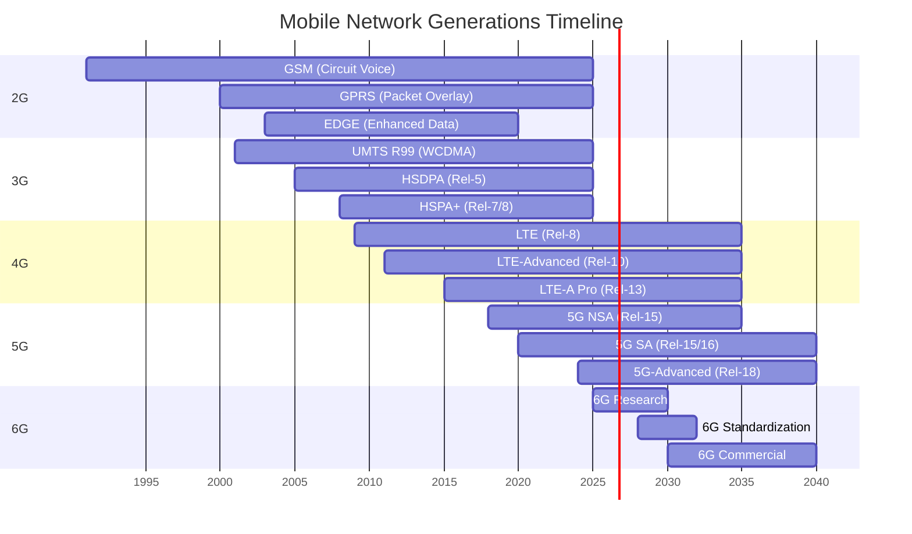
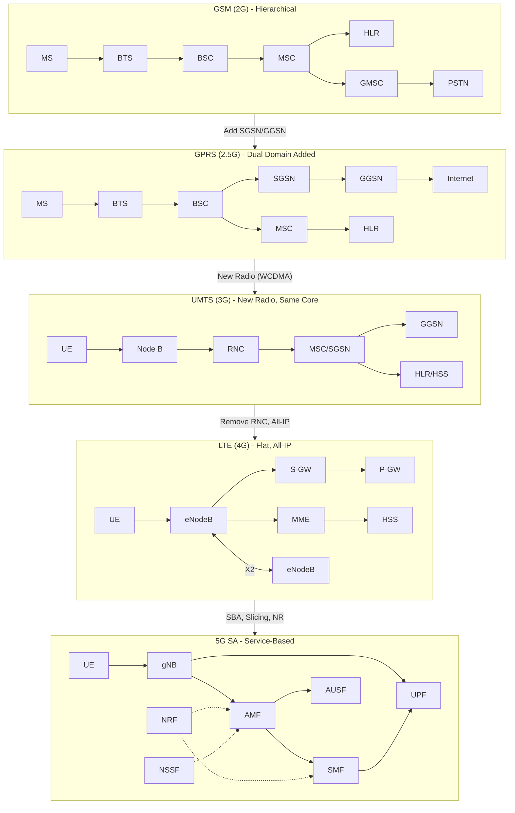

# Module 25: Network Evolution — Grand Synthesis

## Advanced Communication Networks Course

---

## 1. Introduction

This module provides a **comprehensive synthesis** of mobile network evolution from 1G analog systems through 5G and beyond. It serves as a master reference connecting all previous modules, showing how each generation solved specific problems while creating new challenges that motivated the next evolution.

The evolution follows a clear trajectory:
- **Voice → Data → Everything**
- **Circuit → Packet → All-IP → Service-Based**
- **Hierarchical → Flat → Cloud-Native**
- **One-size-fits-all → Network Slicing → AI-Native**

---

## 2. Master Comparison Table

| Parameter | GSM (2G) | GPRS (2.5G) | EDGE (2.75G) | UMTS (3G) | HSPA (3.5G) | LTE (4G) | LTE-Advanced (4G+) | 5G NSA | 5G SA | 5G Core (SBA) | 6G (Future) |
|-----------|-----------|-------------|--------------|-----------|-------------|-----------|-------------------|--------|-------|----------------|-------------|
| **3GPP Release** | Rel-96/97 | Rel-97/98 | Rel-99 | Rel-99/4 | Rel-5/6/7 | Rel-8/9 | Rel-10/11/12 | Rel-15 | Rel-15/16 | Rel-15/16/17 | Rel-20+ |
| **Year** | 1991 | 2000 | 2003 | 2001 | 2005-2008 | 2009 | 2011-2014 | 2018 | 2020 | 2020-2022 | ~2030 |
| **Radio Access** | TDMA/FDMA | TDMA/FDMA | TDMA/FDMA (8PSK) | WCDMA | WCDMA + AMC | OFDMA/SC-FDMA | OFDMA + CA + MIMO | NR + LTE | NR (standalone) | NR | Sub-THz, RIS, AI |
| **Core Network** | NSS (MSC/HLR/VLR) | NSS + SGSN/GGSN | NSS + SGSN/GGSN | CS + PS Core | CS + PS Core | EPC (MME/SGW/PGW) | EPC Enhanced | EPC + NGC partial | 5GC (AMF/SMF/UPF) | 5GC SBA (NFs) | 6G Core (AI-native) |
| **Switching Type** | Circuit-Switched | CS + Packet-Switched | CS + PS | CS + PS | CS + PS (HSPA=PS) | All-IP (Packet) | All-IP | All-IP | All-IP | All-IP + SBA | All-IP + Compute |
| **Peak DL Rate** | 9.6 kbps | 171.2 kbps | 473.6 kbps | 2 Mbps | 42 Mbps (HSPA+) | 300 Mbps | 3 Gbps | 2-4 Gbps | 20 Gbps | 20 Gbps | 1 Tbps |
| **Typical Latency** | 500 ms | 300-600 ms | 200-400 ms | 100-200 ms | 50-100 ms | 10-30 ms | 10-20 ms | 4-10 ms | 1-4 ms | 1-4 ms | <0.1 ms |
| **Mobility Mechanism** | Handover (hard) | Cell reselection + HO | Cell reselection + HO | Soft handover | Soft/Hard HO | X2 handover (hard) | X2/S1 handover + CoMP | Dual connectivity | Xn handover | Xn + SBI mobility | Predictive AI HO |
| **Signaling Protocol** | MAP/BSSAP | MAP/BSSGP | MAP/BSSGP | RANAP/MAP | RANAP/MAP | S1AP/GTP-C | S1AP/GTP-C v2 | X2AP + S1AP + NG-AP | NGAP | HTTP/2 + SBI | AI-native signaling |
| **User Plane Protocol** | PCM (64 kbps) | LLC/SNDCP/GTP-U | LLC/SNDCP/GTP-U | GTP-U/PDCP | GTP-U/PDCP/MAC | GTP-U/PDCP/RLC | GTP-U/PDCP/RLC | GTP-U (dual pipe) | GTP-U/SDAP | GTP-U/SDAP | Semantic comms |
| **Control Plane Protocol** | SS7/ISUP/MAP | SS7 + GTP-C | SS7 + GTP-C | SS7 + GTP-C | SS7 + GTP-C | Diameter/GTP-C | Diameter/GTP-C | GTP-C + NGAP | NGAP/NAS 5G | SBI (HTTP/2) | Intent-based |
| **Main Innovation** | Digital voice, roaming | Always-on packet data | Higher modulation (8PSK) | Wideband data (5 MHz) | Fast scheduling, AMC | All-IP, flat arch, OFDM | Carrier Aggregation, 8×8 MIMO | NR radio with LTE anchor | Independent 5G, slicing | Service-Based Architecture | AI-native, sensing |
| **Main Limitation** | No data, low capacity | Slow data, shared TDMA | Still TDMA-limited | High latency, complex RNC | Still CS voice, complex | No native IoT, limited MIMO | Spectrum fragmentation | Depends on 4G core | Coverage gaps (mmWave) | Complexity, energy | Undefined standards |
| **Subscribers (approx.)** | 1B (2003) | 1.5B (2005) | 2B (2006) | 2B (2007) | 3B (2012) | 4B (2018) | 5B (2020) | 1B (2022) | 500M (2023) | 1B+ (2024) | TBD (~2030+) |


---

## 3. Generation-by-Generation Analysis

### 3.1 GSM (2G) — Digital Voice Revolution (1991)

**Problem Solved:** GSM replaced analog 1G systems (AMPS, TACS) with digital transmission, providing encryption, international roaming via SIM cards, and efficient spectrum use through TDMA. For the first time, a subscriber could travel across Europe and make calls with the same phone and number. The GSM MAP protocol enabled global mobility management, and the hierarchical NSS architecture (MSC/VLR/HLR/AuC) became the template for mobile networks.

**What it couldn't do:** GSM was fundamentally circuit-switched — a dedicated timeslot was allocated for the entire call duration regardless of actual data flow. Data services (CSD) were limited to 9.6 kbps, making internet access impractical. As the internet exploded in the late 1990s, operators needed packet-switched data without replacing their entire GSM infrastructure.

### 3.2 GPRS (2.5G) — Packet Data Overlay (2000)

**Problem Solved:** GPRS introduced packet-switching as an **overlay** on the existing GSM radio and core network. By adding SGSN and GGSN nodes, operators could offer "always-on" internet connectivity where users shared radio resources and were charged by data volume rather than connection time. GPRS introduced the PDP Context concept, IP addressing for mobile devices, and GTP tunneling — concepts that persist through 5G.

**What it couldn't do:** GPRS reused GSM's TDMA radio interface, sharing timeslots that were still primarily allocated for voice. Theoretical peak of 171.2 kbps was rarely achieved (typical: 30-50 kbps). Latency remained high (300-600 ms) due to the TDMA frame structure. The radio interface was the bottleneck — you couldn't fix it without changing the air interface technology.

### 3.3 EDGE (2.75G) — Enhanced Data on GSM (2003)

**Problem Solved:** EDGE introduced 8PSK modulation (vs. GMSK in GSM/GPRS), tripling the bits per symbol from 1 to 3. With adaptive modulation and coding (9 MCS schemes), EDGE could deliver up to 473.6 kbps theoretical peak. It was a pure software/transceiver upgrade requiring no new infrastructure, giving operators a cost-effective capacity boost while they planned 3G deployments.

**What it couldn't do:** EDGE was still constrained by the 200 kHz GSM carrier bandwidth and TDMA structure. Real-world speeds of 100-200 kbps couldn't support video streaming or rich web applications. The fundamental limitation was the narrow-band radio interface — achieving true mobile broadband required a completely new wideband radio technology.

### 3.4 UMTS (3G) — Wideband Mobile Broadband (2001)

**Problem Solved:** UMTS introduced WCDMA with 5 MHz carriers, providing up to 2 Mbps peak data rates. The spread-spectrum approach offered better spectral efficiency, soft handover for improved cell-edge performance, and native support for simultaneous voice and data. The UTRAN architecture (Node B + RNC) provided centralized radio resource management, and the combined CS+PS core supported both circuit voice and packet data.

**What it couldn't do:** The RNC was a bottleneck and single point of failure. Latency remained high (100-200 ms round-trip) due to the complex protocol stack. The dedicated channel approach was inefficient for bursty data traffic. Voice still used circuit-switching, maintaining dual-domain complexity. The fixed spreading factor limited adaptation to varying channel conditions.

### 3.5 HSPA (3.5G) — High-Speed Packet Access (2005-2008)

**Problem Solved:** HSPA (HSDPA + HSUPA) introduced shared channels, fast scheduling at the Node B (2ms TTI), Adaptive Modulation and Coding (AMC), and HARQ — moving intelligence from the RNC to the base station. HSDPA delivered up to 14.4 Mbps (Rel-5), later HSPA+ reached 42 Mbps with 64-QAM and MIMO. This made mobile video streaming and app stores viable, launching the smartphone era.

**What it couldn't do:** HSPA was still built on WCDMA's 5 MHz carrier, limiting peak rates. Voice remained circuit-switched (except VoIP experiments). The RNC still existed, adding latency and cost. The architecture couldn't scale efficiently — each RNC managed hundreds of Node Bs, creating capacity planning challenges. Operators needed a clean-slate design.

### 3.6 LTE (4G) — All-IP Flat Architecture (2009)

**Problem Solved:** LTE made a revolutionary break: all-IP from day one (no circuit-switching), OFDMA for downlink (eliminating inter-cell interference issues), flat architecture (removed the RNC, eNodeB connects directly to EPC), and the Evolved Packet Core (MME/S-GW/P-GW separation). With 20 MHz bandwidth and 2×2 MIMO, LTE delivered 150-300 Mbps peak. VoLTE replaced circuit-switched voice. The X2 interface enabled direct inter-eNodeB handovers without core involvement.

**What it couldn't do:** LTE lacked native support for massive IoT (NB-IoT came later in Rel-13), couldn't achieve sub-millisecond latency for industrial applications, had limited MIMO (max 8 layers), and the EPC's GTP-based point-to-point interfaces couldn't scale for the cloud-native era. Network slicing wasn't possible with monolithic EPC nodes.

### 3.7 LTE-Advanced (4G+) — Carrier Aggregation Era (2011-2014)

**Problem Solved:** LTE-Advanced introduced Carrier Aggregation (combining up to 5×20 MHz = 100 MHz), 8×8 MIMO (8 layers DL), enhanced inter-cell interference coordination (eICIC/FeICIC), relay nodes, and Coordinated Multi-Point (CoMP). Peak rates reached 3 Gbps (Rel-12). Heterogeneous Networks (HetNets) with small cells addressed capacity in dense areas. LAA (Licensed Assisted Access) added unlicensed spectrum.

**What it couldn't do:** LTE-A was an evolution, not revolution — it couldn't fundamentally change the frame structure for ultra-low latency, couldn't use mmWave spectrum, and the EPC remained monolithic. Supporting diverse verticals (automotive, industry, healthcare) with one network configuration was impossible. The industry needed a new radio AND a new core.

### 3.8 5G NSA — Non-Standalone (2018)

**Problem Solved:** 5G NSA (Option 3/3a/3x) deployed NR (New Radio) using the existing LTE core (EPC) as an anchor. This allowed operators to launch 5G services quickly without building an entirely new core network. Dual Connectivity (EN-DC) combined LTE and NR carriers, delivering multi-Gbps throughput using mmWave and sub-6 GHz NR spectrum while maintaining LTE for control plane and voice (VoLTE).

**What it couldn't do:** 5G NSA couldn't deliver the full 5G promise: no network slicing (EPC doesn't support it), no ultra-reliable low-latency (URLLC requires 5GC), no Service-Based Architecture, and the LTE anchor added latency. It was a "5G radio with 4G brain" — a necessary stepping stone, not the destination.

### 3.9 5G SA — Standalone (2020)

**Problem Solved:** 5G SA deployed NR with the 5G Core (5GC), eliminating LTE dependency. This enabled network slicing (isolated virtual networks per use case), URLLC with 1ms latency, native support for massive IoT (mMTC), edge computing (MEC) integration, and the Service-Based Architecture. The AMF/SMF/UPF separation allowed independent scaling, and the SBI (HTTP/2, JSON) enabled cloud-native deployments.

**What it couldn't do:** mmWave coverage remains limited (short range, blockage-sensitive), energy consumption is significantly higher than 4G, the complexity of managing network slices across operators is unsolved, and true deterministic latency for industrial automation requires further enhancements. Migration from NSA to SA requires significant investment with uncertain near-term ROI.

### 3.10 5G Core — Service-Based Architecture (2020-2022)

**Problem Solved:** The 5G Core replaced point-to-point interfaces with a Service-Based Architecture where Network Functions (NFs) expose services via RESTful APIs (HTTP/2). NRF enables service discovery, NSSF manages slice selection, PCF provides policy, and UDM unifies subscriber data. Cloud-native principles (microservices, stateless design, containerization) enable elastic scaling, multi-vendor interoperability, and rapid feature deployment.

**What it couldn't do:** SBA complexity challenges smaller operators. Inter-PLMN roaming with SBA (SEPP) is still maturing. Energy efficiency of distributed cloud infrastructure is a concern. True end-to-end automation (zero-touch provisioning) requires AI/ML integration that's still evolving. The architecture is ready for 6G evolution but needs AI-native capabilities built in from the ground up.

### 3.11 6G (Future) — AI-Native Networks (~2030)

**Problem Solved (Expected):** 6G aims to deliver 1 Tbps peak rates using sub-THz frequencies (100 GHz–3 THz), sub-0.1 ms latency, integrated sensing and communication (ISAC), AI-native air interface and network management, Reconfigurable Intelligent Surfaces (RIS) for programmable propagation, non-terrestrial networks (NTN) integration for global coverage, and semantic/goal-oriented communications that transmit meaning rather than bits.

**What it couldn't do (Anticipated challenges):** Sub-THz propagation is extremely limited (meters to tens of meters), requiring ultra-dense deployments. Energy efficiency at these frequencies is poor. Standardization of AI-native protocols is unprecedented. Privacy concerns with pervasive sensing. Regulatory frameworks for sub-THz spectrum allocation are undefined. Commercial viability for many proposed features remains unproven.


---

## 4. Timeline Diagram



---

## 5. Architecture Evolution Diagram



### Architecture Element Evolution Map

| 2G Element | 3G Equivalent | 4G Equivalent | 5G Equivalent | Evolution Pattern |
|------------|---------------|---------------|---------------|-------------------|
| BTS | Node B | eNodeB | gNB | More intelligence pushed to edge |
| BSC | RNC | — (removed) | — | Eliminated (functions in eNB/gNB) |
| MSC | MSC Server | MME | AMF | Control plane separated from user plane |
| HLR | HSS | HSS | UDM/UDR | Unified data management |
| GMSC | GMSC | — | — | Eliminated (all-IP, no PSTN gateway needed) |
| VLR | VLR | MME (integrated) | AMF (stateless) | From stateful to stateless |
| SGSN | SGSN | S-GW (partial) | SMF+UPF | Split into control + user plane |
| GGSN | GGSN | P-GW | UPF | Pure user plane forwarding |
| — | — | PCRF | PCF | Policy and charging |
| — | — | — | NRF | Service discovery (new in 5G) |
| — | — | — | NSSF | Slice selection (new in 5G) |


---

## 6. Data Rate Evolution Graph (Exponential Growth)

```
Peak Downlink Data Rate (logarithmic scale)
│
1 Tbps    │                                                              ★ 6G
          │
100 Gbps  │
          │                                              ████████████
20 Gbps   │                                              █ 5G SA/NR █
          │                                              ████████████
          │
3 Gbps    │                                    ██████████
          │                                    █ LTE-A  █
          │                                    ██████████
300 Mbps  │                           ██████████
          │                           █  LTE   █
          │                           ██████████
42 Mbps   │                  ██████████
          │                  █  HSPA+ █
          │                  ██████████
14 Mbps   │            ██████████
          │            █ HSDPA  █
          │            ██████████
2 Mbps    │      ██████████
          │      █  UMTS  █
          │      ██████████
473 kbps  │   ████████
          │   █ EDGE █
          │   ████████
171 kbps  │  ██████
          │  █GPRS█
          │  ██████
9.6 kbps  │████
          │█GSM█
          │████
          └──────────────────────────────────────────────────────────────────►
           1991   1995   2000   2003   2005   2009   2011   2018   2020   2030
                                      Year

Growth Pattern: ~10x every 5 years (1000x per decade)
──────────────────────────────────────────────────────
GSM → GPRS:     18x  improvement (9.6k → 171k)
GPRS → EDGE:    2.8x improvement (171k → 473k)  
EDGE → UMTS:    4.2x improvement (473k → 2M)
UMTS → HSPA:    21x  improvement (2M → 42M)
HSPA → LTE:     7x   improvement (42M → 300M)
LTE → LTE-A:    10x  improvement (300M → 3G)
LTE-A → 5G:     6.7x improvement (3G → 20G)
5G → 6G:        50x  improvement (20G → 1T)
```

---

## 7. Key Lessons Learned from Each Transition

### 7.1 GSM → GPRS: Overlay Packet on Circuit

| Aspect | Lesson |
|--------|--------|
| **Strategy** | You don't need to replace everything — overlay new capability on existing infrastructure |
| **Architecture** | Added SGSN/GGSN alongside MSC without disrupting voice service |
| **Risk Management** | Incremental deployment: operators could add packet capability node by node |
| **Trade-off** | Shared radio resources meant neither voice nor data was optimal |
| **Legacy Impact** | GTP tunneling protocol invented here persists through 5G |
| **Key Principle** | **"Evolution over revolution when the installed base is massive"** |

### 7.2 GPRS → UMTS: New Radio, Keep Core

| Aspect | Lesson |
|--------|--------|
| **Strategy** | When the radio is the bottleneck, change the radio but keep the proven core |
| **Architecture** | WCDMA replaced TDMA, but SGSN/GGSN/HLR remained largely unchanged |
| **Risk Management** | Operators could run 2G and 3G simultaneously with shared core |
| **Trade-off** | New spectrum required (2100 MHz band) — massive licensing costs |
| **Legacy Impact** | RNC architecture created a new bottleneck that took a decade to remove |
| **Key Principle** | **"Change one major subsystem at a time to manage risk"** |

### 7.3 UMTS → LTE: Flatten, All-IP, Remove RNC

| Aspect | Lesson |
|--------|--------|
| **Strategy** | Sometimes you must break backward compatibility for fundamental improvement |
| **Architecture** | Eliminated RNC (functions distributed to eNodeB), all-IP (eliminated circuit-switching) |
| **Risk Management** | VoLTE took years to mature — interim CSFB to 2G/3G for voice |
| **Trade-off** | Clean-slate design required parallel networks for many years |
| **Legacy Impact** | Flat architecture proved far more scalable and cost-effective |
| **Key Principle** | **"Flatten the hierarchy — push intelligence to the edge, simplify the core"** |

### 7.4 LTE → LTE-Advanced: Carrier Aggregation, More MIMO

| Aspect | Lesson |
|--------|--------|
| **Strategy** | Combine existing resources more cleverly before seeking new ones |
| **Architecture** | CA bonds fragmented spectrum; MIMO multiplies spatial capacity |
| **Risk Management** | Backward compatible — LTE devices work alongside LTE-A |
| **Trade-off** | Complexity in scheduler and UE increases significantly |
| **Legacy Impact** | Established that spectrum aggregation is key to capacity scaling |
| **Key Principle** | **"Maximize what you have through intelligent combination before building new"** |

### 7.5 LTE → 5G: New Radio + New Core, Slicing, SBA

| Aspect | Lesson |
|--------|--------|
| **Strategy** | When requirements diverge (eMBB vs. URLLC vs. mMTC), one configuration cannot serve all |
| **Architecture** | NR provides flexible numerology; 5GC SBA enables per-slice customization |
| **Risk Management** | NSA deployment (Option 3x) as stepping stone before SA |
| **Trade-off** | Enormous complexity; operators must justify ROI for diverse verticals |
| **Legacy Impact** | SBA and cloud-native principles prepare for continuous software evolution |
| **Key Principle** | **"Design for diversity — network slicing lets one physical network serve many purposes"** |

### 7.6 5G → 6G: AI-Native, Sensing, Sub-THz

| Aspect | Lesson |
|--------|--------|
| **Strategy** | The network itself becomes intelligent — AI is not an add-on but a fundamental design principle |
| **Architecture** | Digital twin of the network, predictive resource management, semantic communications |
| **Risk Management** | Research phase allows exploration of feasibility before standardization |
| **Trade-off** | Sub-THz range is extremely limited; cost of ultra-dense deployment is unknown |
| **Legacy Impact** | May redefine what "communication" means (sensing + computing + communicating) |
| **Key Principle** | **"Converge communication, computation, and sensing into a unified intelligent fabric"** |

---

## 8. Summary of Evolutionary Patterns

### Pattern 1: Alternating Radio and Core Innovation
```
Gen:    2G    2.5G    3G    3.5G    4G      4G+     5G
Focus: Radio  Core   Radio  Radio  Both    Radio   Both
        ↑      ↑      ↑      ↑      ↑       ↑      ↑
       TDMA   SGSN   WCDMA  HSPA  OFDMA    CA    NR+SBA
```

### Pattern 2: Complexity Cycle
```
Simple → Complex → Simplified → Complex again

GSM (simple) → UMTS+RNC (complex) → LTE flat (simple) → 5G slicing (complex)
```

### Pattern 3: Control/User Plane Separation Timeline
```
2G:  MSC handles both → inefficient
3G:  MSC-Server + MGW split (Rel-4) → partial CUPS
4G:  MME (CP) + S-GW/P-GW (UP) → architectural CUPS
5G:  AMF/SMF (CP) + UPF (UP) → complete CUPS
```

### Pattern 4: Where Intelligence Resides
```
2G:  BSC/MSC (centralized)
3G:  RNC (centralized)
4G:  eNodeB (distributed to edge)
5G:  gNB + Edge Computing (distributed + edge cloud)
6G:  Everywhere (AI at every layer)
```

---

## 9. Exam Preparation Quick Reference

### Must-Know Facts per Generation

| Gen | Remember This |
|-----|--------------|
| GSM | TDMA, 200 kHz carrier, 8 timeslots, circuit-switched, MAP/SS7, HLR/VLR/MSC |
| GPRS | Added SGSN+GGSN, PDP Context, GTP tunnel, packet overlay on CS |
| EDGE | 8PSK modulation (3 bits/symbol vs 1), 9 MCS schemes, software upgrade |
| UMTS | WCDMA, 5 MHz, spreading codes, RNC, soft handover, Rake receiver |
| HSPA | Shared channel, 2ms TTI, AMC, HARQ, fast scheduling at Node B |
| LTE | OFDMA, flat (no RNC), all-IP, EPC (MME/SGW/PGW), X2 interface |
| LTE-A | CA (5×20 MHz), 8×8 MIMO, CoMP, HetNets, Relay |
| 5G NSA | EN-DC, LTE anchor, NR secondary, Option 3x, EPC core |
| 5G SA | AMF/SMF/UPF, NGAP, network slicing, URLLC, mMTC |
| 5GC | SBA, HTTP/2, NRF discovery, NSSF, stateless NFs, cloud-native |
| 6G | Sub-THz, RIS, AI-native, ISAC, semantic comms, 1 Tbps |

### Key Protocol Stack Evolution

```
        2G              3G              4G              5G
┌──────────────┐ ┌──────────────┐ ┌──────────────┐ ┌──────────────┐
│     App      │ │     App      │ │     App      │ │     App      │
├──────────────┤ ├──────────────┤ ├──────────────┤ ├──────────────┤
│    TCP/IP    │ │    TCP/IP    │ │    TCP/IP    │ │    TCP/IP    │
├──────────────┤ ├──────────────┤ ├──────────────┤ ├──────────────┤
│   SNDCP/LLC │ │     PDCP     │ │     PDCP     │ │  SDAP/PDCP   │
├──────────────┤ ├──────────────┤ ├──────────────┤ ├──────────────┤
│     RLC      │ │     RLC      │ │     RLC      │ │     RLC      │
├──────────────┤ ├──────────────┤ ├──────────────┤ ├──────────────┤
│     MAC      │ │     MAC      │ │     MAC      │ │     MAC      │
├──────────────┤ ├──────────────┤ ├──────────────┤ ├──────────────┤
│  GSM PHY    │ │  WCDMA PHY   │ │  OFDMA PHY   │ │   NR PHY     │
│  (TDMA)     │ │  (CDMA)      │ │              │ │  (flex num.) │
└──────────────┘ └──────────────┘ └──────────────┘ └──────────────┘
```

### Critical Comparison: 4G EPC vs 5G Core

| Feature | 4G EPC | 5G Core |
|---------|--------|---------|
| Interface type | Point-to-point (GTP-C, Diameter) | Service-Based (HTTP/2 REST) |
| Discovery | Static configuration | NRF dynamic discovery |
| Scaling | Vertical (bigger boxes) | Horizontal (more instances) |
| Deployment | Appliance-based | Cloud-native (containers, K8s) |
| Slicing | Not supported | Native (NSSF, per-slice NFs) |
| State | Stateful nodes | Stateless NFs + external state (UDSF) |
| Mobility anchor | GTP tunnel (S-GW) | UPF (can be distributed) |
| Policy | PCRF (Diameter) | PCF (SBI) |
| Subscriber data | HSS (Diameter) | UDM/UDR (SBI) |
| Authentication | MME + HSS (EAP-AKA) | AUSF + UDM (5G-AKA, EAP) |

---

## 10. Conclusion

The evolution from GSM to 6G represents one of the most remarkable engineering journeys in history — from 9.6 kbps voice calls to terabit-per-second intelligent networks in four decades. Each generation solved the previous generation's limitations while introducing new complexity that demanded the next evolution.

**The three constants across all generations:**
1. **Demand always exceeds supply** — users always find ways to consume available capacity
2. **Simplification follows complexity** — every overly complex architecture is eventually flattened
3. **The boundary between network and computing blurs** — from dumb pipes to intelligent platforms

Understanding this evolution is not just historical knowledge — it teaches us how to evaluate future technologies, predict architectural decisions, and design systems that can gracefully evolve.

---

*Module 25 — Network Evolution Grand Synthesis*  
*Advanced Communication Networks Course*  
*Last updated: August 2026*
