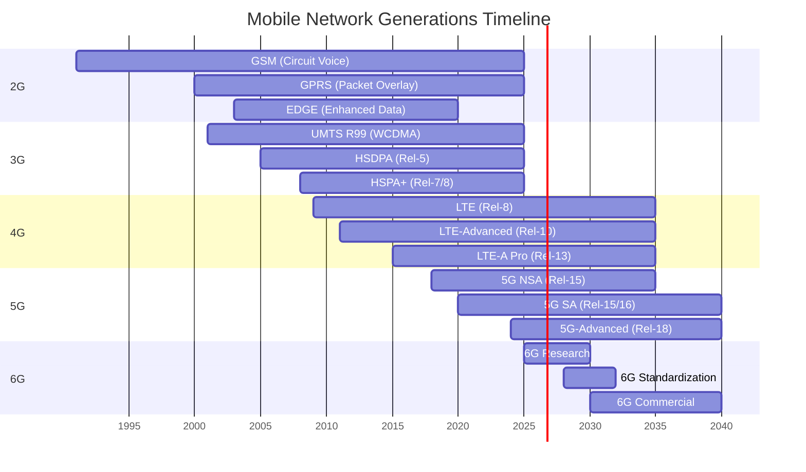
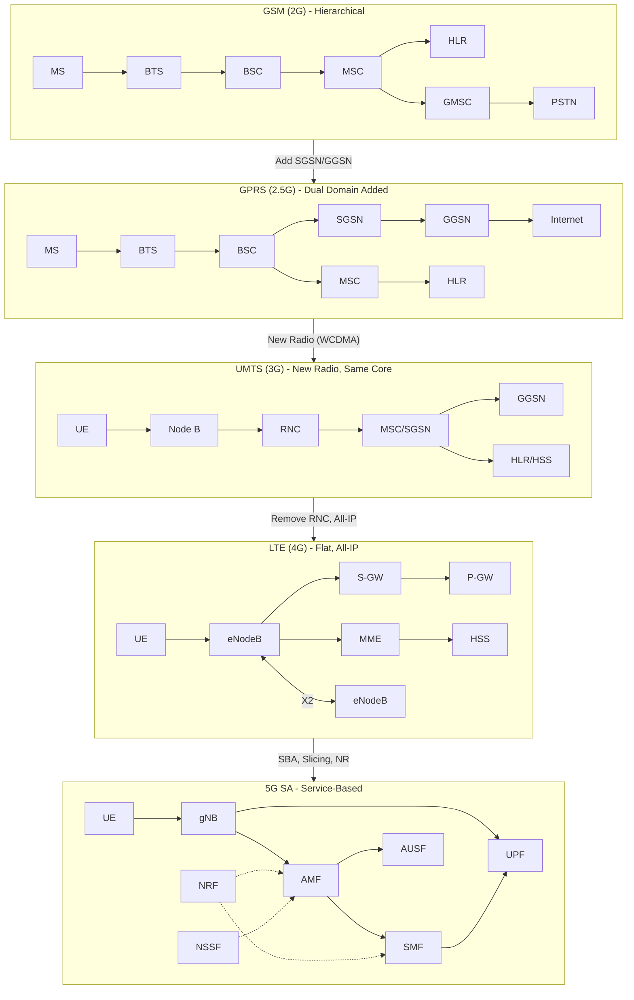

# ماژول 25: تحول شبکه — ترکیب جامع

## درس شبکه‌های ارتباطی پیشرفته

---

## 1. مقدمه

این ماژول یک **ترکیب جامع** از تحول شبکه موبایل از سیستم‌های آنالوگ 1G تا 5G و فراتر از آن فراهم می‌کند. این ماژول به‌عنوان یک مرجع اصلی عمل می‌کند که تمام ماژول‌های قبلی را به هم متصل می‌کند و نشان می‌دهد چگونه هر نسل مسائل مشخصی را حل کرد در حالی که چالش‌های جدیدی ایجاد کرد که انگیزه تحول بعدی شد.

تحول یک مسیر روشن را دنبال می‌کند:
- **صدا ← داده ← همه چیز**
- **مدار ← بسته ← تمام-IP ← خدمات‌محور**
- **سلسله‌مراتبی ← مسطح ← بومی-ابر**
- **یک‌اندازه-برای-همه ← شبکه‌بندی ← بومی-AI**

---

## 2. جدول مقایسه اصلی

| پارامتر | GSM (2G) | GPRS (2.5G) | EDGE (2.75G) | UMTS (3G) | HSPA (3.5G) | LTE (4G) | LTE-Advanced (4G+) | 5G NSA | 5G SA | هسته 5G (SBA) | 6G (آینده) |
|-----------|-----------|-------------|--------------|-----------|-------------|-----------|-------------------|--------|-------|----------------|-------------|
| **نسخه 3GPP** | Rel-96/97 | Rel-97/98 | Rel-99 | Rel-99/4 | Rel-5/6/7 | Rel-8/9 | Rel-10/11/12 | Rel-15 | Rel-15/16 | Rel-15/16/17 | Rel-20+ |
| **سال** | 1991 | 2000 | 2003 | 2001 | 2005-2008 | 2009 | 2011-2014 | 2018 | 2020 | 2020-2022 | حدود 2030 |
| **دسترسی رادیویی** | TDMA/FDMA | TDMA/FDMA | TDMA/FDMA (8PSK) | WCDMA | WCDMA + AMC | OFDMA/SC-FDMA | OFDMA + CA + MIMO | NR + LTE | NR (مستقل) | NR | Sub-THz، RIS، AI |
| **شبکه هسته** | NSS (MSC/HLR/VLR) | NSS + SGSN/GGSN | NSS + SGSN/GGSN | هسته CS + PS | هسته CS + PS | EPC (MME/SGW/PGW) | EPC بهبودیافته | EPC + NGC جزئی | 5GC (AMF/SMF/UPF) | 5GC SBA (NFها) | هسته 6G (بومی-AI) |
| **نوع سوئیچینگ** | مدار-گزارشی | CS + بسته-گزارشی | CS + PS | CS + PS | CS + PS (HSPA=PS) | تمام-IP (بسته) | تمام-IP | تمام-IP | تمام-IP | تمام-IP + SBA | تمام-IP + رایانش |
| **حداکثر نرخ DL** | 9.6 kbps | 171.2 kbps | 473.6 kbps | 2 Mbps | 42 Mbps (HSPA+) | 300 Mbps | 3 Gbps | 2-4 Gbps | 20 Gbps | 20 Gbps | 1 Tbps |
| **تأخیر معمول** | 500 ms | 300-600 ms | 200-400 ms | 100-200 ms | 50-100 ms | 10-30 ms | 10-20 ms | 4-10 ms | 1-4 ms | 1-4 ms | کمتر از 0.1 ms |
| **سازوکار تحرک** | تحویل (سخت) | انتخاب مجدد سلول + تحویل | انتخاب مجدد سلول + تحویل | تحویل نرم | تحویل نرم/سخت | تحویل X2 (سخت) | تحویل X2/S1 + CoMP | اتصال دوگانه | تحویل Xn | تحویل Xn + تحرک SBI | تحویل پیش‌بینانه AI |
| **پروتکل سیگنالینگ** | MAP/BSSAP | MAP/BSSGP | MAP/BSSGP | RANAP/MAP | RANAP/MAP | S1AP/GTP-C | S1AP/GTP-C v2 | X2AP + S1AP + NG-AP | NGAP | HTTP/2 + SBI | سیگنالینگ بومی-AI |
| **پروتکل صفحه کاربر** | PCM (64 kbps) | LLC/SNDCP/GTP-U | LLC/SNDCP/GTP-U | GTP-U/PDCP | GTP-U/PDCP/MAC | GTP-U/PDCP/RLC | GTP-U/PDCP/RLC | GTP-U (لوله دوگانه) | GTP-U/SDAP | GTP-U/SDAP | ارتباطات معنایی |
| **پروتکل صفحه کنترل** | SS7/ISUP/MAP | SS7 + GTP-C | SS7 + GTP-C | SS7 + GTP-C | SS7 + GTP-C | Diameter/GTP-C | Diameter/GTP-C | GTP-C + NGAP | NGAP/NAS 5G | SBI (HTTP/2) | مبتنی بر قصد |
| **نوآوری اصلی** | صدای دیجیتال، رومینگ | داده بسته همیشه-فعال | مدولاسیون بالاتر (8PSK) | داده پهن‌باند (5 MHz) | زمان‌بندی سریع، AMC | تمام-IP، معماری مسطح، OFDM | تجمیع حامل، MIMO 8×8 | رادیو NR با لنگر LTE | 5G مستقل، شبکه‌بندی | معماری خدمات‌محور | بومی-AI، سنجش |
| **محدودیت اصلی** | بدون داده، ظرفیت کم | داده کند، TDMA مشترک | همچنان محدود به TDMA | تأخیر بالا، RNC پیچیده | همچنان صدای CS، پیچیده | بدون IoT بومی، MIMO محدود | قطعه‌بندی طیف | وابسته به هسته 4G | شکاف‌های پوشش (mmWave) | پیچیدگی، انرژی | استانداردهای تعریف‌نشده |
| **مشترکین (تقریبی)** | 1B (2003) | 1.5B (2005) | 2B (2006) | 2B (2007) | 3B (2012) | 4B (2018) | 5B (2020) | 1B (2022) | 500M (2023) | بیش از 1B (2024) | TBD (حدود 2030+) |


---

## 3. تحلیل نسل-به-نسل

### 3.1 GSM (2G) — انقلاب صدای دیجیتال (1991)

**مسئله حل‌شده:** GSM سیستم‌های آنالوگ 1G (AMPS، TACS) را با انتقال دیجیتال جایگزین کرد و رمزنگاری، رومینگ بین‌المللی از طریق کارت‌های SIM و استفاده کارآمد از طیف از طریق TDMA را فراهم کرد. برای اولین بار، یک مشترک می‌توانست در سراسر اروپا سفر کند و با همان تلفن و شماره تماس بگیرد. پروتکل GSM MAP مدیریت تحرک جهانی را ممکن ساخت و معماری سلسله‌مراتبی NSS (MSC/VLR/HLR/AuC) به الگویی برای شبکه‌های موبایل تبدیل شد.

**آنچه نمی‌توانست انجام دهد:** GSM اساساً مدار-گزارشی بود — یک شکاف زمانی اختصاصی برای کل مدت تماس بدون توجه به جریان واقعی داده تخصیص می‌یافت. خدمات داده (CSD) به 9.6 kbps محدود بود و دسترسی به اینترنت را غیرعملی می‌کرد. با انفجار اینترنت در اواخر دهه 1990، اپراتورها به داده بسته-گزارشی بدون جایگزینی کل زیرساخت GSM خود نیاز داشتند.

### 3.2 GPRS (2.5G) — لایه داده بسته (2000)

**مسئله حل‌شده:** GPRS بسته-گزارشی را به‌عنوان یک **لایه رویی** بر رادیو و شبکه هسته موجود GSM معرفی کرد. با افزودن گره‌های SGSN و GGSN، اپراتورها می‌توانستند اتصال اینترنت «همیشه-فعال» ارائه دهند که در آن کاربران منابع رادیویی را به اشتراک می‌گذاشتند و بر اساس حجم داده به‌جای زمان اتصال صورت‌حساب می‌شدند. GPRS مفهوم زمینه PDP، آدرس‌دهی IP برای دستگاه‌های موبایل و تونل‌سازی GTP را معرفی کرد — مفاهیمی که تا 5G باقی مانده‌اند.

**آنچه نمی‌توانست انجام دهد:** GPRS از واسط رادیویی TDMA در GSM استفاده مجدد کرد و شکاف‌های زمانی را به اشتراک می‌گذاشت که همچنان عمدتاً برای صدا تخصیص می‌یافتند. اوج نظری 171.2 kbps به‌ندرت به دست می‌آمد (معمول: 30-50 kbps). تأخیر به دلیل ساختار فریم TDMA بالا می‌ماند (300-600 ms). واسط رادیویی گلوگاه بود — بدون تغییر فناوری واسط رادیویی نمی‌شد آن را رفع کرد.

### 3.3 EDGE (2.75G) — داده بهبودیافته روی GSM (2003)

**مسئله حل‌شده:** EDGE مدولاسیون 8PSK را معرفی کرد (در برابر GMSK در GSM/GPRS) و بیت در هر نماد را از 1 به 3 سه برابر کرد. با مدولاسیون و کدگذاری تطبیقی (9 طرح MCS)، EDGE می‌توانست تا اوج نظری 473.6 kbps ارائه دهد. این یک ارتقای صرفاً نرم‌افزاری/فرستنده-گیرنده بود که نیازی به زیرساخت جدید نداشت و به اپراتورها افزایش ظرفیت مقرون‌به‌صرفه می‌داد در حالی که استقرارهای 3G خود را برنامه‌ریزی می‌کردند.

**آنچه نمی‌توانست انجام دهد:** EDGE همچنان به پهنای باند حامل 200 kHz در GSM و ساختار TDMA محدود بود. سرعت‌های دنیای واقعی 100-200 kbps نمی‌توانست از پخش جریانی ویدیو یا کاربردهای وب غنی پشتیبانی کند. محدودیت بنیادی واسط رادیویی باریک-باند بود — دستیابی به پهن‌باند موبایل واقعی نیازمند فناوری رادیویی پهن‌باند کاملاً جدید بود.

### 3.4 UMTS (3G) — پهن‌باند موبایل (2001)

**مسئله حل‌شده:** UMTS فناوری WCDMA را با حامل‌های 5 MHz معرفی کرد و نرخ داده اوج تا 2 Mbps فراهم کرد. رویکرد طیف-گسترده کارایی طیفی بهتر، تحویل نرم برای عملکرد بهبودیافته لبه سلول و پشتیبانی بومی از صدا و داده همزمان ارائه می‌کرد. معماری UTRAN (Node B + RNC) مدیریت منابع رادیویی متمرکز فراهم می‌کرد و هسته ترکیبی CS+PS هم از صدای مدار-گزارشی و هم داده بسته پشتیبانی می‌کرد.

**آنچه نمی‌توانست انجام دهد:** RNC یک گلوگاه و نقطه شکست واحد بود. تأخیر به دلیل پشته پروتکل پیچیده بالا می‌ماند (رفت-و-برگشت 100-200 ms). رویکرد کانال اختصاصی برای ترافیک داده انفجاری ناکارآمد بود. صدا همچنان از سوئیچینگ مدار استفاده می‌کرد و پیچیدگی دو-دامنه‌ای را حفظ می‌نمود. ضریب گسترش ثابت، تطبیق با شرایط متغیر کانال را محدود می‌کرد.

### 3.5 HSPA (3.5G) — دسترسی بسته پرسرعت (2005-2008)

**مسئله حل‌شده:** HSPA (HSDPA + HSUPA) کانال‌های مشترک، زمان‌بندی سریع در Node B (TTI 2ms)، مدولاسیون و کدگذاری تطبیقی (AMC) و HARQ را معرفی کرد — هوش را از RNC به ایستگاه پایه منتقل کرد. HSDPA تا 14.4 Mbps (Rel-5) ارائه داد و بعدها HSPA+ با 64-QAM و MIMO به 42 Mbps رسید. این پخش جریانی ویدیوی موبایل و فروشگاه‌های اپلیکیشن را عملی ساخت و عصر گوشی هوشمند را آغاز کرد.

**آنچه نمی‌توانست انجام دهد:** HSPA همچنان بر حامل 5 MHz در WCDMA ساخته شده بود و نرخ اوج را محدود می‌کرد. صدا مدار-گزارشی باقی ماند (به‌جز آزمایش‌های VoIP). RNC همچنان وجود داشت و تأخیر و هزینه اضافه می‌کرد. معماری نمی‌توانست به‌طور کارآمد مقیاس یابد — هر RNC صدها Node B را مدیریت می‌کرد و چالش‌های برنامه‌ریزی ظرفیت ایجاد می‌نمود. اپراتورها به یک طراحی از پایه نیاز داشتند.

### 3.6 LTE (4G) — معماری مسطح تمام-IP (2009)

**مسئله حل‌شده:** LTE یک شکست انقلابی ایجاد کرد: تمام-IP از روز اول (بدون سوئیچینگ مدار)، OFDMA برای پیوند پایین‌سو (حذف مسائل تداخل بین-سلولی)، معماری مسطح (حذف RNC، eNodeB مستقیماً به EPC متصل می‌شود) و هسته بسته تکامل‌یافته (جداسازی MME/S-GW/P-GW). با پهنای باند 20 MHz و MIMO 2×2، LTE اوج 150-300 Mbps ارائه داد. VoLTE جایگزین صدای مدار-گزارشی شد. واسط X2 تحویل‌های مستقیم بین-eNodeB بدون دخالت هسته را ممکن ساخت.

**آنچه نمی‌توانست انجام دهد:** LTE فاقد پشتیبانی بومی برای IoT انبوه بود (NB-IoT بعدها در Rel-13 آمد)، نمی‌توانست تأخیر زیر-میلی‌ثانیه برای کاربردهای صنعتی دست یابد، MIMO محدود داشت (حداکثر 8 لایه) و واسط‌های نقطه-به-نقطه مبتنی بر GTP در EPC نمی‌توانستند برای عصر بومی-ابر مقیاس یابند. شبکه‌بندی با گره‌های یکپارچه EPC ممکن نبود.

### 3.7 LTE-Advanced (4G+) — عصر تجمیع حامل (2011-2014)

**مسئله حل‌شده:** LTE-Advanced تجمیع حامل (ترکیب تا 5×20 MHz = 100 MHz)، MIMO 8×8 (8 لایه DL)، هماهنگی بهبودیافته تداخل بین-سلولی (eICIC/FeICIC)، گره‌های رله و چند-نقطه هماهنگ (CoMP) را معرفی کرد. نرخ‌های اوج به 3 Gbps (Rel-12) رسید. شبکه‌های ناهمگون (HetNet) با سلول‌های کوچک ظرفیت در نواحی متراکم را برطرف کردند. LAA (دسترسی کمکی مجاز) طیف غیرمجاز را اضافه کرد.

**آنچه نمی‌توانست انجام دهد:** LTE-A یک تحول بود، نه انقلاب — نمی‌توانست ساختار فریم را برای تأخیر فوق‌العاده کم به‌طور بنیادی تغییر دهد، نمی‌توانست از طیف mmWave استفاده کند و EPC یکپارچه باقی ماند. پشتیبانی از صنایع متنوع (خودروسازی، صنعت، بهداشت) با یک پیکربندی شبکه غیرممکن بود. صنعت به یک رادیو جدید **و** یک هسته جدید نیاز داشت.

### 3.8 5G NSA — غیرمستقل (2018)

**مسئله حل‌شده:** 5G NSA (گزینه 3/3a/3x) فناوری NR (رادیو جدید) را با استفاده از هسته LTE موجود (EPC) به‌عنوان لنگر مستقر کرد. این به اپراتورها اجازه داد خدمات 5G را سریع بدون ساخت یک شبکه هسته کاملاً جدید راه‌اندازی کنند. اتصال دوگانه (EN-DC) حامل‌های LTE و NR را ترکیب کرد و توان عملیاتی چند-Gbps با استفاده از mmWave و طیف NR زیر-6 GHz ارائه داد در حالی که LTE را برای صفحه کنترل و صدا (VoLTE) حفظ می‌کرد.

**آنچه نمی‌توانست انجام دهد:** 5G NSA نمی‌توانست وعده کامل 5G را محقق کند: بدون شبکه‌بندی (EPC از آن پشتیبانی نمی‌کند)، بدون کم-تأخیر فوق‌قابل اعتماد (URLLC نیازمند 5GC است)، بدون معماری خدمات‌محور و لنگر LTE تأخیر اضافه می‌کرد. این «رادیو 5G با مغز 4G» بود — یک سنگ پله ضروری، نه مقصد.

### 3.9 5G SA — مستقل (2020)

**مسئله حل‌شده:** 5G SA فناوری NR را با هسته 5G (5GC) مستقر کرد و وابستگی به LTE را حذف نمود. این شبکه‌بندی (شبکه‌های مجازی جدا برای هر مورد استفاده)، URLLC با تأخیر 1ms، پشتیبانی بومی از IoT انبوه (mMTC)، یکپارچگی رایانش لبه (MEC) و معماری خدمات‌محور را ممکن ساخت. جداسازی AMF/SMF/UPF مقیاس‌پذیری مستقل را ممکن ساخت و SBI (HTTP/2، JSON) استقرارهای بومی-ابر را ممکن کرد.

**آنچه نمی‌توانست انجام دهد:** پوشش mmWave محدود باقی می‌ماند (برد کوتاه، حساس به انسداد)، مصرف انرژی به‌طور قابل توجهی بالاتر از 4G است، پیچیدگی مدیریت برش‌های شبکه در بین اپراتورها حل‌نشده است و تأخیر قطعی واقعی برای خودکارسازی صنعتی نیازمند بهبودهای بیشتر است. مهاجرت از NSA به SA نیازمند سرمایه‌گذاری قابل توجه با ROI کوتاه‌مدت نامطمئن است.

### 3.10 هسته 5G — معماری خدمات‌محور (2020-2022)

**مسئله حل‌شده:** هسته 5G واسط‌های نقطه-به-نقطه را با یک معماری خدمات‌محور جایگزین کرد که در آن توابع شبکه (NF) خدمات را از طریق APIهای RESTful (HTTP/2) ارائه می‌دهند. NRF کشف خدمات را ممکن می‌سازد، NSSF انتخاب برش را مدیریت می‌کند، PCF سیاست را فراهم می‌کند و UDM داده مشترک را یکپارچه می‌سازد. اصول بومی-ابر (میکروسرویس‌ها، طراحی بدون حالت، کانتینری‌سازی) مقیاس‌دهی کشسان، هم‌کنش‌گری چند-سازنده و استقرار سریع ویژگی‌ها را ممکن می‌سازند.

**آنچه نمی‌توانست انجام دهد:** پیچیدگی SBA اپراتورهای کوچک‌تر را به چالش می‌کشد. رومینگ بین-PLMN با SBA (SEPP) همچنان در حال بلوغ است. کارایی انرژی زیرساخت ابر توزیع‌شده یک نگرانی است. خودکارسازی سرتاسری واقعی (تأمین بدون-لمس) نیازمند یکپارچگی AI/ML است که همچنان در حال تحول است. معماری برای تحول 6G آماده است اما نیازمند قابلیت‌های بومی-AI است که از پایه ساخته شوند.

### 3.11 6G (آینده) — شبکه‌های بومی-AI (حدود 2030)

**مسئله حل‌شده (مورد انتظار):** 6G هدف ارائه نرخ اوج 1 Tbps با استفاده از فرکانس‌های Sub-THz (100 GHz–3 THz)، تأخیر زیر-0.1 ms، سنجش و ارتباط یکپارچه (ISAC)، واسط رادیویی و مدیریت شبکه بومی-AI، سطوح هوشمند قابل بازپیکربندی (RIS) برای انتشار قابل برنامه‌ریزی، یکپارچگی شبکه‌های غیرزمینی (NTN) برای پوشش جهانی و ارتباطات معنایی/هدف-محور که معنا را به‌جای بیت منتقل می‌کنند.

**آنچه نمی‌توانست انجام دهد (چالش‌های پیش‌بینی‌شده):** انتشار Sub-THz به‌شدت محدود است (متر تا ده‌ها متر) و نیازمند استقرارهای فوق-متراکم است. کارایی انرژی در این فرکانس‌ها ضعیف است. استانداردسازی پروتکل‌های بومی-AI بی‌سابقه است. نگرانی‌های حریم خصوصی با سنجش فراگیر. چارچوب‌های مقرراتی برای تخصیص طیف Sub-THz تعریف‌نشده‌اند. قابلیت تجاری برای بسیاری از ویژگی‌های پیشنهادی اثبات‌نشده باقی می‌ماند.


---

## 4. نمودار خط زمانی



---

## 5. نمودار تحول معماری



### نقشه تحول عناصر معماری

| عنصر 2G | معادل در 3G | معادل در 4G | معادل در 5G | الگوی تحول |
|------------|---------------|---------------|---------------|-------------------|
| BTS | Node B | eNodeB | gNB | هوش بیشتر به لبه رانده شد |
| BSC | RNC | — (حذف‌شده) | — | حذف‌شده (توابع در eNB/gNB) |
| MSC | MSC Server | MME | AMF | صفحه کنترل از صفحه کاربر جدا شد |
| HLR | HSS | HSS | UDM/UDR | مدیریت داده یکپارچه |
| GMSC | GMSC | — | — | حذف‌شده (تمام-IP، بدون نیاز به دروازه PSTN) |
| VLR | VLR | MME (یکپارچه) | AMF (بدون حالت) | از حالت‌دار به بدون حالت |
| SGSN | SGSN | S-GW (جزئی) | SMF+UPF | به کنترل + صفحه کاربر تقسیم شد |
| GGSN | GGSN | P-GW | UPF | ارسال خالص صفحه کاربر |
| — | — | PCRF | PCF | سیاست و صورت‌حساب |
| — | — | — | NRF | کشف خدمات (جدید در 5G) |
| — | — | — | NSSF | انتخاب برش (جدید در 5G) |


---

## 6. نمودار تحول نرخ داده (رشد نمایی)

```
Peak Downlink Data Rate (logarithmic scale)
│
1 Tbps    │                                                              ★ 6G
          │
100 Gbps  │
          │                                              ████████████
20 Gbps   │                                              █ 5G SA/NR █
          │                                              ████████████
          │
3 Gbps    │                                    ██████████
          │                                    █ LTE-A  █
          │                                    ██████████
300 Mbps  │                           ██████████
          │                           █  LTE   █
          │                           ██████████
42 Mbps   │                  ██████████
          │                  █  HSPA+ █
          │                  ██████████
14 Mbps   │            ██████████
          │            █ HSDPA  █
          │            ██████████
2 Mbps    │      ██████████
          │      █  UMTS  █
          │      ██████████
473 kbps  │   ████████
          │   █ EDGE █
          │   ████████
171 kbps  │  ██████
          │  █GPRS█
          │  ██████
9.6 kbps  │████
          │█GSM█
          │████
          └──────────────────────────────────────────────────────────────────►
           1991   1995   2000   2003   2005   2009   2011   2018   2020   2030
                                      Year

Growth Pattern: ~10x every 5 years (1000x per decade)
──────────────────────────────────────────────────────
GSM → GPRS:     18x  improvement (9.6k → 171k)
GPRS → EDGE:    2.8x improvement (171k → 473k)  
EDGE → UMTS:    4.2x improvement (473k → 2M)
UMTS → HSPA:    21x  improvement (2M → 42M)
HSPA → LTE:     7x   improvement (42M → 300M)
LTE → LTE-A:    10x  improvement (300M → 3G)
LTE-A → 5G:     6.7x improvement (3G → 20G)
5G → 6G:        50x  improvement (20G → 1T)
```

---

## 7. درس‌های کلیدی از هر گذار

### 7.1 GSM ← GPRS: لایه داده بسته روی مدار

| جنبه | درس |
|--------|--------|
| **راهبرد** | نیازی نیست همه چیز را جایگزین کنید — قابلیت جدید را به‌عنوان لایه رویی بر زیرساخت موجود اضافه کنید |
| **معماری** | SGSN/GGSN در کنار MSC بدون اختلال در سرویس صدا اضافه شد |
| **مدیریت ریسک** | استقرار تدریجی: اپراتورها می‌توانستند قابلیت بسته را گره-به-گره اضافه کنند |
| **مبادله** | منابع رادیویی مشترک به این معنا بود که نه صدا و نه داده بهینه نبودند |
| **تأثیر میراثی** | پروتکل تونل‌سازی GTP که در اینجا ابداع شد تا 5G باقی می‌ماند |
| **اصل کلیدی** | **«تحول به‌جای انقلاب وقتی پایگاه نصب‌شده عظیم است»** |

### 7.2 GPRS ← UMTS: رادیو جدید، حفظ هسته

| جنبه | درس |
|--------|--------|
| **راهبرد** | وقتی رادیو گلوگاه است، رادیو را تغییر دهید اما هسته اثبات‌شده را حفظ کنید |
| **معماری** | WCDMA جایگزین TDMA شد، اما SGSN/GGSN/HLR عمدتاً بدون تغییر ماندند |
| **مدیریت ریسک** | اپراتورها می‌توانستند 2G و 3G را همزمان با هسته مشترک اجرا کنند |
| **مبادله** | طیف جدید لازم بود (باند 2100 MHz) — هزینه‌های مجوز عظیم |
| **تأثیر میراثی** | معماری RNC یک گلوگاه جدید ایجاد کرد که یک دهه طول کشید تا حذف شود |
| **اصل کلیدی** | **«هر بار یک زیرسیستم اصلی را تغییر دهید تا ریسک مدیریت شود»** |

### 7.3 UMTS ← LTE: مسطح‌سازی، تمام-IP، حذف RNC

| جنبه | درس |
|--------|--------|
| **راهبرد** | گاهی باید سازگاری رو به عقب را برای بهبود بنیادی شکست |
| **معماری** | RNC حذف شد (توابع به eNodeB توزیع شد)، تمام-IP (سوئیچینگ مدار حذف شد) |
| **مدیریت ریسک** | VoLTE سال‌ها طول کشید تا بالغ شود — CSFB موقت به 2G/3G برای صدا |
| **مبادله** | طراحی از پایه نیازمند شبکه‌های موازی برای سال‌های متمادی بود |
| **تأثیر میراثی** | معماری مسطح بسیار مقیاس‌پذیرتر و مقرون‌به‌صرفه‌تر ثابت شد |
| **اصل کلیدی** | **«سلسله‌مراتب را مسطح کنید — هوش را به لبه برانید، هسته را ساده کنید»** |

### 7.4 LTE ← LTE-Advanced: تجمیع حامل، MIMO بیشتر

| جنبه | درس |
|--------|--------|
| **راهبرد** | منابع موجود را هوشمندانه‌تر ترکیب کنید پیش از جستجوی منابع جدید |
| **معماری** | CA طیف قطعه‌قطعه را پیوند می‌زند؛ MIMO ظرفیت مکانی را چند برابر می‌کند |
| **مدیریت ریسک** | سازگار رو به عقب — دستگاه‌های LTE در کنار LTE-A کار می‌کنند |
| **مبادله** | پیچیدگی در زمان‌بند و UE به‌طور قابل توجهی افزایش می‌یابد |
| **تأثیر میراثی** | تثبیت کرد که تجمیع طیف کلید مقیاس‌دهی ظرفیت است |
| **اصل کلیدی** | **«آنچه دارید را از طریق ترکیب هوشمندانه حداکثر کنید پیش از ساخت جدید»** |

### 7.5 LTE ← 5G: رادیو جدید + هسته جدید، شبکه‌بندی، SBA

| جنبه | درس |
|--------|--------|
| **راهبرد** | وقتی نیازمندی‌ها واگرا می‌شوند (eMBB در برابر URLLC در برابر mMTC)، یک پیکربندی نمی‌تواند به همه خدمت دهد |
| **معماری** | NR عددشناسی انعطاف‌پذیر فراهم می‌کند؛ SBA در 5GC سفارشی‌سازی در هر برش را ممکن می‌سازد |
| **مدیریت ریسک** | استقرار NSA (گزینه 3x) به‌عنوان سنگ پله پیش از SA |
| **مبادله** | پیچیدگی عظیم؛ اپراتورها باید ROI را برای صنایع متنوع توجیه کنند |
| **تأثیر میراثی** | SBA و اصول بومی-ابر برای تحول پیوسته نرم‌افزار آماده می‌کنند |
| **اصل کلیدی** | **«برای تنوع طراحی کنید — شبکه‌بندی به یک شبکه فیزیکی اجازه می‌دهد به اهداف بسیاری خدمت کند»** |

### 7.6 5G ← 6G: بومی-AI، سنجش، Sub-THz

| جنبه | درس |
|--------|--------|
| **راهبرد** | خود شبکه هوشمند می‌شود — AI یک افزودنی نیست بلکه یک اصل طراحی بنیادی است |
| **معماری** | دوقلوی دیجیتال شبکه، مدیریت منابع پیش‌بینانه، ارتباطات معنایی |
| **مدیریت ریسک** | مرحله پژوهش امکان بررسی امکان‌سنجی را پیش از استانداردسازی می‌دهد |
| **مبادله** | برد Sub-THz به‌شدت محدود است؛ هزینه استقرار فوق-متراکم ناشناخته است |
| **تأثیر میراثی** | ممکن است معنای «ارتباط» را بازتعریف کند (سنجش + رایانش + ارتباط) |
| **اصل کلیدی** | **«ارتباط، محاسبه و سنجش را در یک بافت هوشمند یکپارچه همگرا کنید»** |

---

## 8. خلاصه الگوهای تحولی

### الگو 1: نوآوری متناوب رادیو و هسته
```
Gen:    2G    2.5G    3G    3.5G    4G      4G+     5G
Focus: Radio  Core   Radio  Radio  Both    Radio   Both
        ↑      ↑      ↑      ↑      ↑       ↑      ↑
       TDMA   SGSN   WCDMA  HSPA  OFDMA    CA    NR+SBA
```

### الگو 2: چرخه پیچیدگی
```
Simple → Complex → Simplified → Complex again

GSM (simple) → UMTS+RNC (complex) → LTE flat (simple) → 5G slicing (complex)
```

### الگو 3: خط زمانی جداسازی کنترل/صفحه کاربر
```
2G:  MSC handles both → inefficient
3G:  MSC-Server + MGW split (Rel-4) → partial CUPS
4G:  MME (CP) + S-GW/P-GW (UP) → architectural CUPS
5G:  AMF/SMF (CP) + UPF (UP) → complete CUPS
```

### الگو 4: محل قرارگیری هوش
```
2G:  BSC/MSC (centralized)
3G:  RNC (centralized)
4G:  eNodeB (distributed to edge)
5G:  gNB + Edge Computing (distributed + edge cloud)
6G:  Everywhere (AI at every layer)
```

---

## 9. مرجع سریع آماده‌سازی امتحان

### حقایق ضروری در هر نسل

| نسل | این را به خاطر بسپارید |
|-----|--------------|
| GSM | TDMA، حامل 200 kHz، 8 شکاف زمانی، مدار-گزارشی، MAP/SS7، HLR/VLR/MSC |
| GPRS | SGSN+GGSN اضافه شد، زمینه PDP، تونل GTP، لایه بسته روی CS |
| EDGE | مدولاسیون 8PSK (3 بیت/نماد در برابر 1)، 9 طرح MCS، ارتقای نرم‌افزاری |
| UMTS | WCDMA، 5 MHz، کدهای گسترش، RNC، تحویل نرم، گیرنده Rake |
| HSPA | کانال مشترک، TTI 2ms، AMC، HARQ، زمان‌بندی سریع در Node B |
| LTE | OFDMA، مسطح (بدون RNC)، تمام-IP، EPC (MME/SGW/PGW)، واسط X2 |
| LTE-A | CA (5×20 MHz)، MIMO 8×8، CoMP، HetNetها، رله |
| 5G NSA | EN-DC، لنگر LTE، NR ثانویه، گزینه 3x، هسته EPC |
| 5G SA | AMF/SMF/UPF، NGAP، شبکه‌بندی، URLLC، mMTC |
| 5GC | SBA، HTTP/2، کشف NRF، NSSF، NFهای بدون حالت، بومی-ابر |
| 6G | Sub-THz، RIS، بومی-AI، ISAC، ارتباطات معنایی، 1 Tbps |

### تحول پشته پروتکل کلیدی

```
        2G              3G              4G              5G
┌──────────────┐ ┌──────────────┐ ┌──────────────┐ ┌──────────────┐
│     App      │ │     App      │ │     App      │ │     App      │
├──────────────┤ ├──────────────┤ ├──────────────┤ ├──────────────┤
│    TCP/IP    │ │    TCP/IP    │ │    TCP/IP    │ │    TCP/IP    │
├──────────────┤ ├──────────────┤ ├──────────────┤ ├──────────────┤
│   SNDCP/LLC │ │     PDCP     │ │     PDCP     │ │  SDAP/PDCP   │
├──────────────┤ ├──────────────┤ ├──────────────┤ ├──────────────┤
│     RLC      │ │     RLC      │ │     RLC      │ │     RLC      │
├──────────────┤ ├──────────────┤ ├──────────────┤ ├──────────────┤
│     MAC      │ │     MAC      │ │     MAC      │ │     MAC      │
├──────────────┤ ├──────────────┤ ├──────────────┤ ├──────────────┤
│  GSM PHY    │ │  WCDMA PHY   │ │  OFDMA PHY   │ │   NR PHY     │
│  (TDMA)     │ │  (CDMA)      │ │              │ │  (flex num.) │
└──────────────┘ └──────────────┘ └──────────────┘ └──────────────┘
```

### مقایسه حیاتی: EPC در 4G در برابر هسته 5G

| ویژگی | EPC در 4G | هسته 5G |
|---------|--------|---------|
| نوع واسط | نقطه-به-نقطه (GTP-C، Diameter) | خدمات‌محور (HTTP/2 REST) |
| کشف | پیکربندی ایستا | کشف پویا NRF |
| مقیاس‌دهی | عمودی (جعبه‌های بزرگ‌تر) | افقی (نمونه‌های بیشتر) |
| استقرار | مبتنی بر تجهیز | بومی-ابر (کانتینرها، K8s) |
| شبکه‌بندی | پشتیبانی نمی‌شود | بومی (NSSF، NFهای در هر برش) |
| حالت | گره‌های حالت‌دار | NFهای بدون حالت + حالت خارجی (UDSF) |
| لنگر تحرک | تونل GTP (S-GW) | UPF (قابل توزیع) |
| سیاست | PCRF (Diameter) | PCF (SBI) |
| داده مشترک | HSS (Diameter) | UDM/UDR (SBI) |
| احراز هویت | MME + HSS (EAP-AKA) | AUSF + UDM (5G-AKA، EAP) |

---

## 10. نتیجه‌گیری

تحول از GSM به 6G یکی از قابل توجه‌ترین سفرهای مهندسی در تاریخ را نمایندگی می‌کند — از تماس‌های صوتی 9.6 kbps تا شبکه‌های هوشمند ترابیت-در-ثانیه در چهار دهه. هر نسل محدودیت‌های نسل قبلی را حل کرد در حالی که پیچیدگی جدیدی معرفی کرد که تحول بعدی را طلب می‌نمود.

**سه ثابت در تمام نسل‌ها:**
1. **تقاضا همیشه از عرضه پیشی می‌گیرد** — کاربران همیشه راه‌هایی برای مصرف ظرفیت موجود می‌یابند
2. **ساده‌سازی پس از پیچیدگی می‌آید** — هر معماری بیش‌ازحد پیچیده در نهایت مسطح می‌شود
3. **مرز بین شبکه و رایانش محو می‌شود** — از لوله‌های ساده تا پلتفرم‌های هوشمند

درک این تحول فقط دانش تاریخی نیست — به ما می‌آموزد چگونه فناوری‌های آینده را ارزیابی کنیم، تصمیمات معماری را پیش‌بینی کنیم و سیستم‌هایی طراحی کنیم که بتوانند به‌صورت تدریجی تحول یابند.

---

*ماژول 25 — ترکیب جامع تحول شبکه*
*درس شبکه‌های ارتباطی پیشرفته*
*آخرین به‌روزرسانی: اوت 2026*
